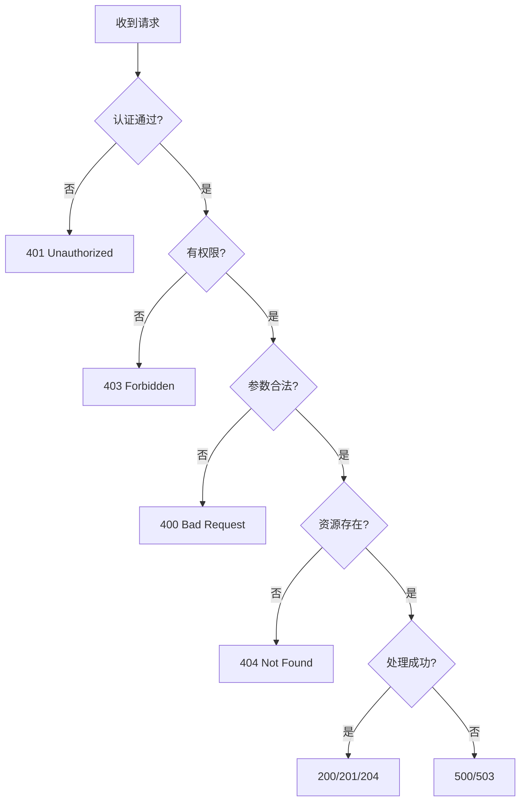
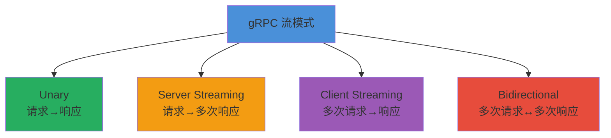
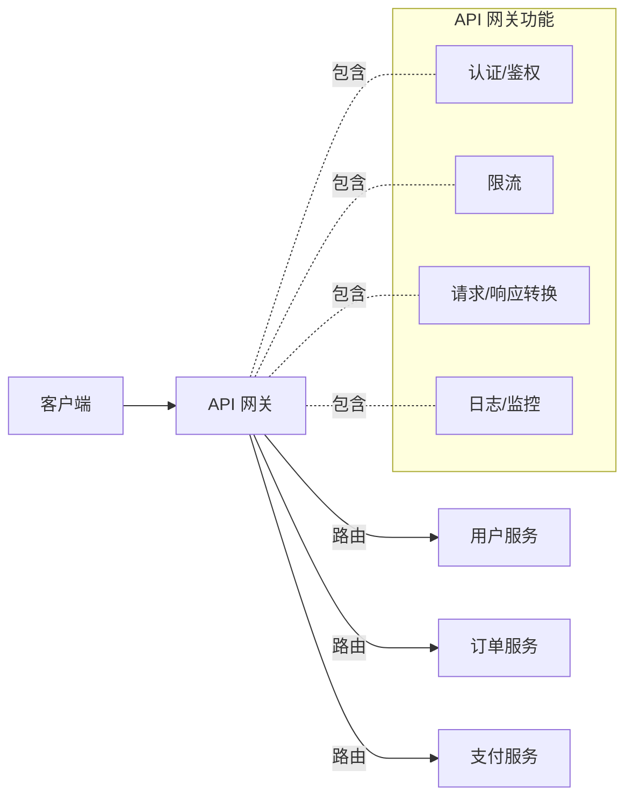

API（Application Programming Interface）是软件系统的契约。设计良好的 API 能降低集成成本、提升开发效率、支持系统的持续演进；而设计糟糕的 API 则会导致集成困难、维护成本高昂、最终被迫破坏性变更。

## 一、API 设计核心原则

### 1. 一致性（Consistency）

- **命名一致**：资源命名遵循统一规范（如全部使用复数名词）
- **结构一致**：响应格式统一（如 `{ "data": ..., "error": ... }`）
- **行为一致**：相同操作在所有资源上的行为一致

### 2. 简洁性（Simplicity）

- 最小惊讶原则：API 的行为应符合调用者的直觉
- 避免过度嵌套：资源层级不超过 2-3 层
- 默认值合理：减少调用者必须提供的参数

### 3. 向后兼容（Backward Compatibility）

- 新增字段不影响已有调用者
- 删除字段需经过废弃期（Deprecation Period）
- 使用版本管理策略控制破坏性变更

### 4. 明确的错误处理

- 使用标准 HTTP 状态码
- 提供结构化的错误响应
- 错误信息对开发者友好（而非仅内部错误码）

## 二、RESTful API 设计规范

### 资源命名

```
✅ 正确
GET    /users              # 获取用户列表
GET    /users/123          # 获取单个用户
POST   /users              # 创建用户
PUT    /users/123          # 全量更新用户
PATCH  /users/123          # 部分更新用户
DELETE /users/123          # 删除用户

❌ 错误（动词命名）
GET    /getUsers
POST   /createUser
POST   /deleteUser
```

**规则**：
- 使用名词而非动词
- 使用复数形式
- 连字符 `-` 而非下划线 `_` 分隔单词
- 层级关系不超过 3 层：`/users/123/orders`

### HTTP 方法语义

| 方法 | 语义 | 幂等性 | 安全性 |
|------|------|--------|--------|
| **GET** | 获取资源 | ✅ 是 | ✅ 是 |
| **POST** | 创建资源 | ❌ 否 | ❌ 否 |
| **PUT** | 全量替换 | ✅ 是 | ❌ 否 |
| **PATCH** | 部分更新 | ❌ 否 | ❌ 否 |
| **DELETE** | 删除资源 | ✅ 是 | ❌ 否 |

### HTTP 状态码使用

| 状态码 | 含义 | 使用场景 |
|--------|------|---------|
| **200 OK** | 成功 | GET/PUT/PATCH 成功 |
| **201 Created** | 已创建 | POST 创建资源成功 |
| **204 No Content** | 无内容 | DELETE 成功 |
| **400 Bad Request** | 请求错误 | 参数校验失败 |
| **401 Unauthorized** | 未认证 | 缺少或无效的认证信息 |
| **403 Forbidden** | 无权限 | 已认证但无操作权限 |
| **404 Not Found** | 资源不存在 | 请求的资源不存在 |
| **409 Conflict** | 冲突 | 资源状态冲突（如重复创建） |
| **422 Unprocessable Entity** | 语义错误 | 请求格式正确但业务逻辑失败 |
| **429 Too Many Requests** | 请求过多 | 触发限流 |
| **500 Internal Server Error** | 服务器错误 | 未预期的内部错误 |



### 分页、过滤、排序

```
# 分页
GET /users?page=2&limit=20

# 过滤
GET /users?status=active&role=admin

# 排序
GET /users?sort=created_at&order=desc

# 字段选择
GET /users?fields=id,name,email

# 搜索
GET /users?q=alice
```

### 响应格式设计

```json
{
  "data": {
    "id": "usr_123",
    "name": "Alice",
    "email": "alice@example.com",
    "created_at": "2026-04-18T10:00:00Z"
  },
  "meta": {
    "request_id": "req_abc123"
  }
}
```

列表响应：

```json
{
  "data": [
    { "id": "usr_123", "name": "Alice" },
    { "id": "usr_456", "name": "Bob" }
  ],
  "meta": {
    "pagination": {
      "page": 2,
      "limit": 20,
      "total": 150,
      "has_next": true
    }
  }
}
```

## 三、API 版本管理策略

| 策略 | 示例 | 优点 | 缺点 |
|------|------|------|------|
| **URL 版本** | `/api/v1/users` | 简单明了，易于理解 | URL 不优雅 |
| **Header 版本** | `Accept: application/vnd.api.v1+json` | URL 干净 | 不够直观 |
| **Query 参数** | `/api/users?version=1` | 灵活 | 容易被忽略 |
| **内容协商** | `Accept-Version: v1` | RESTful | 实现复杂 |

**推荐策略**：使用 URL 版本（`/api/v1/`），因为它最直观、最容易被工具和开发者理解。

### 版本演进策略


## 四、错误响应设计

### 标准错误格式

```json
{
  "error": {
    "code": "VALIDATION_ERROR",
    "message": "请求参数验证失败",
    "details": [
      {
        "field": "email",
        "message": "邮箱格式无效"
      },
      {
        "field": "password",
        "message": "密码长度至少为8个字符"
      }
    ],
    "request_id": "req_abc123",
    "documentation_url": "https://docs.example.com/errors/VALIDATION_ERROR"
  }
}
```

### 错误码体系设计

| 错误码前缀 | 类别 | 示例 |
|-----------|------|------|
| `AUTH_*` | 认证授权 | `AUTH_TOKEN_EXPIRED` |
| `VALIDATION_*` | 参数校验 | `VALIDATION_EMAIL_INVALID` |
| `RESOURCE_*` | 资源操作 | `RESOURCE_NOT_FOUND` |
| `BUSINESS_*` | 业务规则 | `BUSINESS_INSUFFICIENT_BALANCE` |
| `RATE_LIMIT_*` | 限流 | `RATE_LIMIT_EXCEEDED` |
| `INTERNAL_*` | 内部错误 | `INTERNAL_SERVER_ERROR` |

## 五、gRPC 与 Protocol Buffers

### 为什么选择 gRPC？

| 维度 | REST/JSON | gRPC/Protobuf |
|------|-----------|---------------|
| **序列化** | JSON（文本） | Protobuf（二进制） |
| **性能** | 较慢 | 快 5-10 倍 |
| **大小** | 较大 | 小 3-10 倍 |
| **类型安全** | 弱 | 强（编译期检查） |
| **流式支持** | 有限 | 原生支持（4种流模式） |
| **代码生成** | 手动 | 自动生成客户端/服务端 |

### Protobuf IDL 定义

```protobuf
syntax = "proto3";

package user.v1;

service UserService {
  rpc GetUser(GetUserRequest) returns (GetUserResponse);
  rpc ListUsers(ListUsersRequest) returns (stream User);          // 服务端流
  rpc CreateUser(stream CreateUserRequest) returns (User);        // 客户端流
  rpc SyncUsers(stream SyncRequest) returns (stream SyncResponse); // 双向流
}

message User {
  string id = 1;
  string name = 2;
  string email = 3;
  UserRole role = 4;
  google.protobuf.Timestamp created_at = 5;
}

enum UserRole {
  ROLE_UNSPECIFIED = 0;
  ROLE_ADMIN = 1;
  ROLE_USER = 2;
}

message GetUserRequest {
  string id = 1;
}

message GetUserResponse {
  User user = 1;
}

message ListUsersRequest {
  int32 page_size = 1;
  string page_token = 2;
}
```

### gRPC 的四种流模式



## 六、GraphQL

### 解决什么问题？

| 问题 | REST | GraphQL |
|------|------|---------|
| **过度获取（Over-fetching）** | 返回所有字段 | 只请求需要的字段 |
| **获取不足（Under-fetching）** | 需要多次请求 | 一次请求获取所有关联数据 |
| **版本管理** | URL 版本 | Schema 演进 |
| **文档** | 需要额外工具 | 内省自带文档 |

### GraphQL 查询示例

```graphql
# 查询：只获取需要的字段
query GetUser($id: ID!) {
  user(id: $id) {
    name
    email
    orders(status: ACTIVE) {
      id
      total
      items {
        name
        price
      }
    }
  }
}

# 变更
mutation CreateOrder($input: CreateOrderInput!) {
  createOrder(input: $input) {
    id
    status
  }
}
```

## 七、API 文档

### OpenAPI/Swagger

```yaml
openapi: "3.0.3"
info:
  title: User API
  version: "1.0.0"
paths:
  /users:
    get:
      summary: 获取用户列表
      parameters:
        - name: page
          in: query
          schema: { type: integer, default: 1 }
        - name: limit
          in: query
          schema: { type: integer, default: 20 }
      responses:
        "200":
          description: 成功
          content:
            application/json:
              schema:
                $ref: "#/components/schemas/UserList"
        "401":
          description: 未认证
components:
  schemas:
    User:
      type: object
      properties:
        id: { type: string }
        name: { type: string }
        email: { type: string, format: email }
```

## 八、API 网关与限流



### 限流算法

| 算法 | 原理 | 特点 |
|------|------|------|
| **固定窗口** | 每个时间窗口固定计数 | 简单，但窗口边界可能突发 |
| **滑动窗口** | 滑动时间窗口计数 | 更平滑，内存开销稍大 |
| **令牌桶** | 令牌按速率填充，请求消费令牌 | 允许突发，广泛应用 |
| **漏桶** | 请求以固定速率处理 | 严格限速，不允许突发 |

## 九、API 设计反模式

| 反模式 | 问题 | 正确做法 |
|--------|------|---------|
| **RPC 风格的 REST** | `/api/getUser`、`/api/createOrder` | 使用资源命名 + HTTP 方法 |
| **过度嵌套资源** | `/users/123/orders/456/items/789/details` | 扁平化：`/order-items/789` |
| **非标准状态码** | 用 200 返回所有结果，错误信息在 body 中 | 使用正确的 HTTP 状态码 |
| **缺少分页** | 一次性返回全部数据 | 强制分页，限制最大 pageSize |
| **不一致的命名** | `/users` 和 `/getOrders` 混用 | 统一使用复数名词 |
| **破坏性变更无版本** | 直接修改 API 行为 | 使用版本管理，提供迁移期 |
| **暴露内部结构** | 返回数据库字段名和内部 ID | 使用 DTO 层转换 |

## 十、面试 Q&A

### Q1: RESTful API 的核心约束有哪些？

**A**: REST 的六大约束：
1. **客户端-服务器**：关注点分离
2. **无状态**：每个请求包含所有必要信息
3. **可缓存**：响应可被缓存以提升性能
4. **统一接口**：资源标识、表述自描述、HATEOAS
5. **分层系统**：客户端不直接与最终服务器通信
6. **按需代码**（可选）：服务器可下发可执行代码

### Q2: PUT 和 PATCH 的区别是什么？

**A**: `PUT` 是全量替换，需要提供资源的完整表示，未提供的字段会被置空或忽略；`PATCH` 是部分更新，只提供需要修改的字段。实践中，`PUT` 适用于整体替换场景，`PATCH` 适用于部分修改场景。

### Q3: 如何保证 API 的向后兼容性？

**A**:
- 只添加新字段/端点，不删除或修改已有字段
- 新字段设置合理的默认值
- 废弃字段标记 `deprecated`，提供迁移指南
- 使用版本号管理破坏性变更
- 在 Schema 中明确标注可选/必填字段
- 通过消费者驱动的契约测试验证兼容性

### Q4: gRPC 和 REST 应该如何选择？

**A**:
- **内部服务间通信**：优先 gRPC（高性能、强类型）
- **面向外部的公开 API**：优先 REST（通用性、易调试）
- **移动端/弱网环境**：考虑 gRPC（体积小、HTTP/2 多路复用）
- **需要浏览器直接调用**：REST 或 gRPC-Web
- **实时流式数据**：gRPC 的流模式更优雅

### Q5: 如何设计 API 的限流策略？

**A**: 
- 基于令牌桶或滑动窗口算法
- 不同用户等级不同限流阈值（免费/付费/企业）
- 在响应头中返回限流信息：`X-RateLimit-Limit`、`X-RateLimit-Remaining`、`X-RateLimit-Reset`
- 触发限流时返回 429 状态码和 `Retry-After` 头
- 在 API 网关层统一实施

### Q6: 什么是 HATEOAS？为什么它不常用？

**A**: HATEOAS（Hypermedia As The Engine Of Application State）是 REST 成熟度模型的最高级别（Level 3）。它要求 API 响应中包含指向相关资源的链接，让客户端通过链接发现可用操作。虽然理论上优雅，但实际中增加了响应大小和客户端复杂度，大多数 API 停留在 Level 2（使用 HTTP 方法操作资源）。

---

> **总结**：优秀的 API 设计是一门平衡的艺术——在灵活性与一致性、简洁性与表达力、创新性与向后兼容之间找到最佳平衡点。遵循 RESTful 原则、做好版本管理、提供清晰的错误信息和文档，是构建可靠 API 的基石。
