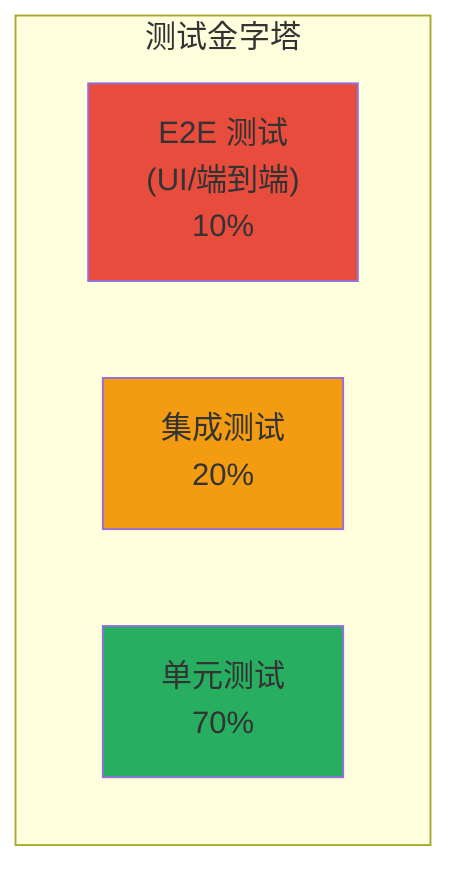
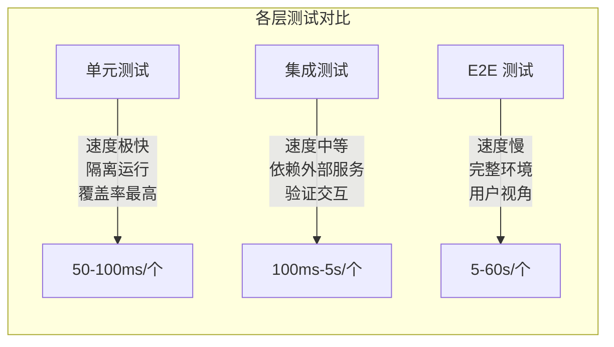
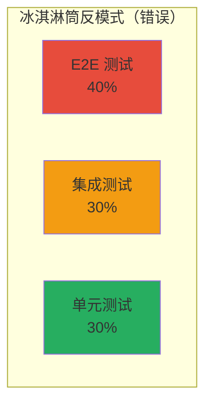
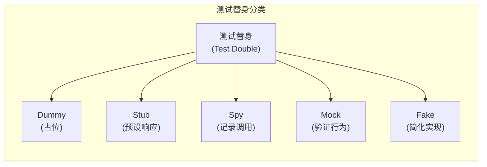
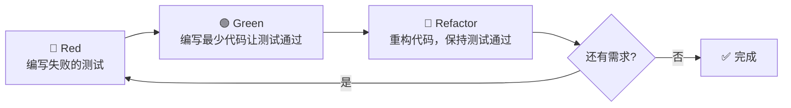
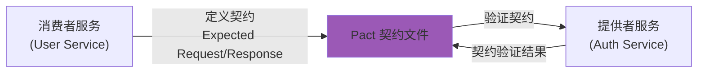

测试是软件工程中最重要的质量保障手段。然而，许多开发者对测试的理解仅停留在"写几个单元测试"的层面。本文将从测试理论到工程实践，系统梳理软件测试的核心方法论。

## 一、测试金字塔

测试金字塔由 Mike Cohn 提出，描述了不同层级测试的理想比例：





### 各层测试的特点

| 维度 | 单元测试 | 集成测试 | E2E 测试 |
|------|---------|---------|---------|
| **测试对象** | 单个函数/方法/类 | 多个组件的交互 | 完整的用户流程 |
| **运行速度** | 极快（ms 级） | 中等（100ms-5s） | 慢（秒到分钟级） |
| **依赖** | 无（使用 Mock） | 部分依赖（DB/网络） | 完整环境 |
| **维护成本** | 低 | 中 | 高 |
| **Bug 定位** | 精确 | 中等 | 困难 |
| **覆盖比例** | ~70% | ~20% | ~10% |
| **工具示例** | Jest, Pytest, JUnit | Testcontainers, Supertest | Cypress, Playwright, Selenium |

### 冰淇淋筒反模式



**问题**：E2E 测试过多导致测试运行缓慢、维护成本高昂、反馈周期过长。应回归金字塔比例。

## 二、单元测试最佳实践

### FIRST 原则

| 原则 | 含义 | 说明 |
|------|------|------|
| **F**ast | 快速 | 单个测试在 100ms 内完成 |
| **I**ndependent | 独立 | 测试之间无依赖，顺序无关 |
| **R**epeatable | 可重复 | 在任何环境运行结果一致 |
| **S**elf-Validating | 自验证 | 测试有明确的通过/失败判断 |
| **T**horough/Timely | 彻底/及时 | 覆盖正常/异常路径；TDD 中先写测试 |

### AAA 模式（Arrange-Act-Assert）

每个单元测试应该清晰地分为三个阶段：

```python
import pytest
from unittest.mock import Mock

class TestOrderService:
    def test_process_order_success(self):
        # Arrange（准备）
        mock_payment = Mock()
        mock_payment.charge.return_value = PaymentResult(success=True, transaction_id="txn_123")
        
        mock_inventory = Mock()
        mock_inventory.check_stock.return_value = True
        
        order = Order(items=[OrderItem("SKU001", 2, 99.99)])
        service = OrderService(payment=mock_payment, inventory=mock_inventory)
        
        # Act（执行）
        result = service.process_order(order)
        
        # Assert（验证）
        assert result.status == OrderStatus.CONFIRMED
        assert result.transaction_id == "txn_123"
        mock_payment.charge.assert_called_once_with(199.98)
        mock_inventory.reserve.assert_called_once_with("SKU001", 2)
    
    def test_process_order_insufficient_stock(self):
        # Arrange
        mock_payment = Mock()
        mock_inventory = Mock()
        mock_inventory.check_stock.return_value = False
        
        order = Order(items=[OrderItem("SKU001", 2, 99.99)])
        service = OrderService(payment=mock_payment, inventory=mock_inventory)
        
        # Act & Assert
        with pytest.raises(InsufficientStockError) as exc_info:
            service.process_order(order)
        
        assert "SKU001" in str(exc_info.value)
        mock_payment.charge.assert_not_called()
```

## 三、Mock、Stub、Fake 的区别

| 类型 | 定义 | 使用场景 | 示例 |
|------|------|---------|------|
| **Stub** | 提供预设的响应 | 需要控制外部依赖的返回值 | 模拟数据库返回固定数据 |
| **Mock** | 验证交互行为 | 需要确认某个方法是否被调用及调用参数 | 验证邮件服务是否被调用 |
| **Fake** | 简化的真实实现 | 需要真实行为但不想依赖外部系统 | 内存数据库替代真实数据库 |
| **Spy** | 部分 Mock，记录调用 | 需要部分真实行为 + 调用记录 | 部分方法用真实实现，部分被监控 |
| **Dummy** | 占位对象 | 方法签名需要但实际不使用 | 构造函数需要的无关参数 |



## 四、测试覆盖率

### 覆盖率类型

| 类型 | 定义 | 示例 |
|------|------|------|
| **行覆盖率** | 被执行的代码行比例 | 100 行代码中执行了 85 行 = 85% |
| **分支覆盖率** | 分支结构中被执行的比例 | if-else 两个分支都执行了 |
| **条件覆盖率** | 布尔表达式中每个子条件的取值 | `(A && B)` 中 A 和 B 都取过 true 和 false |
| **路径覆盖率** | 所有可能的执行路径比例 | 嵌套条件产生的路径组合 |
| **函数覆盖率** | 被调用的函数比例 | 10 个函数中调用了 8 个 = 80% |

```python
def classify_triangle(a, b, c):
    """判断三角形类型"""
    if a <= 0 or b <= 0 or c <= 0:
        return "invalid"
    if a + b <= c or a + c <= b or b + c <= a:
        return "invalid"
    if a == b == c:
        return "equilateral"
    if a == b or b == c or a == c:
        return "isosceles"
    return "scalene"
```

测试用例设计：

| 用例 | a | b | c | 预期结果 | 覆盖 |
|------|---|---|---|---------|------|
| 1 | 3 | 4 | 5 | scalene | 行 + 分支 |
| 2 | 3 | 3 | 3 | equilateral | 等边分支 |
| 3 | 3 | 3 | 5 | isosceles | 等腰分支 |
| 4 | 0 | 4 | 5 | invalid | 无效输入分支 |
| 5 | 1 | 10 | 1 | invalid | 三角形不等式 |

### 覆盖率的陷阱

> **高覆盖率 ≠ 高质量测试**

- 100% 覆盖率不代表没有 Bug（可能断言不完整）
- 追求 100% 覆盖率可能导致测试了不该测试的内容（getter/setter）
- 建议目标：**分支覆盖率 80%+**，关注关键业务逻辑

## 五、TDD（测试驱动开发）

### Red-Green-Refactor 流程



### TDD 实战示例

需求：实现一个 FizzBuzz 函数。

```python
# Step 1: Red - 写测试
def test_returns_number_for_1():
    assert fizzbuzz(1) == "1"

# Step 2: Green - 最简单的实现
def fizzbuzz(n):
    return "1"

# Step 3: Refactor - 通过测试后重构
# 继续写下一个测试...
def test_returns_fizz_for_3():
    assert fizzbuzz(3) == "Fizz"

def test_returns_buzz_for_5():
    assert fizzbuzz(5) == "Buzz"

def test_returns_fizzbuzz_for_15():
    assert fizzbuzz(15) == "FizzBuzz"

# 最终实现
def fizzbuzz(n: int) -> str:
    result = ""
    if n % 3 == 0:
        result += "Fizz"
    if n % 5 == 0:
        result += "Buzz"
    return result or str(n)
```

### TDD 的适用场景

| 场景 | 适合 TDD | 不适合 TDD |
|------|---------|-----------|
| 算法/业务逻辑 | ✅ | |
| UI 组件 | | ❌（先用 E2E） |
| 数据库迁移 | | ❌（先探索性开发） |
| API 端点 | ✅（集成测试） | |
| 遗留代码重构 | ✅（先写特征测试） | |

## 六、集成测试策略

### 测试数据库

```python
import pytest
from sqlalchemy import create_engine
from sqlalchemy.orm import Session

@pytest.fixture
def db_session():
    # 使用内存数据库
    engine = create_engine("sqlite:///:memory:")
    Base.metadata.create_all(engine)
    session = Session(engine)
    yield session
    session.close()

def test_create_user(db_session):
    user = User(name="Alice", email="alice@example.com")
    db_session.add(user)
    db_session.commit()
    
    assert db_session.query(User).filter_by(email="alice@example.com").first() is not None
```

### Testcontainers（真实数据库容器）

```python
import pytest
from testcontainers.postgres import PostgresContainer

@pytest.fixture
def postgres():
    with PostgresContainer("postgres:15") as postgres:
        yield postgres.get_connection_url()

def test_user_repository(postgres):
    engine = create_engine(postgres)
    repo = UserRepository(engine)
    
    user = repo.create(name="Bob", email="bob@example.com")
    assert user.id is not None
    assert repo.get_by_email("bob@example.com").name == "Bob"
```

## 七、契约测试与微服务测试

### 契约测试（Pact）

在微服务架构中，服务之间的接口契约至关重要。



```python
# 消费者端：定义契约
from pact import Consumer, Provider

pact = Consumer("UserConsumer").has_pact_with(Provider("AuthProducer"))

def test_get_user():
    # 定义期望的请求和响应
    pact.given("user exists").upon_receiving("a request for user").with_request(
        "GET", "/users/123"
    ).will_respond_with(200, body={"id": "123", "name": "Alice"})
    
    with pact:
        result = user_client.get_user("123")
        assert result["name"] == "Alice"
```

## 八、性能测试与压力测试

| 测试类型 | 目的 | 工具 |
|---------|------|------|
| **负载测试** | 验证预期负载下的表现 | k6, JMeter, Locust |
| **压力测试** | 找到系统崩溃点 | k6, JMeter |
| **稳定性测试** | 长时间运行的稳定性 | k6, Gatling |
| **峰值测试** | 突发流量的处理能力 | Locust |

### k6 压力测试示例

```javascript
import http from 'k6/http';
import { check, sleep } from 'k6';

export const options = {
  stages: [
    { duration: '30s', target: 20 },   // 30秒内增加到20并发
    { duration: '1m', target: 20 },    // 保持20并发1分钟
    { duration: '30s', target: 50 },   // 增加到50并发
    { duration: '1m', target: 50 },    // 保持50并发
    { duration: '30s', target: 0 },    // 逐渐降到0
  ],
  thresholds: {
    http_req_duration: ['p(95)<500'],  // 95%的请求响应时间<500ms
    http_req_failed: ['rate<0.01'],    // 错误率<1%
  },
};

export default function () {
  const res = http.get('https://api.example.com/users');
  check(res, {
    'status is 200': (r) => r.status === 200,
    'response time < 500ms': (r) => r.timings.duration < 500,
  });
  sleep(1);
}
```

## 九、面试 Q&A

### Q1: 什么是 FIRST 原则？

**A**: FIRST 是高质量单元测试的五个标准：
- **Fast**（快速）：测试应在毫秒级完成，支持频繁运行
- **Independent**（独立）：测试之间无依赖，执行顺序无关
- **Repeatable**（可重复）：在任何环境运行结果一致
- **Self-Validating**（自验证）：有明确的通过/失败判断，不需要人工检查
- **Thorough**（彻底）：覆盖正常路径和异常路径

### Q2: Mock 和 Stub 的区别是什么？

**A**: Stub 用于提供预设的返回值，控制外部依赖的行为；Mock 用于验证交互行为，确认某个方法是否被正确调用。简单说：Stub 关注"返回什么"，Mock 关注"是否被调用"。

### Q3: TDD 的优势和劣势分别是什么？

**A**: 
- **优势**：设计更简洁（只写必要的代码）、测试覆盖度高、减少 Bug、文档化测试、更好的 API 设计
- **劣势**：初期开发速度可能较慢、对 UI 测试不友好、需要学习曲线、不适合探索性开发场景

### Q4: 微服务架构下如何做测试？

**A**: 微服务测试策略：
1. **单元测试**：每个服务的内部逻辑（占 70%）
2. **集成测试**：服务与数据库/缓存的交互（占 20%）
3. **契约测试**：服务之间的接口契约（Pact）
4. **E2E 测试**：关键业务流程的端到端验证（占 10%）
5. **混沌测试**：验证服务容错能力

### Q5: 测试覆盖率多少才算合格？

**A**: 没有绝对标准，但行业建议：
- 业务核心逻辑：**分支覆盖率 80-90%**
- 工具库/框架：**90%+**
- UI 组件/视图层：**50-70%**
关键不在于覆盖率数字，而在于**是否测试了关键业务路径和边界条件**。

### Q6: 如何测试异步代码？

**A**: 
1. **Promise/async-await**：使用 `await` 等待异步操作完成
2. **回调函数**：使用测试框架的 `done` 回调或返回 Promise
3. **事件监听**：使用 Promise 包装事件触发
4. **定时器**：使用虚拟时钟（如 Jest 的 `jest.useFakeTimers()`）
核心原则：确保测试等待异步操作完成后再做断言。

---

> **总结**：测试是软件工程的基石。遵循测试金字塔、掌握 AAA 模式、理解不同测试替身的用途、善用 TDD 和契约测试，可以构建起多层次的质量保障体系。记住：测试的目的不是追求覆盖率数字，而是建立对代码质量的信心。
