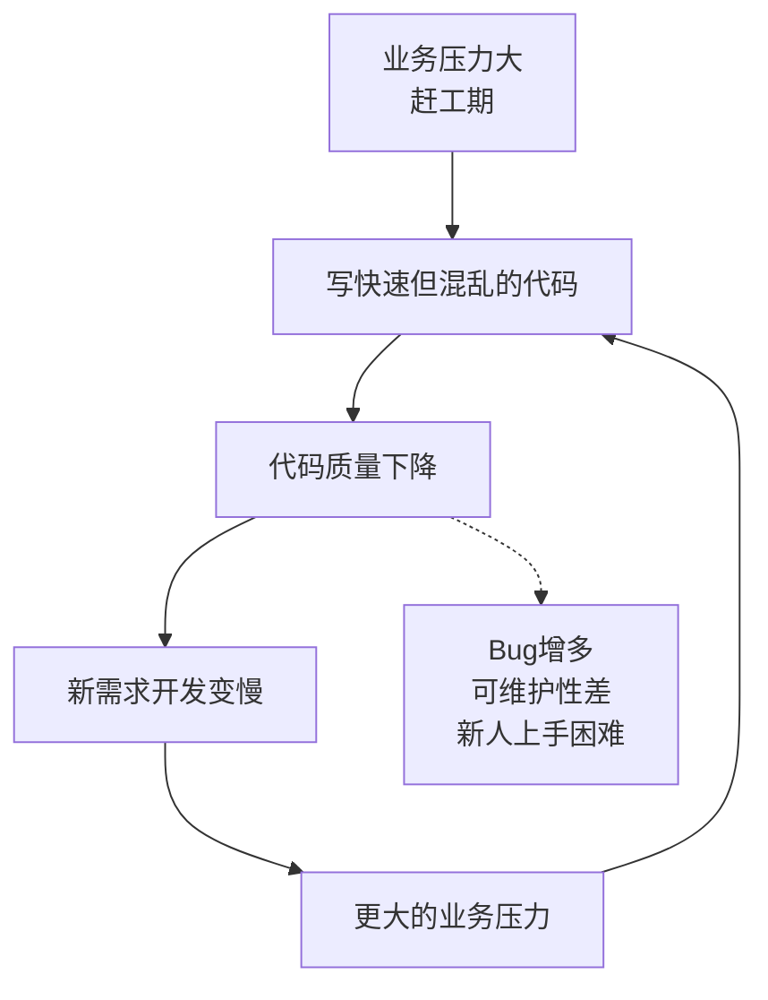
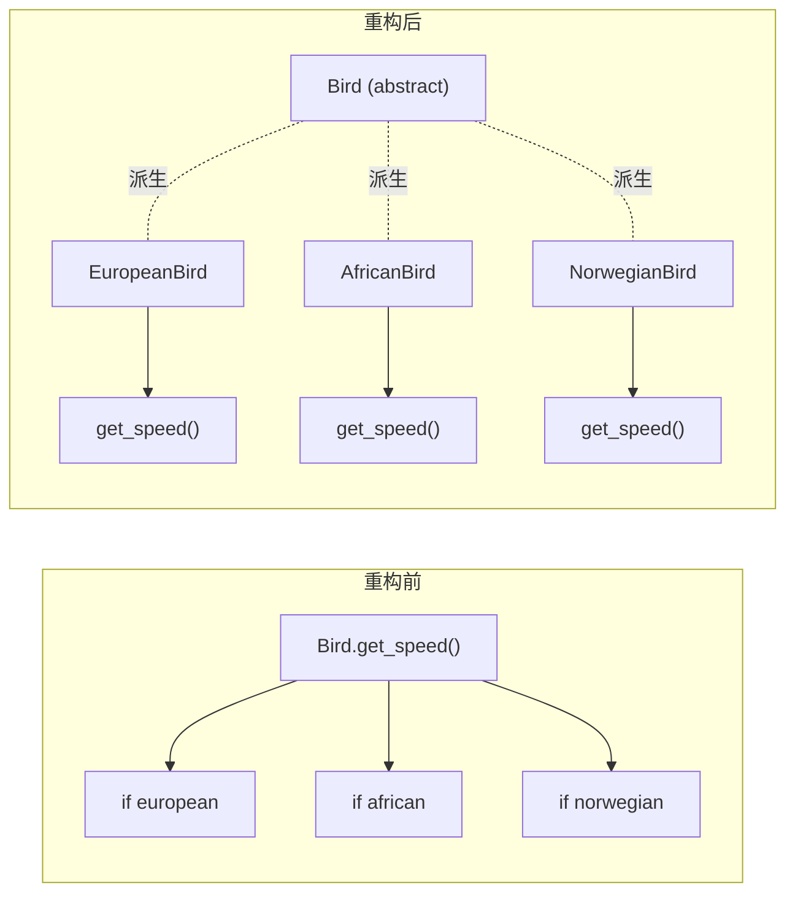
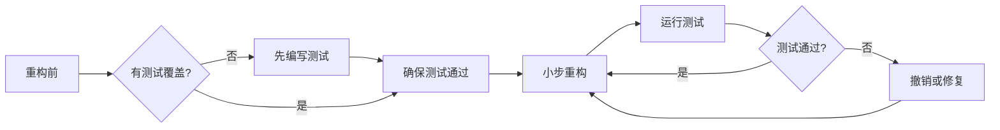
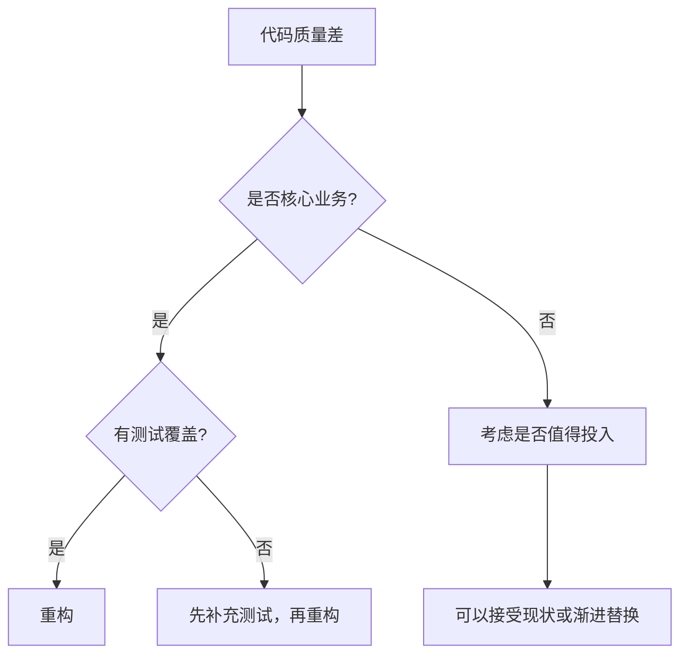

代码重构（Refactoring）是在不改变软件外部行为的前提下，改善代码内部结构的过程。它是优秀工程师的必备技能，也是应对技术债务、保持代码健康度的核心手段。

## 一、为什么要重构

### 技术债务的恶性循环



### 重构的收益

| 收益维度 | 说明 |
|---------|------|
| **可维护性** | 降低理解和修改代码的认知负担 |
| **可扩展性** | 清晰的架构使新功能更容易添加 |
| **Bug 发现** | 重构过程中经常发现隐藏的缺陷 |
| **团队效率** | 好代码减少 Code Review 时间和沟通成本 |
| **知识传递** | 重构后的代码本身就是最好的文档 |

### 演化式设计

> "好的架构不是设计出来的，是演化出来的。" —— 极限编程（XP）

演化式设计强调通过持续重构，让代码结构随着对业务理解的加深而自然演进，而非在开始时就过度设计。

## 二、代码异味（Code Smell）识别

代码异味是代码可能存在问题的信号。以下是常见的代码异味及其识别方法：

### 1. 长函数（Long Method）

函数超过 20-30 行，承担了过多职责。

```python
# 异味代码
def process_order(order):
    # 验证订单
    if not order.items:
        raise ValueError("Empty order")
    if order.total < 0:
        raise ValueError("Invalid total")
    # 计算折扣
    if order.customer.is_vip:
        discount = order.total * 0.1
    elif order.total > 1000:
        discount = order.total * 0.05
    else:
        discount = 0
    # 计算税费
    tax = (order.total - discount) * 0.13
    # 生成订单号
    order_id = f"ORD-{date.today().isoformat()}-{uuid4().hex[:8]}"
    # 保存到数据库
    db.orders.insert({
        "id": order_id,
        "items": order.items,
        "total": order.total - discount + tax,
        "discount": discount,
        "tax": tax,
        "status": "pending"
    })
    # 发送通知
    send_email(order.customer.email, f"Order {order_id} created")
    return order_id
```

### 2. 大类（Large Class）

类文件超过 500 行，承担了过多职责，违反单一职责原则（SRP）。

### 3. 过长参数列表（Long Parameter List）

```python
# 异味：参数过多
def create_user(first_name, last_name, email, phone, 
                address, city, state, zip_code, country, role):
    pass

# 重构后
def create_user(profile: UserProfile, contact: ContactInfo, address: Address):
    pass
```

### 4. 发散式变化（Divergent Change）

一个类因为多种不同原因被修改。例如，一个类既处理数据库操作，又处理 HTTP 响应，还处理业务逻辑。

### 5. 霰弹式修改（Shotgun Surgery）

一个功能的修改需要改动多个类。例如，添加一个新字段需要修改 Model、DTO、Mapper、Service、Controller 等 5 个类。

### 6. 依恋情结（Feature Envy）

一个函数大量使用其他类的数据和方法，而很少使用自己类的成员。

```python
# 异味：calculate_distance 更依赖 Point 的数据
class Rectangle:
    def calculate_distance(self, point: Point) -> float:
        dx = self.center.x - point.x
        dy = self.center.y - point.y
        return math.sqrt(dx * dx + dy * dy)

# 重构后：将方法移到 Point
class Point:
    def distance_to(self, other: Point) -> float:
        dx = self.x - other.x
        dy = self.y - other.y
        return math.sqrt(dx * dx + dy * dy)
```

### 7. 数据泥团（Data Clumps）

经常捆绑出现的数据项应该被组合为对象。

```python
# 异味：这些参数总是一起出现
def register(name, age, email, phone, address, city, zip):
def update_profile(name, age, email, phone, address, city, zip):

# 重构后
class CustomerInfo:
    name: str
    age: int
    email: str
    phone: str
    address: Address

def register(info: CustomerInfo):
def update_profile(info: CustomerInfo):
```

### 代码异味速查表

| 异味 | 症状 | 常见重构手法 |
|------|------|-------------|
| 长函数 | 函数超过 30 行 | 提取方法 |
| 大类 | 类超过 500 行 | 提取类、提取子类 |
| 长参数列表 | 参数超过 4 个 | 引入参数对象 |
| 发散式变化 | 一个类因多种原因被修改 | 拆分类 |
| 霰弹式修改 | 一个改动涉及多个类 | 内联类、移动方法 |
| 依恋情结 | 函数大量使用其他类数据 | 移动方法/字段 |
| 数据泥团 | 多个数据总是一起出现 | 提取类 |
| 过多条件语句 | 长 if-else/switch | 以多态取代条件表达式 |
| 中间人 | 类只做委托工作 | 移除中间人 |

## 三、重构手法详解

### 1. 提取方法（Extract Method）

最常用的重构手法。将代码片段提取为独立方法。

```python
# 重构前
def print_invoice(invoice):
    print(f"Invoice for {invoice.customer}")
    total = 0
    for item in invoice.items:
        total += item.price * item.quantity
    tax = total * 0.13
    print(f"Subtotal: {total}")
    print(f"Tax: {tax}")
    print(f"Total: {total + tax}")

# 重构后
def print_invoice(invoice):
    print(f"Invoice for {invoice.customer}")
    subtotal = calculate_subtotal(invoice.items)
    tax = calculate_tax(subtotal)
    print(f"Subtotal: {subtotal}")
    print(f"Tax: {tax}")
    print(f"Total: {subtotal + tax}")

def calculate_subtotal(items):
    return sum(item.price * item.quantity for item in items)

def calculate_tax(subtotal):
    return subtotal * 0.13
```

### 2. 内联方法（Inline Method）

当方法体和方法名一样清晰时，可以直接内联。

```python
# 重构前
def get_rating(driver):
    return 2 if driver.late_deliveries > 5 else 1

# 重构后（如果函数名没有额外信息）
rating = 2 if driver.late_deliveries > 5 else 1
```

### 3. 移动方法/字段（Move Method/Field）

```python
# 重构前：account 类中的 overdraft_charge 更依赖 account_type
class Account:
    def overdraft_charge(self):
        if self.type == "premium":
            return min(self.days_overdrawn * 1.5, 500)
        elif self.type == "standard":
            return min(self.days_overdrawn * 2.0, 300)

# 重构后：移到 AccountType
class AccountType:
    def overdraft_charge(self, days_overdrawn):
        if self.name == "premium":
            return min(days_overdrawn * 1.5, 500)
        elif self.name == "standard":
            return min(days_overdrawn * 2.0, 300)
```

### 4. 以多态取代条件表达式

```python
# 重构前：使用条件判断
class Bird:
    def get_speed(self):
        if self.type == "european":
            return self.get_base_speed()
        elif self.type == "african":
            return self.get_base_speed() - self.load_factor * self.number_of_coconuts
        elif self.type == "norwegian":
            return 0 if self.is_nailed else self.get_base_speed()

# 重构后：使用多态
class Bird(ABC):
    @abstractmethod
    def get_speed(self) -> float: pass

class EuropeanBird(Bird):
    def get_speed(self): return self.get_base_speed()

class AfricanBird(Bird):
    def get_speed(self): return self.get_base_speed() - self.load_factor * self.number_of_coconuts

class NorwegianBird(Bird):
    def get_speed(self): return 0 if self.is_nailed else self.get_base_speed()
```



### 5. 引入 Null 对象

```python
# 重构前：到处检查 null
class Customer:
    def get_plan(self):
        if self.customer_plan is None:
            return BasicPlan()  # 默认行为
        return self.customer_plan

# 重构后：使用 Null 对象模式
class NullCustomer(Customer):
    def get_plan(self):
        return BasicPlan()
    
    def is_null(self):
        return True
```

### 6. 提取接口

```python
# 重构前：直接依赖具体实现
class PaymentService:
    def __init__(self):
        self.stripe = StripeClient()
    
    def process_payment(self, amount):
        return self.stripe.charge(amount)

# 重构后：依赖接口
class PaymentGateway(ABC):
    @abstractmethod
    def charge(self, amount: float) -> PaymentResult: pass

class StripeGateway(PaymentGateway):
    def charge(self, amount): ...

class AlipayGateway(PaymentGateway):
    def charge(self, amount): ...

class PaymentService:
    def __init__(self, gateway: PaymentGateway):
        self.gateway = gateway
```

## 四、重构与测试的关系

> **没有测试保护的重构 = 盲目修改**



### 测试保护网

- **重构前**：确保目标代码有足够的单元测试覆盖
- **重构中**：每次只做小改动，频繁运行测试
- **重构后**：确认所有测试通过，行为未改变

## 五、持续重构 vs 大爆炸重构

| 维度 | 持续重构 | 大爆炸重构 |
|------|---------|-----------|
| **频率** | 日常开发中持续进行 | 偶尔大规模重构 |
| **风险** | 低（小步快跑） | 高（大量变更） |
| **测试** | 测试始终通过 | 测试长期失败 |
| **Code Review** | 容易审查 | 难以审查 |
| **业务影响** | 无阻塞 | 可能阻塞功能开发 |
| **成功率** | 高 | 低 |

**推荐策略**：将重构融入日常开发流程。在实现新功能时，顺手改进相关代码（童子军规则：离开时比来时更干净）。

## 六、重构的边界

### 何时不该重构

| 场景 | 原因 |
|------|------|
| 重写整个系统 | 风险极高，建议渐进式迁移 |
| 没有测试覆盖的遗留代码 | 先补充测试再重构 |
| 临时代码/原型 | 投入产出比低 |
| 第三方库代码 | Fork 维护成本高 |
| 性能优化瓶颈处 | 先 profiling，再决定策略 |

### 重构 vs 重写



## 七、Clean Code 核心原则

| 原则 | 说明 | 实践 |
|------|------|------|
| **有意义的命名** | 变量名应表达意图 | 用 `daysSinceCreation` 而非 `d` |
| **小函数** | 函数应该只做一件事 | 单函数不超过 20 行 |
| **单一职责** | 一个类只有一个变化原因 | SRP |
| **DRY** | Don't Repeat Yourself | 消除重复代码 |
| **KISS** | Keep It Simple, Stupid | 避免过度设计 |
| **开闭原则** | 对扩展开放，对修改关闭 | 使用多态和接口 |

## 八、面试 Q&A

### Q1: 什么是重构？重构和重写的区别是什么？

**A**: 重构是在不改变外部行为的前提下改善代码内部结构的过程。重写则是从头实现功能。重构是小步迭代、风险可控的；重写是大规模变更、风险较高的。重构保留已有功能和测试，重写可能丢失隐含的业务逻辑。

### Q2: 如何安全地重构没有测试的遗留代码？

**A**: 
1. 先了解代码的行为（阅读代码、手动测试、日志分析）
2. 编写**特征测试**（Characterization Tests）：记录当前行为
3. 从边缘开始重构，逐步深入核心逻辑
4. 每次只做小的改动，确保特征测试仍然通过
5. 使用"绞杀者模式"逐步替换旧代码

### Q3: "以多态取代条件表达式"适用于什么场景？

**A**: 当代码中存在基于类型的条件判断（if-else 或 switch），并且这种判断在多处重复出现时。通过将每种类型抽象为子类，将条件逻辑分布到各个子类的重写方法中，消除了集中式的条件判断，同时使添加新类型时无需修改现有代码（开闭原则）。

### Q4: 重构时如何保证不引入 Bug？

**A**: 
1. 确保有充分的测试覆盖（重构前补测试）
2. 小步重构，每次只做一个改动
3. 频繁运行测试验证
4. 使用 IDE 的自动化重构功能（保证安全性）
5. 及时提交，便于回滚

### Q5: 什么是童子军规则？

**A**: 童子军规则（Boy Scout Rule）来自 Robert C. Martin 的《Clean Code》："离开营地时，要比你到达时更干净。"应用到编程中，意味着每次修改代码时，都顺手做一些小的改进：重命名变量、提取方法、删除无用代码等。通过持续的小改进，代码质量会逐步提升。

### Q6: 什么时候代码"足够好"不需要重构了？

**A**: 当代码满足以下条件时：
- 所有测试通过
- 代码清晰表达了意图
- 没有明显的代码异味
- 符合团队的编码规范
- 能够支撑当前的业务需求
- 添加新功能不需要大幅修改现有代码

记住：追求完美是重构的敌人，"足够好"才是务实的选择。

---

> **总结**：重构是一项需要持续练习的技能。关键在于小步前进、测试保护、持续改进。通过识别代码异味、掌握重构手法、遵循 Clean Code 原则，我们可以让代码库始终保持健康和活力。
