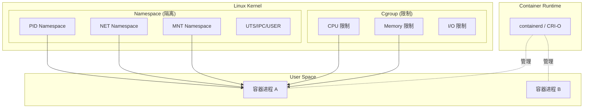
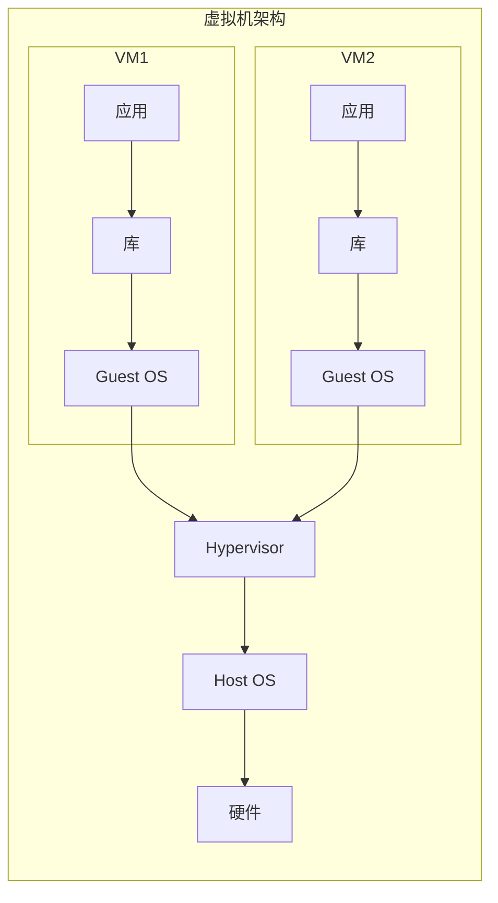
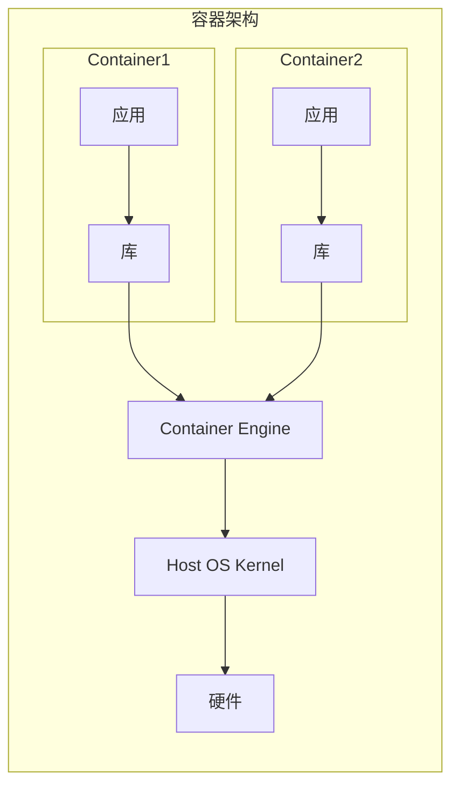
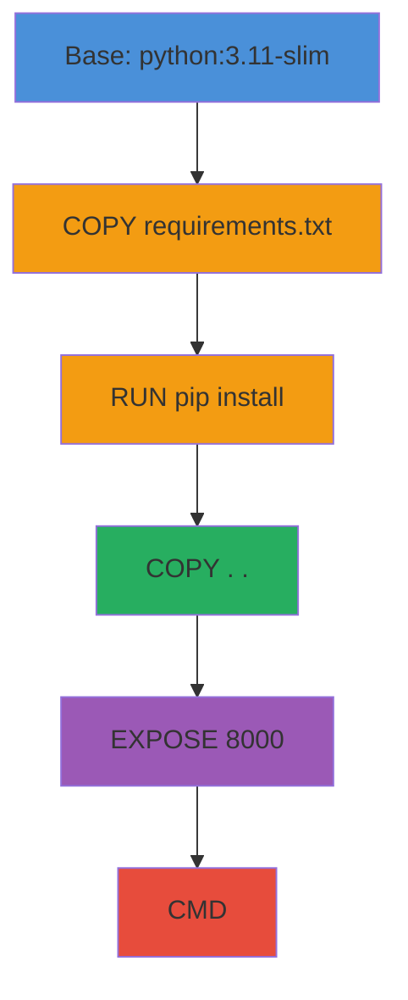
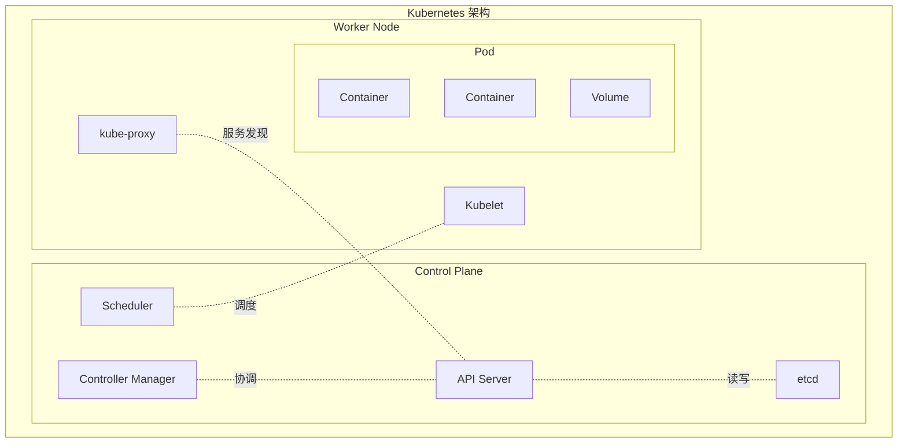
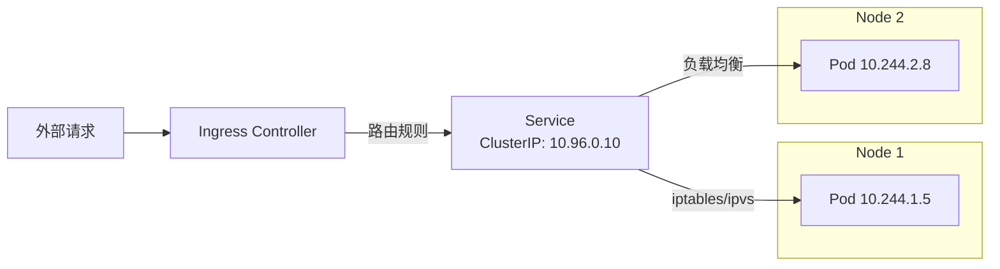

容器技术彻底改变了软件的构建、交付和运行方式。从 Docker 的兴起，到 Kubernetes 成为容器编排的事实标准，这一技术栈已成为现代 DevOps 工程师的核心技能。本文将从底层原理到工程实践，系统梳理容器化与 Kubernetes 的关键知识。

## 一、容器技术的本质

容器并不是什么魔法，它的核心依赖 Linux 内核的两个特性：

### 1. Namespace（命名空间）—— 隔离

Linux Namespace 为进程提供独立的系统资源视图，实现隔离效果：

| Namespace 类型 | 隔离内容 | 对应 `unshare` 参数 |
|---------------|---------|-------------------|
| **PID** | 进程 ID | `--pid` |
| **NET** | 网络栈 | `--net` |
| **MNT** | 文件系统挂载点 | `--mount` |
| **UTS** | 主机名和域名 | `--uts` |
| **IPC** | 进程间通信 | `--ipc` |
| **USER** | 用户和组 ID | `--user` |

### 2. Cgroup（控制组）—— 资源限制

Cgroup 限制和监控进程组的资源使用：

- **CPU**：CPU 份额、配额
- **Memory**：内存上限、OOM 行为
- **I/O**：磁盘读写带宽限制
- **PIDs**：进程数量限制



## 二、容器 vs 虚拟机

| 维度 | 容器 | 虚拟机 |
|------|------|--------|
| **隔离级别** | 进程级（共享内核） | 硬件级（独立内核） |
| **启动时间** | 秒级 | 分钟级 |
| **资源开销** | 极低（MB 级） | 较高（GB 级） |
| **性能损耗** | < 2% | 5-15% |
| **镜像大小** | MB 级（Alpine 仅 5MB） | GB 级 |
| **密度** | 单台机器数百个 | 单台机器数十个 |
| **安全性** | 依赖内核隔离 | 更强的硬件隔离 |





## 三、Docker 镜像分层原理

Docker 镜像由多个只读层（Layer）叠加而成，利用 UnionFS 技术实现：

```dockerfile
# 反例：不好的 Dockerfile
FROM ubuntu:22.04
RUN apt-get update
RUN apt-get install -y python3
RUN apt-get install -y python3-pip
COPY . /app
RUN pip3 install -r /app/requirements.txt
RUN pip3 install flask
CMD ["python3", "/app/main.py"]

# 正例：优化后的 Dockerfile（多阶段构建 + 层合并）
FROM python:3.11-slim AS builder
WORKDIR /build
COPY requirements.txt .
RUN pip install --prefix=/install -r requirements.txt

FROM python:3.11-slim
WORKDIR /app
COPY --from=builder /install /usr/local
COPY --chown=nobody:nogroup . .
USER nobody
EXPOSE 8000
CMD ["python", "main.py"]
```

### Dockerfile 最佳实践

1. **使用精简基础镜像**：优先选择 `alpine` 或 `slim` 版本
2. **多阶段构建**：构建阶段和运行阶段分离，减小最终镜像体积
3. **合并 RUN 指令**：减少镜像层数
4. **使用 `.dockerignore`**：排除不必要的文件（`.git`、`node_modules`、`.env`）
5. **指定明确版本**：不使用 `latest` 标签，确保可重现性
6. **非 root 用户运行**：安全性最佳实践



## 四、Docker 网络模式

| 模式 | 说明 | 使用场景 |
|------|------|---------|
| **bridge** | 默认模式，容器通过网桥通信 | 单机容器互联 |
| **host** | 容器直接使用宿主机网络 | 高性能场景 |
| **none** | 无网络 | 完全隔离的场景 |
| **overlay** | 跨主机容器网络 | Swarm/K8s 集群 |
| **container** | 共享其他容器的网络命名空间 | Sidecar 模式 |

## 五、Kubernetes 核心概念

### 核心资源对象



| 资源 | 作用 | 关键特性 |
|------|------|---------|
| **Pod** | 最小部署单元，包含一个或多个容器 | 共享网络命名空间、存储卷 |
| **Service** | 服务发现与负载均衡 | ClusterIP / NodePort / LoadBalancer |
| **Deployment** | 声明式部署管理 | 滚动更新、回滚、副本管理 |
| **ConfigMap** | 非敏感配置 | 环境变量、配置文件注入 |
| **Secret** | 敏感配置 | Base64 编码、加密存储 |
| **Ingress** | 七层路由 | HTTP/HTTPS 路由、TLS 终止 |
| **PersistentVolume** | 持久化存储 | 独立于 Pod 生命周期 |

### Kubernetes 网络模型



Kubernetes 网络三大保证：
1. 每个 Pod 拥有唯一 IP 地址
2. Pod 间可直接通信（无需 NAT）
3. 节点与 Pod 间可直接通信

## 六、Helm 包管理

Helm 是 Kubernetes 的包管理器，使用 Chart 模板化部署配置：

```
my-chart/
├── Chart.yaml          # 元信息
├── values.yaml         # 默认配置值
├── charts/             # 依赖的子 Chart
└── templates/          # Kubernetes 资源模板
    ├── deployment.yaml
    ├── service.yaml
    └── ingress.yaml
```

```bash
# 安装 Chart
helm install my-release ./my-chart --set replicaCount=3

# 升级
helm upgrade my-release ./my-chart -f values-prod.yaml

# 回滚
helm rollback my-release 1
```

## 七、CI/CD 流水线设计

### GitHub Actions 示例

```yaml
name: CI/CD Pipeline
on:
  push:
    branches: [main]
  pull_request:
    branches: [main]

jobs:
  test:
    runs-on: ubuntu-latest
    steps:
      - uses: actions/checkout@v4
      - uses: actions/setup-node@v4
        with: { node-version: '20' }
      - run: npm ci
      - run: npm test
      - run: npm run build

  build-and-push:
    needs: test
    if: github.ref == 'refs/heads/main'
    runs-on: ubuntu-latest
    steps:
      - uses: actions/checkout@v4
      - uses: docker/setup-buildx-action@v3
      - uses: docker/login-action@v3
        with: { registry: ghcr.io }
      - run: |
          docker buildx build --push \
            -t ghcr.io/${{ github.repository }}:${{ github.sha }} \
            --cache-from type=gha \
            --cache-to type=gha,mode=max .

  deploy:
    needs: build-and-push
    runs-on: ubuntu-latest
    steps:
      - uses: azure/setup-kubectl@v3
      - run: |
          kubectl set image deployment/app \
            app=ghcr.io/${{ github.repository }}:${{ github.sha }}
```

### GitLab CI 示例

```yaml
stages: [test, build, deploy]

test:
  stage: test
  image: node:20
  script: [npm ci, npm test, npm run build]

build:
  stage: build
  image: docker:24
  script:
    - docker build -t $CI_REGISTRY_IMAGE:$CI_COMMIT_SHA .
    - docker push $CI_REGISTRY_IMAGE:$CI_COMMIT_SHA
  only: [main]

deploy:
  stage: deploy
  image: bitnami/kubectl:latest
  script:
    - kubectl set image deployment/app app=$CI_REGISTRY_IMAGE:$CI_COMMIT_SHA
  only: [main]
```

## 八、容器安全最佳实践

| 安全措施 | 说明 |
|---------|------|
| **最小镜像** | 使用 distroless/alpine，减少攻击面 |
| **非 root 运行** | `USER nobody`，避免容器逃逸后获得 root 权限 |
| **只读文件系统** | `readOnlyRootFilesystem: true` |
| **资源限制** | 设置 requests/limits，防止 DoS |
| **镜像签名** | Cosign/Notary 验证镜像完整性 |
| **漏洞扫描** | Trivy/Grype 扫描镜像 CVE |
| **网络策略** | NetworkPolicy 限制 Pod 间通信 |
| **Secret 管理** | 使用外部 Secret 管理器（Vault、AWS Secrets Manager） |

## 九、面试 Q&A

### Q1: 容器和虚拟机的根本区别是什么？

**A**: 容器共享宿主机的 Linux 内核，通过 Namespace 实现隔离、Cgroup 实现资源限制；虚拟机则通过 Hypervisor 模拟完整的硬件环境，每个 VM 运行独立的 Guest OS。因此容器更轻量、启动更快，但隔离性不如虚拟机。

### Q2: Docker 镜像分层有什么意义？

**A**: 分层实现了缓存和复用。相同的基础层或依赖层在多个镜像间共享，节省存储空间和传输带宽。构建时，未修改的层直接从缓存加载，加速构建过程。这也是多阶段构建能减小镜像体积的原因——最终镜像只包含运行时所需的层。

### Q3: Kubernetes 中 Pod 和 Container 的关系是什么？

**A**: Pod 是 Kubernetes 的最小调度单元，一个 Pod 可以包含一个或多个 Container。Pod 内的容器共享网络命名空间（相同的 IP 和端口空间）、IPC 命名空间和存储卷。最常见的模式是 Sidecar 模式：主容器运行业务逻辑，Sidecar 容器提供日志收集、代理、配置刷新等辅助功能。

### Q4: Kubernetes Service 有哪几种类型？

**A**:
- **ClusterIP**（默认）：集群内部可访问的虚拟 IP
- **NodePort**：在每个节点上开放一个端口，外部可通过 `<NodeIP>:<NodePort>` 访问
- **LoadBalancer**：在云平台上创建外部负载均衡器
- **ExternalName**：通过 CNAME 记录将 Service 映射到外部域名

### Q5: 如何实现 Kubernetes 的滚动更新和回滚？

**A**: Deployment 默认使用滚动更新策略。通过 `kubectl set image deployment/<name> <container>=<new-image>` 触发更新。可通过 `strategy.rollingUpdate` 配置 `maxSurge` 和 `maxUnavailable` 控制更新节奏。回滚使用 `kubectl rollout undo deployment/<name>`，可通过 `--to-revision` 指定回滚到特定版本。

### Q6: 什么是 Sidecar 模式？举例说明。

**A**: Sidecar 模式是在同一个 Pod 中运行辅助容器，与主容器协同工作。常见场景：
- **日志收集**：Fluentd Sidecar 收集主容器日志
- **服务网格**：Istio 的 Envoy Proxy 拦截所有流量
- **配置刷新**：定期拉取最新配置并写入共享 Volume
- **代理**：数据库连接池代理、API 网关代理

---

> **总结**：容器技术通过 Namespace 和 Cgroup 实现了轻量级的进程隔离，Docker 让容器变得易用，而 Kubernetes 则解决了大规模容器编排的复杂问题。理解底层原理有助于在面对问题时做出正确的架构决策。
