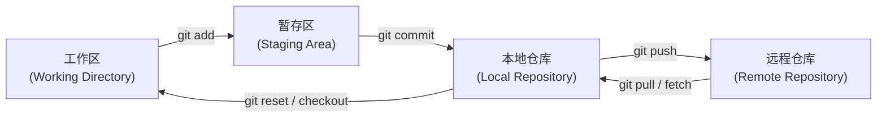
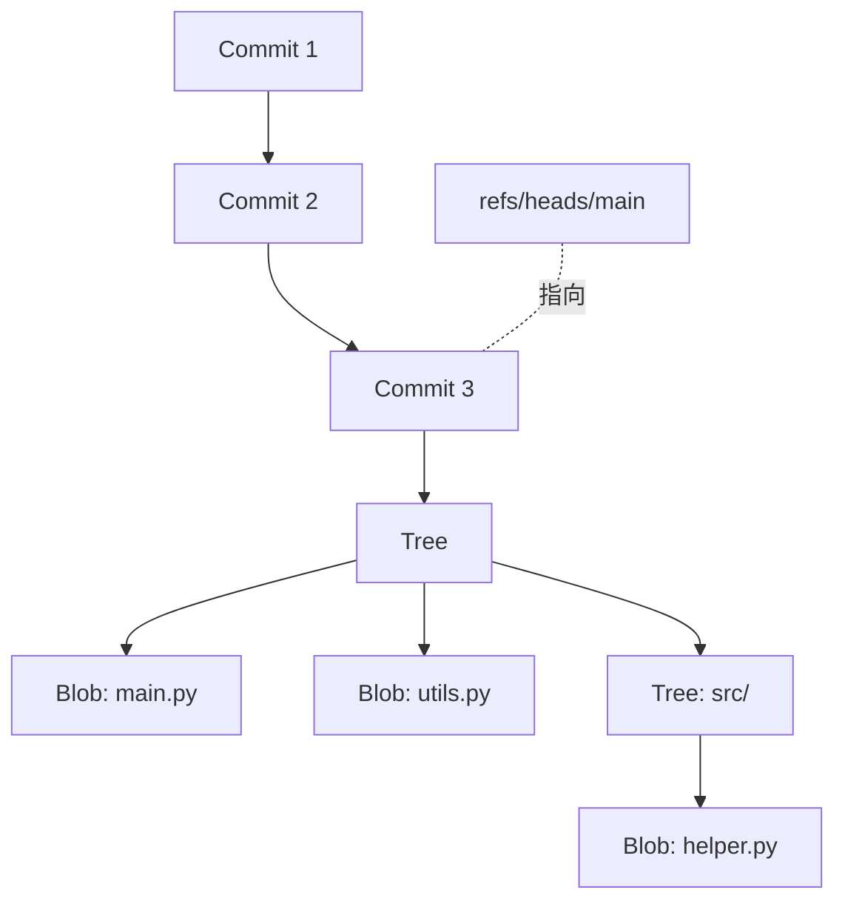
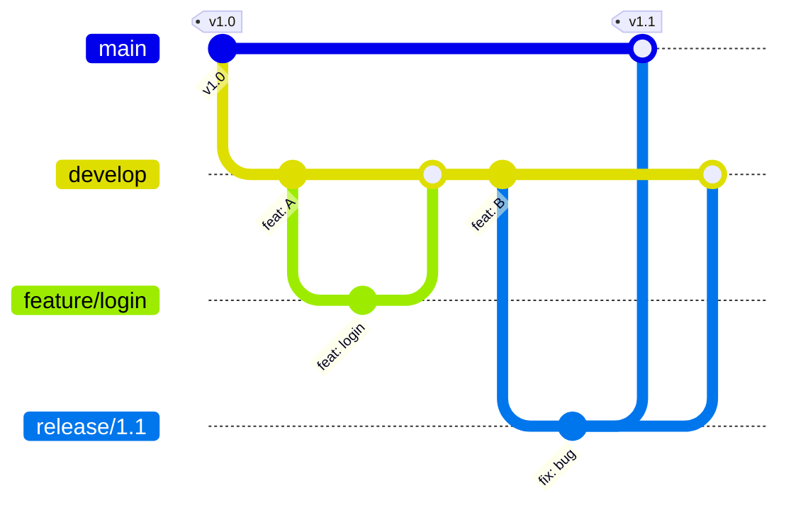
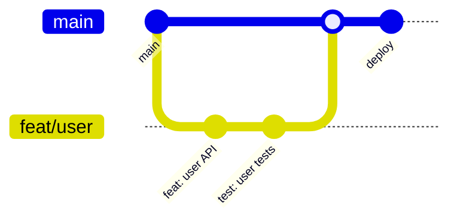
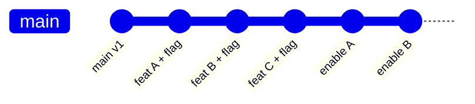
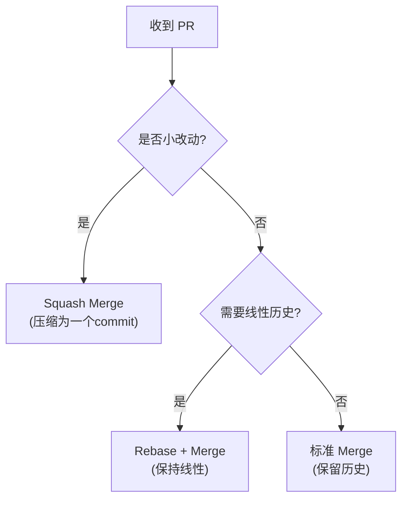
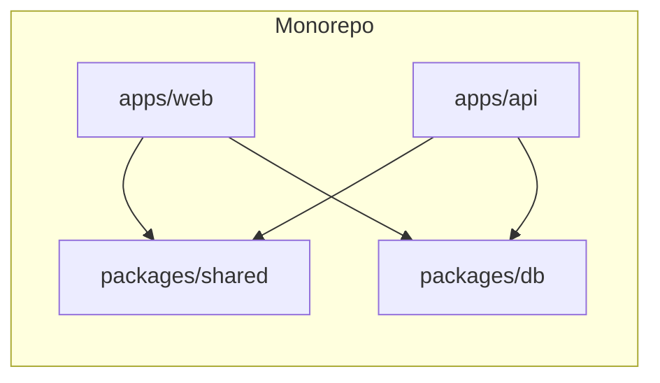

在团队协作开发中，Git 是最核心的基础设施之一。然而，许多团队仅仅停留在 `git add`、`git commit`、`git push` 的层面，并没有真正利用好 Git 提供的协作能力。本文将从工程实践出发，系统梳理 Git 工作流、代码评审、Commit 规范以及 Monorepo 架构等关键主题。

## 一、Git 核心概念回顾

理解 Git 的本质，是高效使用它的前提。Git 的架构可以概括为四个区域：

```
工作区(Working Directory) → 暂存区(Staging Area/Index) → 本地仓库(Local Repository) → 远程仓库(Remote Repository)
```



- **工作区**：开发者直接编辑代码的目录
- **暂存区（Index）**：一个中间区域，记录哪些文件的哪些改动将被包含在下一次提交中
- **本地仓库**：`.git` 目录，包含所有提交历史、分支引用等
- **远程仓库**：GitHub、GitLab 等平台上的仓库副本

### 底层对象模型

Git 的核心是一个键值存储系统，基于四种对象类型构建：

| 对象类型 | 说明 | 类比 |
|---------|------|------|
| **Blob** | 文件内容的二进制大对象 | 文件内容本身 |
| **Tree** | 目录结构，包含文件名和 Blob/Tree 的引用 | 文件夹 |
| **Commit** | 提交记录，包含 Tree 引用、父 Commit、作者信息 | 版本快照 |
| **Tag** | 对某个 Commit 的命名引用 | 书签 |



## 二、三种主流 Git 工作流

### 1. GitFlow

GitFlow 由 Vincent Driessen 在 2010 年提出，是最经典的工作流模型。

**分支模型**：
- `main`：生产环境代码
- `develop`：开发集成分支
- `feature/*`：从 develop 拉取的功能分支
- `release/*`：发布准备分支
- `hotfix/*`：从 main 拉取的紧急修复分支



**适用场景**：传统软件发布、有固定版本周期的项目。

**缺点**：分支管理复杂，不适合持续部署场景。

### 2. GitHub Flow

GitHub Flow 是 GitFlow 的简化版，核心规则只有两条：

1. `main` 分支永远可部署
2. 所有改动通过 Pull Request 合并



**适用场景**：Web 应用、持续部署、SaaS 产品。

### 3. Trunk-Based Development（主干开发）

主干开发要求开发者频繁向 `main` 分支提交代码（通常每天多次），配合特性开关（Feature Flag）管理未完成功能。



**适用场景**：高频发布（日/周级）、成熟的 CI/CD 体系、大型工程团队（Google、Facebook 采用此模式）。

### 工作流选择指南

| 维度 | GitFlow | GitHub Flow | Trunk-Based |
|------|---------|-------------|-------------|
| 发布频率 | 周/月 | 日/周 | 日/多次 |
| 分支复杂度 | 高 | 低 | 极低 |
| CI/CD 要求 | 低 | 中 | 高 |
| 团队规模 | 中小型 | 中小型 | 大型 |
| 特性开关 | 不强制 | 推荐 | 必须 |

## 三、代码评审（Code Review）最佳实践

### 核心原则

1. **小批量 PR**：每个 PR 不超过 400 行代码变更，理想状态是 200 行以内
2. **明确评审清单**：
   - 功能正确性
   - 代码可读性
   - 安全性（SQL 注入、XSS 等）
   - 性能影响
   - 测试覆盖度
3. **建设性反馈**：使用建议性语言，避免命令式措辞

```
❌ "你这个变量名不对，改成 userId"
✅ "建议将变量名改为 userId，这样更符合语义"
```

### 评审效率数据

研究表明，代码评审的最佳节奏是：

| 指标 | 推荐值 |
|------|--------|
| 单次评审代码量 | 200-400 行 |
| 评审速度 | < 50 行/分钟 |
| PR 响应时间 | < 24 小时 |
| 合并前评论数 | 3-8 条 |

## 四、Commit 规范：Conventional Commits

Conventional Commits 规范定义了统一的提交信息格式：

```
<type>[optional scope]: <description>

[optional body]

[optional footer(s)]
```

### Type 类型一览

| Type | 说明 | 示例 |
|------|------|------|
| `feat` | 新功能 | `feat(auth): add OAuth2 login` |
| `fix` | 修复 Bug | `fix(api): handle null response` |
| `docs` | 文档变更 | `docs(readme): update install guide` |
| `style` | 代码格式 | `style: format with prettier` |
| `refactor` | 重构 | `refactor(utils): simplify date parser` |
| `test` | 测试相关 | `test(auth): add login test cases` |
| `chore` | 构建/工具 | `chore: upgrade eslint to v8` |

### Breaking Change 标记

```
feat(api)!: remove deprecated v1 endpoints

BREAKING CHANGE: /api/v1/* endpoints have been removed.
Please migrate to /api/v2/*.
```

## 五、Merge vs Rebase vs Squash

| 操作 | 特点 | 适用场景 |
|------|------|---------|
| **Merge** | 保留完整历史，创建 merge commit | 功能分支合并到主分支 |
| **Rebase** | 线性历史，重写提交记录 | 同步主分支更新到功能分支 |
| **Squash** | 多个提交合并为一个 | PR 合并时清理中间提交 |



## 六、Monorepo vs Polyrepo

### Monorepo 优势

- **统一版本管理**：所有包使用一致的版本策略
- **原子提交**：跨包修改可以在一个 Commit 中完成
- **代码共享**：无需发布中间包即可复用代码
- **统一工具链**：CI/CD、Lint、测试配置集中管理

### Polyrepo 优势

- **权限隔离**：每个仓库可以独立设置访问控制
- **独立部署**：不同服务可以独立发布
- **CI 速度**：单仓库变更只触发相关 CI

### Monorepo 工具对比

| 工具 | 语言 | 核心特性 |
|------|------|---------|
| **Bazel** | 多语言 | 增量构建、远程缓存、严格依赖 |
| **Turborepo** | JS/TS | 增量执行、远程缓存、简单配置 |
| **Nx** | JS/TS/多语言 | 影响分析、生成器、插件生态 |



## 七、面试 Q&A

### Q1: `git merge` 和 `git rebase` 的区别是什么？

**A**: `merge` 会创建一个新的 merge commit，保留完整的分支历史；`rebase` 会将当前分支的提交"重新播放"到目标分支上，形成线性历史。`rebase` 会改写提交历史，因此不应该对已推送到公共仓库的分支使用。

### Q2: 如何解决 Git 中的冲突？

**A**: 冲突发生在两个分支修改了同一文件的同一区域。解决步骤：
1. 运行 `git status` 查看冲突文件
2. 手动编辑冲突文件，保留正确的代码
3. `git add <file>` 标记冲突已解决
4. `git commit` 完成合并
预防冲突的关键是频繁同步主分支，保持 PR 小而聚焦。

### Q3: 什么是 Git 的 `detached HEAD` 状态？

**A**: 当 HEAD 指向一个具体的 Commit 而非分支引用时，就进入了 detached HEAD 状态。通常发生在 `git checkout <commit-hash>` 或 `git checkout <tag>` 时。在此状态下创建的新提交不会被任何分支引用，切换分支后可能丢失。如需保留改动，应创建新分支：`git checkout -b new-branch`。

### Q4: Monorepo 如何解决 CI 构建慢的问题？

**A**: 使用增量构建工具（如 Turborepo、Nx）只构建受影响的包；利用远程缓存复用之前的构建结果；通过影响分析（affected analysis）确定哪些测试需要运行；对大型仓库可以使用 Bazel 的严格依赖声明和沙盒构建。

### Q5: Conventional Commits 如何自动化生成 Changelog？

**A**: 工具如 `conventional-changelog` 或 `semantic-release` 可以解析 Commit 历史，根据 type 自动分类生成 CHANGELOG.md。`feat` 类型生成 Features 部分，`fix` 生成 Bug Fixes 部分，包含 `BREAKING CHANGE` 的提交会标记为重大变更。

### Q6: `git fetch` 和 `git pull` 有什么区别？

**A**: `git fetch` 仅从远程仓库下载最新的提交和引用，不修改工作区；`git pull` 相当于 `git fetch` + `git merge`（或 `git rebase`），会直接合并到当前分支。建议在合并前先 fetch 查看远程变化，避免不必要的自动合并。

---

> **总结**：选择合适的 Git 工作流、遵守 Commit 规范、做好代码评审，是提升团队协作效率的三大支柱。Monorepo 架构在规模化团队中展现出巨大优势，但也需要配套的工具链支持。
