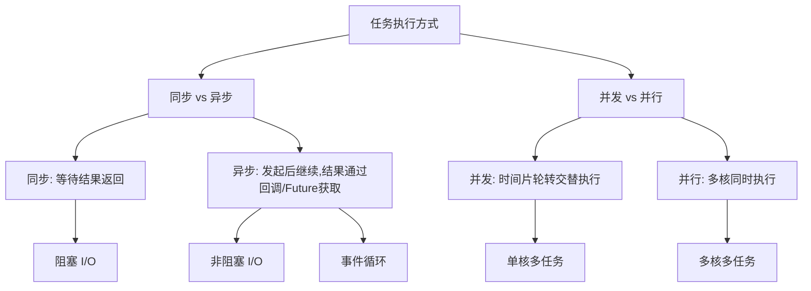
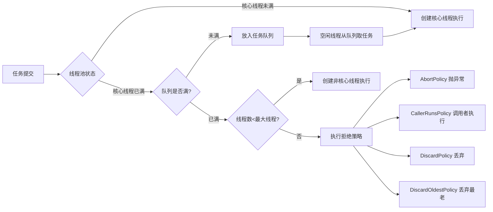
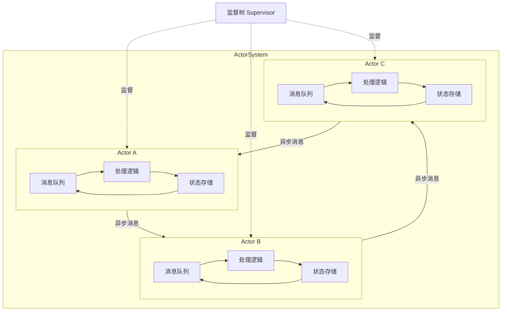
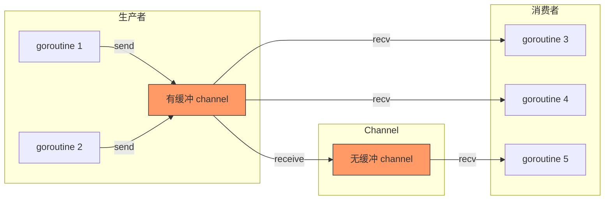
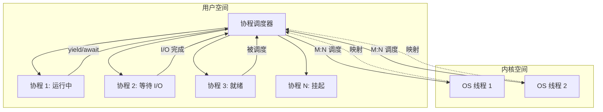
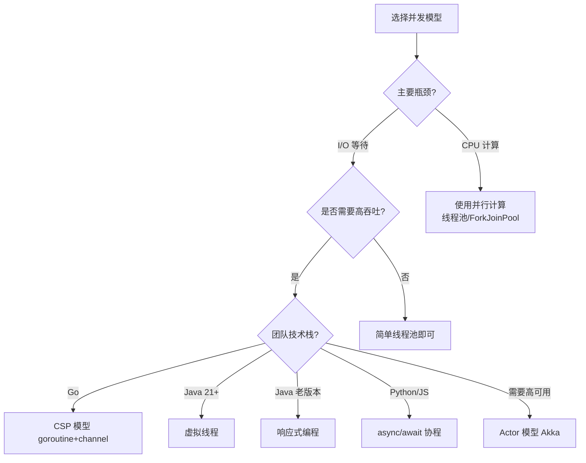

## 引言

并发编程不仅仅是关于锁和同步机制的选择，更核心的是如何组织程序的执行模型。不同的并发模型决定了我们如何创建并发单元、如何通信、如何处理错误。本文将从基本概念出发，全景式地解析主流的并发模型，帮助你在工程中做出合理的选择。

## 一、核心概念辨析

### 1.1 并发 vs 并行 vs 异步

这三个概念经常被混淆，但它们有明确的区分：

| 概念 | 定义 | 关键特征 | 类比 |
|------|------|----------|------|
| **并发（Concurrency）** | 多个任务在同一时间段内交替执行 | 单个 CPU 通过时间片轮转实现 | 一个人同时做几件事 |
| **并行（Parallelism）** | 多个任务在同一时刻同时执行 | 需要多核 CPU | 多个人同时做不同的事 |
| **异步（Asynchronous）** | 发起操作后不等待结果，通过回调/Future 获取结果 | 非阻塞 I/O，事件驱动 | 点餐后等叫号 |



### 1.2 数学关系

$$
\text{总吞吐量} = \frac{\text{并发度} \times \text{单核性能}}{\text{同步开销}}
$$

在理想情况下：
- 并发模型的目标是最大化并发度
- 并行模型的目标是利用多核提升单核性能
- 异步模型的目标是减少同步开销

## 二、线程池（Thread Pool）

### 2.1 线程池的原理

线程池通过复用线程来避免频繁创建和销毁线程的开销，同时控制并发线程数量。



### 2.2 Java 线程池核心参数

```java
ThreadPoolExecutor executor = new ThreadPoolExecutor(
    10,              // corePoolSize: 核心线程数
    20,              // maximumPoolSize: 最大线程数
    60,              // keepAliveTime: 空闲线程存活时间
    TimeUnit.SECONDS,// 时间单位
    new LinkedBlockingQueue<>(100), // 任务队列
    Executors.defaultThreadFactory(), // 线程工厂
    new ThreadPoolExecutor.CallerRunsPolicy() // 拒绝策略
);
```

**执行流程详解：**
1. 提交任务时，如果运行线程数 < corePoolSize，创建新线程
2. 如果运行线程数 >= corePoolSize，尝试放入队列
3. 如果队列满了且运行线程数 < maximumPoolSize，创建非核心线程
4. 如果队列满了且运行线程数 >= maximumPoolSize，执行拒绝策略

### 2.3 线程池调优策略

| 任务类型 | 核心线程数建议 | 队列类型 | 说明 |
|----------|----------------|----------|------|
| **CPU 密集型** | CPU 核数 + 1 | 无界队列或小队列 | 线程数不宜过多，避免上下文切换 |
| **IO 密集型** | CPU 核数 × 2 或更多 | 有界队列 | IO 等待期间 CPU 空闲，可增加线程 |
| **混合型** | 拆分处理 | 分别使用不同线程池 | 按任务特性分离，避免相互影响 |

$$
N_{threads} = N_{CPU} \times U_{CPU} \times \left(1 + \frac{W}{C}\right)
$$

其中 $N_{CPU}$ 是 CPU 核数，$U_{CPU}$ 是目标 CPU 利用率，$\frac{W}{C}$ 是等待时间与计算时间的比值。

### 2.4 工程实践：自定义线程池

```java
public class ThreadPoolFactory {
    
    public static ThreadPoolExecutor createCpuIntensivePool(String name) {
        int cores = Runtime.getRuntime().availableProcessors();
        return new ThreadPoolExecutor(
            cores + 1,
            cores + 1,
            0L, TimeUnit.MILLISECONDS,
            new LinkedBlockingQueue<>(1024),
            new CustomThreadFactory(name),
            new ThreadPoolExecutor.AbortPolicy()
        );
    }
    
    public static ThreadPoolExecutor createIoIntensivePool(String name) {
        int cores = Runtime.getRuntime().availableProcessors();
        return new ThreadPoolExecutor(
            cores * 2,
            cores * 4,
            60L, TimeUnit.SECONDS,
            new LinkedBlockingQueue<>(2048),
            new CustomThreadFactory(name),
            new ThreadPoolExecutor.CallerRunsPolicy()
        );
    }
}
```

## 三、Actor 模型

### 3.1 Actor 模型的核心思想

Actor 模型由 Carl Hewitt 在 1973 年提出，其核心思想是：**一切皆是 Actor，Actor 之间通过消息传递进行通信，每个 Actor 拥有独立的状态。**

**三大原则：**
1. **隔离状态**：每个 Actor 拥有私有状态，不共享内存
2. **消息传递**：Actor 之间通过异步消息通信
3. **并发执行**：每个 Actor 可以独立处理消息

### 3.2 Actor 模型架构



### 3.3 Akka Actor 示例

```scala
import akka.actor.{Actor, ActorRef, Props}

// 定义消息
sealed trait MathMessage
case class Add(a: Int, b: Int) extends MathMessage
case class Result(value: Int) extends MathMessage

// 定义 Actor
class CalculatorActor extends Actor {
  private var sum = 0
  
  def receive: Receive = {
    case Add(a, b) =>
      sum = a + b
      sender() ! Result(sum)
    case "getSum" =>
      sender() ! Result(sum)
  }
}

// 使用
val system = ActorSystem("MathSystem")
val calculator = system.actorOf(Props[CalculatorActor], "calculator")
calculator ! Add(3, 4)
```

### 3.4 监督树与容错

Actor 模型通过**监督树（Supervision Tree）**实现容错：

| 监督策略 | 行为 | 适用场景 |
|----------|------|----------|
| Resume | 忽略错误，继续处理 | 可恢复的临时错误 |
| Restart | 重启 Actor，清空状态 | 状态被破坏 |
| Stop | 停止 Actor | 不可恢复错误 |
| Escalate | 向上级监督者报告 | 自身无法处理 |

## 四、CSP 模型（Communicating Sequential Processes）

### 4.1 CSP 模型概述

CSP 模型由 Tony Hoare 在 1978 年提出，核心思想是：**通过通道（Channel）在独立进程之间传递消息，而非共享内存。**

Go 语言是 CSP 模型最著名的实现：

$$
\text{CSP} = \text{goroutine} + \text{channel}
$$

### 4.2 goroutine 与 channel

```go
// goroutine: 轻量级线程
func main() {
    ch := make(chan int, 10) // 带缓冲的 channel
    
    // 生产者
    go func() {
        for i := 0; i < 100; i++ {
            ch <- i // 发送到 channel
        }
        close(ch) // 关闭 channel
    }()
    
    // 消费者
    for val := range ch { // 从 channel 接收
        fmt.Println(val)
    }
}
```

### 4.3 CSP 模型的通信模式



### 4.4 select 多路复用

```go
func worker(input, output chan int, quit chan bool) {
    for {
        select {
        case val := <-input:
            output <- val * 2 // 处理数据
        case <-quit:
            fmt.Println("worker exiting")
            return
        case <-time.After(5 * time.Second):
            fmt.Println("timeout")
        }
    }
}
```

## 五、协程/纤程（Coroutine/Fiber）

### 5.1 协程的核心特性

协程是用户态的轻量级线程，由程序自己调度而非操作系统调度。

| 特性 | 线程 | 协程 |
|------|------|------|
| 调度者 | 操作系统 | 用户程序 |
| 切换开销 | 高（内核态切换） | 低（用户态切换） |
| 内存占用 | ~1MB | ~几 KB |
| 创建数量 | 有限（数千） | 大量（百万级） |
| 抢占式 | 是 | 否（协作式） |

### 5.2 协程调度原理



### 5.3 Python 协程示例

```python
import asyncio

async def fetch_url(url):
    # 异步 I/O 操作，不阻塞其他协程
    async with aiohttp.ClientSession() as session:
        async with session.get(url) as response:
            return await response.text()

async def main():
    urls = ["http://example.com/1", "http://example.com/2", "http://example.com/3"]
    # 并发执行多个协程
    tasks = [fetch_url(url) for url in urls]
    results = await asyncio.gather(*tasks)
    for i, result in enumerate(results):
        print(f"URL {i}: {len(result)} bytes")

asyncio.run(main())
```

### 5.4 Java 虚拟线程（Project Loom）

```java
// JDK 21+ 虚拟线程示例
public class VirtualThreadDemo {
    public static void main(String[] args) throws InterruptedException {
        try (var executor = Executors.newVirtualThreadPerTaskExecutor()) {
            for (int i = 0; i < 100_000; i++) {
                executor.submit(() -> {
                    // 每个虚拟线程内存占用仅几百字节
                    // 可以创建数十万甚至上百万个虚拟线程
                    simulateIoOperation();
                    return null;
                });
            }
        }
    }
    
    private static void simulateIoOperation() {
        try {
            Thread.sleep(1000); // 虚拟线程在阻塞时自动让出 CPU
        } catch (InterruptedException e) {
            Thread.currentThread().interrupt();
        }
    }
}
```

## 六、async/await 异步编程模型

### 6.1 异步编程的演进

| 阶段 | 模式 | 问题 |
|------|------|------|
| 回调地狱 | `callback(err, data)` | 嵌套深、错误处理困难 |
| Promise/Future | `.then().catch()` | 链式调用可读性差 |
| async/await | `await promise` | 同步写法，异步执行 |

### 6.2 JavaScript async/await 示例

```javascript
// Promise 链式调用
function getUserData(userId) {
    return fetch(`/api/users/${userId}`)
        .then(response => response.json())
        .then(user => fetch(`/api/posts/${user.id}`))
        .then(response => response.json())
        .then(posts => ({ user, posts }))
        .catch(error => console.error(error));
}

// async/await 写法
async function getUserDataAsync(userId) {
    try {
        const userResponse = await fetch(`/api/users/${userId}`);
        const user = await userResponse.json();
        
        const postsResponse = await fetch(`/api/posts/${user.id}`);
        const posts = await postsResponse.json();
        
        return { user, posts };
    } catch (error) {
        console.error(error);
        throw error;
    }
}
```

### 6.3 Java CompletableFuture

```java
public CompletableFuture<UserProfile> getUserProfileAsync(String userId) {
    return CompletableFuture.supplyAsync(() -> fetchUser(userId))
        .thenCombineAsync(
            CompletableFuture.supplyAsync(() -> fetchPosts(userId)),
            (user, posts) -> new UserProfile(user, posts)
        )
        .exceptionally(ex -> {
            log.error("Failed to fetch profile", ex);
            return UserProfile.empty();
        });
}
```

## 七、响应式编程（Reactive Programming）

### 7.1 响应式编程的核心概念

响应式编程是一种基于数据流和变化传播的编程范式。

**Reactive Streams 规范四大接口：**

```mermaid
flowchart LR
    A[Publisher] -->|subscribe| B[Subscriber]
    B -->|request(n)| A
    A -->|onNext(data)| B
    A -->|onError(err)| B
    A -->|onComplete()| B
    B -->|cancel()| A
    
    C[Subscription] -.管理.-> A
    C -.管理.-> B
```

### 7.2 RxJava 示例

```java
// 响应式数据流处理
Observable.fromIterable(userIds)
    .flatMap(userId -> Observable.fromFuture(fetchUserAsync(userId)))
    .filter(user -> user.isActive())
    .map(user -> user.getName().toUpperCase())
    .sorted()
    .subscribe(
        name -> System.out.println("User: " + name),
        error -> System.err.println("Error: " + error),
        () -> System.out.println("All users processed")
    );
```

### 7.3 响应式编程的优势

| 特性 | 传统编程 | 响应式编程 |
|------|----------|------------|
| 数据流 | 拉取模式 | 推送模式 |
| 背压 | 手动处理 | 内置支持 |
| 错误处理 | try-catch | 流式处理 |
| 组合性 | 有限 | 丰富的操作符 |
| 资源利用 | 线程绑定 | 事件循环 |

## 八、各并发模型对比

### 8.1 综合对比表

| 模型 | 代表语言/框架 | 通信方式 | 状态管理 | 错误处理 | 适用场景 |
|------|--------------|----------|----------|----------|----------|
| **线程池** | Java ThreadPoolExecutor | 共享内存 | 需要同步 | try-catch | 传统后端服务 |
| **Actor** | Erlang, Akka | 消息传递 | 隔离状态 | 监督树 | 高可用分布式系统 |
| **CSP** | Go | Channel | 隔离状态 | panic/recover | 微服务、网络编程 |
| **协程** | Python, Kotlin | 共享内存/Channel | 灵活 | try-catch | I/O 密集型应用 |
| **虚拟线程** | Java 21+ | 共享内存 | 需要同步 | try-catch | 高并发后端服务 |
| **响应式** | RxJava, Project Reactor | 数据流 | 不可变数据 | 流式处理 | 事件驱动系统 |

### 8.2 选型决策树



## 九、面试 Q&A

### Q1: 线程池中 corePoolSize 和 maximumPoolSize 的区别是什么？

**A**: corePoolSize 是核心线程数，即使空闲也不会被回收（除非设置了 allowCoreThreadTimeOut）；maximumPoolSize 是线程池允许的最大线程数。当任务队列满且运行线程数小于 maximumPoolSize 时，会创建非核心线程，这些线程空闲超过 keepAliveTime 后会被回收。

### Q2: Go 的 goroutine 和线程有什么区别？

**A**: 
- **调度方式**：goroutine 由 Go 运行时调度（M:N 模型），线程由 OS 调度
- **内存占用**：goroutine 初始栈仅 2KB，线程通常 1-2MB
- **创建数量**：goroutine 可创建百万级，线程通常数千
- **切换开销**：goroutine 在用户态切换，线程需要内核态切换
- **调度策略**：goroutine 是协作式 + 抢占式混合，线程是抢占式

### Q3: Actor 模型和 CSP 模型有什么区别？

**A**: 
- **通信方式**：Actor 通过邮箱（隐式队列）接收消息，CSP 通过显式的 channel
- **寻址方式**：Actor 通过 Actor 引用发送消息，CSP 通过 channel 连接
- **缓冲策略**：Actor 邮箱通常无界，CSP channel 可以是有界或无界
- **背压处理**：CSP 通过 channel 容量自然实现背压，Actor 需要额外机制
- **代表实现**：Actor → Erlang/Akka；CSP → Go

### Q4: 什么是背压（Back Pressure）？

**A**: 背压是指在数据流处理中，下游处理速度慢于上游生产速度时，需要反馈给上游降低生产速率的机制。响应式编程通过 Reactive Streams 规范的 `request(n)` 方法实现背压，下游明确告知上游自己能处理多少数据。

### Q5: Java 虚拟线程相比传统线程有什么优势？

**A**: 
- **内存占用**：虚拟线程初始栈仅几百字节 vs 传统线程 1MB
- **创建成本**：虚拟线程创建和销毁成本极低
- **阻塞行为**：虚拟线程阻塞时自动让出载体线程，提高 CPU 利用率
- **并发能力**：可创建数十万个虚拟线程，适合高并发 I/O 场景
- **编程模型**：保持同步代码风格，无需改写为异步代码

### Q6: 响应式编程中的热流（Hot）和冷流（Cold）有什么区别？

**A**: 
- **冷流（Cold Observable）**：每次订阅都会重新执行数据源，每个订阅者收到完整的数据序列。例如：`Observable.fromArray([1,2,3])`
- **热流（Hot Observable）**：数据源独立于订阅者，新订阅者只能收到订阅后的数据。例如：鼠标点击事件、WebSocket 消息

## 总结

并发模型的选择没有银弹，关键在于理解业务场景和团队技术栈：

- **线程池**：传统但成熟，适合大多数后端服务
- **Actor**：适合高可用、容错要求高的分布式系统
- **CSP**：Go 语言的天然选择，网络编程利器
- **协程/虚拟线程**：I/O 密集型场景的最佳选择
- **响应式编程**：事件驱动、高吞吐系统的理想方案

理解每种模型的优缺点和适用场景，才能在工程中做出最优选择。