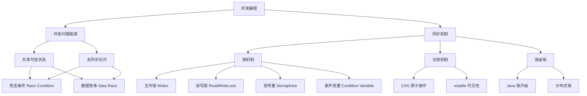
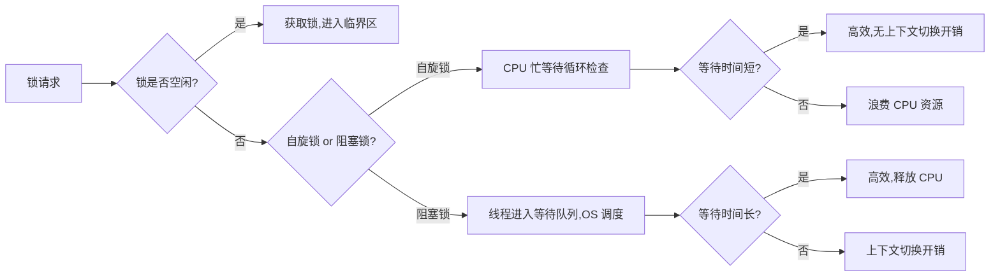
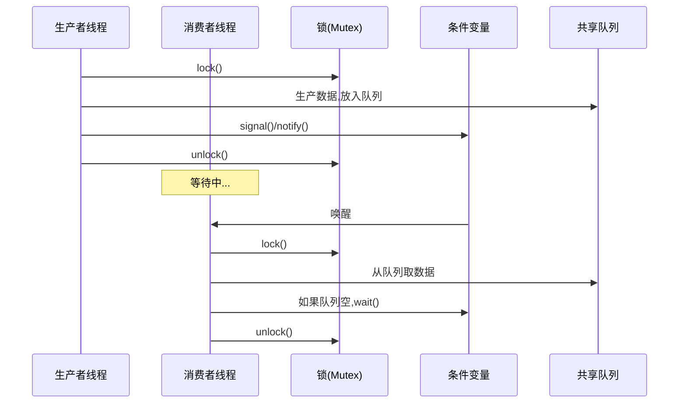
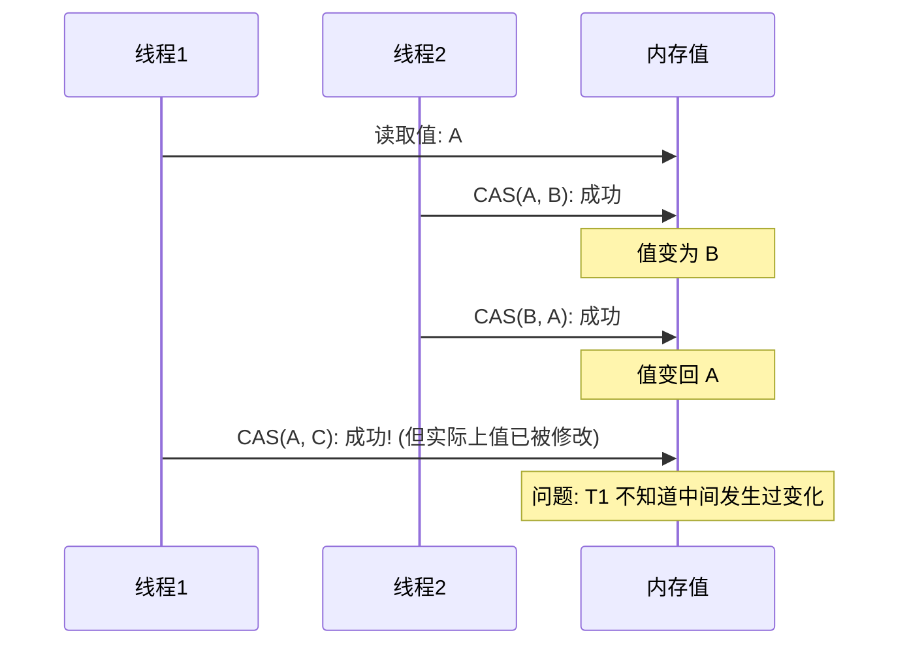
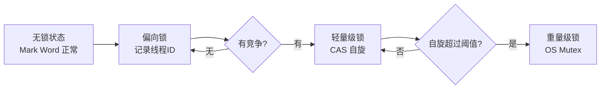

## 引言

并发编程是软件工程中不可避免的核心课题。当多个执行流同时访问共享资源时，如果没有正确的同步机制，程序的行为将变得不可预测。本文将从并发问题的根源出发，系统性地解析各类锁与同步机制的原理、实现及其在工程中的实际应用。

## 一、并发问题的根源

### 1.1 共享可变状态 + 无同步访问

并发问题的本质可以归结为一个简单公式：

$$
\text{并发问题} = \text{共享状态} + \text{可变操作} + \text{无同步访问}
$$

当多个线程同时读写同一块内存区域，且没有任何协调机制时，就会产生不可预期的结果。

### 1.2 竞态条件与数据竞争

**竞态条件（Race Condition）**：程序的执行结果依赖于线程调度的时序。

**数据竞争（Data Race）**：多个线程同时访问同一内存位置，至少有一个是写操作，且没有同步机制保护。

```java
// 典型的数据竞争示例
public class Counter {
    private int count = 0;
    
    // 非线程安全的递增操作
    public void increment() {
        count++; // 实际包含 read-modify-write 三个步骤
    }
}
```

`count++` 操作在底层包含三个步骤：读取 count 值、加 1、写回。当两个线程同时执行时，可能出现如下交错：

```
线程A: read(0) -> add(1) -> write(1)
线程B:       read(0) -> add(1) -> write(1)
最终结果: count = 1 (期望为 2)
```

### 1.3 并发问题全景图



## 二、互斥锁（Mutex）

### 2.1 互斥锁的核心原理

互斥锁是最基础的同步原语，它确保同一时刻只有一个线程可以进入临界区。

**互斥锁的三个核心属性：**
- **互斥性（Mutual Exclusion）**：同一时刻只有一个线程持有锁
- **前进性（Progress）**：如果没有线程持有锁，则请求锁的线程最终能获得锁
- **有限等待（Bounded Waiting）**：每个请求锁的线程最终都能获得锁

### 2.2 自旋锁 vs 阻塞锁



**自旋锁实现（伪代码）：**

```c
// 基于 TAS (Test-And-Set) 的自旋锁
typedef struct {
    int locked; // 0 = free, 1 = locked
} spinlock_t;

void spin_lock(spinlock_t *lock) {
    while (test_and_set(&lock->locked)) {
        // 忙等待 - 不断检查锁状态
        // 可以添加 pause 指令优化 (x86 PAUSE, ARM YIELD)
    }
}

void spin_unlock(spinlock_t *lock) {
    lock->locked = 0;
}
```

**阻塞锁实现思路：**

```java
// 基于 wait/notify 的简单阻塞锁
public class BlockingLock {
    private boolean locked = false;
    
    public synchronized void lock() {
        while (locked) {
            try {
                wait(); // 释放 CPU，进入等待队列
            } catch (InterruptedException e) {
                Thread.currentThread().interrupt();
            }
        }
        locked = true;
    }
    
    public synchronized void unlock() {
        locked = false;
        notifyAll();
    }
}
```

### 2.3 适应性自旋锁

适应性自旋锁结合了自旋锁和阻塞锁的优点：先自旋一段时间，如果仍未获取到锁，则转为阻塞等待。

```java
// JDK 中适应性自旋的简化逻辑
public void adaptiveSpinLock() {
    int spinCount = 0;
    int maxSpins = 10; // 动态调整
    
    while (!tryAcquire()) {
        spinCount++;
        if (spinCount > maxSpins) {
            park(); // 超过阈值，阻塞等待
            break;
        }
        Thread.onSpinWait(); // CPU 提示：自旋等待中
    }
}
```

## 三、读写锁（ReadWriteLock）

### 3.1 读写锁的设计动机

在很多场景下，读操作远多于写操作。如果使用普通的互斥锁，读-读操作也会被串行化，造成性能浪费。读写锁允许多个读线程同时访问，但写操作必须互斥。

**读写锁的三种访问模式：**

| 模式 | 是否允许多线程 | 适用场景 |
|------|----------------|----------|
| 读-读 | ✅ 允许 | 高并发读取 |
| 读-写 | ❌ 互斥 | 保证数据一致性 |
| 写-写 | ❌ 互斥 | 保证数据一致性 |

### 3.2 Java ReentrantReadWriteLock 示例

```java
public class Cache<K, V> {
    private final Map<K, V> map = new HashMap<>();
    private final ReadWriteLock rwLock = new ReentrantReadWriteLock();
    
    public V get(K key) {
        rwLock.readLock().lock();
        try {
            return map.get(key);
        } finally {
            rwLock.readLock().unlock();
        }
    }
    
    public void put(K key, V value) {
        rwLock.writeLock().lock();
        try {
            map.put(key, value);
        } finally {
            rwLock.writeLock().unlock();
        }
    }
}
```

### 3.3 读写锁的公平性问题

- **公平模式**：等待时间最长的线程优先获取锁，避免写饥饿
- **非公平模式**：允许插队，吞吐量更高但可能导致写线程饥饿

## 四、信号量（Semaphore）

### 4.1 信号量的概念

信号量是 Dijkstra 提出的一种同步原语，维护一个计数器，用于控制对共享资源的并发访问数量。

**两种信号量类型：**

| 类型 | 计数器范围 | 用途 |
|------|-----------|------|
| 二进制信号量 | 0 或 1 | 实现互斥锁 |
| 计数信号量 | 0 到 N | 控制并发访问数量 |

### 4.2 信号量的 P/V 操作

$$
\begin{aligned}
P(S): & \quad \text{wait}(S) \rightarrow \text{if } S > 0 \text{ then } S := S - 1 \text{ else 阻塞} \\
V(S): & \quad \text{signal}(S) \rightarrow S := S + 1, \text{唤醒一个等待线程}
\end{aligned}
$$

### 4.3 信号量实现限流器

```java
public class RateLimiter {
    private final Semaphore semaphore;
    
    public RateLimiter(int maxConcurrent) {
        // 计数信号量，允许最多 maxConcurrent 个并发访问
        this.semaphore = new Semaphore(maxConcurrent);
    }
    
    public void execute(Runnable task) throws InterruptedException {
        semaphore.acquire(); // P 操作
        try {
            task.run();
        } finally {
            semaphore.release(); // V 操作
        }
    }
}
```

## 五、条件变量（Condition Variable）

### 5.1 条件变量与生产者-消费者模式

条件变量用于线程间的协调通信，允许线程在某个条件不满足时等待，直到另一个线程改变条件并通知它。



### 5.2 Java 实现生产者-消费者

```java
public class ProducerConsumer<T> {
    private final Queue<T> queue = new LinkedList<>();
    private final int capacity;
    private final Lock lock = new ReentrantLock();
    private final Condition notFull = lock.newCondition();
    private final Condition notEmpty = lock.newCondition();
    
    public ProducerConsumer(int capacity) {
        this.capacity = capacity;
    }
    
    public void produce(T item) throws InterruptedException {
        lock.lock();
        try {
            while (queue.size() == capacity) {
                notFull.await(); // 队列满，等待
            }
            queue.offer(item);
            notEmpty.signal(); // 通知消费者
        } finally {
            lock.unlock();
        }
    }
    
    public T consume() throws InterruptedException {
        lock.lock();
        try {
            while (queue.isEmpty()) {
                notEmpty.await(); // 队列空，等待
            }
            T item = queue.poll();
            notFull.signal(); // 通知生产者
            return item;
        } finally {
            lock.unlock();
        }
    }
}
```

## 六、CAS 原子操作

### 6.1 CAS 原理

CAS（Compare-And-Swap）是一种无锁同步机制，通过硬件级别的原子指令实现。

$$
\text{CAS}(V, E, N): \begin{cases}
\text{if } V = E, \text{then } V := N, \text{return true} \\
\text{else return false}
\end{cases}
$$

其中 $V$ 是内存中的当前值，$E$ 是期望值，$N$ 是新值。

### 6.2 ABA 问题与解决方案

**ABA 问题**：线程 A 读取值 V=A，线程 B 将值改为 B 后又改回 A，线程 A 的 CAS 操作仍然成功，但值实际上已经被其他线程修改过。



**解决方案：引入版本号**

```java
// Java 中的 AtomicStampedReference 解决 ABA 问题
AtomicStampedReference<Integer> ref = new AtomicStampedReference<>(1, 0);

// CAS 时同时比较值和版本号
ref.compareAndSet(1, 2, 0, 1); // 期望值=1, 新值=2, 期望版本=0, 新版本=1
```

## 七、Java 中的锁机制

### 7.1 synchronized 锁升级过程

Java 的 synchronized 关键字经历了从重量级到轻量级的优化，锁升级过程如下：



**各锁状态对比：**

| 锁状态 | 存储内容 | 获取方式 | 适用场景 |
|--------|----------|----------|----------|
| 无锁 | 正常对象头 | 无需获取 | 无竞争 |
| 偏向锁 | 线程 ID + Epoch | 比较线程 ID | 单线程反复访问 |
| 轻量级锁 | 指向线程栈 Lock Record | CAS 自旋 | 短时间竞争 |
| 重量级锁 | 指向 Monitor 对象 | OS 互斥锁 | 长时间竞争 |

### 7.2 ReentrantLock vs synchronized

| 特性 | synchronized | ReentrantLock |
|------|-------------|---------------|
| 实现层面 | JVM 层面 | Java API 层面 |
| 锁释放 | 自动释放 | 必须手动 unlock |
| 可中断 | ❌ 不可中断 | ✅ lockInterruptibly |
| 超时获取 | ❌ | ✅ tryLock(timeout) |
| 公平性 | ❌ 非公平 | ✅ 支持公平/非公平 |
| 条件变量 | 单一 wait/notify | ✅ 多个 Condition |
| 性能 | JDK 6 后接近 | 接近 |

### 7.3 StampedLock：乐观读锁

```java
public class Point {
    private double x, y;
    private final StampedLock sl = new StampedLock();
    
    // 乐观读：先不加锁，验证 stamp 是否有效
    public double distanceFromOrigin() {
        long stamp = sl.tryOptimisticRead();
        double currentX = x, currentY = y;
        if (!sl.validate(stamp)) {
            // 验证失败，升级为悲观读锁
            stamp = sl.readLock();
            try {
                currentX = x;
                currentY = y;
            } finally {
                sl.unlockRead(stamp);
            }
        }
        return Math.sqrt(currentX * currentX + currentY * currentY);
    }
    
    public void move(double deltaX, double deltaY) {
        long stamp = sl.writeLock();
        try {
            x += deltaX;
            y += deltaY;
        } finally {
            sl.unlockWrite(stamp);
        }
    }
}
```

## 八、分布式锁

### 8.1 为什么需要分布式锁？

在分布式系统中，多个服务实例可能同时访问共享资源，本地锁无法跨进程协调，需要分布式锁。

### 8.2 主流分布式锁方案对比

| 方案 | 实现原理 | 优点 | 缺点 |
|------|----------|------|------|
| Redis RedLock | SET NX EX + 多实例 | 高性能、简单 | 时钟漂移问题 |
| ZooKeeper | 临时顺序节点 | 强一致性 | 性能较低 |
| etcd | Lease + Txn | 强一致性、高性能 | 依赖 etcd 集群 |

### 8.3 Redis 分布式锁实现

```java
public class RedisDistributedLock {
    private final StringRedisTemplate redisTemplate;
    
    public boolean tryLock(String key, String value, long timeout, TimeUnit unit) {
        Boolean result = redisTemplate.opsForValue()
            .setIfAbsent(key, value, timeout, unit);
        return Boolean.TRUE.equals(result);
    }
    
    // Lua 脚本确保原子性：只释放自己的锁
    private static final String UNLOCK_SCRIPT = 
        "if redis.call('get', KEYS[1]) == ARGV[1] then " +
        "    return redis.call('del', KEYS[1]) " +
        "else " +
        "    return 0 " +
        "end";
    
    public boolean unlock(String key, String value) {
        Long result = redisTemplate.execute(
            new DefaultRedisScript<>(UNLOCK_SCRIPT, Long.class),
            Collections.singletonList(key), value);
        return result == 1;
    }
}
```

### 8.4 ZooKeeper 分布式锁

```java
// 基于临时顺序节点实现
public class ZkDistributedLock {
    private final CuratorFramework client;
    private final InterProcessMutex lock;
    
    public ZkDistributedLock(CuratorFramework client, String path) {
        this.client = client;
        this.lock = new InterProcessMutex(client, path);
    }
    
    public void acquire() throws Exception {
        lock.acquire(); // 阻塞等待获取锁
    }
    
    public void release() throws Exception {
        lock.release(); // 临时节点自动删除
    }
}
```

## 九、锁的设计原则

1. **最小化临界区**：锁住的代码越少越好
2. **避免锁嵌套**：容易死锁，若必须嵌套则保持固定顺序
3. **优先使用高级同步工具**：ConcurrentHashMap、Atomic 类等
4. **监控锁竞争**：通过 JMX 或 APM 工具监控锁等待时间
5. **考虑无锁方案**：CAS + volatile 在某些场景下性能更好

## 十、面试 Q&A

### Q1: synchronized 和 ReentrantLock 有什么区别？

**A**: 见上文对比表格。核心区别在于：synchronized 是 JVM 内置关键字，自动管理锁的获取和释放；ReentrantLock 是 Java API，提供了更丰富的功能如可中断锁、超时获取、多条件变量等。JDK 6 之后两者性能差异已经很小。

### Q2: 什么是死锁？如何避免？

**A**: 死锁是多个线程互相等待对方释放锁的情况。四个必要条件：互斥、占有并等待、不可抢占、循环等待。避免方法：
- 破坏"占有并等待"：一次性获取所有锁
- 破坏"循环等待"：按固定顺序获取锁
- 使用 tryLock 超时机制
- 使用死锁检测算法

### Q3: CAS 的 ABA 问题如何解决？

**A**: 通过引入版本号（或时间戳）来解决。Java 提供了 `AtomicStampedReference` 和 `AtomicMarkableReference`，在 CAS 操作时同时比较值和版本号，确保值没有被其他线程修改过。

### Q4: 什么是锁升级？Java 为什么要引入偏向锁？

**A**: 锁升级是 synchronized 从无锁→偏向锁→轻量级锁→重量级锁的渐进过程。引入偏向锁是因为大多数情况下锁不仅不存在竞争，而且总是被同一个线程获取。偏向锁通过记录线程 ID 避免了 CAS 操作的开销，在单线程反复访问同步块的场景下性能最优。

### Q5: Redis 分布式锁的 RedLock 算法是什么？

**A**: RedLock 算法通过在 N 个独立的 Redis 实例上尝试获取锁，只有在大多数实例（N/2+1）上都成功获取锁，且总耗时小于锁的有效期时，才认为获取成功。这解决了单点 Redis 故障导致的锁安全问题。

### Q6: StampedLock 相比 ReentrantReadWriteLock 有什么优势？

**A**: StampedLock 引入了乐观读模式，读取时不加锁，读取后验证数据是否被修改。如果未被修改则无需重新读取，避免了读写冲突时的锁等待，在读多写少且读操作较短的场景下性能更好。缺点是不可重入，且 API 使用稍复杂。

## 总结

锁与同步机制是并发编程的基石。从最简单的互斥锁到复杂的分布式锁，从悲观锁到乐观锁，每种机制都有其适用场景。理解它们的原理和权衡，才能在工程中做出正确的选择。关键要点：

- **共享可变状态** 是并发问题的根源
- **互斥锁** 是最基础的同步原语
- **读写锁** 在读多写少场景下性能更优
- **CAS** 提供了无锁同步的可能性，但需注意 ABA 问题
- **Java 锁升级** 是性能优化的经典案例
- **分布式锁** 需要在一致性、可用性、性能之间权衡