## 领域驱动设计：以业务为中心的软件工程方法论

领域驱动设计（Domain-Driven Design, DDD）由 Eric Evans 在 2003 年提出，是一种以业务领域为核心的软件设计方法论。DDD 不是架构模式，也不是编程框架——它是一种**思维方式**，强调技术实现应该紧密围绕业务领域展开。

---

## 一、DDD 的核心理念

### 1.1 为什么需要 DDD？

在软件开发中，技术团队与业务团队之间往往存在巨大的**沟通鸿沟**：

- 业务人员用业务术语描述需求（"订单"、"库存"、"客户"）
- 开发人员用技术术语实现功能（"User 表"、"OrderController"、"DTO"）
- 两者之间的翻译过程导致信息丢失和误解

DDD 通过**统一语言**（Ubiquitous Language）消除这种鸿沟——业务和开发使用同一套术语，贯穿需求、设计、代码、文档。

### 1.2 统一语言（Ubiquitous Language）

统一语言是 DDD 的基石。它是一套由领域专家和技术团队共同定义的语言，用于描述系统中的概念和规则。

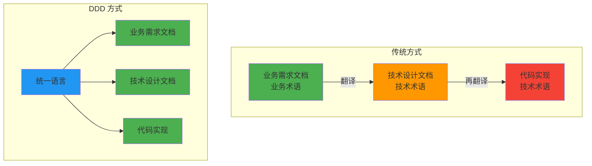

**示例——电商领域的统一语言**：

| 概念 | 业务定义 | 代码映射 |
|------|---------|---------|
| 订单 | 客户购买商品后生成的交易凭证 | `Order` 聚合 |
| 购物车 | 客户暂存待购买商品的容器 | `ShoppingCart` 实体 |
| 库存锁定 | 下单后预留库存，防止超卖 | `StockLock` 值对象 |
| 支付超时 | 30 分钟内未完成支付则自动取消 | `PaymentTimeout` 领域事件 |

---

## 二、战略设计（Strategic Design）

### 2.1 领域、子域、限界上下文

DDD 的战略设计关注如何划分大的业务领域，识别不同部分的重要性和关系。

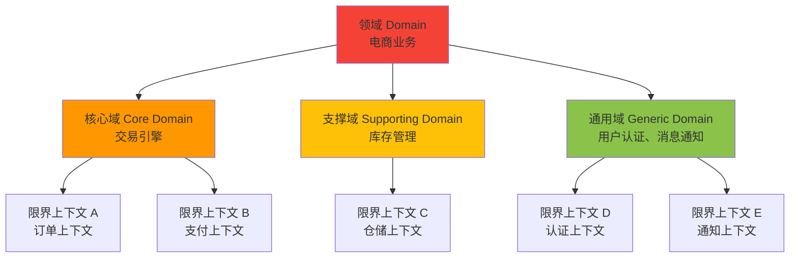

| 概念 | 说明 | 示例 | 投入策略 |
|------|------|------|---------|
| **核心域** | 核心竞争力所在，差异化优势的来源 | 电商的推荐算法、定价策略 | 投入最强团队，持续迭代 |
| **支撑域** | 支持核心域运作的必要功能 | 库存管理、物流追踪 | 保证稳定运行，适度投入 |
| **通用域** | 行业通用的功能，非差异化竞争点 | 用户认证、邮件通知、权限管理 | 使用成熟方案，最小化投入 |

### 2.2 限界上下文（Bounded Context）

限界上下文是 DDD 中最重要的概念之一。它为领域模型划定了一个明确的边界，在这个边界内，模型的概念和规则是统一的。

**关键原则**：同一个术语在不同限界上下文中可能有不同的含义。

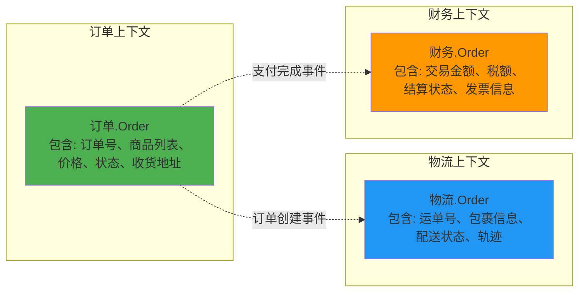

> **"订单"在三个上下文中的含义不同**：订单上下文关注交易，物流上下文关注配送，财务上下文关注结算。它们是不同的模型，不应强行合并。

### 2.3 上下文映射图（Context Map）

上下文映射图描述限界上下文之间的协作关系。

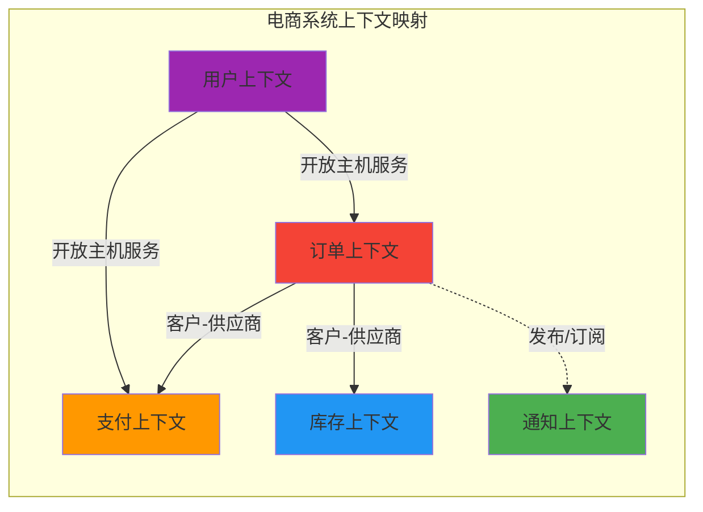

| 协作模式 | 说明 | 示例 |
|----------|------|------|
| **客户-供应商**（Customer-Supplier） | 上游团队为下游团队提供服务，需紧密协作 | 订单上下文 ← 支付上下文 |
| **开放主机服务**（Open Host Service） | 上游团队发布公开协议，多个下游团队消费 | 用户上下文 → 多个上下文 |
| **发布语言**（Published Language） | 使用标准化的数据格式进行交互 | REST API、Protobuf |
| **防腐层**（Anti-Corruption Layer, ACL） | 隔离外部系统，防止外部模型污染内部模型 | 对接第三方支付平台 |
| **共享内核**（Shared Kernel） | 多个上下文共享部分代码/模型 | 通用工具库 |
| **独立方式**（Separate Ways） | 两个上下文完全独立，无协作 | 不相关的业务域 |

---

## 三、战术设计（Tactical Design）

### 3.1 领域模型构建块

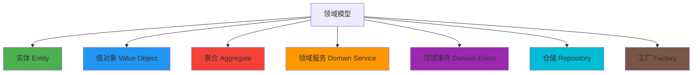

### 3.2 实体（Entity）

实体是**具有唯一标识**的领域对象，其生命周期内标识保持不变。

```python
from dataclasses import dataclass
from datetime import datetime
from uuid import UUID, uuid4

@dataclass
class Order:
    order_id: UUID          # 唯一标识（不变）
    customer_id: UUID
    items: list             # 订单项列表
    status: str             # 订单状态
    total_amount: float
    created_at: datetime
    updated_at: datetime

    def __init__(self, customer_id: UUID, items: list):
        self.order_id = uuid4()  # 创建时生成，之后不变
        self.customer_id = customer_id
        self.items = items
        self.status = "CREATED"
        self.total_amount = sum(item.price * item.quantity for item in items)
        self.created_at = datetime.now()
        self.updated_at = self.created_at

    def cancel(self) -> "OrderCancelled":
        if self.status != "CREATED":
            raise ValueError("只能取消待确认订单")
        self.status = "CANCELLED"
        self.updated_at = datetime.now()
        return OrderCancelled(self.order_id)  # 发布领域事件
```

**实体的核心特征**：
- 有唯一标识（ID）
- 标识不变，属性可变
- 通过 ID 判断相等性，而非属性值

### 3.3 值对象（Value Object）

值对象**没有唯一标识**，通过属性值判断相等性，通常是不可变的。

```python
from dataclasses import dataclass

@dataclass(frozen=True)
class Money:
    amount: float
    currency: str = "CNY"

    def __add__(self, other: "Money") -> "Money":
        if self.currency != other.currency:
            raise ValueError("货币类型不一致")
        return Money(self.amount + other.amount, self.currency)

    def __mul__(self, quantity: int) -> "Money":
        return Money(self.amount * quantity, self.currency)

@dataclass(frozen=True)
class Address:
    province: str
    city: str
    district: str
    street: str
    zip_code: str

    @property
    def full_address(self) -> str:
        return f"{self.province}{self.city}{self.district}{self.street}"
```

**值对象的核心特征**：
- 无唯一标识
- 不可变（immutable）
- 通过属性值判断相等性
- 可以替换（整个对象替换，而非修改属性）
- 自验证（创建时确保有效性）

### 3.4 实体 vs 值对象 对比

| 维度 | 实体 | 值对象 |
|------|------|--------|
| 标识 | 有唯一 ID | 无 ID，通过值判断相等 |
| 可变性 | 可变 | 不可变 |
| 相等性 | 基于 ID | 基于所有属性值 |
| 生命周期 | 有明确的生命周期 | 随所属实体存在/消失 |
| 存储 | 单独存储 | 通常内嵌在实体中 |
| 示例 | User、Order、Product | Money、Address、PhoneNumber |

### 3.5 聚合（Aggregate）与聚合根（Aggregate Root）

聚合是一组**关联对象的集合**，作为一个整体进行数据操作。聚合根是聚合的入口，外部只能通过聚合根访问聚合内部的实体和值对象。

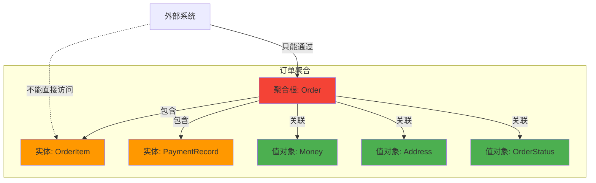

**聚合的设计原则**：

| 原则 | 说明 |
|------|------|
| 一致性边界 | 聚合内的数据变更必须保证一致性 |
| 小聚合 | 聚合尽量小，减少并发冲突 |
| 聚合根是入口 | 外部只能通过聚合根访问内部 |
| 聚合间引用 | 聚合间只能通过 ID 引用，不能直接引用对象 |
| 事务边界 | 一个事务只修改一个聚合 |

```python
from dataclasses import dataclass, field
from typing import Optional

@dataclass(frozen=True)
class OrderItem:
    product_id: str
    product_name: str
    price: Money
    quantity: int

@dataclass
class Order:  # 聚合根
    order_id: str
    customer_id: str
    items: list[OrderItem]
    shipping_address: Address
    status: str = "CREATED"
    _events: list = field(default_factory=list, repr=False)

    def add_item(self, product_id: str, product_name: str, price: Money, quantity: int):
        if self.status != "CREATED":
            raise ValueError("只能向待确认订单添加商品")
        self.items.append(OrderItem(product_id, product_name, price, quantity))
        self._recalculate_total()

    def remove_item(self, product_id: str):
        if self.status != "CREATED":
            raise ValueError("只能从待确认订单移除商品")
        self.items = [item for item in self.items if item.product_id != product_id]
        self._recalculate_total()

    def confirm(self):
        if self.status != "CREATED":
            raise ValueError("订单只能确认一次")
        if not self.items:
            raise ValueError("订单不能为空")
        self.status = "CONFIRMED"
        self._events.append(OrderConfirmed(self.order_id))

    def _recalculate_total(self):
        total = Money(0)
        for item in self.items:
            total += item.price * item.quantity
        # 注意：Python dataclass 中不能直接赋值 frozen 字段，
        # 实际项目中应使用 object.__setattr__ 或改为非 frozen

    def get_events(self):
        events = self._events.copy()
        self._events.clear()
        return events
```

### 3.6 领域服务（Domain Service）

当某个业务逻辑**不属于任何单个实体或值对象**时，将其放在领域服务中。

```python
class OrderPricingService:
    """订单定价服务——涉及多个聚合的复杂计算逻辑"""

    def __init__(self, coupon_repo, promotion_repo):
        self.coupon_repo = coupon_repo
        self.promotion_repo = promotion_repo

    def calculate_final_price(self, order: Order, coupon_code: str) -> Money:
        """计算订单最终价格，考虑优惠和促销"""
        total = sum(item.price * item.quantity for item in order.items)

        # 应用优惠券
        if coupon_code:
            coupon = self.coupon_repo.find_by_code(coupon_code)
            if coupon and coupon.is_applicable(order):
                total -= coupon.discount

        # 应用促销活动
        promotions = self.promotion_repo.find_applicable(order)
        for promo in promotions:
            total -= promo.calculate_discount(order)

        return max(Money(0), total)  # 最终价格不能为负
```

**领域服务的判断标准**：
- 操作涉及多个聚合
- 逻辑是领域概念，但不是某个实体的自然职责
- 无状态（不持有状态）

### 3.7 领域事件（Domain Event）

领域事件是领域中发生的**重要事情的记录**，用于解耦聚合之间的交互。

```python
from dataclasses import dataclass
from datetime import datetime
from uuid import uuid4

@dataclass
class DomainEvent:
    event_id: str
    occurred_at: datetime

    def __init__(self):
        self.event_id = str(uuid4())
        self.occurred_at = datetime.now()

@dataclass
class OrderCreated(DomainEvent):
    order_id: str
    customer_id: str
    total_amount: float

@dataclass
class OrderConfirmed(DomainEvent):
    order_id: str

@dataclass
class OrderCancelled(DomainEvent):
    order_id: str
    reason: str

@dataclass
class PaymentCompleted(DomainEvent):
    order_id: str
    payment_id: str
    amount: float
```

**领域事件的使用场景**：

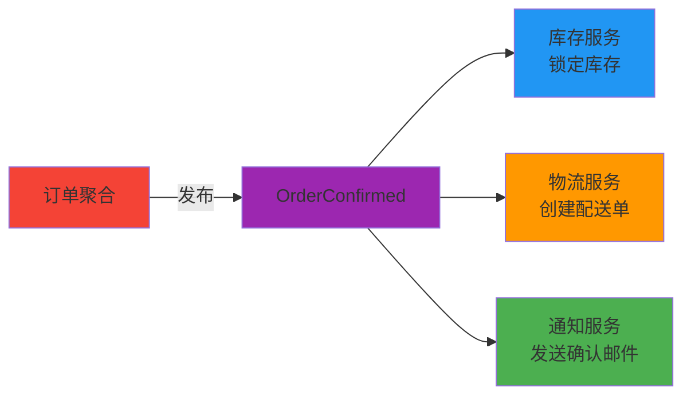

---

## 四、仓储模式（Repository）

### 4.1 仓储的作用

仓储负责**聚合的持久化和检索**，它封装了数据访问的细节，让领域层不依赖基础设施。

```python
from abc import ABC, abstractmethod
from typing import Optional

class OrderRepository(ABC):
    """订单仓储接口——定义在领域层"""

    @abstractmethod
    def save(self, order: Order) -> None:
        """保存聚合（包含内部所有对象）"""

    @abstractmethod
    def find_by_id(self, order_id: str) -> Optional[Order]:
        """通过 ID 获取聚合"""

    @abstractmethod
    def find_by_customer(self, customer_id: str) -> list[Order]:
        """查询客户的所有订单"""

# 基础设施层的实现
class SqlAlchemyOrderRepository(OrderRepository):
    def __init__(self, session):
        self.session = session

    def save(self, order: Order) -> None:
        # ORM 映射逻辑
        pass

    def find_by_id(self, order_id: str) -> Optional[Order]:
        # SQL 查询逻辑
        pass
```

### 4.2 仓储 vs DAO

| 维度 | 仓储（Repository） | DAO |
|------|-------------------|-----|
| 操作单位 | 聚合（Aggregate） | 数据库表/行 |
| 返回对象 | 领域对象 | 数据对象 |
| 设计理念 | 面向领域模型 | 面向数据库 |
| 依赖方向 | 领域层定义接口 | 基础设施层定义 |
| 适用场景 | DDD 架构 | CRUD 应用 |

---

## 五、CQRS 与事件溯源

### 5.1 CQRS（Command Query Responsibility Segregation）

CQRS 将系统的**命令（写）**和**查询（读）**职责分离，使用不同的模型和存储。

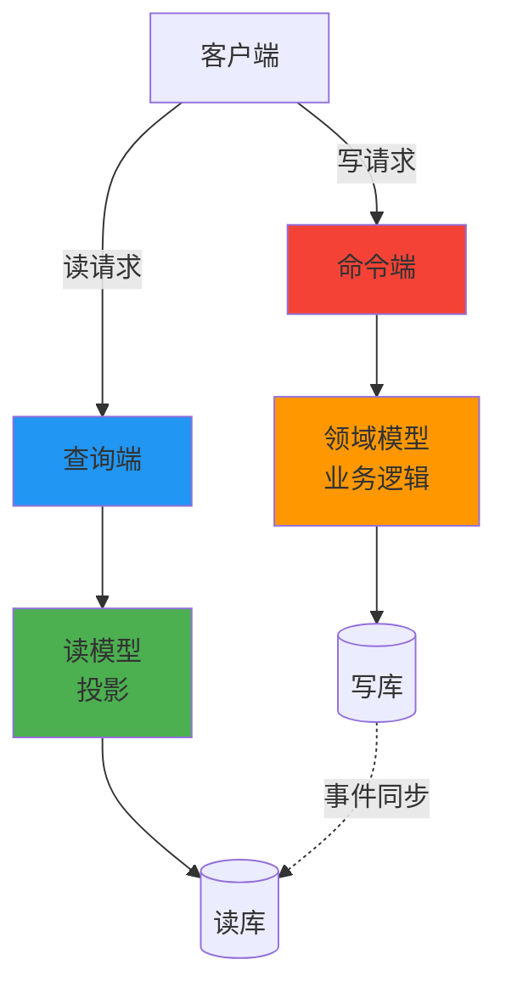

| 维度 | 命令端 | 查询端 |
|------|--------|--------|
| 职责 | 修改状态（写） | 读取数据（读） |
| 模型 | 领域模型（充血） | 读模型（简化） |
| 存储 | 规范化数据库 | 反规范化/缓存 |
| 一致性 | 强一致性 | 最终一致性 |
| 扩展 | 独立扩展 | 独立扩展 |

### 5.2 事件溯源（Event Sourcing）

事件溯源将状态变更存储为**一系列事件**，而非当前状态的快照。当前状态可以通过重放事件重建。

```python
class EventSourcedOrder:
    """基于事件溯源的订单聚合"""

    def __init__(self, order_id: str):
        self.order_id = order_id
        self.items = []
        self.status = None
        self._uncommitted_events = []

    @classmethod
    def from_events(cls, order_id: str, events: list) -> "EventSourcedOrder":
        """从事件历史重建聚合"""
        order = cls(order_id)
        for event in events:
            order._apply_event(event)
        return order

    def create(self, customer_id: str, items: list):
        event = OrderCreatedEvent(
            order_id=self.order_id,
            customer_id=customer_id,
            items=items
        )
        self._apply_event(event)
        self._uncommitted_events.append(event)

    def confirm(self):
        event = OrderConfirmedEvent(order_id=self.order_id)
        self._apply_event(event)
        self._uncommitted_events.append(event)

    def _apply_event(self, event):
        if isinstance(event, OrderCreatedEvent):
            self.items = event.items
            self.status = "CREATED"
        elif isinstance(event, OrderConfirmedEvent):
            self.status = "CONFIRMED"
```

### 5.3 CQRS + 事件溯源的组合

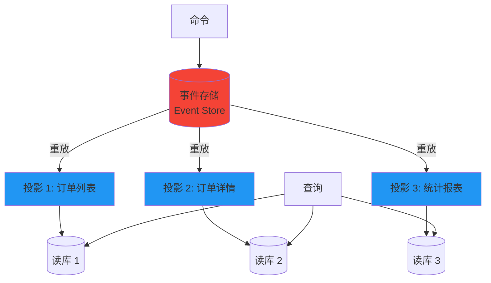

---

## 六、DDD 与微服务的映射

### 6.1 限界上下文 ≈ 微服务

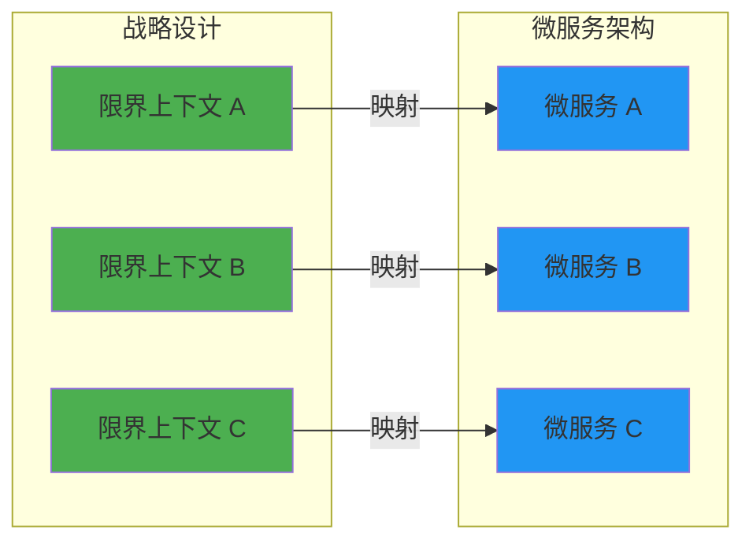

| DDD 概念 | 微服务对应 |
|----------|-----------|
| 限界上下文 | 微服务 |
| 聚合 | 服务内的核心业务模块 |
| 仓储 | 数据访问层 |
| 领域事件 | 消息队列事件 |
| 上下文映射 | 服务间协作模式 |
| 统一语言 | 服务 API 契约 |

### 6.2 DDD 指导微服务拆分

1. **识别领域** → 确定业务边界
2. **划分子域** → 识别核心/支撑/通用
3. **定义限界上下文** → 确定服务边界
4. **绘制上下文映射** → 确定服务间协作方式
5. **战术设计** → 设计服务内部结构

---

## 七、贫血模型 vs 充血模型

### 7.1 概念对比

| 维度 | 贫血模型（Anemic Domain Model） | 充血模型（Rich Domain Model） |
|------|-------------------------------|-----------------------------|
| 实体职责 | 只有数据（getter/setter） | 数据 + 行为 |
| 业务逻辑 | 在 Service 层 | 在实体/值对象内部 |
| 面向对象 | 违背封装原则 | 遵循封装原则 |
| 代码结构 | 实体 + Service + DAO | 实体 + Repository |
| 可测试性 | 业务逻辑在 Service 中测试 | 业务逻辑在实体中测试 |
| DDD 推荐 | ❌ | ✅ |

### 7.2 代码对比

**贫血模型（不推荐）**：

```python
# 实体只有数据
class Order:
    def __init__(self):
        self.order_id = None
        self.status = None
        self.total_amount = None

# 业务逻辑全在 Service 层
class OrderService:
    def cancel_order(self, order: Order, reason: str):
        if order.status != "CREATED":
            raise ValueError("只能取消待确认订单")
        order.status = "CANCELLED"
        # ... 发送通知、释放库存等
```

**充血模型（推荐）**：

```python
# 实体包含数据 + 行为
class Order:
    def __init__(self, order_id: str, customer_id: str):
        self.order_id = order_id
        self.customer_id = customer_id
        self.status = "CREATED"
        self._events = []

    def cancel(self, reason: str) -> OrderCancelled:
        if self.status != "CREATED":
            raise ValueError("只能取消待确认订单")
        self.status = "CANCELLED"
        event = OrderCancelled(self.order_id, reason)
        self._events.append(event)
        return event
```

---

## 八、DDD 落地实践

### 8.1 分层架构

```mermaid
graph TB
    subgraph 用户接口层 User Interface
        UI[REST API / GraphQL / CLI]
    end
    subgraph 应用层 Application
        AS[应用服务<br/>编排用例流程]
    end
    subgraph 领域层 Domain
        DM[领域模型<br/>实体、值对象、聚合]
        DS[领域服务]
        DR[仓储接口]
    end
    subgraph 基础设施层 Infrastructure
        DB[(数据库)]
        MQ[(消息队列)]
        REPO[仓储实现]
    end
    UI --> AS
    AS --> DM
    AS --> DS
    AS --> DR
    DR -.->|实现| REPO
    REPO --> DB
    DS --> REPO
    style UI fill:#4caf50
    style AS fill:#2196f3
    style DM fill:#f44336
    style DS fill:#ff9800
    style DR fill:#9c27b0
    style REPO fill:#795548
```

| 层次 | 职责 | 包含内容 |
|------|------|---------|
| 用户接口层 | 处理用户输入/输出 | Controller、View、DTO 转换 |
| 应用层 | 用例编排 | 应用服务、事务管理、安全 |
| 领域层 | 核心业务逻辑 | 实体、值对象、聚合、领域服务、仓储接口、领域事件 |
| 基础设施层 | 技术实现 | 数据库、消息队列、仓储实现、外部 API 调用 |

**依赖方向**：外层依赖内层，内层不依赖外层（依赖倒置）。

### 8.2 DDD 落地步骤

1. **事件风暴（Event Storming）**：与业务专家一起，通过便利贴梳理领域事件
2. **识别聚合**：根据事件之间的关联，划定聚合边界
3. **定义限界上下文**：根据聚合的凝聚程度，划分上下文
4. **建立统一语言**：确保团队使用一致的术语
5. **编码实现**：按照分层架构，从领域层开始实现
6. **持续演进**：随着业务理解加深，不断调整模型

### 8.3 什么时候不用 DDD？

| 场景 | 原因 | 替代方案 |
|------|------|---------|
| 简单 CRUD 应用 | 业务逻辑简单，DDD 过度设计 | 事务脚本、Active Record |
| 技术探索项目 | 需求频繁变化，领域不稳定 | 快速原型 |
| 团队缺乏 DDD 经验 | 学习曲线陡峭 | 先学习再实践 |
| 紧迫的交付周期 | DDD 需要时间建模 | 简化方案 |

---

## 九、面试 Q&A

### Q1：如何识别限界上下文的边界？

**A**：推荐方法：

1. **事件风暴**：与业务专家一起列出所有领域事件，根据事件的语义关联分组
2. **名词分析**：识别领域中的核心名词（聚合），将紧密相关的聚合归入同一上下文
3. **团队边界**：一个限界上下文由一个团队负责（康威定律）
4. **数据自治**：不同的数据存储意味着不同的上下文
5. **语言差异**：同一个词在不同场景有不同含义 → 不同上下文

### Q2：聚合根应该设计得大还是小？

**A**：**小聚合优于大聚合**。原因：

- 大聚合并发冲突概率高（多人同时修改同一聚合）
- 大聚合加载性能差（需要加载聚合内所有对象）
- 大聚合事务时间长

但如果聚合太小，可能导致跨聚合的强一致性问题。需要在**一致性要求**和**性能**之间权衡。

### Q3：DDD 中的领域事件和消息队列的消息有什么区别？

**A**：

| 维度 | 领域事件 | MQ 消息 |
|------|---------|--------|
| 抽象层次 | 领域层概念 | 技术层概念 |
| 目的 | 表达业务事实 | 技术层面的传输载体 |
| 范围 | 可以进程内传播 | 通常跨进程传播 |
| 格式 | 领域语言描述 | 技术格式（JSON、Protobuf） |
| 关系 | 领域事件通过 MQ 消息传递 | MQ 消息可以是领域事件的载体 |

### Q4：DDD 和微服务是什么关系？

**A**：DDD 是一种**设计方法论**，微服务是一种**架构风格**。两者互补：

- DDD 的限界上下文为微服务拆分提供了理论依据
- 微服务是限界上下文的一种技术实现方式
- 但微服务不一定要用 DDD，DDD 也不一定要用微服务

### Q5：如何处理跨聚合的业务操作？

**A**：

- **最终一致性**：通过领域事件异步处理（推荐）
- **应用服务编排**：在应用层协调多个聚合的操作
- **Saga 模式**：对于跨聚合的长事务，使用补偿操作
- **避免强一致性**：不要在一个事务中修改多个聚合

### Q6：什么是事件风暴（Event Storming）？

**A**：事件风暴是一种**协作式建模方法**，由 Alberto Brandolini 提出。流程如下：

1. **贴领域事件**（橙色便利贴）：按时间线排列所有业务事件
2. **贴命令**（蓝色便利贴）：触发事件的命令
3. **贴聚合**（黄色便利贴）：处理命令、产生事件的聚合
4. **贴角色**（小人便利贴）：执行命令的用户/系统
5. **贴读模型**（绿色便利贴）：命令执行前需要的信息
6. **识别上下文**：根据事件的语义关联划定限界上下文