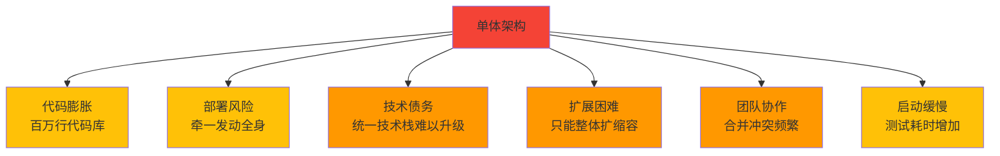
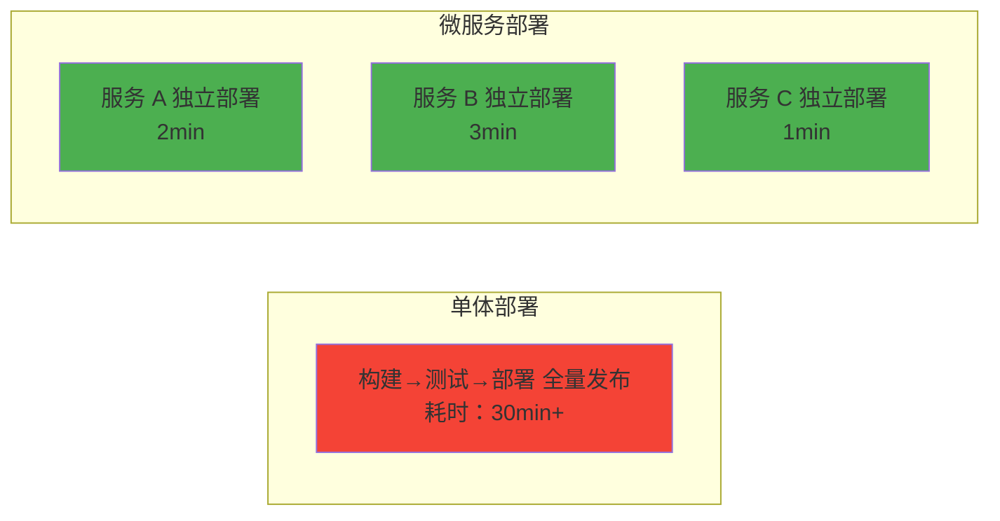
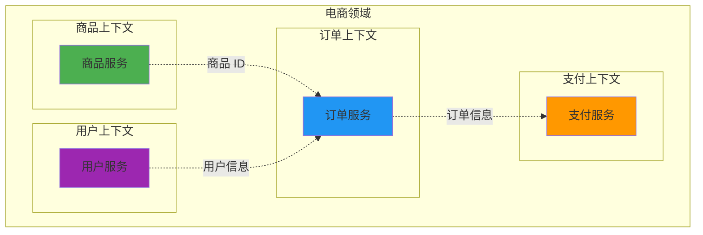
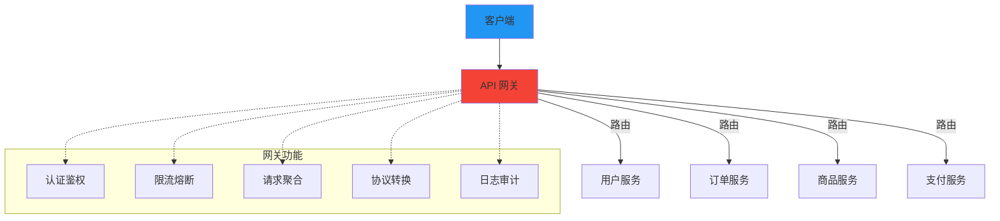
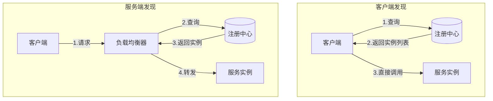
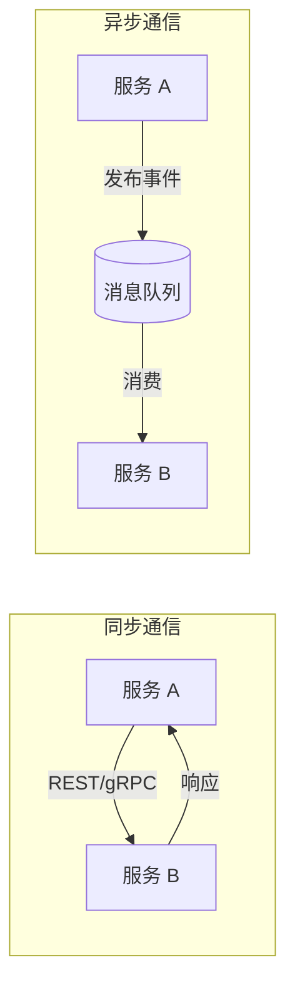
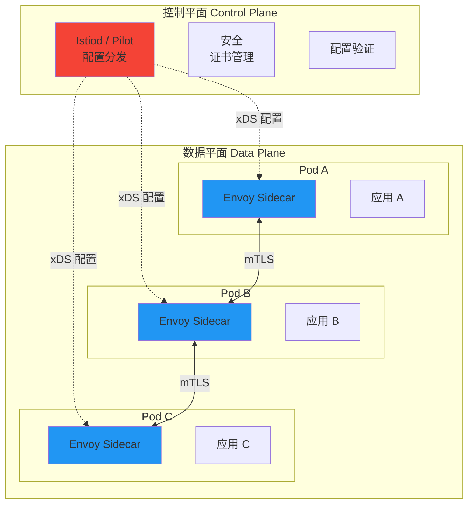
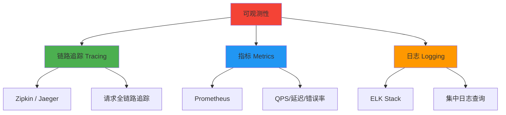
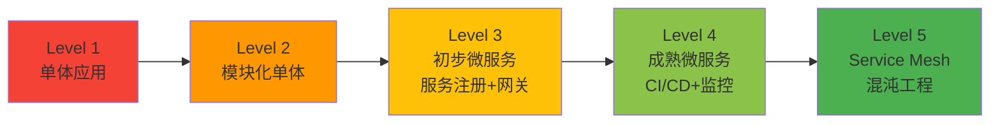

## 从单体到微服务：架构演进的必然之路

软件架构的演进从来不是技术人的自嗨，而是业务规模增长带来的必然选择。理解单体与微服务的边界，掌握服务拆分与治理的核心技术，是每一位后端工程师的必修课。

---

## 一、单体架构的局限与微服务的诞生

### 1.1 单体架构的困境

单体架构（Monolithic Architecture）将所有业务逻辑、数据访问、UI 层打包在一个部署单元中。在项目初期，单体架构开发效率高、部署简单、调试方便。但随着业务增长，问题逐渐暴露：



| 维度 | 单体架构 | 微服务架构 |
|------|---------|-----------|
| 代码组织 | 单一代码库 | 多个独立代码库 |
| 部署方式 | 整体部署 | 独立部署 |
| 技术栈 | 统一技术栈 | 异构技术栈（按场景选型） |
| 扩展性 | 整体扩展（浪费资源） | 按需独立扩展（精准扩容） |
| 故障影响 | 全局故障 | 故障隔离（舱壁模式） |
| 数据管理 | 共享数据库 | 每服务独立数据库 |
| 开发效率 | 初期高，后期低 | 初期低（基础设施），后期高 |
| 运维复杂度 | 低 | 高（需配套基础设施） |
| 团队组织 | 按技术层分（前端/后端/DBA） | 按业务域分（全功能团队） |

### 1.2 什么时候需要微服务？

不是所有项目都需要微服务。以下信号表明你可能需要拆分：

- **团队规模 > 50 人**，代码合并冲突成为常态
- **部署频率低**，因为每次发布需要协调多个团队
- **部分模块成为瓶颈**，但只能整体扩容
- **技术栈需要差异化**，不同场景需要不同技术方案
- **故障隔离需求强**，一个模块的故障不应影响全局

> **Conway 定律**：系统架构与组织架构同构。微服务不仅是技术决策，更是组织决策。

---

## 二、微服务的核心特征

### 2.1 独立部署

每个服务可以独立构建、测试、部署，不依赖其他服务的发布周期。



### 2.2 独立数据

每个微服务拥有自己的数据存储，其他服务不能直接访问。

| 数据共享方式 | 是否推荐 | 说明 |
|-------------|---------|------|
| 共享数据库表 | ❌ | 紧耦合，破坏服务自治 |
| 共享数据库（不同 Schema） | ⚠️ | 有耦合但可控 |
| 独立数据库 | ✅ | 完全自治，推荐方式 |
| API 暴露数据 | ✅ | 通过服务接口访问 |

### 2.3 领域驱动

微服务的边界应该由业务领域决定，而非技术分层。使用 DDD 的限界上下文（Bounded Context）来划定服务边界。

---

## 三、服务拆分原则

### 3.1 单一职责原则

每个服务应该只负责一个业务领域，具有高内聚、低耦合的特点。

### 3.2 领域边界

基于 DDD 的限界上下文来拆分服务，确保领域概念的完整性。



### 3.3 数据自治

每个服务管理自己的数据，通过 API 或事件进行数据交互，避免数据库级别的耦合。

### 3.4 拆分反模式

| 反模式 | 描述 | 危害 |
|--------|------|------|
| 分布式单体 | 服务间强同步依赖 | 部署耦合，故障传播 |
| 按技术层拆分 | 分为 UI 服务、DB 服务 | 业务逻辑散落 |
| 过细拆分 | 一个 CRUD 一个服务 | 运维成本爆炸 |
| 共享数据库 | 多个服务写同一张表 | 数据耦合，难以独立演进 |

---

## 四、API 网关

### 4.1 网关的核心作用

API 网关是微服务架构的"门面"，客户端只与网关交互，由网关路由到具体的服务。



### 4.2 网关功能详解

| 功能 | 说明 | 典型实现 |
|------|------|---------|
| 路由 | 根据 URL/Method 转发到后端服务 | Nginx、Kong、Spring Cloud Gateway |
| 认证鉴权 | 统一验证 Token、权限校验 | OAuth2、JWT |
| 限流 | 控制请求速率，保护后端服务 | 令牌桶、滑动窗口 |
| 熔断降级 | 后端服务故障时快速返回 | Hystrix、Sentinel |
| 请求聚合 | 一次请求聚合多个服务响应 | GraphQL、BFF |
| 协议转换 | HTTP ↔ gRPC、WebSocket | Envoy |
| 灰度发布 | 按比例将流量路由到新版本 | Header 路由、权重路由 |

### 4.3 网关选型对比

| 网关 | 语言 | 性能 | 生态 | 适用场景 |
|------|------|------|------|---------|
| Nginx | C | 极高 | 成熟 | 反向代理、静态资源 |
| Kong | Lua/Nginx | 高 | 丰富（插件） | API 管理平台 |
| Spring Cloud Gateway | Java | 中 | 与 Spring 生态深度集成 | Java 微服务 |
| Envoy | C++ | 极高 | 云原生标准 | Service Mesh 数据平面 |
| APISIX | Lua/Nginx | 高 | 活跃（Apache） | 高性能 API 网关 |

---

## 五、服务注册与发现

### 5.1 为什么需要服务发现？

微服务实例动态变化（扩缩容、故障迁移），硬编码 IP 不可行。服务注册与发现解决了"服务在哪里"的问题。

### 5.2 客户端发现 vs 服务端发现



| 维度 | 客户端发现 | 服务端发现 |
|------|-----------|-----------|
| 客户端职责 | 需要集成发现逻辑 + 负载均衡 | 只需知道网关地址 |
| 灵活性 | 高（可实现自定义 LB 策略） | 低（由 LB 决定） |
| 语言无关 | 否（需各语言 SDK） | 是（对客户端透明） |
| 典型方案 | Eureka + Ribbon、Consul | Nginx、Kong、Envoy |

### 5.3 主流注册中心对比

| 注册中心 | CAP 侧重 | 健康检查 | 多数据中心 | 语言 |
|----------|---------|---------|-----------|------|
| Eureka | AP（高可用） | 客户端心跳 | 支持 | Java |
| Consul | CP（一致性） | 多种检查方式 | 支持 | Go |
| Nacos | AP/CP 可切换 | 客户端心跳 | 支持 | Java |
| Zookeeper | CP | 会话机制 | 有限 | Java |

---

## 六、配置中心

### 6.1 为什么需要配置中心？

微服务实例数量多，配置分散管理困难。配置中心解决了以下问题：

- **集中管理**：所有配置统一管理，避免散落
- **动态刷新**：修改配置无需重启服务
- **环境隔离**：dev/test/prod 配置隔离
- **版本管理**：配置变更可追溯、可回滚
- **权限控制**：敏感配置加密，权限分级

### 6.2 主流配置中心

| 配置中心 | 动态刷新 | 版本管理 | 灰度配置 | 依赖 |
|----------|---------|---------|---------|------|
| Apollo | ✅ | ✅ | ✅ | MySQL |
| Nacos Config | ✅ | ✅ | ✅ | MySQL |
| Consul KV | ✅ | ❌ | ❌ | — |
| Spring Cloud Config | ✅（需 Bus） | Git 版本 | ❌ | Git |

---

## 七、服务间通信

### 7.1 同步通信 vs 异步通信



### 7.2 通信方式选型

| 方式 | 协议 | 性能 | 适用场景 | 典型框架 |
|------|------|------|---------|---------|
| REST | HTTP/JSON | 中 | 外部 API、简单场景 | Spring MVC、Flask |
| gRPC | HTTP/2 + Protobuf | 高 | 内部服务调用、高性能场景 | gRPC |
| 消息队列 | AMQP/MQTT | 高 | 异步解耦、事件驱动 | Kafka、RabbitMQ、RocketMQ |

### 7.3 gRPC vs REST 对比

| 维度 | REST | gRPC |
|------|------|------|
| 数据格式 | JSON（文本） | Protobuf（二进制） |
| 序列化开销 | 高 | 低（3-10x 快） |
| 传输协议 | HTTP/1.1 或 HTTP/2 | HTTP/2 |
| 流式支持 | 有限 | 原生支持（双向流） |
| 代码生成 | 无 | 自动生成客户端/服务端 |
| 浏览器支持 | 原生 | 需要 gRPC-Web 代理 |
| 调试 | 容易（可读 JSON） | 需要工具（protobuf 不可读） |

### 7.4 gRPC 示例

```protobuf
// 订单服务定义
syntax = "proto3";
package order;

service OrderService {
  rpc CreateOrder(CreateOrderRequest) returns (OrderResponse);
  rpc GetOrder(GetOrderRequest) returns (OrderResponse);
  rpc StreamOrders(StreamRequest) returns (stream OrderResponse);
}

message CreateOrderRequest {
  string user_id = 1;
  repeated OrderItem items = 2;
}

message OrderItem {
  string product_id = 1;
  int32 quantity = 2;
}

message OrderResponse {
  string order_id = 1;
  string status = 2;
  double total_amount = 3;
}
```

---

## 八、服务网格（Service Mesh）

### 8.1 什么是 Service Mesh？

Service Mesh 是将服务间通信的治理逻辑（路由、熔断、限流、监控）从业务代码中剥离，下沉到基础设施层的架构模式。

### 8.2 Istio 架构



### 8.3 Service Mesh 的核心价值

| 特性 | 说明 |
|------|------|
| 流量管理 | 金丝雀发布、蓝绿部署、A/B 测试 |
| 安全 | 服务间 mTLS 自动加密，零信任网络 |
| 可观测性 | 自动收集指标、日志、链路追踪 |
| 弹性 | 熔断、限流、重试、超时（无需改代码） |
| 多语言 | 对应用透明，任何语言的服务都能受益 |

### 8.4 Sidecar 模式的代价

| 代价 | 说明 |
|------|------|
| 资源开销 | 每个 Pod 多一个 Envoy 进程（CPU/内存） |
| 延迟增加 | 每次请求多一次 Sidecar 转发（~1ms） |
| 运维复杂度 | 需要管理 Mesh 控制平面 |
| 调试困难 | 流量路径变长，问题排查链路更长 |

---

## 九、微服务监控

### 9.1 可观测性三大支柱



### 9.2 监控体系对比

| 维度 | 链路追踪 | 指标监控 | 日志 |
|------|---------|---------|------|
| 解决的问题 | "请求经过了哪些服务？" | "系统运行是否正常？" | "发生了什么？" |
| 数据粒度 | 请求级别 | 聚合统计 | 事件级别 |
| 典型工具 | Jaeger、Zipkin、SkyWalking | Prometheus、Grafana | ELK、Loki |
| 存储开销 | 高 | 低 | 极高 |
| 采样 | 需要（通常 1%-10%） | 全量 | 全量（或关键级别） |

### 9.3 黄金指标（Four Golden Signals）

| 指标 | 说明 | 告警阈值示例 |
|------|------|-------------|
| 延迟（Latency） | 请求处理时间 | P99 > 500ms |
| 流量（Traffic） | 请求量 | QPS 突增/突降 50% |
| 错误（Errors） | 失败请求比例 | 5xx > 1% |
| 饱和度（Saturation） | 资源使用率 | CPU > 80%, 内存 > 90% |

---

## 十、微服务的代价与反模式

### 10.1 微服务的代价

微服务不是银弹。引入微服务意味着：

| 代价 | 说明 |
|------|------|
| 分布式复杂性 | 网络延迟、部分故障、数据一致性 |
| 运维负担 | 服务发现、配置管理、监控、日志聚合 |
| 测试困难 | 需要集成测试、契约测试、端到端测试 |
| 部署复杂度 | CI/CD 管线复杂，需要自动化 |
| 团队要求 | 需要 DevOps 文化，全功能团队 |
| 调试困难 | 跨服务问题排查需要链路追踪 |

### 10.2 常见反模式

| 反模式 | 描述 | 解决方案 |
|--------|------|---------|
| 分布式单体 | 服务间强同步调用，部署耦合 | 异步通信、事件驱动 |
| 共享数据库 | 多个服务直接读写同一数据库 | 每服务独立数据库，通过 API 访问 |
| 同步调用链过长 | A→B→C→D→E 同步调用 | 异步化、缓存、服务合并 |
| 过细拆分 | 几十个微服务，运维成本爆炸 | 合并相关服务，遵循领域边界 |
| 忽略运维 | 没有监控、日志、链路追踪 | 建设完整的可观测性体系 |
| 没有自动化 | 手动部署、手动测试 | 建立完善的 CI/CD 管线 |

### 10.3 微服务成熟度模型



---

## 十一、面试 Q&A

### Q1：如何确定微服务的边界？

**A**：服务拆分是微服务最核心的问题。推荐方法：

1. **DDD 限界上下文**：以业务领域为边界，识别领域模型和聚合
2. **康威定律**：服务边界与团队边界一致，一个团队负责一个服务
3. **数据自治**：不同数据所有权意味着不同服务
4. **变更频率**：经常一起变更的模块放一起，很少一起变更的分开放
5. **非功能需求**：性能、安全要求不同的应拆分

### Q2：微服务间如何保证数据一致性？

**A**：微服务独立数据库，无法使用本地事务。常见方案：

- **Saga 模式**：将长事务拆为多个本地事务，失败时执行补偿操作
- **事件驱动**：通过消息队列实现最终一致性
- **TCC 模式**：Try-Confirm-Cancel，适用于强一致性场景
- **Outbox 模式**：本地事务 + 消息表，保证操作和消息发送的原子性

### Q3：API 网关和服务网格有什么区别？

**A**：

| 维度 | API 网关 | Service Mesh |
|------|---------|-------------|
| 流量方向 | 南北向（外部到内部） | 东西向（服务到服务） |
| 部署位置 | 边缘（入口） | 每个服务旁（Sidecar） |
| 管理范围 | 入口流量 | 全部内部流量 |
| 主要功能 | 路由、认证、限流 | 路由、mTLS、可观测性 |
| 是否互斥 | 否，通常配合使用 | 否，通常配合使用 |

### Q4：什么时候不应该使用微服务？

**A**：以下场景不适合微服务：

- 团队规模小（< 10 人），单体效率更高
- 业务不确定，需要快速迭代验证
- 没有成熟的 DevOps 基础设施
- 系统本身不复杂，没有扩展瓶颈
- 团队成员缺乏分布式系统经验

> **Jeff Bezos 的两披萨原则**：一个团队的人数不应该超过两个披萨能喂饱的数量（约 6-10 人）。每个微服务应由一个两披萨团队全权负责。

### Q5：如何处理微服务的跨服务事务？

**A**：使用 Saga 模式。以电商下单为例：

1. **创建订单** → 成功
2. **扣减库存** → 成功
3. **扣减优惠券** → 失败
4. **补偿：释放库存** → 成功
5. **补偿：取消订单** → 成功

每个步骤都有对应的补偿操作，确保最终一致性。

### Q6：微服务的版本如何管理？

**A**：

- **API 版本化**：URL 路径（`/v1/orders`）或 Header（`Accept: application/vnd.myapi.v1+json`）
- **向后兼容**：尽量添加字段而非修改/删除，保证旧客户端可用
- **并行运行**：新旧版本同时运行，逐步迁移流量
- **契约测试**：使用 Pact 等工具确保 API 变更不会破坏消费者
- **灰度发布**：先对少量用户发布新版本，验证后全量