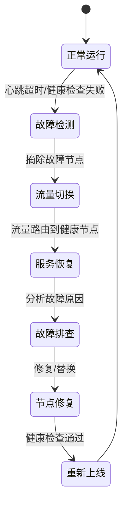
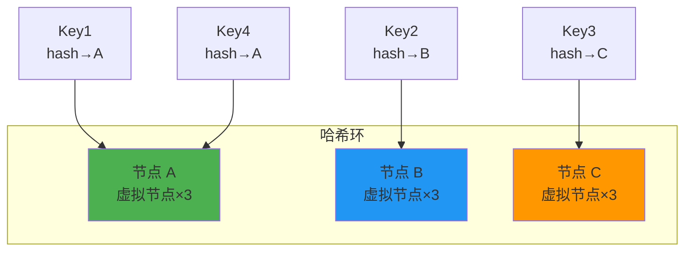
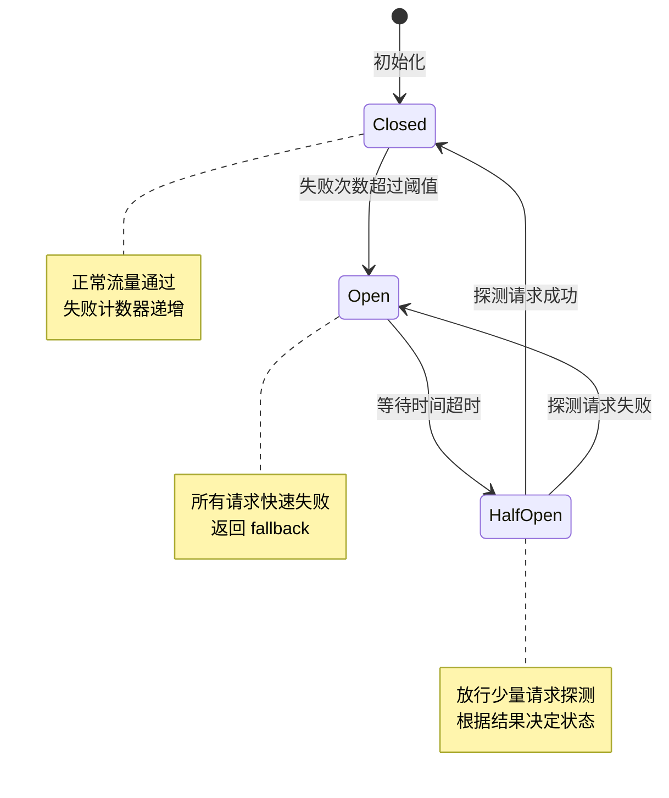
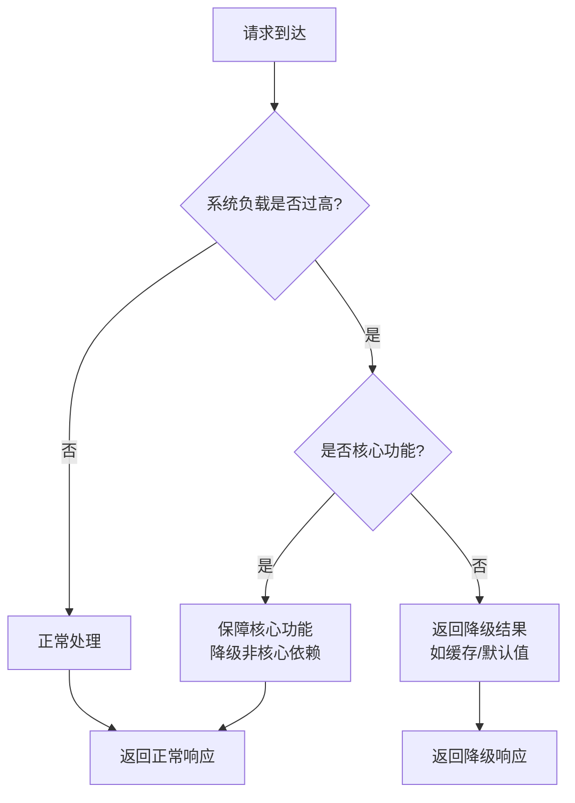
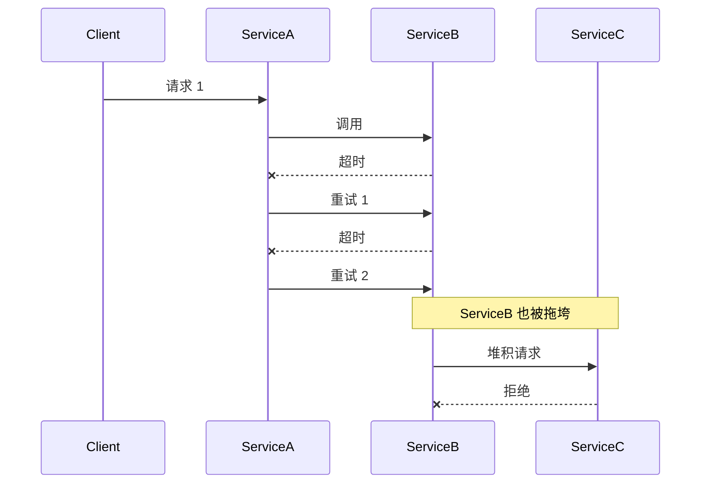
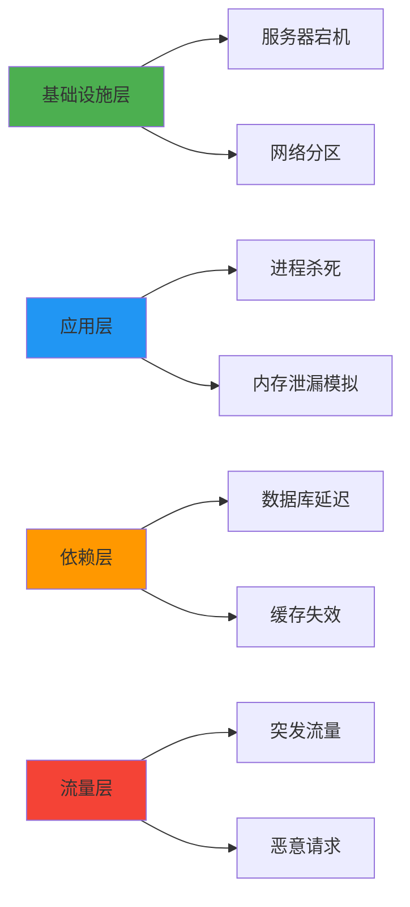
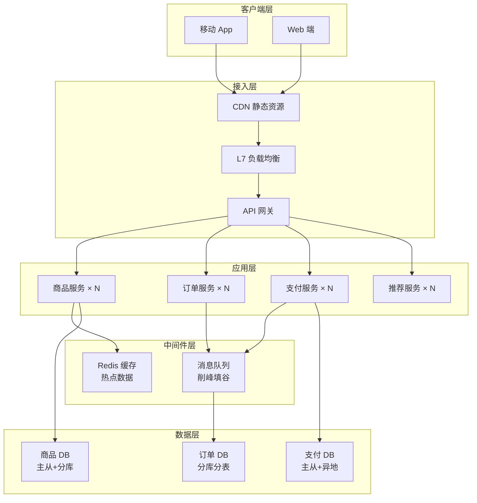

## 高可用：系统设计的生命线

> "Everything fails, all the time." —— Werner Vogels（Amazon CTO）

高可用（High Availability）不是追求系统永不故障——那是不可能的——而是在故障发生时，系统仍能**持续提供服务**或**快速恢复**。高可用架构的本质是**面向故障设计**。

---

## 一、可用性的度量

### 1.1 几个 9 的含义

可用性用**可用率**衡量，即系统正常运行时间占总时间的比例。

| 可用率 | 年停机时间 | 等级 | 典型系统 |
|--------|-----------|------|---------|
| 99% | 3 天 15 小时 36 分 | 2 个 9 | 普通网站、个人博客 |
| 99.9% | 8 小时 46 分 | 3 个 9 | 企业级 SaaS 应用 |
| 99.99% | 52 分 36 秒 | 4 个 9 | 电商核心交易系统 |
| 99.999% | 5 分 15 秒 | 5 个 9 | 电信级系统、支付网关 |
| 99.9999% | 31.5 秒 | 6 个 9 | 航空航天、医疗设备 |

可用率计算公式：

$$Availability = \frac{MTTF}{MTTF + MTTR}$$

- **MTTF**（Mean Time To Failure）：平均无故障时间
- **MTTR**（Mean Time To Recovery）：平均恢复时间

**提高可用性的两条路径**：增大 MTTF（减少故障发生）或减小 MTTR（加快故障恢复）。

### 1.2 可用性的工程现实

每增加一个 9，成本呈指数增长。从 3 个 9 到 4 个 9，不仅仅是多一台机器那么简单，而是需要重新审视整个架构的每一个环节。


---

## 二、高可用架构的核心原则

### 2.1 冗余（Redundancy）

消除单点故障（SPOF, Single Point of Failure）的第一手段。每一个关键组件都必须有副本。

- **应用层冗余**：多实例部署，无状态服务水平扩展
- **数据层冗余**：主从复制、多副本、跨地域同步
- **网络层冗余**：多链路、多运营商接入
- **基础设施冗余**：多可用区（AZ）、多地域（Region）

### 2.2 隔离（Isolation）

故障不应扩散。隔离是高可用架构的"防火墙"。

- **进程隔离**：不同服务独立进程，互不影响
- **资源隔离**：CPU、内存、IO 配额限制（cgroups）
- **部署隔离**：核心链路与非核心链路物理隔离
- **数据隔离**：读写分离、冷热数据分离

### 2.3 自动故障转移（Failover）

人工响应太慢。系统必须能自动检测故障并切换。



### 2.4 原则总结对比

| 原则 | 解决的问题 | 典型手段 | 代价 |
|------|-----------|---------|------|
| 冗余 | 单点故障 | 多副本、多实例 | 资源成本翻倍 |
| 隔离 | 故障扩散 | 舱壁模式、限流 | 系统复杂度增加 |
| 自动故障转移 | 人工响应慢 | 健康检查、自动切换 | 可能误判 |

---

## 三、负载均衡

### 3.1 L4 vs L7 负载均衡

| 维度 | L4（传输层） | L7（应用层） |
|------|------------|-------------|
| OSI 层级 | 传输层（TCP/UDP） | 应用层（HTTP/HTTPS） |
| 决策依据 | IP + 端口 | URL、Header、Cookie |
| 性能 | 高（无需解析内容） | 较低（需解析 HTTP） |
| 灵活性 | 低 | 高 |
| 典型工具 | LVS、F5、nginx stream | Nginx、HAProxy、Envoy |
| 适用场景 | 高吞吐转发、TCP 代理 | URL 路由、内容分发 |

### 3.2 负载均衡算法

#### 轮询（Round Robin）

最简单的算法，将请求依次分配给后端服务器。

```python
class RoundRobin:
    def __init__(self, servers):
        self.servers = servers
        self.index = 0

    def next_server(self):
        server = self.servers[self.index]
        self.index = (self.index + 1) % len(self.servers)
        return server
```

#### 加权轮询（Weighted Round Robin）

考虑服务器性能差异，性能高的分配更多请求。

```python
class WeightedRoundRobin:
    def __init__(self, servers):
        """servers: [(ip, weight), ...]"""
        self.servers = servers
        self.current_weights = {s[0]: 0 for s in servers}

    def next_server(self):
        total = sum(w for _, w in self.servers)
        for ip, weight in self.servers:
            self.current_weights[ip] += weight
        best = max(self.current_weights, key=self.current_weights.get)
        self.current_weights[best] -= total
        return best
```

#### 最少连接（Least Connections）

将请求分配给当前连接数最少的服务器，适合长连接场景。

#### 一致性哈希（Consistent Hashing）

相同 Key 的请求总是路由到同一台服务器，适合缓存场景。通过虚拟节点解决数据倾斜问题。



---

## 四、限流算法详解

限流（Rate Limiting）是保护系统不被突发流量击垮的第一道防线。

### 4.1 固定窗口计数器

在固定时间窗口内计数，超过阈值则拒绝。

```python
import time
from threading import Lock

class FixedWindowRateLimiter:
    def __init__(self, limit, window_seconds):
        self.limit = limit
        self.window = window_seconds
        self.count = 0
        self.window_start = time.time()
        self.lock = Lock()

    def allow(self):
        with self.lock:
            now = time.time()
            if now - self.window_start >= self.window:
                # 窗口重置
                self.count = 0
                self.window_start = now
            if self.count < self.limit:
                self.count += 1
                return True
            return False
```

**缺点**：窗口边界问题——窗口末尾和下一个窗口开头可能承受 2 倍流量。

### 4.2 滑动窗口

将窗口细分为多个小格子，平滑计数。

```python
import time
from collections import deque

class SlidingWindowRateLimiter:
    def __init__(self, limit, window_seconds, granularity=10):
        self.limit = limit
        self.window = window_seconds
        self.slot_seconds = window_seconds / granularity
        self.slots = deque(maxlen=granularity)  # [(timestamp, count), ...]
        self.total = 0

    def allow(self):
        now = time.time()
        # 清除过期槽
        while self.slots and now - self.slots[0][0] >= self.window:
            _, count = self.slots.popleft()
            self.total -= count
        if self.total < self.limit:
            # 放入当前槽
            if not self.slots or now - self.slots[-1][0] >= self.slot_seconds:
                self.slots.append((now, 1))
            else:
                ts, count = self.slots.pop()
                self.slots.append((ts, count + 1))
            self.total += 1
            return True
        return False
```

### 4.3 令牌桶（Token Bucket）

以固定速率生成令牌，请求需消耗令牌才能通过。允许一定程度的突发流量。

```python
import time
import threading

class TokenBucket:
    def __init__(self, rate, capacity):
        """
        rate: 每秒生成的令牌数
        capacity: 桶的最大容量（允许的最大突发）
        """
        self.rate = rate
        self.capacity = capacity
        self.tokens = capacity
        self.last_refill = time.time()
        self.lock = threading.Lock()

    def allow(self, tokens=1):
        with self.lock:
            now = time.time()
            # 补充令牌
            elapsed = now - self.last_refill
            self.tokens = min(self.capacity, self.tokens + elapsed * self.rate)
            self.last_refill = now

            if self.tokens >= tokens:
                self.tokens -= tokens
                return True
            return False
```

### 4.4 漏桶（Leaky Bucket）

以固定速率处理请求，超出部分丢弃或排队。

```python
import time
import threading

class LeakyBucket:
    def __init__(self, rate, capacity):
        """
        rate: 每秒处理的请求数（流出速率）
        capacity: 桶的最大容量（队列大小）
        """
        self.rate = rate
        self.capacity = capacity
        self.water = 0
        self.last_leak = time.time()
        self.lock = threading.Lock()

    def allow(self):
        with self.lock:
            now = time.time()
            # 漏水
            elapsed = now - self.last_leak
            self.water = max(0, self.water - elapsed * self.rate)
            self.last_leak = now

            if self.water < self.capacity:
                self.water += 1
                return True
            return False
```

### 4.5 限流算法对比

| 算法 | 平滑度 | 突发支持 | 实现复杂度 | 适用场景 |
|------|--------|---------|-----------|---------|
| 固定窗口 | 差 | 无 | 低 | 简单场景 |
| 滑动窗口 | 好 | 无 | 中 | 精确限流 |
| 令牌桶 | 好 | 有 | 中 | API 限流 |
| 漏桶 | 好 | 无 | 中 | 匀速处理 |

---

## 五、熔断器模式（Circuit Breaker）

### 5.1 三状态转换

熔断器的灵感来自电路中的保险丝——当依赖服务故障时，快速失败，避免雪崩。



### 5.2 代码实现

```python
import time
from enum import Enum
from threading import Lock

class CircuitState(Enum):
    CLOSED = "closed"
    OPEN = "open"
    HALF_OPEN = "half_open"

class CircuitBreaker:
    def __init__(self, failure_threshold=5, recovery_timeout=30,
                 half_open_max_calls=1):
        self.failure_threshold = failure_threshold
        self.recovery_timeout = recovery_timeout
        self.half_open_max_calls = half_open_max_calls
        self.state = CircuitState.CLOSED
        self.failure_count = 0
        self.last_failure_time = None
        self.half_open_calls = 0
        self.lock = Lock()

    def call(self, func, *args, fallback=None, **kwargs):
        with self.lock:
            if self.state == CircuitState.OPEN:
                if time.time() - self.last_failure_time >= self.recovery_timeout:
                    self.state = CircuitState.HALF_OPEN
                    self.half_open_calls = 0
                else:
                    raise CircuitBreakerOpenError("熔断器处于打开状态")

            if self.state == CircuitState.HALF_OPEN:
                if self.half_open_calls >= self.half_open_max_calls:
                    raise CircuitBreakerOpenError("半开状态探测中")
                self.half_open_calls += 1

        try:
            result = func(*args, **kwargs)
            self._on_success()
            return result
        except Exception as e:
            self._on_failure()
            if fallback:
                return fallback()
            raise

    def _on_success(self):
        with self.lock:
            if self.state == CircuitState.HALF_OPEN:
                self.state = CircuitState.CLOSED
            self.failure_count = 0

    def _on_failure(self):
        with self.lock:
            self.failure_count += 1
            self.last_failure_time = time.time()
            if self.failure_count >= self.failure_threshold:
                self.state = CircuitState.OPEN
```

### 5.3 熔断器参数调优

| 参数 | 建议值 | 说明 |
|------|--------|------|
| 失败阈值 | 5-10 次 | 太小容易误熔断，太大反应慢 |
| 恢复超时 | 30-60 秒 | 给下游足够的恢复时间 |
| 半开最大请求 | 1-3 个 | 少量探测，避免下游再次被打垮 |

---

## 六、降级策略

### 6.1 核心链路保障

在系统面临压力时，优先保障核心业务，非核心功能可被降级或关闭。

**电商核心链路**：浏览商品 → 加入购物车 → 下单 → 支付 → 发货

**可降级功能**：
- 商品推荐、个性化展示
- 评价、晒单功能
- 物流轨迹实时查询
- 客服在线咨询

### 6.2 降级方式

| 降级方式 | 示例 | 影响 |
|----------|------|------|
| 功能降级 | 关闭推荐系统 | 用户体验下降，核心功能正常 |
| 数据降级 | 返回缓存数据 | 数据可能不是最新 |
| 页面降级 | 返回简化版页面 | 功能减少，但可用 |
| 服务降级 | 直接返回默认值 | 下游依赖故障时的兜底 |



---

## 七、超时与重试

### 7.1 重试风暴

重试是一把双刃剑——合理重试可以应对瞬态故障，但不当重试会引发雪崩。



### 7.2 最佳实践

**超时设置**：
- 每个依赖调用必须设置超时
- 超时应小于上游的超时（级联递减）
- 推荐公式：`超时 = P99 延迟 × 2 + 网络开销`

**重试策略——指数退避 + 抖动（Jitter）**：

```python
import random
import time

def retry_with_backoff(func, max_retries=3, base_delay=1.0, max_delay=60.0):
    """指数退避 + 随机抖动"""
    for attempt in range(max_retries + 1):
        try:
            return func()
        except (ConnectionError, TimeoutError) as e:
            if attempt == max_retries:
                raise
            # 指数退避
            delay = min(base_delay * (2 ** attempt), max_delay)
            # 添加抖动（避免重试风暴）
            jitter = random.uniform(0, delay * 0.5)
            time.sleep(delay + jitter)
```

**关键原则**：
- 仅对**幂等操作**重试
- 对非幂等操作（如支付），使用唯一请求 ID 实现幂等性
- 全链路重试次数应有限制（如最多 3 次）

---

## 八、故障演练与混沌工程

### 8.1 混沌工程原则

混沌工程（Chaos Engineering）通过**主动注入故障**来验证系统的容错能力。

| 阶段 | 行动 | 工具 |
|------|------|------|
| 定义稳态 | 确定正常运行的指标基线 | Prometheus |
| 提出假设 | "如果 X 故障，系统仍可用" | — |
| 注入故障 | 杀死进程、模拟延迟、断网 | ChaosBlade、Gremlin |
| 验证结果 | 对比实际表现与假设 | Grafana 面板 |
| 修复改进 | 填补发现的能力缺口 | — |

### 8.2 常见故障注入场景



---

## 九、实战案例：电商大促架构设计

### 9.1 架构全景

以双十一大促为例，面对平时 10-100 倍的流量峰值。



### 9.2 关键保障措施

| 措施 | 说明 | 效果 |
|------|------|------|
| CDN 缓存 | 静态资源、商品详情缓存到边缘节点 | 减少 80% 回源流量 |
| 库存预扣 | 使用 Redis 原子操作预扣库存 | 避免超卖，减轻 DB 压力 |
| 异步下单 | 下单请求写入 MQ，异步处理 | 削峰填谷，平滑写入 |
| 限流保护 | 网关层按用户/IP 限流 | 防止恶意刷单 |
| 降级预案 | 推荐、评价等非核心功能可一键降级 | 保障核心交易链路 |
| 多活部署 | 多地域多活，流量可动态切换 | 地域级故障不影响全局 |

### 9.3 大促前的演练清单

1. **全链路压测**：模拟 5 倍峰值流量，验证系统水位
2. **混沌演练**：随机杀节点、断网络、模拟 DB 延迟
3. **降级演练**：实际触发降级，验证 fallback 逻辑
4. **切换演练**：模拟机房故障，验证多活切换流程
5. **容量规划**：根据压测结果扩容至安全水位

---

## 十、面试 Q&A

### Q1：如何从 99.9% 提升到 99.99% 的可用性？

**A**：从 3 个 9 到 4 个 9，年停机时间从 8.76 小时降低到 52 分钟，核心差距在于 **MTTR 的缩短**：

- **自动化故障检测与恢复**：从人工介入到自动切换
- **多活架构**：从单机房到多机房/多地域
- **更快的发布回滚**：灰度发布、快速回滚机制
- **完善的监控告警**：秒级发现故障，分钟级定位

### Q2：令牌桶和漏桶有什么区别？

**A**：核心区别在于对**突发流量**的处理：

- **令牌桶**：允许突发。桶满时可以一次性消耗多个令牌，适合允许突发但平均速率受限的场景（如 API 限流）。
- **漏桶**：平滑输出。无论输入多快，输出速率恒定，适合需要匀速处理的场景（如数据库写入保护）。

### Q3：重试风暴是如何产生的？如何避免？

**A**：当 A 服务调用 B 服务超时后重试，而 B 服务也因为负载高而变慢，此时 A 的重试请求会进一步加剧 B 的负载，形成恶性循环。避免方法：

- **指数退避 + 抖动**：拉开重试间隔，打散重试时间
- **限制重试次数**：全链路总重试次数不超过 3 次
- **熔断器**：下游持续失败时熔断，不再重试
- **幂等性保证**：确保重试不会产生副作用

### Q4：什么是舱壁模式（Bulkhead Pattern）？

**A**：舱壁模式来源于船舶设计——船舱被隔板分成多个独立区域，一个区域漏水不会沉没整艘船。在软件中：

- **线程池隔离**：不同依赖使用不同线程池，一个依赖的慢调用不会耗尽所有线程
- **信号量隔离**：限制并发请求数
- **实例隔离**：核心功能和非核心功能部署在不同实例上

### Q5：混沌工程和传统测试有什么区别？

**A**：

| 维度 | 传统测试 | 混沌工程 |
|------|---------|---------|
| 目标 | 验证已知场景 | 发现未知问题 |
| 方法 | 编写用例、预期输出 | 主动注入故障、观察行为 |
| 环境 | 测试环境 | 生产环境 |
| 覆盖 | 功能正确性 | 系统韧性 |

### Q6：在高可用架构中，CAP 定理如何取舍？

**A**：CAP 定理指出分布式系统只能同时满足一致性（C）、可用性（A）、分区容错性（P）中的两个。高可用架构通常选择 **AP**（牺牲强一致性换取可用性），通过**最终一致性**补偿数据。例如：

- 电商库存：先扣减再异步同步（AP + 最终一致）
- 支付系统：需要 CP，但通过多副本 + 共识算法保证可用性