## 1. 性能优化原则

### 1.1 两条铁律

> **铁律一：不要过早优化。** —— Donald Knuth
> **铁律二：不要凭直觉优化。** —— 工程实践

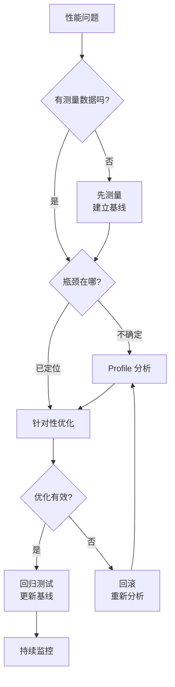

### 1.2 优化原则清单

| 原则 | 说明 |
|------|------|
| **测量先行** | 没有数据不优化，先建立性能基线 |
| **瓶颈定位** | 优化最慢的环节，Amdahl 定律 |
| **渐进优化** | 每次只改一个变量，验证效果 |
| **可回滚** | 优化可能引入 Bug，必须能回滚 |
| **性价比** | 10% 性能提升花 1 天 vs 2% 提升 花 1 周 |
| **持续监控** | 优化不是一次性活动，性能会退化 |

### 1.3 Amdahl 定律

$$
S = \frac{1}{(1 - p) + \frac{p}{s}}
$$

其中 $p$ 为可优化部分的比例，$s$ 为该部分的加速比，$S$ 为总体加速比。

**含义**：如果某部分只占总时间的 5%，即使加速 100 倍，总体提升也只有：

$$
S = \frac{1}{0.95 + 0.05/100} = \frac{1}{0.9505} \approx 1.053
$$

**结论**：先优化占比最大的瓶颈。

---

## 2. 性能指标

### 2.1 核心指标体系

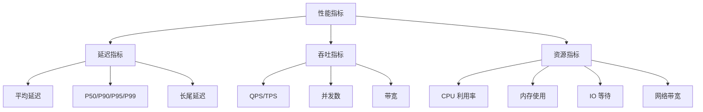

### 2.2 百分位延迟

| 指标 | 含义 | 典型要求 |
|------|------|----------|
| P50 | 50% 请求的延迟 | 用户体验基线 |
| P90 | 90% 请求的延迟 | 大多数用户体验 |
| P99 | 99% 请求的延迟 | 长尾用户体验 |
| P99.9 | 99.9% 请求的延迟 | 极端情况 |

> **为什么 P99 比平均值更重要？** 平均值掩盖了长尾延迟。100 个请求中 99 个 10ms + 1 个 10s，平均值 109ms，但 P99 = 10s。对于 SLA 而言，P99 才是关键。

### 2.3 延迟分布的可视化

$$
\text{SLA 达标率} = P(\text{latency} \leq \text{threshold}) \geq 99.9\%
$$

延迟通常服从对数正态分布，长尾效应显著：

```python
import numpy as np

# 模拟延迟分布
latencies = np.random.lognormal(mean=2, sigma=1.5, size=100000)

print(f"平均值: {np.mean(latencies):.1f}ms")
print(f"P50:   {np.percentile(latencies, 50):.1f}ms")
print(f"P90:   {np.percentile(latencies, 90):.1f}ms")
print(f"P99:   {np.percentile(latencies, 99):.1f}ms")
print(f"P99.9: {np.percentile(latencies, 99.9):.1f}ms")
# 输出示例：
# 平均值: 22.3ms
# P50:    7.4ms
# P90:    40.2ms
# P99:    182.5ms
# P99.9:  823.1ms
```

---

## 3. Profiling 工具

### 3.1 Profiling 方法论

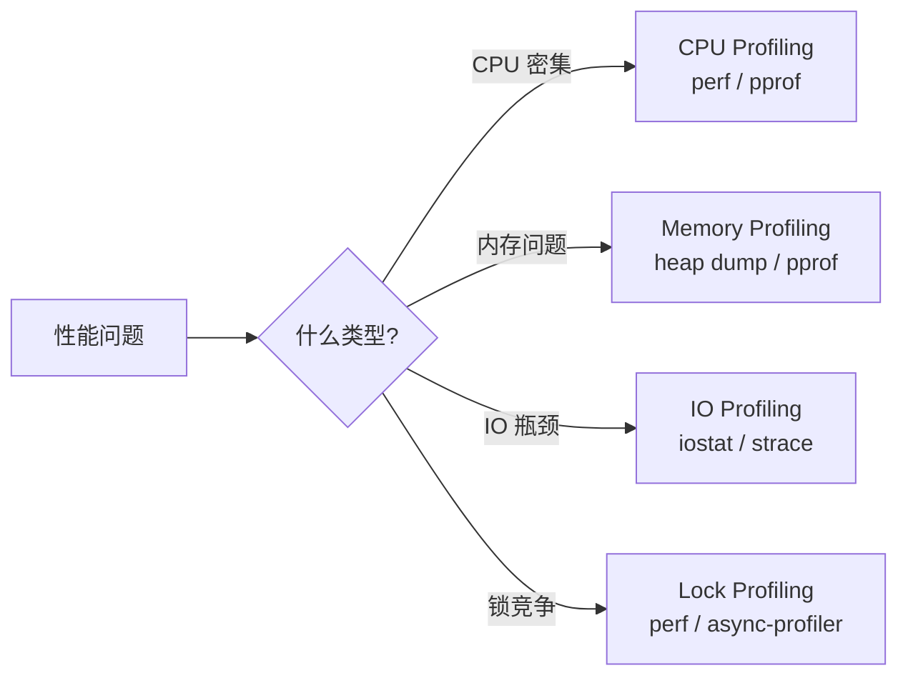

### 3.2 火焰图（Flame Graph）

火焰图是性能分析的核心可视化工具，由 Brendan Gregg 发明。

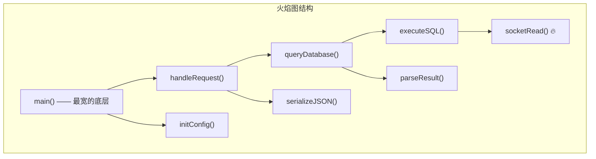

**读图规则**：
- **宽度** = 函数在采样中出现的比例（CPU 时间占比）
- **高度** = 调用栈深度
- **颜色** = 随机，仅用于视觉区分
- **平顶** = 可能的优化点（CPU 热点）

### 3.3 Linux perf 实战

```bash
# 1. 采样 CPU 性能数据（60秒）
perf record -g -p <PID> -- sleep 60

# 2. 生成火焰图
perf script | stackcollapse-perf.pl | flamegraph.pl > flamegraph.svg

# 3. 查看热点函数
perf report --sort symbol

# 4. 分析缓存未命中
perf stat -e cache-misses,cache-references -p <PID> -- sleep 10
```

### 3.4 Go pprof 实战

```go
import _ "net/http/pprof"

func main() {
    go http.ListenAndServe(":6060", nil)
    // ... 业务代码
}
```

```bash
# CPU Profile（30秒采样）
go tool pprof -http=:8080 http://localhost:6060/debug/pprof/profile?seconds=30

# 内存 Profile
go tool pprof -http=:8080 http://localhost:6060/debug/pprof/heap

# Goroutine 分析
go tool pprof -http=:8080 http://localhost:6060/debug/pprof/goroutine

# 在 pprof 交互模式中
(pprof) top 10          # CPU 占用 Top 10
(pprof) list funcName   # 查看函数级热点行
(pprof) web             # 生成调用图
```

### 3.5 Java async-profiler

```bash
# CPU 采样
./asprof -d 60 -f cpu.html <PID>

# 分配采样（内存分配热点）
./asprof -d 60 -e alloc -f alloc.html <PID>

# Wall Clock 采样（包含阻塞时间）
./asprof -d 60 -e wall -f wall.html <PID>

# 锁竞争分析
./asprof -d 60 -e lock -f lock.html <PID>
```

---

## 4. CPU 优化

### 4.1 CPU 瓶颈的典型模式

| 模式 | 症状 | 原因 |
|------|------|------|
| 计算密集 | CPU 100%，IO 低 | 算法复杂度高 |
| 上下文切换 | CPU 利用率不高但延迟高 | 线程数过多、锁竞争 |
| 缓存未命中 | CPI（Cycles Per Instruction）高 | 数据局部性差 |
| 分支预测失败 | 流水线气泡 | 条件分支不可预测 |

### 4.2 算法与数据结构优化

```python
# ❌ O(n²) 查找
def find_duplicates(items):
    result = []
    for i in range(len(items)):
        for j in range(i + 1, len(items)):
            if items[i] == items[j]:
                result.append(items[i])
    return result

# ✅ O(n) 查找
def find_duplicates(items):
    seen = set()
    result = []
    for item in items:
        if item in seen:
            result.append(item)
        seen.add(item)
    return result
```

### 4.3 并发优化

```java
// ❌ 串行处理
List<Result> results = new ArrayList<>();
for (Task task : tasks) {
    results.add(process(task));  // 每个任务 100ms，100 个任务 = 10s
}

// ✅ 并行处理
List<Result> results = tasks.parallelStream()
    .map(this::process)          // 8 核 ≈ 100/8 * 100ms ≈ 1.3s
    .collect(Collectors.toList());

// ✅ 更精细的线程池控制
ForkJoinPool pool = new ForkJoinPool(Runtime.getRuntime().availableProcessors());
List<Result> results = pool.submit(() ->
    tasks.parallelStream().map(this::process).collect(Collectors.toList())
).get();
```

### 4.4 缓存友好编程

```java
// ❌ 缓存不友好：链表，随机内存访问
LinkedList<Order> orders = ...;
for (Order order : orders) {
    total += order.getAmount(); // 每次访问可能 cache miss
}

// ✅ 缓存友好：数组，连续内存访问
ArrayList<Order> orders = ...;
for (Order order : orders) {
    total += order.getAmount(); // CPU 预取友好
}
```

---

## 5. 内存优化

### 5.1 内存问题分类

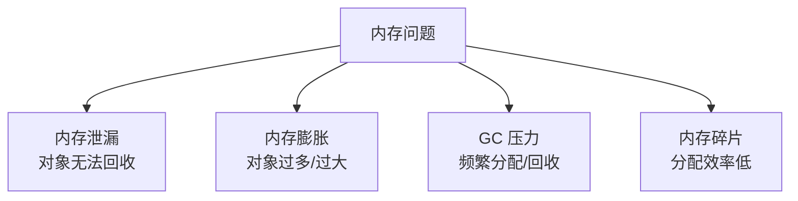

### 5.2 内存泄漏检测

```java
// ❌ 典型内存泄漏：静态集合持有对象引用
public class CacheManager {
    private static final Map<String, Object> cache = new HashMap<>();

    public static void put(String key, Object value) {
        cache.put(key, value); // 永远不会被移除
    }
}

// ✅ 使用弱引用或设置过期策略
public class CacheManager {
    private static final Cache<String, Object> cache = Caffeine.newBuilder()
        .maximumSize(10_000)
        .expireAfterWrite(Duration.ofMinutes(30))
        .build();
}
```

### 5.3 Go 内存优化

```go
// ❌ 频繁分配：每次循环创建新对象
func processItems(items []Item) []Result {
    var results []Result
    for _, item := range items {
        r := Result{Value: item.Value * 2}  // 每次分配
        results = append(results, r)
    }
    return results
}

// ✅ 预分配 + 对象池
func processItems(items []Item) []Result {
    results := make([]Result, 0, len(items)) // 预分配
    for _, item := range items {
        results = append(results, Result{Value: item.Value * 2})
    }
    return results
}

// ✅ sync.Pool 复用临时对象
var bufPool = sync.Pool{
    New: func() interface{} {
        return new(bytes.Buffer)
    },
}

func processData(data []byte) string {
    buf := bufPool.Get().(*bytes.Buffer)
    defer func() {
        buf.Reset()
        bufPool.Put(buf)
    }()
    buf.Write(data)
    return buf.String()
}
```

### 5.4 Java GC 调优要点

| 参数 | 说明 | 推荐值 |
|------|------|--------|
| `-Xms` / `-Xmx` | 堆大小，设为相同避免扩容 | 物理内存的 50%-75% |
| `-XX:+UseG1GC` | G1 收集器 | JDK9+ 默认 |
| `-XX:MaxGCPauseMillis` | 目标暂停时间 | 200ms |
| `-XX:InitiatingHeapOccupancyPercent` | GC 触发阈值 | 45（G1 默认） |

---

## 6. IO 优化

### 6.1 IO 模型对比

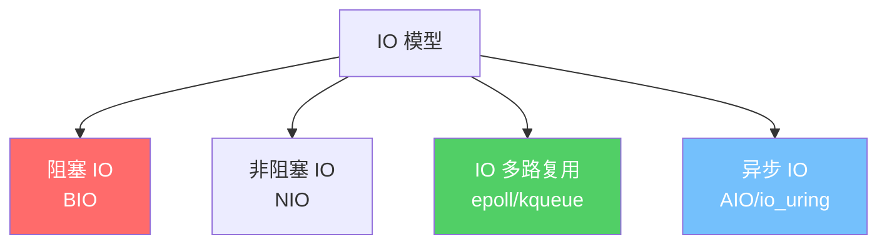

| 模型 | 原理 | 优点 | 缺点 |
|------|------|------|------|
| BIO | 线程阻塞等待 | 简单 | 线程数 = 连接数 |
| NIO | 轮询检查就绪 | 不阻塞线程 | CPU 空转 |
| epoll | 事件通知 | 高并发、低开销 | 回调复杂 |
| io_uring | 内核共享队列 | 最高性能 | Linux 5.1+ |

### 6.2 批量与异步

```python
# ❌ 逐条写入数据库
for order in orders:
    db.execute("INSERT INTO orders VALUES (%s, %s)", (order.id, order.total))

# ✅ 批量写入
values = [(o.id, o.total) for o in orders]
db.executemany("INSERT INTO orders VALUES (%s, %s)", values)

# ✅ 异步写入
async def save_orders(orders):
    async with aiohttp.ClientSession() as session:
        tasks = [session.post(url, json=order.to_dict()) for order in orders]
        await asyncio.gather(*tasks)
```

### 6.3 零拷贝技术

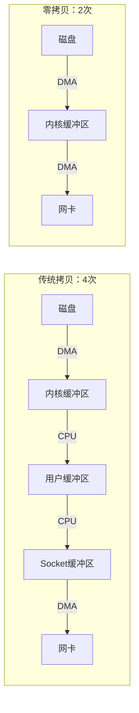

```java
// Java 零拷贝：FileChannel.transferTo
FileChannel source = new FileInputStream("data.bin").getChannel();
FileChannel dest = new FileOutputStream("output.bin").getChannel();
source.transferTo(0, source.size(), dest); // 零拷贝传输
```

---

## 7. 数据库优化

### 7.1 数据库优化层次

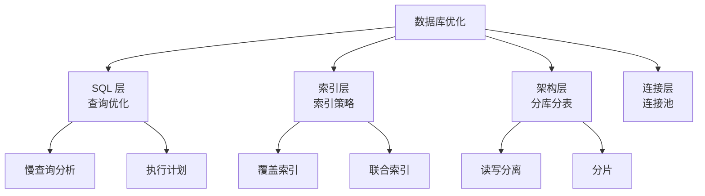

### 7.2 索引优化

```sql
-- ❌ 全表扫描
EXPLAIN SELECT * FROM orders WHERE customer_name = 'Alice';
-- type: ALL, rows: 1000000

-- ✅ 添加索引
CREATE INDEX idx_customer_name ON orders(customer_name);
-- type: ref, rows: 50

-- ✅ 覆盖索引：避免回表
CREATE INDEX idx_customer_status_total ON orders(customer_name, status, total);
SELECT status, total FROM orders WHERE customer_name = 'Alice';
-- Extra: Using index（索引覆盖，无需回表）
```

**联合索引的最左前缀原则**：

| 查询条件 | 能否命中 `idx(a, b, c)` |
|----------|------------------------|
| `WHERE a = 1` | ✅ |
| `WHERE a = 1 AND b = 2` | ✅ |
| `WHERE a = 1 AND b = 2 AND c = 3` | ✅ |
| `WHERE b = 2` | ❌ |
| `WHERE a = 1 AND c = 3` | ⚠️ 只命中 a |
| `WHERE a > 1 AND b = 2` | ⚠️ 只命中 a（范围查询后的列失效） |

### 7.3 查询优化实战

```sql
-- ❌ 子查询效率低
SELECT * FROM orders
WHERE user_id IN (SELECT id FROM users WHERE status = 'active');

-- ✅ 改为 JOIN
SELECT o.* FROM orders o
INNER JOIN users u ON o.user_id = u.id
WHERE u.status = 'active';

-- ❌ SELECT * 浪费 IO
SELECT * FROM orders WHERE id = 1;

-- ✅ 只查需要的列
SELECT id, status, total FROM orders WHERE id = 1;

-- ❌ 大偏移分页
SELECT * FROM orders ORDER BY id LIMIT 100000, 20;

-- ✅ 游标分页
SELECT * FROM orders WHERE id > 100000 ORDER BY id LIMIT 20;
```

---

## 8. 缓存策略

### 8.1 缓存架构

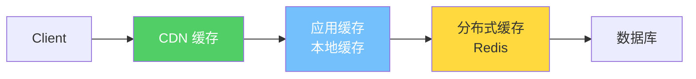

### 8.2 缓存模式

| 模式 | 读流程 | 写流程 | 适用场景 |
|------|--------|--------|----------|
| **Cache Aside** | 先读缓存，miss 则读 DB 并回填 | 先写 DB，再删缓存 | 通用模式 |
| **Read Through** | 缓存层自动从 DB 加载 | 同 Cache Aside | 读多写少 |
| **Write Through** | 同 Read Through | 先写缓存，缓存同步写 DB | 数据一致性要求高 |
| **Write Behind** | 同 Read Through | 先写缓存，异步批量写 DB | 写密集、容忍丢失 |

### 8.3 缓存常见问题

```python
import redis
import hashlib

r = redis.Redis()

# 缓存穿透：查询不存在的数据
def get_user(user_id):
    cache_key = f"user:{user_id}"
    data = r.get(cache_key)
    if data is not None:
        if data == b"NULL":  # 空值缓存，防止穿透
            return None
        return deserialize(data)

    user = db.get_user(user_id)
    if user is None:
        r.setex(cache_key, 60, "NULL")  # 空值缓存 60 秒
        return None

    r.setex(cache_key, 3600, serialize(user))
    return user

# 缓存击穿：热点 key 过期
def get_hot_data(key):
    # 使用分布式锁，只允许一个请求重建缓存
    lock_key = f"lock:{key}"
    data = r.get(key)
    if data is not None:
        return deserialize(data)

    if r.set(lock_key, "1", nx=True, ex=10):  # 获取锁
        try:
            data = db.get_data(key)
            r.setex(key, 3600, serialize(data))
            return data
        finally:
            r.delete(lock_key)
    else:
        time.sleep(0.1)
        return get_hot_data(key)  # 重试

# 缓存雪崩：大量 key 同时过期
def set_with_jitter(key, value, base_ttl=3600):
    jitter = random.randint(-300, 300)  # ±5 分钟随机偏移
    r.setex(key, base_ttl + jitter, value)
```

### 8.4 缓存指标

$$
\text{缓存命中率} = \frac{\text{缓存命中次数}}{\text{总请求次数}} \times 100\%
$$

| 场景 | 目标命中率 |
|------|-----------|
| 热点数据 | > 95% |
| 用户维度数据 | > 80% |
| 搜索结果 | > 50% |

---

## 9. 性能测试与基准

### 9.1 性能测试类型

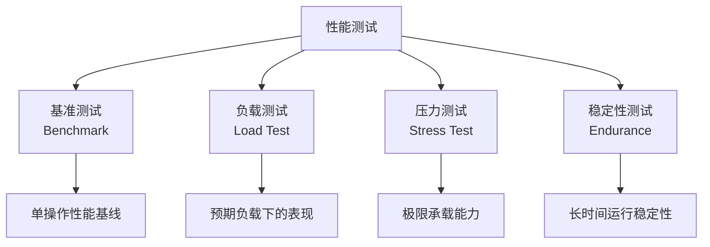

### 9.2 基准测试实践

```go
// Go benchmark
func BenchmarkProcessOrder(b *testing.B) {
    order := createTestOrder()
    b.ResetTimer() // 重置计时器，排除准备时间
    for i := 0; i < b.N; i++ {
        ProcessOrder(order)
    }
}

// 运行：go test -bench=BenchmarkProcessOrder -benchmem
// 输出：
// BenchmarkProcessOrder-8   50000   32456 ns/op   4096 B/op   52 allocs/op
```

```java
// JMH (Java Microbenchmark Harness)
@BenchmarkMode(Mode.AverageTime)
@OutputTimeUnit(TimeUnit.MICROSECONDS)
@State(Scope.Thread)
public class SortBenchmark {

    private int[] data;

    @Setup
    public void setup() {
        data = new Random().ints(10000).toArray();
    }

    @Benchmark
    public void quickSort() {
        Arrays.sort(data.clone());
    }

    @Benchmark
    public void parallelSort() {
        Arrays.parallelSort(data.clone());
    }
}
```

### 9.3 负载测试工具

| 工具 | 语言 | 特点 | 适用场景 |
|------|------|------|----------|
| wrk | C | 高性能、Lua 脚本 | HTTP 压测 |
| k6 | Go | JS 脚本、CI 友好 | 持续性能测试 |
| Locust | Python | 分布式、Web UI | 复杂场景 |
| JMeter | Java | 协议全面、插件多 | 全功能测试 |
| Ghz | Go | gRPC 专用 | gRPC 压测 |

```bash
# wrk 压测示例
wrk -t12 -c400 -d30s --latency http://api.example.com/users

# 输出：
#   Latency    P50    P75    P90    P99
#   12.3ms    8.2ms  15.1ms  28.7ms  89.3ms
#   Requests/sec: 32456.7
#   Transfer/sec: 12.4MB
```

### 9.4 性能回归检测

```yaml
# CI 中的性能回归检测
performance_test:
  stage: test
  script:
    - k6 run --out json=results.json load-test.js
    - |
      baseline_p99=$(cat baseline.json | jq '.metrics.http_req_duration.values["p(99)"]')
      current_p99=$(cat results.json | jq '.metrics.http_req_duration.values["p(99)"]')
      if (( current_p99 > baseline_p99 * 1.2 )); then
        echo "❌ P99 回归超过 20%: ${baseline_p99}ms → ${current_p99}ms"
        exit 1
      fi
```

---

## 10. 性能优化全景图

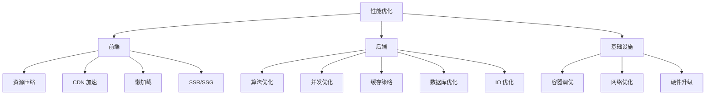

---

## 11. 面试 Q&A

**Q1：如何定位一个线上性能问题？**

> 1. 确认现象：延迟升高？吞吐下降？错误率上升？2. 确定范围：全局还是局部？新上线还是渐进恶化？3. 查看监控：CPU/内存/IO/网络/GC 指标；4. Profiling：CPU 火焰图定位热点、内存分析定位泄漏；5. 日志分析：慢查询日志、错误日志、访问日志；6. 排查变更：最近是否有代码发布、配置变更、流量增长。

**Q2：P99 延迟为什么比平均值更重要？**

> 平均值受极端值影响但掩盖了分布信息。1000 个请求中 990 个 10ms + 10 个 5s，平均值 59ms 看似可接受，但 1% 的用户经历了 5s 延迟。P99 直接反映最差情况下的用户体验，是 SLA 的核心指标。金融、电商等场景中，P99 的 1% 用户可能对应巨大的业务损失。

**Q3：缓存穿透、击穿、雪崩分别是什么？如何解决？**

> **穿透**：查询不存在的数据，缓存永远 miss。解决：布隆过滤器、空值缓存。**击穿**：热点 key 过期瞬间大量请求打到 DB。解决：互斥锁重建缓存、热点 key 永不过期。**雪崩**：大量 key 同时过期或缓存宕机。解决：过期时间加随机偏移、缓存高可用集群、熔断降级。

**Q4：什么是零拷贝？它解决了什么问题？**

> 传统文件传输需要 4 次数据拷贝和 4 次上下文切换（磁盘→内核→用户→Socket→网卡）。零拷贝通过 `sendfile()` / `transferTo()` 让数据在内核空间直接从文件描述符传输到 Socket，减少到 2 次拷贝和 2 次上下文切换。Kafka 的高吞吐就依赖零拷贝技术。

**Q5：如何判断一个性能优化是否值得做？**

> 1. 量化收益：用 Amdahl 定律评估理论提升上限；2. 测量实际效果：A/B 测试或基准测试对比；3. 评估成本：开发时间、代码复杂度增加、可维护性下降；4. 考虑风险：优化可能引入 Bug、影响可读性；5. ROI 决策：如果 2 天优化带来 30% 性能提升且风险可控，值得做；如果 2 周优化带来 3% 提升且代码变复杂，不值得。
