> **TL;DR**：消息队列是分布式系统的"神经系统"。本文从消息队列的三大核心作用（解耦、异步、削峰）出发，深入讲解 Kafka 的架构设计和高吞吐原理、RabbitMQ 的 Exchange 路由模型，对比两者差异，系统梳理消息可靠性保证、幂等性设计、顺序性保障、积压处理等工程实践，最后讨论延迟队列和死信队列的应用场景。

---

## 一、消息队列的核心作用

### 1.1 三大核心功能

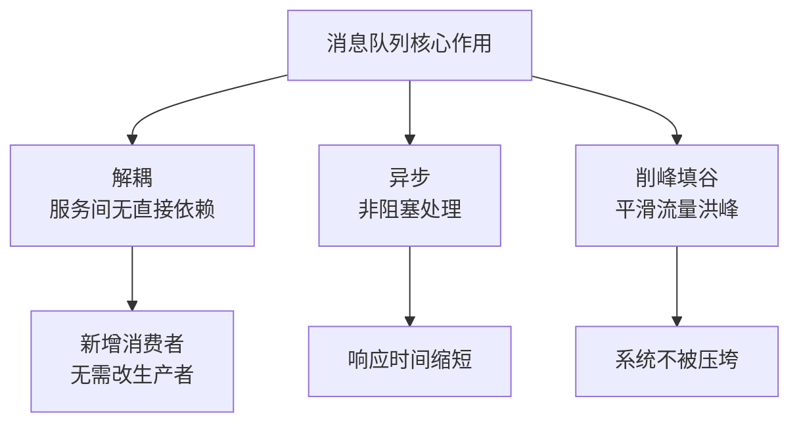

#### 解耦

```mermaid
graph LR
    subgraph 无 MQ——紧耦合
        A[订单服务] --> B[库存服务]
        A --> C[支付服务]
        A --> D[通知服务]
        A --> E[积分服务]
    end
    subgraph 有 MQ——松耦合
        A2[订单服务] --> MQ[消息队列]
        MQ --> B2[库存服务]
        MQ --> C2[支付服务]
        MQ --> D2[通知服务]
        MQ --> E2[积分服务]
    end
```

无 MQ 时，新增一个"数据分析服务"需要修改订单服务代码。有 MQ 后，新服务只需订阅消息。

#### 异步

| 模式 | 总响应时间 |
|------|-----------|
| 同步调用 | 50ms + 30ms + 20ms = **100ms** |
| 异步消息 | 50ms + MQ 异步 = **50ms** |

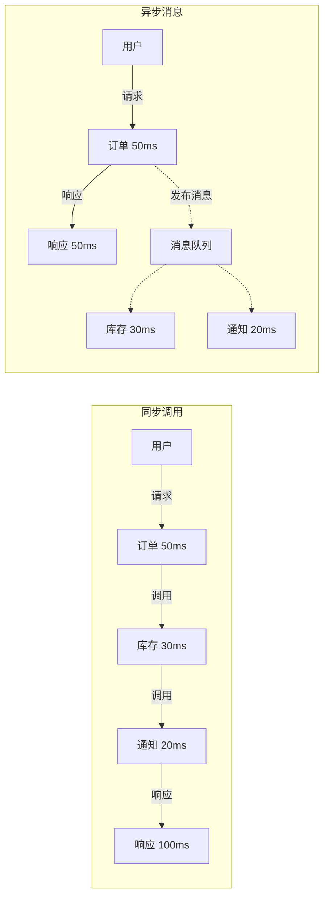

#### 削峰

```
流量图：
                ▲
     10000 QPS  |    /\
                |   /  \
      1000 QPS  |  /    \________ 服务处理能力
                | /
                |/
                +--------------------▶ 时间
                |<-- 洪峰 -->|

有 MQ 后：
                ▲
     10000 QPS  |    /\
                |   /  \
                |  /    \
                | / 流入 MQ
                |/
      1000 QPS  +--------- 服务匀速消费
                +--------------------▶ 时间
```

### 1.2 消息模型

| 模型 | 描述 | 消费特点 | 典型场景 |
|------|------|---------|---------|
| **点对点（PTP）** | 一条消息只能被一个消费者消费 | 消费后即删除 | 任务分发、工单处理 |
| **发布/订阅（Pub/Sub）** | 一条消息可被多个消费者消费 | 可被多次消费 | 事件通知、数据同步 |

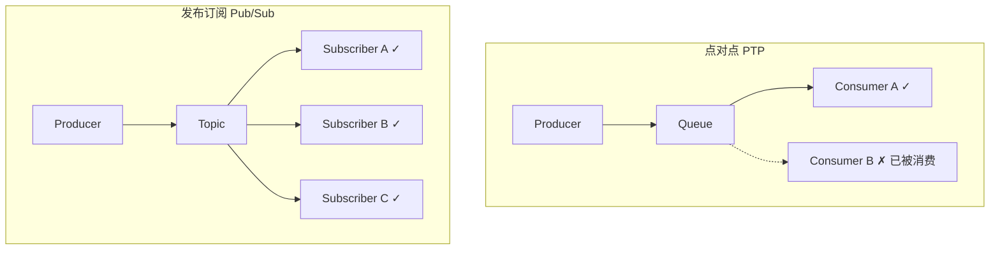

---

## 二、Kafka 架构与原理

### 2.1 整体架构

```mermaid
graph TD
    P[Producer] --> TOPIC[Topic: orders]
    subgraph Kafka 集群（3 Broker）
        TOPIC --> P0[Partition 0<br/>Leader: B1<br/>Replica: B2]
        TOPIC --> P1[Partition 1<br/>Leader: B2<br/>Replica: B3]
        TOPIC --> P2[Partition 2<br/>Leader: B3<br/>Replica: B1]
    end
    P0 --> CG0[Consumer Group A<br/>Consumer 0]
    P1 --> CG0
    P2 --> CG0
    P0 --> CG1[Consumer Group B<br/>Consumer 0]
    P1 --> CG1
    P2 --> CG1
```

### 2.2 核心概念

| 概念 | 描述 |
|------|------|
| **Broker** | Kafka 服务节点，一个集群有多个 Broker |
| **Topic** | 消息的逻辑分类（如 orders、payments） |
| **Partition** | Topic 的物理分片，**有序、不可变**的追加日志 |
| **Offset** | 消息在 Partition 中的位置（单调递增） |
| **Producer** | 消息生产者，将消息发送到 Topic |
| **Consumer** | 消息消费者，从 Partition 拉取消息 |
| **Consumer Group** | 消费者组，组内消费者分摊 Partition |
| **ISR** | In-Sync Replicas，与 Leader 保持同步的副本集合 |

### 2.3 分区与消费者分配

**核心规则**：一个 Partition 在同一时刻只能被同一个 Consumer Group 中的一个 Consumer 消费。

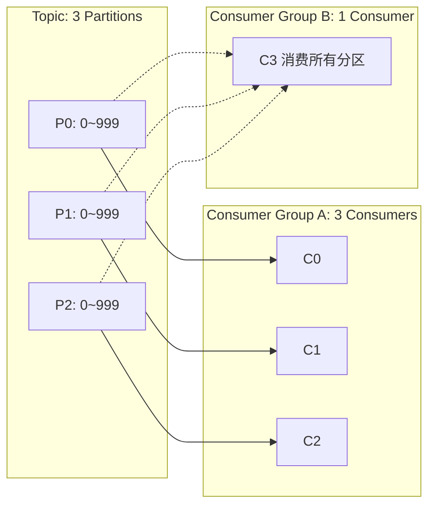

**关键推论**：
- 消费者数 > 分区数 → 多余的消费者空闲（浪费）
- 分区数决定了最大并行消费数
- 增加分区数可以提升消费吞吐上限

### 2.4 消息存储

Kafka 使用**追加日志（Append-Only Log）**：

```
Partition 0（磁盘文件）：
┌───────────────────────────────────────────────────┐
│ Offset:  0      1      2      3      4      5     │
│ Data:   msg_0  msg_1  msg_2  msg_3  msg_4  msg_5  │
│                                ↑                   │
│                           Consumer Offset=3        │
└───────────────────────────────────────────────────┘
```

### 2.5 Kafka 高吞吐设计的秘密

| 技术 | 原理 | 效果 |
|------|------|------|
| **顺序写磁盘** | 消息追加到日志末尾 | 顺序写 ≈ 内存随机写速度（~600MB/s） |
| **零拷贝（sendfile）** | 数据从页缓存直接到网卡 | 避免用户态↔内核态拷贝 |
| **页缓存** | 用 OS 页缓存而非 JVM 堆 | 避免 GC 问题，利用 OS 预读 |
| **批量发送** | Producer 积攒多条消息一起发 | 减少网络往返 |
| **批量拉取** | Consumer 一次拉取多条消息 | 减少网络往返 |
| **分区并行** | 多个 Partition 并行读写 | 水平扩展 |
| **压缩** | Producer 端压缩（GZIP/LZ4/Snappy） | 减少网络/磁盘 I/O |

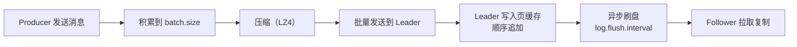

---

## 三、RabbitMQ 架构与原理

### 3.1 核心架构

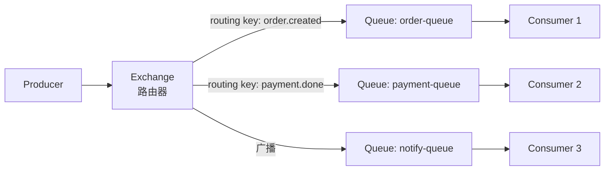

### 3.2 Exchange 类型

| 类型 | 路由规则 | 示例 | 场景 |
|------|---------|------|------|
| **Direct** | 精确匹配 routing key | `order.created` → 绑定了此 key 的队列 | 点对点、明确路由 |
| **Topic** | 通配符匹配 `*` 和 `#` | `order.*` 匹配 `order.created`、`order.cancelled` | 订阅过滤 |
| **Fanout** | 广播到所有绑定队列 | 忽略 routing key，全发 | 广播通知 |
| **Headers** | 匹配消息头属性 | `x-match: all` + headers | 复杂路由条件 |

```java
// RabbitMQ Exchange 示例
// Topic Exchange 路由规则
// "order.created"   → 匹配 "order.*"、"order.#"、"*.created"
// "order.cancelled" → 匹配 "order.*"、"order.#"、"*.cancelled"
// "payment.done"    → 匹配 "payment.#"、"#.done"
// * 匹配一个单词，# 匹配零个或多个单词
```

### 3.3 消息确认

```java
// 生产者确认
channel.confirmSelect(); // 开启 Confirm 模式
channel.basicPublish("exchange", "routing-key", 
    MessageProperties.PERSISTENT_TEXT_PLAIN, message.getBytes());
channel.waitForConfirmsOrDie(5000); // 等待确认

// 消费者手动确认
boolean autoAck = false;
channel.basicConsume("queue", autoAck, (tag, delivery) -> {
    try {
        processMessage(delivery.getBody());
        channel.basicAck(delivery.getEnvelope().getDeliveryTag(), false);
    } catch (Exception e) {
        // requeue=true 重回队列
        channel.basicNack(delivery.getEnvelope().getDeliveryTag(), false, true);
    }
});
```

---

## 四、Kafka vs RabbitMQ 对比

| 维度 | Kafka | RabbitMQ |
|------|-------|----------|
| **定位** | 分布式流处理平台 | 消息代理（Message Broker） |
| **消息模型** | Topic/Partition（发布订阅） | Exchange/Queue（多种路由） |
| **消息存储** | 持久化日志（可回溯） | 消费后删除 |
| **吞吐量** | 极高（百万级 TPS） | 较高（万级 TPS） |
| **延迟** | 毫秒级 | 微秒级 |
| **消息有序** | Partition 内有序 | Queue 内有序 |
| **消费模式** | 拉取（Pull） | 推送（Push） |
| **消费者组** | 原生支持 | 需自行实现 |
| **消息回溯** | 支持（通过 Offset） | 不支持（消费即删除） |
| **事务支持** | 跨 Partition 事务 | 有限 |
| **消息过滤** | 无（需 Consumer 端过滤） | Exchange 路由天然过滤 |
| **适合场景** | 日志、流处理、大数据 | 业务消息、任务队列、RPC |

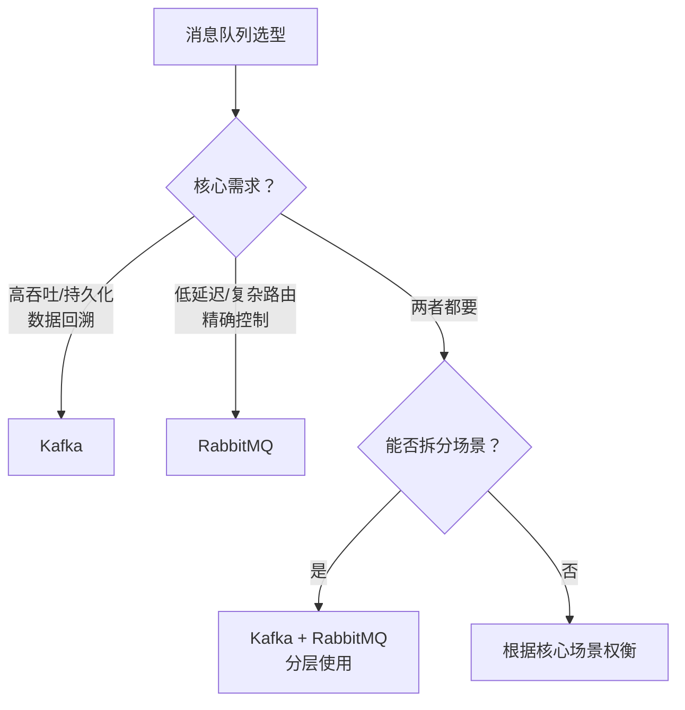

---

## 五、消息可靠性保证

### 5.1 消息可能丢失的三个环节

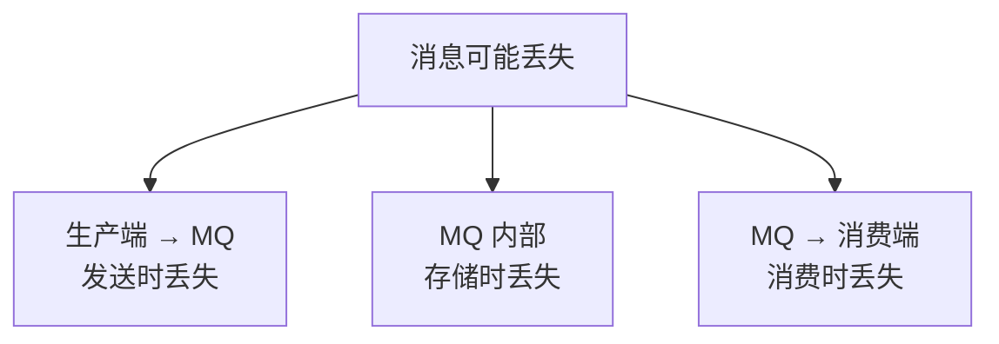

### 5.2 各阶段可靠性方案

#### 生产端

| 策略 | Kafka | RabbitMQ |
|------|-------|----------|
| 确认机制 | `acks=all` | Publisher Confirm |
| 重试 | `retries` + 幂等 | 手动重试 |
| 本地消息表 | 可选 | 可选 |

#### MQ 端

| 策略 | Kafka | RabbitMQ |
|------|-------|----------|
| 持久化 | 日志落盘（默认） | `durable=true` + `delivery_mode=2` |
| 副本 | ISR 副本（`replication.factor`） | 镜像队列（Mirror Queue） |
| 最小副本 | `min.insync.replicas` | `ha-mode` |

#### 消费端

| 策略 | Kafka | RabbitMQ |
|------|-------|----------|
| 手动确认 | `enable.auto.commit=false` | `autoAck=false` |
| 幂等消费 | 业务去重 | 业务去重 |
| 死信处理 | DLT | DLX（Dead Letter Exchange） |

### 5.3 幂等性保证

```java
// 方案一：唯一消息 ID + Redis 去重
@KafkaListener(topics = "orders")
public void consume(ConsumerRecord<String, String> record) {
    String messageId = record.key() + ":" + record.partition() + ":" + record.offset();
    
    // SETNX 保证只有一个线程处理
    Boolean acquired = redisTemplate.opsForValue()
        .setIfAbsent("msg:processed:" + messageId, "1", 24, TimeUnit.HOURS);
    
    if (Boolean.FALSE.equals(acquired)) {
        log.info("消息已处理，跳过: {}", messageId);
        return;
    }
    
    // 处理业务
    processOrder(record.value());
}

// 方案二：数据库唯一约束
@KafkaListener(topics = "payments")
public void consume(PaymentEvent event) {
    // 利用数据库唯一索引去重
    try {
        paymentMapper.insertIgnore(event); // INSERT IGNORE 或 ON DUPLICATE KEY
    } catch (DuplicateKeyException e) {
        log.info("重复消息，跳过: {}", event.getId());
    }
}

// 方案三：业务状态机
public void processOrder(OrderEvent event) {
    int rows = orderMapper.updateStatus(
        event.getOrderId(), 
        "PAID", 
        "PENDING"  // WHERE status = 'PENDING'
    );
    if (rows == 0) {
        log.info("订单已处理或非待支付状态，跳过");
    }
}
```

---

## 六、消息顺序性

### 6.1 顺序性级别

| 级别 | 保证 | 代价 | 实现方式 |
|------|------|------|---------|
| **全局有序** | 所有消息严格按序 | 单 Partition，吞吐极低 | 不推荐 |
| **分区有序** | 同一 Key 的消息有序 | 合理设计 Partition Key | **推荐** |
| **无序** | 不保证顺序 | 最高吞吐 | 大多数场景 |

### 6.2 分区有序的实现

```java
// 保证同一订单的消息有序：使用订单 ID 作为 Partition Key
ProducerRecord<String, String> record = new ProducerRecord<>(
    "orders",
    orderId,      // Key → 决定路由到哪个 Partition
    eventJson     // Value
);
// 相同 orderId → 相同 hash → 相同 Partition → 有序
```

### 6.3 顺序消费的陷阱

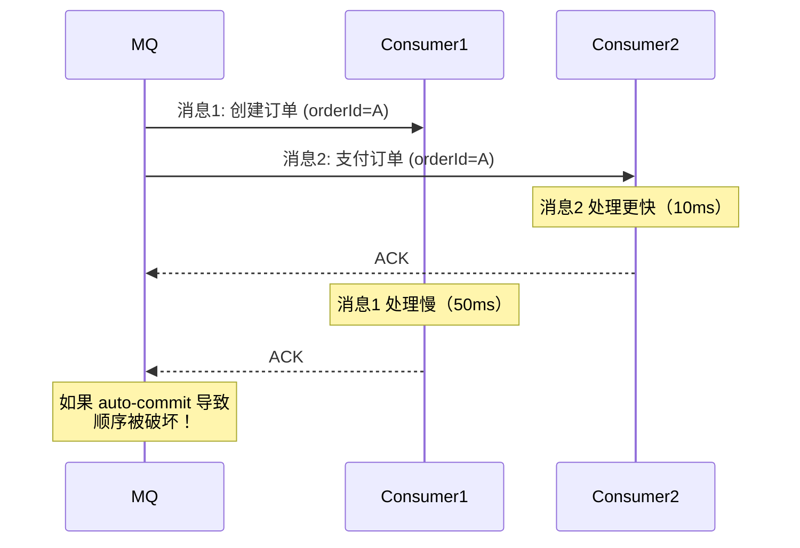

**关键**：Kafka 保证的是 Partition 内的**写入顺序**，但如果消费者多线程并发处理，消费顺序可能被破坏。

**解决方案**：同一 Key 的消息由同一个消费者线程串行处理。

```java
// 按 Key 分组，组内串行处理
@KafkaListener(topics = "orders")
public void consume(List<ConsumerRecord<String, String>> records) {
    Map<String, List<ConsumerRecord<String, String>>> grouped = 
        records.stream().collect(Collectors.groupingBy(ConsumerRecord::key));
    
    grouped.forEach((key, msgs) -> {
        // 同一 Key 的消息串行处理
        msgs.forEach(msg -> processMessage(msg));
    });
}
```

---

## 七、消息积压处理

### 7.1 积压原因

| 原因 | 描述 | 排查方法 |
|------|------|---------|
| 消费 < 生产 | 消费者处理太慢 | 监控生产/消费速率 |
| 消费者故障 | 服务宕机 | 检查消费者状态 |
| 消费逻辑阻塞 | 下游服务慢 | 检查依赖服务 |
| 分区不均 | 某些 Partition 数据量大 | 检查 Key 分布 |

### 7.2 应急处理方案

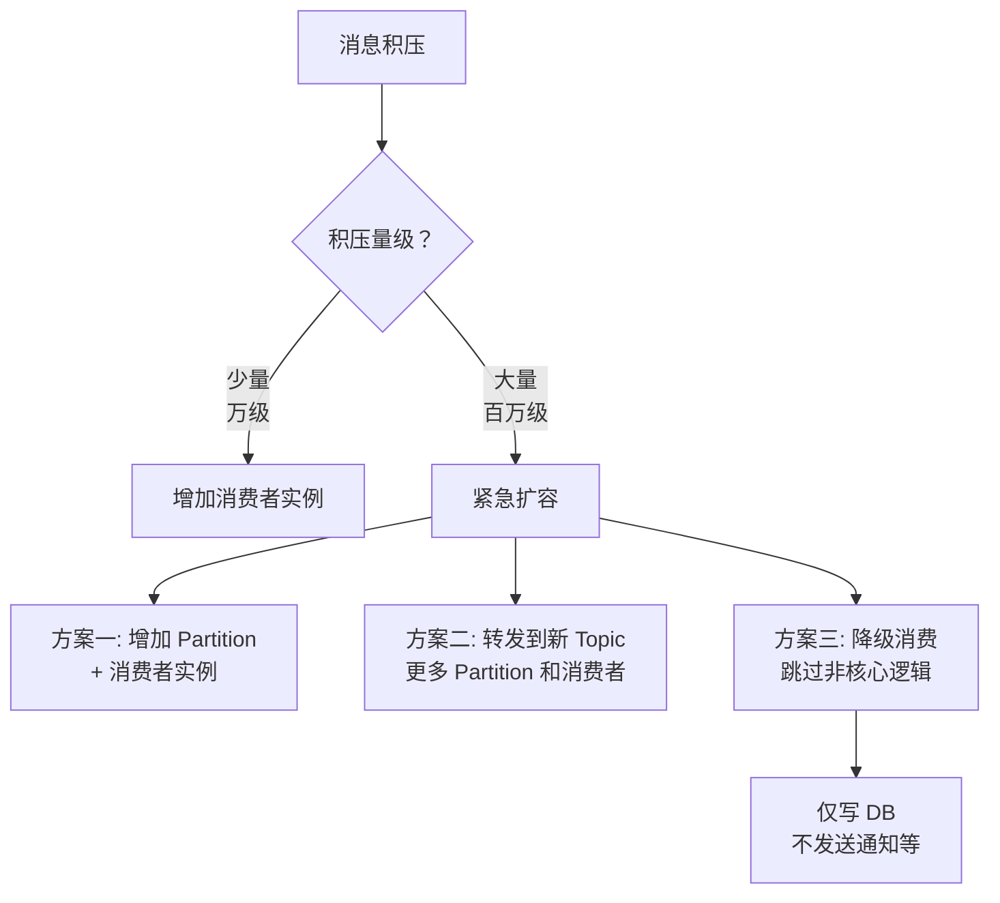

```java
// 方案二：转发到临时 Topic
@KafkaListener(topics = "orders", concurrency = "1")
public void emergencyForward(ConsumerRecord<String, String> record) {
    // 快速转发到有更多 Partition 的临时 Topic
    emergencyProducer.send(
        new ProducerRecord<>("orders-emergency", record.key(), record.value())
    );
}

// 临时 Topic 的消费者（更多并发）
@KafkaListener(topics = "orders-emergency", concurrency = "10")
public void fastConsume(ConsumerRecord<String, String> record) {
    // 简化逻辑：只写核心数据
    saveCoreData(record.value());
}
```

---

## 八、延迟队列与死信队列

### 8.1 延迟队列

延迟队列让消息在指定时间后才被消费，常用于：

| 场景 | 说明 |
|------|------|
| 订单超时取消 | 下单 30 分钟后未支付自动取消 |
| 重试延迟 | 失败后间隔 1min/5min/10min 重试 |
| 定时通知 | 会议开始前 15 分钟提醒 |

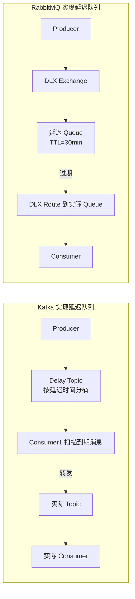

### 8.2 死信队列（DLQ）

死信队列存放**无法正常消费**的消息：

| 进入 DLQ 的条件 | 说明 |
|----------------|------|
| 消息被拒绝且 `requeue=false` | 消费者明确拒绝且不重回队列 |
| 消息 TTL 过期 | 消息在队列中超过存活时间 |
| 队列达到最大长度 | 队列满了，旧消息进入 DLQ |

```java
// RabbitMQ 死信队列配置
Map<String, Object> args = new HashMap<>();
args.put("x-dead-letter-exchange", "dlx.exchange");
args.put("x-dead-letter-routing-key", "dlx.routing-key");
channel.queueDeclare("normal-queue", true, false, false, args);

// Kafka 死信队列
// Spring Kafka 支持配置 DeadLetterPublishingRecoverer
@KafkaListener(topics = "orders")
public void consume(ConsumerRecord<String, String> record) {
    try {
        processOrder(record.value());
    } catch (Exception e) {
        // 重试 N 次后进入 DLQ
        throw new ImmediateRetryException("处理失败", e);
    }
}
```

**DLQ 处理策略**：

| 策略 | 说明 |
|------|------|
| 人工排查 | 分析 DLQ 消息，修复后重新发送 |
| 自动重试 | 定时任务将 DLQ 消息重新发到原队列 |
| 告警通知 | DLQ 有消息时发送告警 |
| 归档分析 | 定期归档 DLQ 消息，分析失败模式 |

---

## 九、面试 Q&A

### Q1：Kafka 为什么这么快？

**答**：
1. **顺序写磁盘**：消息追加到日志末尾，磁盘顺序写速度约 600MB/s，接近内存随机写
2. **零拷贝（sendfile）**：数据从页缓存直接到网卡，避免用户态↔内核态数据拷贝
3. **页缓存**：利用 OS 页缓存而非 JVM 堆，避免 GC 开销，利用 OS 预读机制
4. **批量操作**：Producer 批量发送、Consumer 批量拉取，减少网络往返
5. **分区并行**：多个 Partition 并行读写，水平扩展吞吐
6. **压缩**：LZ4/Snappy 压缩减少网络/磁盘 I/O

### Q2：Kafka 如何实现 Exactly-Once 语义？

**答**：三个层面配合：
1. **幂等 Producer**（`enable.idempotence=true`）：为 Producer 分配 PID，每条消息带 Sequence Number，Broker 去重
2. **事务**（`transactional.id`）：跨 Partition 的原子写入
3. **消费-处理-生产一体化事务**：消费 Offset 和生产消息在同一事务中提交，`isolation.level=read_committed`

### Q3：Kafka 的 ISR 是什么？

**答**：ISR（In-Sync Replicas）是与 Leader 保持同步的副本集合。ISR 中的副本满足两个条件：
1. 与 Leader 的心跳在 `replica.lag.time.max.ms` 内
2. 已复制了 Leader 的所有消息

ISR 的设计平衡了**可靠性**和**可用性**：`min.insync.replicas` 控制最小同步副本数。设为 2 时，至少需要 Leader + 1 个 Follower 确认写入，即使一台机器宕机也不会丢数据。

### Q4：RabbitMQ 的 ACK 和 Kafka 的 Offset 提交有什么区别？

**答**：
- **RabbitMQ ACK**：逐条确认。消费者处理完一条后发送 ACK，Broker 才删除消息。精确但性能较低。
- **Kafka Offset 提交**：批量确认。提交 Offset 表示此位置之前的消息都已处理。性能高但重启后可能重复消费（最后一次提交之后的消息）。

### Q5：如何处理消息消费失败？

**答**：
1. **重试**：有限次数重试（3~5 次），递增间隔（1min → 5min → 10min）
2. **死信队列**：重试耗尽后转入 DLQ，人工处理
3. **降级消费**：跳过非核心逻辑，保证主流程
4. **告警**：消费失败时告警，及时介入
5. **对账补偿**：定时对账任务发现不一致时自动修复

### Q6：消息队列会不会成为系统的单点故障？

**答**：有可能，需要多维度防范：
1. **集群部署**：Kafka 多 Broker + 副本，RabbitMQ 镜像队列/Quorum Queue
2. **生产者降级**：MQ 不可用时写入本地消息表，恢复后补发
3. **消费者降级**：MQ 不可用时切换到同步调用或本地缓存
4. **监控告警**：监控队列积压、Broker 状态、消费延迟，及时告警
5. **多活架构**：跨机房部署 MQ 集群，异地容灾

---

## 总结

消息队列是分布式系统的核心基础设施，但引入 MQ 也带来了复杂性——消息丢失、重复消费、顺序性、积压等问题都需要精心设计。理解 Kafka 和 RabbitMQ 的设计哲学差异至关重要：**Kafka 追求高吞吐和持久化，适合日志和流处理；RabbitMQ 追求低延迟和灵活路由，适合业务消息和任务队列**。工程实践中，可靠性是第一位的，幂等性是必须的，顺序性是按需的。记住：**消息队列不是万能的，引入 MQ 的代价是系统复杂度的增加**——在需要的时候才引入它。
