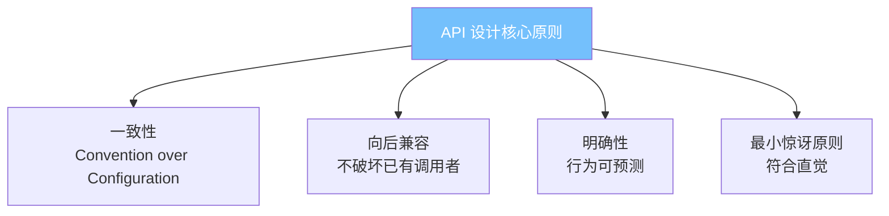
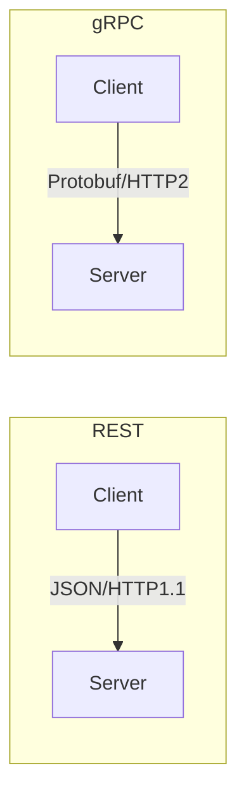
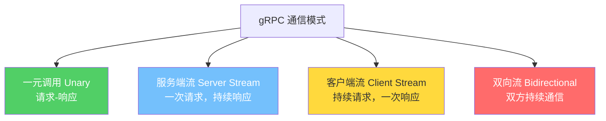
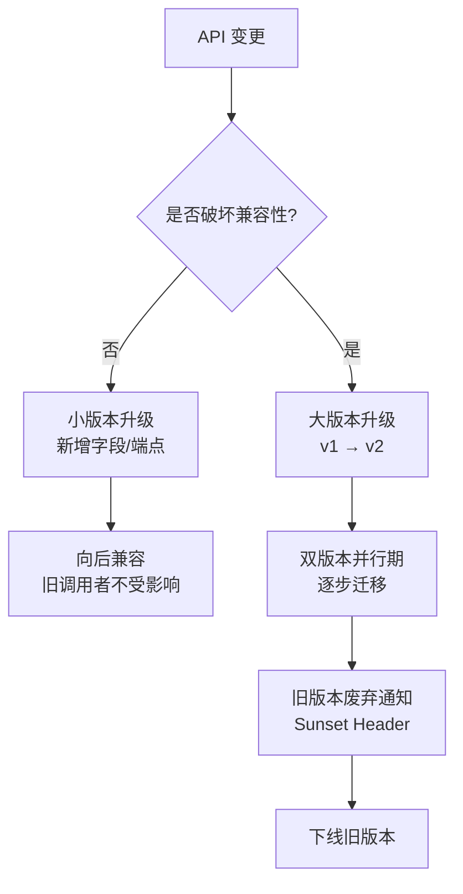
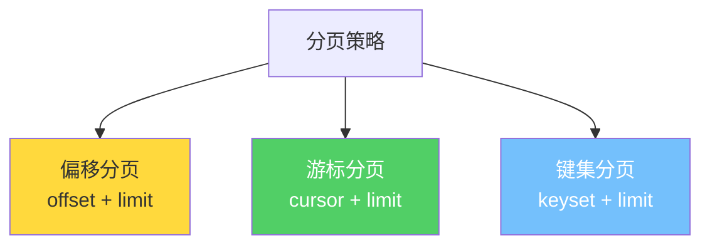
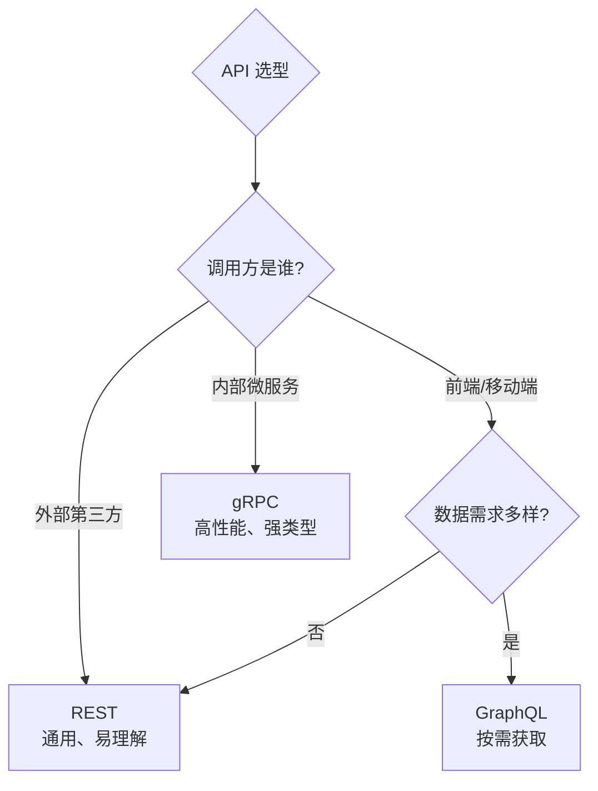

## 1. API 设计原则

API（Application Programming Interface）是系统间的契约。好的 API 设计让集成愉悦，坏的 API 设计让调用者痛苦。

### 1.1 核心原则



### 1.2 原则详解

| 原则 | 说明 | 反例 |
|------|------|------|
| **一致性** | 命名风格、错误格式、分页方式统一 | 有的接口用 `snake_case`，有的用 `camelCase` |
| **向后兼容** | 新版本不破坏旧版本调用者 | 删除字段、修改语义 |
| **明确性** | 输入输出、副作用、错误码清晰 | 返回 200 但 body 是错误信息 |
| **最小惊讶** | 行为符合直觉和惯例 | `DELETE /users/1` 返回的是用户列表 |

### 1.3 API 设计的经济学

$$
\text{API 总成本} = \text{设计成本} + \text{实现成本} + \sum_{i=1}^{N} \text{集成成本}_i
$$

其中 $N$ 是调用者数量。API 是一对多的关系——设计时多花一分，所有调用者少花一分。

---

## 2. RESTful 最佳实践

### 2.1 REST 成熟度模型


### 2.2 资源命名规范

```text
✅ 推荐                              ❌ 避免
GET    /api/v1/users                 GET    /api/v1/getUsers
GET    /api/v1/users/123             GET    /api/v1/getUserById/123
POST   /api/v1/users                 POST   /api/v1/createUser
PUT    /api/v1/users/123             PUT    /api/v1/updateUser
DELETE /api/v1/users/123             DELETE /api/v1/deleteUser/123
GET    /api/v1/users/123/orders      GET    /api/v1/getOrdersByUser/123
```

**核心规则**：
- 名词复数表示集合：`/users` 而非 `/user`
- 嵌套资源表达从属关系：`/users/123/orders`
- 最多两层嵌套，超过则用查询参数：`/orders?user_id=123`
- 动词由 HTTP Method 承担，URL 只用名词

### 2.3 HTTP 方法语义

| 方法 | 语义 | 幂等性 | 安全性 | 典型用途 |
|------|------|--------|--------|----------|
| GET | 获取资源 | ✅ | ✅ | 查询 |
| POST | 创建资源/触发动作 | ❌ | ❌ | 新增、复杂操作 |
| PUT | 全量替换 | ✅ | ❌ | 整体更新 |
| PATCH | 部分更新 | ❌ | ❌ | 局部修改 |
| DELETE | 删除资源 | ✅ | ❌ | 删除 |

### 2.4 状态码使用规范

```java
// ✅ 精确的状态码
@GetMapping("/users/{id}")
public ResponseEntity<User> getUser(@PathVariable Long id) {
    return userRepository.findById(id)
        .map(user -> ResponseEntity.ok(user))           // 200 OK
        .orElse(ResponseEntity.notFound().build());      // 404 Not Found
}

@PostMapping("/users")
public ResponseEntity<User> createUser(@RequestBody UserRequest request) {
    User created = userService.create(request);
    URI location = URI.create("/api/v1/users/" + created.getId());
    return ResponseEntity.created(location).body(created); // 201 Created
}

@PutMapping("/users/{id}")
public ResponseEntity<User> updateUser(@PathVariable Long id,
                                        @RequestBody UserRequest request) {
    User updated = userService.update(id, request);
    return ResponseEntity.ok(updated);                    // 200 OK
}
```

| 状态码 | 含义 | 使用场景 |
|--------|------|----------|
| 200 | 成功 | GET、PUT、PATCH 成功 |
| 201 | 已创建 | POST 创建资源成功 |
| 204 | 无内容 | DELETE 成功、PUT 无返回体 |
| 400 | 请求错误 | 参数校验失败 |
| 401 | 未认证 | 缺少或无效的 Token |
| 403 | 禁止 | 权限不足 |
| 404 | 未找到 | 资源不存在 |
| 409 | 冲突 | 重复创建、并发冲突 |
| 422 | 不可处理 | 业务规则校验失败 |
| 429 | 请求过多 | 限流 |
| 500 | 服务器错误 | 未捕获异常 |

---

## 3. gRPC 与 Protocol Buffers

### 3.1 gRPC 与 REST 对比



| 维度 | REST | gRPC |
|------|------|------|
| **协议** | HTTP/1.1 或 HTTP/2 | HTTP/2 |
| **数据格式** | JSON（文本） | Protocol Buffers（二进制） |
| **序列化性能** | 较慢 | 快 3-10 倍 |
| **传输体积** | 较大 | 小 30%-60% |
| **代码生成** | 需 OpenAPI + 工具 | 内置 protoc 生成 |
| **流式通信** | 不原生支持 | 原生双向流 |
| **浏览器支持** | 原生 | 需要 gRPC-Web 代理 |
| **调试便利** | curl 即可 | 需要 grpcurl 或专用工具 |
| **适用场景** | 对外 API、BFF | 微服务间通信 |

### 3.2 Protocol Buffers 定义

```protobuf
syntax = "proto3";

package order.v1;

option go_package = "github.com/example/gen/order/v1";

import "google/protobuf/timestamp.proto";

// 订单服务
service OrderService {
  // 创建订单
  rpc CreateOrder(CreateOrderRequest) returns (CreateOrderResponse);
  // 获取订单
  rpc GetOrder(GetOrderRequest) returns (Order);
  // 流式查询订单状态（服务端流）
  rpc StreamOrderStatus(StreamOrderStatusRequest) returns (stream OrderStatusUpdate);
  // 双向流：实时议价
  rpc NegotiatePrice(stream PriceProposal) returns (stream PriceProposal);
}

message CreateOrderRequest {
  repeated OrderItem items = 1;
  string shipping_address = 2;
  PaymentMethod payment_method = 3;
}

message OrderItem {
  string sku = 1;
  int32 quantity = 2;
}

message Order {
  string id = 1;
  repeated OrderItem items = 2;
  OrderStatus status = 3;
  google.protobuf.Timestamp created_at = 4;
}

enum OrderStatus {
  ORDER_STATUS_UNSPECIFIED = 0;
  ORDER_STATUS_PENDING = 1;
  ORDER_STATUS_PAID = 2;
  ORDER_STATUS_SHIPPED = 3;
  ORDER_STATUS_DELIVERED = 4;
  ORDER_STATUS_CANCELLED = 5;
}
```

### 3.3 gRPC 的四种通信模式



---

## 4. API 版本管理

### 4.1 版本策略对比

| 策略 | 示例 | 优点 | 缺点 |
|------|------|------|------|
| **URI 路径** | `/api/v1/users` | 直观、易理解 | URL 变更，路由膨胀 |
| **请求头** | `Accept: application/vnd.api.v1+json` | URL 不变 | 不直观，缓存复杂 |
| **查询参数** | `/api/users?version=1` | 简单 | 不 RESTful，易被忽略 |

### 4.2 版本演进规则



**破坏性变更**（必须升级大版本）：
- 删除字段或端点
- 修改字段语义
- 修改数据类型
- 新增必填字段

**非破坏性变更**（小版本即可）：
- 新增可选字段
- 新增端点
- 新增枚举值（调用者应忽略未知值）

### 4.3 废弃策略

```http
HTTP/1.1 200 OK
Deprecation: true
Sunset: Sat, 01 Nov 2026 00:00:00 GMT
Link: </api/v2/users>; rel="successor-version"
```

---

## 5. 错误处理

### 5.1 统一错误响应格式

```json
{
  "error": {
    "code": "VALIDATION_ERROR",
    "message": "请求参数校验失败",
    "details": [
      {
        "field": "email",
        "message": "邮箱格式不正确",
        "rejected_value": "not-an-email"
      },
      {
        "field": "quantity",
        "message": "数量必须大于0",
        "rejected_value": -1
      }
    ],
    "request_id": "req_abc123",
    "documentation_url": "https://docs.example.com/errors/VALIDATION_ERROR"
  }
}
```

### 5.2 错误码设计原则

| 原则 | 说明 |
|------|------|
| **机器可读** | `code` 字段供程序判断，不要用 HTTP 状态码区分业务错误 |
| **人类可读** | `message` 面向开发者，不要暴露内部实现 |
| **可追溯** | `request_id` 关联日志，快速定位 |
| **可操作** | 错误信息应指导开发者如何修复 |

### 5.3 gRPC 错误处理

```go
import "google.golang.org/grpc/codes"
import "google.golang.org/grpc/status"

func (s *OrderService) CreateOrder(ctx context.Context, req *pb.CreateOrderRequest) (*pb.CreateOrderResponse, error) {
    if len(req.Items) == 0 {
        // 使用标准状态码 + 详细信息
        st := status.New(codes.InvalidArgument, "订单项不能为空")
        detail := &errdetails.BadRequest_FieldViolation{
            Field:       "items",
            Description: "至少需要一个订单项",
        }
        stWithDetail, err := st.WithDetails(&errdetails.BadRequest{
            FieldViolations: []*errdetails.BadRequest_FieldViolation{detail},
        })
        if err != nil {
            return nil, st.Err()
        }
        return nil, stWithDetail.Err()
    }
    // ...
}
```

---

## 6. 分页与过滤

### 6.1 分页策略



| 策略 | 优点 | 缺点 | 适用场景 |
|------|------|------|----------|
| **偏移分页** | 支持跳页、简单 | 深分页慢、数据不一致 | 管理后台、小数据集 |
| **游标分页** | 深分页性能好、一致 | 不能跳页 | 信息流、时间线 |
| **键集分页** | 性能最优 | 只能顺序翻页 | 大数据量排序查询 |

### 6.2 偏移分页实现

```http
GET /api/v1/users?page=2&page_size=20&sort=created_at:desc
```

```json
{
  "data": [...],
  "pagination": {
    "page": 2,
    "page_size": 20,
    "total_items": 153,
    "total_pages": 8,
    "has_next": true,
    "has_prev": true
  }
}
```

### 6.3 游标分页实现

```http
GET /api/v1/orders?cursor=eyJpZCI6MTAwfQ&page_size=20
```

```json
{
  "data": [...],
  "pagination": {
    "next_cursor": "eyJpZCI6MTIwfQ",
    "prev_cursor": "eyJpZCI6ODB9",
    "has_next": true,
    "has_prev": true
  }
}
```

```python
# 游标通常基于排序字段的值编码
import base64, json

def encode_cursor(id: int) -> str:
    return base64.b64encode(json.dumps({"id": id}).encode()).decode()

def decode_cursor(cursor: str) -> int:
    return json.loads(base64.b64decode(cursor))["id"]
```

### 6.4 过滤与排序

```http
GET /api/v1/orders?status=paid&created_after=2026-01-01&amount_min=100&sort=created_at:desc,amount:asc
```

**过滤设计原则**：
- 使用查询参数，不要在 body 中传过滤条件（GET 请求不应有 body）
- 范围过滤用 `field_min` / `field_max` 或 `field_gt` / `field_lt`
- 多条件默认 AND 语义，OR 需显式支持
- 排序用 `sort=field:direction` 格式

---

## 7. GraphQL 对比

### 7.1 GraphQL vs REST

```mermaid
graph LR
    subgraph "REST: 多次请求"
        C1[Client] -->|GET /users/1| S1[Server]
        C1 -->|GET /users/1/orders| S1
        C1 -->|GET /users/1/profile| S1
    end
    subgraph "GraphQL: 单次请求"
        C2[Client] -->|POST /graphql<br>{user(id:1){name,orders{total},profile{avatar}}}| S2[Server]
    end
```

| 维度 | REST | GraphQL |
|------|------|---------|
| **数据获取** | 固定结构，过度获取/不足获取 | 按需获取，精确控制 |
| **请求次数** | 可能多次 | 单次 |
| **学习曲线** | 低 | 中 |
| **缓存** | HTTP 缓存原生支持 | 需 Apollo Cache 等方案 |
| **版本管理** | URL 版本 | Schema 演进（@deprecated） |
| **安全** | 端点级权限 | 字段级权限，更复杂 |
| **性能** | 可控 | N+1 查询风险 |
| **生态** | 成熟 | 发展中 |

### 7.2 GraphQL 的 N+1 问题

```graphql
query {
  users {
    name
    orders {
      total
    }
  }
}
```

```javascript
// ❌ N+1：每个用户单独查询订单
const resolvers = {
  User: {
    orders: (user) => db.getOrdersByUserId(user.id) // N 次查询
  }
};

// ✅ DataLoader：批量查询
const orderLoader = new DataLoader(async (userIds) => {
  const orders = await db.getOrdersByUserIds(userIds); // 1 次查询
  return userIds.map(id => orders.filter(o => o.userId === id));
});

const resolvers = {
  User: {
    orders: (user) => orderLoader.load(user.id)
  }
};
```

### 7.3 选型建议



---

## 8. API 设计检查清单

| 检查项 | 通过标准 |
|--------|----------|
| 命名一致性 | 全局统一 `snake_case` 或 `camelCase` |
| 版本策略 | URI 版本且明确废弃计划 |
| 错误格式 | 统一 JSON 结构，含 code/message/request_id |
| 分页 | 游标分页或偏移分页，含 has_next 等元数据 |
| 幂等性 | PUT/DELETE 幂等，POST 含幂等键 |
| 限流 | 429 状态码 + Retry-After 头 |
| 认证 | Bearer Token 或 API Key |
| 文档 | OpenAPI 3.0 规范 + 示例 |
| 向后兼容 | 新增可选字段，不删不改已有字段 |
| HATEOAS | Level 3 可选，关键流程提供导航链接 |

---

## 9. 面试 Q&A

**Q1：REST 和 gRPC 如何选型？**

> 对外 API（面向第三方、浏览器）选 REST，因为通用性强、调试方便、生态成熟。微服务间通信选 gRPC，因为二进制序列化性能高、强类型约束、原生支持双向流。混合架构中，BFF 层用 REST 对外，内部用 gRPC 通信，是常见模式。

**Q2：API 版本管理有哪些策略？各有什么优缺点？**

> 三种主流策略：1. URI 路径版本（`/api/v1/`）——最直观但 URL 变更；2. Header 版本（`Accept: application/vnd.api.v1+json`）——URL 不变但不直观；3. 查询参数（`?version=1`）——简单但不 RESTful。推荐 URI 路径版本，配合 Sunset Header 通知废弃。关键是制定明确的版本生命周期策略。

**Q3：如何设计一个好的错误响应？**

> 1. 机器可读：用 `code` 字段标识错误类型，不要仅靠 HTTP 状态码；2. 人类可读：`message` 面向开发者，不暴露内部堆栈；3. 可追溯：`request_id` 关联日志；4. 可操作：`details` 指出具体字段和修复建议；5. 文档化：`documentation_url` 指向错误码说明。

**Q4：GraphQL 会不会取代 REST？**

> 不会完全取代。GraphQL 解决了过度获取/不足获取的问题，但引入了新复杂度：N+1 查询、缓存策略、安全（字段级权限、查询深度限制）。REST 在简单场景下仍然更优。趋势是两者共存：REST 做核心 CRUD，GraphQL 做复杂查询场景（如仪表盘、多源聚合）。

**Q5：游标分页和偏移分页各自的适用场景？**

> 偏移分页适合：管理后台、需要跳页、数据量小（< 10 万）。游标分页适合：面向用户的列表（信息流、时间线）、数据量大、实时性要求高。偏移分页在深分页时性能差（`OFFSET 100000` 需扫描前 10 万行），且在并发写入时可能重复或遗漏数据。游标分页基于排序键值定位，深分页性能恒定。
