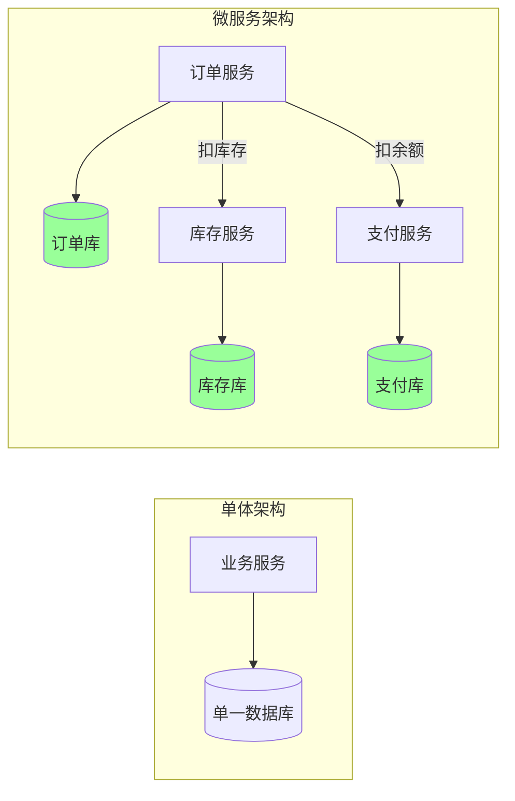
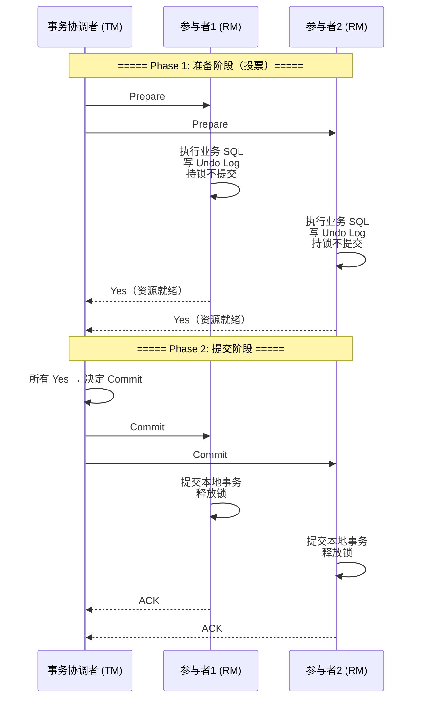
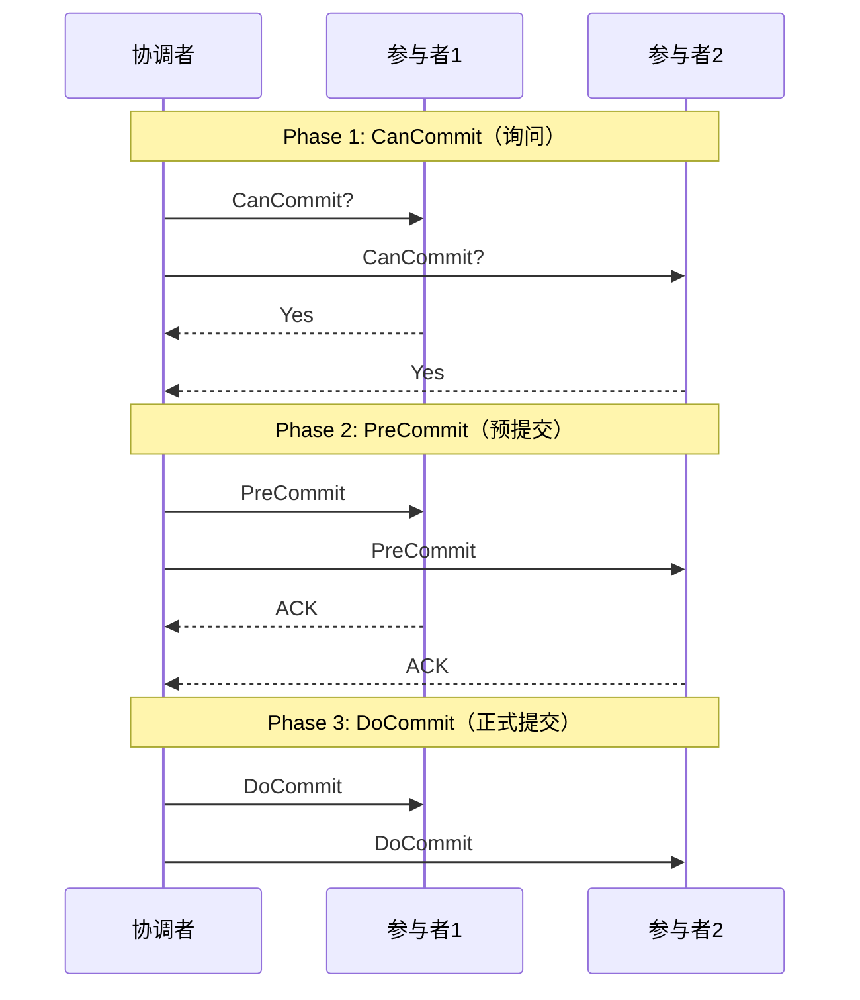
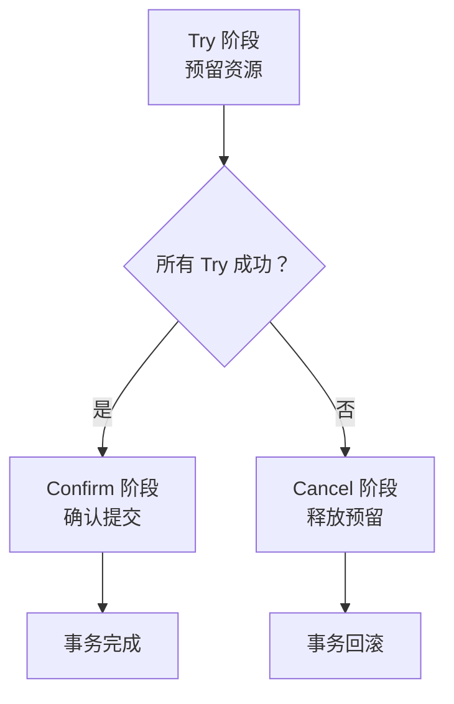
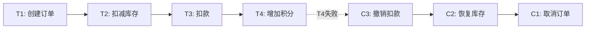
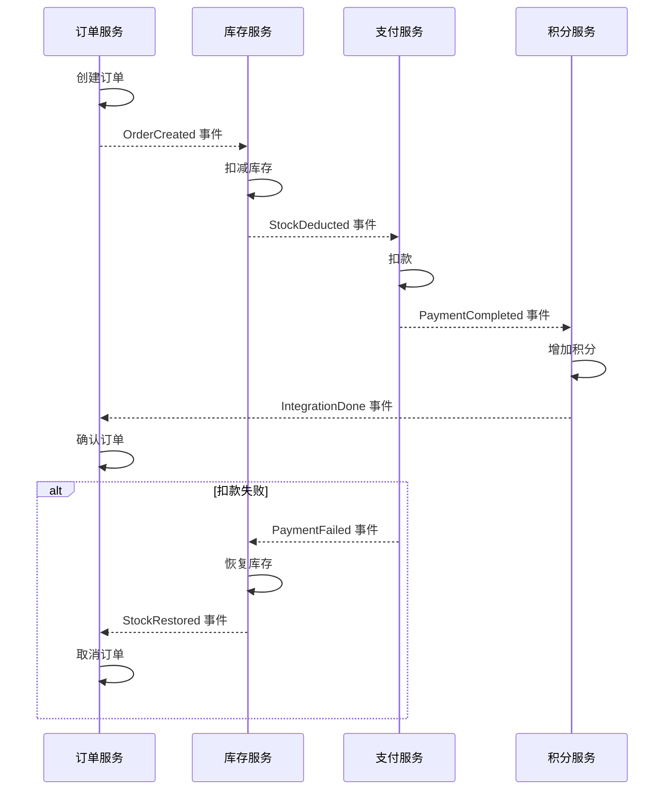
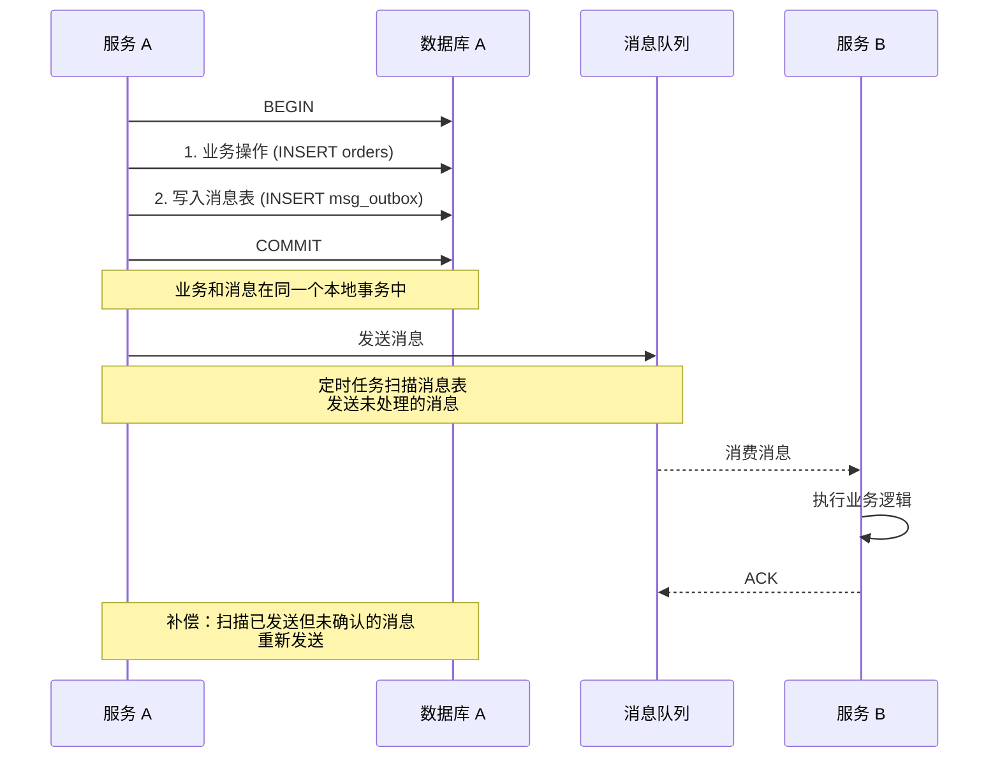
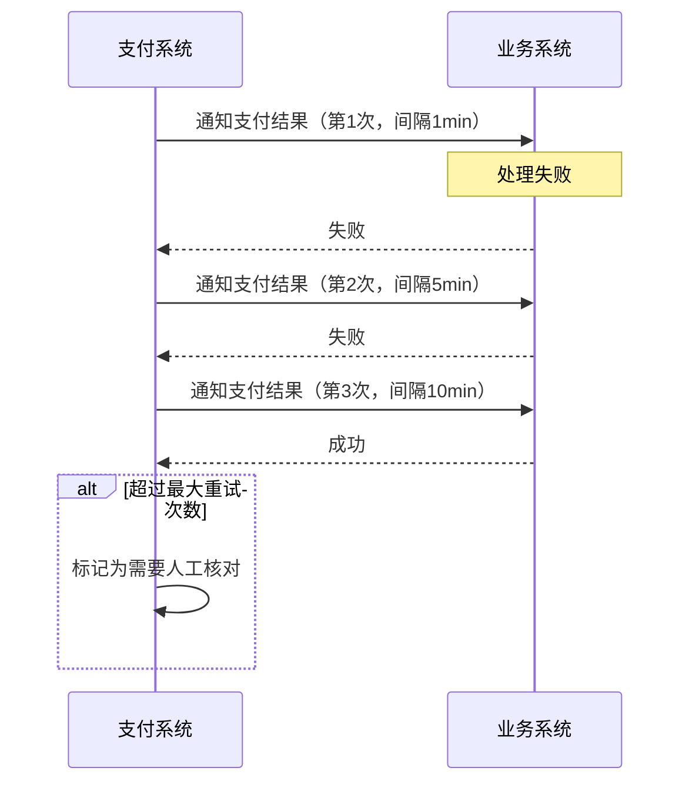
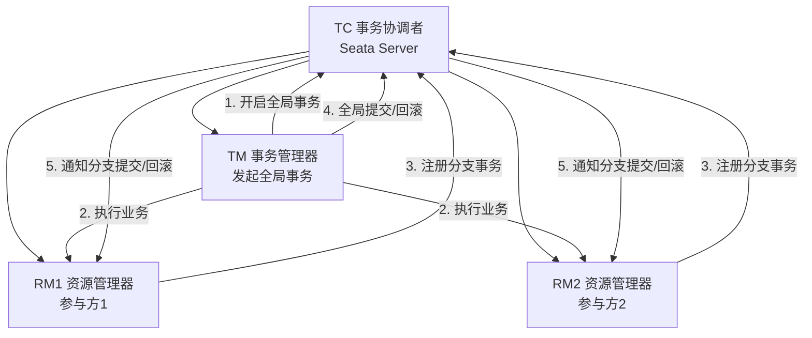
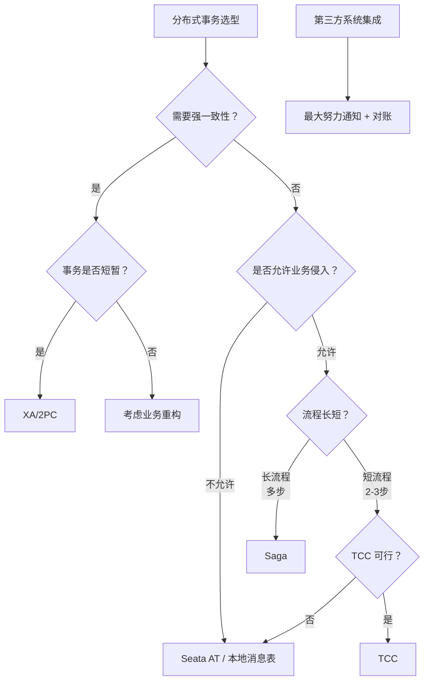

> **TL;DR**：微服务架构下，一个业务操作往往涉及多个服务的数据变更。如何保证这些跨服务变更的原子性和一致性？本文系统梳理分布式事务的演进路线：从经典的 2PC/3PC，到业务层面的 TCC/Saga 模式，再到本地消息表和最大努力通知，最后对比 Seata 框架的四种模式，给出工程选型指南。

---

## 一、分布式事务的挑战

### 1.1 从本地事务到分布式事务

```sql
-- 本地事务：单一数据库，ACID 有保障
BEGIN;
  UPDATE account SET balance = balance - 100 WHERE id = 1;
  UPDATE account SET balance = balance + 100 WHERE id = 2;
COMMIT;
-- 要么全部成功，要么全部回滚
```



微服务架构将数据分散到不同的数据库，传统 ACID 事务无法跨越多个数据库。

### 1.2 分布式事务的核心难点

| 难点 | 描述 | 后果 |
|------|------|------|
| 原子性保证 | 多个服务要么全部成功，要么全部回滚 | 部分成功导致数据不一致 |
| 网络不可靠 | 请求可能超时、丢失、重复 | 无法确认对方是否执行 |
| 无全局时钟 | 无法用锁跨服务协调 | 并发控制困难 |
| 长事务 | 跨服务事务可能持续数秒到数分钟 | 锁持有时间过长 |
| 服务异构 | 不同服务使用不同数据库 | 无法依赖单一数据库事务 |

### 1.3 ACID vs BASE

| 维度 | ACID | BASE |
|------|------|------|
| 一致性 | 强一致 | 最终一致 |
| 隔离性 | 严格事务隔离 | 允许中间状态 |
| 持久性 | 立即持久化 | 最终持久化 |
| 原子性 | 全有或全无 | 允许补偿回滚 |
| 性能 | 低（需加锁协调） | 高（异步、无锁） |
| 适用场景 | 单库事务 | 分布式事务 |

---

## 二、2PC（两阶段提交）

### 2.1 协议流程



```java
// 2PC 协调者核心逻辑
public class TwoPhaseCoordinator {
    private List<Participant> participants;
    
    public boolean execute() {
        // Phase 1: Prepare
        boolean allReady = true;
        for (Participant p : participants) {
            try {
                if (!p.prepare()) {
                    allReady = false;
                    break;
                }
            } catch (TimeoutException e) {
                allReady = false;
                break;
            }
        }
        
        // Phase 2: Commit or Rollback
        if (allReady) {
            for (Participant p : participants) {
                p.commit();
            }
        } else {
            for (Participant p : participants) {
                p.rollback();
            }
        }
        return allReady;
    }
}
```

### 2.2 2PC 的致命缺陷

| 缺陷 | 描述 | 影响 |
|------|------|------|
| **阻塞性** | Phase 1 后参与者持锁等待，无法做其他事 | 并发度低，吞吐量差 |
| **单点故障** | 协调者宕机 → 参与者永远阻塞 | 需要协调者高可用 |
| **数据不一致** | Phase 2 中部分参与者收到 Commit，部分网络超时 | 数据不一致 |
| **性能瓶颈** | 两阶段通信 + 全程持锁 | 延迟高 |

### 2.3 3PC（三阶段提交）

3PC 将准备阶段拆分为 CanCommit 和 PreCommit，增加超时机制：



3PC 的改进：如果协调者宕机，已 PreCommit 的参与者超时后可自行提交，减少阻塞。**但网络分区时仍可能数据不一致，且多一轮通信增加延迟。工程中极少使用。**

---

## 三、TCC 模式（Try-Confirm-Cancel）

### 3.1 原理

TCC 是**业务层面**的分布式事务方案，每个操作拆分为三个阶段：



| 阶段 | 职责 | 特点 |
|------|------|------|
| Try | 检查并预留资源 | 执行业务检查，锁定必要资源 |
| Confirm | 确认提交 | 真正执行业务，不使用预留资源 |
| Cancel | 取消回滚 | 释放 Try 阶段预留的资源 |

### 3.2 转账场景实现

```java
// TCC 转账：从 A 账户转 100 元到 B 账户
public class TransferTCC {
    
    // ===== Try：冻结转出金额，预增转入金额 =====
    @Transactional
    public boolean tryTransfer(String fromId, String toId, BigDecimal amount) {
        // 冻结转出方金额
        int rows = accountMapper.freezeAmount(fromId, amount);
        if (rows == 0) return false;
        // 预增转入方金额（冻结态）
        accountMapper.preAddAmount(toId, amount);
        return true;
    }
    
    // ===== Confirm：确认扣减和解冻 =====
    @Transactional
    public void confirmTransfer(String fromId, String toId, BigDecimal amount) {
        accountMapper.unfreezeAndDeduct(fromId, amount);
        accountMapper.unfreezeAdd(toId, amount);
    }
    
    // ===== Cancel：释放冻结和预增 =====
    @Transactional
    public void cancelTransfer(String fromId, String toId, BigDecimal amount) {
        accountMapper.unfreeze(fromId, amount);
        accountMapper.cancelPreAdd(toId, amount);
    }
}
```

### 3.3 TCC 三大问题及解决方案

| 问题 | 场景 | 解决方案 |
|------|------|---------|
| **空回滚** | Try 未到达但 Cancel 先到了 | 记录 Try 是否执行，Cancel 时检查 |
| **防悬挂** | Cancel 比 Try 先到达网络 | Cancel 时记录事务 ID，Try 到达时检查 |
| **幂等性** | Confirm/Cancel 可能重复执行 | 记录事务状态，已处理则跳过 |

```java
// TCC 三大问题的综合解决方案
public class TCCService {
    
    // 事务状态表
    // tx_id | branch_id | status (TRY/CONFIRM/CANCEL) | create_time
    
    public boolean tryTransfer(TxContext ctx) {
        // 防悬挂：如果已执行 Cancel，拒绝 Try
        if (transactionMapper.isCancelled(ctx.getTxId())) {
            return false;
        }
        transactionMapper.insert(ctx.getTxId(), "TRY");
        // 执行业务...
        return true;
    }
    
    public void confirmTransfer(TxContext ctx) {
        // 幂等：已确认则跳过
        if (transactionMapper.isConfirmed(ctx.getTxId())) {
            return;
        }
        transactionMapper.updateStatus(ctx.getTxId(), "CONFIRM");
        // 执行业务...
    }
    
    public void cancelTransfer(TxContext ctx) {
        // 空回滚：Try 未执行，直接标记 Cancel
        if (!transactionMapper.exists(ctx.getTxId())) {
            transactionMapper.insertCancelled(ctx.getTxId());
            return;
        }
        // 幂等：已取消则跳过
        if (transactionMapper.isCancelled(ctx.getTxId())) {
            return;
        }
        transactionMapper.updateStatus(ctx.getTxId(), "CANCEL");
        // 执行业务...
    }
}
```

---

## 四、Saga 模式

### 4.1 原理

Saga 将长事务拆分为多个**本地事务**，每个本地事务有对应的**补偿操作**。



### 4.2 两种编排方式

#### 事件编排（Event Choreography）



```java
// 事件编排：订单创建事件监听
@Service
public class OrderSagaEventHandler {
    
    @KafkaListener(topics = "order-created")
    public void onOrderCreated(OrderCreatedEvent event) {
        try {
            stockService.deduct(event.getCommodityCode(), event.getCount());
            eventPublisher.publish(new StockDeductedEvent(event.getOrderId()));
        } catch (Exception e) {
            eventPublisher.publish(new StockDeductFailedEvent(event.getOrderId()));
        }
    }
    
    @KafkaListener(topics = "stock-deduct-failed")
    public void onStockDeductFailed(StockDeductFailedEvent event) {
        orderService.cancel(event.getOrderId());
    }
}
```

#### 命令编排（Command Orchestration）

```java
// 命令编排：Saga 协调器
@Component
public class OrderSagaOrchestrator {
    
    public void execute(Order order) {
        Saga saga = SagaDefinitionBuilder.<SagaState>newBuilder()
            .step()
                .invokeParticipant(orderService::create, order)
                .withCompensation(orderService::cancel, order)
            .step()
                .invokeParticipant(stockService::deduct, order)
                .withCompensation(stockService::restore, order)
            .step()
                .invokeParticipant(paymentService::pay, order)
                .withCompensation(paymentService::refund, order)
            .step()
                .invokeParticipant(integrationService::addPoints, order)
                .withCompensation(integrationService::deductPoints, order)
            .onError(compensationError -> {
                log.error("Saga 补偿失败: {}", compensationError);
                // 告警 + 人工介入
            })
            .build();
        
        saga.execute();
    }
}
```

#### 两种编排对比

| 维度 | 事件编排 | 命令编排 |
|------|---------|---------|
| 耦合度 | 低（服务间无直接依赖） | 中（依赖协调器） |
| 流程可见性 | 差（流程散落在各服务中） | 好（集中管理） |
| 复杂度 | 步骤多时急剧上升 | 相对可控 |
| 调试难度 | 高 | 低 |
| 适合场景 | 简单流程（2~4 步） | 复杂流程 |
| 循环依赖 | 容易出现 | 不会 |

---

## 五、本地消息表

### 5.1 原理

利用**本地事务**保证业务操作和消息写入的原子性，再由定时任务异步发送消息。



```java
// 本地消息表实现
@Service
public class OrderService {
    
    @Transactional  // 同一个本地事务
    public void createOrder(Order order) {
        // 1. 业务操作
        orderMapper.insert(order);
        
        // 2. 写入本地消息表（同一事务，原子性保证）
        OutboxMessage msg = OutboxMessage.builder()
            .topic("order-created")
            .key(order.getId())
            .body(JSON.toJSONString(order))
            .status("PENDING")
            .retryCount(0)
            .createTime(new Date())
            .build();
        outboxMapper.insert(msg);
    }
}

// 定时任务：发送消息
@Scheduled(fixedDelay = 5000)
public void sendPendingMessages() {
    List<OutboxMessage> msgs = outboxMapper.selectPending(100);
    for (OutboxMessage msg : msgs) {
        try {
            mqProducer.send(msg.getTopic(), msg.getKey(), msg.getBody());
            outboxMapper.updateStatus(msg.getId(), "SENT");
        } catch (Exception e) {
            // 更新重试次数，超过上限则标记失败
            outboxMapper.incrementRetry(msg.getId());
        }
    }
}

// 补偿任务：确认消息是否被消费
@Scheduled(fixedDelay = 60000)
public void confirmMessages() {
    List<OutboxMessage> msgs = outboxMapper.selectSent();
    for (OutboxMessage msg : msgs) {
        if (!mqProducer.isConsumed(msg.getId())) {
            outboxMapper.updateStatus(msg.getId(), "PENDING"); // 重新发送
        }
    }
}
```

---

## 六、最大努力通知

最弱的分布式事务方案：发起方尽最大努力通知接收方。



| 策略 | 说明 |
|------|------|
| 递增间隔重试 | 1min → 5min → 10min → 30min → 1h |
| 最大重试次数 | 超过后停止自动重试 |
| 主动查询 | 接收方提供对账接口，发起方主动核对 |
| 人工介入 | 超过重试次数后人工处理 |

```java
// 最大努力通知
public class MaxEffortNotifier {
    private static final int[] INTERVALS = {60, 300, 600, 1800, 3600}; // 秒
    
    @Async
    public void notify(PaymentResult result) {
        for (int i = 0; i < INTERVALS.length; i++) {
            try {
                if (businessService.handle(result)) {
                    return; // 成功
                }
            } catch (Exception e) {
                log.warn("通知失败，第{}次", i + 1);
            }
            sleep(INTERVALS[i]);
        }
        // 超过最大次数，标记人工处理
        notificationMapper.markManual(result.getId());
    }
}
```

---

## 七、Seata 框架四种模式

### 7.1 Seata 架构



### 7.2 AT 模式（自动补偿）

对业务零侵入，自动生成回滚 SQL。

```java
// AT 模式——只需一个注解
@GlobalTransactional(timeoutMills = 60000)
public void purchase(String userId, String commodityCode, int count) {
    stockService.deduct(commodityCode, count);
    accountService.debit(userId, totalAmount);
    orderService.create(userId, commodityCode, count);
}
```

**AT 模式工作原理**：

1. **一阶段**：拦截 SQL → 生成前镜像（Before Image）→ 执行业务 SQL → 生成后镜像（After Image）→ 保存 undo_log → 提交本地事务
2. **二阶段提交**：异步删除 undo_log
3. **二阶段回滚**：根据 undo_log 反向补偿

```json
// undo_log 示例
{
  "branchId": 12345,
  "xid": "global-tx-id",
  "undoLogs": [{
    "beforeImage": {
      "tableName": "stock_tbl",
      "rows": [{ "id": 1, "stock": 100 }]
    },
    "afterImage": {
      "tableName": "stock_tbl",
      "rows": [{ "id": 1, "stock": 90 }]
    }
  }],
  "sqlType": "UPDATE"
}
```

### 7.3 四种模式对比

| 维度 | AT | TCC | Saga | XA |
|------|-----|-----|------|-----|
| 侵入性 | 无（只需注解） | 高（需写3个方法） | 中（需写补偿逻辑） | 无 |
| 性能 | 高（一阶段直接提交） | 高 | 高 | 低（长锁） |
| 一致性 | 最终一致 | 最终一致 | 最终一致 | 强一致 |
| 隔离性 | 全局锁 | 业务保证 | 无 | 数据库保证 |
| 适用场景 | 通用 CRUD | 资金类业务 | 长流程 | 短事务、跨库 |
| 数据库要求 | 需支持 undo_log | 通用 | 通用 | 需支持 XA 协议 |

---

## 八、方案选型指南



| 场景 | 推荐方案 | 理由 |
|------|---------|------|
| 电商下单 | AT / Saga | 流程长，最终一致可接受，无需业务侵入 |
| 资金转账 | TCC | 资金安全需要精确控制，业务可实现 Try/Confirm/Cancel |
| 跨库查询 | XA | 强一致性要求，事务短暂 |
| 支付回调通知 | 最大努力通知 | 第三方系统不可控 |
| 订单+库存 | 本地消息表 | 简单可靠，侵入低 |
| 通用 CRUD | Seata AT | 零侵入，自动生成补偿 |

---

## 九、面试 Q&A

### Q1：2PC 和 TCC 的本质区别是什么？

**答**：2PC 是**数据库层面**的协议，通过持锁阻塞保证一致性，参与者在 Prepare 阶段锁定资源等待最终决定。TCC 是**业务层面**的方案，Try 阶段预留业务资源（而非数据库锁），Confirm/Cancel 阶段确认或释放。TCC 不持有数据库锁，性能更好，但需要业务编写三套逻辑。

### Q2：Saga 模式如何处理补偿失败？

**答**：补偿失败是 Saga 的核心难题。策略：
1. **重试补偿**：有限次重试（幂等保证），递增间隔
2. **正向重试**：如果补偿失败，重新执行正向操作再补偿
3. **人工介入**：记录补偿失败，告警并转人工处理
4. **设计保障**：补偿逻辑尽量简单（如直接操作数据库，不调用其他服务）

关键原则：**补偿操作本身必须是幂等的**，否则重试会产生副作用。

### Q3：本地消息表和事务消息（如 RocketMQ）有什么区别？

**答**：
- **本地消息表**：将消息持久化到业务数据库的本地事务中，然后异步发送到 MQ。通用性强，不依赖特定 MQ，但需要额外维护消息表。
- **事务消息**：MQ 提供半消息机制（如 RocketMQ），先发送半消息，执行业务，再 Commit/Rollback。更优雅，但依赖 MQ 支持。

两者都解决了"业务操作和消息发送的原子性"问题，选择取决于是否愿意依赖特定 MQ。

### Q4：Seata AT 模式的全局锁是什么？为什么需要它？

**答**：AT 模式一阶段就提交了本地事务，如果没有全局锁，其他本地事务可能修改同一行数据，导致回滚时 undo_log 的前镜像与当前数据不一致（脏写）。全局锁在 TC 上维护，事务提交前必须先获取全局锁，提交后释放。如果获取失败，说明其他事务正在修改同一行，需等待或回滚。

### Q5：如何保证消息消费的幂等性？

**答**：
1. **唯一键去重**：消息 ID 作为数据库唯一键，重复插入被忽略
2. **状态机**：如订单从"待支付"→"已支付"是幂等的，重复到达无影响
3. **Redis SETNX**：`SETNX message_id processed`，成功才处理
4. **乐观锁版本号**：`UPDATE order SET status='paid', version=version+1 WHERE id=1 AND version=old_version`
5. **业务天然幂等**：如 INSERT IGNORE、UPSERT

选择取决于业务场景和性能要求。

### Q6：分布式事务和分布式一致性是什么关系？

**答**：两者关注不同层面的问题：
- **分布式事务**：关注**跨服务的数据变更原子性**，属于应用层问题。解决的是"多个操作要么全部成功，要么全部回滚"。
- **分布式一致性**：关注**副本之间的数据一致性**，属于存储层问题。解决的是"多个副本在并发读写下如何保持一致"。

两者有交叉：2PC 既是事务协议也可用于副本一致性。但实践中，分布式事务更多用最终一致性方案（TCC/Saga），分布式一致性更多用共识算法（Raft/Paxos）。

---

## 总结

分布式事务没有银弹。2PC 太重、TCC 太复杂、Saga 无隔离、本地消息表有延迟——每种方案都在一致性、可用性和复杂度之间做权衡。工程实践的核心原则是：**尽量避免分布式事务**。通过合理的服务拆分，将强一致性需求收敛到单个服务内。当无法避免时，根据业务特点选择最合适的方案，并做好补偿、对账和监控。记住：最终一致性不是"不要一致性"，而是"用时间换一致性"。
