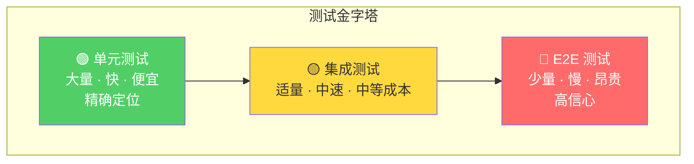
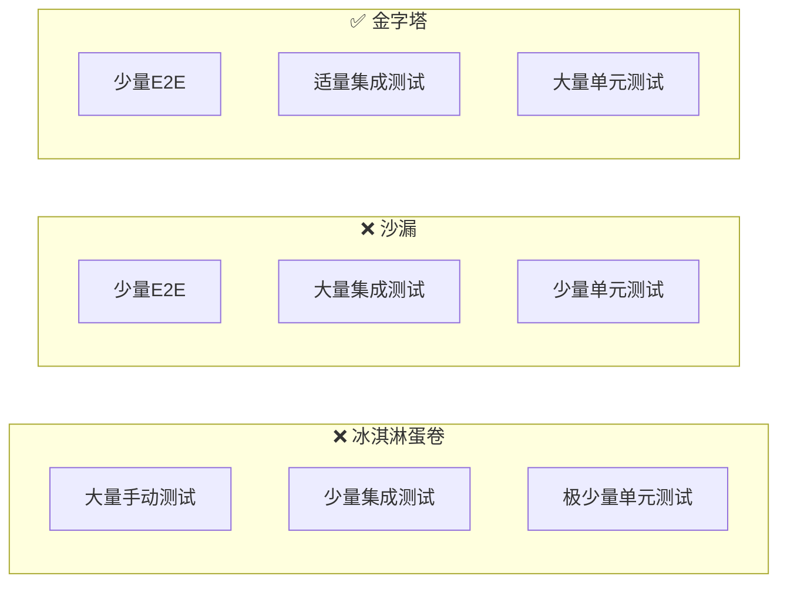
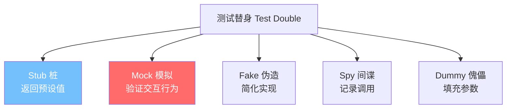
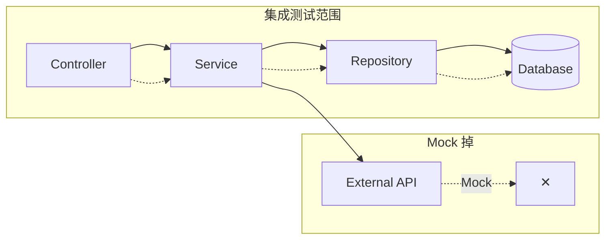
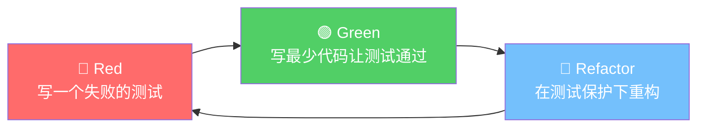
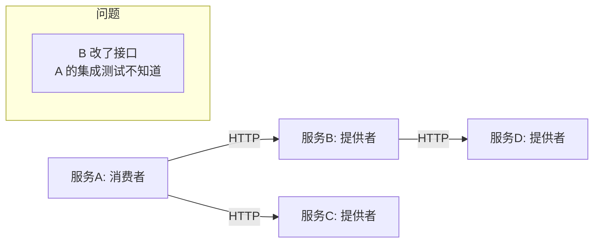
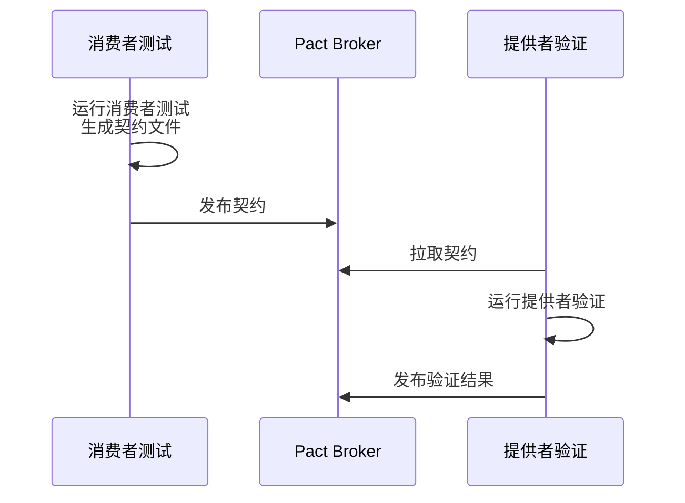
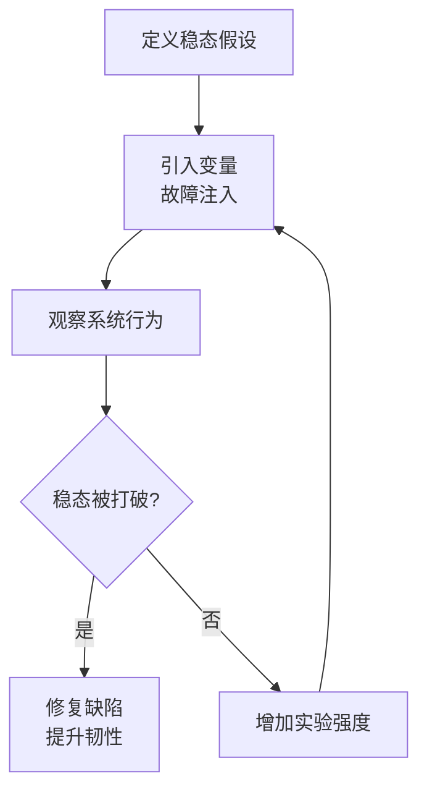

## 1. 测试金字塔

Mike Cohn 提出的测试金字塔是测试策略的基石。不同层次的测试在成本、速度和信心上各有权衡。



### 1.1 各层测试的量化对比

| 维度 | 单元测试 | 集成测试 | E2E 测试 |
|------|----------|----------|----------|
| **执行速度** | < 10ms | 100ms - 1s | 5s - 60s |
| **维护成本** | 低 | 中 | 高 |
| **故障定位** | 精确到方法 | 模块级别 | 系统级别 |
| **覆盖范围** | 单个函数/类 | 模块交互 | 完整用户流程 |
| **稳定性** | 高（无外部依赖） | 中 | 低（环境敏感） |
| **推荐比例** | 70% | 20% | 10% |

### 1.2 反模式：冰淇淋蛋卷与沙漏



---

## 2. 单元测试

### 2.1 单元测试的核心原则

单元测试是对软件中最小可测试单元的验证，具有以下特征：

- **快速**：毫秒级执行，整个套件在秒级完成
- **隔离**：不依赖外部系统（数据库、网络、文件系统）
- **可重复**：任何环境、任何顺序执行结果一致
- **自验证**：无需人工判断，断言自动给出通过/失败

### 2.2 AAA 模式

Arrange-Act-Assert 是单元测试的标准结构：

```java
@Test
void shouldCalculateTotalWithTax() {
    // Arrange —— 准备测试数据
    Order order = new Order();
    order.addItem(new OrderItem("Widget", new BigDecimal("100.00"), 2));
    BigDecimal taxRate = new BigDecimal("0.08");

    // Act —— 执行被测方法
    BigDecimal total = order.calculateTotalWithTax(taxRate);

    // Assert —— 验证结果
    assertThat(total).isEqualByComparingTo(new BigDecimal("216.00"));
}
```

### 2.3 FIRST 原则

| 字母 | 含义 | 说明 |
|------|------|------|
| **F** | Fast | 测试必须快速，否则开发者会跳过运行 |
| **I** | Independent | 测试之间无依赖，可任意顺序执行 |
| **R** | Repeatable | 在任何环境都能通过，不依赖网络/数据库 |
| **S** | Self-Validating | 输出是明确的 pass/fail，无需人工判断 |
| **T** | Timely | 测试与生产代码同步编写，不要事后补写 |

### 2.4 测试命名规范

```python
# ❌ 含糊的命名
def test_user():
    pass

def test_calculate():
    pass

# ✅ 描述性的命名：should_预期行为_when_条件
def test_should_return_zero_discount_when_customer_is_normal():
    pass

def test_should_apply_30_percent_discount_when_customer_is_vip():
    pass

# 或 Given-When-Then 风格
def test_given_normal_customer_when_calculate_discount_then_returns_zero():
    pass
```

---

## 3. Mock 与 Stub

### 3.1 测试替身分类



### 3.2 Stub vs Mock 的本质区别

| 维度 | Stub | Mock |
|------|------|------|
| **关注点** | 状态验证 | 行为验证 |
| **用途** | 提供测试数据 | 验证方法是否被调用 |
| **耦合度** | 低（不关心调用细节） | 高（关心调用次数、顺序、参数） |
| **维护成本** | 低 | 高（接口变化需更新 Mock） |

```java
// Stub：返回预设值，不关心是否被调用
EmailService emailStub = new EmailService() {
    @Override
    public boolean send(String to, String subject) {
        return true; // 总是返回成功
    }
};

// Mock：验证交互行为
EmailService emailMock = mock(EmailService.class);
userService.register(newUser);
verify(emailMock, times(1)).send(eq("test@example.com"), contains("欢迎"));
```

### 3.3 何时使用 Mock

```python
# ✅ 适合 Mock：外部依赖、有副作用、不可控
@patch('payment.gateway.charge')
def test_should_process_payment(mock_charge):
    mock_charge.return_value = {"status": "success", "transaction_id": "TX123"}
    result = payment_service.process(100.0)
    assert result.success is True
    mock_charge.assert_called_once_with(100.0)

# ❌ 不适合 Mock：简单纯函数、数据转换
def test_should_format_currency():
    # 直接测试，无需 Mock
    assert format_currency(1234.5) == "¥1,234.50"
```

---

## 4. 集成测试

### 4.1 集成测试的范围

集成测试验证模块间的协作是否正确，关注点在于**接口契约**和**数据流**。



### 4.2 集成测试实践

```java
@SpringBootTest
@Transactional // 每个测试后回滚，保持数据库干净
class OrderIntegrationTest {

    @Autowired
    private OrderService orderService;

    @Autowired
    private OrderRepository orderRepository;

    @MockBean // 用 Mock 替换外部依赖
    private PaymentGateway paymentGateway;

    @Test
    void shouldCreateOrderAndDeductInventory() {
        // 准备
        when(paymentGateway.charge(any())).thenReturn(new PaymentResult("success"));

        // 执行
        OrderRequest request = new OrderRequest("SKU001", 2);
        OrderResult result = orderService.createOrder(request);

        // 验证数据库状态
        Order savedOrder = orderRepository.findById(result.getOrderId()).orElseThrow();
        assertThat(savedOrder.getStatus()).isEqualTo(OrderStatus.PAID);
        assertThat(savedOrder.getItems()).hasSize(1);

        // 验证库存扣减
        Inventory inventory = inventoryRepository.findBySku("SKU001");
        assertThat(inventory.getQuantity()).isEqualTo(98);
    }
}
```

### 4.3 Testcontainers：真实依赖的集成测试

```java
@Testcontainers
class UserRepositoryIntegrationTest {

    @Container
    static PostgreSQLContainer<?> postgres = new PostgreSQLContainer<>("postgres:16")
            .withDatabaseName("testdb");

    @DynamicPropertySource
    static void configureProperties(DynamicPropertyRegistry registry) {
        registry.add("spring.datasource.url", postgres::getJdbcUrl);
        registry.add("spring.datasource.username", postgres::getUsername);
        registry.add("spring.datasource.password", postgres::getPassword);
    }

    @Test
    void shouldPersistAndRetrieveUser() {
        User user = new User("alice", "alice@example.com");
        userRepository.save(user);

        User found = userRepository.findByUsername("alice");
        assertThat(found.getEmail()).isEqualTo("alice@example.com");
    }
}
```

---

## 5. E2E 测试

### 5.1 E2E 测试策略

E2E 测试模拟真实用户操作，验证完整业务流程。由于成本高，应聚焦于**核心业务路径**。

```python
# Playwright E2E 测试示例
def test_user_checkout_flow(page):
    # 登录
    page.goto("/login")
    page.fill("[name=email]", "user@example.com")
    page.fill("[name=password]", "password123")
    page.click("button[type=submit]")

    # 浏览商品
    page.goto("/products")
    page.click("text=Widget Pro")

    # 加入购物车
    page.click("text=加入购物车")
    expect(page.locator(".cart-count")).to_have_text("1")

    # 结账
    page.click("text=去结算")
    page.fill("[name=address]", "北京市朝阳区xxx")
    page.click("text=确认支付")

    # 验证订单
    expect(page.locator(".order-status")).to_have_text("支付成功")
```

### 5.2 E2E 测试的挑战与对策

| 挑战 | 对策 |
|------|------|
| 执行慢 | 并行执行 + 选择性运行 |
| Flaky Test | 重试机制 + 等待策略（显式等待替代 sleep） |
| 环境依赖 | Docker Compose 一键环境 |
| 数据准备 | Factory 模式 + 数据快照 |

---

## 6. TDD 流程

### 6.1 红-绿-重构循环



### 6.2 TDD 实战示例

```python
# Step 1: Red —— 写失败测试
def test_should_calculate_fibonacci():
    assert fibonacci(0) == 0
    assert fibonacci(1) == 1
    assert fibonacci(10) == 55

# Step 2: Green —— 最简实现
def fibonacci(n):
    if n <= 1:
        return n
    return fibonacci(n - 1) + fibonacci(n - 2)

# Step 3: Refactor —— 优化为迭代版本
def fibonacci(n):
    if n <= 1:
        return n
    a, b = 0, 1
    for _ in range(2, n + 1):
        a, b = b, a + b
    return b
```

### 6.3 TDD 的误区

| 误区 | 正解 |
|------|------|
| TDD 要 100% 覆盖率 | 覆盖核心逻辑即可，简单 CRUD 不必强求 |
| 先写所有测试再写代码 | 一次只写一个测试，小步前进 |
| TDD 导致过度设计 | TDD 驱动最小设计，YAGNI 原则 |
| TDD 只适合单元测试 | TDD 同样适用于集成测试和功能测试 |

---

## 7. 测试覆盖率

### 7.1 覆盖率指标

$$
\text{语句覆盖率} = \frac{\text{被执行的语句数}}{\text{总语句数}} \times 100\%
$$

$$
\text{分支覆盖率} = \frac{\text{被执行的分支数}}{\text{总分支数}} \times 100\%
$$

| 指标 | 含义 | 局限 |
|------|------|------|
| 语句覆盖 | 每行代码是否被执行 | 不检查分支逻辑 |
| 分支覆盖 | 每个 if/else 分支是否被执行 | 不检查条件组合 |
| 路径覆盖 | 所有可能执行路径 | 路径爆炸，实际不可达 |
| 变异覆盖 | 变异代码是否被检测 | 计算成本高 |

### 7.2 覆盖率的正确态度

> **80% 覆盖率是合理的底线，100% 是有害的执念。**

- 追求 100% 覆盖率会导致为 getter/setter 写测试，ROI 极低
- 高覆盖率 ≠ 高质量：覆盖了路径不代表验证了正确性
- 核心业务逻辑应追求 > 90% 分支覆盖率
- 工具类、配置类可适当降低要求

---

## 8. 契约测试（Pact）

### 8.1 微服务下的集成测试困境



### 8.2 Pact 工作原理



```java
// 消费者端：定义期望的契约
@PactTestFor(providerName = "user-service")
@Test
void verifyUserServiceProvider(MockServer mockServer) {
    // 定义期望的响应
    User user = new User(1L, "alice", "alice@example.com");

    // 发送请求并验证
    given()
        .baseUri(mockServer.getUrl())
    .when()
        .get("/api/users/1")
    .then()
        .statusCode(200)
        .body("name", equalTo("alice"));
}
```

---

## 9. 混沌测试

### 9.1 混沌工程的核心思想

> 混沌工程是在分布式系统上进行实验的学科，目的是建立对系统抵御生产环境中混乱能力的信息。



### 9.2 常见故障注入场景

| 故障类型 | 工具 | 验证目标 |
|----------|------|----------|
| 网络延迟 | Chaos Mesh, Toxiproxy | 超时处理、降级策略 |
| 节点宕机 | Chaos Monkey | 自动恢复、流量转移 |
| 磁盘故障 | Litmus | 数据持久化、副本切换 |
| DNS 故障 | Chaos Mesh | 服务发现容错 |
| CPU 飙高 | Stress-ng | 限流、熔断 |

### 9.3 Chaos Mesh 实战

```yaml
apiVersion: chaos-mesh.org/v1alpha1
kind: NetworkChaos
metadata:
  name: api-delay
spec:
  action: delay
  mode: one
  selector:
    namespaces: [production]
    labelSelectors:
      app: order-service
  delay:
    latency: "500ms"
    correlation: "50"
    jitter: "100ms"
  duration: "5m"
```

---

## 10. 测试策略选择矩阵

| 项目特征 | 推荐策略 |
|----------|----------|
| 单体应用 | 金字塔：70% 单元 + 20% 集成 + 10% E2E |
| 微服务 | 菱形：30% 单元 + 40% 契约/集成 + 20% E2E + 10% 混沌 |
| 数据密集型 | 40% 单元 + 30% 集成 + 30% 数据验证 |
| 安全敏感 | 30% 单元 + 30% 集成 + 20% 安全测试 + 20% E2E |

---

## 11. 面试 Q&A

**Q1：单元测试和集成测试的边界在哪里？**

> 单元测试验证单个函数/类的逻辑正确性，所有外部依赖（数据库、网络、文件系统）都被 Mock/Stub 替换。集成测试验证模块间的协作，至少包含一个真实的外部依赖（如数据库）。判断标准：如果测试需要启动 Spring 容器或连接真实数据库，就是集成测试。

**Q2：TDD 在实际项目中如何落地？有哪些阻力？**

> 阻力：1. 排期紧张时"没时间写测试"；2. 遗留代码难以测试；3. 团队缺乏 TDD 经验。落地策略：1. 从新模块开始实践 TDD；2. 先建立测试文化（代码审查要求测试覆盖）；3. 结对编程推广 TDD；4. 展示 TDD 减少调试时间的数据。

**Q3：如何处理 Flaky Test？**

> 1. 识别：标记 flaky 测试，统计失败率；2. 根因分析：常见原因有——异步等待不足、测试数据竞争、外部依赖不稳定、时间依赖；3. 修复策略：显式等待替代 sleep、测试数据隔离、Mock 不稳定依赖、固定时间替代系统时间；4. 临时措施：隔离 flaky 测试到单独套件，不阻塞 CI。

**Q4：Mock 滥用有什么问题？如何避免？**

> 过度 Mock 导致：1. 测试与实现强耦合，重构时测试大面积失败；2. 测试通过但生产失败（Mock 行为与真实行为不一致）；3. 测试代码比生产代码还复杂。避免策略：1. 只 Mock 外部边界（数据库、第三方 API）；2. 内部逻辑用真实对象；3. 偶尔用集成测试验证 Mock 的假设。

**Q5：什么是契约测试？它解决了什么问题？**

> 契约测试（Consumer-Driven Contract Testing）是微服务场景下消费者驱动的接口验证。消费者定义对提供者接口的期望（契约），提供者验证自己是否满足所有消费者的契约。它解决了：1. 微服务独立部署时的接口兼容性问题；2. 集成测试环境搭建成本高的问题；3. 接口变更影响范围不可控的问题。Pact 是最流行的契约测试框架。
