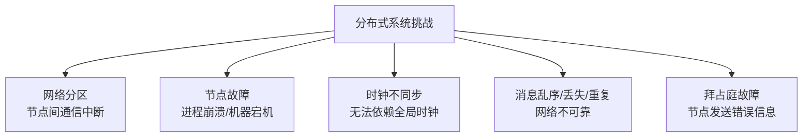
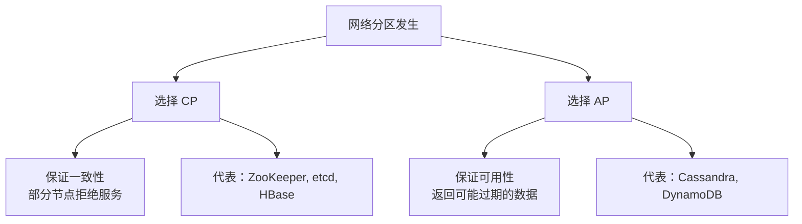
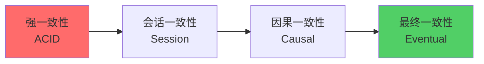
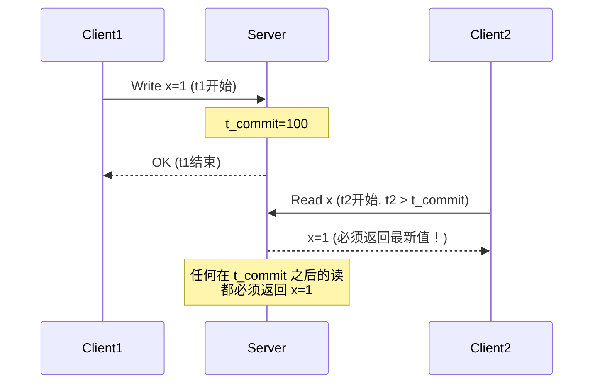
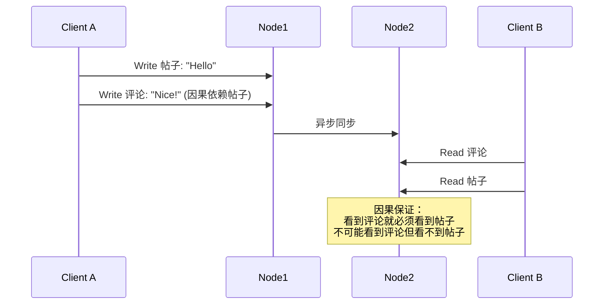
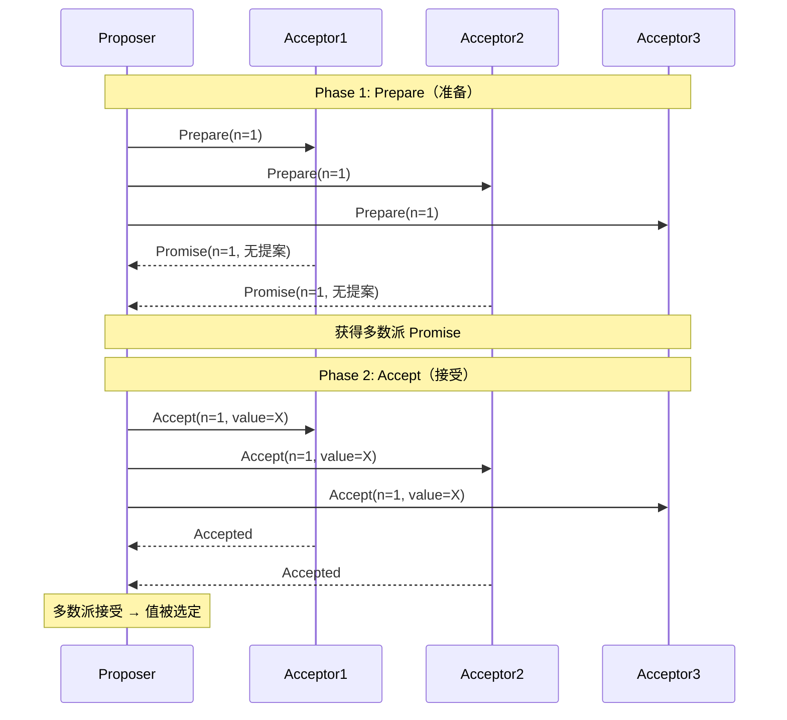
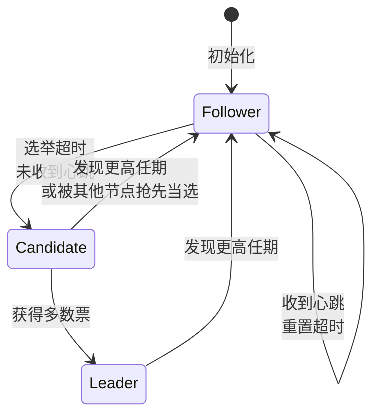
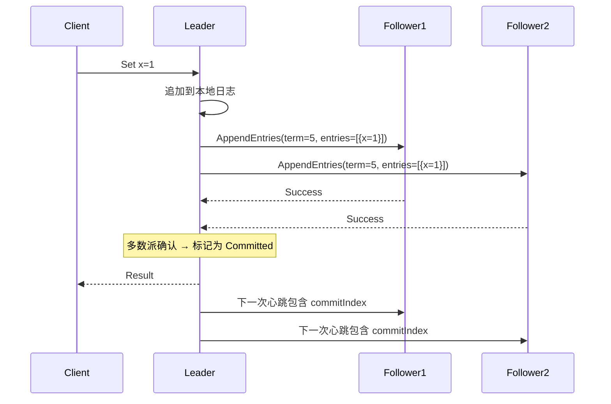
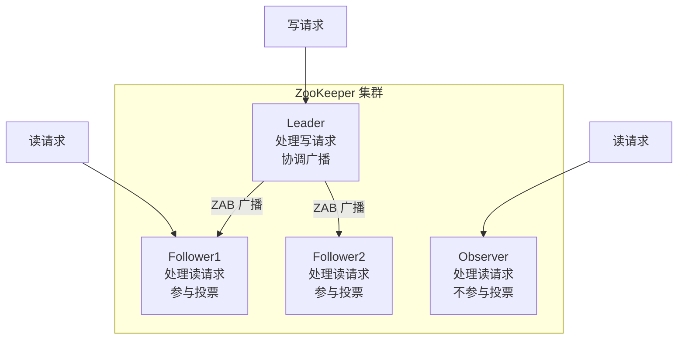
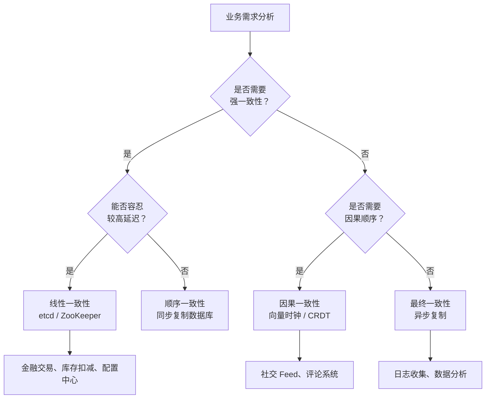

> **TL;DR**：CAP 定理是分布式系统设计的理论基础。本文从分布式系统的本质挑战出发，深入讲解 CAP 定理的内涵与常见误解，介绍 BASE 理论和一致性模型谱系（线性一致性 → 因果一致性 → 最终一致性），详解向量时钟、Paxos 和 Raft 共识算法，最后对比 ZooKeeper 与 etcd 的工程实践。

---

## 一、分布式系统的本质挑战

### 1.1 为什么分布式系统这么难？



在分布式系统中，以下问题**必然发生**：

| 挑战 | 描述 | 影响 |
|------|------|------|
| 网络分区 | 交换机故障、光纤中断导致节点间无法通信 | 数据无法同步 |
| 节点故障 | 进程崩溃、OOM、机器宕机 | 服务不可用 |
| 时钟不同步 | 物理时钟漂移，NTP 也有毫秒级误差 | 无法确定事件先后 |
| 消息异常 | 延迟、乱序、丢失、重复 | 状态不一致 |

### 1.2 FLP 不可能定理

> **FLP 定理**（Fischer, Lynch, Paterson, 1985）：在异步网络中，只要有一个进程可能故障，就不存在确定性共识算法能同时保证安全性和活性。

简言之：**在异步且可能故障的系统中，无法保证共识算法一定能终止**。这就是为什么所有共识算法都需要超时机制或随机化。

---

## 二、CAP 定理详解

### 2.1 三个属性的精确定义

```mermaid
graph TD
    CAP((CAP 定理)) --> C[Consistency 一致性<br/>所有节点同时看到<br/>相同的数据]
    CAP --> A[Availability 可用性<br/>每个请求都能收到<br/>非错误响应]
    CAP --> P[Partition Tolerance 分区容错<br/>网络分区时系统<br/>仍能运行]
    C -. 三者不可兼得 .-> A
    A -. .-> P
    P -. .-> C
```

| 属性 | 精确定义 | 通俗解释 |
|------|---------|---------|
| **C - Consistency** | 线性一致性：每次读都能读到最新的写 | 所有节点数据同步 |
| **A - Availability** | 每个非故障节点必须在合理时间内响应 | 服务始终可用 |
| **P - Partition Tolerance** | 网络分区时系统仍能继续提供服务 | 网络断了也能跑 |

### 2.2 为什么只能三选二？

网络分区是分布式系统的**客观现实**，不是可选项。所以实际只有两个选择：



**证明思路**：假设系统分为两个分区，Client 向 Node1 写入数据 x=1。此时 Client 向 Node2 读取 x：

- 如果要保证**一致性**（C），Node2 必须拒绝返回旧值 → 牺牲可用性（A）
- 如果要保证**可用性**（A），Node2 必须返回当前数据 → 可能返回旧值，牺牲一致性（C）

### 2.3 CAP 的常见误解

| 误解 | 事实 |
|------|------|
| "CAP 是运行时选择" | CAP 是**设计时权衡**，系统在设计时就决定了倾向 CP 还是 AP |
| "放弃 C 等于完全不一致" | 一致性是连续谱，可以是有保证的最终一致性 |
| "放弃 A 等于完全不可用" | 通常只是部分节点或部分操作暂时不可用 |
| "没有 P 的分布式系统存在" | 只要节点间通过网络通信，P 就是必选项 |
| "CAP 适用于所有场景" | CAP 关注的是数据读写的一致性/可用性，不适用于计算型服务 |

---

## 三、BASE 理论

BASE 是对 CAP 中 AP 方向的工程实践总结：

| 概念 | 全称 | 含义 | 举例 |
|------|------|------|------|
| **BA** | Basically Available（基本可用） | 允许响应时间增加或功能降级 | 电商大促时部分页面降级 |
| **S** | Soft State（软状态） | 允许存在中间状态 | 订单从"创建"到"支付"之间 |
| **E** | Eventually Consistent（最终一致性） | 最终数据会收敛一致 | DNS 全球同步 |



---

## 四、一致性模型谱系

### 4.1 从强到弱的一致性模型

| 一致性模型 | 保证强度 | 说明 | 典型系统 |
|-----------|---------|------|---------|
| **线性一致性（Linearizability）** | 最强 | 操作看起来原子发生，有实时约束 | etcd, ZooKeeper, 关系型数据库 |
| **顺序一致性（Sequential）** | 强 | 所有节点看到相同的操作顺序，无实时约束 | 共享内存多处理器 |
| **因果一致性（Causal）** | 中 | 有因果关系的操作按因果序可见 | Cassandra, Riak |
| **会话一致性（Session）** | 弱 | 单个客户端的读写有序 | DynamoDB |
| **最终一致性（Eventual）** | 最弱 | 没有新写入时最终收敛 | DNS, S3 |

### 4.2 线性一致性（Linearizability）

最强的一致性保证：**所有操作看起来像是在某个时间点原子地发生**。



**代价**：每次读操作都需要与多数节点通信，网络分区时必须牺牲可用性。

### 4.3 因果一致性（Causal Consistency）

保证**有因果关系的操作**按因果顺序被所有节点看到。



### 4.4 向量时钟（Vector Clocks）

向量时钟是检测因果关系的核心技术：

```python
# 向量时钟实现
class VectorClock:
    def __init__(self, node_count, node_id):
        self.clock = [0] * node_count  # 每个节点的计数器
        self.node_id = node_id
    
    def increment(self):
        self.clock[self.node_id] += 1
    
    def merge(self, other):
        for i in range(len(self.clock)):
            self.clock[i] = max(self.clock[i], other.clock[i])
    
    def happens_before(self, other) -> bool:
        """判断 self 是否在 other 之前（因果序）"""
        at_least_one_less = False
        for i in range(len(self.clock)):
            if self.clock[i] > other.clock[i]:
                return False
            if self.clock[i] < other.clock[i]:
                at_least_one_less = True
        return at_least_one_less
    
    def is_concurrent(self, other) -> bool:
        """判断是否并发（无因果关系）"""
        return not self.happens_before(other) and not other.happens_before(self)
```

```mermaid
graph LR
    A[节点A: [1,0,0]] -->|发送消息| B[节点B: [1,1,0]]
    B -->|发送消息| C[节点C: [1,1,1]]
    A -->|另一消息| D[节点B: [2,2,0]]
    D -. 并发 .-> C
```

| 关系 | 判断 | 含义 |
|------|------|------|
| `VC1 < VC2` | VC1 所有分量 ≤ VC2，且至少一个 < | VC1 因果先于 VC2 |
| `VC1 > VC2` | VC2 所有分量 ≤ VC1，且至少一个 < | VC2 因果先于 VC1 |
| `VC1 || VC2` | 既不大于也不小于 | 并发，无因果关系 |

---

## 五、共识算法

### 5.1 为什么需要共识？

分布式系统中的核心问题本质上都是共识问题：

| 问题 | 共识内容 | 应用场景 |
|------|---------|---------|
| Leader 选举 | 哪个节点是 Leader | 主从复制、协调服务 |
| 原子提交 | 事务是否提交 | 分布式事务 |
| 原子广播 | 消息的全局顺序 | 日志复制、状态机 |
| 分布式锁 | 谁获得了锁 | 资源协调 |

### 5.2 Paxos 算法

Paxos 由 Leslie Lamport 于 1990 年提出，是分布式共识的理论基础。

#### Basic Paxos 两阶段



**Paxos 核心约束**：
1. Acceptor 只能接受编号 ≥ 已承诺最大编号的提案
2. 如果 Acceptor 之前接受过提案，Promise 时必须告诉 Proposer
3. Proposer 在 Accept 阶段必须使用已承诺的最大编号对应的值
4. 值被多数派接受后即被选定

#### Multi-Paxos

通过选出 Leader 避免冲突，省略 Prepare 阶段，提高效率。

### 5.3 Raft 算法

Raft 由 Diego Ongaro 于 2014 年提出，核心目标是**易于理解和实现**。

#### 三种角色



#### Leader 选举

```go
// Raft Leader 选举（简化版）
func (n *Node) startElection() {
    n.mu.Lock()
    n.currentTerm++
    n.state = Candidate
    n.votedFor = n.id
    n.mu.Unlock()
    
    votes := 1 // 给自己投票
    
    for _, peer := range n.peers {
        go func(p Peer) {
            reply := p.RequestVote(RequestVoteArgs{
                Term:         n.currentTerm,
                CandidateId:  n.id,
                LastLogIndex: n.getLastLogIndex(),
                LastLogTerm:  n.getLastLogTerm(),
            })
            if reply.Term > n.currentTerm {
                n.becomeFollower(reply.Term)
                return
            }
            if reply.VoteGranted {
                votes++
                if votes > len(n.peers)/2 {
                    n.becomeLeader()
                }
            }
        }(peer)
    }
}
```

#### 日志复制



#### Raft 安全性保证

| 规则 | 说明 |
|------|------|
| 选举安全 | 每个任期最多一个 Leader |
| Leader 只追加 | Leader 不覆盖或删除自己的日志 |
| 日志匹配 | 索引和任期相同 → 之前的日志也相同 |
| Leader 完备性 | 已提交的日志在所有后续 Leader 的日志中 |
| 状态机安全 | 同一索引处，不同节点不会应用不同的日志 |

### 5.4 Paxos vs Raft 对比

| 维度 | Paxos | Raft |
|------|-------|------|
| 可理解性 | 极难（Lamport 都说过 Paxos 难懂） | 较易（论文就是为"易懂"而写） |
| Leader 模式 | Multi-Paxos 才有 Leader | 始终有 Leader |
| 日志连续性 | 可能出现空洞 | 保证连续（Leader 覆盖 Followers） |
| 成员变更 | 复杂（需要两阶段） | 相对简单（Joint Consensus） |
| 工程实现 | 困难（Google Chubby 花数年） | 相对容易 |
| 代表系统 | Google Chubby, Spanner | etcd, Consul, TiKV, CockroachDB |

---

## 六、ZooKeeper 与 Etcd 对比

### 6.1 ZooKeeper（ZAB 协议）

ZooKeeper 使用 ZAB（ZooKeeper Atomic Broadcast）协议，类似 Multi-Paxos。



**数据模型**：层级命名空间（类似文件系统）

```
/
├── services
│   ├── api-gateway
│   │   ├── instance-1  (ephemeral-sequential)
│   │   └── instance-2  (ephemeral-sequential)
│   └── user-service
│       └── instance-1  (ephemeral)
├── config
│   └── db-url  (persistent)
└── locks
    └── order-lock
        ├── lock-00001  (ephemeral-sequential)
        └── lock-00002  (ephemeral-sequential)
```

### 6.2 Etcd（Raft 协议）

```go
// etcd v3 API 使用示例
import "go.etcd.io/etcd/client/v3"

// 1. 基本 KV 操作
cli.Put(ctx, "/config/db", "mysql://localhost:3306")
resp, _ := cli.Get(ctx, "/config/db")

// 2. Watch 机制（持续监听）
watchChan := cli.Watch(ctx, "/config/", clientv3.WithPrefix())
for event := range watchChan {
    for _, ev := range event.Events {
        fmt.Printf("%s %s = %s\n", ev.Type, ev.Kv.Key, ev.Kv.Value)
    }
}

// 3. 租约（Lease）—— 服务发现
lease, _ := cli.Grant(ctx, 60)
cli.Put(ctx, "/services/api/1", "10.0.0.1:8080", clientv3.WithLease(lease.ID))
cli.KeepAlive(ctx, lease.ID) // 保持心跳

// 4. 分布式事务
txn := cli.Txn(ctx)
txn.If(
    clientv3.Compare(clientv3.Version("/lock"), "=", 0),
).Then(
    clientv3.OpPut("/lock", "held", clientv3.WithLease(lease.ID)),
).Else(
    clientv3.OpGet("/lock"),
).Commit()

// 5. 分布式锁
mutex := clientv3.NewMutex(cli, "/my-lock")
mutex.Lock(ctx)
defer mutex.Unlock(ctx)
```

### 6.3 全面对比

| 维度 | ZooKeeper | Etcd |
|------|-----------|------|
| 共识算法 | ZAB | Raft |
| 数据模型 | 层级命名空间（ZNode 树） | 扁平 KV + 前缀 |
| API | Java API + 四字命令 | gRPC + HTTP |
| Watch 机制 | 一次性触发（需重新注册） | 持续监听（流式） |
| 事务 | 单 ZNode 条件操作 | 多 Key 条件事务 |
| 语言 | Java | Go |
| 生态 | Hadoop 体系 | Kubernetes / Cloud Native |
| MVCC | 无 | 有（支持历史版本查询） |
| 性能 | 读性能好 | 读写性能均衡 |

---

## 七、工程实践：一致性级别选择



| 场景 | 推荐一致性 | 理由 |
|------|-----------|------|
| 银行转账 | 线性一致性 | 资金安全是底线 |
| 电商库存 | 线性一致性 | 超卖不可接受 |
| 配置中心 | 线性一致性 | 配置不一致导致服务异常 |
| 社交评论 | 因果一致性 | 评论必须在对应帖子之后 |
| 购物车 | 会话一致性 | 用户只关心自己的视角 |
| DNS | 最终一致性 | 可容忍短暂不一致 |

---

## 八、面试 Q&A

### Q1：CAP 定理中，为什么说 P（分区容错）是必选的？

**答**：网络分区不是设计选择，而是分布式系统的**客观现实**。只要节点间通过网络通信，网络分区就必然会发生（交换机故障、光纤被挖断、机房断电等）。因此 CAP 的实际选择是：
- **CP**：分区时牺牲部分节点的可用性，保证一致性
- **AP**：分区时保证所有节点可用，接受数据可能不一致

没有 P 的系统根本不是分布式系统（那是单机系统）。

### Q2：线性一致性和顺序一致性的核心区别是什么？

**答**：两者都保证所有节点看到相同的操作全序，但线性一致性**额外要求全序必须与实际时间一致**。

具体来说：如果操作 A 在操作 B **完成后**才开始，那么在全序中 A 必须排在 B 之后。顺序一致性没有这个实时约束——只要所有节点同意一个全序即可，不管这个顺序是否与实际时间吻合。

### Q3：Raft 如何保证 Leader 完备性（已提交的日志不会丢失）？

**答**：Raft 通过**选举限制**保证：Candidate 发起投票时携带自己日志最后一条的 term 和 index。投票者只投给日志**至少和自己一样新**的 Candidate。这保证了新当选的 Leader 一定包含所有已提交的日志条目。

### Q4：向量时钟能解决冲突吗？

**答**：向量时钟**只检测并发，不解决冲突**。当两个操作的向量时钟不可比较时（并发），说明存在冲突，需要应用层解决。常见冲突解决策略：
- **LWW**（Last Write Wins）：取时间戳最新的
- **应用层合并**：如购物车合并两个版本的修改
- **CRDT**（无冲突复制数据类型）：数学上保证最终收敛
- **人工解决**：如文档编辑中的冲突提示

### Q5：为什么 Kubernetes 选择 etcd 而不是 ZooKeeper？

**答**：
1. **生态一致**：etcd 和 K8s 都用 Go 编写
2. **Watch 机制**：etcd 是持续流式监听，ZooKeeper 是一次性触发（需反复注册）
3. **API**：etcd 原生 gRPC，性能更好，客户端支持更好
4. **MVCC**：etcd 支持历史版本查询，ZooKeeper 不支持
5. **运维简单**：etcd 部署和运维比 ZooKeeper 简单得多
6. **事务支持**：etcd 支持多 Key 条件事务

### Q6：在什么场景下应该牺牲一致性选择可用性？

**答**：当业务可以容忍短暂不一致，但**无法容忍服务不可用**时。典型场景：
- **电商商品详情页的浏览量**：差几个数不影响核心业务
- **社交平台的点赞数**：短暂不一致用户感知不强
- **推荐系统的数据源**：推荐结果可以容忍数据延迟
- **日志收集和分析**：数据最终能补全即可

关键判断标准：**不一致会不会导致经济损失或数据损坏？** 如果会，选 CP；如果不会，选 AP。

---

## 总结

CAP 定理不是教条，而是一个思考框架。它告诉我们：分布式系统设计中没有完美方案，只有权衡取舍。理解不同一致性模型的语义和代价，根据业务需求选择合适的一致性级别，才是分布式系统工程师的核心能力。共识算法（Paxos/Raft）为强一致性提供了可靠基础，但它们也有性能代价——真正的工程艺术在于在一致性与可用性之间找到恰当的平衡点。
