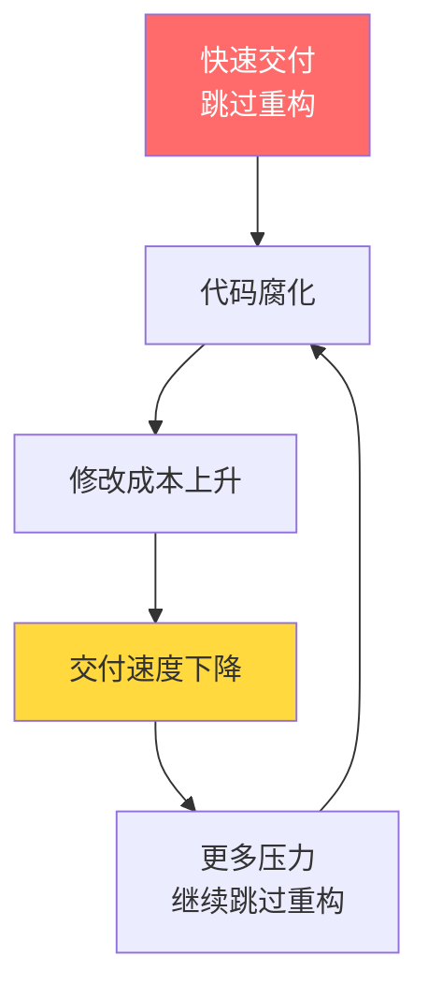
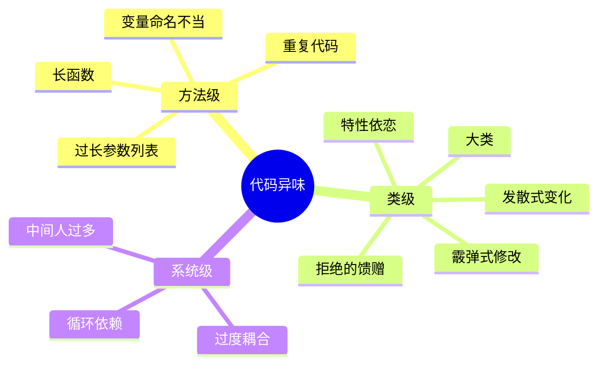
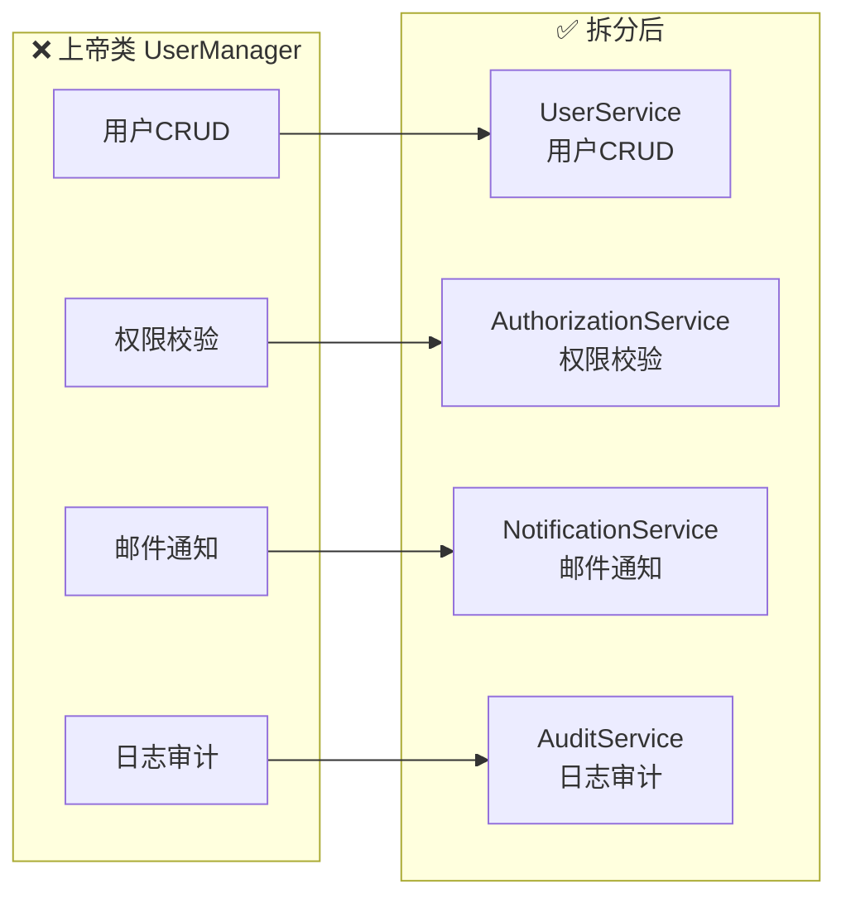
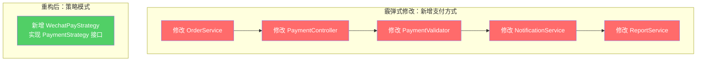
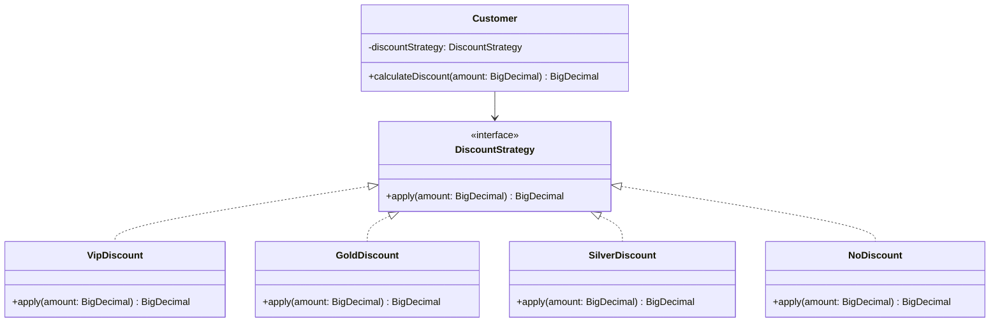
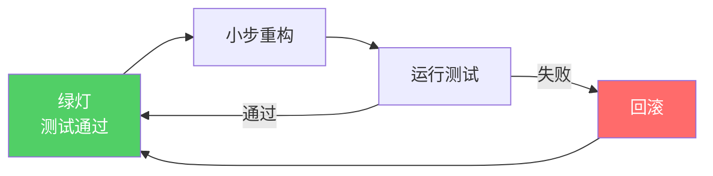
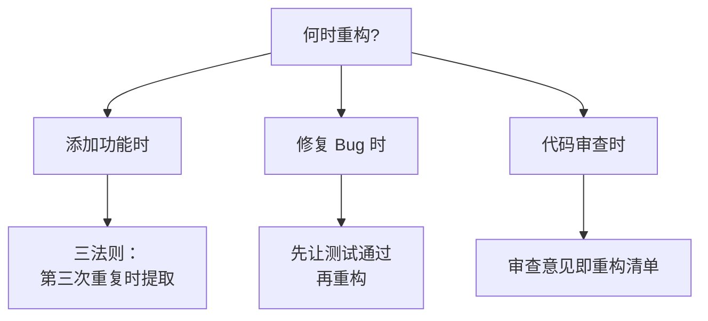

## 1. 为什么要重构

重构（Refactoring）是在不改变软件可观察行为的前提下，对其内部结构进行调整，使其更易理解和修改。Martin Fowler 在《重构》一书中指出：**重构不是"锦上添花"，而是软件演进的刚需。**

### 1.1 技术债务的复利效应



技术债务如同金融债务，不偿还则利滚利。每次在"脏代码"上叠加新功能，后续修改成本呈指数增长：

$$
\text{修改成本}(n) = C_0 \cdot e^{\alpha \cdot n}
$$

其中 $n$ 为跳过重构的次数，$\alpha$ 为代码腐化速率，$C_0$ 为初始修改成本。

### 1.2 重构的三重价值

| 维度 | 描述 | 量化指标 |
|------|------|----------|
| **可读性** | 代码是写给人看的，而非机器 | 新人理解模块的时间 |
| **可维护性** | 降低修改的边际成本 | 变更的代码行数/影响范围 |
| **可扩展性** | 为未来变化预留弹性 | 新增功能的改动点数量 |

---

## 2. 代码异味识别

代码异味（Code Smell）是代码中潜在问题的信号。异味本身不是 Bug，但它们预示着设计退化。

### 2.1 异味分类全景



### 2.2 长函数（Long Method）

**识别标准**：函数超过 20 行，或需要滚动才能看完。

```java
// ❌ 异味：长函数——做了太多事情
public OrderResult processOrder(Order order) {
    // 验证逻辑 30 行
    if (order.getItems() == null || order.getItems().isEmpty()) {
        throw new IllegalArgumentException("订单为空");
    }
    for (OrderItem item : order.getItems()) {
        if (item.getQuantity() <= 0) {
            throw new IllegalArgumentException("数量必须大于0");
        }
        if (item.getPrice().compareTo(BigDecimal.ZERO) <= 0) {
            throw new IllegalArgumentException("价格必须大于0");
        }
    }
    // 计算逻辑 40 行
    BigDecimal subtotal = BigDecimal.ZERO;
    for (OrderItem item : order.getItems()) {
        BigDecimal itemTotal = item.getPrice().multiply(BigDecimal.valueOf(item.getQuantity()));
        subtotal = subtotal.add(itemTotal);
    }
    BigDecimal tax = subtotal.multiply(TAX_RATE);
    BigDecimal shipping = calculateShipping(order);
    BigDecimal total = subtotal.add(tax).add(shipping);
    // 持久化逻辑 20 行
    order.setSubtotal(subtotal);
    order.setTax(tax);
    order.setShipping(shipping);
    order.setTotal(total);
    order.setStatus(OrderStatus.PROCESSED);
    orderRepository.save(order);
    // 通知逻辑 15 行
    notificationService.sendConfirmation(order);
    eventPublisher.publish(new OrderProcessedEvent(order.getId()));
    return new OrderResult(order.getId(), total);
}
```

```java
// ✅ 重构后：每个方法只做一件事
public OrderResult processOrder(Order order) {
    validateOrder(order);
    BigDecimal total = calculateTotal(order);
    persistOrder(order, total);
    notifyOrderProcessed(order);
    return new OrderResult(order.getId(), total);
}
```

### 2.3 大类（Large Class）

**识别标准**：类超过 300 行，或承担超过 3 个职责。



### 2.4 过长参数列表（Long Parameter List）

**识别标准**：参数超过 3 个，或调用时需要查阅定义。

```python
# ❌ 异味：参数过多，难以理解
def create_user(name, email, age, role, department, manager, is_active, created_by):
    pass

# ✅ 重构：引入参数对象
@dataclass
class UserCreationRequest:
    name: str
    email: str
    age: int
    role: Role
    department: str
    manager: Optional[str] = None
    is_active: bool = True
    created_by: Optional[str] = None

def create_user(request: UserCreationRequest) -> User:
    pass
```

### 2.5 发散式变化（Divergent Change）

**识别标准**：一个类因多种不同原因被修改。

> 当新增数据库字段时改 `UserService`，调整邮件模板时也改 `UserService`，修改权限规则时还改 `UserService`——这就是发散式变化。

### 2.6 霰弹式修改（Shotgun Surgery）

**识别标准**：一个变化需要修改多个类。



---

## 3. 核心重构手法

### 3.1 提取方法（Extract Method）

最常用也最安全的重构手法。将一段可独立理解的代码块提取为独立方法。

```java
// 重构前
public void printOwing() {
    // 打印横幅
    System.out.println("********************");
    System.out.println("*** Customer Owes ***");
    System.out.println("********************");

    // 计算欠款
    BigDecimal outstanding = BigDecimal.ZERO;
    for (Order order : orders) {
        outstanding = outstanding.add(order.getAmount());
    }

    // 打印详情
    System.out.println("name: " + name);
    System.out.println("amount: " + outstanding);
}

// 重构后
public void printOwing() {
    printBanner();
    BigDecimal outstanding = getOutstanding();
    printDetails(outstanding);
}
```

**提取方法的判断标准**：

| 信号 | 说明 |
|------|------|
| 注释块 | 注释通常暗示可以提取为方法 |
| 条件分支 | 每个分支体可提取 |
| 循环体 | 循环内的逻辑可提取 |
| 代码重复 | DRY 原则的直接应用 |

### 3.2 内联方法（Inline Method）

提取方法的逆操作。当方法体与方法名一样清晰，或方法只被调用一次时，内联消除不必要的间接层。

```java
// ❌ 过度抽象
public boolean isEligibleForDiscount(Customer c) {
    return c.getAge() > 65;
}

// ✅ 内联——逻辑足够简单，调用处直接写
if (customer.getAge() > 65) {
    applyDiscount();
}
```

### 3.3 移动方法（Move Method）

将方法移到它真正应该属于的类中，消除特性依恋（Feature Envy）。

```java
// ❌ 特性依恋：Account 中大量使用 Payment 的数据
class Account {
    public BigDecimal calculateLateFee(Payment payment) {
        BigDecimal base = payment.getBaseAmount();       // 使用 Payment 数据
        int daysLate = payment.getDaysLate();            // 使用 Payment 数据
        BigDecimal rate = payment.getLateRate();         // 使用 Payment 数据
        return base.multiply(rate).multiply(BigDecimal.valueOf(daysLate));
    }
}

// ✅ 移动方法到 Payment
class Payment {
    public BigDecimal calculateLateFee() {
        return baseAmount.multiply(lateRate).multiply(BigDecimal.valueOf(daysLate));
    }
}
```

### 3.4 替换条件为多态（Replace Conditional with Polymorphism）

这是消除复杂 `if-else` / `switch` 的利器：

```java
// ❌ 条件逻辑散布
class DiscountCalculator {
    public BigDecimal calculate(Customer customer, BigDecimal amount) {
        switch (customer.getLevel()) {
            case VIP:    return amount.multiply(BigDecimal.valueOf(0.7));
            case GOLD:   return amount.multiply(BigDecimal.valueOf(0.8));
            case SILVER: return amount.multiply(BigDecimal.valueOf(0.9));
            default:     return amount;
        }
    }
}

// ✅ 策略模式 + 多态
interface DiscountStrategy {
    BigDecimal apply(BigDecimal amount);
}

class VipDiscount implements DiscountStrategy {
    public BigDecimal apply(BigDecimal amount) {
        return amount.multiply(BigDecimal.valueOf(0.7));
    }
}

class GoldDiscount implements DiscountStrategy {
    public BigDecimal apply(BigDecimal amount) {
        return amount.multiply(BigDecimal.valueOf(0.8));
    }
}

// 新增折扣等级只需新增类，无需修改已有代码——符合开闭原则
class Customer {
    private DiscountStrategy discountStrategy;

    public BigDecimal calculateDiscount(BigDecimal amount) {
        return discountStrategy.apply(amount);
    }
}
```



### 3.5 引入 Null 对象（Introduce Null Object）

消除无处不在的 null 检查：

```java
// ❌ 到处都是 null 检查
class Customer {
    public BigDecimal getDiscount() {
        if (paymentPlan != null) {
            return paymentPlan.getDiscount();
        }
        return BigDecimal.ZERO;
    }
    public boolean isPremium() {
        return paymentPlan != null && paymentPlan.isPremium();
    }
}

// ✅ 引入 Null 对象
interface PaymentPlan {
    BigDecimal getDiscount();
    boolean isPremium();
}

class NullPaymentPlan implements PaymentPlan {
    public BigDecimal getDiscount() { return BigDecimal.ZERO; }
    public boolean isPremium() { return false; }
}

class Customer {
    private PaymentPlan paymentPlan = new NullPaymentPlan(); // 默认值

    public BigDecimal getDiscount() {
        return paymentPlan.getDiscount(); // 无需 null 检查
    }
}
```

---

## 4. 重构与测试

**没有测试的重构如同盲人走钢丝。** 测试是重构的安全网。

### 4.1 重构的安全循环



### 4.2 重构前的测试准备

```python
import pytest
from calculator import DiscountCalculator

class TestDiscountCalculator:
    """重构前必须先建立特征测试（Characterization Test）"""

    def test_vip_discount(self):
        calc = DiscountCalculator()
        assert calc.calculate(Customer(level="VIP"), amount=100) == 70

    def test_gold_discount(self):
        calc = DiscountCalculator()
        assert calc.calculate(Customer(level="GOLD"), amount=100) == 80

    def test_silver_discount(self):
        calc = DiscountCalculator()
        assert calc.calculate(Customer(level="SILVER"), amount=100) == 90

    def test_no_level_discount(self):
        calc = DiscountCalculator()
        assert calc.calculate(Customer(level="NORMAL"), amount=100) == 100
```

### 4.3 重构过程中的测试策略

| 阶段 | 测试类型 | 目的 |
|------|----------|------|
| 重构前 | 特征测试 | 锁定现有行为 |
| 重构中 | 单元测试 | 每步验证行为不变 |
| 重构后 | 集成测试 | 验证整体行为一致 |

> **关键原则**：重构不改变可观察行为。如果测试在重构前后结果不同，说明重构引入了 Bug 或测试不够充分。

---

## 5. 持续重构

### 5.1 童子军规则

> "离开营地时，让它比你到达时更干净。"

每次提交代码时做一点小改进——重命名一个变量、提取一个方法、消除一个重复。持续的小改进累积起来，远胜于偶尔的大规模重构。

### 5.2 重构时机



### 5.3 重构与业务平衡

| 策略 | 说明 |
|------|------|
| **时间盒** | 每次重构限定 30 分钟，到时即停 |
| **绞杀者模式** | 新功能用新架构，逐步替换旧代码 |
| **分支策略** | 大规模重构在 feature 分支进行，小重构直接在主干 |
| **重构预算** | 每个迭代预留 15%-20% 时间用于重构 |

### 5.4 重构的度量

- **圈复杂度**：方法复杂度 < 10 为佳
- **认知复杂度**：SonarQube 的 Cognitive Complexity 指标
- **耦合度**：类之间的依赖数量
- **内聚度**：LCOM（Lack of Cohesion of Methods）指标

---

## 6. 重构手法速查表

| 异味 | 推荐手法 | 难度 |
|------|----------|------|
| 长函数 | 提取方法 | ⭐ |
| 大类 | 提取类 | ⭐⭐ |
| 过长参数 | 引入参数对象 | ⭐ |
| 发散式变化 | 提取类 | ⭐⭐ |
| 霰弹式修改 | 移动方法/字段 | ⭐⭐ |
| 特性依恋 | 移动方法 | ⭐⭐ |
| 重复代码 | 提取方法/类/超类 | ⭐ |
| 条件逻辑 | 替换为多态 | ⭐⭐⭐ |
| Null 检查 | 引入 Null 对象 | ⭐⭐ |
| 过度委托 | 内联方法/移除中间人 | ⭐ |

---

## 7. 面试 Q&A

**Q1：重构和重写的区别是什么？什么时候该重构，什么时候该重写？**

> 重构是渐进式的内部结构改善，行为不变；重写是从零开始重新实现。当现有代码的架构还能支撑业务演进时选择重构；当技术栈过时、架构根本性不合理、或代码腐化到无法安全重构时考虑重写。Joel Spolsky 的建议：永远不要从头重写——但现实中需要权衡重写的 ROI。

**Q2：如何在紧张的交付排期中推动重构？**

> 1. 用数据说话：展示修改成本随时间上升的曲线；2. 童子军规则：每次提交做微小改进，不额外排期；3. 绞杀者模式：新功能用新架构，逐步替换；4. 争取重构预算：每个迭代预留 15%-20% 时间。

**Q3：重构时如何保证不引入 Bug？**

> 1. 重构前必须有充分的测试覆盖（核心逻辑 > 90%）；2. 小步重构，每步运行测试；3. 使用 IDE 的自动重构功能（重命名、提取方法等）；4. 遵循"重构与功能添加不同时进行"的原则；5. 代码审查验证重构的正确性。

**Q4：什么是发散式变化和霰弹式修改？它们的区别是什么？**

> 发散式变化：一个类因多种不同原因被修改（一个类受多个变化方向影响）；霰弹式修改：一个变化需要修改多个类（一个变化方向影响多个类）。两者是"一对多"与"多对一"的关系。解决方案都是提高内聚——让变化的影响范围最小化。

**Q5：替换条件为多态有什么适用场景和局限？**

> 适用：条件分支基于类型码且频繁变化时。局限：1. 如果条件分支不会新增类型，多态反而增加复杂度；2. 如果条件逻辑跨多个类散布，需要配合 Command 模式或 Visitor 模式；3. 简单的 2-3 个分支用枚举或 Map 更直观。不要为了模式而模式。
