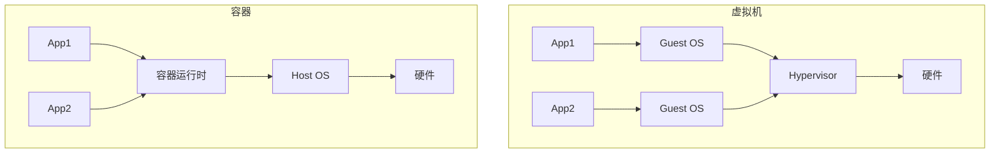
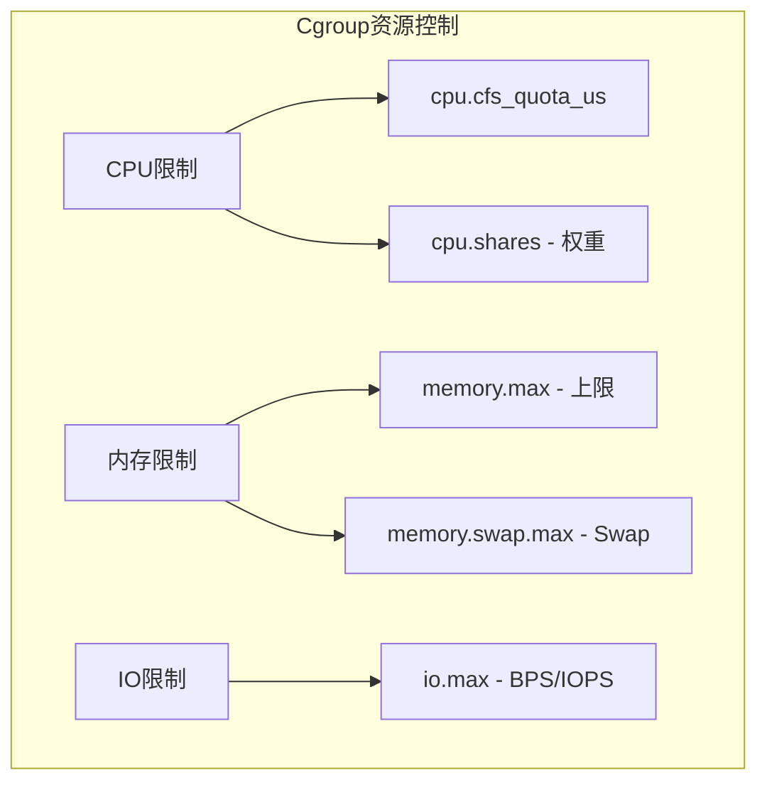
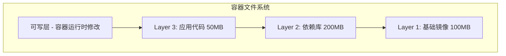
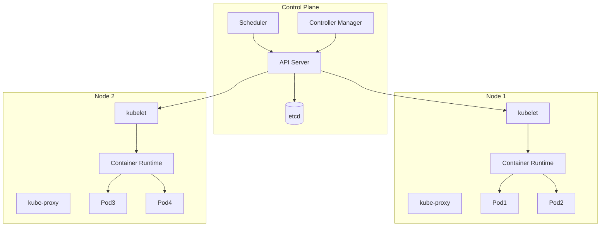
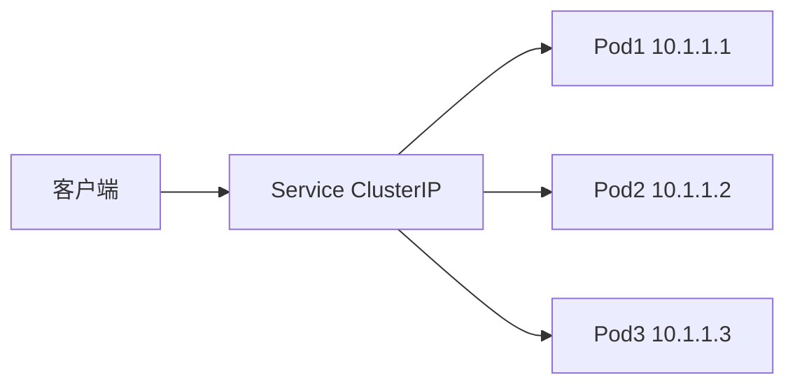
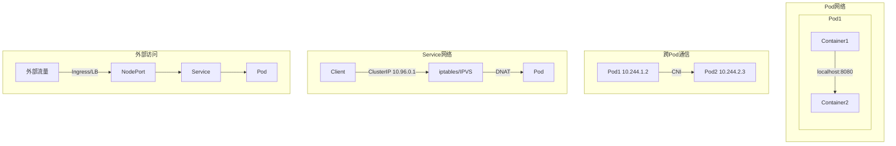
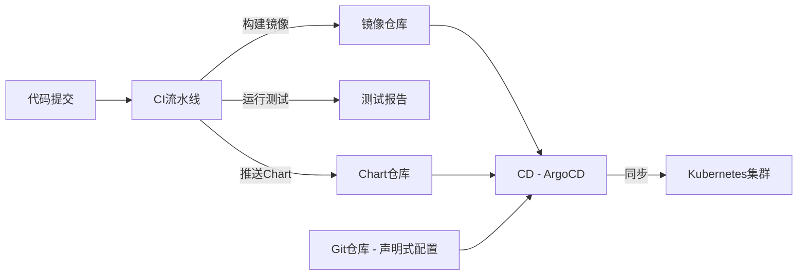

## 容器化与Kubernetes：云原生的基础设施

容器技术改变了软件的交付方式，Kubernetes 重新定义了基础设施的管理模式。理解容器原理和 K8s 核心概念，是云原生时代的必备技能。

## 容器原理

容器不是虚拟机，而是利用 Linux 内核特性实现的进程隔离。

### 容器 vs 虚拟机



| 维度 | 虚拟机 | 容器 |
|------|--------|------|
| 隔离级别 | 硬件级 | 进程级 |
| 启动时间 | 分钟级 | 秒级 |
| 镜像大小 | GB级 | MB级 |
| 性能损耗 | 5-15% | <2% |
| 密度 | 几十个 | 数百个 |
| 安全性 | 强（独立内核） | 弱（共享内核） |

### Namespace：资源隔离

Namespace 让容器内的进程看不到宿主机的其他进程和资源：

| Namespace | 隔离内容 | 参数 |
|-----------|---------|------|
| PID | 进程ID | `--pid` |
| NET | 网络栈 | `--net` |
| IPC | 进程间通信 | `--ipc` |
| MNT | 文件系统挂载点 | `--mount` |
| UTS | 主机名和域名 | `--uts` |
| USER | 用户和用户组 | `--user` |

```bash
# 创建隔离的容器进程
unshare --pid --mount --net --ipc --uts --fork /bin/bash

# 查看进程的Namespace
ls -la /proc/$$/ns
# lrwxrwxrwx 1 root root 0 ... pid -> 'pid:[4026531836]'
# lrwxrwxrwx 1 root root 0 ... net -> 'net:[4026531992]'
```

### Cgroup：资源限制

Cgroup（Control Group）限制容器可使用的资源：

```bash
# 限制CPU和内存
mkdir /sys/fs/cgroup/mycontainer
echo 100000 > /sys/fs/cgroup/mycontainer/cpu.cfs_quota_us    # 100ms/100ms = 1 CPU
echo 536870912 > /sys/fs/cgroup/mycontainer/memory.max        # 512MB
echo $PID > /sys/fs/cgroup/mycontainer/cgroup.procs
```



### UnionFS：镜像分层

Docker 镜像采用分层存储，每层只存储与上一层的差异：



## Docker 镜像与 Dockerfile

### Dockerfile 最佳实践

```dockerfile
# 多阶段构建 - 减小最终镜像体积
# 阶段1: 构建
FROM eclipse-temurin:21-jdk AS builder

WORKDIR /app

# 先复制依赖文件，利用缓存层
COPY gradle/ gradle/
COPY gradlew build.gradle settings.gradle ./
RUN ./gradlew dependencies --no-daemon

# 再复制源码
COPY src/ src/
RUN ./gradlew bootJar --no-daemon -x test

# 阶段2: 运行
FROM eclipse-temurin:21-jre

# 安全: 使用非root用户
RUN groupadd -r appuser && useradd -r -g appuser appuser

WORKDIR /app

# 只复制构建产物
COPY --from=builder /app/build/libs/*.jar app.jar

# 健康检查
HEALTHCHECK --interval=30s --timeout=3s --start-period=40s --retries=3 \
    CMD curl -f http://localhost:8080/actuator/health || exit 1

# 暴露端口
EXPOSE 8080

# 切换到非root用户
USER appuser

# 启动命令
ENTRYPOINT ["java", \
    "-XX:+UseG1GC", \
    "-XX:MaxRAMPercentage=75.0", \
    "-Djava.security.egd=file:/dev/./urandom", \
    "-jar", "app.jar"]
```

### 镜像优化策略

| 策略 | 效果 | 示例 |
|------|------|------|
| 多阶段构建 | 镜像从800MB→150MB | 构建阶段用JDK，运行阶段用JRE |
| 合并RUN指令 | 减少镜像层数 | `RUN apt-get update && apt-get install -y ...` |
| .dockerignore | 避免无关文件进入构建上下文 | 排除 `.git`, `node_modules` |
| 基础镜像选择 | Alpine/Scratch 最小 | `eclipse-temurin:21-jre-alpine` |
| 利用缓存 | 加速构建 | 先COPY依赖文件再COPY源码 |

### Docker Compose

```yaml
# docker-compose.yml
version: '3.8'

services:
  app:
    build:
      context: .
      dockerfile: Dockerfile
    ports:
      - "8080:8080"
    environment:
      - SPRING_PROFILES_ACTIVE=prod
      - DB_HOST=postgres
      - REDIS_HOST=redis
    depends_on:
      postgres:
        condition: service_healthy
      redis:
        condition: service_started
    healthcheck:
      test: ["CMD", "curl", "-f", "http://localhost:8080/actuator/health"]
      interval: 30s
      timeout: 3s
      retries: 3
    deploy:
      resources:
        limits:
          cpus: '2.0'
          memory: 1G
        reservations:
          cpus: '0.5'
          memory: 512M

  postgres:
    image: postgres:16-alpine
    environment:
      POSTGRES_DB: myapp
      POSTGRES_USER: ${DB_USER}
      POSTGRES_PASSWORD: ${DB_PASSWORD}
    volumes:
      - pgdata:/var/lib/postgresql/data
    healthcheck:
      test: ["CMD-SHELL", "pg_isready -U ${DB_USER}"]
      interval: 10s
      timeout: 5s
      retries: 5

  redis:
    image: redis:7-alpine
    command: redis-server --requirepass ${REDIS_PASSWORD} --maxmemory 256mb --maxmemory-policy allkeys-lru
    volumes:
      - redisdata:/data

volumes:
  pgdata:
  redisdata:
```

## Kubernetes 核心概念

### K8s 架构



### Pod

Pod 是 K8s 最小调度单元，包含一个或多个容器：

```yaml
apiVersion: v1
kind: Pod
metadata:
  name: order-service
  labels:
    app: order-service
    version: v1
spec:
  containers:
    - name: order-app
      image: registry.example.com/order-service:v1.2.0
      ports:
        - containerPort: 8080
      env:
        - name: SPRING_PROFILES_ACTIVE
          value: "prod"
        - name: DB_PASSWORD
          valueFrom:
            secretKeyRef:
              name: db-credentials
              key: password
      resources:
        requests:
          cpu: "500m"
          memory: "512Mi"
        limits:
          cpu: "2000m"
          memory: "1Gi"
      livenessProbe:
        httpGet:
          path: /actuator/health/liveness
          port: 8080
        initialDelaySeconds: 60
        periodSeconds: 15
      readinessProbe:
        httpGet:
          path: /actuator/health/readiness
          port: 8080
        initialDelaySeconds: 30
        periodSeconds: 10
      volumeMounts:
        - name: config
          mountPath: /app/config
          readOnly: true

    - name: log-sidecar
      image: fluent/fluent-bit:2.2
      volumeMounts:
        - name: logs
          mountPath: /var/log/app

  volumes:
    - name: config
      configMap:
        name: order-config
    - name: logs
      emptyDir: {}

  topologySpreadConstraints:
    - maxSkew: 1
      topologyKey: topology.kubernetes.io/zone
      whenUnsatisfiable: DoNotSchedule
      labelSelector:
        matchLabels:
          app: order-service
```

### Deployment

Deployment 管理 Pod 的副本集和滚动更新：

```yaml
apiVersion: apps/v1
kind: Deployment
metadata:
  name: order-service
  labels:
    app: order-service
spec:
  replicas: 3
  selector:
    matchLabels:
      app: order-service
  strategy:
    type: RollingUpdate
    rollingUpdate:
      maxSurge: 1          # 滚动更新时最多多出1个Pod
      maxUnavailable: 0    # 滚动更新时不允许不可用
  template:
    metadata:
      labels:
        app: order-service
    spec:
      containers:
        - name: order-app
          image: registry.example.com/order-service:v1.2.0
          ports:
            - containerPort: 8080
          resources:
            requests:
              cpu: "500m"
              memory: "512Mi"
            limits:
              cpu: "2000m"
              memory: "1Gi"
```

### Service

Service 为 Pod 提供稳定的访问入口：



```yaml
# ClusterIP - 集群内部访问
apiVersion: v1
kind: Service
metadata:
  name: order-service
spec:
  selector:
    app: order-service
  type: ClusterIP
  ports:
    - port: 80
      targetPort: 8080

---
# Headless Service - 用于StatefulSet
apiVersion: v1
kind: Service
metadata:
  name: order-service-headless
spec:
  selector:
    app: order-service
  clusterIP: None
  ports:
    - port: 8080

---
# Ingress - 外部访问
apiVersion: networking.k8s.io/v1
kind: Ingress
metadata:
  name: order-ingress
  annotations:
    nginx.ingress.kubernetes.io/rewrite-target: /$2
    cert-manager.io/cluster-issuer: letsencrypt-prod
spec:
  ingressClassName: nginx
  tls:
    - hosts:
        - api.example.com
      secretName: api-tls
  rules:
    - host: api.example.com
      http:
        paths:
          - path: /orders(/|$)(.*)
            pathType: Prefix
            backend:
              service:
                name: order-service
                port:
                  number: 80
```

### Service 类型对比

| 类型 | 访问范围 | 外部IP | 适用场景 |
|------|---------|--------|---------|
| ClusterIP | 集群内部 | 无 | 内部服务通信 |
| NodePort | 集群外部 | NodeIP:Port | 测试/简单暴露 |
| LoadBalancer | 集群外部 | 云LB IP | 生产环境 |
| ExternalName | 集群内部 | CNAME | 外部服务引用 |

## K8s 网络模型

### 网络原则

K8s 网络遵循四个基本原则：

1. **Pod 内容器共享网络命名空间**（localhost 通信）
2. **Pod 间直接通信**（无需 NAT）
3. **Node 与 Pod 直接通信**（无需 NAT）
4. **Pod 看到自己的 IP**（与其他节点看到的一致）



### CNI 插件对比

| CNI | 性能 | 网络策略 | eBPF | 适用场景 |
|-----|------|---------|------|---------|
| Flannel | 中 | 不支持 | 否 | 简单网络 |
| Calico | 高 | 支持 | 可选 | 生产环境 |
| Cilium | 极高 | 支持 | 是 | 高性能/可观测 |
| Weave | 中 | 支持 | 否 | 开发测试 |

## Helm

Helm 是 K8s 的包管理器，将 K8s 资源模板化、参数化：

```yaml
# Chart.yaml
apiVersion: v2
name: order-service
description: Order service Helm chart
type: application
version: 1.2.0
appVersion: "1.2.0"

---
# values.yaml
replicaCount: 3

image:
  repository: registry.example.com/order-service
  pullPolicy: IfNotPresent
  tag: ""

service:
  type: ClusterIP
  port: 80

resources:
  requests:
    cpu: 500m
    memory: 512Mi
  limits:
    cpu: 2000m
    memory: 1Gi

autoscaling:
  enabled: true
  minReplicas: 3
  maxReplicas: 10
  targetCPUUtilizationPercentage: 70

ingress:
  enabled: true
  className: nginx
  hosts:
    - host: api.example.com
      paths:
        - path: /orders
          pathType: Prefix
  tls:
    - secretName: api-tls
      hosts:
        - api.example.com
```

```yaml
# templates/deployment.yaml
apiVersion: apps/v1
kind: Deployment
metadata:
  name: {{ include "order-service.fullname" . }}
  labels:
    {{- include "order-service.labels" . | nindent 4 }}
spec:
  replicas: {{ .Values.replicaCount }}
  selector:
    matchLabels:
      {{- include "order-service.selectorLabels" . | nindent 6 }}
  template:
    metadata:
      labels:
        {{- include "order-service.selectorLabels" . | nindent 8 }}
    spec:
      containers:
        - name: {{ .Chart.Name }}
          image: "{{ .Values.image.repository }}:{{ .Values.image.tag | default .Chart.AppVersion }}"
          ports:
            - containerPort: 8080
          resources:
            {{- toYaml .Values.resources | nindent 12 }}
```

### Helm 常用命令

```bash
# 安装/升级
helm upgrade --install order-service ./chart \
  --namespace production \
  --set image.tag=v1.2.0 \
  --set replicaCount=5

# 回滚
helm rollback order-service 1

# 查看渲染结果（不安装）
helm template ./chart --values values-prod.yaml

# 查看发布历史
helm history order-service -n production
```

## CI/CD 流水线

### 完整的 GitOps 流水线



### GitHub Actions CI/CD

```yaml
# .github/workflows/ci-cd.yml
name: CI/CD Pipeline

on:
  push:
    branches: [main]
  pull_request:
    branches: [main]

env:
  REGISTRY: ghcr.io
  IMAGE_NAME: ${{ github.repository }}

jobs:
  test:
    runs-on: ubuntu-latest
    steps:
      - uses: actions/checkout@v4

      - name: Set up JDK 21
        uses: actions/setup-java@v4
        with:
          java-version: '21'
          distribution: 'temurin'

      - name: Run tests
        run: ./gradlew test

      - name: Run integration tests
        run: ./gradlew integrationTest

  build-and-push:
    needs: test
    if: github.event_name == 'push' && github.ref == 'refs/heads/main'
    runs-on: ubuntu-latest
    permissions:
      contents: read
      packages: write
    steps:
      - uses: actions/checkout@v4

      - name: Login to Container Registry
        uses: docker/login-action@v3
        with:
          registry: ${{ env.REGISTRY }}
          username: ${{ github.actor }}
          password: ${{ secrets.GITHUB_TOKEN }}

      - name: Extract metadata
        id: meta
        uses: docker/metadata-action@v5
        with:
          images: ${{ env.REGISTRY }}/${{ env.IMAGE_NAME }}
          tags: |
            type=sha,prefix=
            type=raw,value=latest,enable={{is_default_branch}}

      - name: Build and push
        uses: docker/build-push-action@v5
        with:
          context: .
          push: true
          tags: ${{ steps.meta.outputs.tags }}
          cache-from: type=gha
          cache-to: type=gha,mode=max

  deploy:
    needs: build-and-push
    runs-on: ubuntu-latest
    steps:
      - uses: actions/checkout@v4

      - name: Deploy to K8s
        run: |
          helm upgrade --install order-service ./helm/order-service \
            --namespace production \
            --set image.tag=${{ github.sha }} \
            --values ./helm/values-prod.yaml
```

### 部署策略

| 策略 | 原理 | 停机时间 | 回滚速度 | 资源消耗 |
|------|------|---------|---------|---------|
| 滚动更新 | 逐步替换旧Pod | 无 | 慢 | 低 |
| 蓝绿部署 | 两套环境切换 | 无 | 快 | 高（2倍） |
| 金丝雀发布 | 逐步增加流量 | 无 | 快 | 中 |
| A/B测试 | 按条件分流 | 无 | 快 | 高 |

```yaml
# 金丝雀发布 - Argo Rollouts
apiVersion: argoproj.io/v1alpha1
kind: Rollout
metadata:
  name: order-service
spec:
  replicas: 10
  strategy:
    canary:
      steps:
        - setWeight: 5
        - pause: { duration: 5m }
        - setWeight: 20
        - pause: { duration: 10m }
        - setWeight: 50
        - pause: { duration: 15m }
        - setWeight: 80
        - pause: { duration: 10m }
      canaryService: order-service-canary
      stableService: order-service-stable
```

## 面试 Q&A

**Q1：容器和虚拟机的本质区别是什么？**

A：本质区别在于**隔离边界**：虚拟机隔离在硬件层（独立的虚拟硬件、独立内核），容器隔离在操作系统层（共享宿主机内核，通过 Namespace 隔离进程视图，通过 Cgroup 限制资源）。这导致：(1) 容器启动快（秒级 vs 分钟级）——不需要启动内核；(2) 容器轻量（MB vs GB）——不需要完整的 Guest OS；(3) 容器密度高——共享内核，资源开销小；(4) 容器安全性弱——内核漏洞影响所有容器，逃逸风险更高。选择原则：强隔离需求（多租户、不可信代码）用虚拟机，快速交付和弹性伸缩用容器。

**Q2：K8s 中 Deployment 和 StatefulSet 的区别？**

A：核心区别在于**是否有状态**。Deployment 管理无状态应用（Pod 可互换）：(1) Pod 名称随机（order-service-7b8f9c6d4-x2k7j）；(2) 没有固定网络标识（每次重建IP变化）；(3) 没有持久存储（重建后数据丢失）；(4) 扩缩容和滚动更新简单。StatefulSet 管理有状态应用（如数据库）：(1) Pod 名称有序（mysql-0, mysql-1）；(2) 固定网络标识（mysql-0.mysql-headless.default.svc.cluster.local）；(3) 持久存储与Pod绑定（PVC 不会随Pod删除）；(4) 有序部署和终止（0→1→2）。**原则：能用 Deployment 就不用 StatefulSet**——数据库等有状态服务建议使用托管服务（RDS、Cloud SQL）而非自建。

**Q3：K8s 的 Service 和 Ingress 有什么区别？**

A：Service 是四层（TCP/UDP）负载均衡，Ingress 是七层（HTTP/HTTPS）反向代理。Service 提供：(1) 稳定的 ClusterIP；(2) Pod 负载均衡；(3) 服务发现。Ingress 在 Service 之上提供：(1) 基于域名的路由（api.example.com → order-service）；(2) 基于路径的路由（/orders → order-service, /users → user-service）；(3) TLS 终止；(4) 限流、认证等七层能力。**简单场景用 Service（LoadBalancer/NodePort），复杂路由用 Ingress**。生产环境推荐：Ingress（Nginx/Traefik）+ Service（ClusterIP），Ingress 处理外部流量，Service 处理内部通信。

**Q4：如何优化 Docker 镜像大小？**

A：五个关键策略：(1) **多阶段构建**：构建阶段用完整 JDK，运行阶段用 JRE 或 Alpine 版本，镜像从 800MB 降到 150MB；(2) **选择小基础镜像**：`eclipse-temurin:21-jre-alpine` 比 `eclipse-temurin:21-jre` 小 200MB；(3) **合并 RUN 指令**：每个 RUN 产生一层，合并减少层数和大小（`RUN apt-get update && apt-get install -y pkg && rm -rf /var/lib/apt/lists/*`）；(4) **利用构建缓存**：先 COPY 依赖文件（变化少），再 COPY 源码（变化多），避免每次重新下载依赖；(5) **.dockerignore**：排除 `.git`、`node_modules`、`build` 等无关文件，加速构建并减小上下文。

**Q5：什么是 GitOps？和传统 CI/CD 有什么区别？**

A：GitOps 的核心是**Git 作为唯一事实来源**——所有基础设施和应用配置都以声明式代码存储在 Git 中，通过 Git 操作驱动部署。与传统 CI/CD 的区别：(1) **推送 vs 拉取**：传统 CI/CD 是 Pipeline 推送变更到集群（需要集群凭证），GitOps 是集群内的 Agent（如 ArgoCD）拉取 Git 配置并同步（凭证在集群内）；(2) **声明式 vs 命令式**：传统方式用 `kubectl apply` / `helm upgrade` 命令式部署，GitOps 声明期望状态，Agent 自动收敛；(3) **审计和回滚**：Git 历史就是完整的变更审计，回滚只需 `git revert`；(4) **一致性**：Git 状态 = 集群状态，漂移自动修复。GitOps 的优势在于安全（不需要在 CI 中存储集群凭证）和可审计，适合生产环境。
