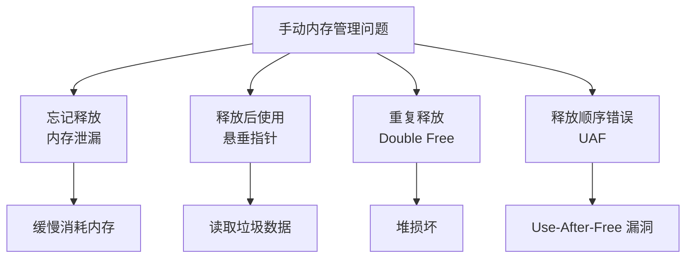
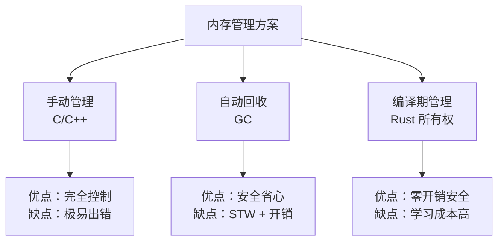
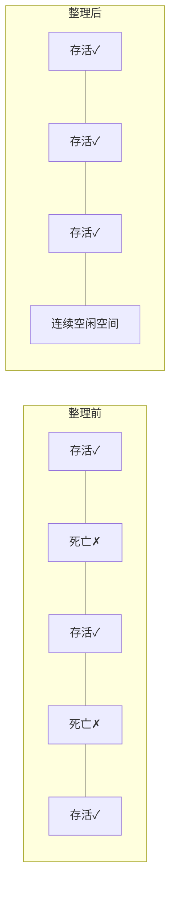
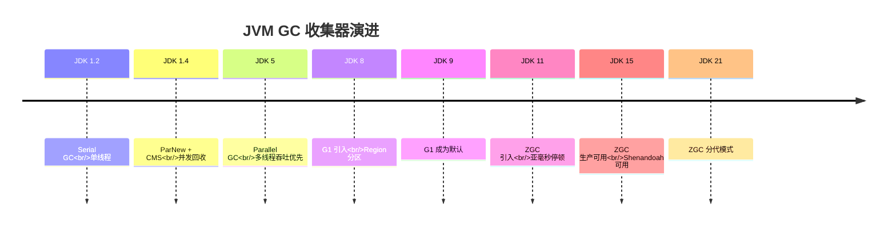
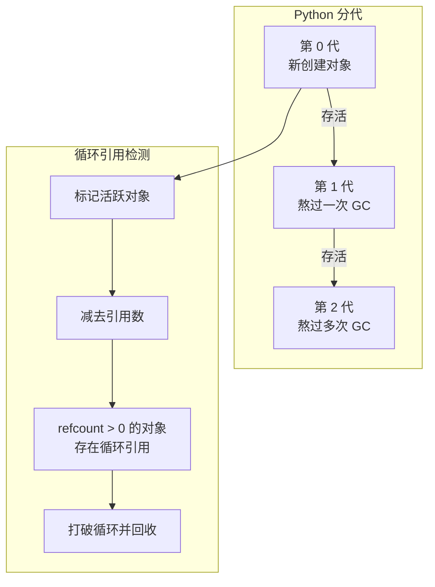

> **TL;DR**：垃圾回收（GC）是现代编程语言自动内存管理的核心机制。本文从为什么需要 GC 出发，系统梳理标记-清除、复制、标记-整理三大经典算法，深入分析 JVM 分代模型与主流收集器（G1/ZGC），讲解 Go 的三色标记并发 GC 和 Python 的引用计数+分代 GC，对比 Rust 所有权模型的零 GC 方案，最后讨论 STW 停顿问题与工程调优实践。

---

## 一、为什么需要垃圾回收

### 1.1 手动内存管理的三大灾难

```c
// C 语言手动内存管理
void process_data() {
    int* buffer = (int*)malloc(1000 * sizeof(int));
    // ... 处理数据 ...
    // free(buffer);  ← 如果忘了这行
}
// 内存泄漏：buffer 永远无法被回收
```

| 问题 | 描述 | 后果 |
|------|------|------|
| **内存泄漏（Memory Leak）** | 分配了内存但忘记释放 | 内存持续增长 → OOM |
| **悬垂指针（Dangling Pointer）** | 释放后继续访问 | 读取脏数据 / 程序崩溃 |
| **双重释放（Double Free）** | 同一块内存释放两次 | 未定义行为，常被用于安全攻击 |



### 1.2 手动 vs 自动 vs 编译期管理



| 维度 | C（手动） | Java（GC） | Rust（所有权） |
|------|----------|-----------|---------------|
| 内存释放时机 | 程序员决定 | 运行时 GC 决定 | 编译期确定 |
| 运行时开销 | 无 | GC 线程 + 写屏障 | 无 |
| 停顿（STW） | 无 | 有 | 无 |
| 类型安全 | 弱 | 强 | 强 |
| 学习曲线 | 平缓 | 平缓 | 陡峭 |

---

## 二、垃圾回收三大经典算法

### 2.1 标记-清除（Mark-Sweep）

最基础的 GC 算法，分为两个阶段：

```mermaid
graph TD
    subgraph 标记阶段
        A[从 GC Roots 出发] --> B[遍历所有可达对象]
        B --> C[标记为"存活"]
    end
    subgraph 清除阶段
        D[扫描整个堆] --> E[回收未标记对象]
        E --> F[清除存活对象的标记]
    end
    C --> D
```

```java
// Mark-Sweep 伪代码
void markSweep(Object[] roots, Object[] heap) {
    // 标记阶段：从根可达的对象打上标记
    for (Object root : roots) {
        if (root != null) mark(root);
    }
    
    // 清除阶段：回收未标记对象
    for (Object obj : heap) {
        if (obj != null && isMarked(obj)) {
            unmark(obj);  // 清除标记，为下次 GC 准备
        } else if (obj != null) {
            free(obj);    // 回收未标记对象
        }
    }
}
```

| 优点 | 缺点 |
|------|------|
| 实现简单 | 产生内存碎片 |
| 能处理循环引用 | 分配效率低（需维护空闲链表） |
| 不需要额外空间 | 扫描整个堆，效率与堆大小成正比 |

### 2.2 复制算法（Copying）

将堆分为两个等大的空间，每次只使用其中一个。GC 时将存活对象复制到另一个空间。

```mermaid
graph LR
    subgraph From 空间（使用中）
        A[对象1 ✓]
        B[对象2 ✗ 死亡]
        C[对象3 ✓]
        D[对象4 ✗ 死亡]
    end
    subgraph To 空间（空闲）
        E[对象1 ✓]
        F[对象3 ✓]
    end
    A -.复制.-> E
    C -.复制.-> F
```

| 优点 | 缺点 |
|------|------|
| 无内存碎片 | 空间利用率仅 50% |
| 分配极快（指针碰撞） | 复制开销与存活对象成正比 |
| 适合存活率低的场景 | 不适合老年代 |

### 2.3 标记-整理（Mark-Compact）

结合标记和整理的优点：先标记存活对象，再将它们向一端移动压缩。



| 优点 | 缺点 |
|------|------|
| 无碎片 | 移动对象需要更新所有引用 |
| 空间利用率高 | 耗时比标记-清除长 |
| 分配效率高（指针碰撞） | 实现复杂 |

### 2.4 三大算法对比

| 维度 | 标记-清除 | 复制 | 标记-整理 |
|------|----------|------|----------|
| 额外空间 | 无 | 2 倍 | 无 |
| 碎片化 | 严重 | 无 | 无 |
| 对象移动 | 否 | 是 | 是 |
| 时间复杂度 | O(堆大小) | O(存活对象) | O(堆大小 + 存活对象) |
| 适合分代 | 老年代 | 新生代 | 老年代 |

---

## 三、分代垃圾回收

### 3.1 分代假说

> **弱分代假说**：绝大多数对象都是朝生夕死的。
> **强分代假说**：熬过越多次 GC 的对象越不容易死亡。

统计数据表明：**约 98% 的对象在一次 GC 中就被回收**。这为分代回收提供了理论基础。

### 3.2 JVM 堆内存模型

```mermaid
graph TD
    subgraph JVM 堆内存
        subgraph 新生代（Young Gen）~1/3
            Eden[Eden 区 ~8/10<br/>新对象分配]
            S0[Survivor 0（From）~1/10]
            S1[Survivor 1（To）~1/10]
        end
        subgraph 老年代（Old Gen）~2/3
            Old[老年代<br/>长期存活对象]
        end
    end
    Eden -->|Minor GC| S0
    S0 -->|年龄+1 复制到| S1
    S1 -. 角色交换 .-> S0
    S0 -->|年龄 ≥ 15| Old
```

**Minor GC 流程**：

1. 新对象优先分配在 Eden 区
2. Eden 满时触发 Minor GC（Young GC）
3. Eden 中存活对象复制到 Survivor0
4. Survivor0 中存活对象复制到 Survivor1（年龄+1）
5. Survivor0 和 Survivor1 角色互换
6. 对象年龄达到阈值（默认 15）时晋升老年代
7. 大对象（如大数组）直接分配在老年代

### 3.3 对象晋升策略

| 条件 | 行为 |
|------|------|
| 年龄 ≥ MaxTenuringThreshold | 晋升到老年代 |
| Survivor 空间不足 | 担保晋升——直接放入老年代 |
| 大对象 | 直接进入老年代（避免大量复制） |
| 动态年龄判断 | Survivor 中同龄对象总大小超过 Survivor 空间一半，比其年龄大的全部晋升 |

---

## 四、JVM GC 收集器全景

### 4.1 收集器演进



### 4.2 主要收集器详解

#### Serial GC

单线程收集器，适合单核或小内存应用。

```
-XX:+UseSerialGC
```

#### Parallel GC

多线程收集器，追求**最大吞吐量**。

```
-XX:+UseParallelGC
-XX:MaxGCPauseMillis=100  # 目标停顿时间（JDK 8u131+）
```

#### CMS（Concurrent Mark-Sweep）

以**最小停顿**为目标的并发收集器，JDK 9 标记为废弃。


**CMS 的问题**：内存碎片、浮动垃圾、并发失败时降级为 Serial Old。

#### G1（Garbage-First）

将堆划分为多个 Region，优先回收垃圾最多的区域。

```mermaid
graph TD
    subgraph G1 堆 = Region 集合
        R1[E] --> R2[S] --> R3[O] --> R4[E]
        R5[O] --> R6[H] --> R7[空] --> R8[S]
    end
    R6 -. 大对象 .-> R6
    style R6 fill:#f96
```

- **E** = Eden Region
- **S** = Survivor Region
- **O** = Old Region
- **H** = Humongous Region（大对象，占 ≥ 50% Region 大小）

```bash
# G1 关键参数
-XX:+UseG1GC
-XX:MaxGCPauseMillis=200           # 目标最大停顿
-XX:G1HeapRegionSize=16m           # Region 大小（1~32MB，2的幂）
-XX:InitiatingHeapOccupancyPercent=45  # 触发并发标记的阈值
```

#### ZGC（Z Garbage Collector）

JDK 11 引入，目标是将 GC 停顿控制在 **10ms 以内**。

| 技术 | 作用 |
|------|------|
| **染色指针** | 64 位指针的高 4 位存储标记状态，无需额外数据结构 |
| **读屏障（Load Barrier）** | 加载对象引用时自动修正指针 |
| **并发转移** | 对象移动与应用线程并发执行 |
| **多重映射** | 同一物理内存映射到多个虚拟地址，颜色切换只需改映射 |

```
ZGC 停顿时间（JDK 15+）：
- 标记结束 STW：< 1ms
- 转移开始 STW：< 1ms  
- 转移结束 STW：< 1ms
```

### 4.3 G1 vs ZGC 对比

| 维度 | G1 | ZGC |
|------|-----|-----|
| 设计目标 | 平衡吞吐和延迟 | 极低延迟 |
| 停顿时间 | < 200ms | < 10ms |
| STW 阶段数 | 较多 | 极少（3 次 < 1ms） |
| 适合堆大小 | 4GB ~ 64GB | 8GB ~ TB 级 |
| 吞吐量 | 较高 | 略低（读屏障开销 ~1%） |
| JDK 版本 | JDK 9+ 默认 | JDK 15+ 生产可用 |
| 实现复杂度 | 中 | 高 |

---

## 五、Go 语言的 GC

### 5.1 三色标记并发 GC

Go 使用**并发三色标记-清除**算法，不分代。

```mermaid
stateDiagram-v2
    [*] --> 白色: 所有对象初始为白色
    白色 --> 灰色: 被扫描到但子对象未处理
    灰色 --> 黑色: 子对象全部处理完毕
    黑色 -. 引用白色 .-> 灰色: 写屏障拦截
```

- **白色**：未被访问，GC 结束仍为白色则被回收
- **灰色**：已被发现，但其引用的对象尚未全部扫描
- **黑色**：已扫描完毕，所有引用对象都已处理

### 5.2 写屏障与三色不变性

并发标记时，应用线程可能破坏三色不变性。Go 使用**混合写屏障**（Go 1.8+）：

```go
// 混合写屏障（伪代码）
func writePointer(slot *uintptr, ptr uintptr) {
    shade(*slot)  // 删除屏障：将旧值标记为灰色
    shade(ptr)    // 插入屏障：将新值标记为灰色
    *slot = ptr
}
```

### 5.3 Go GC 调优

```go
// GOGC 默认 100，表示堆增长 100% 时触发 GC
// GOGC=200 → 堆增长 200% 才触发 GC
// GOGC=off → 手动触发 GC

// Go 1.19+ 推荐用 GOMEMLIMIT 替代 GOGC
import "runtime/debug"

func init() {
    // 设置内存硬限制，GC 自动调整频率
    debug.SetMemoryLimit(1 << 30) // 1GB
}
```

---

## 六、Python 的 GC

Python 使用**引用计数为主 + 分代 GC 为辅**的双层机制。

### 6.1 引用计数

```python
import sys

a = [1, 2, 3]
print(sys.getrefcount(a) - 1)  # 1（getrefcount 本身多一个引用）

b = a
print(sys.getrefcount(a) - 1)  # 2

del b
print(sys.getrefcount(a) - 1)  # 1 → 归零时立即回收
```

**问题：循环引用**

```python
class Node:
    def __init__(self):
        self.ref = None

a = Node()
b = Node()
a.ref = b
b.ref = a  # 循环引用！

del a
del b
# 两个对象 refcount 都是 1，但已经不可达 → 内存泄漏
```

### 6.2 分代 GC 处理循环引用



| 参数 | 默认值 | 说明 |
|------|--------|------|
| 阈值 | (700, 10, 10) | 各代触发 GC 的对象数量阈值 |
| gc.collect() | - | 手动触发完整 GC |

```python
import gc

# 查看统计
print(gc.get_count())    # 当前各代对象数
print(gc.get_threshold()) # 阈值
print(gc.get_stats())    # 各代收集统计

# 手动触发
gc.collect()
```

---

## 七、Rust 所有权模型——编译期的零 GC 方案

### 7.1 所有权三大规则

1. 每个值有且只有一个**所有者（Owner）**
2. 同一时刻只能有一个所有者
3. 所有者离开作用域时，值被自动释放（`drop`）

```rust
fn main() {
    let s1 = String::from("hello");
    let s2 = s1;        // 所有权转移（move）
    // println!("{}", s1); // 编译错误！s1 已无效
    println!("{}", s2);   // OK
} // s2 离开作用域，内存自动释放
```

### 7.2 借用规则

```rust
fn main() {
    let mut s = String::from("hello");
    
    let r1 = &s;        // 不可变借用（可多个）
    let r2 = &s;        // 再来一个不可变借用
    // let r3 = &mut s; // ❌ 不能同时有不可变和可变借用
    
    println!("{} {}", r1, r2); // r1, r2 最后使用点
    
    let r3 = &mut s;    // ✅ 现在可以可变借用了
    r3.push_str(" world");
} // r3 离开作用域，s 离开作用域，内存释放
```

### 7.3 所有权 vs GC

| 维度 | Rust 所有权 | GC（Java/Go） |
|------|-----------|-------------|
| 内存安全保证 | 编译期 | 运行时 |
| 运行时开销 | 零 | GC 线程、写屏障 |
| 停顿（STW） | 无 | 有 |
| 循环引用处理 | 编译期防止（Rc + Weak） | 运行时检测 |
| 编程心智负担 | 高（需理解所有权） | 低 |
| 适合场景 | 系统编程、高性能服务 | 业务应用、快速开发 |

---

## 八、GC 停顿（STW）与低延迟方案

### 8.1 什么是 STW？

STW（Stop-The-World）：GC 执行期间，暂停所有应用线程。这是 GC 语言中**延迟的根源**。

```mermaid
gantt
    title GC 停顿时间线
    dateFormat SSS
    axisFormat %L ms
    
    section 应用线程
    运行中 :a1, 000, 500
    STW 停顿 :crit, a2, 500, 50
    运行中 :a3, 550, 500
    
    section GC 线程
    初始标记 :crit, 480, 20
    并发标记 : 500, 400
    重新标记 :crit, 520, 15
    并发清除 : 535, 350
    转移 :crit, 545, 5
```



### 8.2 降低 STW 的核心策略

| 策略 | 原理 | 代表实现 |
|------|------|---------|
| **并发标记** | 与应用线程并行标记 | CMS, G1, ZGC |
| **并发转移** | 对象移动与应用线程并发 | ZGC, Shenandoah |
| **染色指针** | 在指针中存标记，避免额外遍历 | ZGC |
| **分代隔离** | 只扫描新生代（小空间） | G1 年轻代 GC |
| **增量收集** | 将 GC 工作分散到多个短停顿中 | 早期 CMS |
| **消除 GC** | 编译期管理内存 | Rust |

---

## 九、面试 Q&A

### Q1：为什么 JVM 新生代用复制算法而老年代用标记-整理？

**答**：新生代对象存活率极低（约 2%），复制算法只需复制少量存活对象，效率高。浪费 50% 空间是可接受的（新生代本身较小）。老年代存活率高，复制算法需要复制大量对象，效率低且浪费空间大，因此使用标记-整理。

### Q2：ZGC 的染色指针是如何工作的？为什么能降低停顿？

**答**：ZGC 利用 64 位地址空间未使用的 4 位高位来存储对象的标记状态（颜色），不需要额外的标记位图或数据结构。当加载对象引用时，读屏障自动修正指针颜色。这种方式避免了遍历整个堆来标记对象，所有标记和转移操作都可以并发执行，STW 时间仅需 < 1ms 的同步操作。

### Q3：Go 为什么不分代 GC？

**答**：Go 团队认为分代假说在 Go 的使用场景中收益有限，且分代 GC 需要写屏障（Go 已有混合写屏障），实现复杂度大幅增加。Go 选择追求**简单和低延迟**，三色标记配合混合写屏障 + GOMEMLIMIT 已经能满足大部分场景。不过社区一直在讨论分代 GC 的可能性。

### Q4：如何排查 GC 导致的性能问题？

**答**：
1. 开启 GC 日志：`-Xlog:gc*:file=gc.log:time,uptime,level,tags`
2. 用 GCEasy/GCViewer 分析日志，看停顿时间、频率、吞吐量
3. 用 `jstat -gcutil <pid> 1000` 实时观察各代使用率
4. 频繁 Full GC → 检查是否老年代空间不足或内存泄漏
5. 用 Arthas `dashboard` / `profiler` 在线诊断

### Q5：Python 的引用计数和 GC 的关系是什么？

**答**：Python 以引用计数为主（对象引用归零时立即回收），分代 GC 为后备（处理循环引用）。两者是互补关系，不是替代关系。引用计数处理大部分正常场景，分代 GC 定期扫描不可达的循环引用链。

### Q6：如何选择 GC 算法？

**答**：
- **追求最大吞吐量**：Parallel GC（JDK 8 默认）
- **平衡吞吐和延迟**：G1（JDK 9+ 默认）
- **极低延迟（< 10ms）**：ZGC（JDK 15+，推荐 JDK 21+）
- **小堆/低资源环境**：Serial GC
- **零 GC 开销**：Rust（无 GC）

---

## 总结

垃圾回收是编程语言在**安全性**与**性能**之间做权衡的经典案例。从最简单的标记-清除到精密的 ZGC 并发转移，从运行时自动回收到编译期静态确定——每种方案都有自己的适用场景。理解 GC 的原理不是为了成为调优专家，而是为了在遇到性能问题时，能做出正确的判断和选择。
