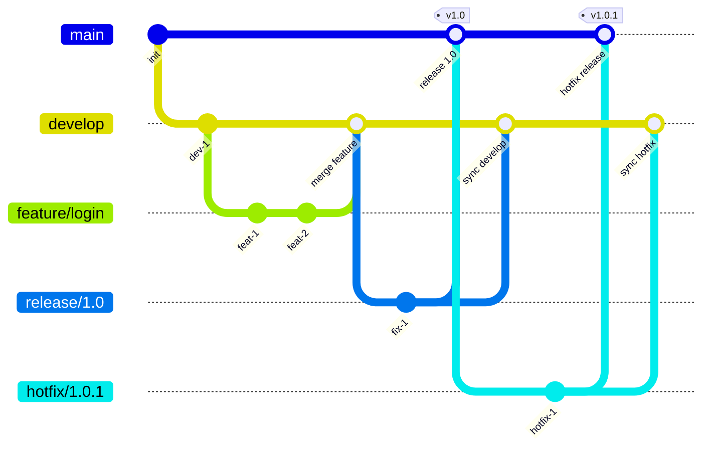
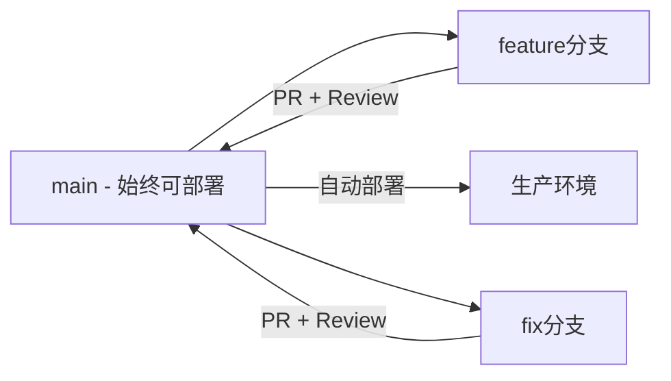
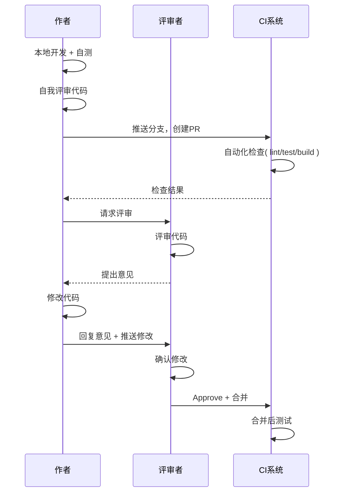
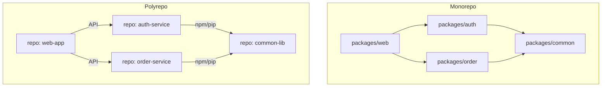
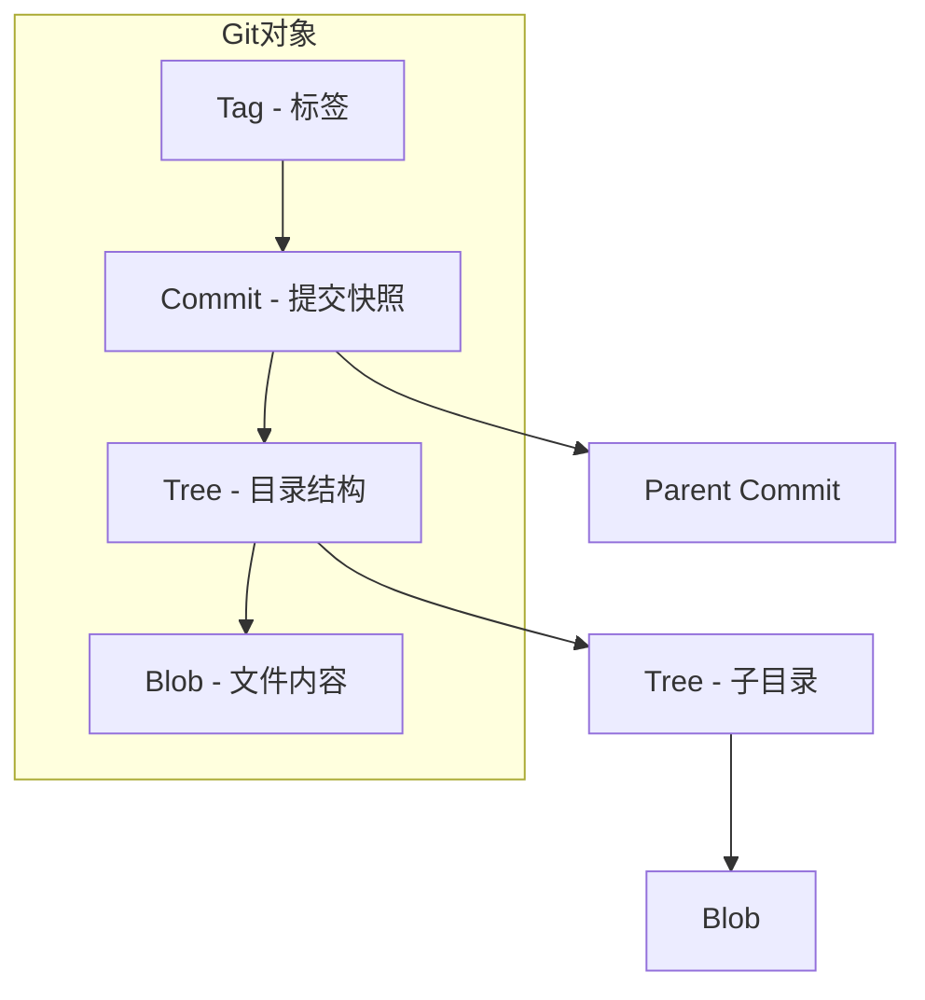
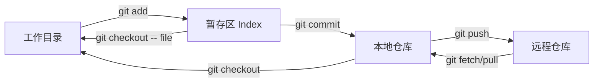
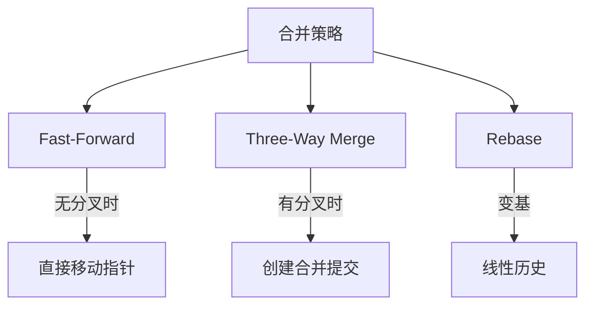

## Git工作流与协作：团队效率的隐形基础设施

版本控制不仅是代码管理工具，更是团队协作的沟通协议。选择合适的 Git 工作流、建立规范的代码评审机制，对团队效率的影响远超任何框架和工具。

## Git 分支模型

### GitFlow

GitFlow 是最经典的分支模型，适合有明确版本发布周期的项目。



| 分支 | 生命周期 | 来源 | 合并到 | 用途 |
|------|---------|------|--------|------|
| main | 永久 | - | - | 生产代码 |
| develop | 永久 | - | - | 开发集成分支 |
| feature/* | 临时 | develop | develop | 功能开发 |
| release/* | 临时 | develop | main + develop | 发布准备 |
| hotfix/* | 临时 | main | main + develop | 紧急修复 |

### GitHub Flow

GitHub Flow 极其简洁，适合持续部署的项目。



**核心原则：main 分支始终可部署，所有修改通过 PR 合入。**

### Trunk Based Development

主干开发是 Google、Facebook 等大厂采用的模式，强调频繁向主干提交。

```mermaid
graph TB
    Trunk[main/trunk] -->|每日多次提交| T1[提交1]
    Trunk --> T2[提交2]
    Trunk --> T3[提交3]

    subgraph 短命分支 < 1天
        FB[feature-branch]
    end

    FB -->|快速PR| Trunk

    subgraph 功能开关
        T1 --> FF1[Feature Flag]
        T2 --> FF2[Feature Flag]
    end
```

### 三种模型对比

| 维度 | GitFlow | GitHub Flow | Trunk Based |
|------|---------|-------------|-------------|
| 复杂度 | 高 | 低 | 低 |
| 分支数量 | 多 | 少 | 极少 |
| 发布方式 | 版本发布 | 持续部署 | 持续部署 |
| 适用团队 | 有版本周期的团队 | 开源/中小团队 | 高成熟度团队 |
| 功能开关 | 不需要 | 可选 | 必须 |
| 集成频率 | 低（按feature） | 中（按PR） | 高（每日多次） |
| 冲突风险 | 高 | 中 | 低 |

## 代码评审最佳实践

代码评审（Code Review）不仅是发现 Bug，更是知识共享和代码质量保障的核心机制。

### 评审流程



### 评审检查清单

| 类别 | 检查项 |
|------|--------|
| 正确性 | 逻辑是否正确？边界条件是否处理？ |
| 安全性 | 是否有注入风险？敏感数据是否暴露？ |
| 性能 | 是否有N+1查询？是否有不必要的循环？ |
| 可读性 | 命名是否清晰？逻辑是否自解释？ |
| 设计 | 是否符合SOLID？是否过度设计？ |
| 测试 | 是否有单元测试？测试覆盖关键路径？ |
| 一致性 | 是否符合项目编码规范？ |

### 评审文化

```java
// ❌ 不好的评审意见
// "这段代码写得不好，重写"
// "为什么要这样写？"
// "LGTM" (没有实质内容)

// ✅ 好的评审意见
// "这里用 Stream.filter().findFirst() 替代 for 循环会更清晰，你觉得呢？"
// "这个方法有 SQL 注入风险，建议使用参数化查询，参考：[链接]"
// "这个逻辑和 XxxService.process() 类似，考虑提取公共方法？"
```

### 评审效率优化

| 实践 | 说明 |
|------|------|
| PR 小而专注 | 每个PR不超过400行变更 |
| 自动化前置 | lint/test 必须通过才能请求评审 |
| 自我评审先行 | 推送前自己先过一遍diff |
| 限时评审 | 24小时内完成评审 |
| 评审者轮换 | 避免知识孤岛 |

## Commit 规范（Conventional Commits）

规范的 Commit 信息是自动化工具链（CHANGELOG、语义版本）的基础。

### 规范格式

```
<type>(<scope>): <subject>

<body>

<footer>
```

### Type 定义

| Type | 说明 | 语义版本 |
|------|------|---------|
| feat | 新功能 | MINOR |
| fix | Bug修复 | PATCH |
| docs | 文档变更 | - |
| style | 格式调整（不影响逻辑） | - |
| refactor | 重构（非新功能非修复） | - |
| perf | 性能优化 | PATCH |
| test | 测试相关 | - |
| build | 构建系统或依赖 | - |
| ci | CI配置 | - |
| chore | 其他杂项 | - |
| revert | 回滚 | - |

### Commit 示例

```
feat(order): 支持订单批量导出功能

- 新增 OrderExportService 处理批量导出逻辑
- 支持CSV和Excel两种导出格式
- 大数据量导出使用流式写入避免OOM

Closes #1234
```

```
fix(auth): 修复Token过期后刷新失败的问题

当Access Token过期且Refresh Token有效时，
并发请求会导致多次刷新，其中部分请求会收到401。

- 使用分布式锁保证只刷新一次
- 其他请求等待刷新完成后使用新Token

Fixes #5678
```

### 自动化工具链

```yaml
# commitlint + husky 配置
# .commitlintrc.yml
extends:
  - '@commitlint/config-conventional'
rules:
  type-enum:
    - 2
    - always
    - - feat
      - fix
      - docs
      - style
      - refactor
      - perf
      - test
      - build
      - ci
      - chore
  subject-max-length:
    - 2
    - always
    - 72
```

```bash
# standard-version 自动生成 CHANGELOG
npx standard-version --release-as minor

# 基于commit信息自动确定版本号
# feat → MINOR, fix → PATCH, feat!/fix! → MAJOR
```

## Monorepo vs Polyrepo

### 架构对比



| 维度 | Monorepo | Polyrepo |
|------|----------|----------|
| 代码共享 | 直接引用 | 发布包（npm/PyPI） |
| 原子提交 | 跨模块原子提交 | 无法跨仓库原子提交 |
| 构建速度 | 增量构建（Nx/Turborepo） | 各仓库独立构建 |
| 权限控制 | 目录级权限（CODEOWNERS） | 仓库级权限 |
| CI/CD | 统一流水线 | 各仓库独立流水线 |
| 学习成本 | 低（一个仓库） | 高（多仓库切换） |
| 仓库体积 | 大 | 小 |
| 适用规模 | 中大型团队 | 小团队/开源项目 |

### Monorepo 工具链

```json
// Turborepo 配置 - turbo.json
{
  "$schema": "https://turbo.build/schema.json",
  "pipeline": {
    "build": {
      "dependsOn": ["^build"],
      "outputs": ["dist/**", ".next/**"]
    },
    "test": {
      "dependsOn": ["build"],
      "outputs": []
    },
    "lint": {
      "outputs": []
    },
    "dev": {
      "cache": false,
      "persistent": true
    }
  }
}
```

```yaml
# Nx 配置 - nx.json
{
  "targetDefaults": {
    "build": {
      "dependsOn": ["^build"],
      "inputs": ["production", "^production"]
    },
    "test": {
      "inputs": ["default", "^production"]
    }
  },
  "affected": {
    "defaultBase": "main"
  }
}
```

## Git 内部原理

理解 Git 内部原理，才能理解 Git 的行为和最佳实践。

### Git 对象模型



```bash
# Git 对象的 SHA-1 计算
# echo "hello" | git hash-object --stdin
# ce013625030ba8dba906f756967f9e9ca394464a

# 查看对象内容
git cat-file -p <hash>

# 查看对象类型
git cat-file -t <hash>
# blob / tree / commit / tag
```

### Git 存储结构

```
.git/
├── HEAD              # 当前分支引用
├── config            # 仓库配置
├── objects/          # 对象数据库
│   ├── pack/         # 打包压缩的对象
│   ├── ab/           # 前2位为目录名
│   │   └── c1234...  # 后38位为文件名
│   └── ...
├── refs/             # 引用
│   ├── heads/        # 分支
│   │   ├── main
│   │   └── develop
│   ├── tags/         # 标签
│   └── remotes/      # 远程引用
│       └── origin/
└── index             # 暂存区
```

### 三个区域



| 区域 | 说明 | 命令 |
|------|------|------|
| 工作目录 | 本地文件系统 | 编辑文件 |
| 暂存区 | 下次提交的快照 | `git add` / `git reset` |
| 本地仓库 | 所有提交历史 | `git commit` |
| 远程仓库 | 共享仓库 | `git push` / `git fetch` |

### Git 合并策略



| 策略 | 命令 | 历史 | 适用场景 |
|------|------|------|---------|
| Fast-Forward | `git merge --ff-only` | 线性 | main接收feature |
| Three-Way | `git merge --no-ff` | 保留分叉 | 重要合并 |
| Rebase | `git rebase` | 线性 | 清理本地提交 |
| Squash | `git merge --squash` | 压缩为一个 | feature→main |

### 常见问题与解决

```bash
# 1. 撤销最后一次提交（保留修改）
git reset --soft HEAD~1

# 2. 撤销最后一次提交（丢弃修改）
git reset --hard HEAD~1

# 3. 修改最后一次提交信息
git commit --amend -m "new message"

# 4. 交互式rebase（整理提交历史）
git rebase -i HEAD~3
# pick abc1234 feat: add login
# squash def5678 fix: login bug
# reword ghi9012 feat: add logout

# 5. cherry-pick（选择特定提交）
git cherry-pick abc1234

# 6. 暂存工作区修改
git stash
git stash pop

# 7. 查找引入bug的提交
git bisect start
git bisect bad HEAD
git bisect good v1.0
# Git自动二分查找
```

## 面试 Q&A

**Q1：GitFlow 和 Trunk Based Development 如何选择？**

A：核心判断标准是**发布频率**和**团队成熟度**。GitFlow 适合有明确版本发布周期（如每月/每季度）的项目，需要维护多个版本。Trunk Based 适合持续部署（每天多次发布）的项目，要求团队能力成熟（小步提交、功能开关、自动化测试完善）。

**趋势是向 Trunk Based 演进**——Google、Meta、Netflix 都采用主干开发。

迁移路径：先从 GitFlow 简化为 GitHub Flow（去掉 release 分支），再逐步缩短 feature 分支生命周期，最终实现主干开发。

**Q2：如何处理代码评审中的分歧？**

A：三级决策机制：(1) **技术讨论**：评审者和作者在 PR 中充分讨论，用代码和测试说话；

(2) **设计评审**：如果是架构级分歧，升级为设计文档评审（RFC/Design Doc），让更多团队成员参与决策；

(3) **技术负责人裁决**：最终由技术负责人根据项目约束做出决定。

原则：**风格偏好让步于一致性，性能优化让步于可读性（除非有性能瓶颈），个人偏好让步于团队规范**。

评审者应该提出建议而非命令，用"你觉得这样如何"而非"你必须这样改"。

**Q3：Monorepo 的构建性能如何优化？**

A：三大策略：(1) **增量构建**：只构建变更影响的项目。Nx 和 Turborepo 通过依赖图分析，自动识别受影响的项目（`nx affected --target=build`）；

(2) **远程缓存**：相同的输入（源码+配置+环境）产生相同的输出，可以缓存和共享构建结果。Turborepo 支持远程缓存，团队内一人构建后其他人直接复用；

(3) **并行执行**：Nx/Turborepo 自动并行化无依赖的任务。

效果：Google 的 Monorepo 有数十亿行代码，通过增量构建和分布式执行，平均构建时间控制在分钟级。

**Q4：git rebase 和 git merge 有什么区别？什么时候用哪个？**

A：merge 保留完整历史（创建合并提交），rebase 重写历史（线性化）。

**原则：公共分支用 merge，私有分支用 rebase**。

(1) `git merge --no-ff`：feature 分支合入 main，保留分支历史，方便回溯；

(2) `git rebase`：本地 feature 分支同步 main 的更新，保持线性历史，避免无意义的合并提交；

(3) **永远不要 rebase 已推送的公共分支**——会导致其他人的提交历史混乱。`git pull --rebase` 优于 `git pull`，避免产生无意义的合并提交。

**Q5：如何写好 Commit Message？**

A：好的 Commit Message 回答三个问题：**为什么改？

改了什么？

影响范围？

** 遵循 Conventional Commits 规范：(1) **type** 必须准确——feat/fix/refactor 性质不同，影响语义版本号；

(2) **subject** 用祈使句（"add feature" 而非 "added feature"），不超过72字符；

(3) **body** 解释 why 而非 what——diff 已经展示了 what，body 应该解释为什么需要这个变更；

(4) **footer** 关联 Issue（`Closes #123`）和破坏性变更（`BREAKING CHANGE: ...`）。

工具保障：commitlint + husky 在提交时自动校验格式。

<div class='context-nav'>
<a class='context-link prev disabled'><span class='context-label'>上一篇</span><span class='context-title'>暂无</span></a>
<a class='context-link next' href='/software-fundamentals/posts/DevOps-容器化与Kubernetes/'><span class='context-label'>下一篇</span><span class='context-title'>DevOps - 容器化与Kubernetes</span></a>
</div>
