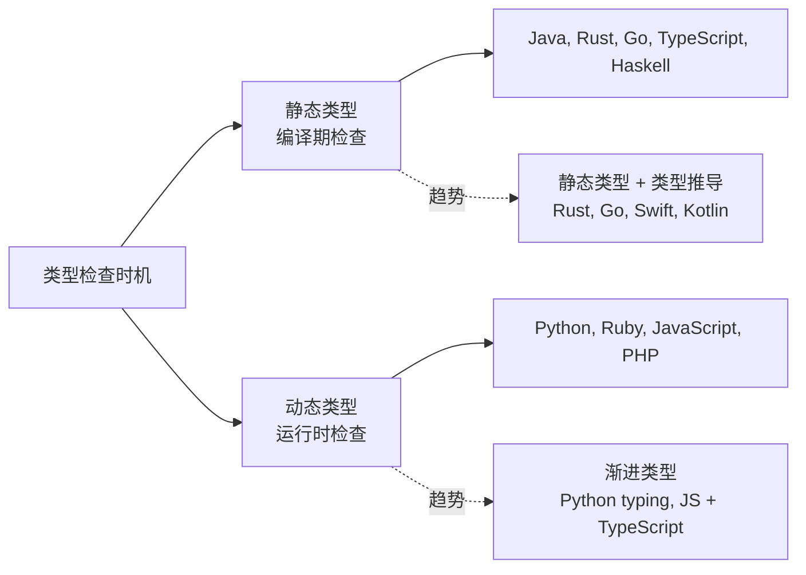
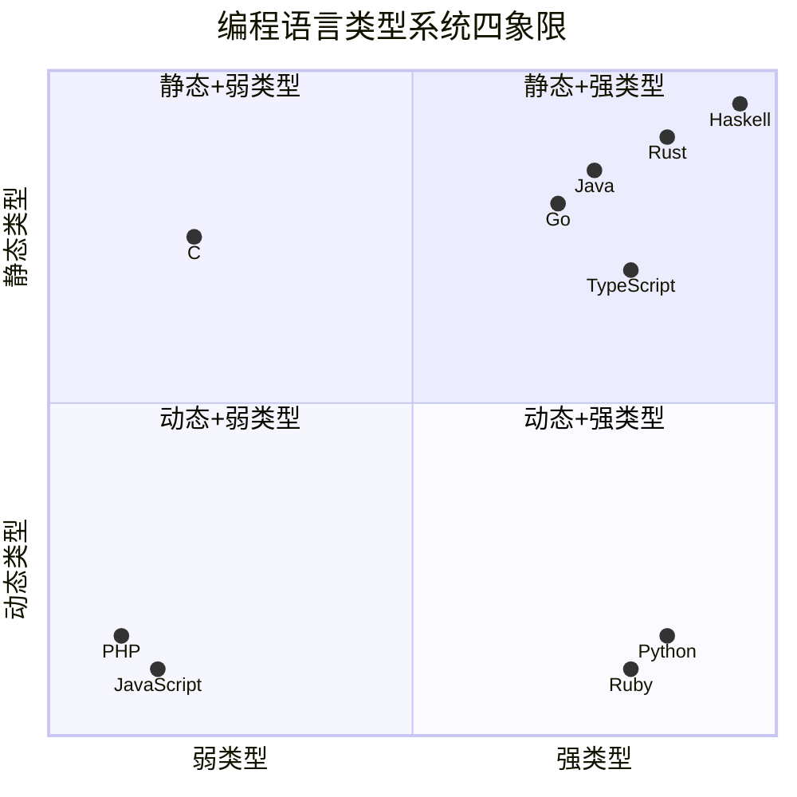
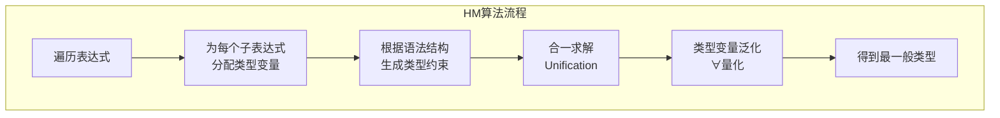
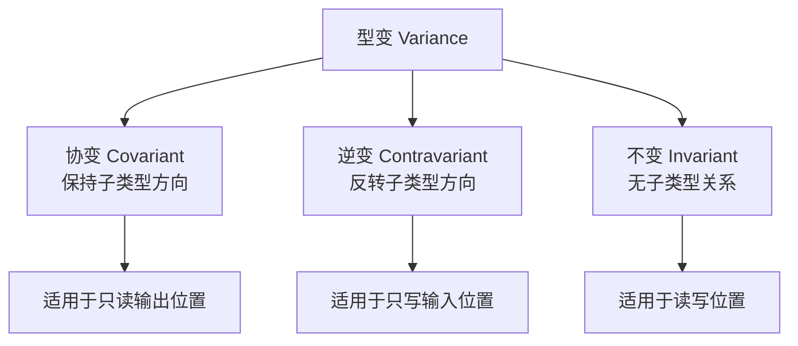
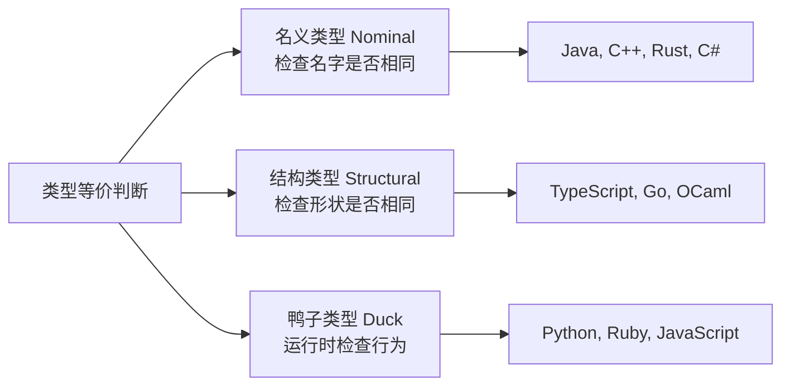

> **TL;DR**：类型系统是编程语言最核心的抽象机制之一。本文从强/弱类型、静/动态类型的基础分类出发，深入讲解 Hindley-Milner 类型推导、泛型与型变、代数数据类型（ADT），并对比 TypeScript/Rust/Haskell 三大语言的类型系统设计，最后讨论类型驱动开发的工程实践。

---

## 一、类型系统的两大维度

### 1.1 静态类型 vs 动态类型

区分维度：**类型检查发生在什么时候？**



**静态类型语言**在编译时就能发现类型不匹配的错误：

```rust
// Rust —— 编译期就报错
fn add(a: i32, b: &str) -> i32 {
    a + b  // 编译错误：cannot add `&str` to `i32`
}
```

**动态类型语言**要到运行时才能发现：

```python
# Python —— 运行时才暴露
def add(a, b):
    return a + b

add(1, "hello")  # TypeError: unsupported operand type(s) for +: 'int' and 'str'
```

| 维度 | 静态类型 | 动态类型 |
|------|----------|----------|
| 类型检查时机 | 编译期 | 运行时 |
| 错误发现速度 | 早（编译即发现） | 晚（运行才暴露） |
| 代码简洁性 | 需要类型标注 | 更灵活 |
| IDE 支持 | 强（自动补全/跳转/重构） | 弱 |
| 重构安全性 | 编译器兜底 | 全靠测试 |
| 运行时性能 | 通常更快 | 通常更慢 |
| 适合场景 | 大型项目、团队协作 | 快速原型、脚本 |

### 1.2 强类型 vs 弱类型

区分维度：**语言是否允许隐式类型转换？**

```javascript
// JavaScript（弱类型）—— 隐式转换的"惊喜"
console.log("3" - 2);       // 1  （字符串被隐式转为数字）
console.log("3" + 2);       // "32"（数字被隐式转为字符串）
console.log("3" * "2");     // 6   （两个字符串相乘？）
console.log([] == false);   // true
console.log(null == undefined); // true
console.log(0 == false);    // true
console.log(0 === false);   // false（严格相等）
```

```haskell
-- Haskell（强类型）—— 拒绝任何隐式转换
-- "3" + 2  -- 编译错误：无法将 Num 和 [Char] 相加
3 + 2  -- 必须显式保证类型一致
```

| 维度 | 强类型 | 弱类型 |
|------|--------|--------|
| 隐式转换 | 极少或没有 | 大量存在 |
| 类型安全 | 高 | 低 |
| 代码可预测性 | 高 | 低 |
| 代表语言 | Python, Java, Haskell, Rust | JavaScript, C, PHP |

### 1.3 四象限全景



---

## 二、类型推导（Type Inference）

### 2.1 什么是类型推导？

类型推导让编译器在不显式标注的情况下自动确定类型，兼顾静态类型的安全和动态类型的简洁。

```rust
// Rust 类型推导
let x = 42;           // 推导为 i32
let y = 3.14;         // 推导为 f64
let name = "hello";   // 推导为 &str
let nums = vec![1, 2]; // 推导为 Vec<i32>
```

```typescript
// TypeScript 类型推导
const x = 42;          // 推导为 number
const name = "hello";  // 推导为 string
const list = [1, 2, 3]; // 推导为 number[]
```

### 2.2 Hindley-Milner 算法

Hindley-Milner（HM）是函数式语言中经典的类型推导算法，也是 ML 系语言（ML, Haskell, OCaml）类型系统的基石。

**核心思想**：通过收集类型约束，用**合一（Unification）**算法求解最一般类型（Principal Type）。



**推导示例**——恒等函数 `\x -> x`：

1. 给 `x` 分配类型变量 `α`
2. 函数体 `x` 的类型也是 `α`
3. 所以整个函数的类型是 `α → α`
4. 泛化后得到 `∀α. α → α`

```haskell
-- Haskell 中 HM 推导结果
id :: forall a. a -> a
id x = x

-- 使用 id 时自动实例化
id 42       -- 实例化为 Int -> Int
id "hello"  -- 实例化为 String -> String
```

**HM 的关键性质**：

| 性质 | 说明 |
|------|------|
| 完备性 | 如果表达式有类型，HM 一定能推导出来 |
| 主类型（Principal Type） | 推导出的类型是最一般的，所有其他类型都是它的特例 |
| 可判定性 | 推导过程必定在有限步内终止 |

**HM 的局限**：

- 不支持高阶多态（Higher-rank polymorphism）
- 不支持子类型（Subtyping）
- 在 ML 语言中需要值限制（Value Restriction）来防止引用多态破坏类型安全

---

## 三、泛型与型变（Variance）

### 3.1 泛型的本质

泛型（Generics / Parametric Polymorphism）允许编写与具体类型无关的通用代码。

```java
// Java 泛型
class Box<T> {
    private T value;
    public Box(T value) { this.value = value; }
    public T get() { return value; }
}
```

```rust
// Rust 泛型 + Trait Bound
struct Container<T: Display> {
    value: T,
}

impl<T: Display> Container<T> {
    fn show(&self) {
        println!("{}", self.value);
    }
}
```

### 3.2 型变：类型安全的子类型关系

型变描述了**复合类型的子类型关系**如何由其**组成类型的子类型关系**决定。



假设 `Cat <: Animal <: Object`（Cat 是 Animal 的子类型）：

| 型变类型 | 规则 | 示例 | 直觉解释 |
|---------|------|------|---------|
| **协变** | `A <: B → F<A> <: F<B>` | `List<Cat> <: List<Animal>` | 只读容器可以协变 |
| **逆变** | `A <: B → F<B> <: F<A>` | `Func<Animal> <: Func<Cat>` | 函数参数可以逆变 |
| **不变** | 无子类型关系 | `MutableList<Cat>` ≠ `MutableList<Animal>` | 可变容器必须不变 |

**为什么可变容器必须不变？**

如果 `MutableList<Cat> <: MutableList<Animal>`，那么：

```java
MutableList<Cat> cats = new MutableList<>();
cats.add(new Cat());
MutableList<Animal> animals = cats;  // 假设允许协变
animals.add(new Dog());             // 通过 Animal 引用插入 Dog
Cat c = cats.get(1);               // ClassCastException！类型安全被破坏
```

### 3.3 Java 通配符与 PECS 原则

Java 用通配符 `? extends` 和 `? super` 精确控制型变：

```java
// PECS: Producer Extends, Consumer Super

// ? extends Number —— 协变，只能读不能写
public double sum(List<? extends Number> nums) {
    double total = 0;
    for (Number n : nums) {
        total += n.doubleValue(); // ✅ 可以读为 Number
    }
    // nums.add(1);  // ❌ 编译错误：不能写入
    return total;
}

// ? super Integer —— 逆变，只能写不能读
public void addInts(List<? super Integer> list) {
    list.add(1);   // ✅ 可以写入 Integer
    list.add(42);  // ✅
    // Integer x = list.get(0);  // ❌ 只能读取为 Object
}
```

---

## 四、代数数据类型（ADT）

### 4.1 代数与类型的对应关系

ADT 的名称"代数"来自类型与数学代数之间的深刻对应：

| 类型构造 | 代数运算 | 可能值数量 | 示例 |
|---------|---------|-----------|------|
| 积类型（Product） | 乘法 `A × B` | `|A| × |B|` | 结构体、元组、记录 |
| 和类型（Sum） | 加法 `A + B` | `|A| + |B|` | 枚举、联合类型 |
| 单元类型 | 1 | 1 | `()`、`void` |
| 空类型 | 0 | 0 | `never`、`Void` |
| 函数类型 | 指数 `B^A` | `|B|^|A|` | `A → B` |

### 4.2 积类型（Product Type）

```rust
// Rust 结构体 = 积类型
struct Point {
    x: f64,  // 无穷多值
    y: f64,  // 无穷多值
}
// 总可能值 = ∞ × ∞ = ∞

// 有限值的例子
enum Bool { True, False }        // 2 个值
enum Direction { N, S, E, W }    // 4 个值
struct Config { active: Bool, dir: Direction } // 2 × 4 = 8 种组合
```

### 4.3 和类型（Sum Type）

```haskell
-- Haskell 中的和类型
data Shape
    = Circle Double             -- 圆（一个参数）
    | Rectangle Double Double   -- 矩形（两个参数）
    | Triangle Double Double Double  -- 三角形

-- 模式匹配：编译器保证穷尽性
area :: Shape -> Double
area (Circle r)       = pi * r * r
area (Rectangle w h)  = w * h
area (Triangle a b c) = 
    let s = (a + b + c) / 2
    in sqrt (s * (s - a) * (s - b) * (s - c))
```

```rust
// Rust 的 enum 就是和类型
enum Option<T> {
    Some(T),
    None,
}

enum Result<T, E> {
    Ok(T),
    Err(E),
}
```

### 4.4 代数法则在类型中的应用

```
分配律：A × (B + C) ≅ A × B + A × C
  → struct { tag: E, data: union(A, B) } ≅ union(A×B, A×C)

柯里化：(A × B) → C ≅ A → (B → C)
  → 函数接收元组参数 ≅ 接收两个参数的函数

结合律：(A × B) × C ≅ A × (B × C)
  → ((a, b), c) ≅ (a, (b, c))
```

---

## 五、鸭子类型 vs 结构类型 vs 名义类型

### 5.1 三种类型等价策略

| 策略 | 核心思想 | 代表语言 | 特点 |
|------|---------|---------|------|
| **鸭子类型（Duck Typing）** | "能走能叫就是鸭子"——运行时检查方法是否存在 | Python, Ruby, JavaScript | 最灵活，最不安全 |
| **结构类型（Structural Typing）** | 类型的"形状"相同就等价 | TypeScript, Go, OCaml | 编译期安全，无需显式声明 |
| **名义类型（Nominal Typing）** | 类型的"名字"相同才等价 | Java, C++, Rust, C# | 最严格，最可预测 |

### 5.2 代码对比

```python
# Python —— 鸭子类型（运行时检查）
class Duck:
    def quack(self): print("Quack!")

class Person:
    def quack(self): print("I can quack!")

def make_it_quack(obj):
    obj.quack()  # 运行时检查，不关心具体类型

make_it_quack(Duck())   # Quack!
make_it_quack(Person()) # I can quack!
```

```typescript
// TypeScript —— 结构类型（编译期检查形状）
interface Named {
    name: string;
}

function greet(p: Named) {
    console.log(`Hello, ${p.name}`);
}

// 不需要显式实现接口，结构匹配即可
const user = { name: "Alice", age: 30 };
greet(user); // ✅ 编译通过
```

```java
// Java —— 名义类型（必须显式声明）
interface Named {
    String getName();
}

class Person implements Named {  // 必须显式声明实现
    public String getName() { return "Alice"; }
}

void greet(Named n) {
    System.out.println("Hello, " + n.getName());
}
```



---

## 六、TypeScript / Rust / Haskell 类型系统对比

| 特性 | TypeScript | Rust | Haskell |
|------|-----------|------|---------|
| 类型检查时机 | 编译期（擦除后） | 编译期 | 编译期 |
| 类型等价策略 | 结构类型 | 名义类型 | 名义类型 |
| 类型推导 | 局部（流敏感） | 局部 | 全局（Hindley-Milner） |
| 多态 | 泛型 + 联合类型 | 泛型 + Trait | 参数多态 + Typeclass |
| 子类型 | 有（结构化） | 无（用 Trait 替代） | 无（用 Typeclass 替代） |
| 和类型 | 联合类型 `A \| B` | `enum` | `data` |
| 积类型 | `interface` / `type` | `struct` | `data`（记录语法） |
| Null 安全 | 严格模式（`null \| undefined`） | `Option<T>` | `Maybe a` |
| 错误处理 | 无内置机制 | `Result<T, E>` | `Either e a` |
| 高阶类型（HKT） | ❌ | 部分（GAT） | ✅ |
| 依赖类型 | ❌ | ❌ | GADT / Type Families |
| 类型级编程 | 条件类型 | Const Generics | Type Families |
| 类型擦除 | ✅（运行时不保留） | ✅（单态化后无泛型） | ✅ |

---

## 七、类型驱动开发（Type-Driven Development）

类型驱动开发是一种开发方法论：**先定义类型，再实现逻辑**。编译器作为"免费的测试"。


**实践步骤**：

1. **定义领域类型**：用 ADT 精确建模业务领域
2. **写出函数签名**：先定义输入输出，不写实现
3. **让编译器引导**：根据类型错误逐步填充实现
4. **类型安全重构**：修改类型定义 → 编译器指出所有需要修改的地方

```rust
// 步骤1：定义领域类型
pub enum PaymentMethod {
    CreditCard { number: String, expiry: String },
    Alipay { account: String },
    WeChatPay { openid: String },
}

pub enum PaymentError {
    InvalidCard,
    AccountNotFound,
    InsufficientFunds,
}

// 步骤2：定义函数签名
pub fn process_payment(
    method: PaymentMethod,
    amount: Decimal,
) -> Result<PaymentReceipt, PaymentError> {
    // 步骤3：编译器告诉你 match 所有枚举变体
    match method {
        PaymentMethod::CreditCard { .. } => todo!("实现信用卡支付"),
        PaymentMethod::Alipay { .. } => todo!("实现支付宝支付"),
        PaymentMethod::WeChatPay { .. } => todo!("实现微信支付"),
    }
}
```

---

## 八、面试 Q&A

### Q1：静态类型和强类型是一回事吗？请用四个象限举例说明。

**答**：不是。这是两个独立的维度：

- **静态/动态**：类型检查发生在编译期还是运行时
- **强/弱**：语言是否允许隐式类型转换

四象限举例：
- **静态 + 强类型**：Java, Rust, Haskell, Go
- **静态 + 弱类型**：C（允许 `int` 和 `char` 隐式转换，指针运算不安全）
- **动态 + 强类型**：Python, Ruby（不允许 `"1" + 1`，但不检查类型在运行前）
- **动态 + 弱类型**：JavaScript, PHP（`"1" + 1 = "11"`，`"1" - 1 = 0`）

### Q2：什么是 Hindley-Milner 算法？它的"主类型"性质有什么意义？

**答**：HM 是基于合一（Unification）的类型推导算法，通过为表达式分配类型变量、生成类型约束、求解约束来推导最一般类型。

**主类型（Principal Type）** 的意义：推导出的类型是所有可能类型中"最一般的"（最不具体的）。任何该表达式能接受的类型都是主类型的特例。这保证了推导结果的唯一性和最大通用性——编译器总能给出最有用的类型推断。

### Q3：为什么 `List<Cat>` 不是 `List<Animal>` 的子类型？

**答**：因为可变列表如果协变会破坏类型安全。假设 `List<Cat> <: List<Animal>`：

```java
List<Cat> cats = new ArrayList<>();
cats.add(new Cat());
List<Animal> animals = cats;  // 假设允许
animals.add(new Dog());       // 通过 Animal 引用插入 Dog
Cat c = cats.get(1);          // ClassCastException！
```

只有**只读**容器（如 `List<? extends Animal>`）才可以协变，因为不存在写入操作。

### Q4：TypeScript 的结构类型和 Java 的名义类型各有什么优劣？

**答**：

| 维度 | TypeScript 结构类型 | Java 名义类型 |
|------|-------------------|-------------|
| 灵活性 | 高——结构匹配即可赋值 | 低——必须显式声明实现 |
| 隐式兼容 | 可能出现意外的类型兼容 | 完全可控 |
| 跨模块兼容 | 不同文件中相同接口自动兼容 | 需要共享接口定义 |
| 重构 | 改名不影响结构匹配 | 改名需要所有引用同步修改 |
| 类型安全 | 可能出现"意外正确"的赋值 | 更严格、更可预测 |

### Q5：什么是型变？为什么函数参数是逆变的？

**答**：型变描述了复合类型的子类型关系。函数参数逆变的原因是**里氏替换原则**的自然推论：

如果 `Cat <: Animal`，那么能处理任何 `Animal` 的函数也应该能处理 `Cat`。即：

```
Animal → Result  <:  Cat → Result
```

一个接受 `Animal` 的函数比接受 `Cat` 的函数"更通用"，所以前者是后者的子类型——子类型方向反过来了，这就是逆变。

### Q6：ADT 中的和类型（Sum Type）相比传统的枚举有什么优势？

**答**：传统枚举（如 C/Java 的 enum）只是具名的整数常量，而和类型的每个变体可以携带**不同类型和数量的数据**：

```rust
enum Message {
    Quit,                        // 无数据
    Move { x: i32, y: i32 },     // 两个字段
    Write(String),               // 一个字符串
    ChangeColor(i32, i32, i32),  // 三个整数
}
```

配合**穷尽模式匹配**，编译器能确保所有变体都被处理，这是传统枚举无法做到的。

---

## 总结

类型系统是编程语言最成功的"轻量级形式化方法"。它不仅是编译器的技术细节，更是程序员**思考问题的方式**。从 Hindley-Milner 推导的优雅到泛型型变的精确，从 ADT 的代数建模到结构/名义类型的哲学差异——理解类型系统，能让你写出更安全、更可维护、更可推理的代码。
