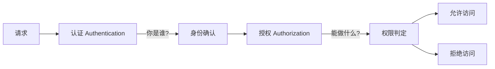
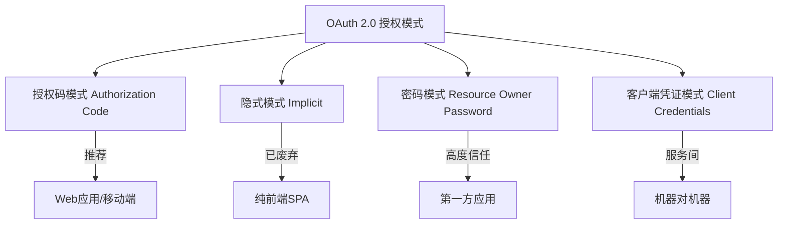
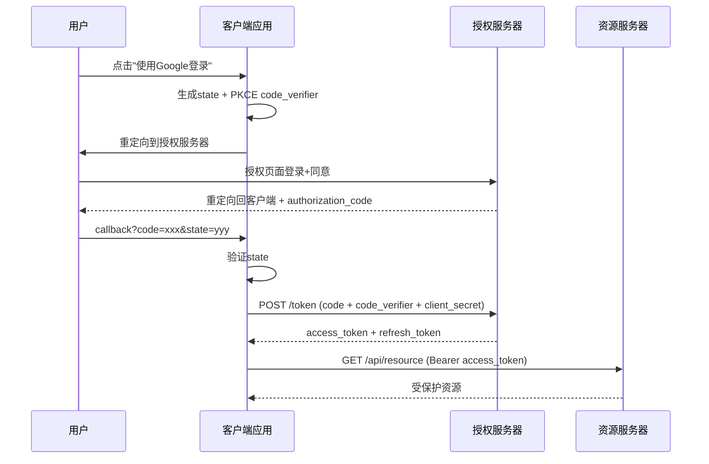
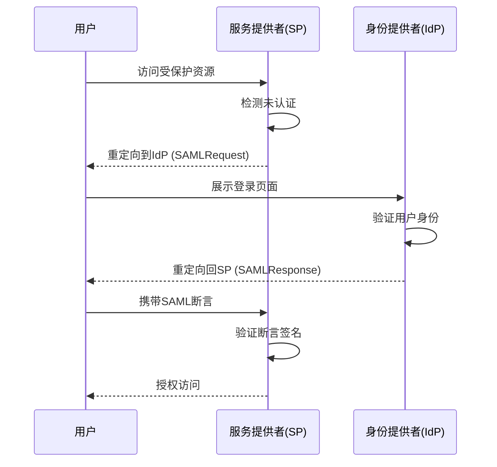
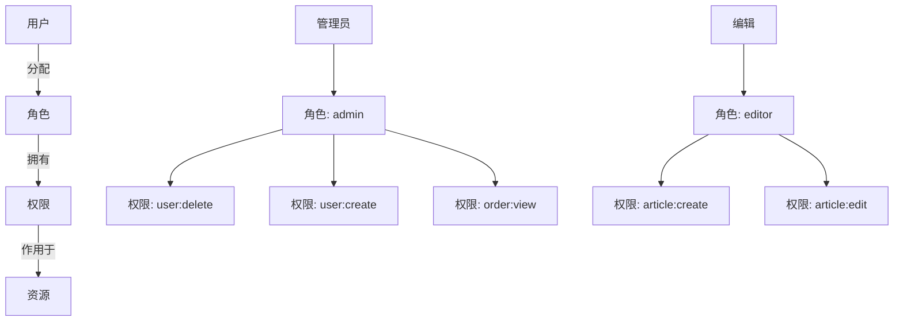
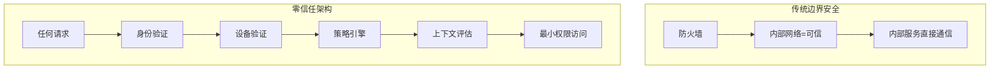

## 认证与授权：身份安全的完整体系

认证（Authentication）回答"你是谁"，授权（Authorization）回答"你能做什么"。两者构成了身份安全的基石，理解其原理和工程实践是构建安全系统的前提。

## 认证 vs 授权



| 维度 | 认证（AuthN） | 授权（AuthZ） |
|------|-------------|-------------|
| 核心问题 | 你是谁？ | 你能做什么？ |
| 输入 | 凭证（密码/Token/证书） | 身份 + 操作 + 资源 |
| 输出 | 身份标识 | 允许/拒绝 |
| 常见机制 | Session/Cookie, JWT, OAuth2 | RBAC, ABAC, ACL |
| 失败结果 | 401 Unauthorized | 403 Forbidden |

## Session/Cookie 认证

### 工作原理

```mermaid
sequenceDiagram
    participant C as 客户端
    participant S as 服务端
    participant Store as Session存储

    C->>S: POST /login (username, password)
    S->>S: 验证凭证
    S->>Store: 创建Session {userId, role, ...}
    Store-->>S: sessionId
    S-->>C: Set-Cookie: sessionId=abc123; HttpOnly; Secure
    C->>S: GET /profile Cookie: sessionId=abc123
    S->>Store: 查找Session
    Store-->>S: Session数据
    S-->>C: 200 OK + 用户信息
```

### Session 认证实现

```java
@RestController
public class AuthController {

    @PostMapping("/login")
    public ResponseEntity<?> login(@RequestBody LoginRequest request, HttpSession session) {
        User user = authService.authenticate(request.getUsername(), request.getPassword());
        if (user == null) {
            return ResponseEntity.status(401).body("Invalid credentials");
        }

        session.setAttribute("userId", user.getId());
        session.setAttribute("roles", user.getRoles());
        session.setMaxInactiveInterval(1800); // 30分钟超时

        return ResponseEntity.ok(Map.of("message", "Login successful"));
    }

    @PostMapping("/logout")
    public ResponseEntity<?> logout(HttpSession session) {
        session.invalidate();
        return ResponseEntity.ok(Map.of("message", "Logged out"));
    }
}
```

### Session 认证的挑战

| 问题 | 说明 | 解决方案 |
|------|------|---------|
| 扩展性 | Session 存在服务端内存 | Redis 集中存储 |
| 分布式 | 多服务器 Session 不共享 | Sticky Session / Redis |
| CSRF | Cookie 自动携带 | CSRF Token + SameSite |
| 移动端 | Cookie 机制不适合原生App | Token 机制 |

## Token 与 JWT

### JWT 结构

JWT（JSON Web Token）由三部分组成，用 `.` 分隔：

```
Header.Payload.Signature
```

$$
\text{JWT} = \text{Base64Url}(\text{Header}) + "." + \text{Base64Url}(\text{Payload}) + "." + \text{HMAC}(\text{Header} + "." + \text{Payload}, \text{Secret})
$$

```mermaid
graph LR
    subgraph Header
        H1[alg: HS256]
        H2[typ: JWT]
    end

    subgraph Payload
        P1[sub: user123]
        P2[name: 张三]
        P3[role: admin]
        P4[iat: 1683936000]
        P5[exp: 1683943200]
    end

    subgraph Signature
        S1[HMACSHA256]
        S2[base64UrlEncode(header) + . + base64UrlEncode(payload)]
        S3[secret_key]
    end
```

### JWT 实战

```java
// JWT 工具类
@Component
public class JwtTokenProvider {

    @Value("${jwt.secret}")
    private String secret;

    @Value("${jwt.access-token-expiration:900000}")  // 15分钟
    private long accessTokenExpiration;

    @Value("${jwt.refresh-token-expiration:604800000}")  // 7天
    private long refreshTokenExpiration;

    private SecretKey getSigningKey() {
        return Keys.hmacShaKeyFor(secret.getBytes(StandardCharsets.UTF_8));
    }

    public String generateAccessToken(User user) {
        return Jwts.builder()
            .subject(user.getId())
            .claim("username", user.getUsername())
            .claim("roles", user.getRoles())
            .issuedAt(new Date())
            .expiration(new Date(System.currentTimeMillis() + accessTokenExpiration))
            .signWith(getSigningKey())
            .compact();
    }

    public String generateRefreshToken(User user) {
        return Jwts.builder()
            .subject(user.getId())
            .claim("type", "refresh")
            .issuedAt(new Date())
            .expiration(new Date(System.currentTimeMillis() + refreshTokenExpiration))
            .signWith(getSigningKey())
            .compact();
    }

    public Claims parseToken(String token) {
        return Jwts.parser()
            .verifyWith(getSigningKey())
            .build()
            .parseSignedClaims(token)
            .getPayload();
    }
}

// JWT 过滤器
@Component
public class JwtAuthenticationFilter extends OncePerRequestFilter {

    @Autowired
    private JwtTokenProvider tokenProvider;

    @Override
    protected void doFilterInternal(HttpServletRequest request,
                                     HttpServletResponse response,
                                     FilterChain chain) throws ServletException, IOException {
        String token = extractToken(request);

        if (token != null && tokenProvider.validateToken(token)) {
            Claims claims = tokenProvider.parseToken(token);
            UsernamePasswordAuthenticationToken auth =
                new UsernamePasswordAuthenticationToken(
                    claims.getSubject(), null, getAuthorities(claims));
            SecurityContextHolder.getContext().setAuthentication(auth);
        }

        chain.doFilter(request, response);
    }

    private String extractToken(HttpServletRequest request) {
        String bearer = request.getHeader("Authorization");
        if (bearer != null && bearer.startsWith("Bearer ")) {
            return bearer.substring(7);
        }
        return null;
    }
}
```

### Session vs JWT

| 维度 | Session | JWT |
|------|---------|-----|
| 状态 | 有状态（服务端存储） | 无状态（Token 自包含） |
| 扩展性 | 需共享存储 | 天然支持分布式 |
| 撤销 | 直接删除Session | 需额外机制（黑名单） |
| 安全性 | Cookie HttpOnly | Token 可被XSS窃取 |
| 体积 | Cookie中只存ID | Token 较大（KB级） |
| 适用场景 | 传统Web应用 | API/微服务/移动端 |

### JWT 安全最佳实践

1. **Access Token 短期 + Refresh Token 长期**
2. **Token 存储在内存中**（而非 localStorage，防 XSS）
3. **使用 HTTPS 传输**
4. **敏感数据不放 Payload**（Base64 可解码）
5. **Token 撤销方案**：黑名单 / 短过期 + Refresh

## OAuth 2.0

OAuth 2.0 是授权框架，允许用户授权第三方应用访问其在另一服务上的资源，而无需暴露密码。

### 四种授权模式



### 授权码模式（最安全、最常用）



### Spring Security OAuth2 实现

```java
@Configuration
public class OAuth2ClientConfig {

    // 客户端配置
    @Bean
    public ClientRegistrationRepository clientRegistrationRepository() {
        return new InMemoryClientRegistrationRepository(
            ClientRegistration.withRegistrationId("google")
                .clientId("${GOOGLE_CLIENT_ID}")
                .clientSecret("${GOOGLE_CLIENT_SECRET}")
                .authorizationUri("https://accounts.google.com/o/oauth2/v2/auth")
                .tokenUri("https://www.googleapis.com/oauth2/v4/token")
                .userInfoUri("https://www.googleapis.com/oauth2/v3/userinfo")
                .redirectUri("{baseUrl}/login/oauth2/code/{registrationId}")
                .scope("openid", "profile", "email")
                .authorizationGrantType(AuthorizationGrantType.AUTHORIZATION_CODE)
                .clientName("Google")
                .build()
        );
    }
}

// 资源服务器配置
@Configuration
@EnableWebSecurity
public class ResourceServerConfig {

    @Bean
    public SecurityFilterChain resourceServerFilterChain(HttpSecurity http) throws Exception {
        http.oauth2ResourceServer(oauth2 -> oauth2
            .jwt(jwt -> jwt
                .jwkSetUri("https://auth.example.com/.well-known/jwks.json")
                .jwtAuthenticationConverter(jwtAuthenticationConverter())
            )
        );
        return http.build();
    }

    private JwtAuthenticationConverter jwtAuthenticationConverter() {
        JwtAuthenticationConverter converter = new JwtAuthenticationConverter();
        converter.setJwtGrantedAuthoritiesConverter(jwt -> {
            List<String> roles = jwt.getClaimAsStringList("roles");
            return roles.stream()
                .map(role -> new SimpleGrantedAuthority("ROLE_" + role))
                .collect(Collectors.toList());
        });
        return converter;
    }
}
```

### PKCE 增强

PKCE（Proof Key for Code Exchange）为授权码模式增加一层保护，防止授权码被截获：

```java
// 生成 PKCE 参数
public class PkceUtil {

    public static PkceParams generate() {
        SecureRandom random = new SecureRandom();
        byte[] bytes = new byte[32];
        random.nextBytes(bytes);

        String codeVerifier = Base64.getUrlEncoder().withoutPadding().encodeToString(bytes);
        byte[] digest = MessageDigest.getInstance("SHA-256").digest(codeVerifier.getBytes());
        String codeChallenge = Base64.getUrlEncoder().withoutPadding().encodeToString(digest);

        return new PkceParams(codeVerifier, codeChallenge);
    }
}
```

## OIDC（OpenID Connect）

OIDC 在 OAuth 2.0 之上增加了身份层，提供用户信息标准化：

```mermaid
graph TB
    subgraph OIDC = OAuth2.0 + 身份层
        OAuth[OAuth2.0 授权] + ID[ID Token - JWT] + UserInfo[UserInfo端点]
    end

    ID --> I1[sub: 用户唯一标识]
    ID --> I2[name: 姓名]
    ID --> I3[email: 邮箱]
    ID --> I4[aud: 目标客户端]
    ID --> I5[iss: 签发者]
```

## SSO（单点登录）

SSO 让用户一次登录即可访问多个互信系统。

### SAML SSO 流程



### 基于 JWT 的 SSO 实现

```java
// SSO 认证中心
@RestController
public class SsoController {

    @PostMapping("/sso/login")
    public ResponseEntity<?> login(@RequestBody LoginRequest request,
                                    HttpServletResponse response) {
        User user = authService.authenticate(request);
        if (user == null) {
            return ResponseEntity.status(401).body("Invalid credentials");
        }

        // 生成 SSO Token
        String ssoToken = jwtProvider.generateSsoToken(user);

        // 写入 SSO 域名下的 Cookie
        Cookie cookie = new Cookie("sso_token", ssoToken);
        cookie.setDomain(".example.com");  // 父域名共享
        cookie.setPath("/");
        cookie.setHttpOnly(true);
        cookie.setSecure(true);
        cookie.setMaxAge(3600);
        response.addCookie(cookie);

        return ResponseEntity.ok(Map.of("token", ssoToken));
    }
}

// 子系统验证 SSO Token
@Component
public class SsoFilter extends OncePerRequestFilter {

    @Override
    protected void doFilterInternal(HttpServletRequest request,
                                     HttpServletResponse response,
                                     FilterChain chain) throws ServletException, IOException {
        String ssoToken = extractSsoToken(request);

        if (ssoToken == null) {
            // 重定向到 SSO 登录
            response.sendRedirect("https://sso.example.com/login?redirect=" +
                URLEncoder.encode(request.getRequestURL().toString(), "UTF-8"));
            return;
        }

        try {
            Claims claims = jwtProvider.parseToken(ssoToken);
            // 设置认证信息
            setAuthentication(claims);
        } catch (JwtException e) {
            response.sendRedirect("https://sso.example.com/login");
            return;
        }

        chain.doFilter(request, response);
    }
}
```

### SSO 方案对比

| 方案 | 协议 | 适用场景 | 复杂度 |
|------|------|---------|--------|
| SAML | XML | 企业级、SaaS集成 | 高 |
| CAS | 自定义 | 校园/企业内网 | 中 |
| OAuth2+OIDC | HTTP/JSON | 互联网应用 | 中 |
| 自研JWT | HTTP/JSON | 简单多系统 | 低 |

## RBAC 与 ABAC

### RBAC（基于角色的访问控制）



```java
// RBAC 数据模型
@Entity
public class User {
    @Id private String id;
    private String username;

    @ManyToMany(fetch = FetchType.EAGER)
    @JoinTable(name = "user_role")
    private Set<Role> roles;
}

@Entity
public class Role {
    @Id private String id;
    private String name;

    @ManyToMany(fetch = FetchType.EAGER)
    @JoinTable(name = "role_permission")
    private Set<Permission> permissions;
}

@Entity
public class Permission {
    @Id private String id;
    private String resource;  // user, order, article
    private String action;    // create, read, update, delete
}

// 权限检查
@PreAuthorize("hasPermission('order', 'delete')")
@DeleteMapping("/orders/{id}")
public void deleteOrder(@PathVariable String id) {
    orderService.delete(id);
}
```

### ABAC（基于属性的访问控制）

ABAC 根据主体属性、资源属性、环境属性动态决策：

$$
\text{Allow} = f(\text{Subject}, \text{Resource}, \text{Action}, \text{Environment})
$$

```java
// ABAC 策略引擎
public class AbacPolicyEngine {

    public boolean evaluate(AccessRequest request) {
        Subject subject = request.getSubject();
        Resource resource = request.getResource();
        Action action = request.getAction();
        Environment env = request.getEnvironment();

        // 策略: 只有文档所属部门的员工可以查看
        if (action == Action.READ && resource.getType() == ResourceType.DOCUMENT) {
            return subject.getDepartment().equals(resource.getDepartment());
        }

        // 策略: 工作时间外不能删除数据
        if (action == Action.DELETE && !env.isBusinessHours()) {
            return false;
        }

        // 策略: IP白名单
        if (!env.getClientIp().matches("10\\.0\\..*")) {
            return false;
        }

        return true;
    }
}
```

### RBAC vs ABAC

| 维度 | RBAC | ABAC |
|------|------|------|
| 决策依据 | 角色 | 属性（主体/资源/环境） |
| 灵活性 | 中 | 高 |
| 管理复杂度 | 低 | 高 |
| 动态性 | 静态（角色不变） | 动态（属性变化） |
| 适用场景 | 权限结构清晰 | 细粒度/动态权限 |

## 零信任架构

零信任的核心原则：**永不信任，始终验证**。



### 零信任核心原则

1. **持续验证**：每次请求都验证身份，不依赖网络位置
2. **最小权限**：只授予完成任务所需的最小权限
3. **假设违规**：假设网络已被入侵，任何访问都需验证
4. **微分段**：将网络划分为小的安全区域，限制横向移动

## 面试 Q&A

**Q1：JWT 的缺点是什么？如何解决？**

A：JWT 的三大缺点及解决方案：(1) **无法主动撤销**：JWT 签发后无法作废，只能等过期。解决方案：维护 Token 黑名单（Redis 存储已撤销的 Token ID），或缩短 Access Token 过期时间（15分钟）配合 Refresh Token；(2) **Payload 可被解码**：Base64 不是加密，敏感信息不能放 Payload。解决方案：只存用户 ID 和角色，敏感数据通过 API 获取；(3) **Token 体积大**：每次请求都携带完整 Token。解决方案：使用 JWS Compact Serialization，只存必要 claims。

**Q2：OAuth2 授权码模式为什么比隐式模式更安全？**

A：授权码模式通过两次请求分离了授权码和 Token：(1) 前端只获取 authorization_code（一次性、短期有效），即使被截获也无法获取 Token（还需要 client_secret 和 code_verifier）；(2) Token 在后端直接交换，前端永远接触不到 Token。隐式模式直接在前端返回 Token，存在以下风险：Token 出现在浏览器历史记录和 URL 中、容易被截获、无法使用 Refresh Token。OAuth 2.1 已正式废弃隐式模式，推荐授权码模式 + PKCE。

**Q3：RBAC 如何处理数据级权限？**

A：RBAC 天然处理功能权限（谁能做什么操作），但数据级权限（谁能看哪些数据）需要扩展。三种方案：(1) **RBAC + 数据范围**：角色增加数据范围属性（如"本部门"、"本部门及下级"），查询时自动过滤；(2) **RBAC + 行级安全**：数据库层实现行级安全策略（PostgreSQL RLS），根据当前用户自动过滤行；(3) **RBAC + ABAC 混合**：角色控制功能权限，属性控制数据权限。工程实践中，方案1最常见——简单且满足大部分需求。

**Q4：如何实现安全的"记住我"功能？**

A：记住我需要解决两个问题：长期有效 + 防止被盗用。安全方案：(1) **双 Token 策略**：短期 Access Token（15分钟）+ 长期 Refresh Token（30天），Refresh Token 存在 HttpOnly Cookie 中；(2) **Refresh Token 绑定**：Token 关联设备指纹（User-Agent + IP段），换设备需重新认证；(3) **Token 轮换**：每次使用 Refresh Token 时生成新的 Refresh Token，旧的立即失效（检测重放攻击）；(4) **安全存储**：服务端存储 Refresh Token 的哈希值，可随时撤销。绝不能将密码明文存储在 Cookie 中。

**Q5：零信任架构如何落地？**

A：分阶段实施：(1) **身份统一**：先建立统一的身份认证中心（SSO + MFA），所有系统接入；(2) **微分段**：网络层面划分安全区域，服务间通信需认证（mTLS/Service Mesh）；(3) **持续验证**：每次 API 调用都验证 Token，不信任内网请求；(4) **最小权限**：RBAC/ABAC 细粒度授权，定期审计权限；(5) **可观测性**：全链路日志 + 异常行为检测。落地关键：不要试图一步到位，先从身份统一和 MFA 开始，逐步收紧信任边界。
