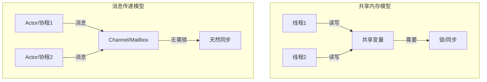
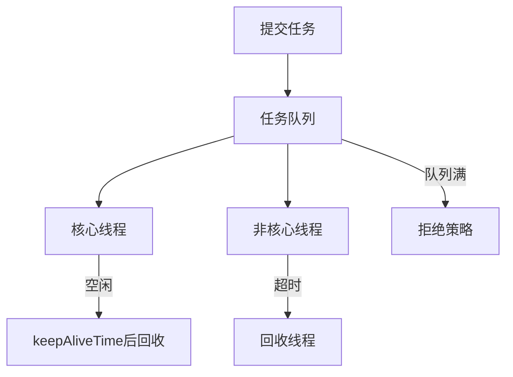
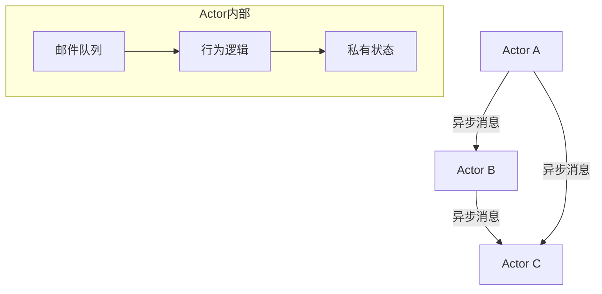
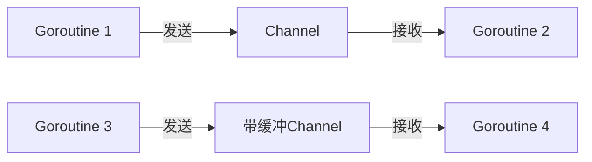
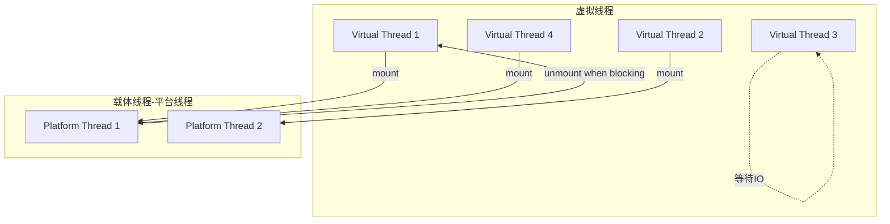

## 并发模型：从共享内存到消息传递

并发模型决定了程序如何组织并发任务、如何通信、如何同步。选择合适的并发模型，比选择语言和框架更深远地影响系统的架构和可维护性。

## 两大范式：共享内存 vs 消息传递



| 维度 | 共享内存 | 消息传递 |
|------|---------|---------|
| 通信方式 | 读写共享变量 | 发送/接收消息 |
| 同步机制 | 锁、信号量、CAS | Channel 天然同步 |
| 数据竞争 | 存在，需显式防护 | 不存在（消息是拷贝） |
| 调试难度 | 高（竞态条件难复现） | 低（消息流可追踪） |
| 代表语言 | Java, C++, C# | Go, Erlang, Rust |
| 代表模型 | 线程+锁 | Actor, CSP |

## 线程池

线程池是共享内存模型中最常用的并发组织方式，通过复用线程避免频繁创建销毁的开销。

### 线程池架构



### Java 线程池核心参数

```java
public ThreadPoolExecutor(
    int corePoolSize,      // 核心线程数
    int maximumPoolSize,   // 最大线程数
    long keepAliveTime,    // 非核心线程空闲存活时间
    TimeUnit unit,
    BlockingQueue<Runnable> workQueue,  // 任务队列
    ThreadFactory threadFactory,
    RejectedExecutionHandler handler     // 拒绝策略
)
```

### 线程池选型

| 类型 | 核心线程 | 队列 | 适用场景 |
|------|---------|------|---------|
| FixedThreadPool | 固定N | 无界LinkedBlockingQueue | CPU密集型 |
| CachedThreadPool | 0 | SynchronousQueue | IO密集型、短任务 |
| ScheduledThreadPool | 固定N | DelayedWorkQueue | 定时任务 |
| 自定义 | 按需配置 | 按需配置 | 生产环境推荐 |

### 生产级线程池配置

```java
@Configuration
public class ThreadPoolConfig {

    @Bean("ioPool")
    public ThreadPoolExecutor ioPool() {
        int cpuCores = Runtime.getRuntime().availableProcessors();
        return new ThreadPoolExecutor(
            cpuCores * 2,                          // IO密集型：核心线程=CPU*2
            cpuCores * 4,                          // 最大线程=CPU*4
            60, TimeUnit.SECONDS,
            new LinkedBlockingQueue<>(1000),       // 有界队列，防止OOM
            new CustomThreadFactory("io-pool"),
            new ThreadPoolExecutor.CallerRunsPolicy() // 队列满时调用者执行
        );
    }

    @Bean("cpuPool")
    public ThreadPoolExecutor cpuPool() {
        int cpuCores = Runtime.getRuntime().availableProcessors();
        return new ThreadPoolExecutor(
            cpuCores + 1,                          // CPU密集型：核心线程=CPU+1
            cpuCores + 1,
            0, TimeUnit.SECONDS,
            new LinkedBlockingQueue<>(500),
            new CustomThreadFactory("cpu-pool"),
            new ThreadPoolExecutor.AbortPolicy()
        );
    }
}
```

线程数经验公式：

$$
N_{\text{IO}} = N_{\text{CPU}} \times (1 + \frac{W}{C}) \quad N_{\text{CPU}} = N_{\text{CPU}} + 1
$$

其中 $W$ 为等待时间，$C$ 为计算时间。

## Actor 模型

Actor 模型由 Carl Hewitt 于 1973 年提出，核心思想：**一切皆 Actor，Actor 之间只通过异步消息通信**。

### Actor 模型核心原则



1. **封装状态**：每个 Actor 有私有状态，外部无法直接访问
2. **异步消息**：Actor 之间只能通过发送消息通信
3. **单线程处理**：每个 Actor 一次只处理一条消息，无需锁
4. **透明分布**：Actor 可在同一进程或不同机器上

### Akka Actor 示例

```java
// Actor 定义
public class OrderActor extends AbstractActor {

    private final Map<String, Order> orders = new HashMap<>();

    @Override
    public Receive createReceive() {
        return receiveBuilder()
            .match(CreateOrderMsg.class, msg -> {
                Order order = Order.create(msg.getUserId(), msg.getItems());
                orders.put(order.getId(), order);
                getSender().tell(new OrderCreatedMsg(order.getId()), getSelf());
            })
            .match(GetOrderMsg.class, msg -> {
                Order order = orders.get(msg.getOrderId());
                if (order != null) {
                    getSender().tell(new OrderResultMsg(order), getSelf());
                } else {
                    getSender().tell(new NotFoundMsg(), getSelf());
                }
            })
            .match(CancelOrderMsg.class, msg -> {
                Order order = orders.get(msg.getOrderId());
                if (order != null && order.canCancel()) {
                    order.cancel();
                    getSender().tell(new OrderCancelledMsg(order.getId()), getSelf());
                }
            })
            .build();
    }
}

// Actor 使用
ActorSystem system = ActorSystem.create("order-system");
ActorRef orderActor = system.actorOf(Props.create(OrderActor.class), "order");

// 发送消息
orderActor.tell(new CreateOrderMsg("user1", items), ActorRef.noSender());
```

### Erlang Actor：轻量级进程

Erlang 的 Actor（称为进程）极其轻量，初始栈仅几百字节，单机可创建百万级进程：

```erlang
% Erlang Actor
-module(order_server).
-export([start/0, create_order/2, handle_call/2]).

start() ->
    spawn(?MODULE, handle_call, [#{}]).

create_order(Pid, OrderData) ->
    Pid ! {create, OrderData, self()},
    receive
        {ok, OrderId} -> {ok, OrderId}
    after 5000 -> {error, timeout}
    end.

handle_call(Orders) ->
    receive
        {create, Data, From} ->
            OrderId = generate_id(),
            NewOrders = maps:put(OrderId, Data, Orders),
            From ! {ok, OrderId},
            handle_call(NewOrders);
        {get, OrderId, From} ->
            Result = maps:find(OrderId, Orders),
            From ! Result,
            handle_call(Orders)
    end.
```

## CSP 模型（Communicating Sequential Processes）

CSP 模型由 Tony Hoare 于 1978 年提出，核心思想：**通过 Channel 通信，而不是共享内存**。Go 语言是 CSP 模型的最佳实践者。

### Go Channel 通信



### Go 并发模式

```go
// 1. Fan-Out/Fan-In 模式
func fanOutFanIn(jobs <-chan int, workers int) <-chan int {
    results := make(chan int)

    // Fan-Out: 启动多个worker
    var wg sync.WaitGroup
    for i := 0; i < workers; i++ {
        wg.Add(1)
        go func() {
            defer wg.Done()
            for job := range jobs {
                results <- process(job)
            }
        }()
    }

    // Fan-In: 等待所有worker完成
    go func() {
        wg.Wait()
        close(results)
    }()

    return results
}

// 2. Pipeline 模式
func pipeline() {
    // 阶段1: 生成数据
    gen := func(nums ...int) <-chan int {
        out := make(chan int)
        go func() {
            for _, n := range nums {
                out <- n
            }
            close(out)
        }()
        return out
    }

    // 阶段2: 平方计算
    square := func(in <-chan int) <-chan int {
        out := make(chan int)
        go func() {
            for n := range in {
                out <- n * n
            }
            close(out)
        }()
        return out
    }

    // 阶段3: 打印结果
    for result := range square(gen(1, 2, 3, 4, 5)) {
        fmt.Println(result)
    }
}

// 3. Select 多路复用
func selectPattern(ch1, ch2 <-chan string, quit <-chan bool) {
    for {
        select {
        case msg := <-ch1:
            fmt.Println("ch1:", msg)
        case msg := <-ch2:
            fmt.Println("ch2:", msg)
        case <-quit:
            return
        case <-time.After(5 * time.Second):
            fmt.Println("timeout")
        }
    }
}
```

### Actor vs CSP 对比

| 维度 | Actor | CSP |
|------|-------|-----|
| 通信方式 | 异步邮箱 | 同步/异步 Channel |
| 耦合度 | 松（发送者不需知道接收者） | 紧（双方持有 Channel） |
| 容错 | Supervisor 树 | 需自行处理 |
| 分布式 | 天然支持 | 需额外支持 |
| 代表语言 | Erlang, Akka | Go, Clojure |
| 背压 | 邮箱可能溢出 | Channel 满时阻塞 |

## 协程/纤程

协程是用户态的轻量级线程，由运行时而非操作系统调度，切换成本极低。

### 协程 vs 线程

| 维度 | 线程 | 协程 |
|------|------|------|
| 调度 | 操作系统内核 | 用户态运行时 |
| 栈大小 | 1MB（默认） | 2-8KB（可动态增长） |
| 切换成本 | 1-10μs（内核态切换） | 0.1-1μs（用户态切换） |
| 创建数量 | 万级 | 百万级 |
| 抢占 | 操作系统抢占 | 协作式/抢占式 |
| 多核利用 | 天然并行 | 需配合多线程 |

### Kotlin 协程

```kotlin
// 协程基础
suspend fun fetchUserData(userId: String): User {
    val profile = async { profileService.getProfile(userId) }
    val orders = async { orderService.getOrders(userId) }
    return User(profile.await(), orders.await())
}

// Flow - 冷流
fun orderFlow(userId: String): Flow<Order> = flow {
    var page = 0
    do {
        val orders = orderService.getOrders(userId, page)
        orders.forEach { emit(it) }
        page++
    } while (orders.isNotEmpty())
}

// Channel - 热流
fun eventsChannel(): Channel<Event> {
    val channel = Channel<Event>(Channel.BUFFERED)
    launch {
        while (!channel.isClosedForSend) {
            val event = eventSource.poll()
            if (event != null) {
                channel.send(event)
            }
        }
    }
    return channel
}

// 协程作用域与异常处理
class OrderViewModel : ViewModel() {
    fun loadOrders() {
        viewModelScope.launch {
            try {
                val orders = orderRepository.getOrders()
                _state.value = OrderState.Success(orders)
            } catch (e: HttpException) {
                _state.value = OrderState.Error(e.message)
            }
        }
    }
}
```

## async/await

async/await 是异步编程的语法糖，让异步代码看起来像同步代码。

### C# async/await

```csharp
public async Task<OrderResult> ProcessOrderAsync(OrderRequest request)
{
    // 并行执行独立操作
    var validateTask = ValidateOrderAsync(request);
    var checkStockTask = CheckStockAsync(request.Items);
    var checkCreditTask = CheckCreditAsync(request.UserId);

    await Task.WhenAll(validateTask, checkStockTask, checkCreditTask);

    // 顺序执行依赖操作
    var order = await CreateOrderAsync(request);
    var payment = await ProcessPaymentAsync(order);
    var confirmation = await SendConfirmationAsync(order, payment);

    return new OrderResult(order.Id, confirmation.Status);
}
```

### JavaScript async/await

```javascript
async function processOrder(request) {
    try {
        // 并行执行
        const [validation, stock] = await Promise.all([
            validateOrder(request),
            checkStock(request.items)
        ]);

        if (!validation.valid || !stock.available) {
            throw new OrderError('Validation or stock check failed');
        }

        // 顺序执行
        const order = await createOrder(request);
        const payment = await processPayment(order);

        // 超时保护
        const confirmation = await Promise.race([
            sendConfirmation(order, payment),
            timeout(5000, 'Confirmation timeout')
        ]);

        return { orderId: order.id, status: confirmation.status };
    } catch (error) {
        await compensateOrder(error);
        throw error;
    }
}
```

## Java 虚拟线程（Virtual Threads）

Java 21 正式引入虚拟线程，这是 Java 并发模型的重大革新。

### 虚拟线程架构



### 虚拟线程使用

```java
// 创建虚拟线程
Thread vt = Thread.ofVirtual()
    .name("order-processor")
    .start(() -> processOrder());

// 虚拟线程工厂
ExecutorService executor = Executors.newVirtualThreadPerTaskExecutor();

// 使用虚拟线程处理大量并发IO
try (var executor = Executors.newVirtualThreadPerTaskExecutor()) {
    List<Future<OrderResult>> futures = orderIds.stream()
        .map(id -> executor.submit(() -> fetchOrder(id)))
        .toList();

    List<OrderResult> results = futures.stream()
        .map(Future::resultNow)
        .toList();
}

// Semaphore 限制虚拟线程并发度
Semaphore semaphore = new Semaphore(100);
try (var executor = Executors.newVirtualThreadPerTaskExecutor()) {
    List<Callable<OrderResult>> tasks = orderIds.stream()
        .map(id -> (Callable<OrderResult>) () -> {
            semaphore.acquire();
            try {
                return fetchOrder(id);
            } finally {
                semaphore.release();
            }
        })
        .toList();

    executor.invokeAll(tasks);
}
```

### 虚拟线程注意事项

| 陷阱 | 说明 | 解决方案 |
|------|------|---------|
| Pinning | synchronized 块内阻塞时虚拟线程不会卸载 | 改用 ReentrantLock |
| Carrier 线程耗尽 | 所有载体线程被占用 | 避免在虚拟线程中做CPU密集计算 |
| ThreadLocal 滥用 | 百万虚拟线程×ThreadLocal=内存灾难 | 尽量避免，使用ScopedValue |
| 池化虚拟线程 | 不需要，虚拟线程本身极轻量 | 直接创建，不复用 |

## 响应式编程

响应式编程基于异步数据流和变化传播，适合处理高并发IO场景。

### Reactor 核心

```java
// Mono: 0或1个元素的异步序列
Mono<User> userMono = userRepository.findById(userId);

// Flux: 0或N个元素的异步序列
Flux<Order> orderFlux = orderRepository.findByUserId(userId);

// 组合操作
Mono<UserWithOrders> result = userRepository.findById(userId)
    .flatMap(user ->
        orderRepository.findByUserId(user.getId())
            .collectList()
            .map(orders -> new UserWithOrders(user, orders))
    );

// 背压处理
Flux<Data> dataFlux = dataSource.flux()
    .onBackpressureBuffer(1000, () -> log.warn("Buffer overflow"))
    .publishOn(Schedulers.boundedElastic())
    .map(this::heavyProcess);

// 错误处理
Mono<Result> resilient = apiClient.call(request)
    .timeout(Duration.ofSeconds(5))
    .retryWhen(Retry.backoff(3, Duration.ofSeconds(1))
        .filter(ex -> ex instanceof TimeoutException)
        .onRetryExhaustedThrow((spec, signal) -> signal.failure()))
    .onErrorResume(ex -> fallbackService.call(request));
```

### 响应式 vs 虚拟线程

| 维度 | 响应式编程 | 虚拟线程 |
|------|----------|---------|
| 编程模型 | 函数式/声明式 | 同步/命令式 |
| 学习曲线 | 陡峭 | 低 |
| 调试难度 | 高（异步栈） | 低（同步栈） |
| 兼容性 | 需响应式驱动 | 直接用同步API |
| 性能 | 高 | 高 |
| 适用场景 | 流式处理、背压 | 通用IO密集型 |

## 面试 Q&A

**Q1：Actor 模型和 CSP 模型有什么区别？**

A：核心区别在于通信的耦合度：(1) **Actor** 是"发送者主导"——发送者直接向目标 Actor 发消息，不需要对方配合（解耦），但需要知道对方的地址；(2) **CSP** 是"Channel 主导"——通信双方都持有 Channel，Channel 是一等公民，发送者和接收者通过 Channel 解耦。Actor 的优势在于天然支持分布式（发消息不需要知道对方在哪个节点），Erlang 的 Supervisor 树提供了优秀的容错机制。CSP 的优势在于 Channel 提供了天然的背压（满则阻塞），Go 的 select 实现了优雅的多路复用。

**Q2：Java 虚拟线程会取代线程池吗？**

A：对于 IO 密集型场景，虚拟线程基本可以取代传统线程池。虚拟线程的优势：每个任务一个虚拟线程，代码是同步的（易读易调试），无需计算线程池大小。但以下场景仍需线程池：(1) CPU 密集型任务——虚拟线程不增加计算能力，仍需限制并发数等于 CPU 核心数；(2) 需要限制资源访问——用 Semaphore 替代线程池的并发控制；(3) 需要任务队列——虚拟线程本身没有队列概念。迁移建议：IO 密集型直接用 `newVirtualThreadPerTaskExecutor()`，CPU 密集型保留固定大小线程池。

**Q3：Go 的 channel 和直接共享内存加锁哪个好？**

A：Go 的哲学是"不要通过共享内存来通信，而要通过通信来共享内存"。Channel 的优势：(1) 天然避免数据竞争；(2) 通信和同步合一；(3) 组合性好（select、pipeline）。但 Channel 不是万能的：(1) 简单的计数器用 `sync/atomic` 更高效；(2) 共享配置用 `sync.RWMutex` 更直观；(3) 性能敏感的缓存用 `sync.Map` 更合适。**原则：优先用 channel 表达数据流，用锁保护简单共享状态**。

**Q4：协程和线程的本质区别是什么？**

A：本质区别在**调度器**：线程由操作系统内核调度，协程由用户态运行时调度。这带来三个关键差异：(1) **切换成本**：线程切换需要内核态切换（保存/恢复寄存器、切换地址空间），约1-10μs；协程切换只需保存/恢复少量寄存器，约0.1μs；(2) **数量**：线程受栈大小限制（默认1MB），万级就耗尽内存；协程栈仅2-8KB，百万级无压力；(3) **调度策略**：线程是抢占式（OS强制切换），协程是协作式（主动让出）或运行时辅助抢占。协程的局限是不能利用多核——需要配合多线程（Go 的 M:N 调度模型）。

**Q5：响应式编程和虚拟线程如何选择？**

A：2024年后的趋势是**虚拟线程优先**。原因：(1) 响应式编程的声明式风格学习曲线陡峭，调试困难（异步栈追踪）；(2) 虚拟线程让你用同步风格写异步代码，几乎零学习成本；(3) 虚拟线程可以直接复用现有的同步库，响应式需要专门的响应式驱动。但响应式仍有优势场景：(1) 流式处理（无限数据流、背压控制）；(2) 需要精细控制并发和背压；(3) 已有大量响应式代码的项目。新项目建议：IO 密集型用虚拟线程，流式处理用 Reactor/Flow。
