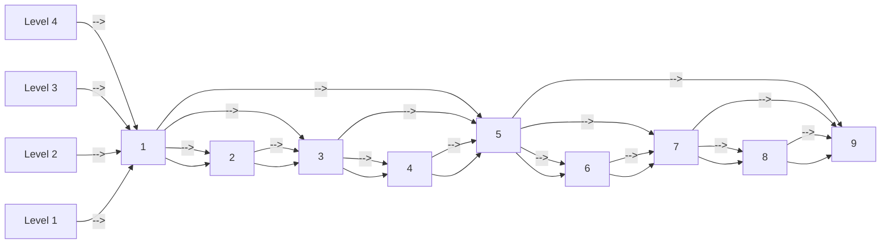
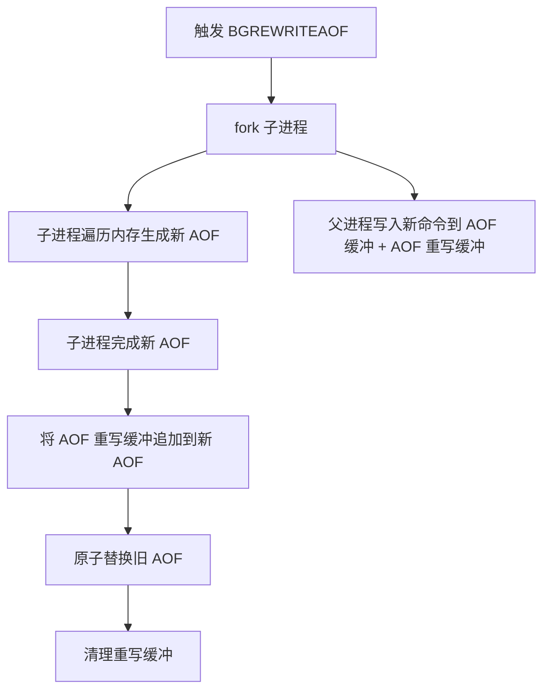
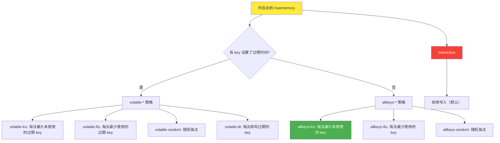
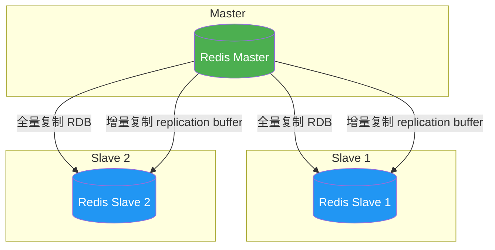
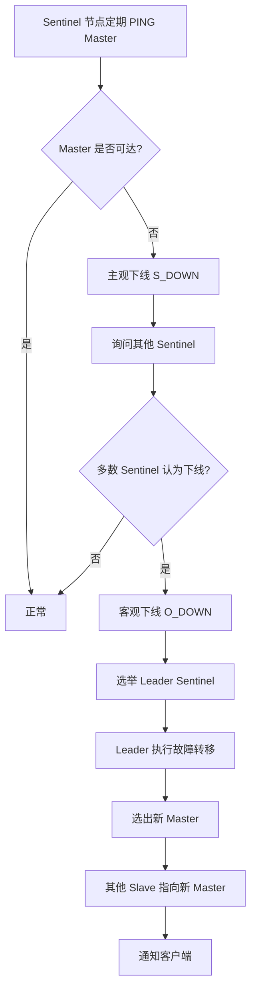
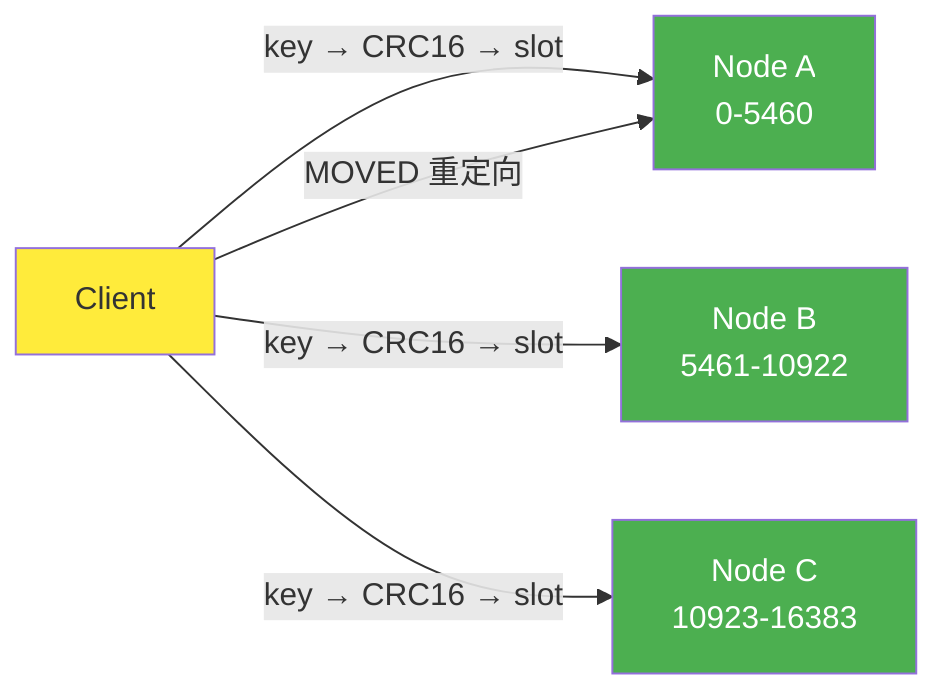
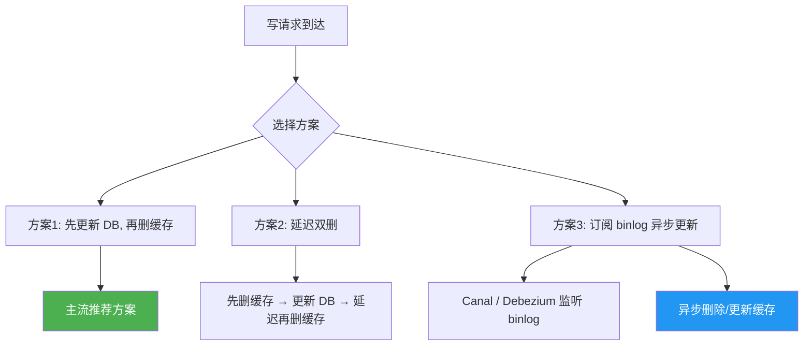

## 引言

Redis（Remote Dictionary Server）是目前最流行的内存数据库之一。它以极高的性能、丰富的数据结构和灵活的扩展能力，成为现代系统架构中不可或缺的组件。本文将从底层数据结构出发，深入剖析 Redis 的核心原理。

## Redis 数据结构底层实现

Redis 的高效不仅在于它是内存数据库，更在于它对底层数据结构的精心设计。每种数据类型在不同场景下会使用不同的底层编码。

### SDS（简单动态字符串）

Redis 没有使用 C 语言的原生字符串，而是设计了 SDS（Simple Dynamic String）：

```c
struct __attribute__ ((__packed__)) sdshdr8 {
    uint8_t len;        // 已使用长度
    uint8_t alloc;      // 总分配长度
    uint8_t flags;      // 类型标识
    char buf[];         // 数据部分
};
```

| 对比项 | C 字符串 | SDS |
|--------|---------|-----|
| 获取长度 | O(n)，需要遍历 | O(1)，直接读取 len |
| 缓冲区溢出 | 不会自动扩展 | 自动扩容 |
| 内存泄漏 | 手动释放易遗漏 | 结构化管理 |
| 二进制安全 | 以 \0 结尾，不能存二进制 | 以 len 判断，完全安全 |
| 空间预分配 | 无 | 有，减少频繁分配 |

**空间预分配策略**：
- 修改后 `len < 1MB`：`alloc = len * 2 + 1`（翻倍）
- 修改后 `len >= 1MB`：`alloc = len + 1MB + 1`

### ziplist 压缩列表

ziplist 是一种**紧凑的双向链表**，用连续的内存块存储数据，适用于**元素数量少且体积小的场景**。

```
<zlbytes> <zltail> <zllen> <entry> <entry> ... <zlend>
```

| 字段 | 含义 |
|------|------|
| zlbytes | ziplist 总字节数 |
| zltail | 尾节点偏移量 |
| zllen | 节点数量 |
| entry | 数据节点（含 prevlen + encoding + data） |
| zlend | 结尾标记 0xFF |

**连锁更新问题**：当修改一个 entry 的 `prevlen` 长度时，可能引发后续所有 entry 的 `prevlen` 都需要扩容，导致 O(n) 的时间复杂度。这是 ziplist 的固有缺陷。

### skiplist 跳表

跳表是 ZSet（有序集合）的底层数据结构之一，它提供了 **O(log N)** 的平均查找复杂度。



跳表的核心思想是**以空间换时间**：
- 每个节点随机生成一个层数（层数越高，概率越小）
- 高层节点跳过更多底层节点，加速查找
- 查找从最高层开始，逐层下降

```c
typedef struct zskiplistNode {
    sds ele;                        // 成员值
    double score;                   // 分值
    struct zskiplistNode *backward; // 后退指针
    struct zskiplistLevel {
        struct zskiplistNode *forward; // 前进指针
        unsigned long span;            // 跨度
    } level[];
} zskiplistNode;
```

### intset 整数集合

当 Set 中的所有元素都是整数时，Redis 使用 intset 存储：

```c
typedef struct intset {
    uint32_t encoding;   // 编码方式（16/32/64位整数）
    uint32_t length;     // 元素数量
    int8_t contents[];   // 数组（有序存储）
} intset;
```

**特点**：
- 数组有序存储，支持二分查找
- 当插入非整数或整数超出当前编码范围时，升级为 hashtable
- **不支持降级**

### hashtable 字典

Redis 的 hashtable 使用链地址法解决哈希冲突：

```c
typedef struct dictht {
    dictEntry **table;    // 哈希表数组
    unsigned long size;   // 哈希表大小
    unsigned long sizemask; // 掩码 (size - 1)
    unsigned long used;   // 已有节点数
} dictht;

typedef struct dictEntry {
    void *key;
    union {
        void *val;
        uint64_t u64;
        int64_t s64;
        double d;
    } v;
    struct dictEntry *next;  // 链表解决冲突
} dictEntry;
```

**渐进式 rehash**：

```mermaid
flowchart TB
    A[ht[0]] -.旧表.-> B[数据迁移]
    C[ht[1]] -.新表.-> B
    B --> D{每次操作时}
    D --> E[执行一步 rehash]
    E --> F[迁移一个桶的数据]
    F --> G{ht[0] 为空?}
    G -->|是| H[释放 ht[0], ht[1] 设为 ht[0]]
    G -->|否| D

    style A fill:#ffeb3b
    style C fill:#4caf50,color:#fff
```

Redis 的 rehash 是**渐进式**的：不会一次性完成所有数据迁移，而是在每次操作时顺便迁移一个桶。这样避免了单次操作的长时间阻塞。

### listpack 紧凑列表

Redis 7.0 引入 listpack 替代 ziplist（用于 Hash 和 ZSet），解决了连锁更新问题：

- 每个 entry 独立编码，不需要 `prevlen` 字段
- 从尾部查找时需要从头部遍历
- 内存紧凑，适合小数据量

## 数据类型与底层编码映射

Redis 的 5 种基本数据类型可以根据数据特征自动选择最优的底层编码：

```mermaid
flowchart TD
    root[Redis 数据类型] --> string
    root --> list
    root --> hash
    root --> set
    root --> zset

    string --> sds1[sds]
    string --> embstr[embstr (len <= 44)]
    string --> int[int (整数值)]

    list --> quicklist[quicklist (ziplist/listpack + 双向链表)]

    hash --> ziplist1[ziplist (元素少 & 值小)]
    hash --> hashtable1[hashtable]

    set --> intset1[intset (纯整数)]
    set --> hashtable2[hashtable]

    zset --> ziplist2[ziplist (元素少 & 值小)]
    zset --> zset2[skiplist + hashtable]
```

| 数据类型 | 底层编码 | 编码条件 |
|---------|---------|---------|
| **String** | `int` | 存储的是整数值 |
| **String** | `embstr` | 字符串长度 ≤ 44 字节 |
| **String** | `raw` | 字符串长度 > 44 字节 |
| **Hash** | `ziplist` | 元素数量 < `hash-max-ziplist-entries`(默认128) 且值 < `hash-max-ziplist-value`(默认64) |
| **Hash** | `hashtable` | 超出 ziplist 条件 |
| **List** | `quicklist` | 默认编码 |
| **Set** | `intset` | 全部为整数且数量 < `set-max-intset-entries`(默认512) |
| **Set** | `hashtable` | 超出 intset 条件 |
| **ZSet** | `ziplist` | 元素数量 < `zset-max-ziplist-entries`(默认128) 且值 < `zset-max-ziplist-value`(默认64) |
| **ZSet** | `skiplist` | 超出 ziplist 条件 |

> **编码升级**是单向的：当数据超出小编码的容量时，会自动升级为大数据结构，且**不会降级**。

```bash
# 查看对象的编码类型
OBJECT ENCODING mykey

# 查看对象的引用计数和编码
OBJECT REFCOUNT mykey
```

## 持久化机制

Redis 虽然是内存数据库，但提供了两种持久化机制来保证数据安全。

### RDB（Redis DataBase）

RDB 是在指定时间间隔内将内存中的数据集快照写入磁盘。


**配置示例**：
```bash
# redis.conf
save 900 1       # 900秒内至少1个key变化
save 300 10      # 300秒内至少10个key变化
save 60 10000    # 60秒内至少10000个key变化

dbfilename dump.rdb
dir /var/lib/redis
```

| 优点 | 缺点 |
|------|------|
| 文件紧凑，适合备份 | 可能丢失最后一次快照后的数据 |
| 恢复速度快 | fork 子进程时内存消耗翻倍（CoW） |
| 对性能影响小（父进程不阻塞） | 数据量大时 fork 耗时长 |

### AOF（Append Only File）

AOF 记录每个写操作命令，重启时重放命令来恢复数据。

```bash
# redis.conf
appendonly yes
appendfilename "appendonly.aof"
appendfsync always    # 每次写入都 fsync，最安全，最慢
appendfsync everysec  # 每秒 fsync，默认（最多丢1秒）
appendfsync no        # 不 fsync，由 OS 决定，最快
```

**AOF 重写机制**：随着时间推移，AOF 文件会越来越大。Redis 提供了 BGREWRITEAOF 来压缩 AOF 文件：



**AOF 重写触发条件**：
```bash
auto-aof-rewrite-percentage 100    # AOF 文件增长超过 100%
auto-aof-rewrite-min-size 64mb     # 且 AOF 文件大小超过 64MB
```

### 持久化策略选择

| 策略 | 场景 | 特点 |
|------|------|------|
| **仅 RDB** | 可以容忍几分钟数据丢失的缓存场景 | 性能好，文件小 |
| **仅 AOF** | 数据安全性要求高 | 最多丢1秒数据，但恢复慢 |
| **RDB + AOF** | 推荐方案 | 启动时优先用 AOF 恢复（数据更全），RDB 用于快速备份 |

```bash
# Redis 7.0+ 引入的混合持久化
aof-use-rdb-preamble yes
# AOF 重写时，前半部分用 RDB 格式（快速加载），后半部分用 AOF 格式（增量记录）
```

## 内存淘汰策略

当 Redis 内存达到 `maxmemory` 限制时，需要决定如何处理新写入的数据。



| 策略 | 淘汰范围 | 淘汰规则 |
|------|---------|---------|
| **noeviction**（默认） | - | 拒绝写入，返回错误 |
| **allkeys-lru** | 所有 key | 最近最少使用 |
| **volatile-lru** | 设置了过期时间的 key | 最近最少使用 |
| **allkeys-lfu** | 所有 key | 最不经常使用（Redis 4.0+） |
| **volatile-lfu** | 设置了过期时间的 key | 最不经常使用 |
| **allkeys-random** | 所有 key | 随机淘汰 |
| **volatile-random** | 设置了过期时间的 key | 随机淘汰 |
| **volatile-ttl** | 设置了过期时间的 key | 剩余 TTL 最小的优先淘汰 |

> **LRU 近似算法**：Redis 没有使用完整的 LRU（需要双向链表维护），而是采用**采样淘汰**策略，默认随机采样 5 个 key，淘汰最久未使用的那个。通过 `maxmemory-samples` 配置采样数量。

```bash
maxmemory 2gb
maxmemory-policy allkeys-lru
maxmemory-samples 5
```

## Redis 集群方案

### 主从复制（Master-Slave）



复制流程：
1. **全量复制**：Slave 发起 SYNC → Master fork 子进程生成 RDB → 发送 RDB 文件 → Slave 加载 RDB
2. **增量复制**：Master 将全量复制期间的写命令存入 replication buffer → RDB 加载完成后发送增量命令
3. **命令传播**：Master 持续将写命令发送给 Slave

### 哨兵模式（Sentinel）

哨兵用于实现自动故障转移，解决主从模式不能自动切换主节点的问题。



**选举流程（Raft 思想）**：
1. 某个 Sentinel 发起选举（`SENTINEL IS-MASTER-DOWN-BY-IP`）
2. 其他 Sentinel 投票，先到先得
3. 获得多数票的 Sentinel 成为 Leader
4. Leader 负责执行故障转移

### Redis Cluster

Redis 3.0 引入的分布式方案，通过**哈希槽（Hash Slot）**实现数据分片。

| 特性 | 说明 |
|------|------|
| 槽位数量 | 16384 个（0 ~ 16383） |
| 分配方式 | `CRC16(key) % 16384` |
| 节点数 | 至少 3 个 Master（推荐 6 节点：3M+3S） |
| 高可用 | 每个 Master 有对应的 Slave |
| 路由 | 客户端直连，MOVED/ASK 重定向 |

```bash
# 计算 key 的槽位
> CLUSTER KEYSLOT mykey
(integer) 12539

# 哈希标签：将多个 key 映射到同一槽位
# {user1}:name 和 {user1}:orders 的槽位相同（只计算 {} 中的内容）
```



## 缓存三大经典问题

### 缓存穿透

**问题**：查询一个**不存在的数据**，缓存和数据库中都没有，每次请求都会打到数据库。


**解决方案**：

| 方案 | 实现 | 优缺点 |
|------|------|--------|
| **缓存空值** | 数据库查不到时，缓存一个空值（如 null），设置较短 TTL | 简单，但浪费内存 |
| **布隆过滤器** | 在缓存前加一层布隆过滤器，快速判断 key 是否存在 | 高效，但有误判率（可能把存在的判为不存在） |

**布隆过滤器原理**：
```python
# 布隆过滤器伪代码
class BloomFilter:
    def __init__(self, size, hash_count):
        self.bit_array = [0] * size
        self.hash_count = hash_count

    def add(self, key):
        for i in range(self.hash_count):
            index = hash_i(key) % size
            self.bit_array[index] = 1

    def might_contain(self, key):
        for i in range(self.hash_count):
            index = hash_i(key) % size
            if self.bit_array[index] == 0:
                return False  # 一定不存在
        return True  # 可能存在（有误判）
```

```bash
# RedisBloom 模块使用
BF.ADD mybloom "key1"
BF.EXISTS mybloom "key1"  # (integer) 1 - 可能存在
BF.EXISTS mybloom "key2"  # (integer) 0 - 一定不存在
```

### 缓存击穿

**问题**：一个**热点 key 过期**的瞬间，大量并发请求同时打到数据库。


**解决方案**：

| 方案 | 实现 | 适用场景 |
|------|------|---------|
| **互斥锁（Mutex Lock）** | 第一个请求加锁查询 DB，其他请求等待或重试 | 数据一致性要求高 |
| **逻辑过期** | 不设置物理 TTL，在 value 中记录过期时间，后台异步更新 | 允许短暂数据不一致 |

**互斥锁实现**：
```java
public String getWithMutex(String key) {
    String value = redis.get(key);
    if (value == null) {
        // 获取分布式锁
        String lockKey = "lock:" + key;
        if (redis.setnx(lockKey, "1", 30)) {
            try {
                // 双重检查
                value = redis.get(key);
                if (value == null) {
                    value = db.query(key);
                    redis.set(key, value, 3600);
                }
            } finally {
                redis.del(lockKey);
            }
        } else {
            // 等待后重试
            Thread.sleep(50);
            return getWithMutex(key);
        }
    }
    return value;
}
```

### 缓存雪崩

**问题**：**大量 key 同时过期**，或者 **Redis 宕机**，导致请求全部打到数据库。

| 方案 | 实现 | 说明 |
|------|------|------|
| **随机过期时间** | `TTL = base + random(0, range)` | 打散过期时间，避免集中失效 |
| **多级缓存** | 本地缓存（Caffeine/Guava）+ Redis | Redis 挂了还有本地缓存兜底 |
| **限流降级** | Sentinel / Hystrix | 保护数据库，防止被打垮 |
| **高可用集群** | Redis Cluster / Sentinel | 避免单点故障 |

```java
// 随机过期时间
int baseTTL = 3600;
int randomTTL = baseTTL + new Random().nextInt(300); // 3600 ~ 3899 秒
redis.set(key, value, randomTTL);
```

## Redis 与数据库双写一致性

### 常见方案



### 方案对比

| 方案 | 原理 | 优点 | 缺点 |
|------|------|------|------|
| **先更新 DB，再删缓存** | 写完 DB 后立即删除缓存 | 实现简单，最终一致 | 并发时有短暂不一致窗口 |
| **延迟双删** | 删缓存 → 写 DB → 延迟 N 秒再删 | 减少不一致时间 | 延迟时间难确定，性能差 |
| **binlog 异步删除** | Canal 监听 MySQL binlog，异步删缓存 | 解耦，可靠性高 | 架构复杂，有延迟 |
| **设置缓存过期时间** | 不主动删缓存，靠过期自动失效 | 最简单 | 数据不一致时间长 |

### Canal + 消息队列方案


> **重要原则**：缓存应该存储**读多写少**的数据。对于频繁修改的数据，缓存的价值不大，直接查数据库即可。

## 面试 Q&A

### Q1：Redis 为什么这么快？

**答**：
1. **纯内存操作**：数据存在内存中，读写极快
2. **单线程模型**：避免了多线程的上下文切换和锁竞争（Redis 6.0 之前）
3. **高效的数据结构**：SDS、跳表、压缩列表等精心设计
4. **I/O 多路复用**：epoll 模型，单线程处理大量连接
5. **避免复杂计算**：不支持耗时的阻塞操作

### Q2：Redis 是单线程的，为什么还能这么高效？

**答**：Redis 的核心网络模型使用 **epoll I/O 多路复用**，单线程可以同时处理成千上万的连接。所有命令在内存中串行执行，没有锁竞争。Redis 6.0 引入了多线程 I/O，但命令执行仍然是单线程的。

### Q3：Redis 持久化 RDB 和 AOF 应该如何选择？

**答**：推荐 **RDB + AOF 混合持久化**（Redis 4.0+ 支持）。RDB 用于快速备份和恢复，AOF 保证数据安全。启动时优先使用 AOF 恢复（数据更全）。对于纯缓存场景，可以关闭持久化。

### Q4：布隆过滤器的误判率是怎么回事？

**答**：布隆过滤器说"不存在"时，一定不存在；说"存在"时，**可能存在**（有误判）。误判率与位数组大小和哈希函数数量相关，可以在创建时指定期望的误判率。误判是单向的：不会把存在的元素判断为不存在。

### Q5：Redis Cluster 的槽位为什么是 16384 个？

**答**：
1. 16384 = 2^14，便于位运算计算
2. 槽位数太多会导致心跳包太大（每个节点要携带槽位映射信息）
3. 16384 是在心跳包大小和槽位粒度之间的平衡
4. 对于大多数集群规模（通常不超过 1000 节点），16384 足够分配

### Q6：Redis 和数据库双写一致性如何保证？

**答**：最推荐的方案是**先更新数据库，再删除缓存**，配合合理的缓存过期时间。如果业务对一致性要求极高，可以使用 Canal 监听 binlog 异步更新缓存，或者使用分布式锁保证串行化。但要注意：缓存和数据库**不可能做到强一致性**，只能追求最终一致性。

## 总结

Redis 的高性能源于其精心设计的底层数据结构和高效的内存管理机制。理解这些原理对于正确使用 Redis、排查问题和进行性能调优至关重要。

核心要点回顾：
1. **底层编码自动优化**：ziplist、intset 等紧凑结构在小数据量时更省内存
2. **渐进式 rehash**：避免单次操作的长时间阻塞
3. **持久化选择**：RDB+AOF 混合方案兼顾性能和安全
4. **内存淘汰**：allkeys-lru 是最常用的缓存淘汰策略
5. **集群方案**：主从复制 + 哨兵 / Cluster，根据场景选择
6. **缓存问题**：穿透用布隆过滤器，击穿用互斥锁，雪崩用随机过期时间

> **工程实践建议**：Redis 是工具，不是银弹。理解它的边界，合理设计缓存策略，才能在性能和一致性之间找到最佳平衡点。
