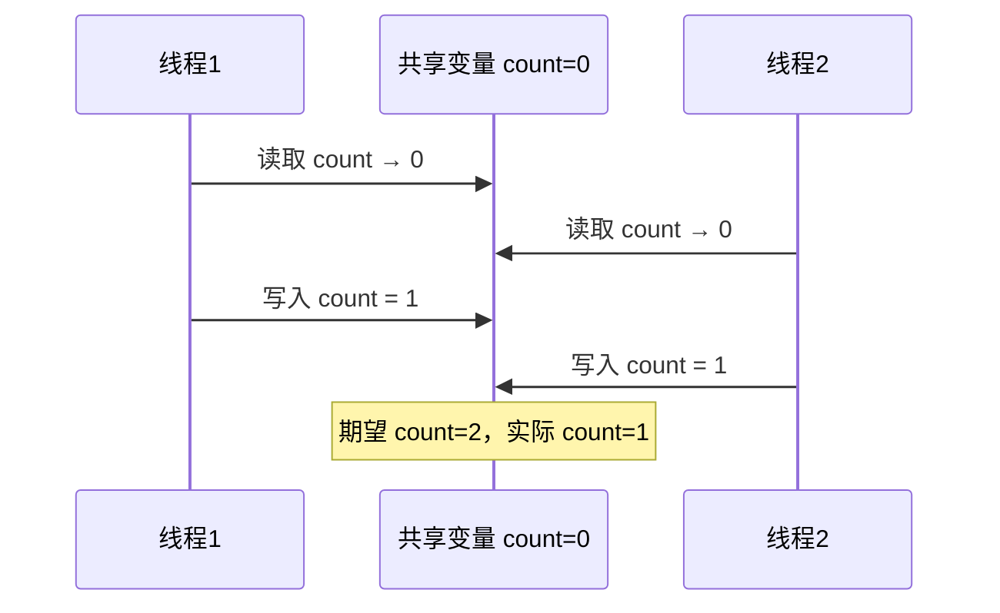
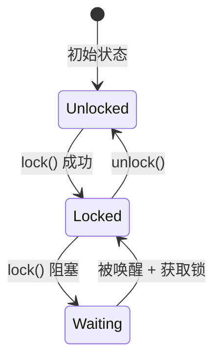
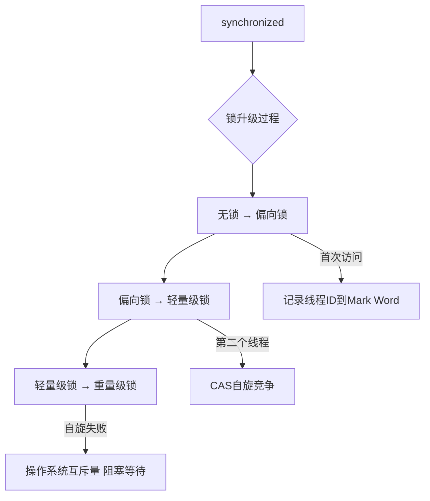
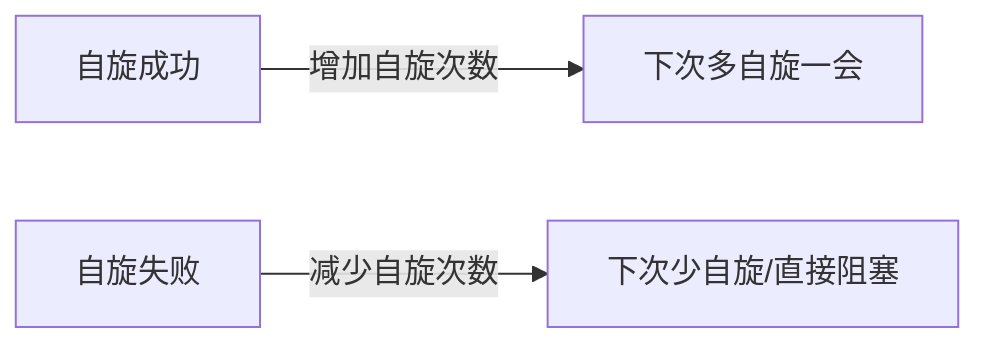
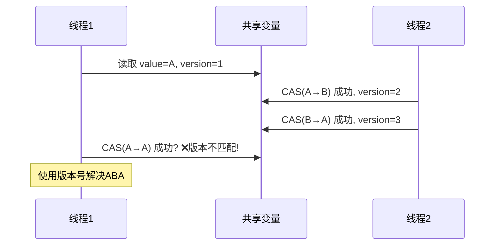

## 锁与同步：并发编程的基石

并发编程的核心挑战是：多个执行流访问共享资源时，如何保证正确性（线程安全）和性能（高并发）。锁与同步机制是解决这一挑战的基础工具。

## 竞态条件与临界区

### 竞态条件（Race Condition）

当多个线程同时访问共享数据，且至少一个线程执行写操作时，结果取决于线程的执行顺序——这就是竞态条件。

```java
// 经典竞态条件：非线程安全的计数器
public class UnsafeCounter {
    private int count = 0;

    public void increment() {
        count++;  // 不是原子操作！
        // 字节码：1) 读取count  2) count+1  3) 写回count
    }
}
```



### 临界区（Critical Section）

临界区是访问共享资源的代码段，必须保证同一时刻只有一个线程进入。

$$
\text{临界区要求} = \underbrace{\text{互斥}}_{\text{同一时刻一个线程}} + \underbrace{\text{前进}}_{\text{有空位则允许进入}} + \underbrace{\text{有限等待}}_{\text{不会饥饿}}
$$

## 互斥锁（Mutex）

互斥锁是最基本的同步原语，保证临界区的互斥访问。

### 实现原理



### Java synchronized

```java
public class SynchronizedExample {

    // 1. 修饰实例方法 - 锁为当前实例
    public synchronized void instanceMethod() {
        // 临界区
    }

    // 2. 修饰静态方法 - 锁为Class对象
    public static synchronized void staticMethod() {
        // 临界区
    }

    // 3. 同步代码块 - 锁为指定对象
    private final Object lock = new Object();

    public void blockMethod() {
        synchronized (lock) {
            // 临界区
        }
    }
}
```

### synchronized 底层实现



| 锁状态 | 适用场景 | 性能 | 实现机制 |
|--------|---------|------|---------|
| 偏向锁 | 单线程重入 | 最高 | Mark Word 记录线程 ID |
| 轻量级锁 | 低竞争 | 高 | CAS 自旋 |
| 重量级锁 | 高竞争 | 低 | 操作系统 mutex，线程阻塞 |

## 读写锁（ReadWriteLock）

读写锁允许并发读、互斥写，适用于读多写少的场景。

```java
public class ReadWriteCache<K, V> {

    private final Map<K, V> cache = new HashMap<>();
    private final ReadWriteLock rwLock = new ReentrantReadWriteLock();
    private final Lock readLock = rwLock.readLock();
    private final Lock writeLock = rwLock.writeLock();

    public V get(K key) {
        readLock.lock();
        try {
            return cache.get(key);
        } finally {
            readLock.unlock();
        }
    }

    public void put(K key, V value) {
        writeLock.lock();
        try {
            cache.put(key, value);
        } finally {
            writeLock.unlock();
        }
    }

    // Java 8+ StampedLock 乐观读
    private final StampedLock stampedLock = new StampedLock();

    public V getOptimistic(K key) {
        long stamp = stampedLock.tryOptimisticRead();
        V value = cache.get(key);
        if (!stampedLock.validate(stamp)) {
            // 乐观读失败，升级为悲观读
            stamp = stampedLock.readLock();
            try {
                value = cache.get(key);
            } finally {
                stampedLock.unlockRead(stamp);
            }
        }
        return value;
    }
}
```

### 读写锁 vs StampedLock

| 特性 | ReentrantReadWriteLock | StampedLock |
|------|----------------------|-------------|
| 乐观读 | 不支持 | 支持 |
| 锁转换 | 不支持 | 支持（读→写） |
| 可重入 | 支持 | 不支持 |
| 公平性 | 可选公平/非公平 | 非公平 |
| 性能 | 中 | 高（乐观读无CAS） |

## 自旋锁

自旋锁在获取锁失败时不阻塞，而是循环重试（自旋），适用于临界区极短的场景。

```java
public class SpinLock {

    private final AtomicReference<Thread> owner = new AtomicReference<>();

    public void lock() {
        Thread current = Thread.currentThread();
        while (!owner.compareAndSet(null, current)) {
            // 自旋等待 - 不释放CPU
            Thread.onSpinWait(); // Java 9+ 提示CPU优化自旋
        }
    }

    public void unlock() {
        Thread current = Thread.currentThread();
        owner.compareAndSet(current, null);
    }
}
```

### 自旋锁优化：适应性自旋

JVM 根据前一次自旋是否成功来动态调整自旋次数：



## 信号量（Semaphore）

信号量控制同时访问某资源的线程数量，比互斥锁更通用——互斥锁是信号量计数为1的特例。

```java
public class ConnectionPool {

    private final Semaphore semaphore;
    private final List<Connection> pool;
    private final AtomicInteger index = new AtomicInteger(0);

    public ConnectionPool(int poolSize) {
        this.semaphore = new Semaphore(poolSize);
        this.pool = new ArrayList<>(poolSize);
        for (int i = 0; i < poolSize; i++) {
            pool.add(createConnection());
        }
    }

    public Connection acquire() throws InterruptedException {
        semaphore.acquire();
        return pool.get(index.getAndIncrement() % pool.size());
    }

    public void release(Connection conn) {
        semaphore.release();
    }
}
```

### 信号量 vs 互斥锁

| 维度 | 信号量 | 互斥锁 |
|------|--------|--------|
| 计数 | N（可配置） | 1 |
| 所有权 | 任意线程释放 | 持有者释放 |
| 用途 | 资源限流 | 互斥访问 |
| 可递归 | 否 | 可（Reentrant） |

## 条件变量（Condition）

条件变量用于线程间的等待/通知机制，必须与锁配合使用。

```java
public class BoundedBuffer<T> {

    private final Queue<T> queue = new LinkedList<>();
    private final int capacity;
    private final ReentrantLock lock = new ReentrantLock();
    private final Condition notFull = lock.newCondition();
    private final Condition notEmpty = lock.newCondition();

    public BoundedBuffer(int capacity) {
        this.capacity = capacity;
    }

    public void put(T item) throws InterruptedException {
        lock.lock();
        try {
            while (queue.size() == capacity) {
                notFull.await(); // 等待非满
            }
            queue.offer(item);
            notEmpty.signal(); // 通知非空
        } finally {
            lock.unlock();
        }
    }

    public T take() throws InterruptedException {
        lock.lock();
        try {
            while (queue.isEmpty()) {
                notEmpty.await(); // 等待非空
            }
            T item = queue.poll();
            notFull.signal(); // 通知非满
            return item;
        } finally {
            lock.unlock();
        }
    }
}
```

### wait/notify vs Condition

| 特性 | wait/notify | Condition |
|------|------------|-----------|
| 条件队列数 | 1个 | 多个 |
| 超时等待 | 支持 | 支持 |
| 不响应中断 | 不支持 | 支持 |
| 精确唤醒 | 不支持 | signal()指定条件 |

## CAS 与 ABA 问题

### CAS（Compare-And-Swap）

CAS 是无锁编程的基础，是一条 CPU 原子指令：

$$
\text{CAS}(V, E, N) = \begin{cases} \text{写入 } N, & \text{if } V = E \\ \text{失败}, & \text{if } V \neq E \end{cases}
$$

```java
// AtomicInteger 底层使用 CAS
public class AtomicIntegerCAS {

    private volatile int value;

    public final int incrementAndGet() {
        return U.getAndAddInt(this, VALUE, 1) + 1;
    }

    // JDK Unsafe 类的 CAS 实现（简化）
    public final boolean compareAndSet(int expect, int update) {
        return unsafe.compareAndSwapInt(this, valueOffset, expect, update);
    }
}
```

### ABA 问题

CAS 只比较值是否相等，无法感知值的变化历史。如果值从 A→B→A，CAS 会认为值没变过：



### ABA 问题的解决方案

```java
// 1. AtomicStampedReference - 带版本号的CAS
AtomicStampedReference<String> ref = new AtomicStampedReference<>("A", 1);

int oldStamp = ref.getStamp();
String oldValue = ref.getReference();

// CAS 时同时比较值和版本号
boolean success = ref.compareAndSet(oldValue, "B", oldStamp, oldStamp + 1);

// 2. AtomicMarkableReference - 布尔标记
AtomicMarkableReference<String> markRef = new AtomicMarkableReference<>("A", false);
```

## 乐观锁 vs 悲观锁

| 维度 | 乐观锁 | 悲观锁 |
|------|--------|--------|
| 思想 | 假设无冲突，冲突时重试 | 假设有冲突，先加锁 |
| 实现 | CAS / 版本号 | synchronized / ReentrantLock |
| 适用场景 | 读多写少，冲突概率低 | 写多，冲突概率高 |
| 性能 | 无锁开销，冲突时重试成本 | 加锁开销，无重试 |
| 饥饿 | 不会 | 可能 |
| ABA问题 | 有 | 无 |

### 数据库乐观锁实现

```sql
-- 乐观锁：版本号方式
UPDATE account
SET balance = balance - 100, version = version + 1
WHERE id = 1 AND version = 5;

-- 乐观锁：条件检查方式
UPDATE product
SET stock = stock - 1
WHERE id = 100 AND stock > 0;
```

## 分布式锁

在分布式系统中，跨进程的互斥需要分布式锁。

### 分布式锁方案对比

| 方案 | 实现复杂度 | 性能 | 可靠性 | 适用场景 |
|------|----------|------|--------|---------|
| Redis SETNX | 低 | 高 | 中（主从切换可能丢锁） | 大部分场景 |
| Redis RedLock | 中 | 中 | 高 | 强一致要求 |
| ZooKeeper | 高 | 低 | 高 | 强一致要求 |
| etcd | 中 | 中 | 高 | K8s生态 |

### Redis 分布式锁

```java
public class RedisDistributedLock {

    private final StringRedisTemplate redisTemplate;
    private static final String UNLOCK_SCRIPT =
        "if redis.call('get', KEYS[1]) == ARGV[1] then " +
        "  return redis.call('del', KEYS[1]) " +
        "else " +
        "  return 0 " +
        "end";

    public String tryLock(String lockKey, long expireSeconds) {
        String requestId = UUID.randomUUID().toString();
        Boolean acquired = redisTemplate.opsForValue()
            .setIfAbsent(lockKey, requestId, Duration.ofSeconds(expireSeconds));

        return Boolean.TRUE.equals(acquired) ? requestId : null;
    }

    public boolean unlock(String lockKey, String requestId) {
        DefaultRedisScript<Long> script = new DefaultRedisScript<>(UNLOCK_SCRIPT, Long.class);
        Long result = redisTemplate.execute(
            script,
            Collections.singletonList(lockKey),
            requestId
        );
        return Long.valueOf(1L).equals(result);
    }
}
```

### ZooKeeper 分布式锁

```mermaid
graph TB
    subgraph ZooKeeper分布式锁
        Root[/lock - 持久节点]
        N1[/lock/seq-0000000001 - 临时有序]
        N2[/lock/seq-0000000002 - 临时有序]
        N3[/lock/seq-0000000003 - 临时有序]
    end

    Root --> N1
    Root --> N2
    Root --> N3

    N1 -->|获取锁| C1[客户端1]
    N2 -->|监听N1| C2[客户端2]
    N3 -->|监听N2| C3[客户端3]
```

```java
public class ZkDistributedLock implements Watcher {

    private final ZooKeeper zk;
    private String lockPath;
    private String currentPath;
    private final CountDownLatch connectedLatch = new CountDownLatch(1);

    public void lock(String path) throws Exception {
        this.lockPath = path;
        // 创建临时有序节点
        currentPath = zk.create(path + "/seq-", new byte[0],
            ZooDefs.Ids.OPEN_ACL_UNSAFE,
            CreateMode.EPHEMERAL_SEQUENTIAL);

        // 尝试获取锁
        while (true) {
            List<String> children = zk.getChildren(path, false);
            Collections.sort(children);

            String currentNode = currentPath.substring(path.length() + 1);
            int currentIndex = children.indexOf(currentNode);

            if (currentIndex == 0) {
                return; // 获取锁成功
            }

            // 监听前一个节点
            String prevNode = path + "/" + children.get(currentIndex - 1);
            final CountDownLatch waitLatch = new CountDownLatch(1);
            Stat stat = zk.exists(prevNode, event -> {
                if (event.getType() == Event.EventType.NodeDeleted) {
                    waitLatch.countDown();
                }
            });

            if (stat == null) {
                continue; // 前节点已删除，重试
            }
            waitLatch.await();
        }
    }
}
```

## 面试 Q&A

**Q1：synchronized 和 ReentrantLock 有什么区别？**

A：核心区别：(1) **实现层面**：synchronized 是 JVM 内置关键字，ReentrantLock 是 API 层面的类；

(2) **锁获取**：synchronized 自动获取释放，ReentrantLock 需手动 lock/unlock（必须在 finally 中释放）；

(3) **可中断**：synchronized 不可中断，ReentrantLock 支持 lockInterruptibly()；

(4) **公平性**：synchronized 非公平，ReentrantLock 可选公平/非公平；

(5) **条件变量**：synchronized 只有一个 wait/notify，ReentrantLock 支持多个 Condition；

(6) **锁升级**：synchronized 有偏向锁→轻量级锁→重量级锁的升级过程，ReentrantLock 始终基于 CAS。

除非需要高级特性（可中断、公平锁、多条件），否则优先使用 synchronized。

**Q2：什么场景用自旋锁，什么场景用阻塞锁？**

A：核心判断标准是**临界区的执行时间**。如果临界区极短（几十个时钟周期，如简单计数器递增），自旋锁更优——避免了线程上下文切换的开销（约1-10微秒）。如果临界区较长（涉及IO、复杂计算），自旋锁会浪费CPU时间，应使用阻塞锁让出CPU。JVM 的适应性自旋锁会根据历史成功率动态调整：自旋成功率高则多自旋，成功率低则直接阻塞。

**Q3：CAS 有什么缺点？如何解决？**

A：三大缺点：(1) **ABA 问题**：值从A→B→A，CAS认为没变。

解决：AtomicStampedReference 带版本号；

(2) **自旋开销**：高竞争下CAS不断重试消耗CPU。

解决：退化为互斥锁，或使用 LongAdder 分散竞争；

(3) **只能单变量原子操作**：CAS只能保证一个变量的原子性。

解决：将多个变量封装为一个对象，用 AtomicReference 做 CAS。

**Q4：Redis 分布式锁在主从切换时为什么会丢锁？RedLock 如何解决？**

A：客户端在主节点获取锁后，主节点尚未将锁数据同步到从节点就宕机了，从节点升为主节点后没有锁记录，其他客户端可以再次获取锁——这就是丢锁。RedLock 的方案是向 N 个独立 Redis 实例同时获取锁，只有超过半数（N/2+1）获取成功才算真正持有锁，且总获取时间不能超过锁的过期时间。RedLock 的代价是性能降低（需要多次网络往返），且仍有争议（见 Martin Kleppmann 的反驳）。

对于大部分业务场景，单 Redis 实例 + 合理的超时时间已经足够。

**Q5：如何选择分布式锁方案？**

A：按需求分层选择：(1) **大部分场景**：Redis SETNX + 过期时间 + Lua 释放脚本，简单高效；

(2) **强一致性要求**（如金融扣款）：ZooKeeper 临时有序节点，利用 ZK 的 ZAB 协议保证一致性；

(3) **极高并发**：考虑 RedLock 或 etcd，但需评估性能损耗；

(4) **短时锁**：数据库乐观锁（版本号）可能比分布式锁更合适。

关键原则：**锁的粒度尽量小、持有时间尽量短、必须有超时机制**。
