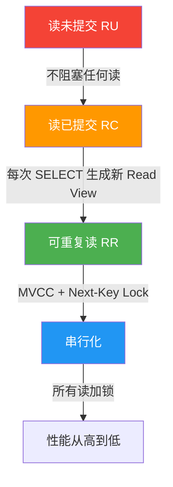
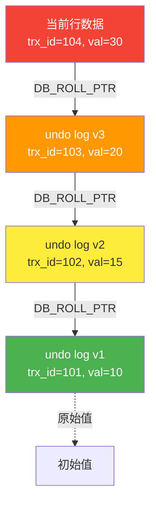
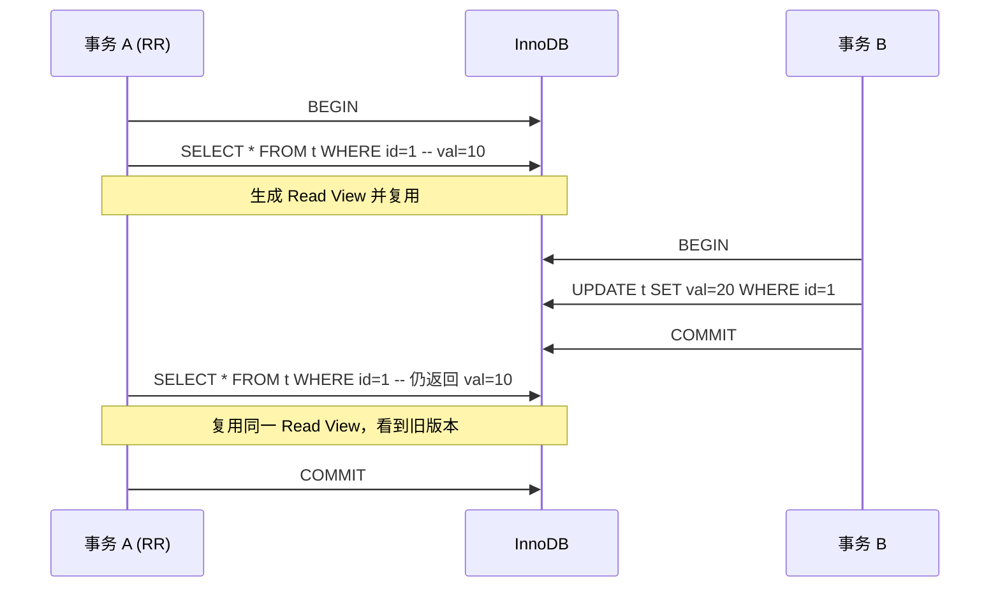
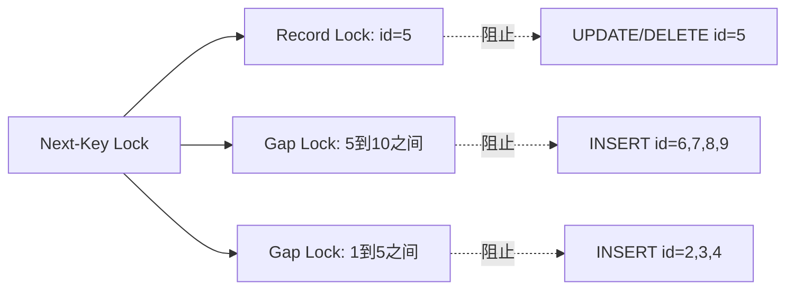
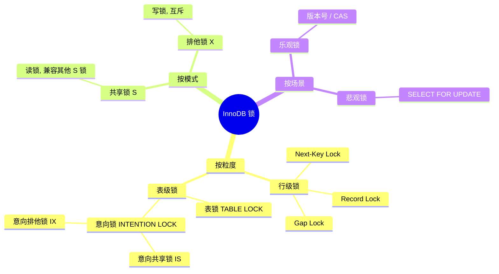
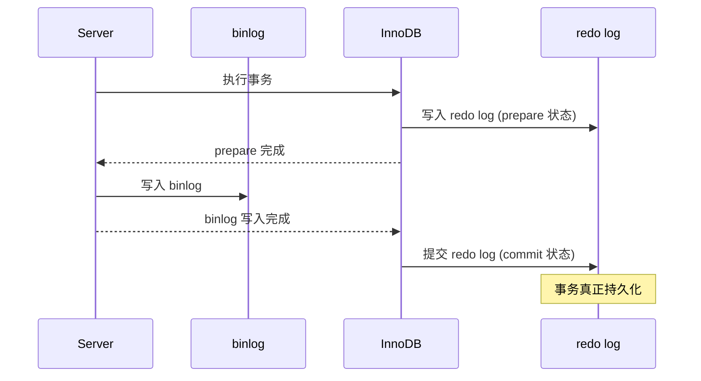

## 引言

事务是数据库系统中最核心的概念之一，它保证了数据的一致性和可靠性。理解事务的 ACID 特性、隔离级别、MVCC 和锁机制，是每一个后端工程师的必修课。本文将从底层原理出发，深入剖析 InnoDB 引擎如何实现事务与并发控制。

## 事务的 ACID 特性

ACID 是事务的四个基本特性，InnoDB 通过不同的机制分别保证它们。

| 特性 | 含义 | 实现机制 |
|------|------|---------|
| **A - 原子性（Atomicity）** | 事务要么全部提交，要么全部回滚 | undo log（回滚日志） |
| **C - 一致性（Consistency）** | 事务前后数据状态保持一致 | 由 A + I + D 共同保证 |
| **I - 隔离性（Isolation）** | 并发事务之间互不干扰 | 锁 + MVCC |
| **D - 持久性（Durability）** | 事务提交后数据永久保存 | redo log（重做日志） |

### undo log 与原子性

当执行 `UPDATE`、`DELETE`、`INSERT` 时，InnoDB 会先将旧值记录到 undo log 中。如果事务需要回滚，利用 undo log 恢复数据到修改前的状态。

```sql
-- 假设执行以下操作
BEGIN;
UPDATE accounts SET balance = balance - 100 WHERE id = 1;
UPDATE accounts SET balance = balance + 100 WHERE id = 2;
ROLLBACK;
-- undo log 中记录了每条 UPDATE 的旧值，回滚时反向操作
```

### redo log 与持久性

redo log 是 InnoDB 特有的物理日志，记录的是**数据页的物理修改**。它采用**WAL（Write-Ahead Logging）**策略：先写日志，再写磁盘数据页。


```sql
-- 控制 redo log 刷盘策略
-- 0：每秒刷盘，性能最高，丢失最多1秒数据
-- 1（默认）：每次事务提交刷盘，最安全
-- 2：每次提交写入 OS cache，每秒刷盘
SET GLOBAL innodb_flush_log_at_trx_commit = 1;
```

> **redo log vs binlog 的区别**：
> - redo log 是 InnoDB 引擎层的物理日志，循环写入
> - binlog 是 Server 层的逻辑日志，追加写入，用于主从复制
> - 两阶段提交保证了 redo log 和 binlog 的一致性

## 四种隔离级别与并发问题

### 并发问题一览

| 隔离级别 | 脏读 | 不可重复读 | 幻读 |
|---------|------|-----------|------|
| 读未提交（RU） | 可能发生 | 可能发生 | 可能发生 |
| 读已提交（RC） | **已解决** | 可能发生 | 可能发生 |
| 可重复读（RR） | **已解决** | **已解决** | **大部分解决** |
| 串行化（Serializable） | **已解决** | **已解决** | **已解决** |



### 问题定义

- **脏读（Dirty Read）**：读到其他事务**未提交**的修改
- **不可重复读（Non-repeatable Read）**：同一事务内两次读到同一行，结果不同（其他事务 UPDATE/DELETE 并提交）
- **幻读（Phantom Read）**：同一事务内两次查询，第二次出现了新的行（其他事务 INSERT 并提交）

### InnoDB 默认隔离级别

MySQL InnoDB 默认的隔离级别是 **REPEATABLE READ（可重复读）**，这是与其他主流数据库（如 PostgreSQL、Oracle 默认 RC）不同的地方。

```sql
-- 查看当前隔离级别
SELECT @@transaction_isolation;

-- 设置隔离级别（全局 / 会话）
SET GLOBAL transaction_isolation = 'REPEATABLE-READ';
SET SESSION transaction_isolation = 'READ-COMMITTED';
```

## MVCC（多版本并发控制）深入解析

MVCC 是 InnoDB 实现高并发读写的核心技术，它让**读操作不需要加锁**，从而实现了读写不冲突。

### 隐藏列

InnoDB 的每行记录都包含几个隐藏列：

| 隐藏列 | 说明 |
|--------|------|
| `DB_TRX_ID` | 最后一次修改该行的事务 ID |
| `DB_ROLL_PTR` | 回滚指针，指向 undo log 中的历史版本 |
| `DB_ROW_ID` | 隐藏主键（没有显式主键时自动生成） |

### undo log 版本链

每次修改数据，都会在 undo log 中创建一个历史版本，通过 `DB_ROLL_PTR` 串联起来，形成一条版本链。



### Read View 机制

当事务执行快照读（普通 SELECT）时，InnoDB 会生成一个 **Read View**，包含以下信息：

| 字段 | 含义 |
|------|------|
| `m_ids` | 活跃事务 ID 列表 |
| `min_trx_id` | m_ids 中最小的事务 ID |
| `max_trx_id` | 分配给下一个事务的 ID |
| `creator_trx_id` | 创建 Read View 的事务 ID |

**可见性判断规则**：

```
if trx_id < min_trx_id:
    可见（事务已提交）
elif trx_id >= max_trx_id:
    不可见（事务尚未开始）
elif trx_id in m_ids:
    if trx_id == creator_trx_id:
        可见（自己修改的）
    else:
        不可见（其他活跃事务修改的）
else:
    可见（事务已提交）
```

### RC 和 RR 的关键区别

| 对比项 | RC（读已提交） | RR（可重复读） |
|--------|---------------|---------------|
| Read View 生成时机 | 每次 SELECT 都生成 | 第一次 SELECT 生成，后续复用 |
| 看到的数据 | 总是最新已提交 | 事务开始时的快照 |
| 不可重复读 | 可能发生 | 不会发生 |



## InnoDB 的 RR 级别如何解决幻读

在 RR 级别下，InnoDB 通过 **MVCC + Next-Key Lock** 的组合来解决幻读问题。

### 快照读 vs 当前读

| 类型 | SQL 示例 | 使用机制 |
|------|---------|---------|
| **快照读** | `SELECT ...`（普通查询） | MVCC（Read View） |
| **当前读** | `SELECT ... FOR UPDATE`、`SELECT ... LOCK IN SHARE MODE` | 加锁（Next-Key Lock） |
| **当前读** | `UPDATE ...`、`DELETE ...`、`INSERT ...` | 加锁（Next-Key Lock） |

**幻读只可能在当前读中出现**，因为快照读通过 MVCC 天然避免了幻读。

### Next-Key Lock = Record Lock + Gap Lock

- **Record Lock**：锁定单行记录
- **Gap Lock**：锁定记录之间的间隙，防止其他事务在该范围内插入
- **Next-Key Lock**：Record Lock + Gap Lock，锁定记录及其前面的间隙

```sql
-- 假设表中有 id = 1, 5, 10, 20 的记录
-- 执行：SELECT * FROM t WHERE id = 5 FOR UPDATE;

-- Next-Key Lock 会锁定区间: (1, 5] 和 (5, 10)
-- 其他事务无法 INSERT id = 6, 7, 8, 9
-- 其他事务无法 UPDATE/DELETE id = 5
```



> **注意**：当查询条件是唯一索引（UNIQUE / PRIMARY KEY）时，InnoDB 会退化为 Record Lock，因为不会出现幻读。

## 锁机制详解

### 锁的分类



### 意向锁（Intention Lock）

意向锁是**表级锁**，用于快速判断表中是否有行锁。在获取行锁之前，InnoDB 会自动获取意向锁。

| 意向锁 | 含义 | 兼容关系 |
|--------|------|---------|
| **IS** | 事务打算在行上加 S 锁 | 与 IS、IX 兼容 |
| **IX** | 事务打算在行上加 X 锁 | 与 IS、IX 兼容 |

**锁兼容性矩阵**：

| | IS | IX | S | X |
|---|----|----|---|---|
| **IS** | ✓ | ✓ | ✓ | ✗ |
| **IX** | ✓ | ✓ | ✗ | ✗ |
| **S** | ✓ | ✗ | ✓ | ✗ |
| **X** | ✗ | ✗ | ✗ | ✗ |

```sql
-- SELECT ... LOCK IN SHARE MODE  → 先加 IS 表锁，再加行 S 锁
-- SELECT ... FOR UPDATE          → 先加 IX 表锁，再加行 X 锁
-- UPDATE / DELETE / INSERT       → 先加 IX 表锁，再加行 X 锁

-- 表级 S 锁与意向锁的冲突可以快速判断：
-- 如果表上有 IX 锁（说明有行级 X 锁），则无法加表级 S 锁
```

### Gap Lock 的触发条件

| 条件 | 是否加 Gap Lock |
|------|----------------|
| 唯一索引等值查询（记录存在） | 不加，退化为 Record Lock |
| 唯一索引等值查询（记录不存在） | 加 Gap Lock |
| 普通索引范围查询 | 加 Next-Key Lock |
| 唯一索引范围查询 | 加 Next-Key Lock |

## 死锁检测与解决

### 死锁产生的条件

1. **互斥**：资源同时只能被一个事务占用
2. **持有并等待**：事务持有资源的同时等待其他资源
3. **不可剥夺**：资源不能被强制剥夺
4. **循环等待**：存在事务等待环

### wait-for graph 检测

InnoDB 使用**等待图（wait-for graph）**来检测死锁。当发现环路时，回滚代价最小的事务（undo log 最少的）。


```sql
-- 模拟死锁
-- 事务 T1:
BEGIN;
UPDATE accounts SET balance = balance - 100 WHERE id = 1;  -- 锁 id=1
-- 等待 id=2 的锁...

-- 事务 T2:
BEGIN;
UPDATE accounts SET balance = balance - 200 WHERE id = 2;  -- 锁 id=2
UPDATE accounts SET balance = balance + 200 WHERE id = 1;  -- 等待 id=1 的锁 → 死锁

-- 查看死锁信息
SHOW ENGINE INNODB STATUS\G
```

### 死锁预防策略

| 策略 | 说明 | 实现方式 |
|------|------|---------|
| **设置锁等待超时** | 等待超时自动回滚 | `innodb_lock_wait_timeout = 50` |
| **开启死锁检测** | 主动检测并回滚 | `innodb_deadlock_detect = ON`（默认） |
| **固定加锁顺序** | 按主键顺序加锁 | 应用层规范 |
| **一次性加锁** | 事务开始时获取所有锁 | 两阶段锁协议 |

## 两阶段锁协议（2PL）

两阶段锁协议（Two-Phase Locking）是保证事务可串行化的经典协议：


- **扩展阶段**：事务可以获取锁，但不能释放任何锁
- **收缩阶段**：事务可以释放锁，但不能再获取任何新锁

> InnoDB 实际上是在事务**提交或回滚时才释放锁**，这满足了 2PL 的要求。

## 两阶段提交（2PC）与分布式事务

### redo log 与 binlog 的一致性

在 MySQL 中，redo log（引擎层）和 binlog（Server 层）需要保持一致性，这通过**两阶段提交**实现：



**为什么需要 2PC？**

- 如果先写 binlog 再写 redo log：MySQL 崩溃后，binlog 中有记录但 redo log 中没有，主从数据不一致
- 如果先写 redo log 再写 binlog：MySQL 崩溃后，redo log 已提交但 binlog 丢失，主从数据不一致

### XA 分布式事务

XA 协议实现了跨多个数据库的分布式事务：

```sql
-- XA 事务示例
XA START 'tx1';
UPDATE db1.accounts SET balance = balance - 100 WHERE id = 1;
XA END 'tx1';
XA PREPARE 'tx1';

-- 协调者确认所有参与者 prepare 成功后
XA COMMIT 'tx1';
-- 或回滚
-- XA ROLLBACK 'tx1';
```

| 阶段 | 说明 |
|------|------|
| **Prepare** | 各参与者执行操作并写 undo/redo，但不提交 |
| **Commit** | 协调者确认所有参与者 prepare 成功，下发 commit |
| **Rollback** | 任一参与者失败，协调者下发 rollback |

> **分布式事务的性能代价**：2PC 需要多轮网络通信和多次磁盘刷写，在高并发场景下应谨慎使用。可以考虑 TCC、Saga、本地消息表等替代方案。

## 面试 Q&A

### Q1：MySQL InnoDB 的默认隔离级别是什么？为什么选这个？

**答**：默认隔离级别是 **REPEATABLE READ（可重复读）**。原因：
1. RR 比 RC 更强的一致性保证，避免不可重复读
2. InnoDB 在 RR 下通过 MVCC 已经解决了大部分幻读问题
3. 历史原因：早期 MySQL 版本的选择，向后兼容

### Q2：MVCC 是如何实现的？

**答**：MVCC 通过三个核心组件实现：
1. **隐藏列**：`DB_TRX_ID`（事务 ID）和 `DB_ROLL_PTR`（回滚指针）
2. **undo log 版本链**：记录数据的历史版本
3. **Read View**：事务执行快照读时生成的视图，包含活跃事务列表，用于判断版本可见性

### Q3：RR 级别下还会出现幻读吗？

**答**：在**快照读**（普通 SELECT）下不会幻读，因为 MVCC 保证了事务看到一致的快照。但在**当前读**（`SELECT ... FOR UPDATE`、`UPDATE`、`DELETE`）下，如果没有 Next-Key Lock，仍可能幻读。InnoDB 通过 MVCC + Next-Key Lock 的组合来解决这个问题。

### Q4：Gap Lock 有什么副作用？

**答**：
1. 阻塞其他事务在该间隙中 INSERT，降低并发度
2. 可能导致更多的死锁
3. 在某些场景下（如批量插入）会显著影响性能
4. 在 RC 级别下不会使用 Gap Lock，因此并发度更高

### Q5：死锁发生时，InnoDB 如何选择回滚哪个事务？

**答**：InnoDB 会选择**回滚代价最小**的事务。代价的衡量标准通常是该事务已经执行的 undo log 数量（即修改的数据量）。被回滚的事务会收到 `Deadlock found when trying to get lock` 错误。

### Q6：两阶段提交中，如果 binlog 写完后 MySQL 崩溃，如何恢复？

**答**：MySQL 启动时会检查 redo log：
- 如果 redo log 处于 `prepare` 状态：检查 binlog 是否完整
  - binlog 完整 → 提交事务（redo log 转为 commit）
  - binlog 不完整 → 回滚事务
- 如果 redo log 处于 `commit` 状态：直接提交

> 这个恢复逻辑确保了即使崩溃，redo log 和 binlog 也能保持一致。

## 总结

事务与并发控制是数据库系统的核心，理解这些机制对于编写高性能、高可靠的数据库应用至关重要。关键要点：

1. **undo log 保证原子性，redo log 保证持久性**
2. **MVCC 实现读写不冲突，是 InnoDB 高并发的核心**
3. **RR 级别下通过 MVCC + Next-Key Lock 解决幻读**
4. **锁粒度从细到粗：Record Lock → Gap Lock → Next-Key Lock → 表锁**
5. **2PC 保证了跨组件的一致性，但有性能代价**

> 在实际开发中，优先使用默认 RR 级别，合理设计索引减少锁竞争，避免长事务，这才是提升并发性能的关键。
