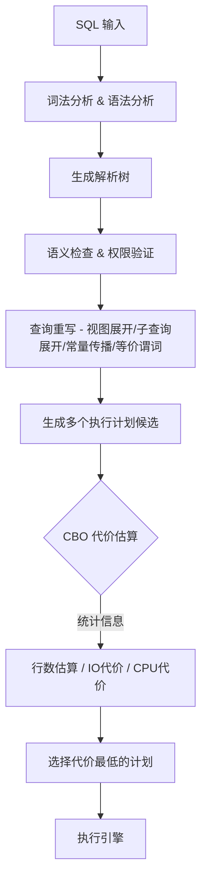
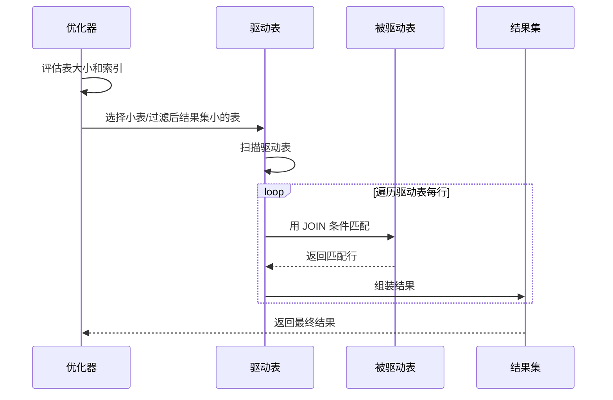
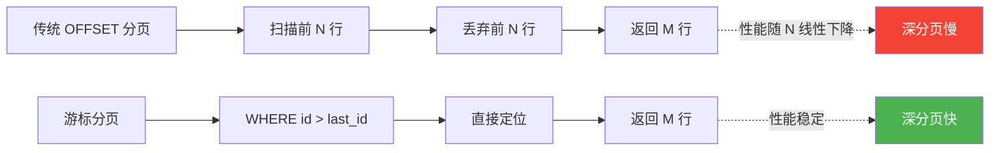
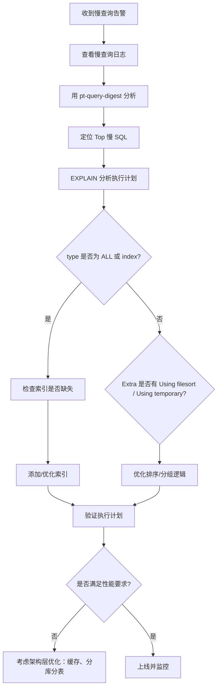

## 引言

在实际工程项目中，慢查询是导致数据库性能下降的最常见原因之一。一条糟糕的 SQL 可能让一个本来设计精良的系统变得缓慢不堪。本文将从查询优化器原理出发，结合执行计划分析，系统地讲解 SQL 查询优化的核心知识。

## 查询优化器：CBO vs RBO

数据库在执行 SQL 之前，需要经过**解析**、**优化**和**执行**三个阶段。其中优化阶段的核心组件就是查询优化器（Query Optimizer）。

### 两种优化策略

| 对比维度 | RBO（基于规则） | CBO（基于代价） |
|---------|----------------|----------------|
| 决策依据 | 预定义的启发式规则 | 统计信息 + 代价估算模型 |
| 灵活性 | 低，规则固定 | 高，根据数据分布动态调整 |
| 数据感知 | 不关心数据量和分布 | 依赖表统计信息（行数、索引基数等） |
| 典型场景 | Oracle 早期版本 | MySQL、现代 Oracle、PostgreSQL |

MySQL 的 InnoDB 引擎使用的是 **CBO（Cost-Based Optimizer）**，优化器会根据统计信息计算每种执行计划的代价（Cost），选择代价最小的方案。

```sql
-- 查看表的统计信息（MySQL 8.0+）
SELECT * FROM mysql.innodb_table_stats WHERE table_name = 'orders';
SELECT * FROM mysql.innodb_index_stats WHERE table_name = 'orders';
```

### 优化流程



## EXPLAIN 输出详解

`EXPLAIN` 是 SQL 优化的第一把手术刀，它能展示 MySQL 优化器选择的执行计划。

### 核心字段含义

```sql
EXPLAIN SELECT o.order_no, c.name
FROM orders o
JOIN customers c ON o.customer_id = c.id
WHERE o.status = 'PAID'
  AND o.create_time > '2025-01-01'
ORDER BY o.create_time DESC
LIMIT 20;
```

| 字段 | 含义 | 关键值 |
|------|------|--------|
| **id** | 查询编号，表示 SELECT 子句的执行顺序 | id 越大越先执行；id 相同从上到下 |
| **select_type** | 查询类型 | SIMPLE（简单查询）、PRIMARY、UNION、SUBQUERY、DERIVED |
| **table** | 访问的表名 | 使用别名时显示别名 |
| **type** | 访问类型（性能从高到低） | system > const > eq_ref > ref > range > index > ALL |
| **possible_keys** | 可能使用的索引 | NULL 表示无可用索引 |
| **key** | 实际使用的索引 | 优化器的最终选择 |
| **key_len** | 索引使用的字节数 | 用于判断联合索引使用了几个列 |
| **ref** | 与索引比较的列或常量 | const、字段名、func |
| **rows** | 预估扫描的行数 | 基于统计信息估算，非精确值 |
| **Extra** | 附加信息 | Using index / Using where / Using filesort / Using temporary |

### type 访问类型详解


- **system**：表只有一行记录（const 的特例）
- **const**：通过主键或唯一索引等值查询，最多返回一行
- **eq_ref**：JOIN 时使用主键或唯一索引，每行匹配唯一一行
- **ref**：普通索引等值查询
- **range**：索引范围扫描（BETWEEN、>、<、IN）
- **index**：全索引扫描
- **ALL**：全表扫描（应尽量避免）

### Extra 关键信息

| Extra 值 | 含义 | 是否关注 |
|---------|------|---------|
| `Using index` | 覆盖索引，无需回表 | 优 |
| `Using where` | 存储层返回后在上层过滤 | 正常 |
| `Using filesort` | 无法利用索引排序，需要额外排序 | 需要优化 |
| `Using temporary` | 使用临时表（GROUP BY/DISTINCT） | 需要优化 |
| `Using index condition` | 索引下推（ICP） | 优 |
| `Using join buffer` | 使用了 Join Buffer（嵌套循环优化） | 关注 |

## 索引优化实战

### 联合索引与最左前缀原则

联合索引 `(a, b, c)` 本质上是在 B+ 树中按照 `a → b → c` 的顺序排序。这决定了**最左前缀原则**：

```sql
-- 表结构
CREATE TABLE user_orders (
    id BIGINT PRIMARY KEY AUTO_INCREMENT,
    user_id BIGINT NOT NULL,
    status VARCHAR(20) NOT NULL,
    amount DECIMAL(10,2),
    create_time DATETIME NOT NULL,
    INDEX idx_user_status_time (user_id, status, create_time)
);

-- 能用索引
EXPLAIN SELECT * FROM user_orders WHERE user_id = 100;                    -- 使用 (user_id)
EXPLAIN SELECT * FROM user_orders WHERE user_id = 100 AND status = 'PAID'; -- 使用 (user_id, status)
EXPLAIN SELECT * FROM user_orders WHERE user_id = 100 AND create_time > '2025-01-01'; -- 使用 (user_id)，但 create_time 只能用于过滤

-- 不能用索引（跳过了 status）
EXPLAIN SELECT * FROM user_orders WHERE status = 'PAID';                 -- 全表扫描
EXPLAIN SELECT * FROM user_orders WHERE create_time > '2025-01-01';      -- 全表扫描
```

> **关键理解**：联合索引 `(a, b, c)` 可以等价于创建了三个索引：`(a)`、`(a, b)`、`(a, b, c)`。MySQL 8.0+ 引入了**索引跳跃扫描（Index Skip Scan）**，在特定条件下可以突破最左前缀限制。

### 覆盖索引（Covering Index）

当查询的所有列都包含在索引中时，无需回表到聚簇索引查询数据，这就是**覆盖索引**。

```sql
-- 覆盖索引：查询列全部在联合索引中
EXPLAIN SELECT user_id, status, create_time
FROM user_orders
WHERE user_id = 100 AND status = 'PAID';
-- Extra: Using index

-- 需要回表：amount 不在联合索引中
EXPLAIN SELECT user_id, status, amount
FROM user_orders
WHERE user_id = 100;
-- Extra: Using where（需回表查询 amount）
```

### 索引选择性

索引的选择性 = `COUNT(DISTINCT col) / COUNT(*)`。选择性越高，索引过滤效果越好。

```sql
-- 计算列的选择性
SELECT COUNT(DISTINCT user_id) / COUNT(*) AS selectivity
FROM user_orders;

-- 选择性低的列（如 status 只有几个枚举值）不适合单独建索引
-- 但可以作为联合索引的后续列
```

### 索引下推（ICP - Index Condition Pushdown）

MySQL 5.6 引入的优化。将原本需要在 Server 层进行的过滤条件下推到存储引擎层，减少回表次数。


```sql
-- 联合索引 (name, age)
-- 查询：WHERE name LIKE '张%' AND age > 20
-- 无 ICP：按 name 前缀取出所有行 → 回表 → Server 层过滤 age > 20
-- 有 ICP：按 name 前缀取出时，在引擎层同时判断 age > 20 → 减少回表

EXPLAIN SELECT * FROM users WHERE name LIKE '张%' AND age > 20;
-- Extra: Using index condition 表示使用了 ICP
```

## JOIN 优化

### JOIN 算法对比

| 算法 | 适用场景 | 复杂度 | MySQL 支持情况 |
|------|---------|--------|---------------|
| **Nested Loop Join (NLJ)** | 小表驱动大表，驱动表有索引 | O(M × logN) | MySQL 默认 |
| **Block Nested Loop (BNL)** | 驱动表无可用索引 | O(M × N) | MySQL 降级方案 |
| **Hash Join** | 等值连接，内存充足 | O(M + N) | MySQL 8.0.18+ |
| **Sort Merge Join** | 非等值连接，已排序数据 | O(MlogM + NlogN) | MySQL 不直接使用 |

### 驱动表选择原则

CBO 选择驱动表的核心原则：**让结果集尽可能小的表作为驱动表**。

```sql
-- customers 1000 行，orders 100000 行
EXPLAIN SELECT c.name, o.order_no
FROM customers c
JOIN orders o ON c.id = o.customer_id
WHERE c.status = 'ACTIVE';
```

MySQL 8.0 引入 **Hash Join** 后，对于大表等值连接，性能有显著提升：

```sql
-- 开启/关闭 Hash Join
SET optimizer_switch = 'hash_join=on';   -- 默认开启
SET optimizer_switch = 'hash_join=off';  -- 强制使用 NLJ
```



## 子查询优化

### EXISTS vs IN 的选择

```sql
-- 场景1：子查询结果集小，用 IN
SELECT * FROM orders
WHERE customer_id IN (SELECT id FROM customers WHERE city = '北京');
-- 优化器通常会将 IN 子查询转为 Semi Join

-- 场景2：外表小、子查询表大，用 EXISTS
SELECT * FROM customers c
WHERE EXISTS (
    SELECT 1 FROM orders o
    WHERE o.customer_id = c.id AND o.amount > 1000
);
```

| 策略 | 执行方式 | 适用场景 |
|------|---------|---------|
| **IN** | 先执行子查询，结果集放入内存 | 子查询结果集小 |
| **EXISTS** | 遍历外表，逐行检查子查询是否存在 | 外表小，子查询表大 |
| **MySQL 8.0+** | 大多数情况自动优化为 Semi Join，两者差异不大 | 无需过度关注 |

### 物化优化

MySQL 会对子查询进行**物化（Materialization）**：将子查询结果存储到临时表中，避免重复执行。

```sql
-- 子查询物化后只执行一次
SELECT * FROM orders
WHERE customer_id IN (
    SELECT id FROM vip_customers  -- 结果物化到临时表
);
```

## 分页优化

### OFFSET 大值问题

```sql
-- 问题 SQL：OFFSET 很大时，MySQL 需要扫描并丢弃大量行
SELECT * FROM orders ORDER BY id LIMIT 1000000, 10;
-- 实际上扫描了 1000010 行，丢弃前 1000000 行
```

### 方案一：延迟关联（子查询 + JOIN）

```sql
-- 先通过覆盖索引定位主键，再回表获取完整数据
SELECT o.*
FROM orders o
INNER JOIN (
    SELECT id FROM orders ORDER BY id LIMIT 1000000, 10
) AS t ON o.id = t.id;
```

### 方案二：游标分页（推荐）

```sql
-- 记录上一页最后一条的 id，下一页从该 id 之后开始
SELECT * FROM orders
WHERE id > 1000000  -- 上一页最后一条的 id
ORDER BY id
LIMIT 10;
-- 这种方式无论翻到第几页，性能都稳定
```



## GROUP BY 与 ORDER BY 优化

### 利用索引消除排序

```sql
-- 表结构
CREATE TABLE articles (
    id BIGINT PRIMARY KEY,
    category_id INT,
    author_id INT,
    views INT,
    INDEX idx_cat_author (category_id, author_id)
);

-- GROUP BY 利用索引（Using index for group-by）
EXPLAIN SELECT category_id, author_id, COUNT(*)
FROM articles
GROUP BY category_id, author_id;

-- ORDER BY 利用索引
EXPLAIN SELECT * FROM articles
WHERE category_id = 1
ORDER BY author_id;
-- 如果 WHERE 条件使用了联合索引的前缀列，后续列可用于排序
```

### 临时表优化

当 GROUP BY 无法使用索引时，MySQL 会使用临时表：

```sql
-- 产生临时表
EXPLAIN SELECT status, COUNT(*) FROM orders GROUP BY status;
-- Extra: Using temporary

-- 优化：为 GROUP BY 的列加索引
CREATE INDEX idx_status ON orders(status);
```

## 慢查询日志分析与调优流程

### 开启慢查询日志

```sql
-- 开启慢查询日志
SET GLOBAL slow_query_log = 'ON';
SET GLOBAL slow_query_log_file = '/var/log/mysql/slow.log';
SET GLOBAL long_query_time = 1;        -- 超过 1 秒的查询记录
SET GLOBAL log_queries_not_using_indexes = 'ON';  -- 记录未使用索引的查询
```

### 分析工具

```bash
# mysqldumpslow：MySQL 自带
mysqldumpslow -s t -t 10 /var/log/mysql/slow.log  # 按时间排序，取 top 10
mysqldumpslow -s c -t 10 /var/log/mysql/slow.log  # 按调用次数排序

# pt-query-digest：Percona 工具（推荐）
pt-query-digest /var/log/mysql/slow.log
```

### 调优流程图



## 面试 Q&A

### Q1：EXPLAIN 中的 rows 字段是精确值吗？

**答**：不是精确值。`rows` 是优化器基于统计信息估算的扫描行数。由于统计信息是通过采样更新的（`innodb_stats_on_metadata`），可能存在偏差。可以使用 `ANALYZE TABLE table_name` 更新统计信息。

### Q2：什么情况下索引会失效？

**答**：常见场景包括：
- 对索引列使用函数或表达式：`WHERE YEAR(create_time) = 2025`
- 隐式类型转换：`WHERE phone = 13800000000`（phone 是 VARCHAR）
- 模糊查询左匹配：`WHERE name LIKE '%张'`
- OR 条件中有一个列无索引
- 联合索引违反最左前缀原则
- 使用 `!=` 或 `<>` 时可能走全表扫描

### Q3：覆盖索引一定比普通索引快吗？

**答**：不一定。覆盖索引避免了回表，但如果覆盖索引包含的列过多，会导致索引体积变大，影响内存命中率和写入性能。需要根据查询模式权衡。

### Q4：如何优化一个千万级大表的分页查询？

**答**：
1. 使用游标分页替代 OFFSET/LIMIT
2. 使用延迟关联（子查询先定位主键）
3. 考虑业务层面的优化：限制最大翻页数、提供跳转到指定页时要求必须输入条件
4. 极端情况考虑 Elasticsearch 等搜索引擎

### Q5：JOIN 查询一定比子查询快吗？

**答**：不一定。MySQL 5.6 之前子查询优化较弱，JOIN 通常更快。但 MySQL 8.0 之后，优化器可以将子查询转换为 Semi Join、物化等策略，性能差异不大。关键还是看执行计划和索引。

### Q6：MySQL 的 Hash Join 有什么限制？

**答**：
- 仅支持等值连接（`=`）
- 不支持非等值连接（`<`、`>`、`BETWEEN`）
- 需要 MySQL 8.0.18+
- 大表 Join 时需要足够的内存，否则会落盘

## 总结

SQL 查询优化是一个系统性工程，需要理解优化器的工作原理、掌握执行计划的解读方法，并积累索引优化的实战经验。核心思路是：

1. **用 EXPLAIN 定位问题**：关注 type、key、rows、Extra
2. **善用索引**：联合索引、覆盖索引、索引下推
3. **避免深分页**：游标分页优于 OFFSET
4. **持续监控**：慢查询日志 + 定期分析

> 优化的黄金法则：**先测量，再优化，用数据说话。**
