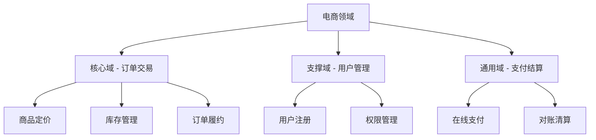
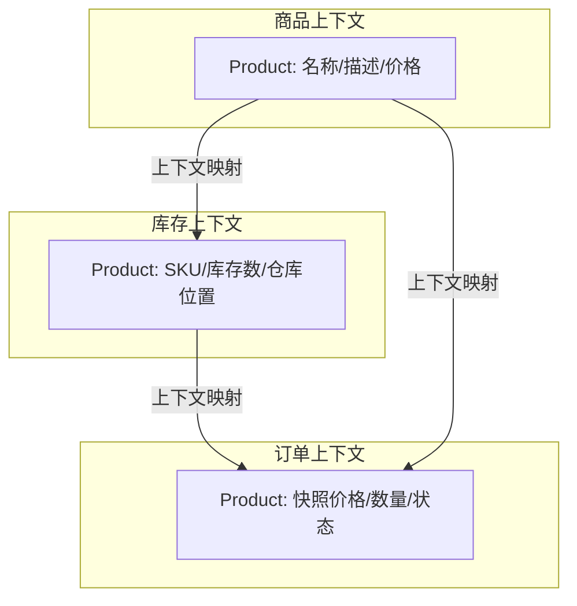
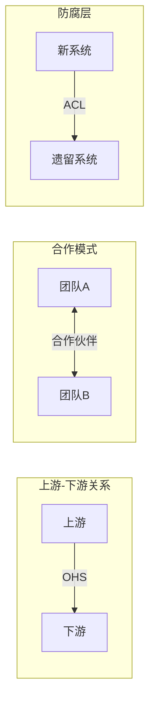
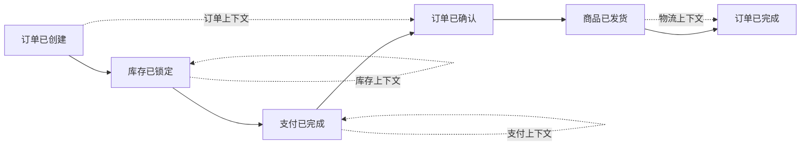
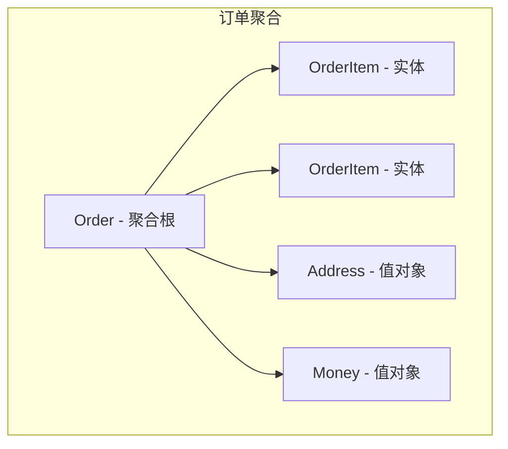
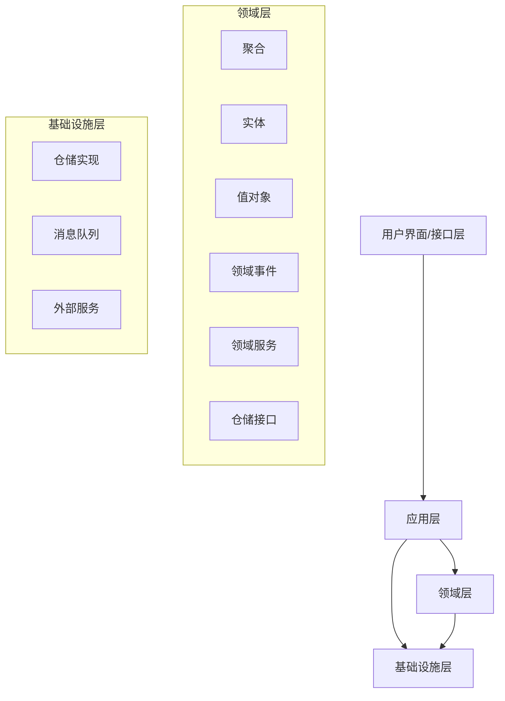
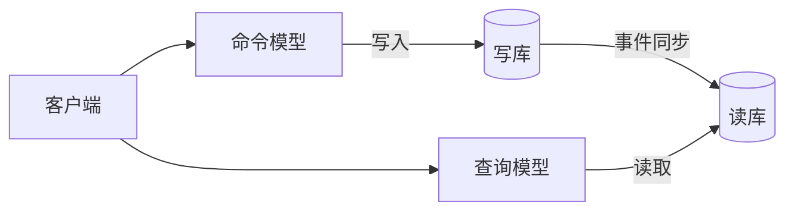
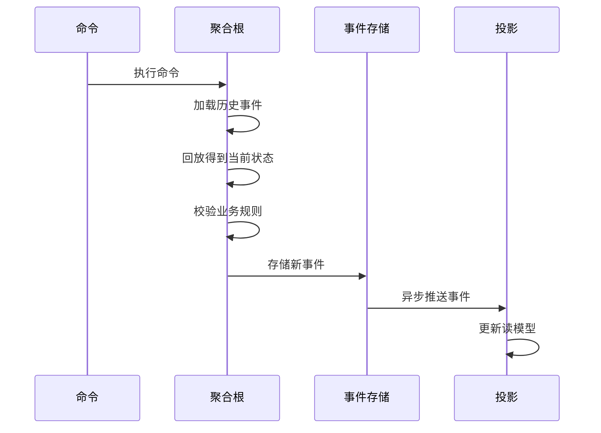

## 领域驱动设计：用业务语言驱动软件架构

领域驱动设计（Domain-Driven Design, DDD）不是一种技术框架，而是一种用业务语言思考软件架构的方法论。它解决的核心问题是：**如何让软件模型与业务模型保持一致**。

## DDD 核心概念

### 领域与子域

领域（Domain）是软件要解决的业务问题空间。一个大型业务领域通常被分解为多个子域：



| 子域类型 | 定义 | 策略 | 示例 |
|---------|------|------|------|
| 核心域 | 业务核心竞争力 | 自研，投入最优秀资源 | 电商的交易撮合 |
| 支撑域 | 辅助核心域运行 | 自研或外包 | 用户管理、通知 |
| 通用域 | 行业通用能力 | 采购SaaS | 支付、邮件、短信 |

### 限界上下文（Bounded Context）

限界上下文是 DDD 最重要的战略概念。同一个术语在不同上下文中有不同含义——"商品"在商品上下文中指 SKU 信息，在库存上下文中指库存单位，在订单上下文中指订单行项目。



**限界上下文 = 语义边界 = 模型一致性边界**。在同一个限界上下文内，术语含义唯一、模型一致；跨上下文需要通过映射进行转换。

## 战略设计

战略设计关注如何划分限界上下文以及上下文之间的关系。

### 上下文映射模式



| 映射模式 | 关系 | 说明 |
|---------|------|------|
| 合作伙伴（Partnership） | 双向 | 两个团队紧密协作，同步演进 |
| 共享内核（Shared Kernel） | 共享 | 共享部分模型，需双方协商变更 |
| 客户-供应商（Customer-Supplier） | 上游→下游 | 上游优先考虑下游需求 |
| 遵奉者（Conformist） | 上游→下游 | 下游完全遵从上游模型 |
| 防腐层（ACL） | 下游保护 | 下游通过适配层隔离上游模型 |
| 开放主机服务（OHS） | 上游发布 | 上游提供标准协议供下游使用 |
| 发布语言（PL） | 上游发布 | 使用标准格式（如JSON Schema） |
| 各行其道（Separate Ways） | 无关联 | 完全独立，无集成需求 |

### 事件风暴与限界上下文识别

事件风暴（Event Storming）是一种协作式工作坊，用于快速识别领域事件和限界上下文边界：



## 战术设计

战术设计关注限界上下文内部的模型构建。

### 聚合（Aggregate）

聚合是一组相关对象的集合，作为数据修改的单元。每个聚合有一个聚合根（Aggregate Root），外部只能通过聚合根访问聚合内部对象。



### 实体 vs 值对象

| 维度 | 实体（Entity） | 值对象（Value Object） |
|------|--------------|---------------------|
| 标识 | 有唯一标识（ID） | 无独立标识 |
| 相等性 | 标识相等 | 属性全部相等 |
| 可变性 | 可变 | 不可变 |
| 生命周期 | 独立生命周期 | 依附于实体 |
| 示例 | Order、User、Product | Money、Address、DateRange |

### 领域事件（Domain Event）

领域事件表示领域中已经发生的、有业务意义的事情。它是解耦聚合、实现最终一致性的核心机制。

```java
// 领域事件定义
public record OrderCreatedEvent(
    String orderId,
    String userId,
    BigDecimal totalAmount,
    Instant occurredAt
) implements DomainEvent {}

// 聚合根发布事件
@Entity
public class Order extends BaseAggregateRoot {

    private String orderId;
    private OrderStatus status;
    private List<OrderItem> items;

    public static Order create(String userId, List<OrderItem> items) {
        Order order = new Order();
        order.orderId = UUID.randomUUID().toString();
        order.status = OrderStatus.CREATED;
        order.items = items;

        // 注册领域事件
        order.registerEvent(new OrderCreatedEvent(
            order.orderId,
            userId,
            order.calculateTotal(),
            Instant.now()
        ));

        return order;
    }

    public void confirm() {
        if (this.status != OrderStatus.PAID) {
            throw new DomainException("只有已支付的订单才能确认");
        }
        this.status = OrderStatus.CONFIRMED;
        registerEvent(new OrderConfirmedEvent(this.orderId, Instant.now()));
    }
}
```

### 领域服务

当业务逻辑不属于任何实体或值对象时，将其放在领域服务中：

```java
public class TransferService {

    private final AccountRepository accountRepository;

    public void transfer(String fromId, String toId, Money amount) {
        Account from = accountRepository.findById(fromId)
            .orElseThrow(() -> new AccountNotFoundException(fromId));
        Account to = accountRepository.findById(toId)
            .orElseThrow(() -> new AccountNotFoundException(toId));

        from.debit(amount);
        to.credit(amount);

        accountRepository.save(from);
        accountRepository.save(to);
    }
}
```

### 分层架构



| 层 | 职责 | 依赖 |
|---|------|------|
| 接口层 | 接收请求、参数校验、返回响应 | 应用层 |
| 应用层 | 编排用例、事务管理、安全 | 领域层 |
| 领域层 | 业务规则、领域模型 | 无（纯业务逻辑） |
| 基础设施层 | 技术实现（持久化、消息、外部调用） | 领域层（实现接口） |

## DDD 与微服务

DDD 的限界上下文天然对应微服务的服务边界，这是两者结合的理论基础。

```mermaid
graph TB
    subgraph 限界上下文 → 微服务映射
        BC1[订单上下文] --> MS1[订单服务]
        BC2[商品上下文] --> MS2[商品服务]
        BC3[支付上下文] --> MS3[支付服务]
        BC4[用户上下文] --> MS4[用户服务]
    end

    MS1 -->|事件| EB[Event Bus]
    EB --> MS3
    EB --> MS4

    MS1 -->|RPC| MS2
```

### 映射原则

1. **一个限界上下文对应一个微服务**：这是最理想的映射关系
2. **聚合是服务内的事务边界**：一个事务只修改一个聚合
3. **领域事件实现跨服务一致性**：通过事件驱动实现最终一致性
4. **防腐层对应服务间的适配器**：隔离外部服务的模型差异

## CQRS（命令查询职责分离）

CQRS 将读操作和写操作分离为不同的模型，适用于读写负载差异大或复杂业务场景。



### CQRS 实现示例

```java
// 命令端 - 写模型
@Service
@Transactional
public class OrderCommandService {

    private final OrderRepository orderRepository;
    private final ApplicationEventPublisher eventPublisher;

    public String createOrder(CreateOrderCommand cmd) {
        Order order = Order.create(cmd.getUserId(), cmd.getItems());
        orderRepository.save(order);
        eventPublisher.publishEvent(new OrderCreatedEvent(order));
        return order.getId();
    }

    public void cancelOrder(CancelOrderCommand cmd) {
        Order order = orderRepository.findById(cmd.getOrderId())
            .orElseThrow();
        order.cancel();
        orderRepository.save(order);
    }
}

// 查询端 - 读模型
@Service
@Transactional(readOnly = true)
public class OrderQueryService {

    private final OrderReadRepository readRepository;

    public OrderDetailView getOrderDetail(String orderId) {
        return readRepository.findDetailById(orderId);
    }

    public Page<OrderListVO> listOrders(OrderQuery query, Pageable pageable) {
        return readRepository.queryOrders(query, pageable);
    }
}

// 事件同步 - 从写模型同步到读模型
@Component
public class OrderEventProcessor {

    private final OrderReadRepository readRepository;

    @EventListener
    @Async
    public void handleOrderCreated(OrderCreatedEvent event) {
        OrderDetailView view = OrderDetailView.builder()
            .orderId(event.getOrderId())
            .userId(event.getUserId())
            .status("CREATED")
            .totalAmount(event.getTotalAmount())
            .createdAt(event.getOccurredAt())
            .build();
        readRepository.save(view);
    }
}
```

### CQRS 适用场景

| 场景 | 是否适合CQRS | 原因 |
|------|------------|------|
| 读写比极高（如报表系统） | ✅ | 读模型可独立优化 |
| 复杂业务规则 | ✅ | 写模型专注业务，不受查询干扰 |
| 简单CRUD | ❌ | 增加复杂度，无收益 |
| 强一致性查询 | ❌ | 读写同步有延迟 |

## 事件溯源（Event Sourcing）

事件溯源不保存对象的当前状态，而是保存所有改变状态的事件。当前状态通过回放事件获得。

$$
\text{当前状态} = \text{foldl}(\text{apply}, \text{初始状态}, \text{事件列表})
$$



### 事件溯源实现

```java
// 事件存储
public interface EventStore {
    void append(String aggregateId, List<DomainEvent> events, long expectedVersion);
    List<DomainEvent> load(String aggregateId);
    List<DomainEvent> loadFromVersion(String aggregateId, long fromVersion);
}

// 聚合基类
public abstract class EventSourcedAggregate {

    private String aggregateId;
    private long version = 0;
    private final List<DomainEvent> uncommittedEvents = new ArrayList<>();

    public void loadFromHistory(List<DomainEvent> events) {
        events.forEach(this::applyEvent);
        this.version = events.size();
    }

    protected void raiseEvent(DomainEvent event) {
        applyEvent(event);
        uncommittedEvents.add(event);
    }

    protected abstract void applyEvent(DomainEvent event);

    public List<DomainEvent> getUncommittedEvents() {
        return List.copyOf(uncommittedEvents);
    }

    public void markEventsAsCommitted() {
        uncommittedEvents.clear();
    }
}

// 具体聚合
public class BankAccount extends EventSourcedAggregate {

    private BigDecimal balance = BigDecimal.ZERO;

    public void deposit(BigDecimal amount) {
        if (amount.compareTo(BigDecimal.ZERO) <= 0) {
            throw new DomainException("存款金额必须大于0");
        }
        raiseEvent(new MoneyDepositedEvent(aggregateId, amount, balance.add(amount)));
    }

    public void withdraw(BigDecimal amount) {
        if (amount.compareTo(balance) > 0) {
            throw new DomainException("余额不足");
        }
        raiseEvent(new MoneyWithdrawnEvent(aggregateId, amount, balance.subtract(amount)));
    }

    @Override
    protected void applyEvent(DomainEvent event) {
        if (event instanceof MoneyDepositedEvent e) {
            this.balance = e.newBalance();
        } else if (event instanceof MoneyWithdrawnEvent e) {
            this.balance = e.newBalance();
        }
    }
}
```

### 快照优化

当事件数量巨大时，回放所有事件的性能不可接受。通过定期保存快照来优化：

```java
public class AccountRepository {

    private final EventStore eventStore;
    private final SnapshotStore snapshotStore;
    private static final int SNAPSHOT_INTERVAL = 100;

    public BankAccount load(String accountId) {
        // 先加载最新快照
        Optional<Snapshot> snapshot = snapshotStore.loadLatest(accountId);

        BankAccount account = new BankAccount();
        if (snapshot.isPresent()) {
            account.restoreFromSnapshot(snapshot.get());
            // 只加载快照之后的事件
            List<DomainEvent> events = eventStore.loadFromVersion(
                accountId, snapshot.get().version() + 1
            );
            account.loadFromHistory(events);
        } else {
            account.loadFromHistory(eventStore.load(accountId));
        }

        return account;
    }
}
```

## 面试 Q&A

**Q1：DDD 中的限界上下文和微服务是什么关系？**

A：限界上下文是业务概念的边界，微服务是技术实现的边界。**理想情况下一个限界上下文对应一个微服务**，但并非绝对。限界上下文关注的是模型的语义一致性——同一个术语在同一个上下文中含义唯一。微服务关注的是独立部署和运行。在项目初期，可以将多个限界上下文放在一个微服务中（模块化单体），随着业务增长再逐步拆分。关键是用限界上下文指导拆分方向，而不是盲目拆服务。

**Q2：聚合的设计原则是什么？**

A：四个核心原则：(1) **一致性边界**：聚合内的所有修改必须保证业务不变量，一个事务只修改一个聚合；

(2) **小聚合**：聚合尽量小，只包含必要实体，用 ID 引用而非对象引用关联其他聚合；

(3) **通过ID关联**：聚合之间通过 ID 引用，不直接持有对象引用；

(4) **最终一致性**：跨聚合的一致性通过领域事件实现最终一致性。

一个常见错误是把整个对象图作为一个聚合，导致并发冲突频繁。

**Q3：CQRS 和事件溯源必须一起用吗？**

A：不需要。CQRS 是读写分离的模式，事件溯源是状态存储的模式，两者独立但互补。CQRS 可以不用事件溯源（写模型直接存状态），事件溯源通常搭配 CQRS（因为从事件重建查询视图是自然选择）。工程实践中，**先用 CQRS**，在需要完整审计日志或时间旅行调试时再引入事件溯源。事件溯源的复杂度很高，包括事件版本迁移、快照管理、最终一致性窗口等，不要轻易引入。

**Q4：如何处理领域事件的最终一致性延迟？**

A：三种策略：(1) **补偿操作**：如果下游处理失败，发布补偿事件回滚上游状态（Saga 模式）；(2) **重试+死信队列**：消费失败的消息进入死信队列，人工或自动处理；(3) **幂等消费**：消费者必须幂等，通过事件 ID 去重。对于用户可感知的延迟，可以在 UI 层做乐观更新——先假设操作成功更新界面，如果最终失败再回滚并通知用户。

**Q5：DDD 在实际项目中如何落地？**

A：分三步走：(1) **事件风暴**：拉上业务专家和技术团队，用便签纸识别领域事件、命令、聚合，划分限界上下文；

(2) **模块化单体先行**：先在一个代码库中按限界上下文组织模块（包结构清晰），验证模型正确性，避免过早拆分微服务带来的分布式复杂度；

(3) **按需拆分**：当某个模块的部署频率、扩展需求、团队归属出现明显差异时，再拆分为独立服务。

核心是**先建模，后拆分**，而非先拆服务再补模型。
