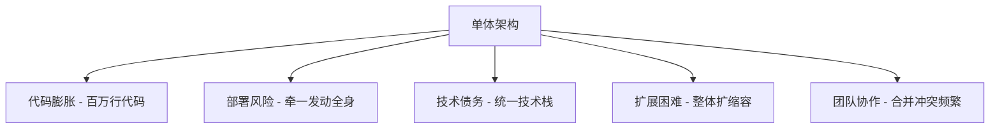
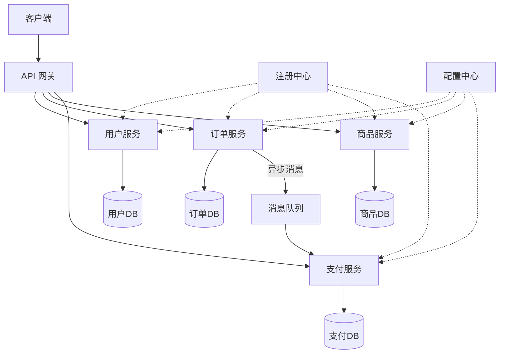
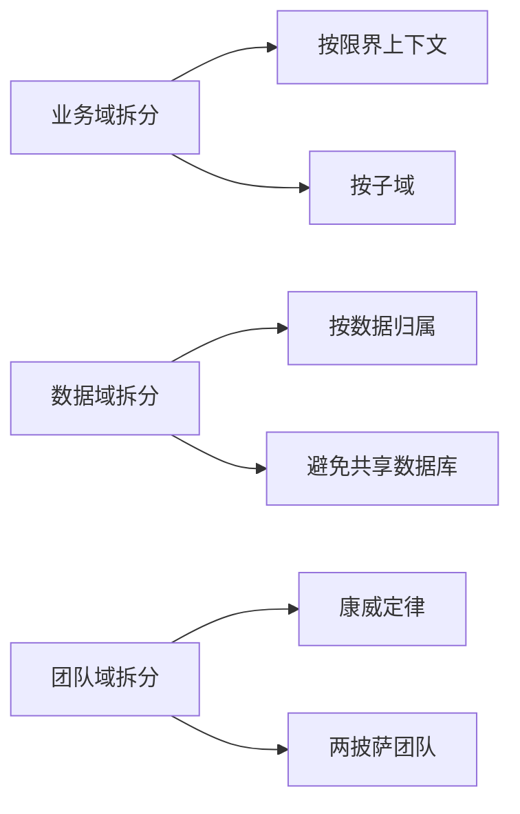
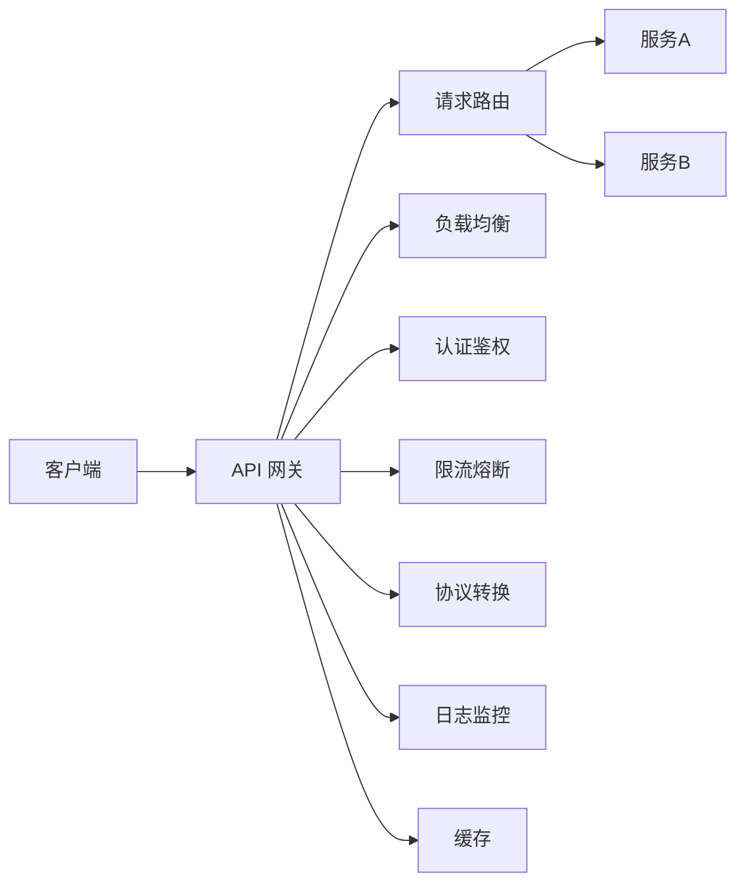
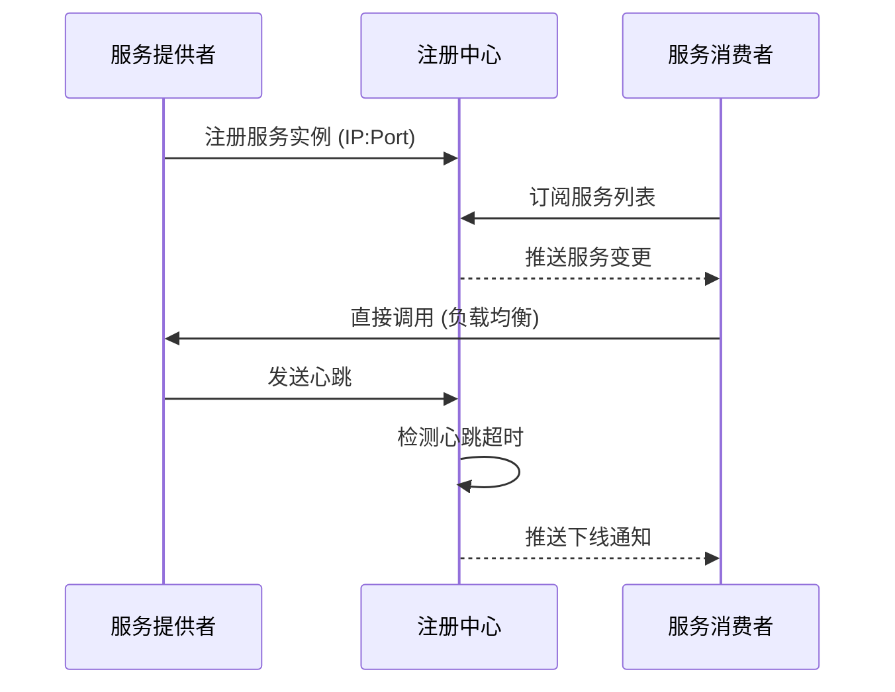
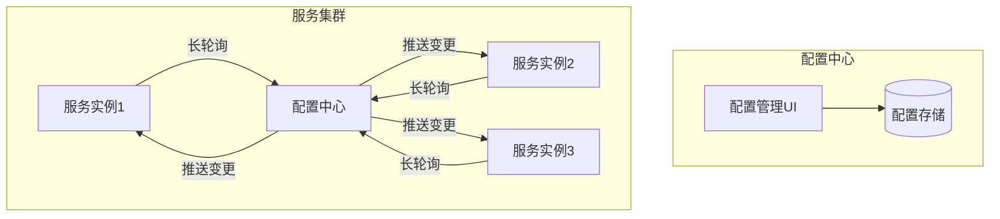
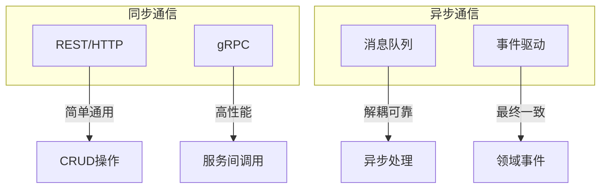
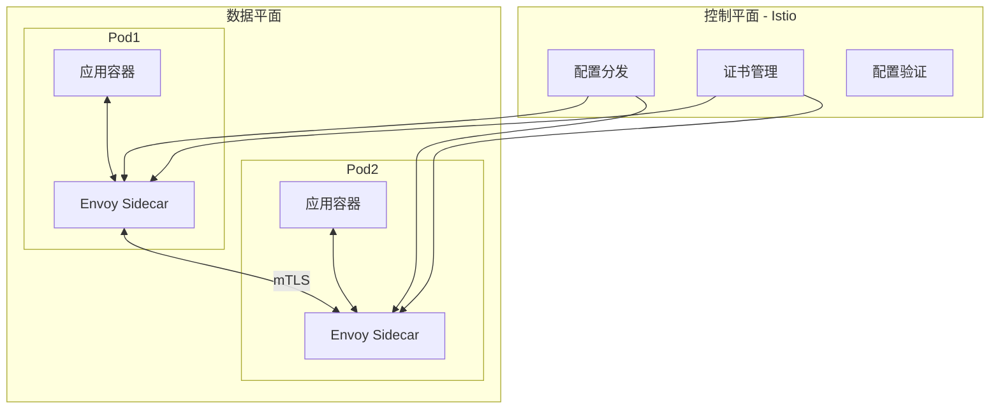

## 从单体到微服务：架构演进的必然之路

软件架构的演进从来不是技术人的自嗨，而是业务规模增长带来的必然选择。理解单体与微服务的边界，掌握服务拆分与治理的核心技术，是每一位后端工程师的必修课。

## 单体架构 vs 微服务架构

### 单体架构的特征与困境

单体架构（Monolithic Architecture）将所有业务逻辑、数据访问、UI 层打包在一个部署单元中。在项目初期，单体架构开发效率高、部署简单、调试方便。但随着业务增长，问题逐渐暴露：



### 核心对比

| 维度 | 单体架构 | 微服务架构 |
|------|---------|-----------|
| 代码组织 | 单一代码库 | 多个独立代码库 |
| 部署方式 | 整体部署 | 独立部署 |
| 技术栈 | 统一技术栈 | 异构技术栈 |
| 扩展性 | 整体扩展 | 按需独立扩展 |
| 故障影响 | 全局故障 | 故障隔离 |
| 数据管理 | 共享数据库 | 每服务独立数据库 |
| 开发效率 | 初期高，后期低 | 初期低，后期高 |
| 运维复杂度 | 低 | 高（需配套基础设施） |
| 团队组织 | 按技术层分 | 按业务域分 |

### 微服务架构全景



## 服务拆分原则

服务拆分是微服务架构中最关键的决策，拆分不当会导致分布式单体的灾难。

### 拆分策略



### 核心原则

1. **单一职责原则**：每个服务只负责一个业务能力
2. **高内聚低耦合**：服务内部高内聚，服务之间低耦合
3. **独立部署**：服务可以独立构建、测试、部署
4. **数据自治**：每个服务拥有自己的数据存储
5. **接口契约化**：服务间通过明确定义的 API 通信

### 拆分粒度判断

$$
\text{服务粒度} = f(\text{业务边界}, \text{团队规模}, \text{变更频率}, \text{性能要求})
$$

过粗的拆分退化为单体，过细的拆分带来通信开销和运维负担。一个经验法则：**一个服务对应一个业务能力，由一个两披萨团队（6-10人）负责**。

## API 网关

API 网关是微服务架构的统一入口，承担请求路由、协议转换、流量治理等职责。

### 网关核心功能



### 网关实现对比

| 特性 | Nginx | Kong | Spring Cloud Gateway | Envoy |
|------|-------|------|---------------------|-------|
| 语言 | C | Lua/Go | Java | C++ |
| 扩展性 | 模块 | 插件 | Filter | Filter/Lua |
| 性能 | 极高 | 高 | 中 | 高 |
| 动态路由 | 有限 | 支持 | 支持 | 支持 |
| 服务发现 | 不支持 | 支持 | 支持 | 支持 |
| 适合场景 | 静态代理 | API管理 | Spring生态 | Service Mesh |

### Spring Cloud Gateway 示例

```java
@Configuration
public class GatewayConfig {

    @Bean
    public RouteLocator customRouteLocator(RouteLocatorBuilder builder) {
        return builder.routes()
            .route("user-service", r -> r
                .path("/api/users/**")
                .filters(f -> f
                    .stripPrefix(1)
                    .circuitBreaker(config -> config
                        .setName("userServiceCB")
                        .setFallbackUri("forward:/fallback/users"))
                    .requestRateLimiter(config -> config
                        .setRedisRateLimiter(new RedisRateLimiter(100, 20))))
                .uri("lb://user-service"))
            .route("order-service", r -> r
                .path("/api/orders/**")
                .filters(f -> f
                    .stripPrefix(1)
                    .retry(config -> config
                        .setRetries(3)
                        .setStatuses(HttpStatus.GATEWAY_TIMEOUT)))
                .uri("lb://order-service"))
            .build();
    }
}
```

## 服务注册与发现

在微服务架构中，服务实例动态变化，需要一种机制让服务消费者找到服务提供者。

### 工作原理



### 注册中心对比

| 特性 | Eureka | Nacos | Consul | ZooKeeper |
|------|--------|-------|--------|-----------|
| CAP | AP | AP/CP | CP | CP |
| 健康检查 | 客户端心跳 | 心跳/TCP/HTTP | Agent检查 | 会话保持 |
| 配置中心 | 不支持 | 支持 | 支持 | 支持 |
| 一致性 | 最终一致 | 可选 | 强一致 | 强一致 |
| 多数据中心 | 不支持 | 支持 | 支持 | 不支持 |
| 适用场景 | Spring Cloud | 全场景 | 多DC | 强一致场景 |

### Nacos 服务注册示例

```java
@SpringBootApplication
public class UserServiceApplication {

    public static void main(String[] args) {
        SpringApplication.run(UserServiceApplication.class, args);
    }
}

// application.yml
// spring:
//   cloud:
//     nacos:
//       discovery:
//         server-addr: 127.0.0.1:8848
//         namespace: production
//         group: DEFAULT_GROUP
//         weight: 1
```

## 配置中心

配置中心实现配置的集中管理、动态推送和版本控制，是微服务基础设施的关键组件。

### 配置中心架构



### Nacos 动态配置

```java
@RestController
@RefreshScope
public class DynamicConfigController {

    @Value("${order.max-retry:3}")
    private int maxRetry;

    @Value("${order.timeout:5000}")
    private long timeout;

    @GetMapping("/config")
    public Map<String, Object> getConfig() {
        return Map.of(
            "maxRetry", maxRetry,
            "timeout", timeout
        );
    }
}
```

## 服务间通信

### 通信模式对比



### REST vs gRPC

| 维度 | REST | gRPC |
|------|------|------|
| 协议 | HTTP/1.1 | HTTP/2 |
| 数据格式 | JSON/XML | Protobuf |
| 性能 | 中 | 高（二进制+多路复用） |
| 代码生成 | OpenAPI/Swagger | 原生支持 |
| 流式传输 | 不支持 | 支持 |
| 浏览器兼容 | 好 | 差（需gRPC-Web） |
| 适用场景 | 对外API | 服务间通信 |

### gRPC 服务定义与调用

```protobuf
// order.proto
syntax = "proto3";

package order;

service OrderService {
  rpc CreateOrder(CreateOrderRequest) returns (CreateOrderResponse);
  rpc GetOrder(GetOrderRequest) returns (Order);
  rpc ListOrders(ListOrdersRequest) returns (stream Order);
}

message CreateOrderRequest {
  string user_id = 1;
  repeated OrderItem items = 2;
}

message OrderItem {
  string product_id = 1;
  int32 quantity = 2;
  double price = 3;
}

message CreateOrderResponse {
  string order_id = 1;
  string status = 2;
}
```

### 消息队列实现异步通信

```java
// 订单服务 - 发送消息
@Service
public class OrderService {

    @Autowired
    private RabbitTemplate rabbitTemplate;

    public Order createOrder(CreateOrderRequest request) {
        Order order = buildOrder(request);
        orderRepository.save(order);

        // 异步通知支付服务
        rabbitTemplate.convertAndSend(
            "order.exchange",
            "order.created",
            new OrderCreatedEvent(order.getId(), order.getTotalAmount())
        );

        return order;
    }
}

// 支付服务 - 消费消息
@Component
@RabbitListener(queues = "payment.order.queue")
public class PaymentEventListener {

    @RabbitHandler
    public void handleOrderCreated(OrderCreatedEvent event) {
        paymentService.createPayment(event.getOrderId(), event.getAmount());
    }
}
```

## 服务网格（Service Mesh）

当微服务数量增长到一定规模，服务间通信的治理（熔断、限流、可观测性）变得极其复杂。Service Mesh 将这些能力从业务代码中剥离到基础设施层。

### Service Mesh 架构



### Istio 流量管理示例

```yaml
apiVersion: networking.istio.io/v1alpha3
kind: VirtualService
metadata:
  name: order-service
spec:
  hosts:
    - order-service
  http:
    - match:
        - headers:
            x-canary:
              exact: "true"
      route:
        - destination:
            host: order-service
            subset: canary
          weight: 100
    - route:
        - destination:
            host: order-service
            subset: stable
          weight: 95
        - destination:
            host: order-service
            subset: canary
          weight: 5
---
apiVersion: networking.istio.io/v1alpha3
kind: DestinationRule
metadata:
  name: order-service
spec:
  host: order-service
  trafficPolicy:
    connectionPool:
      tcp:
        maxConnections: 100
      http:
        h2UpgradePolicy: DEFAULT
        http1MaxPendingRequests: 100
        http2MaxRequests: 100
    outlierDetection:
      consecutive5xxErrors: 5
      interval: 30s
      baseEjectionTime: 30s
  subsets:
    - name: stable
      labels:
        version: v1
    - name: canary
      labels:
        version: v2
```

### 微服务 vs Service Mesh 治理对比

| 治理能力 | 传统微服务框架 | Service Mesh |
|---------|-------------|-------------|
| 熔断 | 代码内(Hystrix/Resilience4j) | Sidecar代理 |
| 限流 | 代码内 | Sidecar代理 |
| 负载均衡 | 客户端(Ribbon/LoadBalancer) | Sidecar代理 |
| 服务发现 | 客户端 | Sidecar代理 |
| 链路追踪 | 代码内(Sleuth/Brave) | Sidecar自动注入 |
| 安全(mTLS) | 需自行实现 | 自动管理 |
| 语言耦合 | 是 | 否 |
| 代码侵入 | 高 | 低/无 |

## 面试 Q&A

**Q1：什么时候应该从单体迁移到微服务？**

A：没有银弹，但以下信号表明需要考虑拆分：(1) 代码库超过百万行，构建部署超过30分钟；(2) 团队超过两个披萨团队规模，合并冲突频繁；(3) 不同模块有不同的扩展需求（如读多写少 vs 计算密集）；(4) 不同模块需要不同技术栈。关键前提是：CI/CD 基础设施成熟、监控体系完善、团队具备分布式系统经验。**不要为了微服务而微服务**。

**Q2：微服务间如何保证数据一致性？**

A：微服务下无法使用本地事务，需要采用分布式事务方案：(1) **Saga 模式**：编排式或协调式，通过补偿操作实现最终一致性；(2) **事件驱动**：通过领域事件 + 消息队列实现最终一致性；(3) **TCC**：Try-Confirm-Cancel，适用于强一致性要求场景但实现复杂。工程实践中优先选择 Saga + 事件驱动，因为实现简单且性能好。

**Q3：API 网关和服务网格有什么区别？**

A：API 网关是**南北向流量**（客户端到服务）的入口，关注外部请求的路由、认证、限流；Service Mesh 是**东西向流量**（服务到服务）的基础设施，关注内部服务间通信的可靠性、安全性和可观测性。两者互补而非替代：网关处理边界问题，Mesh 处理网格内部问题。在 Istio 架构中，Ingress Gateway 兼具两者功能。

**Q4：服务拆分的粒度如何把握？**

A：遵循三个维度：(1) **业务边界**：按 DDD 的限界上下文拆分，一个限界上下文对应一个服务；(2) **变更频率**：高频变更的模块独立部署，低频变更的模块可以合并；(3) **团队规模**：一个服务由一个团队负责，团队规模6-10人。反模式包括：按技术层拆分（数据层服务、缓存服务）、过细拆分（一个CRUD一个服务）。

**Q5：gRPC 和 REST 如何选择？**

A：**服务间内部通信优先 gRPC**：二进制序列化 + HTTP/2 多路复用带来3-10倍性能提升，强类型接口约束减少沟通成本。**对外暴露 API 优先 REST**：浏览器兼容、调试方便、生态成熟。实际工程中常见模式：外部 REST → API 网关 → 内部 gRPC，网关做协议转换（gRPC-Web 或 自定义转码）。
