## 高可用：系统设计的生命线

> "Everything fails, all the time." —— Werner Vogels（Amazon CTO）

高可用（High Availability）不是追求系统永不故障——那是不可能的——而是在故障发生时，系统仍能**持续提供服务**或**快速恢复**。高可用架构的本质是**面向故障设计**。

---

## 一、高可用度量

### 1.1 可用性等级

可用性用**可用率**衡量，即系统正常运行时间占总时间的比例。

| 可用率 | 年停机时间 | 等级 | 典型系统 |
|--------|-----------|------|---------|
| 99% | 3天15小时 | 2个9 | 普通网站 |
| 99.9% | 8小时46分 | 3个9 | 企业应用 |
| 99.99% | 52分36秒 | 4个9 | 电商核心 |
| 99.999% | 5分15秒 | 5个9 | 电信级 |
| 99.9999% | 31.5秒 | 6个9 | 航空航天 |

可用率计算公式：

$$Availability = \frac{MTTF}{MTTF + MTTR}$$

- **MTTF**（Mean Time To Failure）：平均无故障时间
- **MTTR**（Mean Time To Recovery）：平均恢复时间

**提高可用性的两条路径**：增大 MTTF（减少故障）或减小 MTTR（加快恢复）。

### 1.2 可用性的工程现实

每增加一个 9，成本呈指数增长：

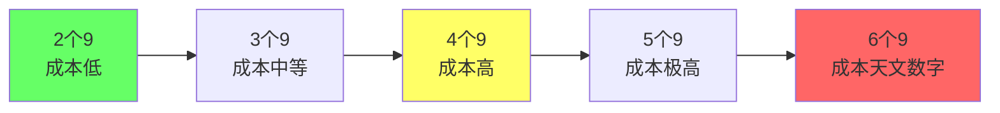

> **工程视角**：不要盲目追求 5 个 9。先明确业务需要的可用性等级，再设计相应方案。电商核心交易需要 4 个 9，但后台管理系统 3 个 9 足够。

---

## 二、故障模式

### 2.1 常见故障类型

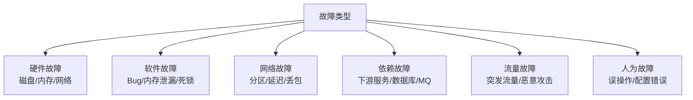

### 2.2 故障的级联效应

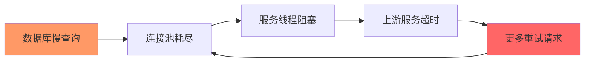

**雪崩效应**：一个服务的故障引发上游服务故障，最终导致整个系统崩溃。

### 2.3 故障模式分析（FMA）

| 故障模式 | 影响 | 概率 | 缓解策略 |
|---------|------|------|---------|
| 数据库主库宕机 | 写入不可用 | 低 | 主从自动切换 |
| 缓存集群故障 | 请求直达 DB | 中 | 本地缓存 + 限流 |
| 下游服务超时 | 线程池耗尽 | 中 | 熔断 + 超时 |
| 网络分区 | 部分节点不可达 | 低 | 多机房部署 |
| 配置错误 | 服务异常 | 中 | 灰度发布 + 回滚 |

---

## 三、限流算法

限流是保护系统的第一道防线，防止突发流量压垮系统。

### 3.1 固定窗口计数器

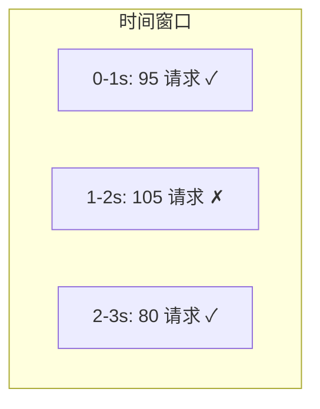

```java
// 固定窗口计数器
public class FixedWindowRateLimiter {
    private final int limit;
    private final long windowMs;
    private int count;
    private long windowStart;

    public FixedWindowRateLimiter(int limit, long windowMs) {
        this.limit = limit;
        this.windowMs = windowMs;
        this.windowStart = System.currentTimeMillis();
    }

    public synchronized boolean tryAcquire() {
        long now = System.currentTimeMillis();
        if (now - windowStart >= windowMs) {
            windowStart = now;
            count = 0;
        }
        if (count < limit) {
            count++;
            return true;
        }
        return false;
    }
}
```

**问题**：窗口边界处可能出现 2 倍流量。0.9s 来 100 个请求，1.1s 又来 100 个请求，0.2s 内通过 200 个请求。

### 3.2 滑动窗口计数器

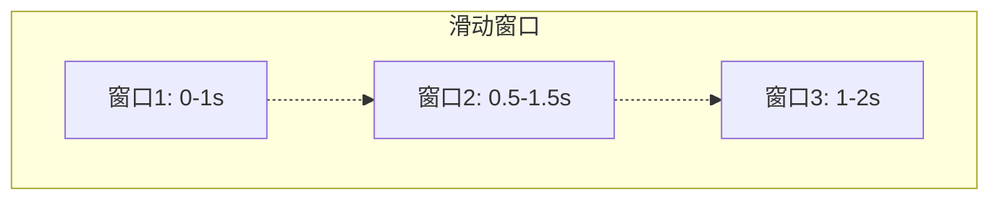

```java
// 滑动窗口计数器（基于 Redis）
public class SlidingWindowRateLimiter {
    private final StringRedisTemplate redis;
    private final int limit;
    private final long windowMs;

    public boolean tryAcquire(String key) {
        long now = System.currentTimeMillis();
        String member = UUID.randomUUID().toString();

        // 使用 Redis Sorted Set 实现
        redis.opsForZSet().add(key, member, now);
        redis.opsForZSet().removeRangeByScore(key, 0, now - windowMs);
        Long count = redis.opsForZSet().zCard(key);
        redis.expire(key, windowMs, TimeUnit.MILLISECONDS);

        return count != null && count <= limit;
    }
}
```

### 3.3 令牌桶算法

令牌桶以固定速率生成令牌，请求需要获取令牌才能通过。允许一定程度的突发流量。

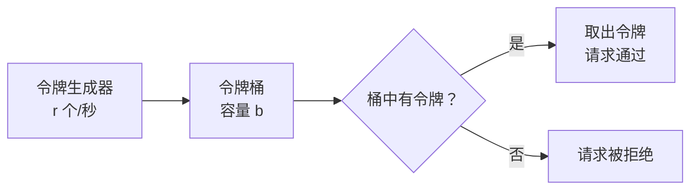

```java
// 令牌桶算法（Guava RateLimiter 实现）
import com.google.common.util.concurrent.RateLimiter;

@Service
public class OrderService {
    // 每秒生成 100 个令牌
    private final RateLimiter rateLimiter = RateLimiter.create(100);

    public Order createOrder(OrderRequest request) {
        // 非阻塞尝试获取令牌
        if (!rateLimiter.tryAcquire(500, TimeUnit.MILLISECONDS)) {
            throw new RateLimitException("系统繁忙，请稍后重试");
        }
        return doCreateOrder(request);
    }
}
```

令牌桶的关键参数：
- **速率 r**：令牌生成速率（QPS）
- **容量 b**：桶的最大容量，允许突发流量

突发流量计算：最多可处理 $b + r \times t$ 个请求（$t$ 为时间窗口）。

### 3.4 漏桶算法

漏桶以固定速率流出请求，不管输入速率如何，输出始终恒定。

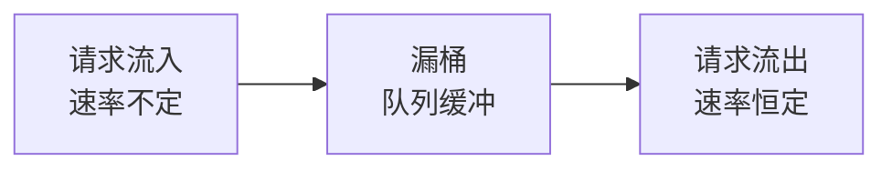

```java
// 漏桶算法
public class LeakyBucketRateLimiter {
    private final int capacity;    // 桶容量
    private final int rate;        // 每秒流出速率
    private int water;             // 当前水量
    private long lastLeakTime;

    public synchronized boolean tryAcquire() {
        long now = System.currentTimeMillis();
        // 漏出水量
        int leaked = (int)((now - lastLeakTime) / 1000.0 * rate);
        if (leaked > 0) {
            water = Math.max(0, water - leaked);
            lastLeakTime = now;
        }
        // 判断桶是否已满
        if (water < capacity) {
            water++;
            return true;
        }
        return false;
    }
}
```

### 3.5 四种算法对比

| 维度 | 固定窗口 | 滑动窗口 | 令牌桶 | 漏桶 |
|------|---------|---------|--------|------|
| 平滑性 | 差 | 较好 | 好 | 最好 |
| 突发流量 | 不允许 | 不允许 | 允许 | 不允许 |
| 实现复杂度 | 低 | 中 | 中 | 中 |
| 内存消耗 | 低 | 较高 | 低 | 低 |
| 适合场景 | 简单限流 | 精确限流 | API 限流 | 流量整形 |

---

## 四、熔断器模式

### 4.1 熔断器原理

熔断器类似电路保险丝：当下游服务异常率超过阈值时，自动"熔断"，快速失败而不是等待超时。

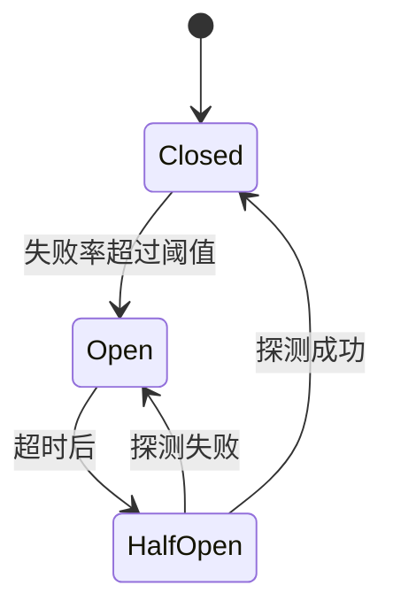

```java
// 熔断器实现（基于 Resilience4j）
import io.github.resilience4j.circuitbreaker.CircuitBreaker;
import io.github.resilience4j.circuitbreaker.CircuitBreakerConfig;

CircuitBreakerConfig config = CircuitBreakerConfig.custom()
    .failureRateThreshold(50)           // 失败率 50% 触发熔断
    .slowCallRateThreshold(80)          // 慢调用率 80% 触发熔断
    .slowCallDurationThreshold(Duration.ofSeconds(2))
    .waitDurationInOpenState(Duration.ofSeconds(30))  // 熔断等待 30s
    .permittedNumberOfCallsInHalfOpenState(5)         // 半开状态允许 5 次探测
    .slidingWindowSize(100)             // 滑动窗口大小
    .slidingWindowType(CircuitBreakerConfig.SlidingWindowType.COUNT_BASED)
    .build();

CircuitBreaker circuitBreaker = CircuitBreaker.of("paymentService", config);

// 使用熔断器
Supplier<Order> supplier = CircuitBreaker.decorateSupplier(
    circuitBreaker, () -> paymentService.pay(order)
);
Try<Order> result = Try.ofSupplier(supplier)
    .recover(throwable -> fallbackPayment(order)); // 降级处理
```

### 4.2 熔断器三状态详解

| 状态 | 行为 | 转换条件 |
|------|------|---------|
| **Closed**（关闭） | 正常请求 | 失败率超过阈值 → Open |
| **Open**（打开） | 快速失败，不调用下游 | 等待超时 → Half-Open |
| **Half-Open**（半开） | 允许少量探测请求 | 探测成功 → Closed；探测失败 → Open |

### 4.3 熔断与降级的配合

```java
// 熔断 + 降级
@CircuitBreaker(name = "inventoryService", fallbackMethod = "getInventoryFallback")
public Inventory getInventory(String sku) {
    return inventoryClient.getInventory(sku);
}

// 降级方法
public Inventory getInventoryFallback(String sku, Throwable t) {
    log.warn("库存服务熔断，返回默认值: {}", sku, t);
    // 返回缓存的库存数据或默认值
    return Inventory.builder()
        .sku(sku)
        .quantity(cacheService.getCachedQuantity(sku))
        .fromCache(true)
        .build();
}
```

---

## 五、降级策略

### 5.1 降级的层次

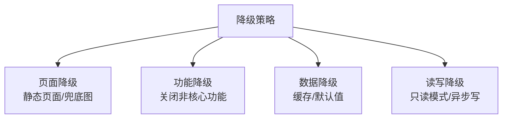

### 5.2 常见降级策略

| 策略 | 描述 | 示例 |
|------|------|------|
| **返回默认值** | 服务不可用时返回预设值 | 推荐系统故障返回热门商品 |
| **返回缓存值** | 返回之前缓存的数据 | 库存服务故障返回缓存库存 |
| **同步转异步** | 同步调用转异步消息 | 支付成功通知改为 MQ 异步 |
| **关闭非核心功能** | 关闭推荐/评论等 | 大促时关闭商品评价 |
| **简化逻辑** | 减少计算量 | 搜索结果不排序/不分页 |
| **人工降级开关** | 运维手动触发 | 配置中心一键降级 |

```java
// 降级开关实现
@Configuration
@ConfigurationProperties(prefix = "degrade")
public class DegradeConfig {
    private boolean recommendationEnabled = true;
    private boolean commentEnabled = true;
    private boolean searchFullMode = true;
    // getters/setters...
}

@Service
public class ProductService {
    @Autowired
    private DegradeConfig degradeConfig;

    public ProductDetail getProductDetail(String productId) {
        ProductDetail detail = new ProductDetail();
        detail.setProduct(productMapper.selectById(productId));

        if (degradeConfig.isRecommendationEnabled()) {
            detail.setRecommendations(recommendService.getRelated(productId));
        }
        // 推荐服务降级：不显示推荐

        if (degradeConfig.isCommentEnabled()) {
            detail.setComments(commentService.getByProduct(productId));
        }
        // 评论服务降级：不显示评论

        return detail;
    }
}
```

---

## 六、超时与重试

### 6.1 超时设置

超时是防止级联故障的最基本手段。**每个外部调用都必须设置超时**。

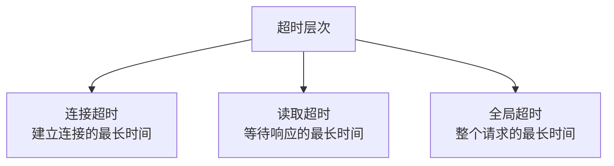

```java
// 超时配置示例（OkHttp）
OkHttpClient client = new OkHttpClient.Builder()
    .connectTimeout(2, TimeUnit.SECONDS)    // 连接超时 2s
    .readTimeout(5, TimeUnit.SECONDS)       // 读取超时 5s
    .writeTimeout(5, TimeUnit.SECONDS)      // 写入超时 5s
    .build();

// 超时配置示例（Feign）
@FeignClient(name = "payment-service", configuration = PaymentFeignConfig.class)
public interface PaymentClient {
    @PostMapping("/pay")
    PaymentResult pay(@RequestBody PaymentRequest request);
}

public class PaymentFeignConfig {
    @Bean
    public Request.Options requestOptions() {
        return new Request.Options(2, TimeUnit.SECONDS, 5, TimeUnit.SECONDS, true);
    }
}
```

### 6.2 超时设置原则

| 原则 | 描述 |
|------|------|
| 上游超时 > 下游超时 | 留出网络传输余量 |
| 超时 + 重试 < 用户等待阈值 | 不要让用户等太久 |
| 区分快慢接口 | 读接口 1-3s，写接口 3-5s |
| 监控超时率 | 超时率 > 1% 需要关注 |

### 6.3 重试策略

```java
// 重试配置（Spring Retry）
@Retryable(
    value = {RemoteServiceException.class, TimeoutException.class},
    maxAttempts = 3,
    backoff = @Backoff(
        delay = 1000,       // 初始延迟 1s
        multiplier = 2,     // 指数退避，倍数 2
        maxDelay = 10000    // 最大延迟 10s
    )
)
public PaymentResult pay(PaymentRequest request) {
    return paymentClient.pay(request);
}

// 重试耗尽后的兜底
@Recover
public PaymentResult payFallback(RemoteServiceException e, PaymentRequest request) {
    log.error("支付重试耗尽", e);
    // 记录到重试表，后续补偿
    retryMapper.insert(request);
    return PaymentResult.retryLater();
}
```

### 6.4 重试的注意事项

| 注意点 | 描述 |
|--------|------|
| **幂等性** | 只有幂等操作才能安全重试 |
| **指数退避** | 避免重试风暴 |
| **重试上限** | 设置最大重试次数 |
| **熔断配合** | 熔断打开后不重试 |
| **区分错误** | 4xx 不重试，5xx 才重试 |

---

## 七、故障演练（Chaos Engineering）

### 7.1 原则

Chaos Engineering 是**主动注入故障**来验证系统韧性的实践。

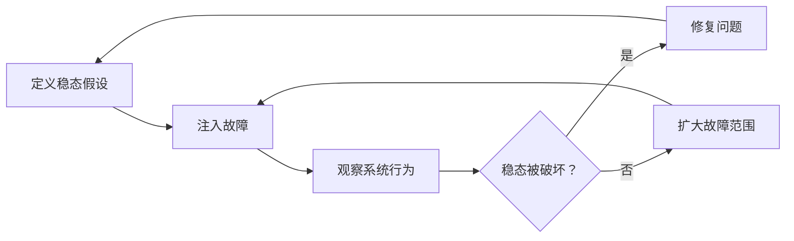

### 7.2 演练场景

| 场景 | 注入方式 | 验证目标 |
|------|---------|---------|
| 实例故障 | 随机关闭实例 | 自动恢复、流量切换 |
| 网络延迟 | 注入网络延迟 | 超时处理、降级 |
| 网络分区 | 切断部分网络 | 多机房容灾 |
| 依赖故障 | 模拟下游 500 | 熔断、降级 |
| 磁盘故障 | 填满磁盘 | 监控告警、自动处理 |
| CPU 压力 | 消耗 CPU 资源 | 限流、弹性扩容 |

### 7.3 Chaos 工具链

```java
// Chaos Mesh（Kubernetes 混沌工程）
// Pod 故障注入
apiVersion: chaos-mesh.org/v1alpha1
kind: PodChaos
metadata:
  name: pod-failure
spec:
  action: pod-failure
  mode: one
  selector:
    namespaces: [production]
    labelSelectors:
      app: order-service
  duration: "30s"

// 网络延迟注入
apiVersion: chaos-mesh.org/v1alpha1
kind: NetworkChaos
metadata:
  name: network-delay
spec:
  action: delay
  mode: all
  selector:
    namespaces: [production]
    labelSelectors:
      app: order-service
  delay:
    latency: "500ms"
    correlation: "50"
  duration: "60s"
```

### 7.4 演练最佳实践

| 实践 | 描述 |
|------|------|
| **从小开始** | 先在测试环境，再在生产环境 |
| **控制爆炸半径** | 只影响部分流量 |
| **可快速终止** | 随时可以停止故障注入 |
| **有监控** | 演练前确认监控和告警就绪 |
| **复盘总结** | 记录发现的问题和改进措施 |
| **常态化** | 定期演练，而非一次性 |

---

## 八、高可用架构全景

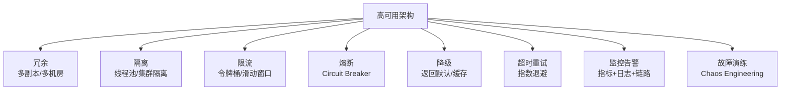

### 高可用的核心原则

1. **Design for Failure**：假设一切都会故障
2. **冗余**：没有单点，每个组件都有备份
3. **隔离**：故障不扩散，一个模块的问题不影响其他
4. **快速失败**：不要等超时，尽早返回错误
5. **优雅降级**：核心功能优先，非核心可牺牲
6. **可观测**：看不到的问题无法解决
7. **持续验证**：Chaos Engineering 常态化

---

## 九、面试 Q&A

**Q1：令牌桶和漏桶的区别？各自适合什么场景？**

令牌桶允许突发流量（桶中有积累的令牌），适合 API 网关限流——允许短时间突发请求。漏桶以恒定速率输出，适合流量整形——将不均匀的流量变为均匀输出。例如：用户登录限流用令牌桶（允许偶尔突发），消息队列消费用漏桶（平滑消费速率）。

**Q2：熔断器的 Half-Open 状态有什么作用？**

Half-Open 是熔断器的"探测"状态。熔断打开后不能一直拒绝请求，需要尝试恢复。Half-Open 允许少量请求通过来探测下游是否恢复：如果成功，说明下游已恢复，关闭熔断器；如果失败，说明下游仍然异常，重新打开熔断器。这实现了**自动恢复**机制。

**Q3：如何设计一个全局的降级开关？**

1. 配置中心（如 Apollo/Nacos）存储降级开关
2. 应用启动时加载开关状态，并监听变更
3. 业务代码根据开关状态决定是否执行某些功能
4. 降级开关分级：P0（核心功能，不降级）、P1（重要功能，紧急时降级）、P2（非核心，随时可降级）
5. 降级操作记录审计日志

**Q4：重试和熔断如何配合？**

重试是**微观**的容错（单次请求级别），熔断是**宏观**的保护（服务级别）。当熔断器处于 Closed 状态时，请求可以重试；当熔断器 Open 时，直接快速失败，不重试。重试次数耗尽后，如果仍然失败，会计入熔断器的失败统计，可能触发熔断。

**Q5：什么是"雪崩效应"？如何防止？**

雪崩效应是一个服务的故障引发上游服务故障，最终导致整个系统崩溃。防止措施：1）超时设置——不让请求无限等待；2）熔断——当下游异常时快速失败；3）限流——防止流量过载；4）隔离——线程池隔离，一个服务的故障不耗尽全局资源；5）降级——返回兜底数据而非报错。

**Q6：Chaos Engineering 和传统测试有什么区别？**

传统测试是**验证已知行为**——测试用例描述了预期结果。Chaos Engineering 是**发现未知行为**——通过注入故障观察系统在异常情况下的实际表现。传统测试回答"系统在正常情况下能工作吗？"，Chaos Engineering 回答"系统在异常情况下还能工作吗？"

---

## 总结

高可用不是单一技术，而是一整套**面向故障的设计哲学**。从限流保护入口，到熔断隔离故障，到降级保证核心功能，到超时重试处理瞬态错误，再到故障演练持续验证——每一层都是系统的安全网。记住：**故障不是会不会发生的问题，而是什么时候发生的问题**。高可用架构的目标不是消除故障，而是在故障发生时仍能提供服务。
