## 消息队列：分布式系统的神经系统

> "The key in making great and growable systems is much more about designing how its modules communicate rather than what their internal behavior and properties are." —— Alan Kay

消息队列是分布式系统中最基础的基础设施之一。它不仅是技术组件，更是一种**架构模式**——通过异步消息传递，解耦系统各部分，提升系统的弹性、可扩展性和可靠性。

---

## 一、消息队列的核心作用

### 1.1 三大核心功能

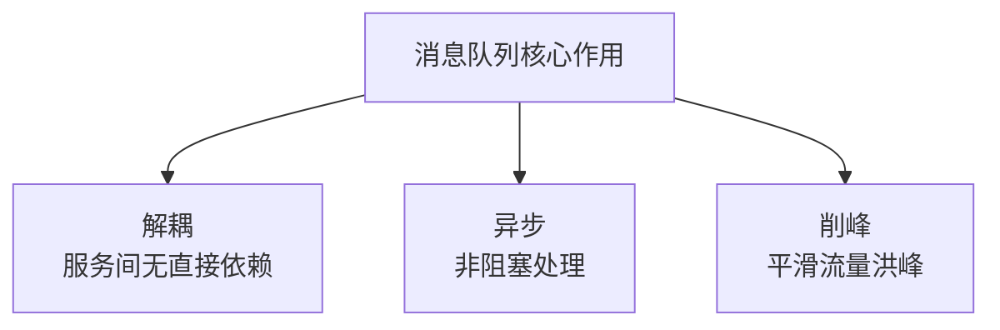

#### 解耦

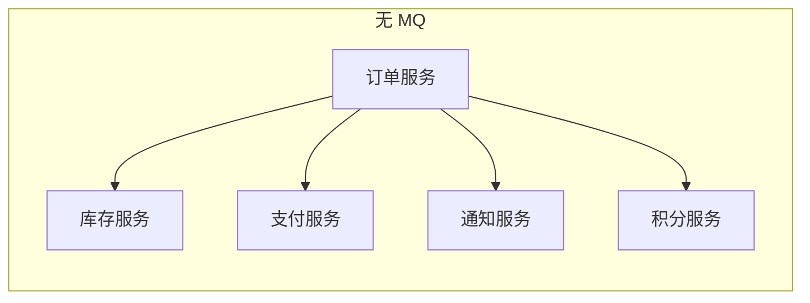

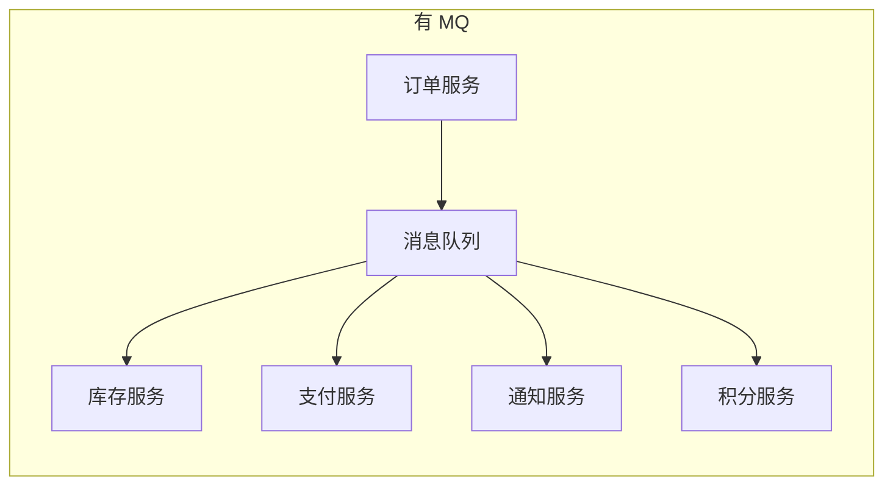

无 MQ 时，新增一个服务（如数据分析）需要修改订单服务代码。有 MQ 后，新服务只需订阅消息，无需改动上游。

#### 异步

```mermaid
graph LR
    subgraph 同步调用<br/>总耗时 = 50+30+20 = 100ms
        A1[用户请求] --> B1[订单 50ms]
        B1 --> C1[库存 30ms]
        C1 --> D1[通知 20ms]
        D1 --> E1[响应 100ms]
    end
```

```mermaid
graph LR
    subgraph 异步消息<br/>总耗时 = 50ms
        A2[用户请求] --> B2[订单 50ms]
        B2 --> C2[响应 50ms]
        B2 -.->|异步| MQ[消息队列]
        MQ -.-> D2[库存 30ms]
        MQ -.-> E2[通知 20ms]
    end
```

#### 削峰

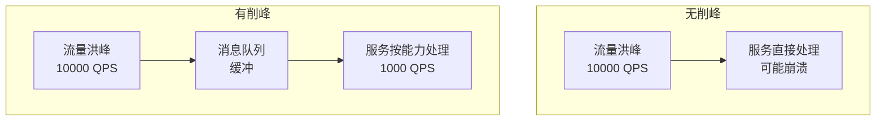

### 1.2 消息模型

| 模型 | 描述 | 典型场景 |
|------|------|---------|
| **点对点（P2P）** | 一条消息只能被一个消费者消费 | 任务分发 |
| **发布订阅（Pub/Sub）** | 一条消息可以被多个消费者消费 | 事件通知 |

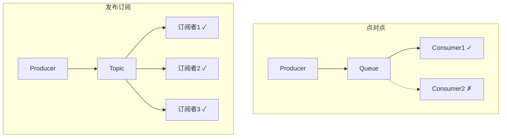

---

## 二、Kafka 架构与原理

### 2.1 整体架构

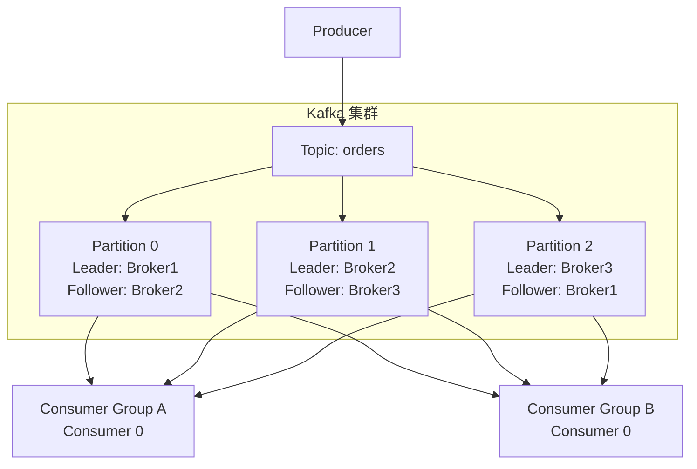

### 2.2 核心概念

| 概念 | 描述 |
|------|------|
| **Broker** | Kafka 服务节点 |
| **Topic** | 消息的逻辑分类 |
| **Partition** | Topic 的物理分片，有序、不可变日志 |
| **Offset** | 消息在 Partition 中的位置 |
| **Consumer Group** | 消费者组，组内消费者分摊 Partition |
| **Replica** | Partition 的副本，保证高可用 |

### 2.3 分区与消费

**关键规则**：一个 Partition 在同一时刻只能被同一个 Consumer Group 中的一个 Consumer 消费。

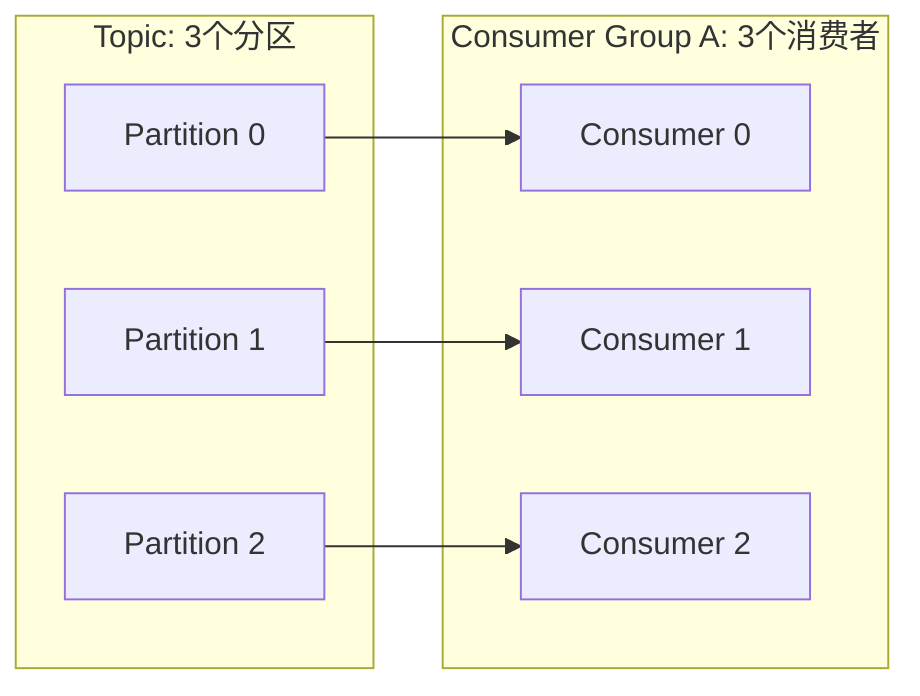

如果消费者数 > 分区数，多余的消费者会空闲。

### 2.4 消息存储机制

Kafka 使用**追加日志（Append-Only Log）**存储消息，这是其高性能的核心。

```
Partition 0 (磁盘文件):
┌──────────────────────────────────────────────┐
│ Offset: 0    1    2    3    4    5    6    7 │
│ Data:   msg0 msg1 msg2 msg3 msg4 msg5 msg6 msg7│
│                              ↑               │
│                           Consumer Offset     │
└──────────────────────────────────────────────┘
```

- **顺序写**：消息追加到日志末尾，磁盘顺序写性能接近内存
- **零拷贝**：使用 `sendfile` 系统调用，数据直接从页缓存到网卡
- **页缓存**：利用操作系统页缓存，避免 JVM GC 问题

### 2.5 生产者可靠性

```java
// Kafka Producer 配置
Properties props = new Properties();
props.put("bootstrap.servers", "broker1:9092,broker2:9092");
props.put("acks", "all");              // 等待所有副本确认
props.put("retries", Integer.MAX_VALUE); // 无限重试
props.put("enable.idempotence", "true"); // 幂等生产
props.put("max.in.flight.requests.per.connection", "5");
props.put("compression.type", "lz4");   // 压缩

KafkaProducer<String, String> producer = new KafkaProducer<>(props);

// 同步发送
RecordMetadata metadata = producer.send(record).get();

// 异步发送 + 回调
producer.send(record, (metadata, exception) -> {
    if (exception != null) {
        log.error("发送失败", exception);
        // 处理失败：重试、告警、死信队列
    }
});
```

**acks 配置对比**：

| acks | 行为 | 可靠性 | 延迟 |
|------|------|--------|------|
| 0 | 不等待确认 | 最低 | 最低 |
| 1 | 等待 Leader 确认 | 中等 | 中等 |
| all | 等待所有 ISR 确认 | 最高 | 最高 |

### 2.6 消费者与 Offset 管理

```java
// Kafka Consumer 配置
Properties props = new Properties();
props.put("bootstrap.servers", "broker1:9092");
props.put("group.id", "order-service");
props.put("enable.auto.commit", "false"); // 手动提交
props.put("auto.offset.reset", "earliest"); // 无 offset 时从头消费
props.put("isolation.level", "read_committed"); // 只读已提交消息

KafkaConsumer<String, String> consumer = new KafkaConsumer<>(props);
consumer.subscribe(Arrays.asList("orders"));

while (true) {
    ConsumerRecords<String, String> records = consumer.poll(Duration.ofMillis(100));
    for (ConsumerRecord<String, String> record : records) {
        processMessage(record);
    }
    // 手动同步提交
    consumer.commitSync();
    // 或手动异步提交
    // consumer.commitAsync();
}
```

---

## 三、RabbitMQ 架构与原理

### 3.1 核心架构

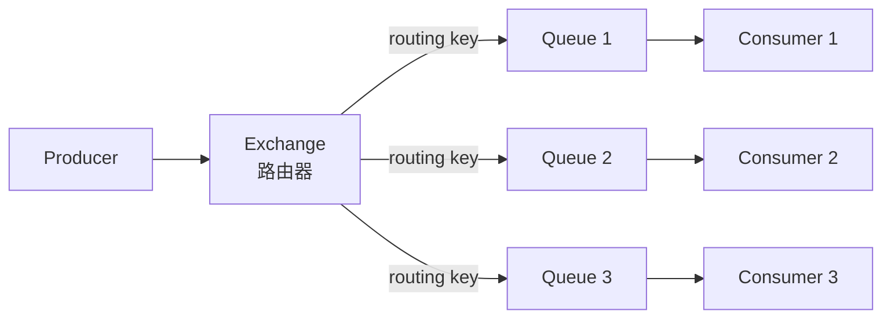

### 3.2 Exchange 类型

| 类型 | 路由规则 | 场景 |
|------|---------|------|
| **Direct** | 精确匹配 routing key | 点对点、路由 |
| **Fanout** | 广播到所有绑定队列 | 广播通知 |
| **Topic** | 通配符匹配 routing key | 订阅过滤 |
| **Headers** | 匹配消息头属性 | 复杂路由 |

```java
// RabbitMQ Exchange 类型示例
// Direct: routing key = "order.created" → 只路由到绑定了此 key 的队列
// Fanout: 忽略 routing key → 路由到所有绑定队列
// Topic: routing key = "order.*" → 匹配 order.created, order.cancelled 等
// Topic: routing key = "order.#" → 匹配 order.created.paid 等（多级）
```

### 3.3 消息确认机制

```java
// 生产者确认（Publisher Confirm）
channel.confirmSelect(); // 开启确认模式
channel.basicPublish("", "queue", null, message.getBytes());
channel.waitForConfirmsOrDie(5000); // 等待确认

// 消费者确认（Consumer ACK）
boolean autoAck = false;
channel.basicConsume("queue", autoAck, new DefaultConsumer(channel) {
    @Override
    public void handleDelivery(String tag, Envelope envelope,
                               AMQP.BasicProperties props, byte[] body) {
        try {
            processMessage(body);
            channel.basicAck(envelope.getDeliveryTag(), false); // 确认
        } catch (Exception e) {
            channel.basicNack(envelope.getDeliveryTag(), false, true); // 重回队列
        }
    }
});
```

---

## 四、Kafka vs RabbitMQ 深度对比

| 维度 | Kafka | RabbitMQ |
|------|-------|----------|
| 定位 | 分布式流平台 | 消息代理 |
| 消息模型 | 发布订阅（Topic/Partition） | 多种（Direct/Fanout/Topic） |
| 消息存储 | 持久化日志（可回溯） | 消费后删除 |
| 吞吐量 | 极高（百万级 QPS） | 较高（万级 QPS） |
| 延迟 | 毫秒级 | 微秒级 |
| 消息顺序 | Partition 内有序 | Queue 内有序 |
| 消费模式 | 拉取（Pull） | 推送（Push） |
| 消费者组 | 原生支持 | 需要插件 |
| 消息回溯 | 支持（通过 Offset） | 不支持 |
| 事务消息 | 支持（Exactly Once） | 有限支持 |
| 适合场景 | 日志、流处理、大数据 | 业务消息、任务队列、RPC |

### 选型建议

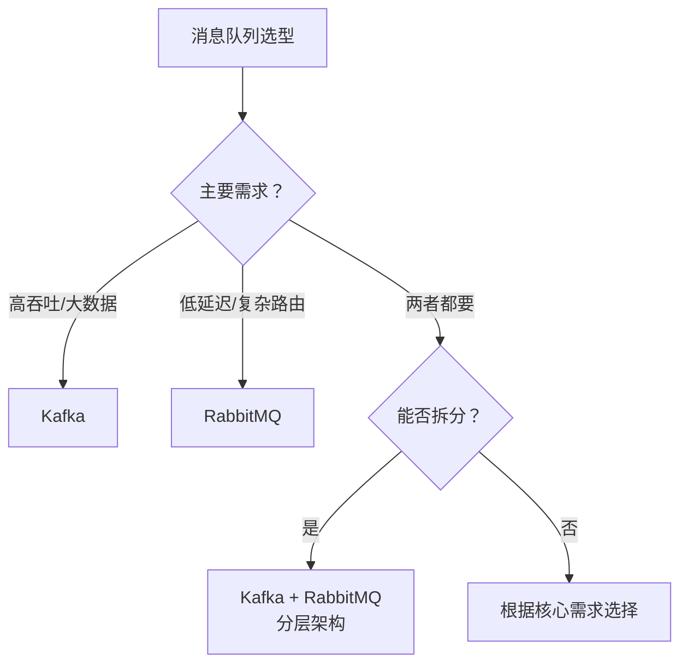

---

## 五、消息可靠性保证

### 5.1 消息丢失的三种场景

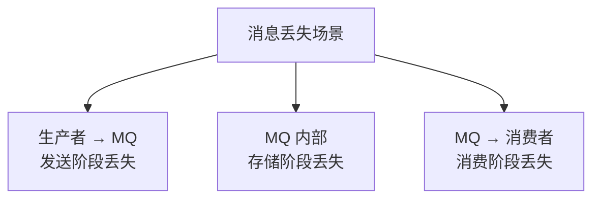

### 5.2 各阶段的可靠性保证

#### 生产者端

| 策略 | Kafka | RabbitMQ |
|------|-------|----------|
| 确认机制 | acks=all | Publisher Confirm |
| 重试 | retries + 幂等 | 重试 + 幂等 |
| 事务 | 事务 Producer | 事务 Channel |
| 本地消息表 | 可选 | 可选 |

#### MQ 端

| 策略 | Kafka | RabbitMQ |
|------|-------|----------|
| 持久化 | 日志落盘 | 队列+消息持久化 |
| 副本 | ISR 副本 | 镜像队列（HA） |
| 最小副本 | min.insync.replicas | ha-promote-on-shutdown |

#### 消费者端

| 策略 | Kafka | RabbitMQ |
|------|-------|----------|
| 手动确认 | enable.auto.commit=false | autoAck=false |
| 幂等消费 | 业务去重 | 业务去重 |
| 死信队列 | DLT（Spring Kafka） | DLX |

### 5.3 幂等性保证

```java
// 幂等消费：唯一消息 ID + 去重表
@Service
public class OrderMessageConsumer {

    @KafkaListener(topics = "orders")
    public void consume(ConsumerRecord<String, String> record) {
        String messageId = record.key() + ":" + record.offset();

        // 1. 检查是否已处理（Redis 或数据库）
        if (messageCache.exists(messageId)) {
            log.info("消息已处理，跳过: {}", messageId);
            return;
        }

        // 2. 处理业务逻辑
        Order order = JSON.parseObject(record.value(), Order.class);
        orderService.process(order);

        // 3. 标记消息已处理
        messageCache.set(messageId, "1", 24, TimeUnit.HOURS);
    }
}

// 幂等消费：利用数据库唯一约束
@KafkaListener(topics = "payments")
public void consume(PaymentEvent event) {
    try {
        // INSERT ... ON DUPLICATE KEY IGNORE
        paymentMapper.insertIgnore(event); // 唯一键 = 事件 ID
    } catch (DuplicateKeyException e) {
        log.info("重复消息，跳过: {}", event.getId());
    }
}
```

---

## 六、消息顺序性

### 6.1 顺序性级别

| 级别 | 保证 | 代价 |
|------|------|------|
| 全局有序 | 所有消息严格按序 | 单 Partition/Queue，吞吐极低 |
| 分区有序 | 同一 Key 的消息有序 | 合理设计 Partition Key |
| 无序 | 不保证顺序 | 最高吞吐 |

### 6.2 Kafka 分区有序

```java
// 保证同一订单的消息有序：使用订单 ID 作为 Partition Key
ProducerRecord<String, String> record = new ProducerRecord<>(
    "orders",
    orderId,    // Key → 决定 Partition
    orderJson   // Value
);
// 相同 orderId 的消息一定路由到同一 Partition，保证有序
```

### 6.3 顺序消费的陷阱

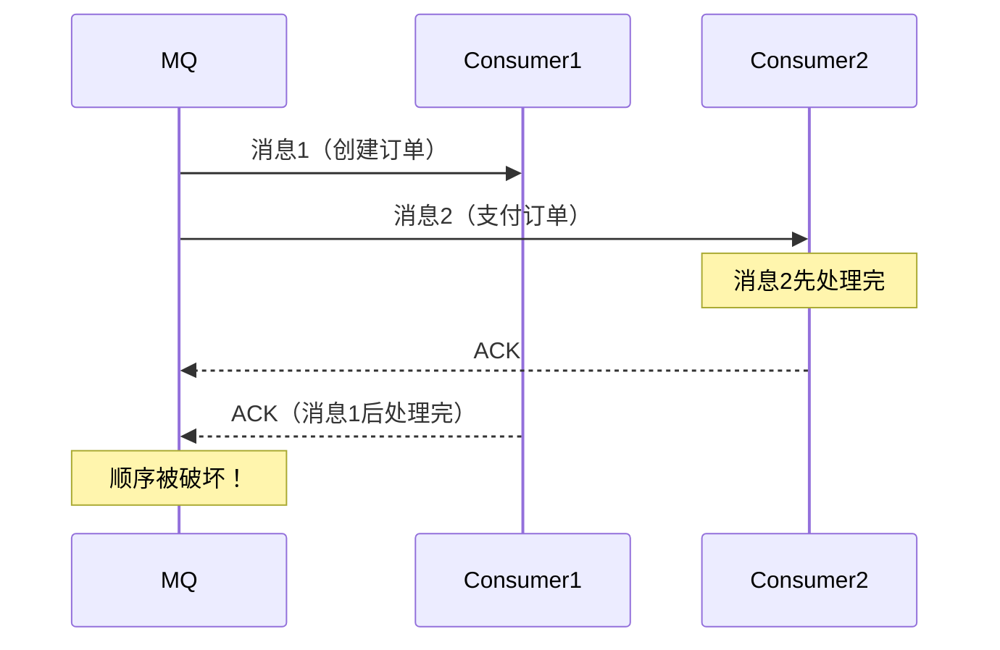

**解决方案**：同一 Key 的消息由同一个消费者串行处理。

```java
// 单线程消费 + 线程池按 Key 分发
@KafkaListener(topics = "orders")
public void consume(List<ConsumerRecord<String, String>> records) {
    // 按 Key 分组
    Map<String, List<ConsumerRecord<String, String>>> grouped = records.stream()
        .collect(Collectors.groupingBy(ConsumerRecord::key));

    // 同一 Key 的消息串行处理
    grouped.forEach((key, msgs) -> {
        msgs.forEach(msg -> processMessage(msg));
    });
}
```

---

## 七、消息积压处理

### 7.1 积压原因

| 原因 | 描述 |
|------|------|
| 消费速度 < 生产速度 | 消费者处理慢 |
| 消费者故障 | 服务宕机或异常 |
| 消费逻辑阻塞 | 依赖的下游服务慢 |
| 分区不均衡 | 某些 Partition 消息过多 |

### 7.2 应急处理

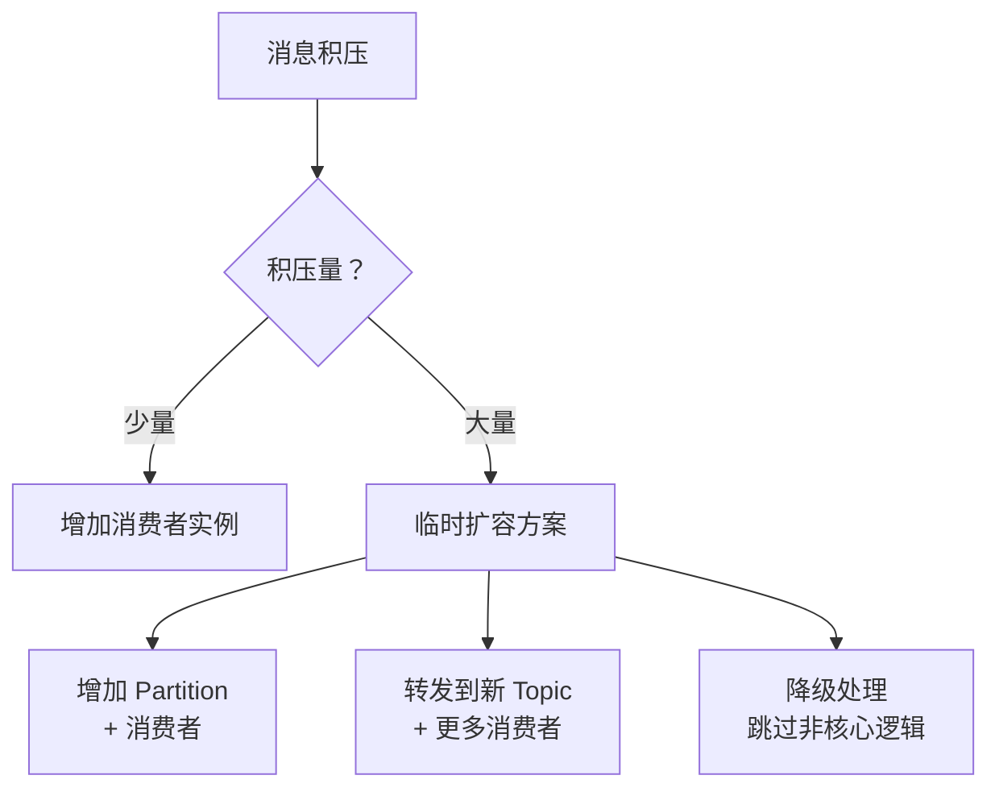

```java
// 紧急扩容：转发到更多 Partition 的临时 Topic
@KafkaListener(topics = "orders")
public void emergencyConsume(ConsumerRecord<String, String> record) {
    // 转发到临时 Topic（更多 Partition）
    emergencyProducer.send(new ProducerRecord<>(
        "orders-emergency", record.key(), record.value()
    ));
}

// 临时 Topic 的消费者（更多实例）
@KafkaListener(topics = "orders-emergency", concurrency = "10")
public void fastConsume(ConsumerRecord<String, String> record) {
    // 简化处理逻辑，快速消费
    simplifiedProcess(record);
}
```

---

## 八、面试 Q&A

**Q1：Kafka 为什么这么快？**

1. **顺序写**：消息追加到日志末尾，磁盘顺序写速度接近内存随机写
2. **零拷贝**：使用 `sendfile` 系统调用，数据从页缓存直接到网卡，避免用户态拷贝
3. **页缓存**：利用 OS 页缓存而非 JVM 堆，避免 GC 问题
4. **批量操作**：生产者批量发送，消费者批量拉取，减少网络开销
5. **分区并行**：多个 Partition 并行读写，水平扩展
6. **压缩**：生产者压缩，Broker 保存压缩格式，消费者解压

**Q2：Kafka 如何保证 Exactly-Once 语义？**

Kafka 通过三个层面的保证实现 Exactly-Once：
1. **幂等生产者**（`enable.idempotence=true`）：为每个 Producer 分配 PID，为每条消息分配 Sequence Number，Broker 去重
2. **事务**（`transactional.id`）：跨 Partition 的原子写入
3. **消费-处理-生产**一体化事务：消费 Offset 和生产消息在同一事务中提交

**Q3：RabbitMQ 的消息确认和 Kafka 的 Offset 提交有什么区别？**

RabbitMQ 的 ACK 是**逐条确认**，消费者处理完一条消息后发送 ACK，Broker 才删除消息。Kafka 的 Offset 提交是**批量确认**，消费者提交 Offset 表示此位置之前的消息都已处理。RabbitMQ 更精确但性能较低，Kafka 批量提交性能高但重启后可能重复消费。

**Q4：如何处理消息消费失败？**

1. **重试**：有限次数重试，递增间隔
2. **死信队列**：重试次数耗尽后转入死信队列，人工处理
3. **降级**：跳过非核心逻辑，保证主流程
4. **告警**：失败时告警，及时介入

**Q5：Kafka 的 ISR 是什么？为什么需要它？**

ISR（In-Sync Replicas）是与 Leader 保持同步的副本集合。只有 ISR 中的副本才能被选为新 Leader。ISR 的存在是为了平衡**可靠性**和**可用性**：如果等待所有副本同步（包括慢副本），延迟会很高；如果只等 Leader，可靠性不够。ISR 允许系统在两者之间灵活调整。

**Q6：消息队列会不会成为系统的单点故障？**

有可能。防范措施：1）MQ 集群部署（Kafka 多 Broker，RabbitMQ 镜像队列）；2）消费者降级：MQ 不可用时切换到同步调用或本地缓存；3）生产者降级：MQ 不可用时写入本地消息表，恢复后补发；4）监控告警：及时发现 MQ 故障。

---

## 总结

消息队列是分布式系统的核心基础设施，但引入 MQ 也带来了复杂性：消息丢失、重复消费、顺序性、积压等问题。理解 Kafka 和 RabbitMQ 的设计哲学差异——Kafka 追求高吞吐和持久化，RabbitMQ 追求低延迟和灵活路由——才能在工程中做出正确的选型。记住：**消息队列不是万能的，引入 MQ 的代价是系统的复杂度增加**。

<div class='context-nav'>
<a class='context-link prev' href='/software-fundamentals/posts/分布式系统-分布式事务/'><span class='context-label'>上一篇</span><span class='context-title'>分布式系统：分布式事务——从 2PC 到 Saga 的演进</span></a>
<a class='context-link next' href='/software-fundamentals/posts/消息队列-消息队列面试题/'><span class='context-label'>下一篇</span><span class='context-title'>消息队列面试</span></a>
</div>
