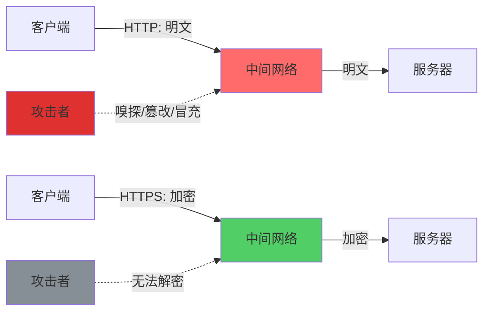
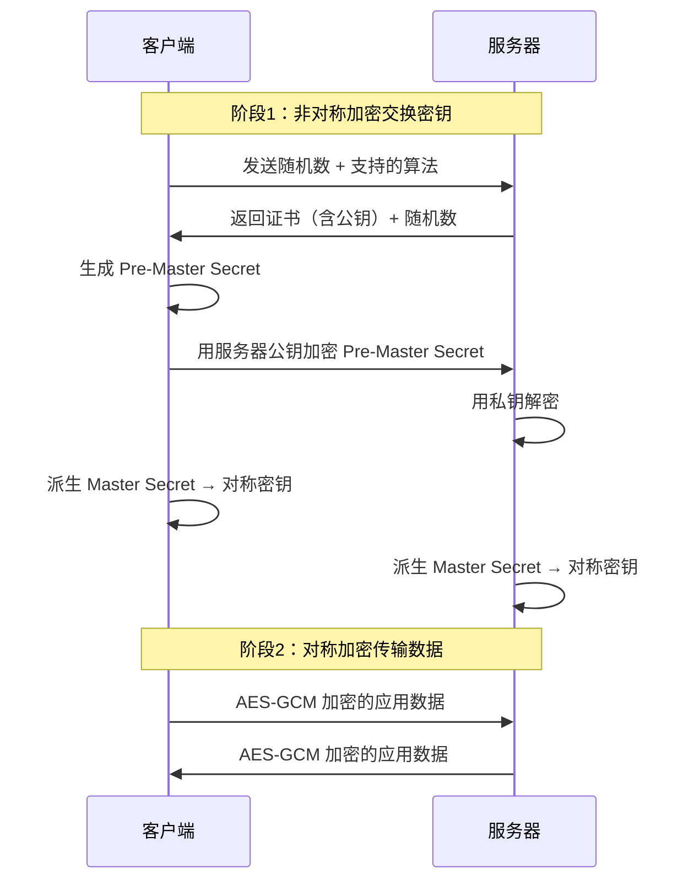
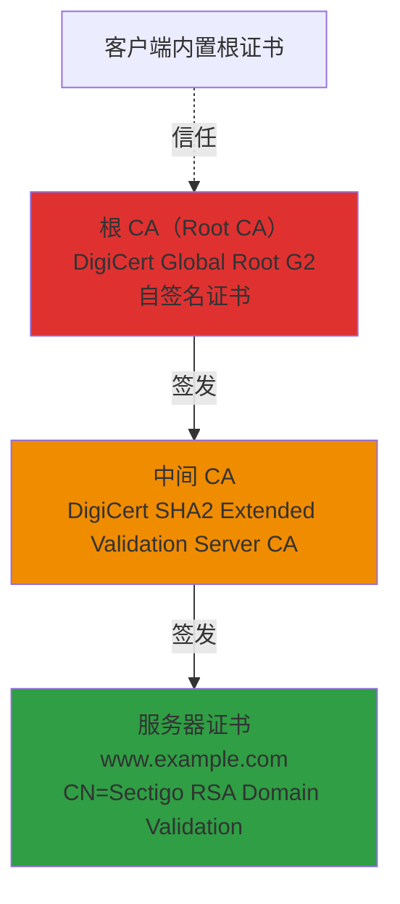
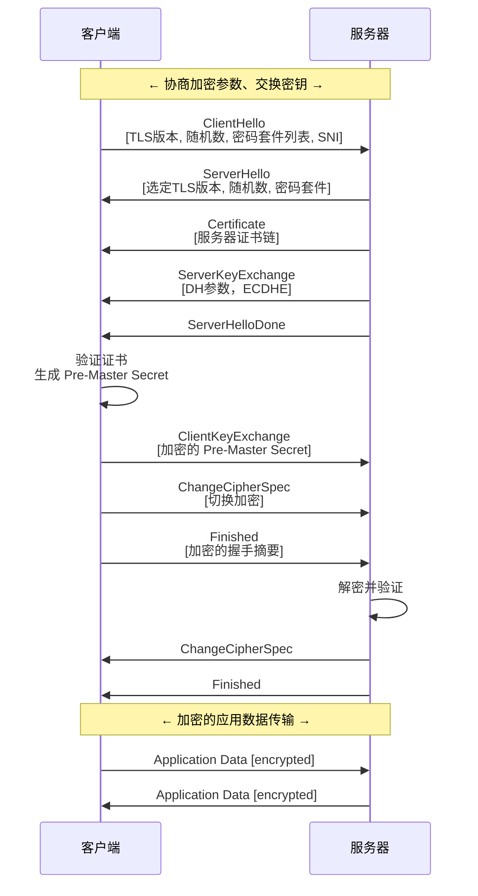
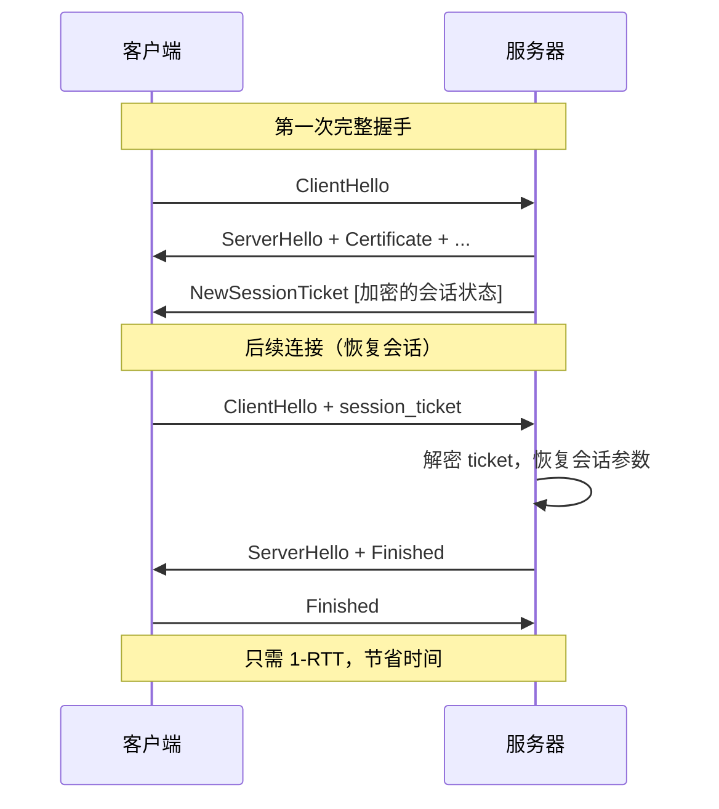
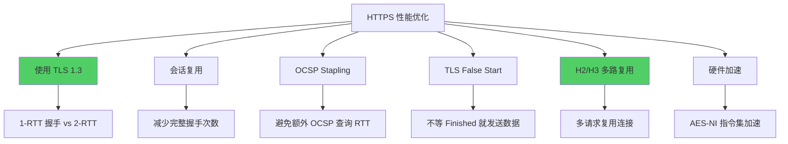
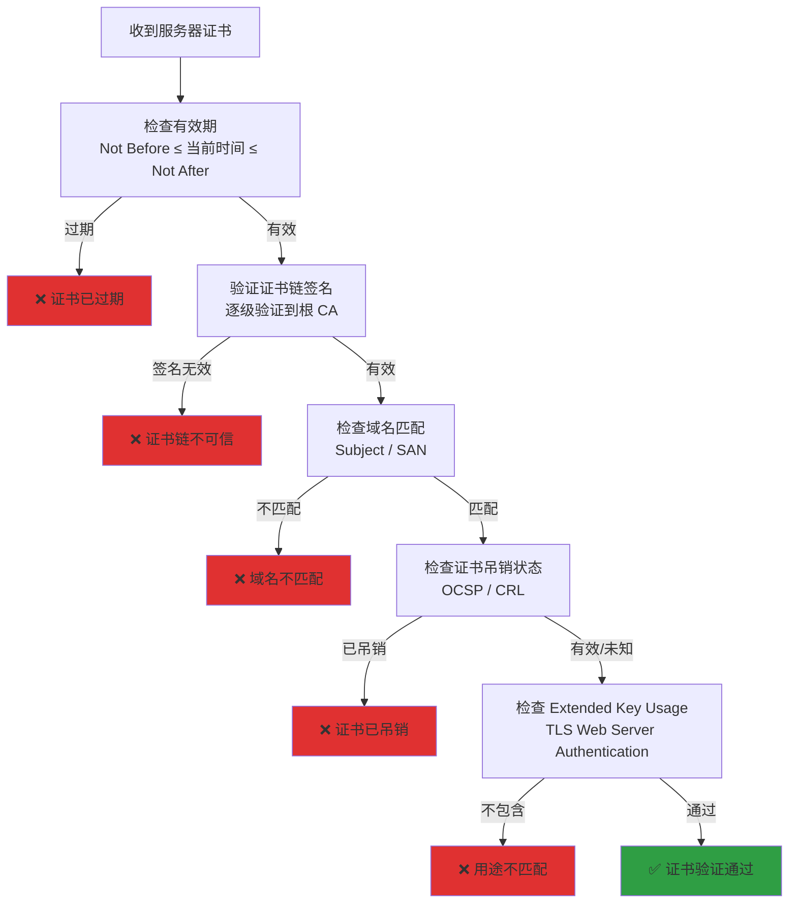

## 引言

HTTPS = HTTP + TLS（Transport Layer Security）。在当今的互联网中，HTTPS 已经成为标配——浏览器对非 HTTPS 网站显示"不安全"警告，Google 将 HTTPS 作为搜索排名信号，HTTP/2 和 HTTP/3 在实践中都要求加密连接。本文将从加密基础到 TLS 握手细节，系统讲解 HTTPS 安全通信的原理与工程实践。

## 为什么需要 HTTPS

HTTP 明文传输面临三大安全风险：

| 风险 | 描述 | 实际案例 |
|------|------|----------|
| **窃听（Eavesdropping）** | 攻击者通过网络嗅探获取传输内容 | 公共 WiFi 嗅探用户密码、Session Cookie |
| **篡改（Tampering）** | 中间人修改传输内容 | ISP 注入广告、恶意重定向 |
| **冒充（Impersonation）** | 攻击者伪装成目标服务器 | 钓鱼 WiFi 热点、DNS 劫持到伪造站点 |



**HTTPS 解决的核心问题：**

1. **机密性**：通过加密确保传输内容不被第三方读取
2. **完整性**：通过 MAC（Message Authentication Code）确保数据未被篡改
3. **身份认证**：通过数字证书确保服务器身份可信

## 加密基础

### 对称加密 vs 非对称加密

| 特性 | 对称加密（AES） | 非对称加密（RSA/ECC） |
|------|-----------------|----------------------|
| 密钥 | 同一把密钥用于加密和解密 | 公钥加密，私钥解密 |
| 速度 | 快（硬件加速可达 GB/s） | 慢（RSA 2048 比 AES 慢 1000x） |
| 密钥分发 | 困难（如何安全传递密钥？） | 公钥可公开 |
| 典型算法 | AES-128-GCM, AES-256-CBC, ChaCha20 | RSA-2048, RSA-4096, ECDSA P-256 |
| 用途 | 加密大量数据 | 密钥交换、数字签名 |

**对称加密示例（AES-GCM）：**

```python
from cryptography.hazmat.primitives.ciphers.aead import AESGCM
import os

# 生成 256-bit 密钥
key = AESGCM.generate_key(bit_length=256)
aesgcm = AESGCM(key)

# 生成 nonce（每次加密必须不同）
nonce = os.urandom(12)

# 加密
plaintext = b"Hello, TLS!"
ct = aesgcm.encrypt(nonce, plaintext, None)
print(f"Ciphertext: {ct.hex()}")

# 解密
pt = aesgcm.decrypt(nonce, ct, None)
print(f"Plaintext: {pt.decode()}")
```

### 为什么 TLS 需要两者结合？

TLS 使用**非对称加密交换密钥**，然后使用**对称加密传输数据**——这称为**混合加密系统**：



这种设计的优势：
- 非对称加密解决**密钥分发**问题
- 对称加密解决**性能**问题

## 数字签名与证书

### 数字签名原理

数字签名 = 用私钥对数据的哈希值加密：

```
签名生成：
  1. H = Hash(数据)
  2. 签名 = 私钥加密(H)

签名验证：
  1. H' = Hash(收到的数据)
  2. H'' = 公钥解密(签名)
  3. 如果 H' == H''，则签名有效
```

### X.509 证书结构

```
Certificate:
  Version: 3
  Serial Number: 0x1a2b3c4d5e6f
  Signature Algorithm: sha256WithRSAEncryption
  
  Issuer: 
    C=US, O=Let's Encrypt, CN=R3
  
  Validity:
    Not Before: May  1 00:00:00 2026 GMT
    Not After : Jul 30 00:00:00 2026 GMT
  
  Subject:
    CN=www.example.com
  
  Subject Public Key Info:
    Algorithm: RSA
    Public-Key: (2048 bit)
    ...
  
  Extensions:
    Subject Alternative Name:
      DNS:www.example.com, DNS:example.com
    Key Usage:
      Digital Signature, Key Encipherment
    Extended Key Usage:
      TLS Web Server Authentication
  
  Signature Algorithm: sha256WithRSAEncryption
  Signature Value: ...
```

### 证书链（Chain of Trust）



证书验证流程：
1. 客户端收到服务器证书
2. 沿着证书链向上追溯，用上一级 CA 的公钥验证签名
3. 最终追溯到客户端**内置信任的根 CA**
4. 如果整个链的签名都有效，证书可信

**自签名证书 vs CA 签发证书：**

| 特性 | 自签名证书 | CA 签发证书 |
|------|-----------|------------|
| 签发者 | 自己 | 受信任的 CA |
| 浏览器信任 | ❌ 显示警告 | ✅ 正常显示 |
| 成本 | 免费 | 免费（Let's Encrypt）或付费 |
| 适用场景 | 开发环境、内网 | 生产环境、公网 |
| 吊销检查 | 无 | OCSP/CRL |

### 生成自签名证书

```bash
# 生成私钥
openssl genrsa -out server.key 2048

# 生成证书签名请求（CSR）
openssl req -new -key server.key -out server.csr \
  -subj "/CN=www.example.com/O=My Company/C=US"

# 生成自签名证书（有效期 365 天）
openssl x509 -req -days 365 \
  -in server.csr -signkey server.key -out server.crt

# 查看证书信息
openssl x509 -in server.crt -text -noout
```

## TLS 1.2 握手流程



### 握手详细步骤

**第 1 步：ClientHello**

```
ClientHello {
  client_version: TLS 1.2
  random: 32 bytes  ← 客户端随机数
  cipher_suites: [
    TLS_ECDHE_RSA_WITH_AES_128_GCM_SHA256,
    TLS_ECDHE_RSA_WITH_AES_256_GCM_SHA384,
    TLS_RSA_WITH_AES_128_GCM_SHA256,
    ...
  ]
  compression_methods: [null]
  extensions:
    server_name (SNI): www.example.com
    supported_groups: x25519, secp256r1
    signature_algorithms: rsa_pss_rsae_sha256, ecdsa_secp256r1_sha256
}
```

**第 2 步：ServerHello + Certificate**

```
ServerHello {
  server_version: TLS 1.2
  random: 32 bytes  ← 服务器随机数
  cipher_suite: TLS_ECDHE_RSA_WITH_AES_128_GCM_SHA256
  compression_method: null
}

Certificate {
  [服务器证书, 中间CA证书]
}
```

**第 3 步：密钥交换（ECDHE）**

```
服务器 ECDHE 参数：
  曲线: secp256r1
  服务器公钥: 04a1b2c3...

客户端计算：
  共享密钥 = ECDH(服务器公钥, 客户端私钥)
  Pre-Master Secret = 共享密钥
  
  Master Secret = PRF(Pre-Master Secret, 
                       "master secret",
                       ClientRandom + ServerRandom)
  
  派生密钥：
    client_write_key = PRF(Master Secret, "key expansion", ...)
    server_write_key = PRF(Master Secret, "key expansion", ...)
    client_write_iv  = ...
    server_write_iv  = ...
```

**第 4 步：切换加密**

双方发送 `ChangeCipherSpec` 通知对方后续消息将使用协商的加密参数加密，然后交换 `Finished` 消息验证握手完整性。

## TLS 1.3 的重大改进

TLS 1.3（RFC 8446，2018 年发布）是 TLS 协议历史上最大的变革：

### 1. 1-RTT 握手

```mermaid
sequenceDiagram
    participant C as 客户端
    participant S as 服务器
    
    Note over C,S: TLS 1.3 1-RTT 握手
    
    C->>S: ClientHello<br/>[TLS 1.3, 随机数, 密码套件, SNI,<br/>KeyShare(客户端公钥)]
    S->>S: 选择密码套件，计算共享密钥
    
    S->>C: ServerHello<br/>[随机数, 密码套件, KeyShare]
    S->>C: [Encrypted] Certificate
    S->>C: [Encrypted] CertificateVerify
    S->>C: [Encrypted] Finished
    
    Note over C,S: 此后所有流量加密
    C->>S: [Encrypted] Finished
    C->>S: [Encrypted] Application Data
    S->>C: [Encrypted] Application Data
    
    style C fill:#51cf66
    style S fill:#51cf66
```

与 TLS 1.2 对比：

| 特性 | TLS 1.2 | TLS 1.3 |
|------|---------|---------|
| 首次握手 | 2-RTT | 1-RTT |
| 恢复连接 | 1-RTT (Session ID/Ticket) | 0-RTT (PSK) |
| ServerHello 后 | 明文传输证书 | 全部加密 |
| 往返次数 | 4 条消息（ServerHello + Certificate + KeyExchange + Done） | 2 条消息 |

### 2. 废弃不安全算法

TLS 1.3 **删除**了以下算法：

| 被废弃 | 原因 |
|--------|------|
| RSA 密钥交换 | 无前向安全 |
| 静态 DH | 无前向安全 |
| RC4 | 已被攻破 |
| DES/3DES | 块大小太小，Sweet32 攻击 |
| MD5/SHA-1 | 碰撞攻击 |
| CBC 模式 | BEAST/Lucky13 攻击 |
| 压缩 | CRIME 攻击 |
| 重协商 | 不安全 |

**TLS 1.3 仅支持：**

```
密码套件:
  TLS_AES_128_GCM_SHA256
  TLS_AES_256_GCM_SHA384
  TLS_CHACHA20_POLY1305_SHA256
  TLS_AES_128_CCM_SHA256

密钥交换:
  ECDHE (secp256r1, secp384r1, x25519, x448)
  DHE (ffdhe2048, ffdhe3072, ...)
  PSK (Pre-Shared Key)

签名:
  RSA-PSS
  ECDSA
  EdDSA
```

### 3. 前向安全（Forward Secrecy）强制化

TLS 1.3 **强制要求**使用前向安全的密钥交换：

```
前向安全 = 即使服务器私钥未来泄露，
           也无法解密之前捕获的通信

ECDHE 实现前向安全：
  每次握手生成新的 ECDHE 密钥对
  握手完成后销毁私钥
  即使服务器 RSA 私钥泄露，
  攻击者也无法计算过去的共享密钥
```

## 会话复用（Session Resumption）

避免每次连接都执行完整握手：

| 机制 | 原理 | 安全性 | TLS 版本 |
|------|------|--------|----------|
| **Session ID** | 服务器存储会话状态，客户端发送 ID 恢复 | 服务器需要维护状态 | TLS 1.2 |
| **Session Ticket** | 服务器加密会话状态发给客户端，客户端下次携带 | 依赖 Ticket 密钥安全 | TLS 1.2 |
| **PSK (Pre-Shared Key)** | 基于 TLS 1.3 的 PSK 机制 | 支持 0-RTT | TLS 1.3 |

### Session Ticket 流程



### 0-RTT 数据传输（TLS 1.3 PSK）

```
客户端（恢复连接）：
  ClientHello + PSK + Early Data [0-RTT 应用数据]
  
服务器：
  接受 → 处理 Early Data
  拒绝 → 忽略 Early Data，正常握手
  
注意：0-RTT 数据不防重放攻击，
     只能用于幂等操作（如 GET 请求）
```

## HTTPS 性能开销与优化

### 性能开销分析

| 开销项 | 说明 | 影响 |
|--------|------|------|
| 握手延迟 | TLS 1.2 额外 1-2 RTT | 移动端高延迟网络显著 |
| CPU 开销 | 非对称加密运算（RSA 签名验证） | 现代 CPU 影响很小 |
| 内存开销 | 每个连接需要维护加密状态 | 高并发场景需要考虑 |
| 数据膨胀 | 加密头和 MAC 增加数据大小 | 通常 < 1% |

### 优化手段



**1. OCSP Stapling**

传统 OCSP 查询需要客户端额外向 CA 的 OCSP 服务器发起请求，增加延迟：

```
传统 OCSP：
  客户端 → CA OCSP 服务器 → 证书状态
  （额外 RTT + CA 服务器依赖）

OCSP Stapling：
  服务器定期查询 OCSP 并缓存
  握手时直接将 OCSP 响应附加在 Certificate 消息中
  客户端无需额外查询
```

**2. TLS False Start**

客户端在发送 `ChangeCipherSpec` 后立即开始发送应用数据，不等服务器的 `Finished`：

```
正常流程：Client -> ChangeCipherSpec -> Finished -> Server -> Finished
False Start：Client -> ChangeCipherSpec -> 应用数据（不等 Server Finished）

节省：0.5 RTT
```

**3. 硬件加速**

```bash
# 检查 CPU 是否支持 AES-NI
openssl speed -evp aes-256-gcm

# 结果示例：
# type             16 bytes     64 bytes    256 bytes   1024 bytes   8192 bytes
# aes-256-gcm    123456.78k   456789.12k  1234567.89k  4567890.12k  5678901.23k
```

## HSTS（HTTP Strict Transport Security）

HSTS 告知浏览器**必须**使用 HTTPS 访问该站点：

```http
Strict-Transport-Security: max-age=31536000; includeSubDomains; preload
```

| 参数 | 说明 |
|------|------|
| `max-age` | HSTS 生效时间（秒），31536000 = 1 年 |
| `includeSubDomains` | 所有子域名也强制 HTTPS |
| `preload` | 提交到浏览器 HSTS 预加载列表 |

**防御 SSL Stripping 攻击：**

```
没有 HSTS：
  用户输入 example.com
  → 浏览器默认 HTTP
  → 攻击者拦截并重定向到伪造的 HTTP 站点
  → 用户被钓鱼

有 HSTS：
  用户输入 example.com
  → 浏览器知道该域名必须 HTTPS
  → 直接发起 HTTPS 连接
  → 攻击者无法降级
```

**HSTS 预加载列表：**

浏览器内置的 HSTS 域名列表，首次访问就强制 HTTPS，无需先收到 HSTS 头：

```bash
# 检查域名是否在预加载列表中
# https://hstspreload.org/

# 提交要求：
# 1. 有效的 HTTPS 证书
# 2. HSTS 头 max-age ≥ 1 年
# 3. includeSubDomains
# 4. preload 标志
# 5. 所有 HTTP 请求重定向到 HTTPS
```

## 证书验证流程

浏览器验证 HTTPS 证书的完整流程：



## OCSP 与 CRL（证书吊销检查）

### CRL（Certificate Revocation List）

CA 定期发布吊销证书列表：

```
CRL 文件：
  Issuer: CN=Let's Encrypt R3
  This Update: May 1 00:00:00 2026
  Next Update: May 8 00:00:00 2026
  
  Revoked Certificates:
    Serial Number: 0x1a2b3c4d
      Revocation Date: Apr 28 10:00:00 2026
    Serial Number: 0x5e6f7a8b
      Revocation Date: Apr 30 15:30:00 2026
```

**问题：**
- CRL 文件可能很大（数万条目）
- 更新频率低，吊销后可能有延迟
- 需要下载整个列表

### OCSP（Online Certificate Status Protocol）

实时查询证书状态：

```
OCSP 请求：
  POST / HTTP/1.1
  Host: ocsp.letsencrypt.org
  Content-Type: application/ocsp-request
  
  OCSPRequest {
    tbsRequest {
      requestList {
        reqCert {
          issuerNameHash: sha256(issuer DN)
          issuerKeyHash: sha256(issuer public key)
          serialNumber: 0x1a2b3c4d
        }
      }
    }
  }

OCSP 响应：
  OCSPResponse {
    responseStatus: successful
    responseBytes {
      BasicOCSPResponse {
        certStatus: good / revoked / unknown
        thisUpdate: May 1 00:00:00 2026
        nextUpdate: May 8 00:00:00 2026
      }
    }
  }
```

### CRL vs OCSP 对比

| 特性 | CRL | OCSP | OCSP Stapling |
|------|-----|------|---------------|
| 更新频率 | 定期（周/天） | 实时 | 服务器缓存 |
| 网络开销 | 下载整个列表 | 每次查询 | 零额外 RTT |
| 隐私 | CA 知道哪些证书被查询 | CA 知道访问了哪个站点 | CA 不知道 |
| 浏览器支持 | 所有 | 所有 | 大部分 |
| 延迟 | 低（本地检查） | 高（额外 RTT） | 低（随握手一起） |

**现代最佳实践：使用 OCSP Stapling**

```nginx
server {
    listen 443 ssl;
    server_name www.example.com;

    ssl_certificate     /etc/ssl/certs/example.com.crt;
    ssl_certificate_key /etc/ssl/private/example.com.key;
    
    # 启用 OCSP Stapling
    ssl_stapling on;
    ssl_stapling_verify on;
    ssl_trusted_certificate /etc/ssl/certs/chain.pem;
    
    # DNS 服务器用于 OCSP 响应验证
    resolver 8.8.8.8 8.8.4.4 valid=300s;
    resolver_timeout 5s;
}
```

## 面试 Q&A

**Q1: TLS 1.3 相比 TLS 1.2 有哪些主要改进？**

A: (1) **握手延迟**：TLS 1.3 首次握手只需 1-RTT（TLS 1.2 需要 2-RTT），恢复连接支持 0-RTT；(2) **安全性**：废弃了 RSA 密钥交换、RC4、3DES、MD5、SHA-1、CBC 等不安全算法，强制前向安全；(3) **加密范围**：ServerHello 之后的所有消息（包括证书）都加密传输，TLS 1.2 中证书是明文传输的；(4) **密码套件简化**：将密钥交换和认证参数分离到单独的扩展中，密码套件只指定 AEAD 算法和哈希函数。

**Q2: 什么是前向安全（Forward Secrecy）？为什么重要？**

A: 前向安全指即使服务器的长期私钥在未来被泄露，攻击者也无法解密之前捕获的加密通信。TLS 通过 ECDHE（椭圆曲线 Diffie-Hellman 临时密钥交换）实现前向安全：每次握手生成新的临时密钥对，握手完成后销毁。如果仅使用 RSA 密钥交换，攻击者记录加密流量后，一旦获取服务器私钥即可解密所有历史流量。

**Q3: SNI（Server Name Indication）是什么？为什么需要它？**

A: SNI 是 TLS 的一个扩展，允许客户端在 ClientHello 中指明要访问的域名。在一台服务器托管多个 HTTPS 站点时，服务器需要知道客户端要访问哪个域名才能返回正确的证书。没有 SNI 的话，服务器无法在 TLS 握手阶段确定目标域名（因为 HTTP 请求在 TLS 加密之后），只能返回默认证书。注意：SNI 在 TLS 1.3 中仍然是明文传输的（虽然 TLS 1.3 引入了 Encrypted SNI 扩展 ECH 来解决这个问题）。

**Q4: HTTPS 的性能开销大吗？如何优化？**

A: 现代硬件下 HTTPS 的性能开销很小。优化策略：(1) 使用 TLS 1.3 减少握手 RTT；(2) 启用会话复用（Session Ticket/PSK）避免重复握手；(3) 启用 OCSP Stapling 避免额外的证书吊销检查 RTT；(4) 使用 HTTP/2 或 HTTP/3 多路复用减少连接数；(5) 使用 AES-NI 硬件加速；(6) 部署 HSTS 避免 HTTP→HTTPS 重定向；(7) 使用 CDN 就近接入。实际测量表明，TLS 握手延迟在良好网络下通常 < 50ms。

**Q5: 证书链验证失败可能有哪些原因？**

A: (1) **证书过期**：当前时间不在 Not Before 和 Not After 之间；(2) **域名不匹配**：请求的域名不在证书的 Subject 或 SAN（Subject Alternative Name）中；(3) **证书链不完整**：服务器未发送中间 CA 证书，客户端无法追溯到信任的根 CA；(4) **证书已吊销**：通过 OCSP 或 CRL 检查发现证书被 CA 吊销；(5) **根证书不受信任**：客户端信任库中没有对应的根 CA 证书（常见于自签名证书或新 CA）；(6) **签名算法不支持**：客户端不支持证书的签名算法。

**Q6: 什么是 HSTS？它如何防御 SSL Stripping 攻击？**

A: HSTS（HTTP Strict Transport Security）通过响应头告知浏览器在一定时间内必须使用 HTTPS 访问该站点。SSL Stripping 攻击中，攻击者拦截用户到服务器的连接，将 HTTPS 降级为 HTTP，用户在不知情的情况下通过明文传输数据。HSTS 使浏览器在知道站点支持 HSTS 后，自动将 HTTP 请求升级为 HTTPS，攻击者无法降级。结合 HSTS 预加载列表，即使是首次访问也能强制 HTTPS。
