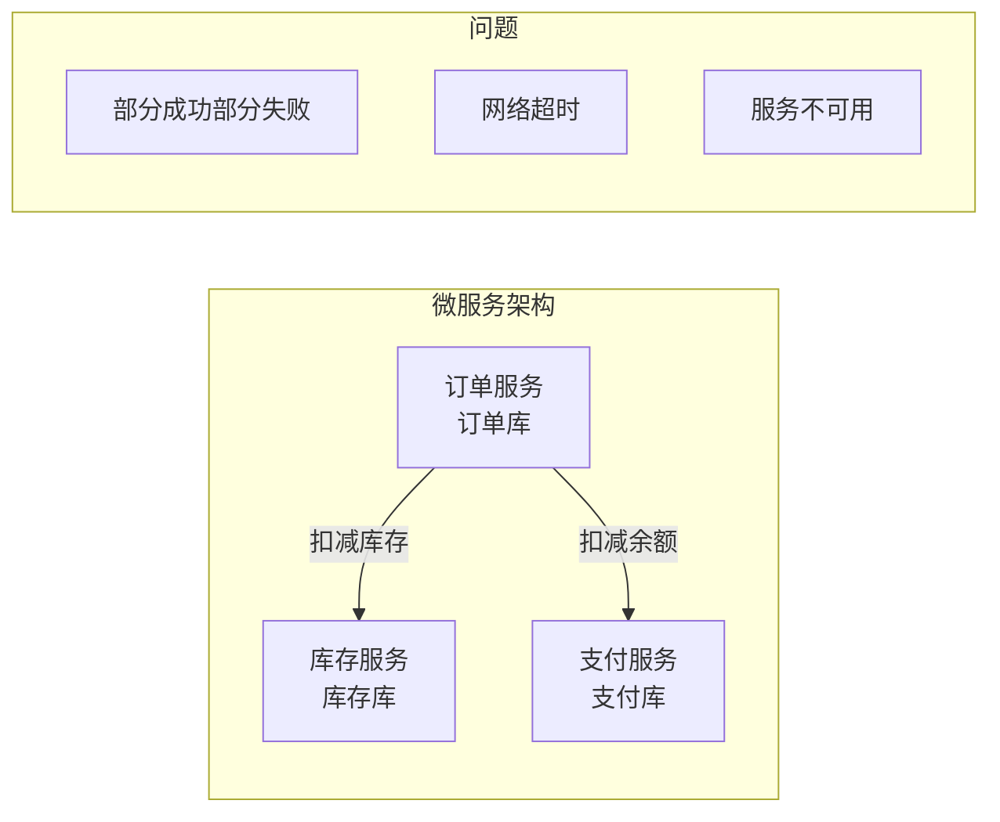
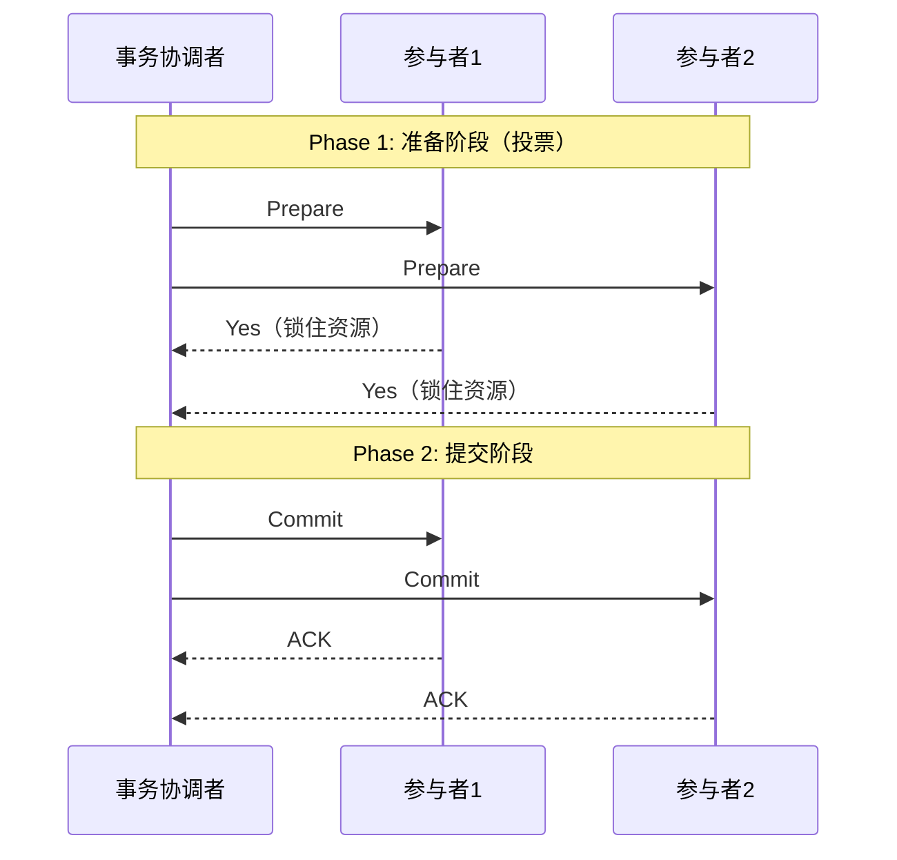
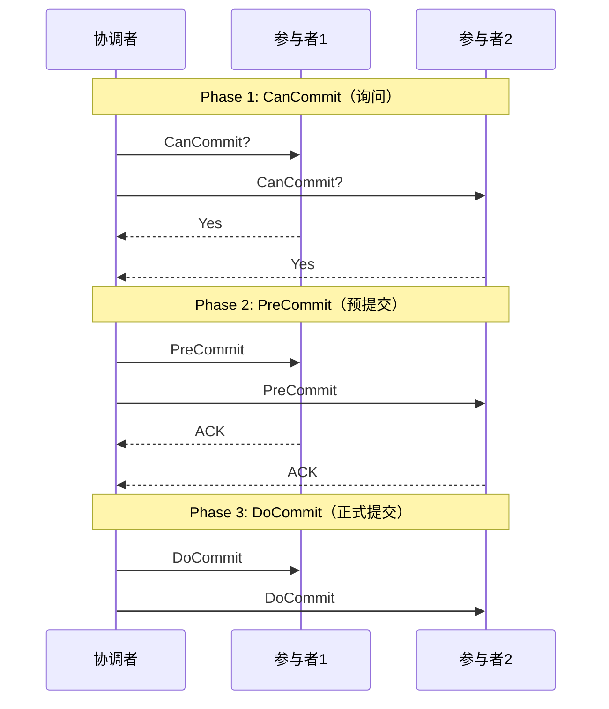
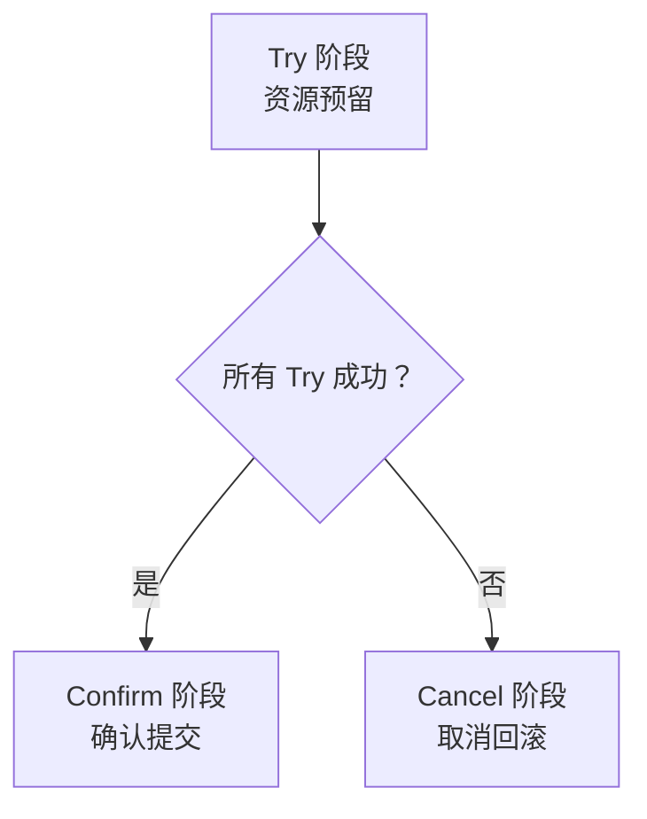
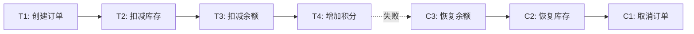
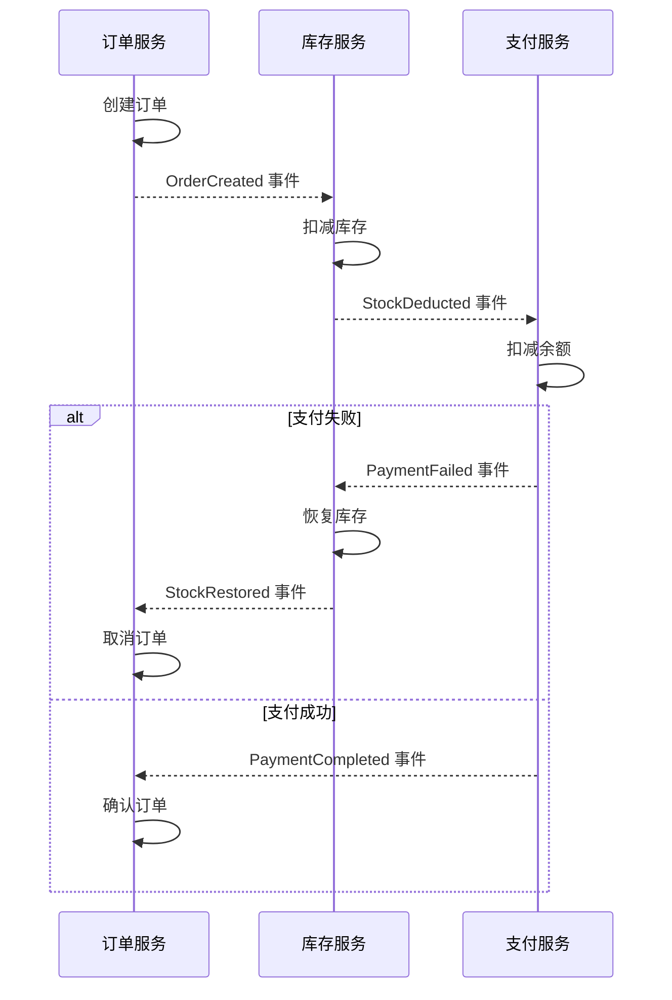
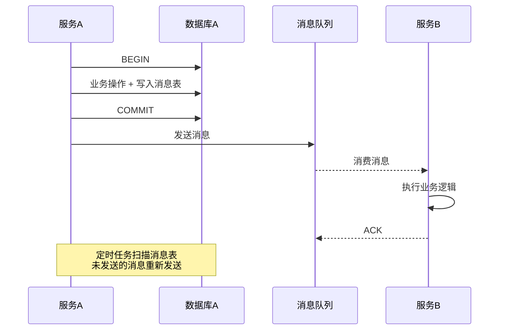
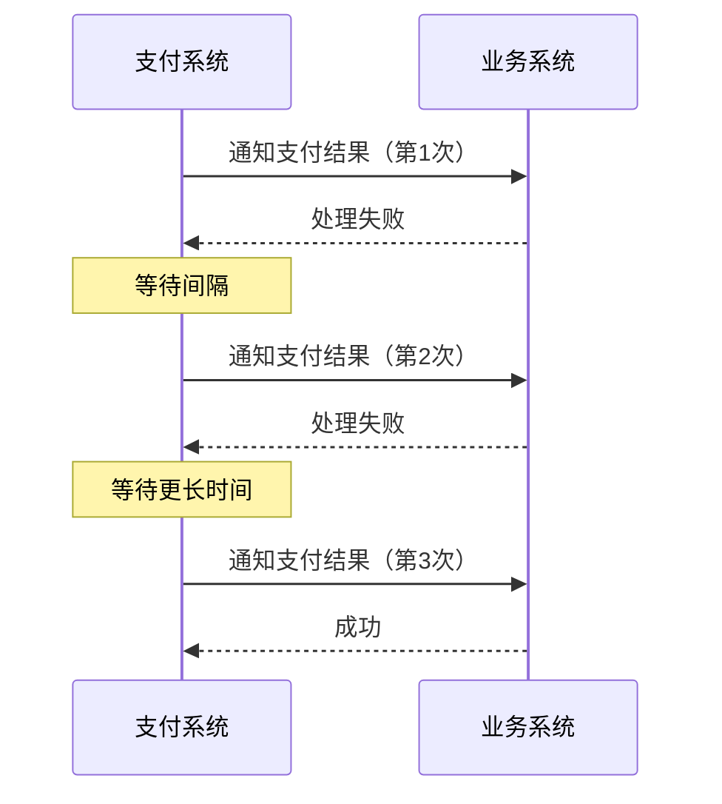
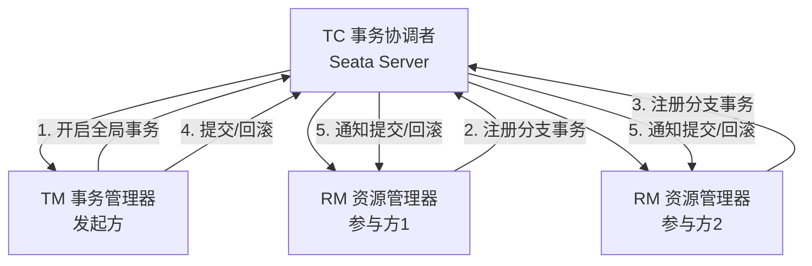
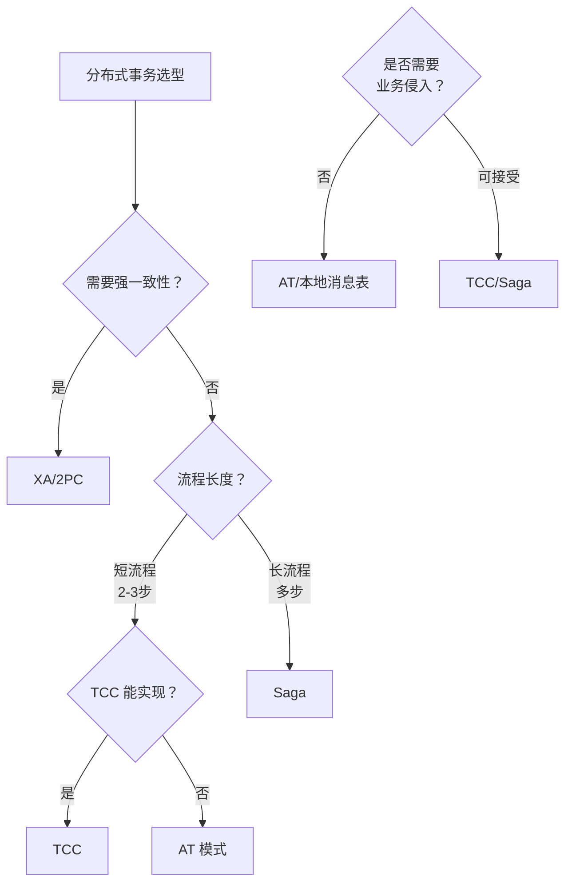

## 分布式事务：跨服务的数据一致性

> "A distributed system is one in which the failure of a computer you didn't even know existed can render your own computer unusable." —— Leslie Lamport

微服务架构下，一个业务操作可能涉及多个服务的数据变更。如何保证这些变更要么全部成功、要么全部回滚？这就是分布式事务要解决的核心问题。

---

## 一、分布式事务的挑战

### 1.1 从本地事务到分布式事务

```sql
-- 本地事务：单数据库，ACID 有保障
BEGIN;
UPDATE account SET balance = balance - 100 WHERE id = 1;
UPDATE account SET balance = balance + 100 WHERE id = 2;
COMMIT;
```



### 1.2 分布式事务的难点

| 难点 | 描述 |
|------|------|
| 原子性 | 多个服务的数据变更需要原子性保证 |
| 网络不可靠 | 请求可能超时、丢失、重复 |
| 无全局时钟 | 无法像单机那样用锁协调 |
| 部分失败 | 有的服务成功有的失败，需要回滚 |
| 长事务 | 跨服务事务可能持续很长时间 |

### 1.3 ACID vs BASE

| 维度 | ACID | BASE |
|------|------|------|
| 原子性 | 全有或全无 | 允许中间状态 |
| 一致性 | 强一致 | 最终一致 |
| 隔离性 | 严格隔离 | 允许短暂不一致 |
| 持久性 | 立即持久 | 最终持久 |
| 适用场景 | 单库事务 | 分布式事务 |
| 性能 | 低（需加锁） | 高（异步补偿） |

---

## 二、2PC（两阶段提交）

### 2.1 协议流程



```java
// 2PC 协调者伪代码
class Coordinator {
    boolean commit() {
        // Phase 1: Prepare
        boolean allPrepared = true;
        for (Participant p : participants) {
            try {
                if (!p.prepare()) {
                    allPrepared = false;
                    break;
                }
            } catch (TimeoutException e) {
                allPrepared = false;
                break;
            }
        }

        // Phase 2: Commit or Abort
        if (allPrepared) {
            for (Participant p : participants) {
                p.commit();
            }
            return true;
        } else {
            for (Participant p : participants) {
                p.abort();
            }
            return false;
        }
    }
}
```

### 2.2 2PC 的问题

| 问题 | 描述 |
|------|------|
| **阻塞** | 参与者在 Prepare 后锁住资源，等待 Commit/Abort |
| **单点故障** | 协调者宕机，参与者永远阻塞 |
| **数据不一致** | Phase 2 中部分参与者收到 Commit，部分未收到 |
| **太保守** | 任一参与者说 No 或超时，整个事务回滚 |

### 2.3 3PC（三阶段提交）

3PC 将 2PC 的准备阶段拆分为 CanCommit 和 PreCommit，增加超时机制减少阻塞。



3PC 的改进：参与者超时后可以自行决定提交（如果已 PreCommit），减少阻塞。但仍无法解决网络分区导致的数据不一致问题，且多一轮通信增加了延迟。**工程中极少使用 3PC。**

---

## 三、TCC 模式

### 3.1 原理

TCC（Try-Confirm-Cancel）是业务层面的分布式事务方案，将每个操作分为三个阶段：



### 3.2 实现示例

```java
// TCC 模式实现：转账场景
public class TransferService {

    // ===== Try 阶段：资源预留 =====
    @Transactional
    public boolean tryTransfer(TransferRequest req) {
        // 冻结转出金额
        accountMapper.freeze(req.getFromId(), req.getAmount());
        // 预增转入金额（冻结状态）
        accountMapper.preAdd(req.getToId(), req.getAmount());
        return true;
    }

    // ===== Confirm 阶段：确认提交 =====
    @Transactional
    public boolean confirmTransfer(TransferRequest req) {
        // 扣减冻结金额
        accountMapper.unfreezeAndDeduct(req.getFromId(), req.getAmount());
        // 解冻转入金额
        accountMapper.unfreezeAdd(req.getToId(), req.getAmount());
        return true;
    }

    // ===== Cancel 阶段：取消回滚 =====
    @Transactional
    public boolean cancelTransfer(TransferRequest req) {
        // 解冻转出金额
        accountMapper.unfreeze(req.getFromId(), req.getAmount());
        // 回滚预增金额
        accountMapper.cancelPreAdd(req.getToId(), req.getAmount());
        return true;
    }
}
```

### 3.3 TCC 的关键问题

| 问题 | 描述 | 解决方案 |
|------|------|---------|
| 空回滚 | Try 未执行但收到 Cancel | 检查 Try 是否执行过 |
| 幂等性 | Confirm/Cancel 可能重复执行 | 记录事务状态，保证幂等 |
| 悬挂 | Cancel 先于 Try 到达 | 检查是否已 Cancel |

```java
// TCC 幂等性实现
public boolean confirmTransfer(TransferRequest req) {
    // 查询事务状态
    Transaction t = transactionMapper.selectById(req.getTxId());
    if (t == null || t.getStatus() == CONFIRMED) {
        return true; // 已确认，幂等返回
    }
    // 执行确认逻辑...
    transactionMapper.updateStatus(req.getTxId(), CONFIRMED);
    return true;
}
```

---

## 四、Saga 模式

### 4.1 原理

Saga 将长事务拆分为多个本地事务，每个本地事务有对应的补偿操作。如果某一步失败，按反序执行已成功步骤的补偿操作。



### 4.2 两种编排方式

#### 4.2.1 事件编排（Event Choreography）



```java
// 事件编排实现
@Service
public class OrderEventHandler {

    @EventListener
    public void onStockDeducted(StockDeductedEvent event) {
        try {
            paymentService.deduct(event.getOrderId(), event.getAmount());
            eventPublisher.publish(new PaymentCompletedEvent(event.getOrderId()));
        } catch (PaymentException e) {
            eventPublisher.publish(new PaymentFailedEvent(event.getOrderId()));
        }
    }

    @EventListener
    public void onPaymentFailed(PaymentFailedEvent event) {
        stockService.restore(event.getOrderId());
        orderService.cancel(event.getOrderId());
    }
}
```

#### 4.2.2 命令编排（Command Orchestration）

```java
// 命令编排实现 —— Saga 编排器
@Service
public class OrderSagaOrchestrator {

    public void execute(Order order) {
        sagaDefinition()
            .step()
                .invokeParticipant(orderService::create, order)
                .withCompensation(orderService::cancel, order)
            .step()
                .invokeParticipant(stockService::deduct, order)
                .withCompensation(stockService::restore, order)
            .step()
                .invokeParticipant(paymentService::pay, order)
                .withCompensation(paymentService::refund, order)
            .onError(Errors.COMPENSATION, saga -> {
                log.error("Saga compensation failed for order: {}", order.getId());
            })
            .execute();
    }
}
```

### 4.3 事件编排 vs 命令编排

| 维度 | 事件编排 | 命令编排 |
|------|---------|---------|
| 耦合度 | 低（服务间无直接依赖） | 中（依赖编排器） |
| 可见性 | 差（流程分散在各服务） | 好（集中管理） |
| 复杂度 | 随步骤数增加急剧上升 | 相对可控 |
| 循环依赖 | 容易出现 | 不会 |
| 调试难度 | 高 | 低 |
| 适合场景 | 简单流程（2-4 步） | 复杂流程 |

---

## 五、本地消息表

### 5.1 原理

本地消息表利用**本地事务**保证消息和业务操作的原子性。



```java
// 本地消息表实现
@Service
public class OrderService {

    @Transactional
    public void createOrder(Order order) {
        // 1. 业务操作
        orderMapper.insert(order);

        // 2. 写入本地消息表（同一事务）
        OutboxMessage message = OutboxMessage.builder()
            .topic("order-created")
            .key(order.getId())
            .body(JSON.toJSONString(order))
            .status(MessageStatus.PENDING)
            .createTime(new Date())
            .build();
        outboxMapper.insert(message);
    }
}

// 定时任务：发送未处理的消息
@Scheduled(fixedDelay = 5000)
public void sendPendingMessages() {
    List<OutboxMessage> messages = outboxMapper.selectPending();
    for (OutboxMessage msg : messages) {
        try {
            mqProducer.send(msg.getTopic(), msg.getKey(), msg.getBody());
            outboxMapper.updateStatus(msg.getId(), MessageStatus.SENT);
        } catch (Exception e) {
            // 下次重试
            log.warn("发送消息失败，将重试: {}", msg.getId());
        }
    }
}
```

### 5.2 本地消息表的关键保证

| 保证 | 机制 |
|------|------|
| 消息不丢失 | 本地事务 + 定时重发 |
| 消息不重复 | 消费端幂等 |
| 消息顺序 | 单分区有序 |
| 最终一致 | 消费端保证成功或重试 |

---

## 六、最大努力通知

### 6.1 原理

最大努力通知是**最弱**的分布式事务方案：发起方尽最大努力通知接收方，但不保证一定通知到。



### 6.2 通知策略

| 策略 | 描述 |
|------|------|
| 递增间隔重试 | 1min → 5min → 10min → 30min → 1h |
| 最大重试次数 | 超过次数后停止通知 |
| 主动查询 | 接收方提供查询接口，主动核对 |
| 人工介入 | 超过重试次数后人工处理 |

```java
// 最大努力通知实现
@Service
public class PaymentNotificationService {

    private static final int[] RETRY_INTERVALS = {60, 300, 600, 1800, 3600}; // 秒

    public void notify(PaymentResult result) {
        for (int i = 0; i < RETRY_INTERVALS.length; i++) {
            try {
                boolean success = businessService.handlePaymentResult(result);
                if (success) {
                    notificationMapper.updateStatus(result.getId(), NOTIFIED);
                    return;
                }
            } catch (Exception e) {
                log.warn("通知失败，第{}次重试", i + 1, e);
            }
            // 等待重试间隔
            sleep(RETRY_INTERVALS[i]);
        }
        // 超过重试次数，标记为需要人工处理
        notificationMapper.updateStatus(result.getId(), MANUAL_REQUIRED);
    }
}
```

---

## 七、Seata 实现

### 7.1 Seata 架构

Seata 是阿里开源的分布式事务框架，支持 AT、TCC、Saga、XA 四种模式。



### 7.2 AT 模式（自动补偿）

AT 模式是 Seata 最常用的模式，**自动生成回滚 SQL**，对业务零侵入。

```java
// AT 模式使用 —— 只需加注解
@GlobalTransactional(timeoutMills = 60000)
public void purchase(String userId, String commodityCode, int count) {
    // 扣减库存
    stockService.deduct(commodityCode, count);
    // 扣减余额
    accountService.debit(userId, totalAmount);
    // 创建订单
    orderService.create(userId, commodityCode, count);
}
```

AT 模式的工作原理：

1. **一阶段**：拦截 SQL，生成前镜像（Before Image）→ 执行业务 SQL → 生成后镜像（After Image）→ 生成回滚日志 → 提交本地事务
2. **二阶段提交**：删除回滚日志
3. **二阶段回滚**：根据回滚日志反向补偿

```sql
-- AT 模式自动生成的回滚日志（undo_log）
-- 前镜像
{
    "beforeImage": {
        "rows": [{"fields": {"id": 1, "stock": 100}}],
        "tableName": "stock_tbl"
    },
    "afterImage": {
        "rows": [{"fields": {"id": 1, "stock": 90}}],
        "tableName": "stock_tbl"
    },
    "sqlType": "UPDATE"
}
-- 回滚时：将 stock 从 90 恢复为 100
```

### 7.3 四种模式对比

| 维度 | AT | TCC | Saga | XA |
|------|-----|-----|------|-----|
| 侵入性 | 无 | 高（3个方法） | 中（补偿逻辑） | 无 |
| 性能 | 高 | 高 | 高 | 低（长锁） |
| 一致性 | 最终一致 | 最终一致 | 最终一致 | 强一致 |
| 隔离性 | 全局锁 | 业务保证 | 无隔离 | 数据库保证 |
| 适合场景 | 通用业务 | 资金类 | 长流程 | 短事务 |
| 数据库支持 | 通用 | 通用 | 通用 | 需支持 XA |

---

## 八、方案选型指南



| 场景 | 推荐方案 | 理由 |
|------|---------|------|
| 电商下单 | AT / Saga | 流程长，最终一致可接受 |
| 资金转账 | TCC | 资金安全，需要精确控制 |
| 跨库查询 | XA | 强一致性要求 |
| 支付回调 | 最大努力通知 | 第三方系统，无法控制 |
| 订单+库存 | 本地消息表 | 简单可靠，侵入低 |

---

## 九、面试 Q&A

**Q1：2PC 和 TCC 的本质区别是什么？**

2PC 是数据库层面的协议，通过锁住资源保证一致性，存在阻塞问题。TCC 是业务层面的方案，通过 Try 阶段预留资源、Confirm/Cancel 阶段确认或回滚，不持有数据库锁，性能更好但需要业务编写三个方法的逻辑。

**Q2：Saga 模式如何处理补偿失败？**

补偿失败是 Saga 的难点。常见策略：1）重试补偿操作（幂等保证）；2）人工介入处理；3）告警并记录，后续修复。关键是要保证补偿操作本身是幂等的，且补偿逻辑要尽量简单可靠。

**Q3：本地消息表和事务消息有什么区别？**

本地消息表将消息持久化到业务数据库，利用本地事务保证一致性，然后异步发送到 MQ。事务消息（如 RocketMQ）由 MQ 提供半消息机制，不需要额外的消息表。本地消息表更通用（不依赖特定 MQ），事务消息更优雅但依赖 MQ 支持。

**Q4：Seata AT 模式的全局锁是什么？为什么需要它？**

全局锁防止脏写：在分布式事务提交前，其他事务不能修改同一行数据。AT 模式一阶段本地事务已提交，如果没有全局锁，其他事务可能修改了该行数据，导致回滚时前镜像与当前数据不一致。全局锁在 TC 上维护，在提交前获取，提交后释放。

**Q5：如何保证消息消费的幂等性？**

常见方案：1）唯一消息 ID + 去重表；2）业务状态机（如订单状态从"待支付"到"已支付"是幂等的）；3）数据库唯一约束；4）Redis SETNX。选择哪种取决于业务场景和性能要求。

**Q6：分布式事务和分布式一致性是什么关系？**

分布式事务关注的是**跨服务的数据变更原子性**，属于应用层问题。分布式一致性关注的是**副本之间的数据一致性**，属于存储层问题。两者有交叉——2PC 既是事务协议也可用于一致性，但侧重点不同。

---

## 总结

分布式事务没有银弹。2PC 太重、TCC 太复杂、Saga 无隔离、本地消息表有延迟、最大努力通知不可靠。工程实践中的核心思路是：**尽量避免分布式事务**——通过合理的服务拆分和业务设计，将强一致性需求收敛到单个服务内。当无法避免时，根据业务特点选择最合适的方案，在一致性、可用性和复杂度之间找到平衡。
