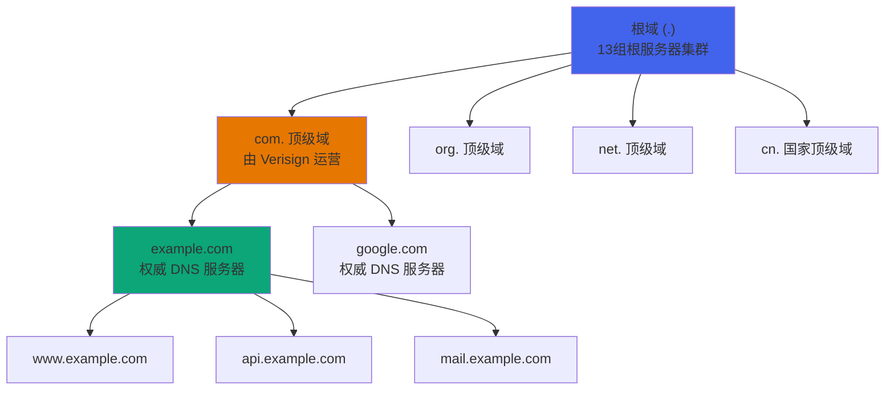
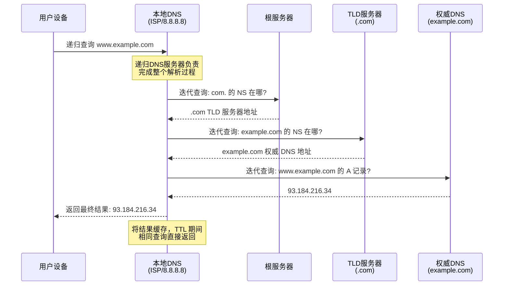
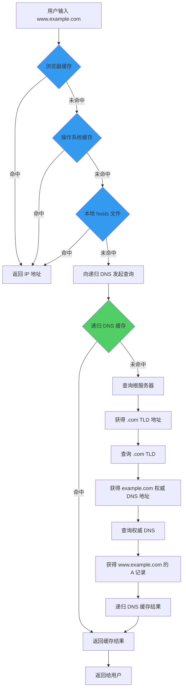
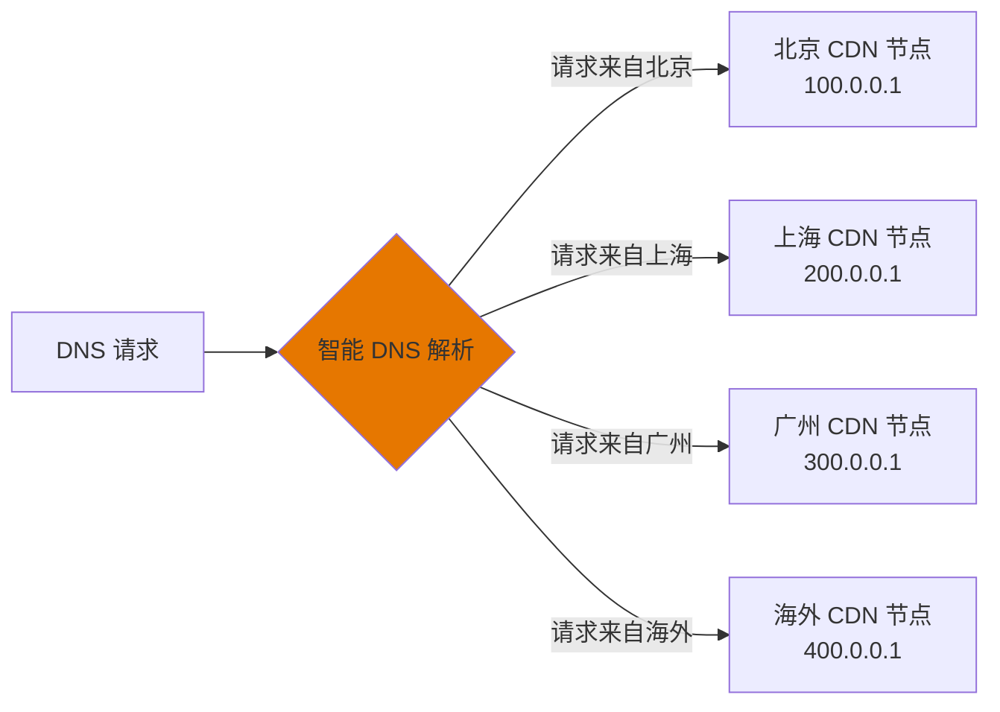
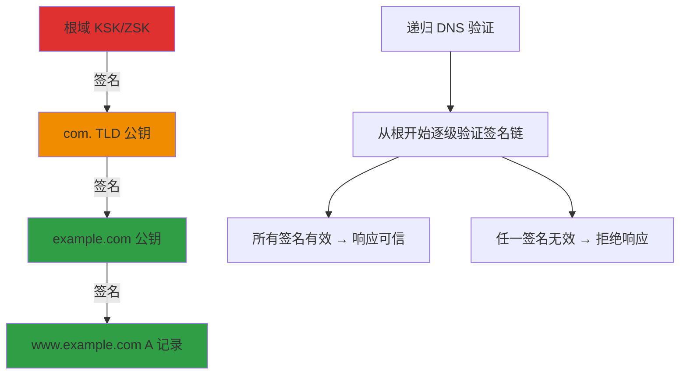
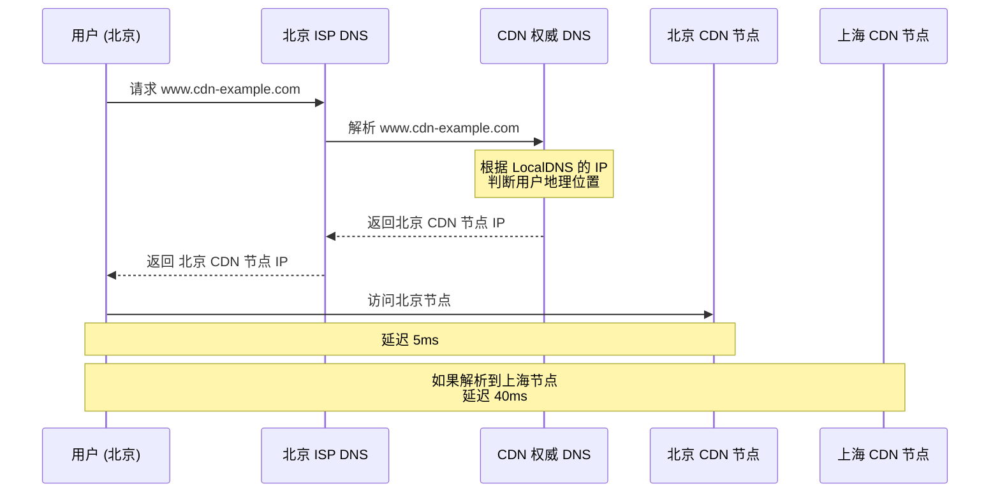
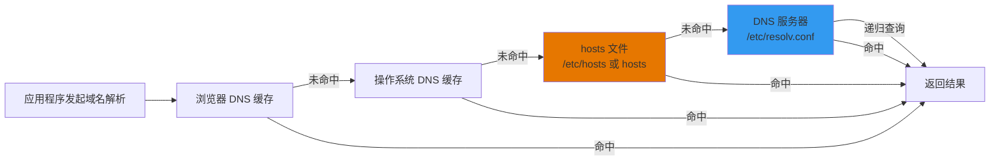

## 引言

DNS（Domain Name System）是互联网的"电话簿"。没有 DNS，我们需要记住 `142.250.80.46` 这样的 IP 地址才能访问 Google，而不是输入 `www.google.com`。DNS 看似简单——将域名翻译为 IP 地址，但其背后的架构、缓存策略和安全机制远比想象中复杂。本文将从工程实践的角度，深入剖析 DNS 解析的全流程。

## DNS 的层次结构

DNS 采用树状的层次化命名结构，从右到左逐级细分：

```
.                    ← 根域 (Root)
com.                 ← 顶级域 (TLD - Top Level Domain)
example.com.         ← 二级域 (Second Level Domain)
www.example.com.     ← 子域 (Subdomain)
api.www.example.com. ← 子域的子域
```



### 域名命名规则

- 总长度不超过 253 个字符
- 每个标签不超过 63 个字符
- 只允许字母、数字和连字符（不能以连字符开头或结尾）
- 不区分大小写（`Example.COM` = `example.com`）

## DNS 记录类型详解

| 记录类型 | 名称 | 作用 | 示例 |
|----------|------|------|------|
| **A** | Address | 域名 → IPv4 地址 | `www.example.com → 93.184.216.34` |
| **AAAA** | AAAA | 域名 → IPv6 地址 | `www.example.com → 2606:2800:220:1:248:1893:25c8:1946` |
| **CNAME** | Canonical Name | 别名 → 规范域名 | `www → example.com` |
| **MX** | Mail Exchange | 邮件服务器 | `example.com → mail.example.com (优先级 10)` |
| **NS** | Name Server | 权威 DNS 服务器 | `example.com → ns1.example.com` |
| **TXT** | Text | 任意文本（常用于 SPF/DKIM 验证） | `"v=spf1 include:_spf.google.com ~all"` |
| **SOA** | Start of Authority | 区域起始授权（包含序列号、刷新间隔等） | `ns1.example.com admin.example.com 2026051601 3600 900 604800 86400` |
| **SRV** | Service | 服务定位（协议+端口+目标） | `_sip._tcp.example.com → 10 60 5060 sip.example.com` |
| **PTR** | Pointer | IP → 域名（反向解析） | `34.216.184.93.in-addr.arpa → www.example.com` |
| **CAA** | Certification Authority Authorization | 限定可为该域名签发证书的 CA | `0 issue "letsencrypt.org"` |

### SOA 记录详解

```
example.com.  IN  SOA  ns1.example.com. admin.example.com. (
    2026051601  ; 序列号（YYYYMMDDNN 格式）
    3600        ; 刷新间隔（秒）- 从 DNS 多久查询一次主 DNS
    900         ; 重试间隔（秒）- 查询失败后多久重试
    604800      ; 过期时间（秒）- 超过此时间视为数据无效
    86400       ; 最小 TTL（秒）
)
```

## DNS 查询的两种方式

### 递归查询 vs 迭代查询

**递归查询**：客户端交给递归 DNS 服务器，由服务器代为完成所有步骤并返回最终结果。

**迭代查询**：递归 DNS 服务器主动向各级域名服务器查询，每次获得"下一步去哪里查"的指引。



### 完整解析流程（以 `www.example.com` 为例）



## DNS 缓存机制

DNS 缓存是提升解析速度的关键，层级如下：

| 缓存层级 | 位置 | TTL 典型值 | 说明 |
|----------|------|-----------|------|
| 浏览器缓存 | 浏览器内存 | 根据响应头 | Chrome 约 60s，Firefox 跟随 DNS TTL |
| 操作系统缓存 | OS DNS Client | 根据 DNS 响应 TTL | Windows DNS Client / macOS mDNSResponder |
| 路由器缓存 | 本地路由器 | 根据 DNS 响应 TTL | 家庭/企业网关缓存 |
| ISP 递归 DNS | ISP 运营商 | 根据 DNS 响应 TTL | 电信/联通/移动的 DNS 服务器 |
| 公共 DNS | Cloudflare/Google/阿里 | 根据 DNS 响应 TTL | 8.8.8.8 / 1.1.1.1 / 223.5.5.5 |

### TTL（Time To Live）

TTL 决定了记录在缓存中存活的时间：

```
DNS Response:
  A Record: 93.184.216.34
  TTL: 300  ← 缓存 5 分钟

5 分钟内：所有查询使用缓存
5 分钟后：需要重新向权威 DNS 查询
```

**TTL 设置的工程考量：**
- **低 TTL（30-300s）**：适合频繁变更的记录，如 CDN 切换、故障转移
- **中 TTL（3600s）**：常规 Web 服务
- **高 TTL（86400s）**：稳定的基础设施记录，如 NS 记录

## DNS 负载均衡

DNS 可以作为最外层的负载均衡器：

### 1. 轮询（Round Robin）

```
example.com → A 10.0.0.1
example.com → A 10.0.0.2
example.com → A 10.0.0.3

查询1 → 10.0.0.1
查询2 → 10.0.0.2
查询3 → 10.0.0.3
查询4 → 10.0.0.1 (循环)
```

### 2. 基于地理位置的 DNS（GSLB - Global Server Load Balancing）



### 3. 加权 DNS

```
web.example.com → A 10.0.0.1 (weight=80)  ← 80% 流量
web.example.com → A 10.0.0.2 (weight=20)  ← 20% 流量
```

## DNS 安全问题

### DNS 劫持

攻击者篡改 DNS 解析结果，将用户引导到恶意网站：

| 劫持方式 | 原理 | 防御 |
|----------|------|------|
| 本地 hosts 篡改 | 修改 /etc/hosts 或 C:\Windows\System32\drivers\etc\hosts | 检查 hosts 文件 |
| 路由器劫持 | 入侵路由器修改 DNS 配置 | 修改路由器默认密码，使用固件更新 |
| ISP 劫持 | 运营商篡改 DNS 响应 | 使用公共 DNS 或 DoH/DoT |
| DNS 缓存投毒 | 向递归 DNS 注入伪造响应 | DNSSEC、使用加密 DNS |

### DNS 缓存投毒（Cache Poisoning）

```
攻击者目标：让递归 DNS 缓存伪造的 A 记录

正常流程：
  递归 DNS → 权威 DNS → 正确 IP

攻击流程：
  1. 用户请求 example.com
  2. 递归 DNS 向权威 DNS 查询
  3. 攻击者在权威 DNS 响应到达之前
     发送大量伪造响应（猜测 Transaction ID）
  4. 如果伪造响应先到达，被递归 DNS 缓存
  5. 后续所有用户都被引导到恶意 IP
```

### DNSSEC（DNS Security Extensions）

DNSSEC 通过数字签名确保 DNS 响应的真实性和完整性：



- **DS 记录**（Delegation Signer）：父域对子域公钥的哈希
- **RRSIG**（Resource Record Signature）：DNS 记录的数字签名
- **DNSKEY**：域名服务器的公钥

### DoH（DNS over HTTPS）与 DoT（DNS over TLS）

| 特性 | 传统 DNS | DoT | DoH |
|------|----------|-----|-----|
| 端口 | UDP 53 | TCP 853 | TCP 443 |
| 加密 | ❌ 明文 | ✅ TLS 加密 | ✅ HTTPS 加密 |
| 防火墙可见性 | 可见并可拦截 | 可见但不可篡改 | 与 HTTPS 流量不可区分 |
| 代表实现 | - | Cloudflare 1.1.1.1 | Firefox/Chrome 内置 |

```
传统 DNS:
  查询: example.com  →  明文传输  →  任何人都能看到

DoH:
  查询: example.com  →  HTTPS POST  →  加密传输
  端点: https://dns.cloudflare.com/dns-query

DoT:
  查询: example.com  →  TLS 连接  →  加密传输
  端口: 853
```

## CDN 与 DNS 的关系

CDN（内容分发网络）深度依赖 DNS 实现就近访问：



CDN 的 DNS 解析流程：
1. 用户请求 `www.cdn-example.com`
2. CDN 权威 DNS 根据 LocalDNS 的源 IP 判断用户大致位置
3. 返回距离用户最近的 CDN 节点 IP
4. 用户直接访问该 CDN 节点

## /etc/hosts 与 DNS 解析优先级

在操作系统层面，域名解析的优先级顺序为：



**Linux/macOS 配置示例：**

```bash
# /etc/hosts - 本地域名映射
127.0.0.1       localhost
192.168.1.100   dev.example.com
::1             localhost

# /etc/resolv.conf - DNS 服务器配置
nameserver 8.8.8.8
nameserver 8.8.4.4
options timeout:2 attempts:3
```

**nsswitch.conf 控制解析顺序：**

```bash
# /etc/nsswitch.conf
hosts:  files dns myhostname
#        ↑     ↑
#        |     └── 使用 DNS 服务器
#        └── 使用 /etc/hosts 文件
```

## 实用 DNS 命令

```bash
# nslookup - 查询 DNS 记录
nslookup www.example.com
nslookup -type=MX example.com
nslookup -type=TXT example.com

# dig - 更详细的查询
dig www.example.com A          # 查询 A 记录
dig www.example.com AAAA       # 查询 AAAA 记录
dig example.com MX             # 查询 MX 记录
dig example.com NS             # 查询 NS 记录
dig example.com SOA            # 查询 SOA 记录
dig example.com ANY            # 查询所有记录
dig +trace example.com         # 跟踪完整解析链路
dig +dnssec example.com        # 验证 DNSSEC

# 查看 DNS 解析时间
dig www.example.com | grep "Query time"
# Query time: 23 msec
```

## 面试 Q&A

**Q1: 递归查询和迭代查询有什么区别？**

A: 递归查询是客户端向 DNS 服务器发出请求后，服务器必须返回最终结果（成功或失败）。迭代查询是 DNS 服务器收到请求后，如果自己没有答案，会返回"你应该去问谁"的指引，由请求方继续查询。用户设备到递归 DNS 服务器之间使用递归查询，递归 DNS 服务器到各级域名服务器之间使用迭代查询。

**Q2: DNS 缓存投毒的原理是什么？如何防御？**

A: 攻击者在递归 DNS 服务器向权威 DNS 查询时，抢先发送伪造的 DNS 响应。如果伪造响应的 Transaction ID 和源端口匹配，递归 DNS 会将其当作合法响应缓存。防御方式包括：(1) DNSSEC 数字签名验证；(2) 随机化 Transaction ID 和源端口（Kaminsky 攻击促使的改进）；(3) 使用 DoH/DoT 加密 DNS 查询。

**Q3: CNAME 记录和 A 记录有什么区别？使用 CNAME 有什么注意事项？**

A: A 记录直接将域名映射到 IP 地址，CNAME 记录将域名映射到另一个域名（别名）。注意事项：(1) CNAME 记录不能与其他记录共存于同一域名（RFC 规定）；(2) CNAME 会增加一次额外的 DNS 查询；(3) 根域名（apex，如 example.com）不建议使用 CNAME，会影响 MX 等其他记录；(4) CDN 场景中常用 CNAME 将业务域名指向 CDN 提供的域名。

**Q4: 为什么 CDN 要通过 DNS 来实现就近访问？**

A: DNS 是用户访问网站的第一步，CDN 通过在权威 DNS 层做智能解析，可以根据 Local DNS 的 IP 地址判断用户的地理位置，返回最近的 CDN 节点 IP。这种方式对客户端完全透明，无需客户端做任何配置。配合低 TTL（通常 60-300s），CDN 可以快速将用户调度到不同节点，实现负载均衡和故障转移。

**Q5: DNSSEC 能防止所有的 DNS 安全问题吗？**

A: 不能。DNSSEC 只能保证 DNS 响应的**真实性**（来自权威 DNS）和**完整性**（未被篡改），但：(1) 不保证**机密性**——DNS 查询内容仍然是明文（需要 DoH/DoT）；(2) 不防御 DDoS 攻击；(3) 部署复杂，密钥管理成本高；(4) 存在 NSEC 记录可能泄露域名列表的问题（NSEC3 有所改善）。DNSSEC 是纵深防御的一层，需要配合其他安全机制。

**Q6: 一个域名解析很慢，如何排查？**

A: 排查步骤：(1) 使用 `dig +trace domain.com` 查看完整解析链路，确定在哪一步慢；(2) 检查 Local DNS 响应时间 `dig domain.com | grep "Query time"`；(3) 检查 TTL 设置是否合理；(4) 检查权威 DNS 服务器的响应速度和可用性；(5) 检查是否存在 DNSSEC 验证超时；(6) 如果是 CDN 场景，检查 GSLB 调度是否合理。常见原因包括：Local DNS 性能差、权威 DNS 响应慢、DNSSEC 验证延迟、网络路由问题。
