## 一致性：分布式系统的核心挑战

> "In theory, there is no difference between theory and practice. In practice, there is." —— Yogi Berra

分布式系统中，数据分散在多个节点上，网络可能延迟或分区，节点可能故障。如何在这些不确定性下保证数据的**一致性**，是分布式系统最根本的挑战。

---

## 一、CAP 定理

### 1.1 定义

CAP 定理（Brewer's Theorem）指出，分布式系统最多只能同时满足以下三个属性中的**两个**：

| 属性 | 含义 |
|------|------|
| **C（Consistency）** | 线性一致性：所有节点在同一时刻看到相同的数据 |
| **A（Availability）** | 可用性：每个请求都能在合理时间内收到非错误响应 |
| **P（Partition Tolerance）** | 分区容错：网络分区时系统仍能继续运行 |

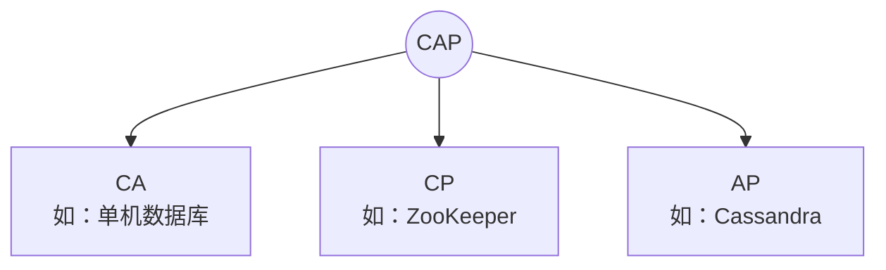

### 1.2 为什么只能三选二？

网络分区是分布式系统的**客观现实**，不是可选项。因此实际选择是：

- **CP**：分区时牺牲可用性，保证一致性
- **AP**：分区时牺牲一致性，保证可用性

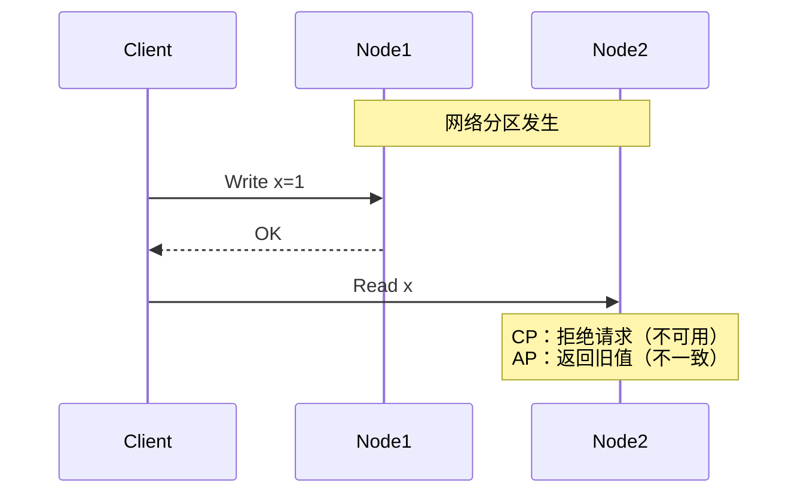

### 1.3 CAP 的常见误解

| 误解 | 事实 |
|------|------|
| 必须在 C 和 A 之间做全局选择 | 只在**分区发生时**才需要选择 |
| 放弃 A 意味着完全不可用 | 可以只牺牲**部分请求**的可用性 |
| CAP 是非此即彼的 | C 和 A 是**连续谱**，不是二元选择 |
| CP 系统不需要考虑可用性 | 工程中需要尽量减少不可用的时间 |

### 1.4 CAP 的数学基础

CAP 定理的形式化证明基于异步网络模型。在异步网络中：

- 无法区分节点故障和网络分区（FLP 不可能定理）
- 如果保证一致性，分区时部分节点无法确认数据是否最新，只能拒绝请求
- 如果保证可用性，分区时节点可能返回过期数据

---

## 二、BASE 理论

BASE 是对 CAP 中 AP 方向的工程实践总结：

| 概念 | 全称 | 含义 |
|------|------|------|
| **BA** | Basically Available | 基本可用：允许响应时间增加或功能降级 |
| **S** | Soft State | 软状态：允许中间状态存在 |
| **E** | Eventual Consistency | 最终一致性：保证最终数据一致，但不保证实时 |

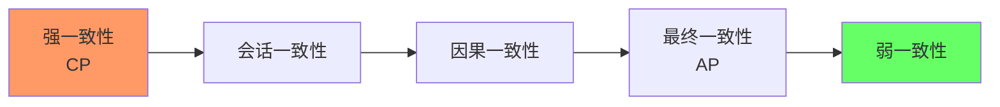

---

## 三、一致性模型详解

### 3.1 一致性模型谱系

| 一致性模型 | 保证 | 典型系统 |
|-----------|------|---------|
| **线性一致性** | 全序，实时约束 | etcd, ZooKeeper |
| **顺序一致性** | 全序，无实时约束 | RAM 云存储 |
| **因果一致性** | 因果关系有序 | Cassandra, Riak |
| **会话一致性** | 单客户端有序 | DynamoDB |
| **最终一致性** | 最终收敛 | DNS, S3 |

### 3.2 线性一致性（Linearizability）

线性一致性是最强的一致性模型：**所有操作看起来像是在某个时间点原子地发生**。

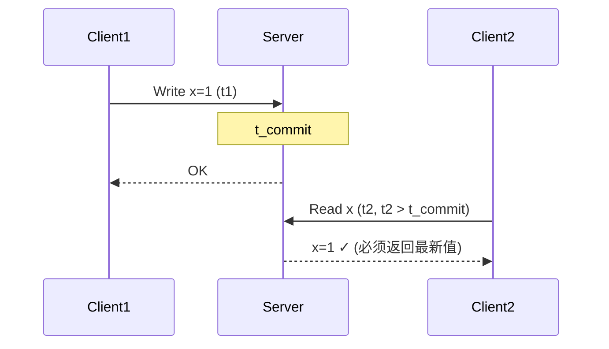

线性一致性的代价：

- 每次读操作都需要与多数节点通信
- 网络分区时必须牺牲可用性
- 性能开销大（跨节点同步）

### 3.3 因果一致性（Causal Consistency）

因果一致性保证**有因果关系的操作**按因果顺序被所有节点看到，但无因果关系的操作可以乱序。

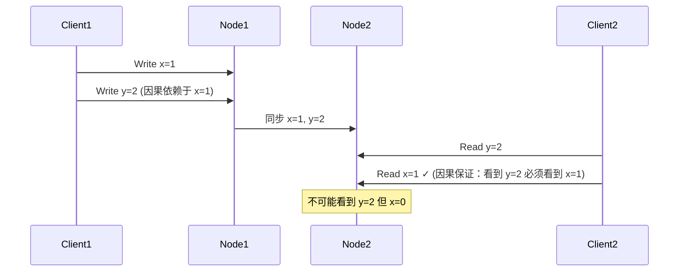

实现因果一致性的关键技术：**向量时钟（Vector Clock）**。

```python
# 向量时钟实现
class VectorClock:
    def __init__(self, node_id):
        self.clock = {}  # {node_id: counter}
        self.node_id = node_id

    def increment(self):
        self.clock[self.node_id] = self.clock.get(self.node_id, 0) + 1

    def merge(self, other):
        """合并两个向量时钟，取每个节点的最大值"""
        for node, counter in other.clock.items():
            self.clock[node] = max(self.clock.get(node, 0), counter)

    def happens_before(self, other):
        """判断 self 是否在 other 之前发生"""
        at_least_one_less = False
        for node in set(self.clock) | set(other.clock):
            if self.clock.get(node, 0) > other.clock.get(node, 0):
                return False
            if self.clock.get(node, 0) < other.clock.get(node, 0):
                at_least_one_less = True
        return at_least_one_less
```

### 3.4 最终一致性（Eventual Consistency）

最终一致性是最弱的有意义一致性保证：**如果没有新的更新，最终所有节点会看到相同的值**。

"最终"是多久？没有保证。可能是毫秒，也可能是小时。

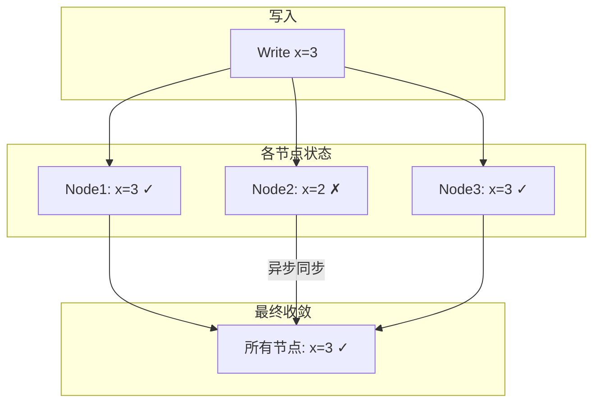

---

## 四、共识算法

### 4.1 为什么需要共识？

分布式系统中的许多问题本质上都是共识问题：

- **选主**：哪个节点是 Leader？
- **原子提交**：事务是否提交？
- **原子广播**：消息的顺序是什么？

FLP 不可能定理告诉我们：**在异步系统中，不存在确定性共识算法能同时保证安全性和活性**。但工程中可以通过超时、随机化等手段绕过。

### 4.2 Paxos 算法

Paxos 是 Leslie Lamport 于 1990 年提出的共识算法，是分布式共识的理论基础。

**Basic Paxos** 的角色：

| 角色 | 职责 |
|------|------|
| Proposer | 提出提案 |
| Acceptor | 对提案投票 |
| Learner | 学习被选中的值 |

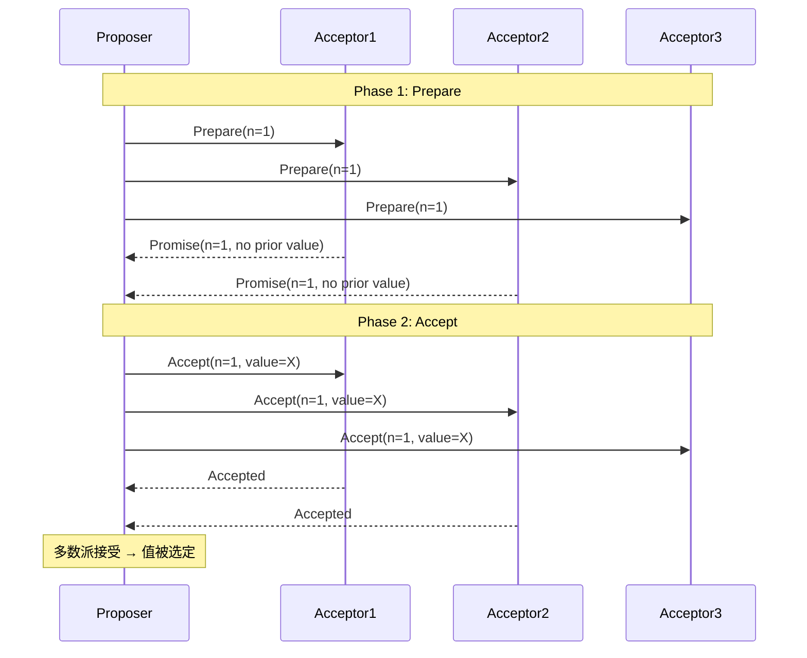

Paxos 的核心约束：
1. Acceptor 只接受编号更大的 Prepare 请求
2. Proposer 在 Accept 阶段必须使用已承诺的最大编号对应的值
3. 值被多数派接受后即被选定

**Multi-Paxos**：通过选出一个 Leader，省略 Prepare 阶段，提高效率。

### 4.3 Raft 算法

Raft 是 Diego Ongaro 于 2014 年提出的共识算法，目标是**易于理解**。

Raft 将共识问题分解为三个子问题：

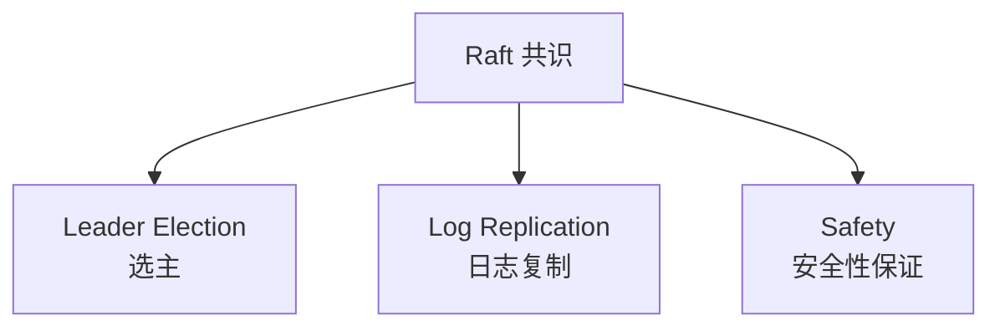

#### Leader 选举

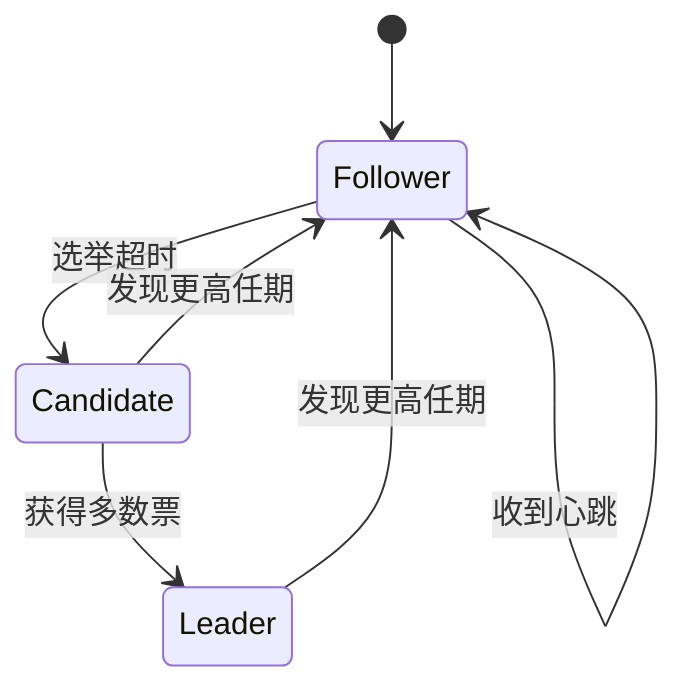

```go
// Raft 选举的简化逻辑
type Node struct {
    currentTerm int
    votedFor    int
    state       State // Follower, Candidate, Leader
    log         []LogEntry
}

func (n *Node) startElection() {
    n.currentTerm++
    n.state = Candidate
    n.votedFor = n.id
    votesReceived := 1

    // 向所有节点请求投票
    for _, peer := range n.peers {
        go func(peer Node) {
            reply := peer.RequestVote(RequestVoteArgs{
                Term:        n.currentTerm,
                CandidateId: n.id,
                LastLogIndex: len(n.log) - 1,
                LastLogTerm:  n.log[len(n.log)-1].Term,
            })
            if reply.VoteGranted {
                votesReceived++
                if votesReceived > len(n.peers)/2 {
                    n.state = Leader
                }
            }
        }(peer)
    }
}
```

#### 日志复制

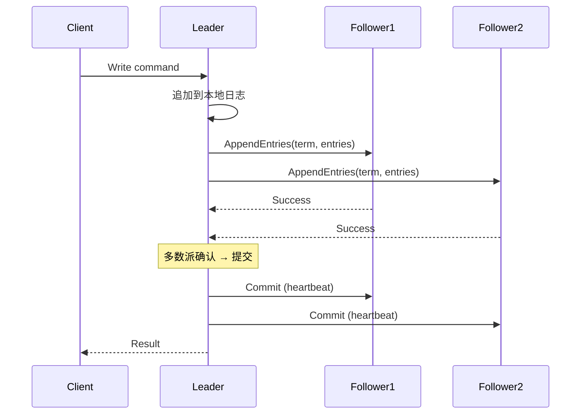

#### 安全性保证

Raft 的安全性由以下规则保证：

1. **选举安全**：每个任期最多一个 Leader
2. **Leader 只追加**：Leader 不覆盖或删除日志
3. **日志匹配**：如果两条日志的索引和任期相同，则之前的日志也相同
4. **Leader 完备性**：已提交的日志条目在后续所有 Leader 的日志中都存在
5. **状态机安全**：如果节点在某个索引应用了某条日志，其他节点不会在同一索引应用不同的日志

### 4.4 Paxos vs Raft 对比

| 维度 | Paxos | Raft |
|------|-------|------|
| 可理解性 | 极难 | 较易 |
| Leader | Multi-Paxos 有 Leader | 始终有 Leader |
| 日志 | 可能出现空洞 | 保证连续 |
| 变更 | 增量变更复杂 | 成员变更简单 |
| 工程实现 | 困难（如 Chubby 实现花数年） | 相对容易 |
| 理论完备性 | 更完备 | 足够完备 |
| 代表系统 | Google Chubby | etcd, Consul, TiKV |

---

## 五、ZooKeeper 与 Etcd

### 5.1 ZooKeeper

ZooKeeper 使用 ZAB（ZooKeeper Atomic Broadcast）协议，类似 Multi-Paxos。

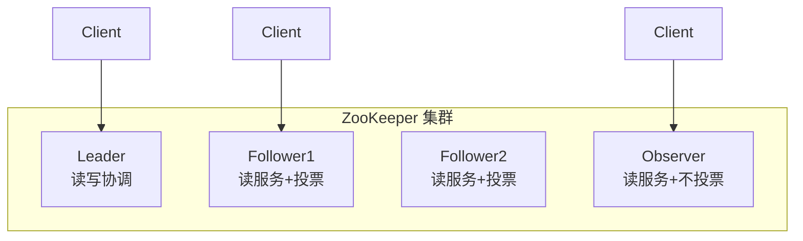

ZooKeeper 的数据模型：**层级命名空间**，类似文件系统。

```
/
├── services
│   ├── service-a
│   │   ├── instance-1  (ephemeral)
│   │   └── instance-2  (ephemeral)
│   └── service-b
│       └── instance-1  (ephemeral)
├── config
│   ├── db-url  (persistent)
│   └── timeout (persistent)
└── leaders
    └── election  (ephemeral)
```

节点类型：
- **持久节点（Persistent）**：创建后一直存在，直到被删除
- **临时节点（Ephemeral）**：客户端会话结束自动删除，用于服务发现
- **顺序节点（Sequential）**：节点名自动追加递增序号，用于分布式锁

### 5.2 Etcd

Etcd 使用 Raft 协议，数据模型是**扁平的键值存储**。

```go
// etcd v3 API 示例
import "go.etcd.io/etcd/client/v3"

// 写入
cli.Put(ctx, "/config/db-url", "mysql://localhost:3306")

// 读取
resp, _ := cli.Get(ctx, "/config/db-url", clientv3.WithPrefix())

// 监听变更（Watch）
watchCh := cli.Watch(ctx, "/config/", clientv3.WithPrefix())
for event := range watchCh {
    fmt.Printf("变更: %s = %s\n", event.Kv.Key, event.Kv.Value)
}

// 租约（Lease）—— 类似临时节点
lease, _ := cli.Grant(ctx, 60) // 60秒 TTL
cli.Put(ctx, "/services/api-1", "10.0.0.1:8080", clientv3.WithLease(lease.ID))
// 保持心跳
cli.KeepAlive(ctx, lease.ID)
```

### 5.3 ZooKeeper vs Etcd 对比

| 维度 | ZooKeeper | Etcd |
|------|-----------|------|
| 共识算法 | ZAB | Raft |
| 数据模型 | 层级命名空间 | 扁平 KV + 前缀 |
| API 风格 | 树操作 | KV + Watch + Lease |
| Watch 机制 | 一次性触发 | 持续监听（v3） |
| 语言 | Java | Go |
| HTTP API | 有（较重） | 原生 gRPC |
| 适用场景 | Hadoop 生态 | Kubernetes 生态 |
| 运维复杂度 | 较高 | 较低 |

---

## 六、工程实践：如何选择一致性级别

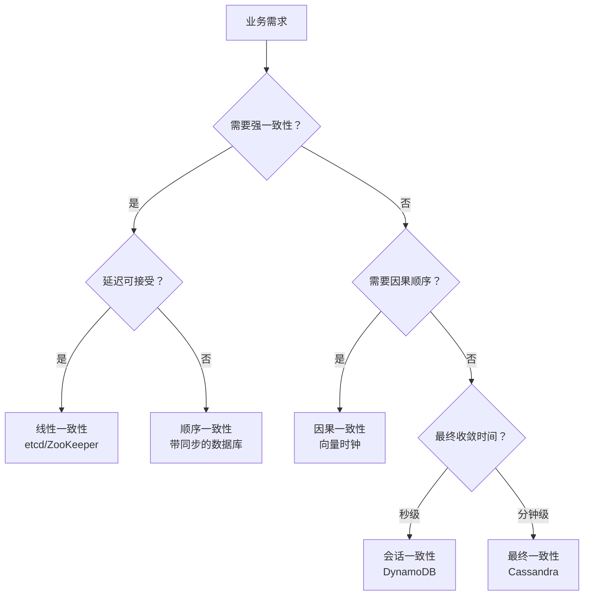

| 场景 | 推荐一致性 | 理由 |
|------|-----------|------|
| 金融交易 | 线性一致性 | 资金安全优先 |
| 库存扣减 | 线性一致性 | 超卖不可接受 |
| 配置中心 | 线性一致性 | 配置不一致导致故障 |
| 购物车 | 会话一致性 | 用户只关心自己的视图 |
| 社交 Feed | 因果一致性 | 评论必须出现在帖子之后 |
| DNS | 最终一致性 | 可容忍短暂不一致 |
| 日志收集 | 最终一致性 | 延迟可接受 |

---

## 七、面试 Q&A

**Q1：CAP 定理中，为什么说 P 是必选的？**

网络分区不是可选的，而是分布式系统的客观现实。网络交换机故障、光纤被挖断、GC 停顿等都可能导致分区。因此 CAP 的实际选择只有 CP 和 AP。

**Q2：线性一致性和顺序一致性的区别是什么？**

顺序一致性保证所有节点看到相同的操作顺序，但不要求这个顺序与实际时间一致。线性一致性在顺序一致性的基础上，额外要求操作顺序与实际时间一致——如果一个操作在另一个操作完成后开始，那么在全局顺序中它必须出现在后面。

**Q3：Raft 如何保证 Leader 完备性？**

Raft 通过选举限制保证：Candidate 请求投票时，必须携带自己日志中最后一条的任期号和索引。投票者只会把票投给日志至少和自己一样新的 Candidate。这保证了新 Leader 一定包含所有已提交的日志。

**Q4：向量时钟如何解决冲突？**

向量时钟本身不解决冲突，它只检测并发。当两个操作的向量时钟不可比较（并发）时，说明存在冲突，需要应用层解决。常见策略：最后写入胜出（LWW）、应用层合并、人工解决。

**Q5：为什么 Kubernetes 选择 etcd 而不是 ZooKeeper？**

1. etcd 使用 Go 编写，与 K8s 生态一致
2. etcd 的 Watch 机制更高效（持续监听 vs 一次性触发）
3. etcd 提供 gRPC API，性能更好
4. etcd 运维更简单
5. etcd 的 MVCC 支持历史查询

**Q6：在什么场景下应该牺牲一致性选择可用性？**

当业务可以容忍短暂不一致，但无法容忍服务不可用时。例如：电商商品详情页的浏览量、社交平台的点赞数——短暂不一致不影响核心业务，但页面打不开会严重影响用户体验。

---

## 总结

CAP 定理不是教条，而是思考框架。在工程实践中，一致性不是二元选择，而是连续谱。理解不同一致性模型的语义和代价，根据业务需求选择合适的一致性级别，才是分布式系统设计的核心能力。共识算法（Paxos/Raft）为需要强一致性的场景提供了可靠的基础，但它们也有性能代价——需要在一致性与可用性之间找到平衡点。

<div class='context-nav'>
<a class='context-link prev' href='/software-fundamentals/posts/分布式-分布式面试题/'><span class='context-label'>上一篇</span><span class='context-title'>分布式面试题</span></a>
<a class='context-link next' href='/software-fundamentals/posts/分布式系统-分布式事务/'><span class='context-label'>下一篇</span><span class='context-title'>分布式系统：分布式事务——从 2PC 到 Saga 的演进</span></a>
</div>
