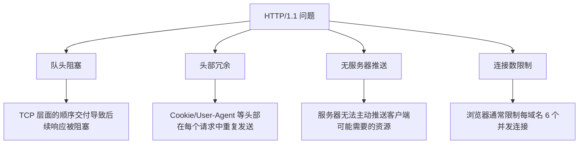
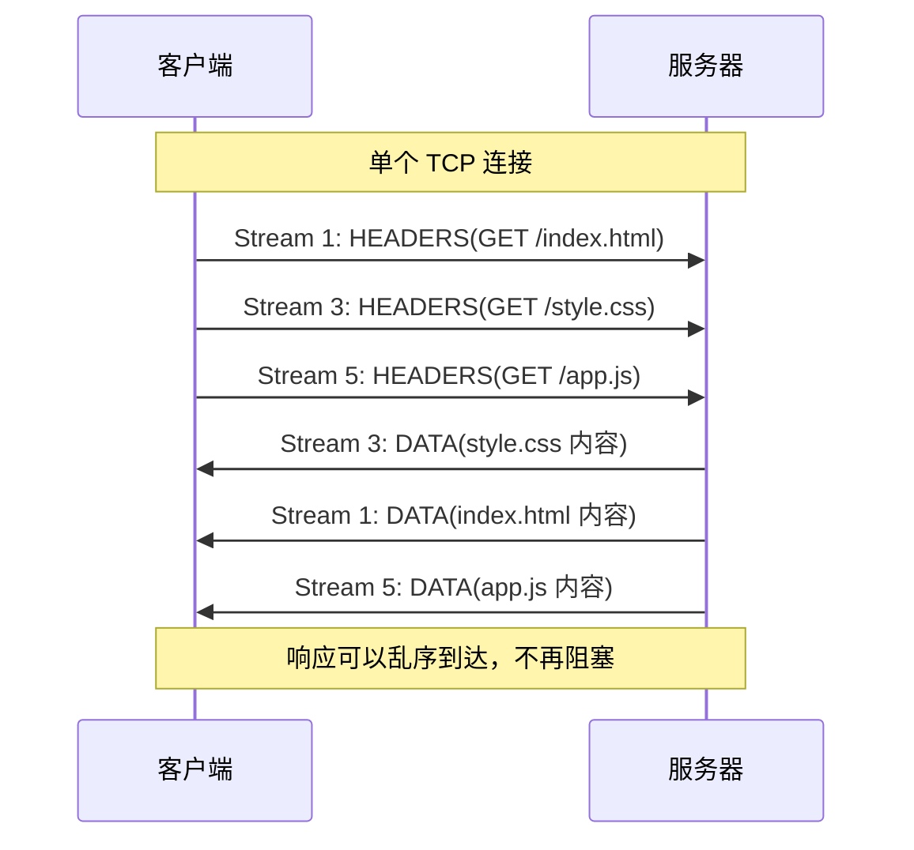
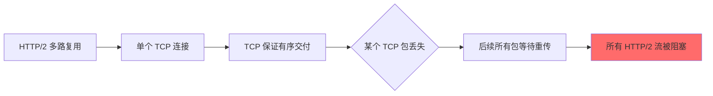

## 引言

HTTP（HyperText Transfer Protocol）是互联网的基石。从 1991 年 Tim Berners-Lee 提出最初的 HTTP/0.9 到如今广泛部署的 HTTP/3，HTTP 协议经历了三十余年的演进。每一次版本升级都试图解决前一代的痛点，同时也带来了新的复杂性。本文将从工程实践的角度，系统梳理 HTTP 协议的演进历程。

## HTTP/0.9 —— 极简的开端

HTTP/0.9 是 HTTP 协议的最初版本，于 1991 年提出。它极其简单：

- **只有一种请求方法**：`GET`
- **只有一种响应格式**：HTML 纯文本
- **没有状态码、没有头部、没有 Content-Type**

```
GET /index.html
```

服务器响应：

```html
<html>
  <body>Hello World</body>
</html>
```

请求完成后连接立即关闭。这个版本的 HTTP 只能传输 HTML，无法传输图片、CSS、JavaScript 等资源。

## HTTP/1.0 —— 协议的正式确立

1996 年发布的 HTTP/1.0（RFC 1945）引入了现代 HTTP 的核心概念：

### 新增功能

| 特性 | 说明 |
|------|------|
| 状态码 | 1xx/2xx/3xx/4xx/5xx 分类 |
| 请求头/响应头 | 支持元数据传递 |
| Content-Type | 支持多媒体类型（图片、视频等） |
| 请求方法 | GET、POST、HEAD |
| 版本标识 | 请求行包含 `HTTP/1.0` |

示例请求：

```http
GET /index.html HTTP/1.0
Host: www.example.com
User-Agent: Mozilla/5.0
Accept: text/html

```

示例响应：

```http
HTTP/1.0 200 OK
Content-Type: text/html
Content-Length: 1234

<html>...</html>
```

### HTTP/1.0 的问题

每次请求都需要建立新的 TCP 连接，TCP 三次握手 + 慢启动带来的开销在加载包含多个资源的页面时尤为明显。

## HTTP/1.1 —— 持久化的里程碑

1997 年发布的 HTTP/1.1（RFC 2068，后由 RFC 2616 和 RFC 723x 系列更新）是互联网使用最广泛的 HTTP 版本。

### 核心特性

**1. 持久连接（Keep-Alive）**

默认保持 TCP 连接打开，多个请求复用同一连接：

```http
GET /index.html HTTP/1.1
Host: www.example.com
Connection: keep-alive
```

**2. 管道化（Pipelining）**

客户端可以在不等待前一个响应的情况下发送多个请求：

```
请求1: GET /a.html
请求2: GET /b.css
请求3: GET /c.js
```

但管道化存在**队头阻塞（Head-of-Line Blocking）**问题：如果第一个请求响应慢，后续请求的响应都会被阻塞。

**3. Host 头**

支持虚拟主机，一台服务器可托管多个域名：

```http
GET /index.html HTTP/1.1
Host: www.example.com
```

**4. 分块传输编码（Chunked Transfer Encoding）**

```http
HTTP/1.1 200 OK
Transfer-Encoding: chunked

7\r\n
Hello, \r\n
6\r\n
World!\r\n
0\r\n
\r\n
```

**5. 范围请求（Range Request）**

支持断点续传和视频seek：

```http
GET /video.mp4 HTTP/1.1
Range: bytes=0-1023
```

### HTTP/1.1 的架构问题



## SPDY —— Google 的尝试

2009 年 Google 提出了 SPDY 协议，作为 HTTP/2 的前身和实验场：

| 特性 | 说明 |
|------|------|
| 多路复用 | 多个请求共享一个 TCP 连接 |
| 头部压缩 | 使用类似 GZIP 的压缩算法 |
| 服务器推送 | 服务器可主动推送资源 |
| 请求优先级 | 客户端可指定资源优先级 |

SPDY 证明了多路复用和头部压缩的可行性，为 HTTP/2 的标准化奠定了基础。2016 年后 SPDY 被废弃。

## HTTP/2 —— 二进制的革命

2015 年发布的 HTTP/2（RFC 7540）是 HTTP 协议最大的升级之一。

### 二进制帧层

HTTP/2 将消息分解为帧（Frame），帧是通信的最小单位：

```
┌─────────────────────────────────────────┐
│                 Frame                    │
├─────────────┬───────────┬───────────────┤
│   Length    │   Type    │    Flags      │
│  (3 bytes)  │  (1 byte) │  (1 byte)     │
├─────────────┴───────────┴───────────────┤
│           Stream Identifier             │
│              (4 bytes)                  │
├─────────────────────────────────────────┤
│              Frame Payload              │
│           (variable length)             │
└─────────────────────────────────────────┘
```

HTTP/2 定义了多种帧类型：

| 帧类型 | 用途 |
|--------|------|
| DATA | 传输请求/响应体 |
| HEADERS | 传输头部信息 |
| SETTINGS | 传输配置参数 |
| WINDOW_UPDATE | 流量控制 |
| PING | 连接保活 |
| RST_STREAM | 重置流 |
| GOAWAY | 优雅关闭连接 |

### 多路复用



### HPACK 头部压缩

HPACK 使用静态表和动态表进行头部压缩：

```
静态表预定义常用头部：
索引 1  → :authority
索引 2  → :method: GET
索引 3  → :method: POST
索引 4  → :path: /
索引 5  → :path: /index.html
索引 18 → accept: text/html
索引 31 → user-agent

动态表示例（运行时建立）：
自定义: cookie=session_id=abc123
```

通过霍夫曼编码和表引用，HTTP/2 可将头部大小减少 50%-90%。

### 服务器推送

```http
PUSH_PROMISE
  :method: GET
  :path: /style.css
  :scheme: https
  :authority: www.example.com
```

服务器在响应 HTML 时，可以主动推送 CSS/JS 等资源，减少客户端发起额外请求的延迟。

### 流优先级

每个流可以设置依赖关系和权重：

```
Stream 1 (HTML, weight=200)
  ├── Stream 3 (CSS, weight=100) ── 依赖 Stream 1
  ├── Stream 5 (JS, weight=100)  ── 依赖 Stream 1
  └── Stream 7 (图片, weight=50)  ── 依赖 Stream 1
```

### HTTP/2 队头阻塞问题

HTTP/2 解决了**应用层**的队头阻塞，但 **TCP 层面的队头阻塞依然存在**：



当网络丢包率超过 1% 时，HTTP/2 的性能可能不如 HTTP/1.1。

## HTTP/3 与 QUIC —— 基于 UDP 的新一代协议

2022 年正式发布的 HTTP/3（RFC 9114）基于 Google 开发的 QUIC 协议，从根本上解决了 TCP 队头阻塞问题。

### QUIC 的核心设计

**1. 基于 UDP**

QUIC 运行在 UDP 之上，自己实现了可靠传输、拥塞控制和加密：

```
┌─────────────────────────┐
│        HTTP/3           │
├─────────────────────────┤
│         QPACK           │
├─────────────────────────┤
│          QUIC           │
├─────────────────────────┤
│          UDP            │
├─────────────────────────┤
│          IP             │
└─────────────────────────┘
```

**2. 消除队头阻塞**

QUIC 为每个流提供独立的可靠传输，一个流的丢包不影响其他流：

```mermaid
sequenceDiagram
    participant C as 客户端
    participant S as 服务器
    
    Note over C,S: QUIC 连接 - 基于 UDP
    
    C->>S: Stream 1: GET /index.html
    C->>S: Stream 2: GET /style.css
    C->>S: Stream 3: GET /app.js
    
    Note over C,S: Stream 2 的包丢失
    
    S->>C: Stream 1: 数据 (正常交付)
    S--xC: Stream 2: 数据 (包丢失)
    S->>C: Stream 3: 数据 (正常交付)
    
    Note over C,S: Stream 1 和 3 不受影响
    
    S->>C: Stream 2: 重传数据
    
    style C fill:#51cf66
    style S fill:#51cf66
```

**3. 0-RTT 快速握手**

| 协议 | 首次连接 | 恢复连接 |
|------|----------|----------|
| HTTP/1.1 + TLS 1.2 | 2-RTT | 1-RTT |
| HTTP/2 + TLS 1.2 | 2-RTT | 1-RTT |
| HTTP/2 + TLS 1.3 | 1-RTT | 0-RTT |
| **HTTP/3 + QUIC** | **1-RTT** | **0-RTT** |

**4. 连接迁移**

QUIC 使用 Connection ID 而非五元组标识连接，网络切换（WiFi→4G）时连接不中断：

```
客户端 IP: 192.168.1.100 → 10.0.0.50
Connection ID: 0x1a2b3c4d (保持不变)
连接继续，无需重新握手
```

### TLS 1.3 在 HTTP/3 中的作用

QUIC 将 TLS 1.3 内置到传输层，而非像传统方式那样在传输层之上叠加：

- 所有 QUIC 连接**强制加密**，不存在明文模式
- 握手过程同时完成传输层协商和密钥交换
- 利用 TLS 1.3 的 PSK（Pre-Shared Key）实现 0-RTT

## 各版本性能对比

| 特性 | HTTP/1.1 | HTTP/2 | HTTP/3 |
|------|----------|--------|--------|
| 传输层 | TCP | TCP | UDP (QUIC) |
| 多路复用 | ❌ | ✅ | ✅ |
| 队头阻塞 | 应用层+TCP | TCP 层 | 无 |
| 头部压缩 | ❌ | HPACK | QPACK |
| 服务器推送 | ❌ | ✅ | ❌ (已废弃) |
| 连接建立 | 1-2 RTT | 1-2 RTT | 0-1 RTT |
| 连接迁移 | ❌ | ❌ | ✅ |
| 加密 | 可选 | 可选 (实践中强制) | 强制 |

## Nginx 配置实战

### 启用 HTTP/2

```nginx
server {
    listen 443 ssl http2;
    server_name www.example.com;

    ssl_certificate     /etc/ssl/certs/example.com.crt;
    ssl_certificate_key /etc/ssl/private/example.com.key;
    ssl_protocols       TLSv1.2 TLSv1.3;
    ssl_ciphers         HIGH:!aNULL:!MD5;

    location / {
        root /usr/share/nginx/html;
        index index.html;
    }
}
```

### 启用 HTTP/3 (Nginx 1.25+)

```nginx
server {
    listen 443 ssl http2;
    listen 443 quic reuseport;
    server_name www.example.com;

    ssl_certificate     /etc/ssl/certs/example.com.crt;
    ssl_certificate_key /etc/ssl/private/example.com.key;
    ssl_protocols       TLSv1.2 TLSv1.3;

    # HTTP/3 需要在响应头中宣告
    add_header Alt-Svc 'h3=":443"; ma=86400';

    location / {
        root /usr/share/nginx/html;
        index index.html;
    }
}
```

`Alt-Svc` 头部告知客户端服务器支持 HTTP/3，客户端下次连接时将使用 QUIC 协议。

## 面试 Q&A

**Q1: HTTP/2 解决了队头阻塞吗？**

A: 解决了**应用层**的队头阻塞（多个请求可以并行发送，响应乱序到达），但**TCP 层面**的队头阻塞依然存在。因为 TCP 保证字节流有序交付，单个 TCP 包丢失会导致后续所有包等待重传，从而影响该连接上的所有 HTTP/2 流。HTTP/3 通过基于 UDP + QUIC 的独立流传输彻底解决了这个问题。

**Q2: HTTP/2 的 HPACK 是如何工作的？**

A: HPACK 使用两种机制：(1) 静态表和动态表，将常见头部映射为索引值；(2) 霍夫曼编码，对头部值进行无损压缩。客户端和服务器维护相同的动态表，后续请求可以用索引引用之前发送过的头部，避免重复传输。

**Q3: 为什么 HTTP/3 要基于 UDP 而不是 TCP？**

A: TCP 的队头阻塞问题是 HTTP/2 无法彻底解决的。TCP 的设计保证了字节流的有序交付，这在内核层面实现，难以修改。UDP 不提供可靠传输，QUIC 在用户态自己实现了可靠传输、拥塞控制和加密，可以为每个流提供独立的可靠性保证，从而消除队头阻塞。

**Q4: HTTP/2 的服务器推送为什么在 HTTP/3 中被废弃？**

A: 实践中服务器推送存在以下问题：(1) 推送了客户端已经缓存的资源，浪费带宽；(2) 服务器无法精确知道客户端需要什么；(3) 推送的资源可能与客户端并发请求冲突。更好的方案是使用 `Link: </style.css>; rel=preload` 头部让客户端自行决定预加载。

**Q5: QUIC 的 0-RTT 是如何实现的？有什么安全风险？**

A: 0-RTT 利用之前连接时协商的 PSK（Pre-Shared Key）。客户端在第一次握手时就直接发送加密的 0-RTT 数据，服务器用 PSK 解密。安全风险在于**重放攻击**：攻击者可以截获 0-RTT 数据并重放。因此 0-RTT 数据只能用于安全操作（如 GET 请求），不能用于改变服务器状态的操作（如 POST）。

**Q6: 什么情况下应该优先使用 HTTP/3？**

A: 以下场景 HTTP/3 优势明显：(1) 高丢包率的移动网络；(2) 需要快速连接建立的场景（如 IoT 设备）；(3) 网络频繁切换的场景（如移动设备 WiFi/蜂窝切换）；(4) 高并发流传输（如视频直播）。在稳定的有线网络中，HTTP/2 和 HTTP/3 的性能差异较小。
