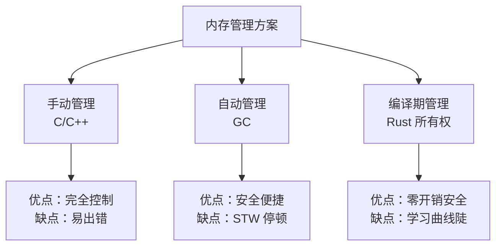
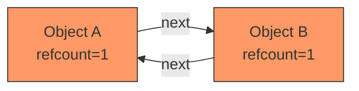
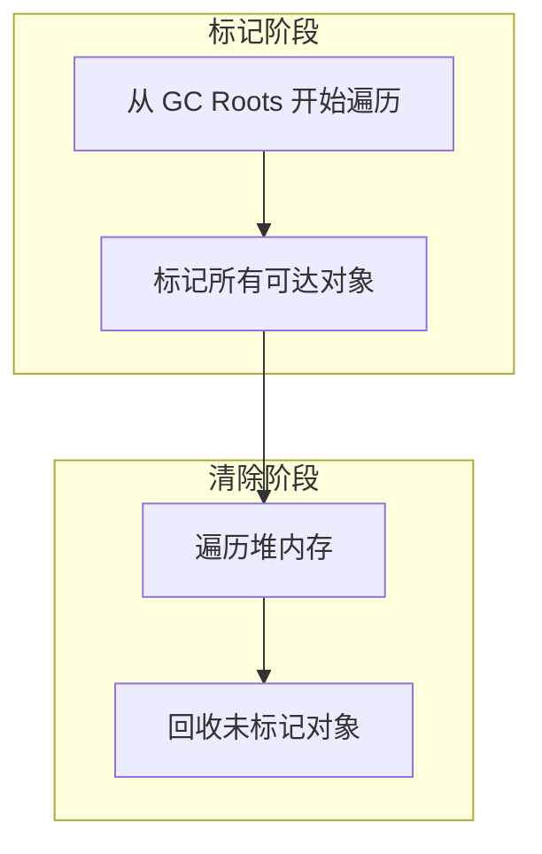
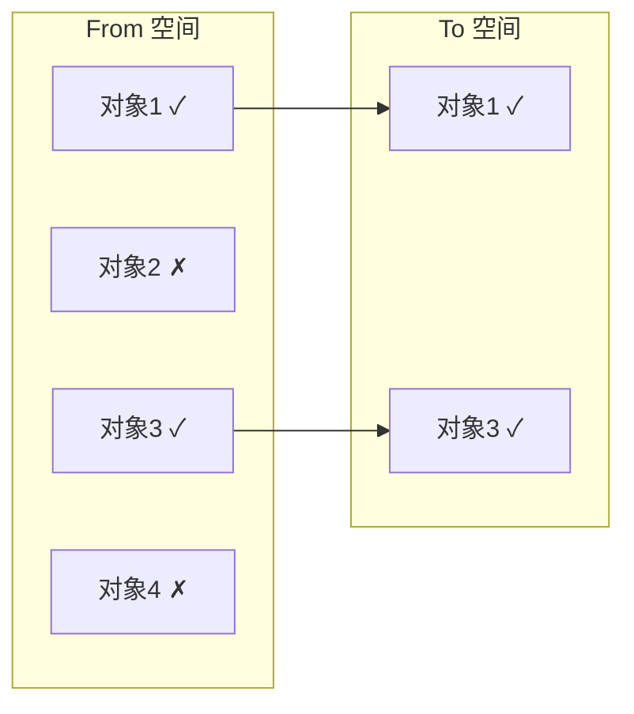
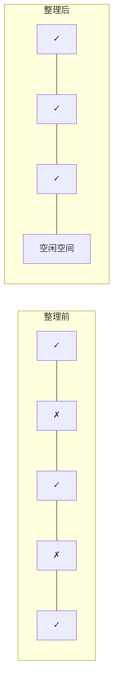
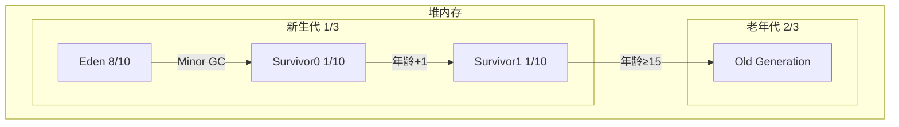
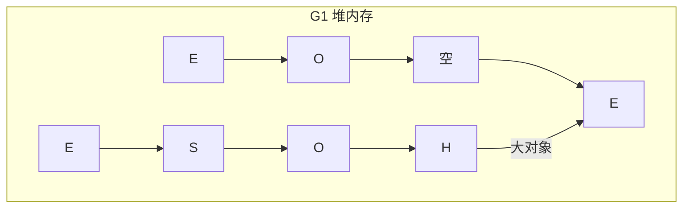
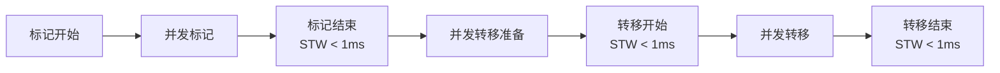
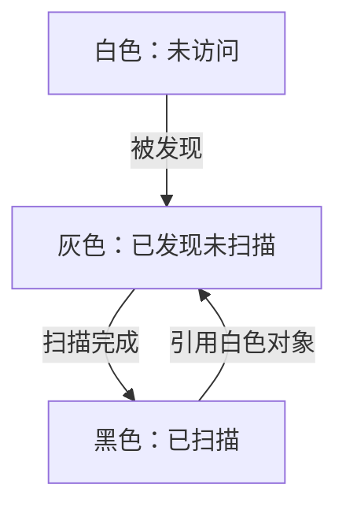
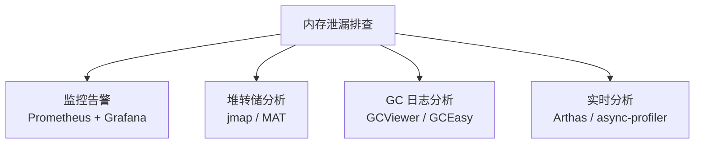

## 内存管理：程序运行的基础设施

> "The two most important things in programming are: memory management and naming things." —— 改编自 Phil Karlton

内存管理是编程语言最底层的基础设施之一。它直接影响程序的性能、稳定性和安全性。从 C 的手动管理到 Java 的自动回收，再到 Rust 的所有权模型，每种方案都在**安全性**与**控制力**之间寻找平衡。

---

## 一、手动 vs 自动内存管理

### 1.1 手动内存管理

```c
// C 语言：手动管理
void process() {
    int* data = (int*)malloc(100 * sizeof(int));
    if (data == NULL) {
        return; // 忘记处理分配失败
    }

    // 使用 data...

    free(data);       // 必须手动释放
    // data = NULL;   // 忘记置空 → 悬垂指针
}
```

手动管理的典型问题：

| 问题 | 描述 | 后果 |
|------|------|------|
| 忘记释放 | 分配后未调用 free | 内存泄漏 |
| 重复释放 | 同一内存释放两次 | 未定义行为 |
| 使用后释放 | 释放后继续访问 | 悬垂指针，数据损坏 |
| 释放前返回 | 提前 return 跳过 free | 内存泄漏 |

### 1.2 自动内存管理

```java
// Java：自动垃圾回收
void process() {
    List<Integer> data = new ArrayList<>();
    // 使用 data...
    // 无需手动释放，GC 自动回收
}
```



---

## 二、引用计数（Reference Counting）

### 2.1 基本原理

引用计数为每个对象维护一个计数器，记录有多少引用指向该对象。计数归零时立即回收。

```python
# Python 使用引用计数 + 分代 GC
import sys

a = [1, 2, 3]   # 引用计数 = 1
b = a            # 引用计数 = 2
print(sys.getrefcount(a) - 1)  # 2（getrefcount 本身也增加引用）

del b            # 引用计数 = 1
del a            # 引用计数 = 0 → 立即回收
```

### 2.2 引用计数的致命问题：循环引用

```python
# 循环引用导致内存泄漏
class Node:
    def __init__(self):
        self.next = None

a = Node()
b = Node()
a.next = b  # a → b
b.next = a  # b → a（循环引用）

del a
del b
# 引用计数都不为零，但已经无法访问 → 内存泄漏！
```



### 2.3 解决循环引用

| 方案 | 语言 | 机制 |
|------|------|------|
| 辅助 GC | Python | 分代 GC 作为后备，定期检测循环引用 |
| 弱引用 | 各语言 | `weakref` 不增加引用计数 |
| 手动断开 | Objective-C ARC | 程序员负责打破循环 |
| Swift 弱引用 | Swift | `weak` / `unowned` 引用不增加计数 |

```swift
// Swift 解决循环引用
class Person {
    var name: String
    weak var apartment: Apartment?  // weak 不增加引用计数
    init(name: String) { self.name = name }
}

class Apartment {
    var unit: String
    weak var tenant: Person?  // weak 不增加引用计数
    init(unit: String) { self.unit = unit }
}
```

---

## 三、经典 GC 算法

### 3.1 标记-清除（Mark-Sweep）



```java
// 伪代码
void markSweep() {
    // 标记阶段
    for (root : gcRoots) {
        mark(root);
    }
    // 清除阶段
    for (obj : heap) {
        if (!obj.isMarked()) {
            free(obj);
        } else {
            obj.unmark(); // 清除标记，为下次 GC 准备
        }
    }
}
```

**优点**：实现简单，能处理循环引用
**缺点**：内存碎片化，分配效率低

### 3.2 复制算法（Copying）



将存活对象从 From 空间复制到 To 空间，然后交换两个空间的角色。

**优点**：无碎片，分配快（指针碰撞）
**缺点**：空间利用率仅 50%，复制开销与存活对象成正比

### 3.3 标记-整理（Mark-Compact）

先标记，再将存活对象向一端移动，最后清理边界以外的内存。



**优点**：无碎片，空间利用率高
**缺点**：移动对象需要更新引用，耗时较长

### 3.4 三种算法对比

| 维度 | 标记-清除 | 复制 | 标记-整理 |
|------|----------|------|----------|
| 空间开销 | 无额外开销 | 2 倍空间 | 无额外开销 |
| 碎片化 | 严重 | 无 | 无 |
| 移动对象 | 否 | 是 | 是 |
| 适合场景 | 老年代 | 新生代 | 老年代 |
| 时间复杂度 | O(堆大小) | O(存活对象) | O(堆大小) |

---

## 四、分代垃圾回收

### 4.1 分代假说

> **弱分代假说**：绝大多数对象都是朝生夕死的。
> **强分代假说**：熬过越多次 GC 的对象越不容易死亡。

统计表明，约 **98%** 的对象在一次 GC 中就被回收。

### 4.2 JVM 分代模型



新生代 GC（Minor GC）流程：

1. 新对象分配在 Eden 区
2. Eden 满时触发 Minor GC
3. 存活对象复制到 Survivor0
4. 下次 GC 时，Eden + Survivor0 存活对象复制到 Survivor1
5. 交换 Survivor0 和 Survivor1 的角色
6. 对象年龄达到阈值（默认 15）晋升老年代

### 4.3 对象晋升策略

| 条件 | 行为 |
|------|------|
| 年龄 ≥ 阈值 | 晋升到老年代 |
| Survivor 空间不足 | 通过担保机制直接晋升老年代 |
| 大对象 | 直接进入老年代（避免在新生代大量复制） |

---

## 五、现代 GC：G1 与 ZGC

### 5.1 G1（Garbage-First）

G1 将堆划分为大小相等的 **Region**（1~32MB），不再物理隔离新生代和老年代。



- **E**：Eden Region
- **S**：Survivor Region
- **O**：Old Region
- **H**：Humongous Region（大对象）

G1 的核心思想：**优先回收垃圾最多的 Region**（Garbage-First 名称由来），通过维护每个 Region 的回收价值，在用户设定的停顿时间目标内选择收益最大的 Region 回收。

```bash
# G1 关键参数
-XX:+UseG1GC
-XX:MaxGCPauseMillis=200    # 目标最大停顿时间
-XX:G1HeapRegionSize=16m    # Region 大小
-XX:InitiatingHeapOccupancyPercent=45  # 触发并发标记的堆占用阈值
```

### 5.2 ZGC（Z Garbage Collector）

ZGC 是 JDK 11 引入的低延迟垃圾收集器，目标是将 GC 停顿控制在 **10ms 以内**（通常亚毫秒级）。



ZGC 的关键技术：

| 技术 | 作用 |
|------|------|
| **染色指针** | 在指针中存储标记信息，无需额外数据结构 |
| **读屏障** | 在对象引用加载时修正指针，保证一致性 |
| **并发转移** | 对象移动与应用线程并发执行 |
| **多重映射 | 同一物理内存映射多个虚拟地址，实现颜色切换 |

### 5.3 G1 vs ZGC 对比

| 维度 | G1 | ZGC |
|------|-----|-----|
| 目标停顿 | 200ms | < 10ms |
| STW 阶段 | 多个 | 极少且极短 |
| 适合堆大小 | < 64GB | 可达 TB 级 |
| JDK 版本 | JDK 9+ | JDK 11+（生产 JDK 15+） |
| 吞吐量 | 较高 | 略低（读屏障开销） |
| 实现复杂度 | 中等 | 高 |

---

## 六、Go 语言的 GC

Go 使用**并发三色标记-清除**算法，不进行分代。

### 6.1 三色标记法



- **白色**：尚未被访问，GC 结束后仍为白色的对象被回收
- **灰色**：已被访问但其引用的对象尚未全部扫描
- **黑色**：已被访问且其引用的对象已全部扫描

### 6.2 写屏障与三色不变性

并发标记时，应用线程可能修改对象引用，破坏三色不变性。Go 使用**混合写屏障**保证正确性：

```go
// 混合写屏障伪代码
func writePointer(slot *unsafe.Pointer, ptr unsafe.Pointer) {
    shade(*slot)  // 着色旧值（删除写屏障）
    shade(ptr)    // 着色新值（插入写屏障）
    *slot = ptr
}
```

### 6.3 Go GC 调优

```go
// GOGC 控制触发阈值，默认 100
// 表示堆增长 100% 时触发 GC
// GOGC=200 → 堆增长 200% 时触发
// GOGC=off → 关闭 GC

// Go 1.19+ 使用 GOMEMLIMIT 设置内存上限
import "runtime/debug"
debug.SetMemoryLimit(1 << 30) // 1GB
```

---

## 七、Rust 所有权模型

Rust 通过**所有权系统**在编译期保证内存安全，无需 GC。

### 7.1 所有权三规则

1. 每个值有且只有一个所有者（Owner）
2. 同一时刻只能有一个所有者
3. 所有者离开作用域时，值被自动释放

```rust
fn ownership_demo() {
    let s1 = String::from("hello");
    let s2 = s1;        // 所有权转移（move），s1 不再有效
    // println!("{}", s1); // 编译错误：value borrowed after move
    println!("{}", s2);   // OK
} // s2 离开作用域，内存自动释放
```

### 7.2 借用与生命周期

```rust
// 不可变借用（&T）：允许多个同时存在
// 可变借用（&mut T）：同一时刻只能有一个
fn borrow_demo() {
    let mut s = String::from("hello");

    let r1 = &s;        // 不可变借用
    let r2 = &s;        // 再来一个不可变借用
    // let r3 = &mut s; // 编译错误：不能同时有不可变和可变借用

    println!("{} {}", r1, r2);

    let r3 = &mut s;    // 现在 r1, r2 不再使用，可以可变借用
    r3.push_str(" world");
}
```

### 7.3 生命周期标注

```rust
// 编译器需要知道返回引用的生命周期
fn longest<'a>(x: &'a str, y: &'a str) -> &'a str {
    if x.len() > y.len() { x } else { y }
}

// 结构体中的引用也需要生命周期
struct Parser<'a> {
    input: &'a str,
}

impl<'a> Parser<'a> {
    fn new(input: &'a str) -> Self {
        Parser { input }
    }
}
```

### 7.4 所有权 vs GC 对比

| 维度 | Rust 所有权 | GC |
|------|-----------|-----|
| 内存释放时机 | 编译期确定 | 运行时不确定 |
| 运行时开销 | 零 | 有（GC 线程、写屏障） |
| 停顿 | 无 | 有（STW） |
| 内存占用 | 精确 | 需额外空间（GC 开销） |
| 学习曲线 | 陡峭 | 平缓 |
| 循环引用 | 编译期防止 | 运行时检测 |
| 适合场景 | 系统编程、高性能 | 业务应用、快速开发 |

---

## 八、内存泄漏排查

### 8.1 GC 语言中的内存泄漏

即使有 GC，仍然可能发生内存泄漏——对象不再使用但仍然被引用。

```java
// 典型内存泄漏：缓存无界增长
public class LeakyCache {
    private static final Map<String, byte[]> cache = new HashMap<>();

    public static void put(String key, byte[] data) {
        cache.put(key, data); // 永远不清理 → 内存泄漏
    }
}

// 修复：使用弱引用缓存
public class SafeCache {
    private static final Map<String, WeakReference<byte[]>> cache = new ConcurrentHashMap<>();
}
```

### 8.2 排查工具链



```bash
# JVM 内存泄漏排查步骤

# 1. 查看 GC 情况
jstat -gcutil <pid> 1000

# 2. 生成堆转储
jmap -dump:format=b,file=heap.hprof <pid>

# 3. 使用 MAT 分析 heap.hprof
# 关注 Dominator Tree 和 Leak Suspects

# 4. GC 日志分析
java -Xlog:gc*:file=gc.log:time,uptime,level,tags ...

# 5. 使用 Arthas 在线诊断
java -jar arthas-boot.jar
dashboard          # 查看内存概况
heapdump           # 导出堆
profiler start     # 启动 profiling
profiler stop      # 生成火焰图
```

### 8.3 常见泄漏模式

| 模式 | 描述 | 解决方案 |
|------|------|---------|
| 无界缓存 | 缓存无限增长 | 使用 LRU / WeakHashMap |
| 未关闭资源 | 流、连接未关闭 | try-with-resources |
| 监听器未注销 | 事件监听器持有引用 | 及时注销 / 弱引用 |
| ThreadLocal | 线程池复用导致 ThreadLocal 堆积 | 使用后 remove |
| 内部类引用 | 非静态内部类持有外部类引用 | 使用静态内部类 |

---

## 九、面试 Q&A

**Q1：为什么 JVM 新生代使用复制算法而老年代使用标记-整理？**

新生代对象存活率低（约 2%），复制算法只需复制少量存活对象，效率高。虽然浪费一半空间，但新生代本身较小，可接受。老年代对象存活率高，复制算法需要复制大量对象，效率低且浪费空间，因此使用标记-整理。

**Q2：G1 的"Garbage-First"是什么意思？**

G1 维护每个 Region 的回收价值（垃圾占比），在用户设定的停顿时间目标内，优先选择回收价值最高的 Region 进行回收。这就像"捡西瓜丢芝麻"——先回收垃圾最多的区域，获得最大空间收益。

**Q3：ZGC 如何实现亚毫秒级停顿？**

ZGC 将所有耗时操作（标记、转移）都设计为并发执行，STW 阶段只做极少量同步工作。关键技术包括：染色指针（在指针中存储状态，避免额外数据结构）、读屏障（修正移动中的对象引用）、多重映射（快速切换指针颜色）。

**Q4：Rust 的所有权模型如何处理循环引用？**

Rust 的所有权规则天然防止了简单的循环引用（因为一个值只能有一个所有者）。对于图等需要循环引用的数据结构，Rust 提供了 `Weak<T>` 引用（类似弱引用，不增加强引用计数），或者使用 `Rc<RefCell<T>>` + `Weak<T>` 组合。编译器不会自动检测循环引用，但类型系统引导程序员使用弱引用模式。

**Q5：Go 为什么不分代 GC？**

Go 团队认为分代 GC 的假设在 Go 的使用场景中不一定成立，且分代 GC 需要写屏障，会增加运行时开销。Go 的设计哲学是简单和低延迟，三色标记-清除配合混合写屏障已经能满足大部分场景。Go 1.19 引入的 `GOMEMLIMIT` 进一步改善了 GC 调优体验。

**Q6：如何选择 GC 算法？**

- **追求吞吐量**：Parallel GC（JDK 8 默认）
- **平衡吞吐和延迟**：G1（JDK 9+ 默认）
- **极低延迟要求**：ZGC（JDK 15+）
- **小堆/低资源**：Serial GC
- **系统编程/零开销**：Rust（无 GC）

---

## 总结

内存管理没有银弹。手动管理给了你完全控制但容易出错，GC 给了安全便捷但有停顿和开销，Rust 的所有权模型在编译期保证安全但学习曲线陡峭。理解每种方案的原理和权衡，才能在工程实践中做出正确的选择。
