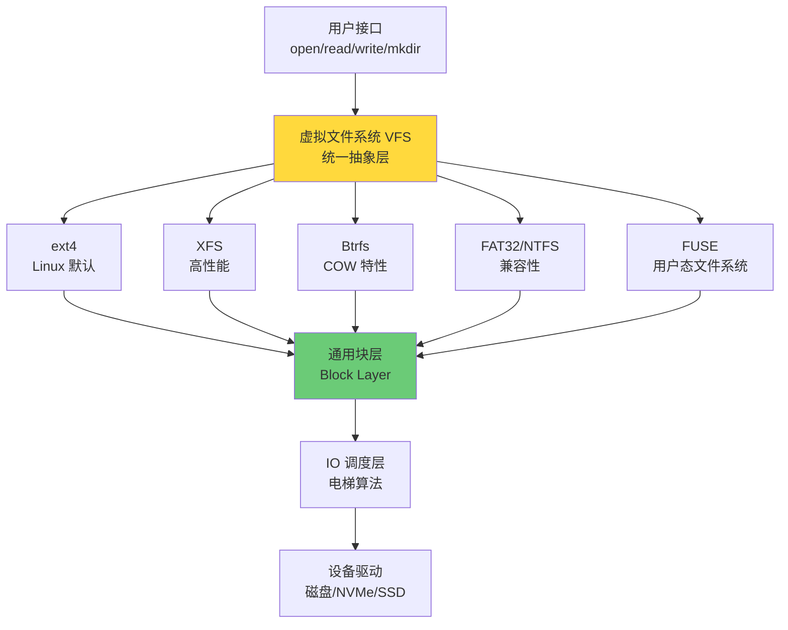
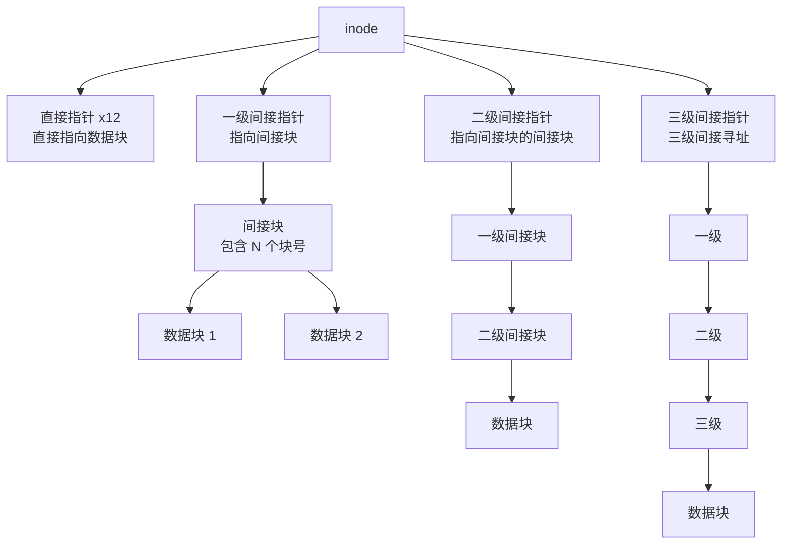
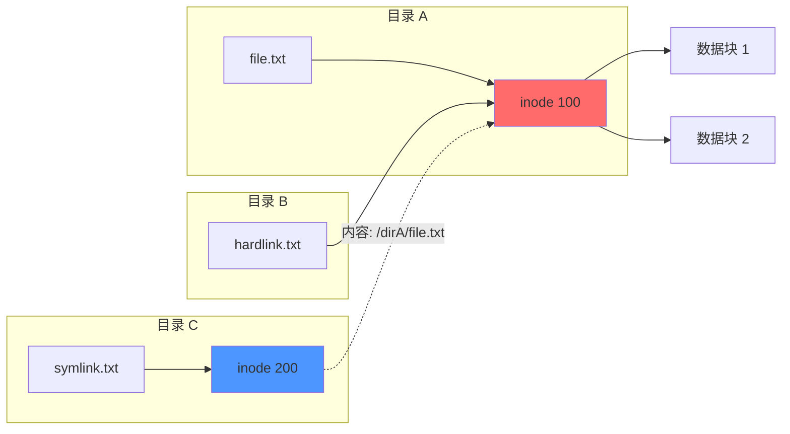
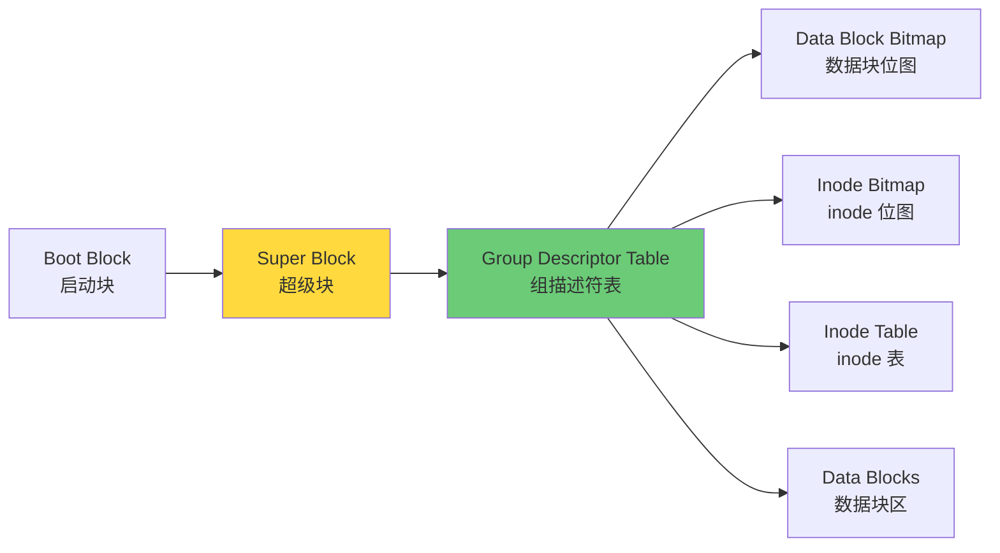
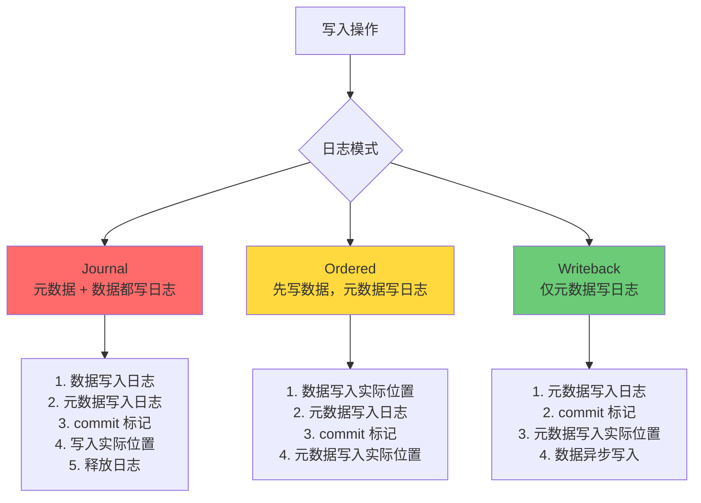
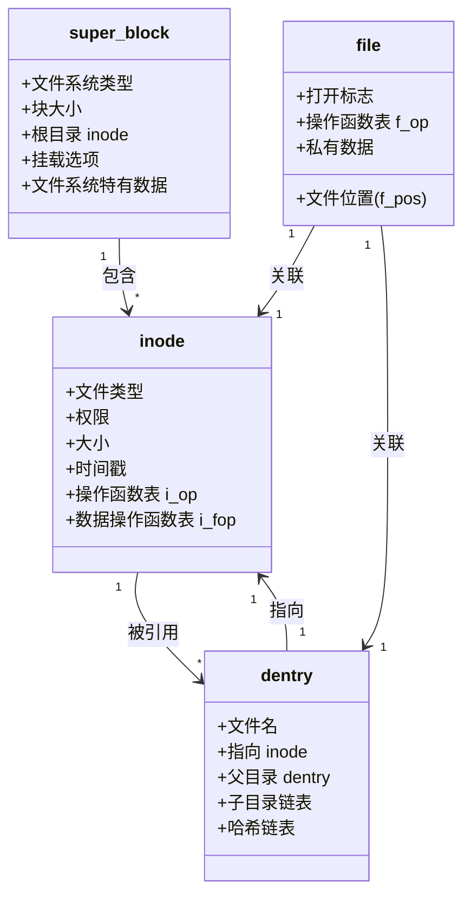
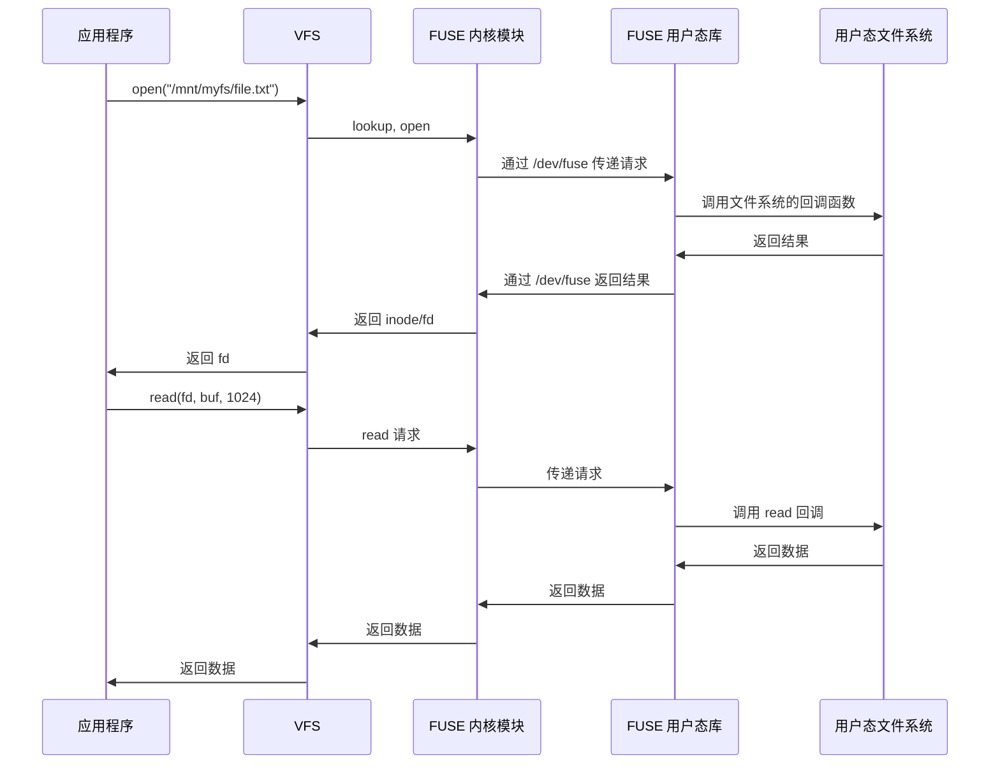
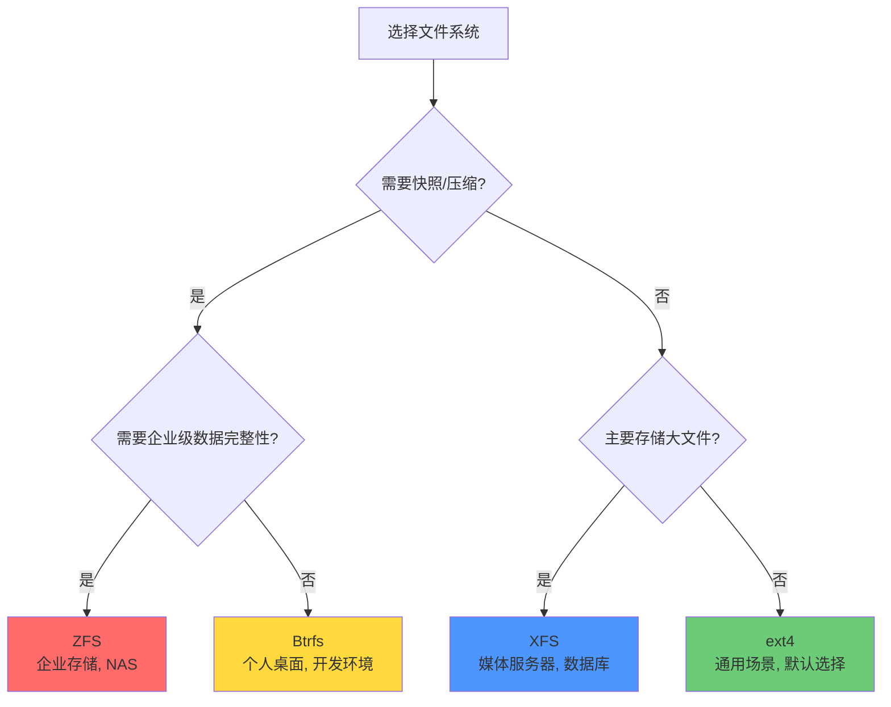

## 引言

文件系统是操作系统中最持久、最核心的子系统之一。从我们保存的文档到数据库的数据文件，从操作系统的可执行文件到 Docker 的镜像层，一切都依赖于文件系统。本文将从底层原理到现代实现，深入剖析文件系统的每一个细节。

---

## 文件系统的层次结构

文件系统不是单一模块，而是一个精心设计的分层架构。



### 各层职责

| 层次 | 职责 | 关键数据结构 |
|------|------|-------------|
| **用户接口** | 系统调用 API | file descriptor |
| **VFS** | 提供统一接口，屏蔽具体文件系统差异 | super_block, inode, dentry, file |
| **具体文件系统** | 实现数据在磁盘上的组织方式 | ext4_super_block, ext4_inode |
| **块设备驱动** | 与硬件交互，执行实际的读写 | request_queue, bio |

---

## inode（索引节点）

### 什么是 inode

inode 是文件系统中用于描述文件元数据的数据结构。**每个文件（和目录）对应唯一的 inode**。

### inode 包含的信息

| 字段 | 说明 |
|------|------|
| **文件大小** | 文件的字节数 |
| **权限** | rwx 权限位 |
| **所有者** | UID, GID |
| **时间戳** | atime（访问时间）, mtime（修改时间）, ctime（变更时间） |
| **链接数** | 硬链接数量 |
| **文件类型** | 普通文件、目录、符号链接、设备文件等 |
| **数据块指针** | 指向文件内容所在的数据块 |

**注意**：inode 中**不包含文件名**。文件名存储在目录中。

### 数据块指针的结构



**容量计算**（假设块大小 4KB，块号 4 字节）：

| 指针类型 | 数量 | 可寻址容量 |
|----------|------|-----------|
| 直接指针 | 12 | $12 \times 4KB = 48KB$ |
| 一级间接 | 1 | $1024 \times 4KB = 4MB$ |
| 二级间接 | 1 | $1024^2 \times 4KB = 4GB$ |
| 三级间接 | 1 | $1024^3 \times 4KB = 4TB$ |

ext4 引入了 **extent** 机制替代传统的块指针，用连续的块范围来描述文件布局，大幅减少元数据开销。

```c
// extent 结构
struct ext4_extent {
    __le32  ee_block;   // 起始逻辑块号
    __le16  ee_len;     // 连续块数量
    __le16  ee_start_hi;// 物理块号高16位
    __le32  ee_start_lo;// 物理块号低32位
};
```

---

## 目录的本质

**目录本质上是一个特殊的文件**，其内容是一个映射表：

```
文件名 → inode 编号
```

### 目录结构

```
# 目录文件的内容（概念上）

| 文件名    | inode 号 |
|-----------|----------|
| .         | 2        |
| ..        | 2        |
| hello.txt | 131073   |
| subdir    | 131074   |
```

- `.` 指向当前目录的 inode
- `..` 指向父目录的 inode

### 目录项（dentry）缓存

Linux 使用 **dentry cache（dcache）** 缓存目录项，避免每次查找都要读取磁盘上的目录文件。

```
路径: /home/user/file.txt
查找过程:
  "/"      → dcache 命中 → inode 1
  "home"   → dcache 命中 → inode 2
  "user"   → dcache 命中 → inode 3
  "file.txt" → dcache 未命中 → 读取目录文件 → 获取 inode 4
```

---

## 硬链接与软链接

### 对比

| 特性 | 硬链接 (Hard Link) | 软链接 (Symbolic Link) |
|------|-------------------|----------------------|
| **本质** | 同一 inode 的另一个文件名 | 包含目标路径的特殊文件 |
| **inode** | 与原文件相同 | 独立的 inode |
| **跨文件系统** | 不支持 | 支持 |
| **目录链接** | 不支持（防止循环） | 支持 |
| **删除原文件** | 不影响（inode 链接数 -1） | 链接失效（悬空链接） |
| **存储空间** | 不占用额外空间 | 占用存储目标路径的空间 |

### 原理



```bash
# 创建硬链接
ln file.txt hardlink.txt

# 创建软链接
ln -s file.txt symlink.txt

# 查看 inode
ls -i file.txt hardlink.txt symlink.txt
# 100 file.txt  100 hardlink.txt  200 symlink.txt

# 查看链接数
ls -l file.txt
# -rw-r--r-- 2 user group ...  file.txt  (链接数 = 2)
```

---

## ext4 文件系统结构

### 磁盘布局



### 关键组件

| 组件 | 说明 |
|------|------|
| **Boot Block** | 引导扇区（如果文件系统是可启动的） |
| **Super Block** | 文件系统的元信息（块大小、总块数、空闲块数、挂载时间等） |
| **Group Descriptor Table** | 每个块组的描述符（数据块位图位置、inode 位图位置、inode 表位置、空闲块/ inode 计数） |
| **Data Block Bitmap** | 每个位表示一个数据块是否被占用 |
| **Inode Bitmap** | 每个位表示一个 inode 是否被占用 |
| **Inode Table** | 所有 inode 的连续存储区域 |
| **Data Blocks** | 实际存储文件内容的区域 |

### 块组（Block Group）

ext4 将磁盘划分为多个块组，每个块组包含自己的超级块副本、描述符、位图、inode 表和数据块。这种设计有以下好处：

- **冗余**：每个块组都有超级块副本，提高可靠性
- **局部性**：文件的数据块和 inode 尽量分配在同一块组，减少寻道时间
- **并行性**：多个块组可以并行分配

```c
// ext4 超级块关键字段 (简化)
struct ext4_super_block {
    __le32  s_blocks_count_lo;    // 总块数
    __le32  s_inodes_count;       // 总 inode 数
    __le32  s_free_blocks_count;  // 空闲块数
    __le32  s_free_inodes_count;  // 空闲 inode 数
    __le32  s_first_data_block;   // 第一个数据块号
    __le32  s_log_block_size;     // 块大小 (0=1K, 1=2K, 2=4K)
    __le32  s_blocks_per_group;   // 每组块数
    __le32  s_inodes_per_group;   // 每组 inode 数
    __le16  s_magic;              // 魔数 0xEF53
    // ... 更多字段
};
```

---

## 日志（Journal）机制

### 为什么需要日志

文件系统的更新通常涉及多个步骤。例如，创建一个文件需要：
1. 分配 inode
2. 更新 inode 位图
3. 分配数据块
4. 更新数据块位图
5. 更新目录项

如果在步骤 3 之后系统崩溃，位图和实际分配状态不一致，导致文件系统损坏。

### 三种日志模式



| 模式 | 安全性 | 性能 | 说明 |
|------|--------|------|------|
| **Journal** | 最高 | 最低 | 数据和元数据都先写日志，双重写入开销 |
| **Ordered**（默认） | 高 | 中 | 数据先写入实际位置，元数据写日志。保证崩溃后不会出现脏数据引用 |
| **Writeback** | 低 | 最高 | 仅元数据写日志，数据可能延迟写入。崩溃后可能出现垃圾数据 |

### ext4 日志的工作流程

```
1. 将事务写入日志区域
2. 写入 commit block（标记事务完整）
3. 数据/元数据写入最终磁盘位置
4. 标记日志区域可复用
```

**关键点**：commit block 的写入是保证一致性的关键。只要 commit block 存在，说明事务完整，可以重放。

---

## 虚拟文件系统（VFS）

### VFS 的设计目标

Linux 支持多种文件系统（ext4, XFS, Btrfs, NFS, FAT 等）。VFS 提供统一的抽象层，让上层应用无需关心底层文件系统的实现细节。

### VFS 核心对象



### VFS 操作函数表

VFS 通过函数指针表实现多态：

```c
// VFS inode 操作
struct inode_operations {
    struct dentry * (*lookup) (struct inode *, struct dentry *, unsigned int);
    int (*create) (struct inode *, struct dentry *, umode_t, bool);
    int (*link) (struct dentry *, struct inode *, struct dentry *);
    int (*unlink) (struct inode *, struct dentry *);
    int (*symlink) (struct inode *, struct dentry *, const char *);
    int (*mkdir) (struct inode *, struct dentry *, umode_t);
    // ...
};

// VFS 文件操作
struct file_operations {
    loff_t (*llseek) (struct file *, loff_t, int);
    ssize_t (*read) (struct kiocb *, struct iov_iter *);
    ssize_t (*write) (struct kiocb *, struct iov_iter *);
    int (*fsync) (struct file *, loff_t, loff_t, int datasync);
    // ...
};
```

当调用 `read()` 系统调用时：
1. 通过 fd 找到 `struct file`
2. 通过 `file` 找到 `inode`
3. 通过 `inode->i_fop->read` 调用具体文件系统的 read 实现

---

## FUSE（用户态文件系统）

### 原理

FUSE（Filesystem in Userspace）允许非特权用户在用户空间实现文件系统，无需修改内核代码。



### FUSE 应用实例

| 文件系统 | 用途 |
|----------|------|
| **sshfs** | 通过 SSH 挂载远程文件系统 |
| **rclone** | 挂载云存储（Google Drive, S3 等） |
| **NTFS-3G** | Linux 读写 NTFS |
| **EncFS** | 透明加密文件系统 |
| **glusterfs client** | 分布式文件系统客户端 |

### 简单示例

```python
from fuse import FUSE, Operations

class SimpleFS(Operations):
    def getattr(self, path, fh=None):
        return {
            'st_mode': 0o100644,
            'st_size': 1024,
            'st_nlink': 1,
        }
    
    def readdir(self, path, fh):
        return ['.', '..', 'hello.txt']
    
    def read(self, path, size, offset, fh):
        return b'Hello from FUSE!\n'

FUSE(SimpleFS(), '/mnt/myfs', foreground=True)
```

---

## 现代文件系统对比

| 特性 | ext4 | XFS | Btrfs | ZFS |
|------|------|-----|-------|-----|
| **最大文件系统** | 1EB | 8EB | 16EB | 256ZB |
| **最大文件** | 16TB | 8EB | 16EB | 16EB |
| **日志** | 元数据 | 元数据 | COW（无日志） | COW（无日志） |
| **快照** | 不支持 | 支持（dm-snap） | 原生支持 | 原生支持 |
| **RAID** | 不支持 | 不支持 | 原生支持 | 原生 RAID-Z |
| **校验和** | 元数据 | 无 | 数据 + 元数据 | 数据 + 元数据 |
| **压缩** | 不支持 | 不支持 | 原生支持 | 原生支持 |
| **子卷** | 不支持 | 不支持 | 支持 | 支持（dataset） |
| **碎片整理** | 在线 | 在线 | 在线 | 不支持（COW 无碎片） |
| **成熟度** | 非常成熟 | 非常成熟 | 较新 | 成熟 |
| **适用场景** | 通用桌面/服务器 | 大文件、高吞吐 | 需要快照/COW | 数据完整性优先 |

### 选择建议



---

## 面试 Q&A

### Q1: inode 中包含文件名吗？如何理解"目录的本质"？

**A:** inode 不包含文件名。文件名存储在目录的数据块中，目录本质上是一个文件名到 inode 编号的映射表。这也是为什么同一个文件（inode）可以有多个文件名（硬链接）——目录文件中有多条记录指向同一个 inode。

### Q2: 硬链接和软链接的区别是什么？什么场景下使用哪种？

**A:** 硬链接是同一 inode 的另一个名字，不能跨文件系统，不能链接目录。软链接是一个特殊文件，内容是目标路径，可以跨文件系统。硬链接适合在同一文件系统内给文件起别名（如版本管理中的快照引用）。软链接适合跨文件系统引用、指向目录、或作为快捷方式。

### Q3: 为什么 ext4 默认使用 Ordered 日志模式而不是 Journal 模式？

**A:** Journal 模式将数据和元数据都写入日志，然后再写入实际位置，相当于写两次数据，性能开销大。Ordered 模式只将元数据写入日志，数据直接写入实际位置。由于元数据很小，日志开销小。而且 Ordered 模式保证了数据先于元数据写入，崩溃后不会出现元数据指向脏数据块的情况，安全性足够大多数场景。

### Q4: VFS 的作用是什么？它是如何实现多态的？

**A:** VFS（虚拟文件系统）是 Linux 内核中的抽象层，提供统一的文件操作接口，屏蔽不同文件系统的实现差异。它通过函数指针表（如 `file_operations`, `inode_operations`）实现多态：每个具体文件系统提供自己的实现，VFS 通过调用函数指针路由到正确的实现。上层应用调用 `read()` 时不关心底层是 ext4 还是 NFS。

### Q5: 删除一个文件，操作系统实际做了什么？

**A:** 
1. 检查文件的硬链接数
2. 如果链接数 > 1：仅从目录中删除文件名条目，链接数 -1
3. 如果链接数 = 0：释放 inode（标记 inode 位图），释放数据块（标记数据块位图），更新超级块的空闲计数
4. **注意**：数据块的内容不会立即清零，只是标记为可分配。这就是为什么删除的文件可以用工具恢复的原因。

### Q6: 什么是 COW（Copy-On-Write）文件系统？与日志文件系统的区别？

**A:** COW 文件系统（如 Btrfs、ZFS）在修改数据时不覆盖原有块，而是写入新块，然后更新指针指向新块。这保证了任何时刻磁盘上的数据都是一致的，无需日志。日志文件系统（如 ext4）是在修改前先记录日志，崩溃后通过日志恢复。COW 的优势：天然支持快照、无需 fsck。劣势：写入放大、碎片化问题。

---

## 总结

文件系统是操作系统最复杂的子系统之一，从 inode 的元数据管理、目录的映射表本质、ext4 的块组结构、日志的一致性保证，到 VFS 的统一抽象和 FUSE 的用户态扩展，每一层都经过精心设计和不断优化。理解文件系统的原理，不仅有助于通过面试，更能帮助工程师在实际工作中做出正确的存储选型、排查 IO 性能问题、设计高效的文件处理方案。
