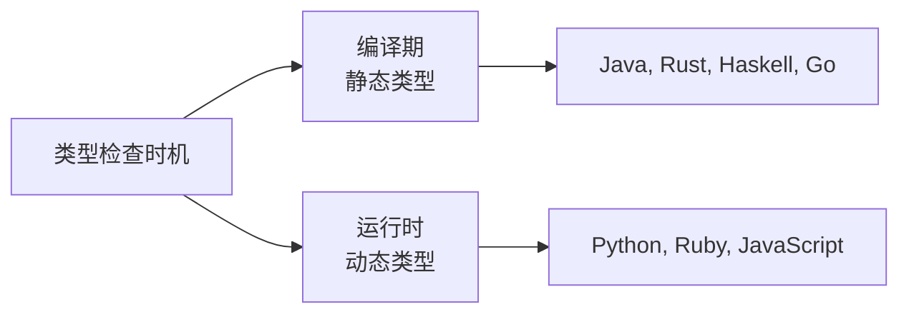
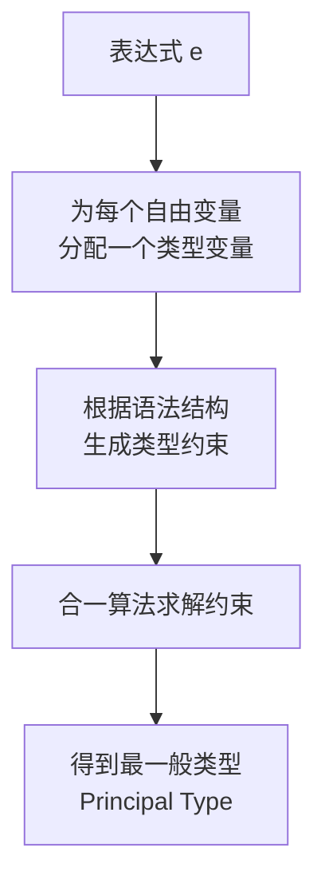
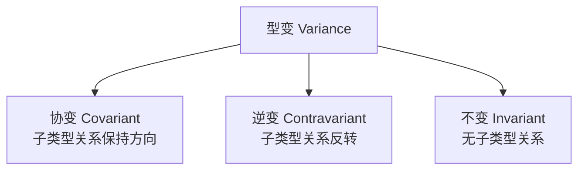
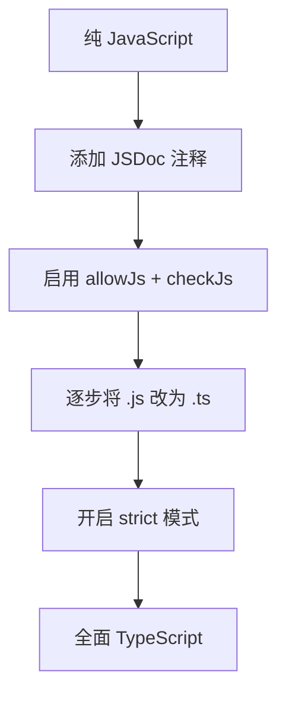

## 类型系统：程序正确性的第一道防线

> "Type systems are the most successful and widely applied lightweight formal method." —— Benjamin Pierce

类型系统是编程语言最核心的设计决策之一。它不仅决定了代码如何被编译或解释，更深刻地影响着程序员的**思维模型**和**工程实践**。一个精心设计的类型系统，能在编译期捕获大量错误，让重构变得安全，让接口契约变得显式。

---

## 一、强类型 vs 弱类型

### 1.1 定义与本质

**强类型（Strongly Typed）**：语言不允许不安全的隐式类型转换，类型错误会在编译或运行时被严格报告。

**弱类型（Weakly Typed）**：语言允许隐式类型转换，甚至在不同类型之间进行"魔法"操作。

```javascript
// JavaScript（弱类型）—— 经典的隐式转换陷阱
console.log("1" + 2);     // "12"  —— 字符串拼接
console.log("1" - 2);     // -1    —— 数值减法
console.log([] + {});      // "[object Object]"
console.log([] == false);  // true  —— 隐式布尔转换
console.log("" == 0);      // true
console.log(null == undefined); // true
```

```python
# Python（强类型）—— 类型错误不会被静默忽略
"1" + 2    # TypeError: can only concatenate str to str
int("1") + 2  # 3 —— 必须显式转换
```

### 1.2 强弱类型对比

| 维度 | 强类型 | 弱类型 |
|------|--------|--------|
| 隐式转换 | 很少或没有 | 大量存在 |
| 类型安全 | 高 | 低 |
| 运行时类型错误 | 少 | 多 |
| 代码可预测性 | 高 | 低 |
| 代表语言 | Python, Java, Rust, Haskell | JavaScript, PHP, C |
| 学习曲线 | 较陡 | 较平缓 |

> **工程视角**：在大型项目中，强类型的优势更加明显。TypeScript 的流行本质上就是 JavaScript 社区对强类型的需求体现。

---

## 二、静态类型 vs 动态类型

### 2.1 核心区别



**静态类型**：变量类型在编译期确定，编译器能在代码运行前检查类型正确性。

**动态类型**：变量类型在运行时确定，类型错误只在程序执行到相关代码时才会暴露。

```rust
// Rust（静态类型）—— 编译期捕获错误
fn add(a: i32, b: i32) -> i32 {
    a + b
}
add(1, "hello"); // 编译错误：mismatched types
```

```python
# Python（动态类型）—— 运行时才发现错误
def add(a, b):
    return a + b

add(1, 2)        # 3 —— 正常运行
add(1, "hello")  # TypeError —— 运行时才报错
```

### 2.2 静态 vs 动态类型深度对比

| 维度 | 静态类型 | 动态类型 |
|------|----------|----------|
| 类型检查 | 编译期 | 运行时 |
| 错误发现 | 早（编译时） | 晚（运行时） |
| 代码冗余 | 较多（需声明类型） | 较少 |
| IDE 支持 | 强（自动补全、重构） | 弱 |
| 灵活性 | 较低 | 较高 |
| 重构安全 | 高 | 低 |
| 适合场景 | 大型工程、团队协作 | 脚本、原型、小型项目 |
| 性能 | 通常更快 | 通常更慢（需运行时检查） |

### 2.3 类型推导：两全其美？

类型推导让静态类型语言兼具动态类型的简洁和静态类型的安全。

```rust
// Rust 的类型推导
let x = 42;              // 推导为 i32
let name = "hello";      // 推导为 &str
let v = vec![1, 2, 3];   // 推导为 Vec<i32>
let sum: i32 = v.iter().sum(); // 需要类型标注消除歧义
```

```haskell
-- Haskell 的类型推导
x = 42           -- 推导为 Num a => a
name = "hello"   -- 推导为 [Char]
add a b = a + b  -- 推导为 Num a => a -> a -> a
```

---

## 三、Hindley-Milner 类型推导

### 3.1 算法原理

Hindley-Milner（HM）是函数式语言中最经典的类型推导算法，其核心思想是**基于合一（Unification）的类型推导**。



HM 算法的关键性质：

1. **完备性**：如果表达式有类型，HM 一定能推导出来
2. **主类型性质**：推导出的类型是最一般的（最不具体的）
3. **可判定性**：类型推导总是能在有限步内终止

### 3.2 推导过程示例

对于 `let f = \x -> x`（恒等函数）：

1. 分配类型变量：`x : α`, `f : β`
2. 函数体约束：`β = α → α`
3. 合一求解：`f : ∀α. α → α`

```haskell
-- Haskell 中的多态类型
id :: a -> a          -- HM 推导出的最一般类型
id x = x

const :: a -> b -> a  -- HM 推导
const x y = x

-- 更复杂的推导
compose :: (b -> c) -> (a -> b) -> a -> c
compose f g x = f (g x)
```

### 3.3 HM 的局限

- **不支持高阶多态（Higher-rank polymorphism）**：HM 只允许 `let` 绑定时量化类型变量
- **不支持子类型（Subtyping）**：HM 假设类型之间没有子类型关系
- **需要值限制（Value Restriction）**：在 ML 系语言中，防止引用破坏类型安全

```haskell
-- 值限制示例：以下在标准 ML 中会报错
-- let f = ref []  -- 不能推导为 ∀a. ref [a]
-- 解决：限制只有值（非函数应用）才能多态泛化
```

---

## 四、泛型与型变（Variance）

### 4.1 泛型的本质

泛型（Generics / Parametric Polymorphism）允许代码在不指定具体类型的情况下编写，使用时再确定类型。

```java
// Java 泛型
public class Box<T> {
    private T value;
    public void set(T value) { this.value = value; }
    public T get() { return value; }
}

Box<String> strBox = new Box<>();
strBox.set("hello");
String s = strBox.get(); // 无需强制转换
```

```rust
// Rust 泛型
struct Box<T> {
    value: T,
}

impl<T> Box<T> {
    fn new(value: T) -> Self {
        Box { value }
    }
    fn get(&self) -> &T {
        &self.value
    }
}
```

### 4.2 型变（Variance）：类型安全的子类型关系

型变描述了**复合类型之间的子类型关系**如何由其**组成类型的子类型关系**决定。



设 `Animal` 是 `Cat` 的父类型（`Cat <: Animal`）：

| 型变类型 | 规则 | 示例 | 说明 |
|---------|------|------|------|
| **协变** | `A <: B ⇒ F<A> <: F<B>` | `ReadOnlyArray<Cat> <: ReadOnlyArray<Animal>` | 只读容器可以协变 |
| **逆变** | `A <: B ⇒ F<B> <: F<A>` | `Func<Animal, void> <: Func<Cat, void>` | 函数参数可以逆变 |
| **不变** | 无子类型关系 | `MutableArray<Cat>` ≠ `MutableArray<Animal>` | 可变容器必须不变 |

```typescript
// TypeScript 中的型变
interface ReadOnlyArray<out T> {  // 协变
    get(index: number): T;
}

interface Writer<in T> {  // 逆变
    write(value: T): void;
}

interface MutableList<T> {  // 不变
    get(index: number): T;
    set(index: number, value: T): void;
}
```

```rust
// Rust 的型变规则
// &'a T 对 'a 协变，对 T 协变
// &'a mut T 对 'a 协变，对 T 不变
// fn(T) -> R 对 T 逆变，对 R 协变
// Box<T> 对 T 协变
// Cell<T> 对 T 不变
```

### 4.3 PECS 原则

Java 泛型中的通配符遵循 **PECS**（Producer Extends, Consumer Super）原则：

```java
// Producer Extends —— 只读用 extends（协变）
public static double sum(List<? extends Number> numbers) {
    double total = 0;
    for (Number n : numbers) {
        total += n.doubleValue(); // 只能读，不能写
    }
    return total;
}

// Consumer Super —— 只写用 super（逆变）
public static void addIntegers(List<? super Integer> list) {
    list.add(1);
    list.add(2);
    // 只能写 Integer，读出来是 Object
}
```

---

## 五、代数数据类型（ADT）

### 5.1 代数与类型的关系

ADT 的"代数"来自类型与数学代数的对应：

| 类型构造 | 对应代数 | 示例 |
|---------|---------|------|
| 积类型（Product） | 乘法 $A \times B$ | 元组、记录、结构体 |
| 和类型（Sum） | 加法 $A + B$ | 枚举、联合类型 |
| 单元类型 | 1 | `void` / `()` |
| 空类型 | 0 | `never` / `Void` |
| 函数类型 | 指数 $B^A$ | `A -> B` |

### 5.2 积类型（Product Type）

积类型的可能值数量是各组成部分的**乘积**：

```haskell
-- Haskell
data Point = Point Double Double  -- 可能值：∞ × ∞

-- 等价于元组
type Point' = (Double, Double)
```

```rust
// Rust
struct Point {
    x: f64,
    y: f64,
}
```

### 5.3 和类型（Sum Type）

和类型的可能值数量是各组成部分的**加和**：

```haskell
-- Haskell
data Shape
    = Circle Double              -- 半径
    | Rectangle Double Double    -- 宽、高
    | Triangle Double Double Double  -- 三边

area :: Shape -> Double
area (Circle r)          = pi * r * r
area (Rectangle w h)     = w * h
area (Triangle a b c)    =
    let s = (a + b + c) / 2
    in sqrt (s * (s-a) * (s-b) * (s-c))
```

```rust
// Rust 的 enum 就是和类型
enum Shape {
    Circle { radius: f64 },
    Rectangle { width: f64, height: f64 },
    Triangle { a: f64, b: f64, c: f64 },
}

fn area(shape: &Shape) -> f64 {
    match shape {
        Shape::Circle { radius } => std::f64::consts::PI * radius * radius,
        Shape::Rectangle { width, height } => width * height,
        Shape::Triangle { a, b, c } => {
            let s = (a + b + c) / 2.0;
            (s * (s - a) * (s - b) * (s - c)).sqrt()
        }
    }
}
```

### 5.4 代数法则与类型级计算

利用代数法则可以推导类型等价关系：

- **分配律**：$A \times (B + C) \cong A \times B + A \times C$
- **指数律**：$(A \times B)^C \cong A^C \times B^C$（即 `C -> (A, B)` ≅ `(C -> A, C -> B)`）
- **柯里化**：$A^{B \times C} \cong (A^B)^C$（即 `(B, C) -> A` ≅ `B -> C -> A`）

```haskell
-- 柯里化的类型等价
-- (a, b) -> c  ≅  a -> b -> c
curry :: ((a, b) -> c) -> a -> b -> c
curry f x y = f (x, y)

uncurry :: (a -> b -> c) -> (a, b) -> c
uncurry f (x, y) = f x y
```

---

## 六、TypeScript / Rust / Haskell 类型系统对比

### 6.1 综合对比

| 特性 | TypeScript | Rust | Haskell |
|------|-----------|------|---------|
| 类型检查 | 结构化（Structural） | 名义化（Nominal） | 名义化（Nominal） |
| 类型推导 | 局部推导 | 局部推导 | 全局推导（HM） |
| 泛型 | 有 | 有 | 有（更强大） |
| 子类型 | 有（结构化） | 无（用 Trait） | 无（用 Typeclass） |
| 和类型 | Union Types | enum | data |
| 积类型 | interface / type | struct | data（记录语法） |
| 高阶类型 | 无 | 无（GAT 有限支持） | 有（Higher-kinded types） |
| 依赖类型 | 无 | 无 | 有（GADT, Type Families） |
| 类型运算 | Conditional Types | Const Generics | Type Families |
| Null 安全 | `undefined | null` | `Option<T>` | `Maybe a` |

### 6.2 同一问题的不同解法：可空值处理

```typescript
// TypeScript —— 联合类型
function greet(name: string | null): string {
    if (name === null) {
        return "Hello, stranger!";
    }
    return `Hello, ${name}!`;
}
```

```rust
// Rust —— Option 枚举
fn greet(name: Option<&str>) -> String {
    match name {
        Some(n) => format!("Hello, {}!", n),
        None => "Hello, stranger!".to_string(),
    }
}

// 或使用 unwrap_or_default / map 等组合子
fn greet_combinator(name: Option<&str>) -> String {
    name.map(|n| format!("Hello, {}!", n))
        .unwrap_or_else(|| "Hello, stranger!".to_string())
}
```

```haskell
-- Haskell —— Maybe 类型
greet :: Maybe String -> String
greet (Just name) = "Hello, " ++ name ++ "!"
greet Nothing     = "Hello, stranger!"

-- 或使用 Functor/Applicative
greet' :: Maybe String -> String
greet' = maybe "Hello, stranger!" (\name -> "Hello, " ++ name ++ "!")
```

### 6.3 类型级编程对比

```typescript
// TypeScript —— 条件类型实现类型级计算
type IsEqual<A, B> = A extends B ? (B extends A ? true : false) : false;

type Result1 = IsEqual<string, number>; // false
type Result2 = IsEqual<string, string>; // true

// 递归类型
type DeepReadonly<T> = {
    readonly [K in keyof T]: T[K] extends object
        ? DeepReadonly<T[K]>
        : T[K];
};
```

```rust
// Rust —— Trait 与关联类型
trait Container {
    type Item;
    fn get(&self) -> Option<&Self::Item>;
}

struct Box<T> { value: Option<T> }

impl<T> Container for Box<T> {
    type Item = T;
    fn get(&self) -> Option<&Self::Item> {
        self.value.as_ref()
    }
}
```

```haskell
-- Haskell —— Type Family
type family Elem f where
    Elem []     a = a
    Elem Maybe  a = a
    Elem (Either e) a = a

-- GADT
data Expr a where
    IntLit  :: Int -> Expr Int
    BoolLit :: Bool -> Expr Bool
    Add     :: Expr Int -> Expr Int -> Expr Int
    If      :: Expr Bool -> Expr a -> Expr a -> Expr a

eval :: Expr a -> a
eval (IntLit n)    = n
eval (BoolLit b)   = b
eval (Add e1 e2)   = eval e1 + eval e2
eval (If c t f)    = if eval c then eval t else eval f
```

---

## 七、类型系统的工程价值

### 7.1 类型即文档

```rust
// 好的类型签名胜过注释
fn parse_config(path: &Path) -> Result<Config, ConfigError> {
    // ...
}

// 对比：无类型标注的版本
// fn parse_config(path) { ... }
// path 是什么？返回什么？出错怎么办？全靠猜
```

### 7.2 类型驱动开发（Type-Driven Development）


1. **先写类型**：定义数据模型和函数签名
2. **让编译器引导**：根据类型错误逐步填充实现
3. **类型安全重构**：修改类型定义，让编译器指出所有需要修改的地方

### 7.3 渐进式类型迁移

在大型 JavaScript 项目中引入 TypeScript 的策略：



---

## 八、面试 Q&A

**Q1：强类型和静态类型是一回事吗？**

不是。强/弱描述的是类型转换的严格程度；静态/动态描述的是类型检查的时机。四个象限都有代表语言：
- 强+静态：Java, Rust, Haskell
- 强+动态：Python, Ruby
- 弱+静态：C
- 弱+动态：JavaScript, PHP

**Q2：什么是 Hindley-Milner 类型推导？它的主类型性质有什么意义？**

HM 是基于合一算法的全局类型推导算法。主类型性质意味着：如果表达式有类型，HM 推导出的类型是最一般的（最不具体的），所有其他可能的类型都是它的特化实例。这保证了推导结果的唯一性和最大通用性。

**Q3：为什么 `List<String>` 不是 `List<Object>` 的子类型？**

因为如果允许这种协变，就可以往 `List<String>` 中通过 `List<Object>` 引用插入非 String 对象，破坏类型安全。这就是为什么可变容器必须是不变的。只读容器（如 `List<? extends Object>`）可以协变，因为不存在写入操作。

**Q4：Rust 的 enum 和 C 的 enum 有什么本质区别？**

C 的 enum 只是整数常量的别名，是弱类型的。Rust 的 enum 是代数数据类型（ADT）的和类型，每个变体可以携带不同类型和数量的数据，配合 `match` 进行穷尽模式匹配，编译器保证所有情况都被处理。

**Q5：TypeScript 的结构化类型和 Java 的名义化类型各有什么优劣？**

结构化类型关注类型的"形状"，只要结构兼容就能赋值，更灵活，适合鸭子类型的场景，但可能导致意外的类型兼容。名义化类型关注类型的"名字"，即使结构相同，不同名字的类型也不兼容，更严格，适合需要明确区分类型的场景。

**Q6：什么是型变？为什么函数参数是逆变的？**

型变描述复合类型的子类型关系。函数参数逆变是因为：如果 `Cat <: Animal`，那么 `Handler<Animal>` 应该是 `Handler<Cat>` 的子类型——因为能处理任何 Animal 的处理器，当然也能处理 Cat。这是里氏替换原则的自然推论。

---

## 总结

类型系统远不止"声明变量类型"那么简单。从强/弱、静/动态的基础分类，到 Hindley-Milner 推导的形式化方法，到泛型型变的精确控制，再到 ADT 的代数建模——类型系统是**编程语言理论最成功的工程化成果**。

选择语言时，理解其类型系统的设计哲学，比记住语法更重要。因为类型系统决定了你能**表达什么**、**保证什么**、以及**如何思考**问题。
