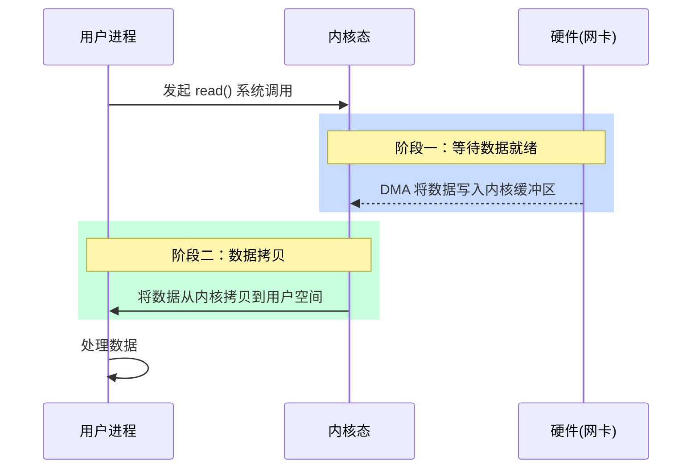
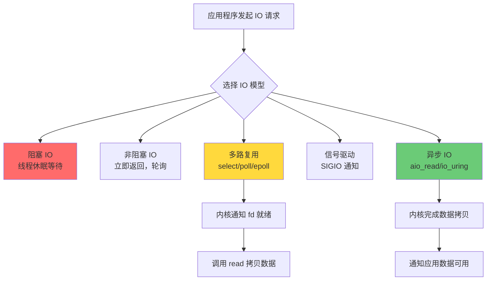
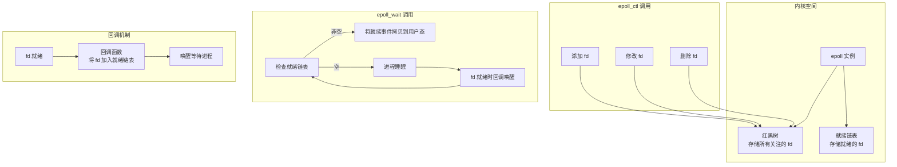
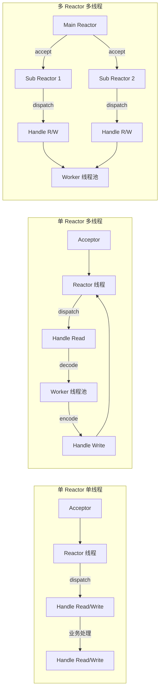
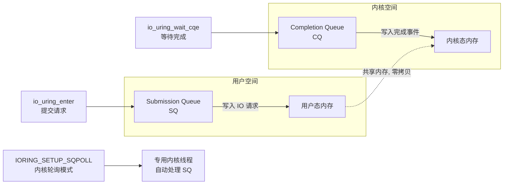

## 引言

IO（Input/Output）是计算机系统中最为常见的操作之一。网络请求、文件读写、数据库查询，本质上都是 IO 操作。理解操作系统的 IO 模型，是构建高性能网络服务的基础。本文将从底层原理到工程实践，全面解析五种 IO 模型以及多路复用技术。

---

## IO 的本质

一个 IO 操作（以网络 read 为例）实际上经历了两个阶段：

### 阶段一：等待数据就绪

内核等待数据从网络设备（网卡）到达内核缓冲区。这个阶段可能需要很长时间（等待网络包到达）。

### 阶段二：数据拷贝

将数据从内核缓冲区拷贝到用户空间的缓冲区。



**关键洞察**：所有 IO 模型的差异，主要在于**第一阶段（等待）的行为不同**。第二阶段（数据拷贝）在所有模型中基本相同。

---

## 五种 IO 模型对比

### 1. 阻塞 IO（Blocking IO）

最常见的 IO 模型。进程调用 `read()` 后，如果数据未就绪，进程被阻塞（进入睡眠状态），直到数据到达并拷贝完成。

```c
int fd = socket(AF_INET, SOCK_STREAM, 0);
connect(fd, ...);

// 阻塞等待，直到数据到达并拷贝完成
char buf[1024];
ssize_t n = read(fd, buf, sizeof(buf));
// 此时 n > 0，数据已经在 buf 中
```

**特点**：一个线程只能处理一个连接。

### 2. 非阻塞 IO（Non-blocking IO）

将 socket 设置为非阻塞模式（`O_NONBLOCK`）。如果数据未就绪，`read()` 立即返回 `EAGAIN` / `EWOULDBLOCK`。

```c
int fd = socket(AF_INET, SOCK_STREAM, 0);
fcntl(fd, F_SETFL, fcntl(fd, F_GETFL) | O_NONBLOCK);

while (1) {
    ssize_t n = read(fd, buf, sizeof(buf));
    if (n < 0) {
        if (errno == EAGAIN || errno == EWOULDBLOCK) {
            // 数据未就绪，做其他事情
            do_other_work();
            continue;
        }
        // 其他错误
        break;
    }
    // 读取到数据
    process_data(buf, n);
}
```

**问题**：需要不断轮询（busy-waiting），浪费 CPU。

### 3. IO 多路复用（IO Multiplexing）

使用一个系统调用同时监控多个文件描述符（fd），当任意一个 fd 就绪时返回。

**核心系统调用**：`select`、`poll`、`epoll`（Linux）、`kqueue`（BSD/macOS）。

### 4. 信号驱动 IO（Signal-driven IO）

进程注册信号处理函数（`SIGIO`），当数据就绪时内核发送信号通知进程。

```c
struct sigaction sa;
sa.sa_handler = sigio_handler;
sigaction(SIGIO, &sa, NULL);
fcntl(fd, F_SETOWN, getpid());
fcntl(fd, F_SETFL, fcntl(fd, F_GETFL) | O_ASYNC);
```

**问题**：信号处理函数中无法直接获取数据，仍需调用 `read()`。且信号处理复杂、容易出错，实际使用较少。

### 5. 异步 IO（AIO）

进程发起 IO 请求后立即返回，当数据就绪并拷贝完成后，内核通知进程。

```c
// Linux AIO (aio_read)
struct aiocb cb;
cb.aio_fildes = fd;
cb.aio_buf = buf;
cb.aio_nbytes = sizeof(buf);
cb.aio_sigevent.sigev_notify = SIGEV_SIGNAL;

aio_read(&cb);  // 立即返回
// ... 做其他事情
// 数据就绪并完成拷贝后，收到信号
```

**特点**：两阶段都不阻塞。但 Linux 原生 AIO（libaio）只支持 O_DIRECT（直接 IO，绕过页缓存），对于普通文件和网络 IO 支持有限。

### 对比总结

| 模型 | 阶段一（等待） | 阶段二（拷贝） | 适用场景 |
|------|----------------|----------------|----------|
| 阻塞 IO | 阻塞 | 阻塞 | 简单客户端，单连接 |
| 非阻塞 IO | 轮询返回 EAGAIN | 阻塞 | 低延迟场景 |
| IO 多路复用 | 阻塞等待就绪事件 | 阻塞 | 高并发服务器 |
| 信号驱动 IO | 信号通知 | 阻塞 | 较少使用 |
| 异步 IO | 不阻塞 | 不阻塞 | 特定场景（Windows IOCP） |



---

## select / poll / epoll 详解

### select

```c
int select(int nfds, fd_set *readfds, fd_set *writefds,
           fd_set *exceptfds, struct timeval *timeout);
```

**工作原理**：
1. 用户将关心的 fd 集合（bitmap）拷贝到内核
2. 内核遍历所有 fd，检查是否就绪
3. 内核修改 fd_set 中未就绪的位，将就绪的保留
4. 返回就绪的 fd 数量
5. 用户再次遍历所有 fd，找出哪些被修改了（就绪的）

**限制**：
- **fd 上限**：`FD_SETSIZE` 通常为 1024
- **时间复杂度**：$O(N)$，每次都要遍历所有 fd
- **重复拷贝**：每次调用都需要将 fd 集合从用户态拷贝到内核态

### poll

```c
int poll(struct pollfd *fds, nfds_t nfds, int timeout);

struct pollfd {
    int   fd;         // 文件描述符
    short events;     // 关心的事件
    short revents;    // 实际发生的事件
};
```

**改进**：
- 使用链表/数组代替 bitmap，突破了 1024 的限制
- 将关心事件和返回事件分开，不需要每次重新设置

**问题依然存在**：$O(N)$ 复杂度，每次全量拷贝。

### epoll（Linux 2.6+）

```c
int epoll_create(int size);
int epoll_ctl(int epfd, int op, int fd, struct epoll_event *event);
int epoll_wait(int epfd, struct epoll_event *events, int maxevents, int timeout);
```

**工作原理**：



**为什么 epoll 快**：

| 对比维度 | select/poll | epoll |
|----------|-------------|-------|
| fd 上限 | 1024 / 无上限但性能下降 | 无硬性上限 |
| 时间复杂度 | $O(N)$ 每次遍历全部 | $O(1)$ 只遍历就绪的 |
| 内核拷贝 | 每次调用全量拷贝 | 仅拷贝就绪的事件 |
| 回调机制 | 无，每次全量检查 | fd 就绪时主动回调加入就绪链表 |

**关键**：epoll 使用**回调机制**，当 fd 就绪时内核主动将其加入就绪链表，`epoll_wait` 只需检查这个链表即可。

---

## epoll：LT vs ET 模式

### LT（Level Trigger，水平触发）

默认模式。只要 fd 处于就绪状态，每次 `epoll_wait` 都会返回该 fd。

**示例**：socket 收到 2KB 数据，缓冲区可读：
- 第一次 `epoll_wait` 返回该 fd → 读取 1KB → 还有 1KB
- 第二次 `epoll_wait` **仍然返回**该 fd → 读取剩余 1KB

### ET（Edge Trigger，边缘触发）

只有 fd 状态**变化**时才返回一次。

**示例**：socket 收到 2KB 数据：
- 第一次 `epoll_wait` 返回该 fd → 必须**一次性读完所有数据**
- 第二次 `epoll_wait` **不会返回**该 fd（除非有新数据到达）

**ET 模式的要求**：
- 必须使用**非阻塞 socket**
- 必须循环读取直到返回 `EAGAIN`

```c
// ET 模式下的正确读取方式
void handle_read(int fd) {
    char buf[4096];
    while (1) {
        ssize_t n = read(fd, buf, sizeof(buf));
        if (n > 0) {
            process_data(buf, n);
        } else if (n == 0) {
            // 对端关闭连接
            close(fd);
            break;
        } else {
            if (errno == EAGAIN || errno == EWOULDBLOCK) {
                // 数据全部读完
                break;
            }
            // 其他错误
            perror("read");
            break;
        }
    }
}
```

### 对比

| 特性 | LT 模式 | ET 模式 |
|------|---------|---------|
| 触发条件 | fd 就绪即触发 | 状态变化时触发 |
| 代码复杂度 | 简单，不会遗漏数据 | 需要循环读取到 EAGAIN |
| 性能 | 稍低（可能多次通知） | 稍高（减少通知次数） |
| 使用场景 | 大多数场景 | 极致性能优化场景 |
| socket 要求 | 阻塞/非阻塞均可 | 必须非阻塞 |

---

## Reactor 模式

Reactor 是一种基于事件驱动的并发处理架构，广泛应用于高性能网络框架。

### 三种架构



### 单 Reactor 单线程

**适用**：轻量级服务，连接数不多。
**问题**：业务处理阻塞会阻塞所有连接。

### 单 Reactor 多线程

Reactor 线程只负责 IO 事件分发，业务处理交给线程池。
**问题**：Reactor 线程仍是单点，高负载时成为瓶颈。

### 多 Reactor 多线程（Netty 默认模式）

Main Reactor 只负责 accept 新连接，分配给 Sub Reactor。每个 Sub Reactor 管理一组连接的 IO 事件。
**适用**：高并发服务。

---

## Netty 的线程模型

Netty 是 Java 领域最流行的网络框架，基于 Reactor 模式实现。

```java
// Netty 多 Reactor 线程模型配置
EventLoopGroup bossGroup = new NioEventLoopGroup(1);      // Main Reactor
EventLoopGroup workerGroup = new NioEventLoopGroup(8);    // Sub Reactor

ServerBootstrap b = new ServerBootstrap();
b.group(bossGroup, workerGroup)
 .channel(NioServerSocketChannel.class)
 .childHandler(new ChannelInitializer<SocketChannel>() {
     @Override
     protected void initChannel(SocketChannel ch) {
         ch.pipeline()
           .addLast(new LengthFieldBasedFrameDecoder(1024, 0, 4, 0, 4))
           .addLast(new StringDecoder())
           .addLast(new BusinessHandler());  // 业务处理
     }
 });
```

**核心组件**：

| 组件 | 作用 |
|------|------|
| **EventLoop** | 一个线程 + 一个 Selector，相当于一个 Reactor |
| **EventLoopGroup** | 一组 EventLoop |
| **Channel** | 抽象网络连接，注册到一个 EventLoop |
| **ChannelPipeline** | 责任链模式处理 IO 事件 |

**设计原则**：一个 Channel 的所有 IO 操作都在同一个 EventLoop 线程中执行，避免并发问题。

---

## io_uring（Linux 5.1+）

io_uring 是 Linux 最新的异步 IO 接口，旨在统一并替代 libaio。

### 核心设计



### 相比传统接口的优势

| 特性 | epoll + read/write | io_uring |
|------|---------------------|----------|
| 系统调用次数 | 每个请求至少 2 次（epoll_wait + read/write） | 批量提交，一次 syscall |
| 用户/内核拷贝 | 每次调用都需要 | 共享内存，零拷贝 |
| 异步支持 | 仅通知就绪，数据拷贝仍同步 | 完全异步（IOPOLL / SQPOLL） |
| 文件 IO | 不支持真正的异步 | 支持异步文件读写 |
| 性能提升 | 基准 | 可达 2-4 倍 |

### 代码示例

```c
#include <liburing.h>

struct io_uring ring;

// 初始化
io_uring_queue_init(32, &ring, 0);

// 提交读请求
struct io_uring_sqe *sqe = io_uring_get_sqe(&ring);
io_uring_prep_read(sqe, fd, buf, sizeof(buf), offset);
io_uring_sqe_set_data(sqe, user_data);

// 提交
io_uring_submit(&ring);

// 等待完成
struct io_uring_cqe *cqe;
io_uring_wait_cqe(&ring, &cqe);
// 处理完成事件
io_uring_cqe_seen(&ring, cqe);
```

---

## Java NIO vs Netty vs Go goroutine 的 IO 模型对比

| 对比维度 | Java NIO | Netty | Go goroutine |
|----------|----------|-------|--------------|
| 底层机制 | Selector (epoll) | epoll + Reactor | epoll + runtime 调度 |
| 编程模型 | 回调/状态机 | Pipeline + Handler | 同步代码，异步执行 |
| 并发模型 | 手动管理线程池 | EventLoop 线程池 | goroutine 调度器 (GMP) |
| 内存管理 | 手动 ByteBuffer | ByteBuf 引用计数 | GC 自动管理 |
| 易用性 | 低（复杂的 selector 逻辑） | 中（API 封装良好） | 高（写同步代码即可） |
| 性能 | 高（直接控制） | 高（优化到位） | 中高（goroutine 有开销） |
| 万级连接 | 可行 | 推荐 | 可行 |
| 十万级连接 | 复杂 | 推荐 | 最简洁 |

### Go 的 IO 模型（M:N 调度 + epoll）

```go
func handleConnection(conn net.Conn) {
    buf := make([]byte, 1024)
    for {
        n, err := conn.Read(buf)  // 看起来是阻塞的
        if err != nil {
            break
        }
        process(buf[:n])
    }
}

// 启动 10 万个连接的处理
for i := 0; i < 100000; i++ {
    go handleConnection(conn)  // 每个连接一个 goroutine
}
```

**原理**：Go runtime 将阻塞的 `Read()` 系统调用转换为非阻塞 + epoll 等待。当数据未就绪时，goroutine 被挂起（不是操作系统线程阻塞），runtime 调度其他 goroutine 运行。数据就绪后，runtime 唤醒对应的 goroutine 继续执行。

---

## 面试 Q&A

### Q1: select 和 epoll 的本质区别是什么？

**A:** select 每次调用都需要将所有 fd 从用户态拷贝到内核态，内核遍历所有 fd 检查就绪状态，时间复杂度 $O(N)$。epoll 通过 `epoll_ctl` 一次性注册 fd 到内核的红黑树中，`epoll_wait` 只检查就绪链表，时间复杂度 $O(1)$（只遍历就绪的 fd）。此外，epoll 使用共享内存（mmap）减少拷贝。

### Q2: 为什么 ET 模式下必须使用非阻塞 socket？

**A:** ET 模式只在状态变化时通知一次。如果使用阻塞 socket，当 `read()` 读完所有数据后再次调用 `read()` 会阻塞（因为没有更多数据了，但也不会返回 EAGAIN），导致线程挂死。非阻塞 socket 在没有数据时立即返回 EAGAIN，告知应用"数据已读完"。

### Q3: 为什么 Go 的 goroutine 模型比 Java 的线程池模型在高并发场景下更简洁？

**A:** Go 的 goroutine 初始栈只有 2KB（线程默认 1-2MB），可以创建数十万个 goroutine。Go runtime 的 GMP 调度器将 goroutine 多路复用到少量操作系统线程上。当 goroutine 遇到 IO 阻塞时，runtime 将其挂起并调度其他 goroutine，而不是阻塞 OS 线程。程序员可以写同步风格的代码，享受异步的性能。

### Q4: io_uring 为什么比 epoll + read/write 快？

**A:** 三个原因：1）使用共享内存的 SQ/CQ 队列，避免系统调用的用户/内核拷贝；2）可以批量提交多个 IO 请求，减少 syscall 次数；3）支持 SQPOLL 模式，内核线程自动轮询提交队列，甚至不需要 syscall。

### Q5: Reactor 模式中，为什么一个 Channel 的所有操作要在同一个 EventLoop 线程执行？

**A:** 避免并发问题。如果一个 Channel 的读写操作在多个线程中执行，需要加锁保护状态（如写缓冲区、解码器状态），这会引入锁竞争和上下文切换开销。限定在单线程中执行，天然线程安全，无锁化设计。

### Q6: 什么时候应该选择 IO 多路复用而不是异步 IO？

**A:** Linux 上，对于网络 IO，epoll + 非阻塞 IO（即 Reactor 模式）是目前最成熟的方案。io_uring 正在普及但生态还在发展中。对于文件 IO，io_uring 的优势更明显。Windows 上，IOCP（异步 IO）是首选。选择依据：平台支持、团队熟悉度、性能需求。

---

## 总结

IO 模型的选择直接影响服务的并发能力和响应延迟。从阻塞 IO 到多路复用，再到异步 IO，每种模型都有其适用场景。epoll 是 Linux 高并发网络的基石，Reactor 模式是构建网络框架的标准架构，io_uring 代表了未来的方向。理解这些模型，是成为高级后端工程师的必修课。
