## 概述

Redis 是目前最流行的内存键值数据库，以高性能、丰富数据结构和单线程模型著称。深入理解 Redis 的底层实现，是做好缓存设计、排查性能问题的前提。

---

## 数据结构底层实现

### 整体架构

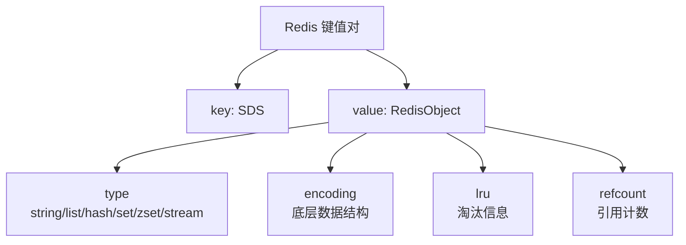

### SDS（Simple Dynamic String）

Redis 没有使用 C 语言的字符串，而是自己实现了 SDS：

```c
// Redis 3.2+ 的 SDS 结构（根据长度选择不同头部）
struct __attribute__((packed)) sdshdr8 {
    uint8_t len;       // 已使用长度
    uint8_t alloc;     // 总分配长度（不含头部和\0）
    unsigned char flags; // 类型标识 sdshdr8
    char buf[];        // 数据缓冲区
};
```

| 特性 | C 字符串 | SDS |
|------|----------|-----|
| 获取长度 | $O(N)$ 遍历 | $O(1)$ 直接读取 len |
| 缓冲区溢出 | 不安全，可能越界 | 安全，自动扩容 |
| 修改内存重分配 | 每次必重分配 | 预分配+惰性释放 |
| 二进制安全 | `\0` 为结束符 | len 标识长度 |

**空间预分配策略**：

$$
\text{新分配空间} = \begin{cases}
\text{len} + 1 & \text{if len} < 1\text{MB} \\
\text{len} + 1\text{MB} & \text{if len} \geq 1\text{MB}
\end{cases}
$$

### ziplist（压缩列表）

紧凑的连续内存结构，节省内存但操作效率低：

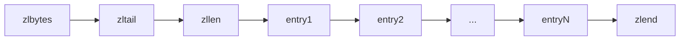

```c
// ziplist entry 结构
struct zlentry {
    unsigned int prevrawlensize;  // 前一节点长度编码大小
    unsigned int prevrawlen;      // 前一节点长度
    unsigned int lensize;         // 当前节点长度编码大小
    unsigned int len;             // 当前节点长度
    unsigned char encoding;       // 编码类型
    unsigned char *p;             // 数据指针
};
```

| 优点 | 缺点 |
|------|------|
| 内存紧凑，无指针开销 | 连锁更新风险 |
| 缓存友好（连续内存） | 插入/删除需移动数据 |
| 小数据量高效 | 查找 $O(N)$ |

> Redis 7.0 使用 listpack 替代 ziplist，解决了连锁更新问题。

### skiplist（跳表）

用于 ZSET 的底层实现，平均 $O(\log N)$ 查找：

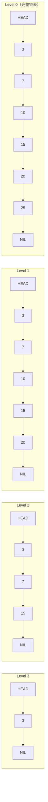

**随机层数算法**：

```c
int zslRandomLevel(void) {
    int level = 1;
    while ((random() & 0xFFFF) < (ZSKIPLIST_P * 0xFFFF))
        level += 1;
    return (level < ZSKIPLIST_MAXLEVEL) ? level : ZSKIPLIST_MAXLEVEL;
}
// ZSKIPLIST_P = 0.25, MAXLEVEL = 32
```

$$
P(\text{level} = k) = (1 - p) \cdot p^{k-1} = 0.75 \times 0.25^{k-1}
$$

| 特性 | 跳表 | 平衡树 |
|------|------|--------|
| 查找 | $O(\log N)$ | $O(\log N)$ |
| 插入 | $O(\log N)$ | $O(\log N)$ |
| 范围查询 | 天然支持（链表遍历） | 需要中序遍历 |
| 实现复杂度 | 简单 | 复杂（旋转） |
| 内存占用 | 多指针 | 较少 |
| 并发友好 | 易加锁 | 旋转影响大 |

### hashtable（哈希表）

Redis 使用链地址法解决哈希冲突，采用渐进式 rehash：

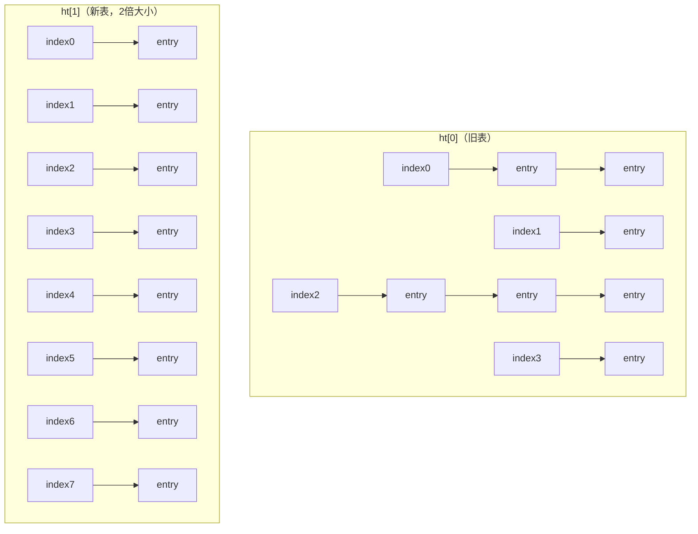

**渐进式 rehash 流程**：

```mermaid
flowchart TD
  A[触发 rehash] --> B[分配 ht[1] 空间<br>大小 = ht[0].used × 2]
  B --> C[设置 rehashidx = 0]
  C --> D{每次 CRUD 操作}
  D --> E[迁移 ht[0].table[rehashidx] 到 ht[1]]
  E --> F[rehashidx++]
  F --> G{ht[0] 迁移完毕?}
  G -->|否| D
  G -->|是| H[释放 ht[0]]
  H --> I[ht[0] = ht[1]]
  I --> J[ht[1] = NULL]
  J --> K[rehashidx = -1]
```

### 数据类型与编码对应

| 类型 | 编码 | 底层结构 | 触发条件 |
|------|------|----------|----------|
| string | int | 整数 | 值为整数且 ≤ LONG_MAX |
| string | embstr | SDS（嵌入式） | 字符串 ≤ 44 字节 |
| string | raw | SDS | 字符串 > 44 字节 |
| list | listpack | listpack | Redis 7.0+ 默认 |
| hash | listpack | listpack | field 数 ≤ 128 且 value ≤ 64 字节 |
| hash | hashtable | 哈希表 | 超出 listpack 限制 |
| set | intset | 整数集合 | 元素为整数且 ≤ 512 个 |
| set | hashtable | 哈希表 | 超出 intset 限制 |
| zset | listpack | listpack | 元素 ≤ 128 且 value ≤ 64 字节 |
| zset | skiplist | 跳表+哈希表 | 超出 listpack 限制 |

---

## 持久化

### RDB（Redis Database）

RDB 是某一时刻的内存快照：

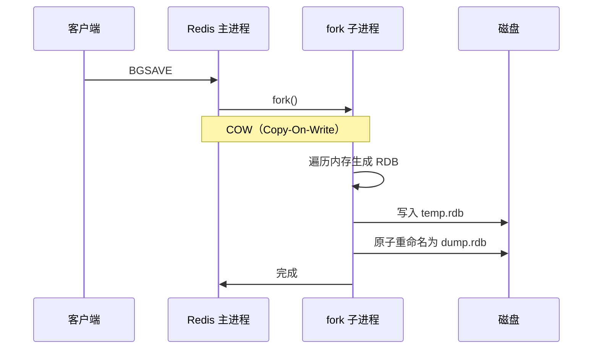

**COW 机制**：

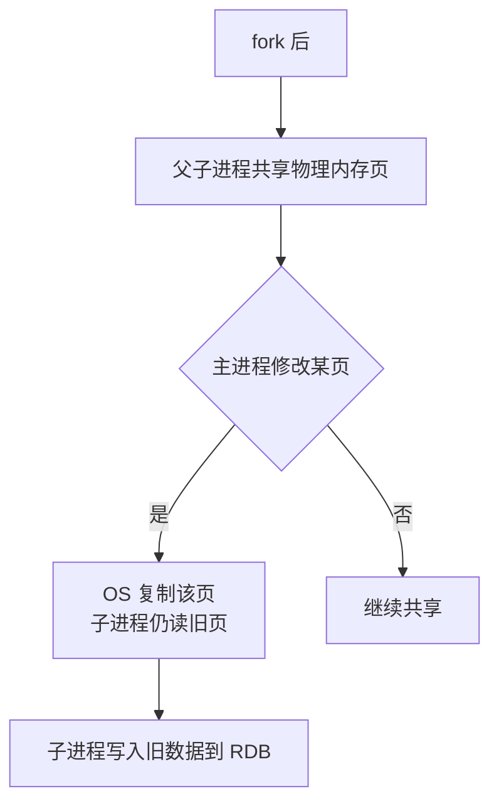

### AOF（Append Only File）

AOF 记录所有写操作命令：

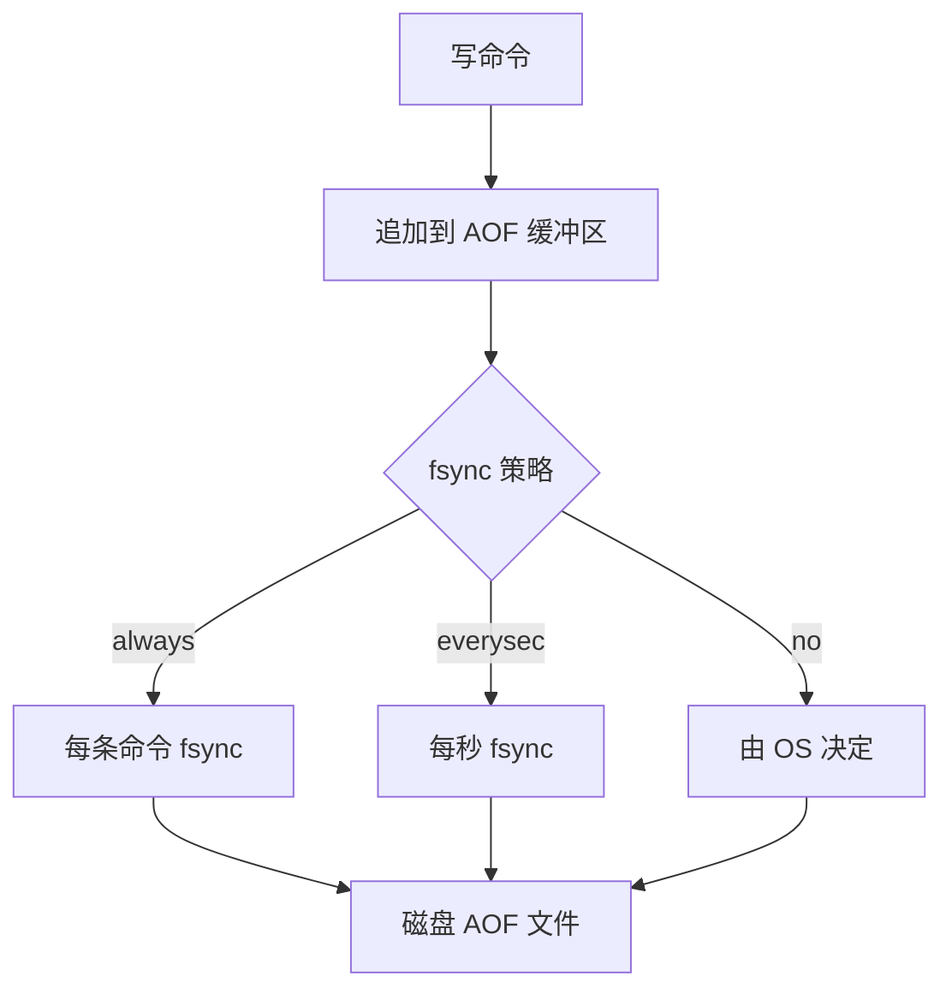

### AOF 重写

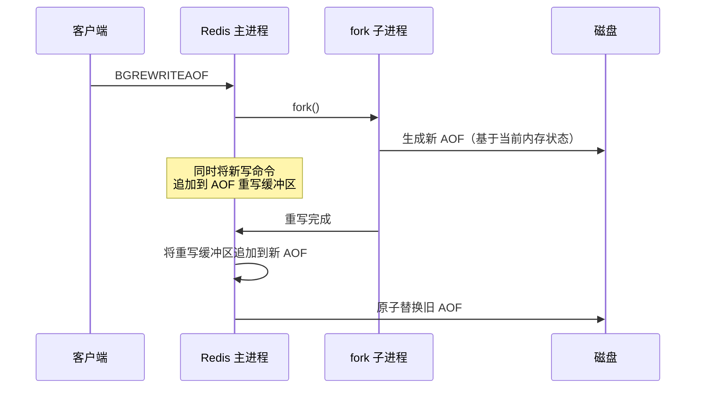

### RDB vs AOF 对比

| 维度 | RDB | AOF |
|------|-----|-----|
| 持久化方式 | 定时快照 | 追加写命令 |
| 数据安全 | 可能丢失两次快照间数据 | 最多丢 1 秒数据 |
| 文件大小 | 紧凑（二进制压缩） | 较大（文本命令） |
| 恢复速度 | 快 | 慢（重放命令） |
| 性能影响 | fork 时可能卡顿 | 写入开销 |
| 适用场景 | 备份/容灾 | 数据安全优先 |

### 混合持久化（Redis 4.0+）

```text
AOF 重写时：
  前 RDB 格式（快，紧凑）+ 后 AOF 格式（增量命令）

AOF 文件结构：
  [RDB 数据][AOF 增量命令]
```

```nginx
# redis.conf
aof-use-rdb-preamble yes
```

---

## 内存淘汰策略

当 Redis 内存达到 `maxmemory` 限制时：

| 策略 | 说明 | 适用场景 |
|------|------|----------|
| noeviction | 拒绝写入 | 数据不能丢失 |
| allkeys-lru | 所有键中淘汰最久未使用 | 通用缓存 |
| allkeys-lfu | 所有键中淘汰最少使用 | 热点数据 |
| allkeys-random | 所有键中随机淘汰 | 无访问热点 |
| volatile-lru | 过期键中淘汰最久未使用 | 混合使用 |
| volatile-lfu | 过期键中淘汰最少使用 | 混合使用 |
| volatile-random | 过期键中随机淘汰 | 混合使用 |
| volatile-ttl | 过期键中淘汰 TTL 最短的 | 业务优先级 |

### LRU 实现

Redis 使用近似 LRU，随机采样 N 个键淘汰最久未使用的：

```c
// 采样数量
#define MAXMEMORY_SAMPLES 5  // 默认采样5个

// 淘汰流程
1. 随机选取 N 个 key
2. 淘汰其中最久未访问的
3. 重复直到内存低于限制
```

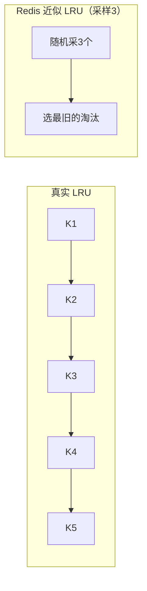

### LFU 实现（Redis 4.0+）

```c
// RedisObject 的 lru 字段（24 bit）
// 高 16 bit: 最后递减时间（分钟级）
// 低 8 bit:  对数计数器

// 计数器递增（基于对数，防止溢出）
uint8_t LFULogIncr(uint8_t counter) {
    if (counter == 255) return 255;
    double r = (double)rand() / RAND_MAX;
    double baseval = counter - LFU_INIT_VAL;
    if (baseval < 0) baseval = 0;
    double p = 1.0 / (baseval * lfu_log_factor + 1);
    if (r < p) counter++;
    return counter;
}
```

$$
P(\text{counter++}) = \frac{1}{\text{counter} \times \text{lfu\_log\_factor} + 1}
$$

---

## 集群方案

### 主从复制

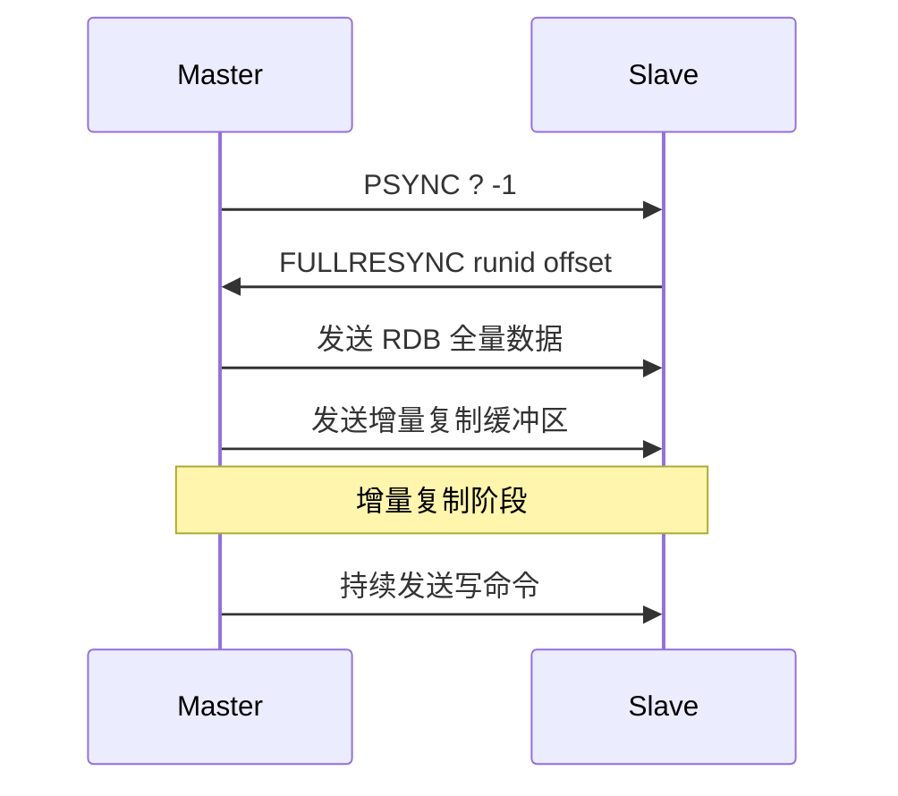

### Sentinel 哨兵

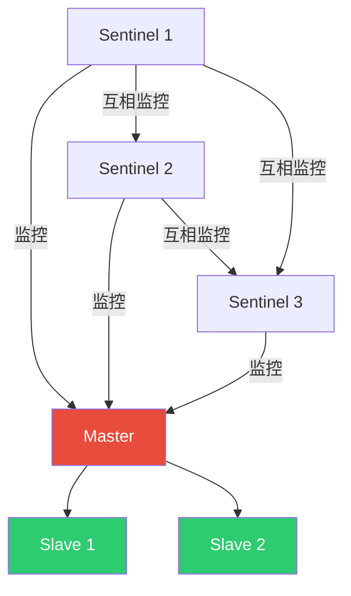

**故障转移流程**：

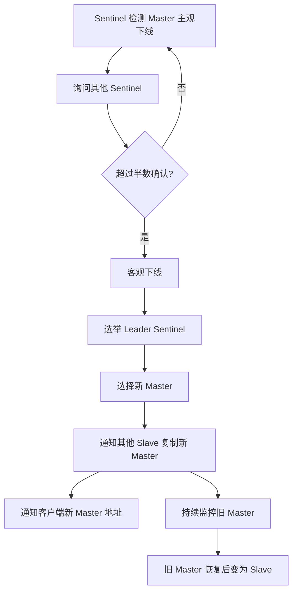

### Redis Cluster

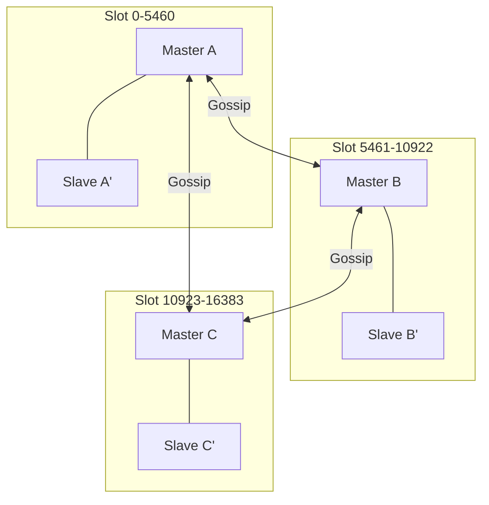

**哈希槽分配**：

$$
\text{slot} = \text{CRC16}(\text{key}) \bmod 16384
$$

| 方案 | 数据分片 | 高可用 | 扩容 | 适用规模 |
|------|----------|--------|------|----------|
| 主从 | 不分片 | 手动切换 | 停服 | 小规模 |
| Sentinel | 不分片 | 自动故障转移 | 停服 | 中规模 |
| Cluster | 16384 槽分片 | 自动故障转移 | 在线 | 大规模 |

---

## 缓存穿透/击穿/雪崩

### 缓存穿透

查询不存在的数据，缓存无法命中，请求直达数据库：

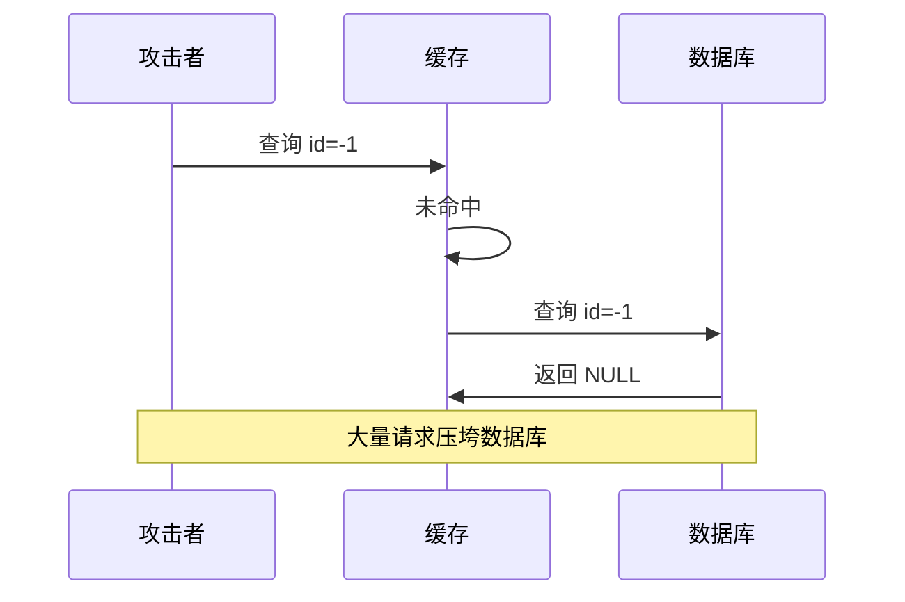

**解决方案**：

```python
# 方案1: 缓存空值
def get_user(user_id):
    data = cache.get(f"user:{user_id}")
    if data is not None:
        if data == "NULL":
            return None  # 缓存的空值
        return data

    data = db.query("SELECT * FROM users WHERE id = %s", user_id)
    if data:
        cache.set(f"user:{user_id}", data, ttl=3600)
    else:
        cache.set(f"user:{user_id}", "NULL", ttl=60)  # 短TTL缓存空值
    return data

# 方案2: 布隆过滤器
def get_user(user_id):
    if not bloom_filter.might_contain(user_id):
        return None  # 一定不存在
    # 正常查询流程...
```

### 缓存击穿

热点 key 过期瞬间，大量请求同时打到数据库：

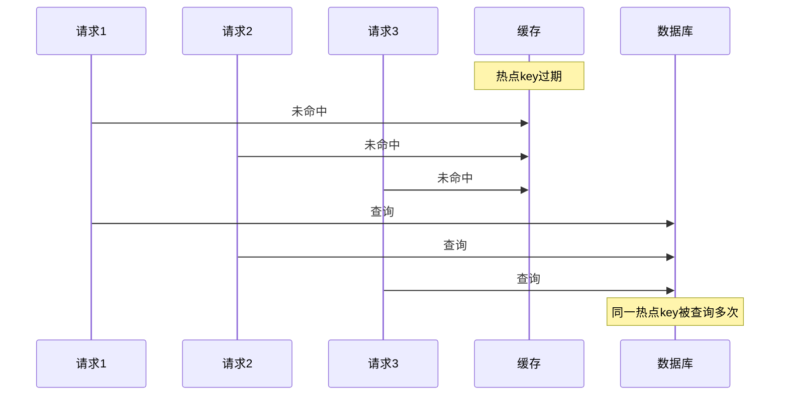

**解决方案**：

```python
# 方案1: 互斥锁
def get_hot_key(key):
    data = cache.get(key)
    if data is not None:
        return data

    # 获取互斥锁
    lock_key = f"lock:{key}"
    if cache.set(lock_key, 1, nx=True, ex=5):  # SETNX
        try:
            data = db.query(key)
            cache.set(key, data, ttl=3600)
            return data
        finally:
            cache.delete(lock_key)
    else:
        time.sleep(0.1)
        return get_hot_key(key)  # 重试

# 方案2: 逻辑过期（不设TTL，数据中包含过期时间）
def get_hot_key_logical(key):
    data = cache.get(key)
    if data and data['expire_time'] > time.time():
        return data['value']

    # 异步更新
    if data:
        threading.Thread(target=async_rebuild, args=(key,)).start()
        return data['value']  # 返回旧数据

    # 首次加载
    return rebuild_cache(key)
```

### 缓存雪崩

大量 key 同时过期，或缓存服务宕机：

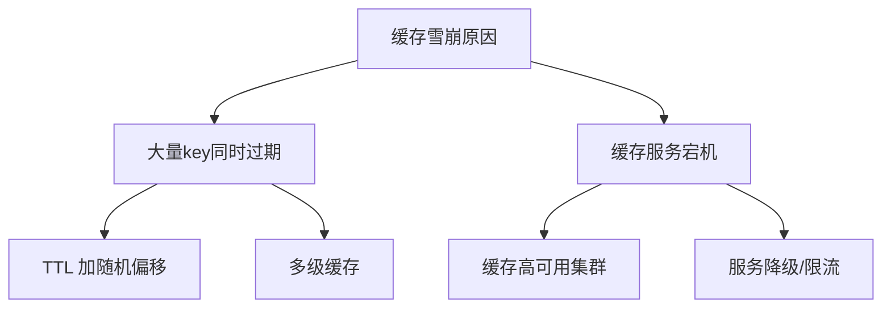

**解决方案**：

```python
# 方案1: TTL 随机偏移
import random

def set_with_jitter(key, value, base_ttl=3600):
    jitter = random.randint(-300, 300)  # ±5分钟随机偏移
    cache.set(key, value, ttl=base_ttl + jitter)

# 方案2: 多级缓存
def get_data(key):
    # L1: 本地缓存
    data = local_cache.get(key)
    if data:
        return data

    # L2: Redis 缓存
    data = redis_cache.get(key)
    if data:
        local_cache.set(key, data, ttl=60)
        return data

    # L3: 数据库
    data = db.query(key)
    if data:
        redis_cache.set(key, data, ttl=3600)
        local_cache.set(key, data, ttl=60)
    return data

# 方案3: 熔断降级
def get_data_with_fallback(key):
    try:
        return cache.get(key)
    except CacheError:
        # 缓存不可用时返回降级数据
        return get_degraded_data(key)
```

### 三者对比

| 问题 | 原因 | 核心方案 |
|------|------|----------|
| 穿透 | 查询不存在的数据 | 布隆过滤器 / 缓存空值 |
| 击穿 | 热点 key 过期 | 互斥锁 / 逻辑过期 |
| 雪崩 | 大量 key 同时过期 | TTL 随机 / 多级缓存 / 高可用 |

---

## 面试 Q&A

**Q1: Redis 为什么用单线程还这么快？**

A: (1) 纯内存操作，纳秒级；(2) I/O 多路复用（epoll），单线程处理大量连接；(3) 避免线程切换和锁竞争开销；(4) 高效的数据结构（SDS、跳表、ziplist）。注意：Redis 6.0 引入多线程 I/O 读写，但命令执行仍是单线程。

**Q2: Redis 的跳表为什么不用红黑树？**

A: (1) 跳表范围查询更高效（链表直接遍历）；(2) 跳表实现更简单，易于理解和维护；(3) 跳表插入只需修改局部指针，并发控制更方便；(4) 跳表通过调整概率参数可灵活平衡时间和空间。ZSET 的核心场景是范围查询，跳表更合适。

**Q3: RDB 和 AOF 怎么选？**

A: 推荐混合持久化（Redis 4.0+ 默认开启）。RDB 恢复快但可能丢数据，AOF 数据安全但恢复慢。混合持久化结合两者优势：AOF 重写时前半部分用 RDB 格式（快且紧凑），后半部分用 AOF 格式（增量安全）。如果只选一个，对数据安全要求高选 AOF，对恢复速度要求高选 RDB。

**Q4: Redis Cluster 的 16384 个槽是怎么来的？**

A: (1) 槽数量需要在节点数和每个节点管理的槽数之间平衡；(2) 16384 个槽意味着每个节点约管理数百到数千个槽；(3) Gossip 协议中节点需要携带自己负责的槽位信息，槽数越多信息越大；(4) 16384 是经验值，在 1000 节点规模下每个节点管理约 16 个槽，Gossip 消息大小合理。

**Q5: 如何保证 Redis 和数据库的数据一致性？**

A: 常见策略：(1) **Cache Aside**：先更新数据库，再删除缓存（推荐）；(2) **延迟双删**：更新数据库→删缓存→延迟→再删缓存；(3) **监听 Binlog**：通过 Canal 等中间件监听 MySQL Binlog 异步更新缓存；(4) 最终一致性方案：消息队列 + 重试机制。强一致性需要分布式锁或直接读数据库。

**Q6: Redis 的 Big Key 问题怎么处理？**

A: Big Key 指单个 key 的 value 过大（如 > 10KB 的字符串、> 5000 元素的集合）。危害：阻塞其他命令、网络传输慢、内存不均匀。处理方案：(1) 拆分：大集合拆为小集合（`hash:{id}:part1`）；(2) 压缩：序列化时压缩；(3) 本地缓存：减少 Redis 读取；(4) 删除时用 `UNLINK` 异步删除；(5) 定期扫描 `redis-cli --bigkeys`。
