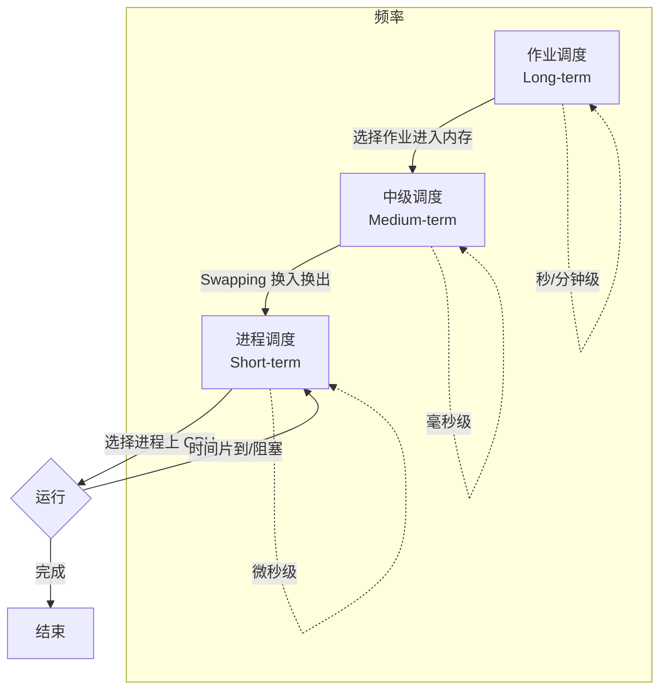
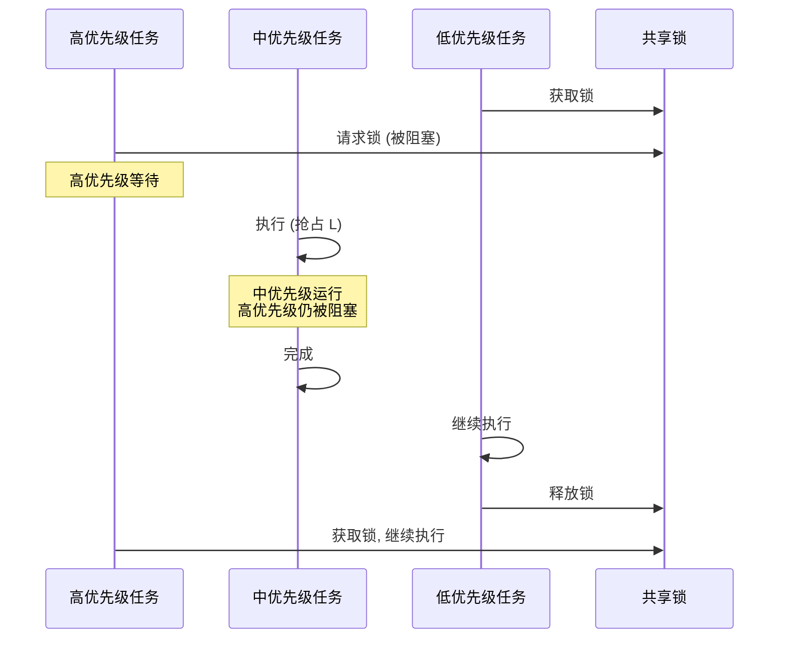
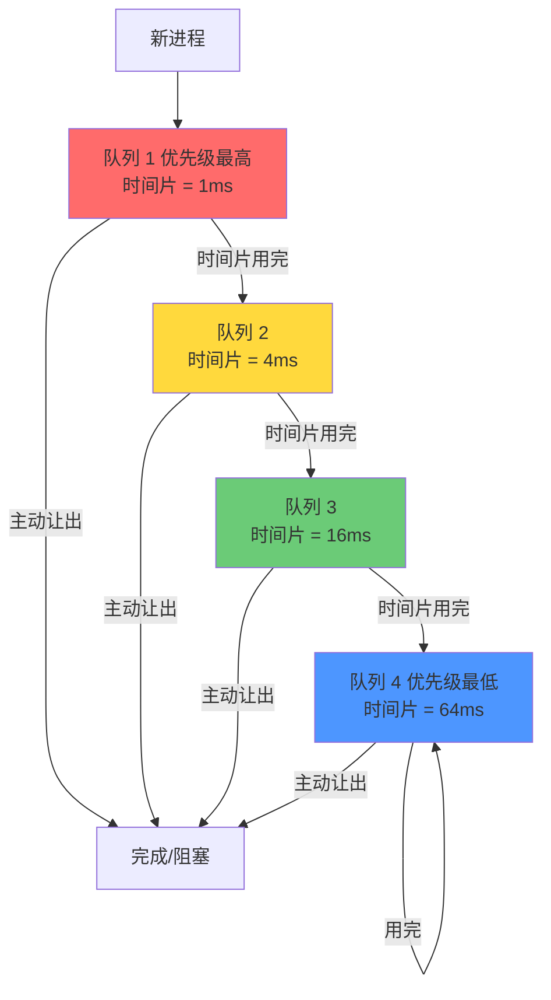
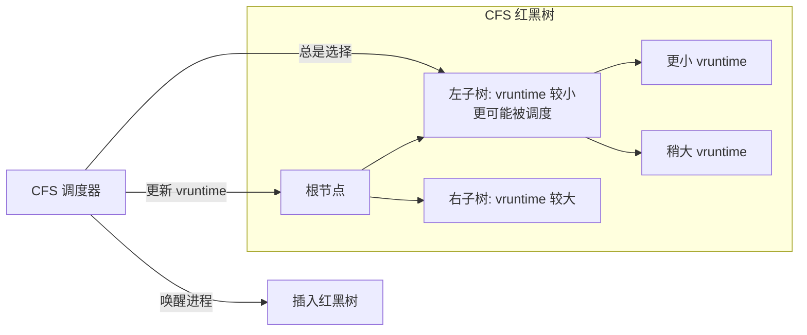
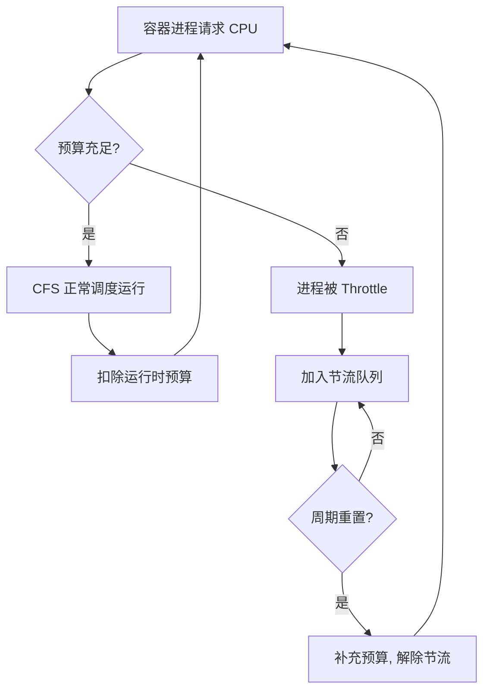

## 引言

进程调度是操作系统最核心的功能之一。当系统中有多个可运行的进程时，调度器决定哪一个进程获得 CPU 的使用权。调度算法的优劣直接影响系统的吞吐量、响应时间和用户体验。本文将从理论到实践，全面解析进程调度的方方面面。

---

## 进程调度的目标

| 指标 | 定义 | 优化方向 |
|------|------|----------|
| **CPU 利用率** | CPU 处于忙碌状态的时间比例 | 最大化 |
| **吞吐量** | 单位时间内完成的进程数 | 最大化 |
| **周转时间** | 进程提交到完成的时间差 | 最小化（批处理场景） |
| **等待时间** | 进程在就绪队列中等待的时间 | 最小化 |
| **响应时间** | 从提交请求到首次产生响应的时间 | 最小化（交互式场景） |
| **公平性** | 各进程获得 CPU 时间的比例 | 均衡分配 |

**关键矛盾**：这些目标往往是冲突的。例如，优化吞吐量可能牺牲响应时间，优化公平性可能降低整体效率。

---

## 调度的层次



本文重点关注**进程调度（Short-term scheduling）**，即决定哪个就绪进程获得 CPU。

---

## 非抢占式调度

### FCFS（先来先服务）

最简单的调度算法。按进程到达顺序执行。

**示例**：

| 进程 | 到达时间 | 执行时间 |
|------|----------|----------|
| P1 | 0 | 24 |
| P2 | 1 | 3 |
| P3 | 2 | 3 |

执行顺序：P1 → P2 → P3

- P1 周转时间 = 24
- P2 周转时间 = 27（等待 24 + 执行 3）
- P3 周转时间 = 30（等待 27 + 执行 3）
- 平均周转时间 = $(24 + 27 + 30) / 3 = 27$

**问题：护航效应（Convoy Effect）**。一个长进程阻塞所有短进程，CPU 利用率低（IO 密集型进程等待 CPU 密集型进程）。

### SJF（最短作业优先）

选择执行时间最短的进程优先执行。

**用上面的例子**：执行顺序 P1 → P2 → P3 或如果都同时到达则 P2/P3 先执行。

当同时到达时：P2(3) → P3(3) → P1(24)
- P2 周转 = 3
- P3 周转 = 6
- P1 周转 = 30
- 平均 = 13

**SJF 是最优的**（对于给定的一组进程，平均等待时间最短）。

**缺点**：需要知道进程的执行时间，实际中只能预测（使用指数加权平均）。

$$\tau_{n+1} = \alpha \cdot t_n + (1 - \alpha) \cdot \tau_n$$

其中 $\tau$ 是预测值，$t$ 是实际值，$\alpha \in [0, 1]$。

---

## 抢占式调度

### SRTF（最短剩余时间优先）

SJF 的抢占式版本。每当新进程到达时，比较其执行时间与当前进程的剩余时间，若新进程更短则抢占。

### RR（轮转调度，Round Robin）

每个进程分配一个**时间片（Time Quantum）**，时间片用完则被抢占并放到队列末尾。

**时间片大小的选择**：

| 时间片 | 优点 | 缺点 |
|--------|------|------|
| 过大 | 减少上下文切换开销 | 退化为 FCFS，响应时间差 |
| 过小 | 响应时间好 | 上下文切换开销占比大 |

**经验值**：通常 10ms ~ 100ms。上下文切换开销约 1μs，时间片 10ms 时开销占比约 0.01%。

```mermaid
gantt
    title RR 调度示例 (时间片 = 4ms)
    dateFormat X
    axisFormat %s
    
    section P1
    P1-1 : 0, 4
    P1-2 : 12, 16
    P1-3 : 24, 28
    P1-4 : 30, 34
    
    section P2
    P2-1 : 4, 8
    P2-2 : 16, 20
    
    section P3
    P3-1 : 8, 12
    P3-2 : 20, 24
    
    section P4
    P4-1 : 28, 30
```



---

## 优先级调度

每个进程分配一个优先级，调度器选择优先级最高的进程执行。

### 优先级反转问题

当低优先级进程持有高优先级进程需要的锁时，高优先级进程被阻塞，而中等优先级进程可能抢占低优先级进程的执行，导致高优先级进程间接被中等优先级进程阻塞。



**解决方案**：
1. **优先级继承**：低优先级进程持有锁时，临时提升到等待锁的最高优先级
2. **优先级天花板**：锁关联一个最高优先级，获取锁时提升到该优先级

---

## 多级反馈队列（MLFQ）

MLFQ 是实践中最常用的通用调度算法之一。

### 核心规则

1. 多个优先级队列，优先级从高到低
2. 新进程进入最高优先级队列
3. 同一队列内使用 RR 调度
4. 用完时间片未完成的进程降级到下一级队列
5. 高优先级队列非空时，不调度低优先级队列



### 问题与优化

| 问题 | 优化 |
|------|------|
| 饥饿：长进程永远无法获得 CPU | 定期将所有进程提升到最高优先级（优先级提升） |
| 用户伪造 IO 操作提升优先级 | 记录真实 IO 行为，仅对真正的 IO 进程提升 |

---

## Linux CFS（完全公平调度器）

CFS 从 Linux 2.6.23 开始取代 O(1) 调度器，成为默认的进程调度器。

### 设计理念

CFS 不使用固定时间片和优先级队列，而是追求**理想的完全公平调度**：

$$每个进程应获得的 CPU 时间 = \frac{总 CPU 时间}{可运行进程数}$$

### 核心数据结构：红黑树

CFS 将所有可运行进程组织在一棵**红黑树**中，以 **vruntime（虚拟运行时间）** 作为排序键。

$$vruntime = actual\_runtime \times \frac{NICE_0_LOAD}{进程权重}$$

- 权重由 nice 值决定（nice 0 = 1024，nice -20 = 88761，nice +19 = 15）
- vruntime 增长慢的进程（权重高/优先级高）更可能被调度



### CFS 调度过程

```c
// Linux 内核: kernel/sched/fair.c (简化版)

static struct task_struct *pick_next_task_fair(struct rq *rq) {
    struct cfs_rq *cfs_rq = &rq->cfs;
    struct sched_entity *se;

    // 从红黑树最左边 (最小 vruntime) 取出
    se = __pick_first_entity(cfs_rq);
    
    // 将该进程从树中移除
    dequeue_entity(cfs_rq, se);
    
    return se->task;
}

static void update_curr(struct cfs_rq *cfs_rq) {
    struct sched_entity *curr = cfs_rq->curr;
    u64 now = rq_clock_task(rq_of(cfs_rq));
    u64 delta_exec = now - curr->exec_start;
    
    // 按权重加权
    curr->vruntime += calc_delta_fair(delta_exec, curr);
    
    // 更新红黑树位置
    update_min_vruntime(cfs_rq);
}
```

### CFS 调度延迟与时间片

CFS 使用**目标延迟（target latency）**的概念：

$$单个进程时间片 = target\_latency \times \frac{进程权重}{总权重}$$

默认 target_latency = 6ms，最小粒度 = 0.75ms。

---

## 实时调度

### EDF（Earliest Deadline First，最早截止期优先）

动态优先级调度：截止期越早，优先级越高。

**理论保证**：如果 $\sum \frac{C_i}{T_i} \leq 1$，则 EDF 可以调度所有任务（其中 $C_i$ 是执行时间，$T_i$ 是周期）。

### RMS（Rate Monotonic Scheduling，单调速率调度）

静态优先级调度：周期越短，优先级越高。

**理论保证**：如果 $\sum \frac{C_i}{T_i} \leq n(2^{1/n} - 1)$，则 RMS 可以调度所有任务。当 $n \to \infty$ 时，上界趋近于 $\ln 2 \approx 0.693$。

| 对比维度 | EDF | RMS |
|----------|-----|-----|
| 优先级类型 | 动态 | 静态 |
| 实现复杂度 | 较高（需要维护截止期） | 较低 |
| 处理器利用率上界 | 100% | ~69.3% |
| 过载行为 | 不可预测 | 可预测（低优先级任务受影响） |
| 工业应用 | 较少 | 较多（如 AUTOSAR） |

---

## Linux 调度器演进

| 调度器 | 内核版本 | 复杂度 | 特点 |
|--------|----------|--------|------|
| **O(N)** | 1.0 ~ 2.4 | $O(N)$ | 遍历所有进程找最优 |
| **O(1)** | 2.5 ~ 2.6.22 | $O(1)$ | 双优先级数组 + 位图 |
| **CFS** | 2.6.23 ~ 至今 | $O(\log N)$ | 红黑树 + vruntime |
| **EEVDF** | 6.6+ (实验性) | $O(\log N)$ | 改进的公平性模型 |

---

## 容器场景下的 CPU 调度

### CFS Bandwidth Control

Docker / Kubernetes 通过 cgroup 的 CFS Bandwidth 控制容器的 CPU 配额：

```bash
# 设置容器每 100ms 最多使用 50ms CPU (即 0.5 核)
echo 50000 > /sys/fs/cgroup/cpu,cpuacct/container/cpu.cfs_quota_us
echo 100000 > /sys/fs/cgroup/cpu,cpuacct/container/cpu.cfs_period_us
```

**实现原理**：cfs_rq（CFS 运行队列）关联一个运行时预算。每当进程运行时扣除相应时间。预算耗尽时，进程被节流（throttled），直到下一个周期开始。



---

## 面试 Q&A

### Q1: FCFS 和 SJF 哪个更好？为什么？

**A:** SJF 的平均等待时间更短（理论上最优）。但 SJF 需要预知执行时间，实际中难以实现。FCFS 简单但存在护航效应，短进程可能被长进程阻塞很久。

### Q2: 为什么 RR 的时间片不能太小？

**A:** 时间片过小会导致频繁的上下文切换。上下文切换需要保存/恢复寄存器、刷新 TLB 等，消耗 CPU 时间。如果时间片 = 1ms，上下文切换 = 1μs，则 0.1% 的 CPU 时间浪费在切换上。如果时间片 = 100μs，浪费达到 1%。

### Q3: Linux 中 nice 值的范围是多少？如何影响调度？

**A:** nice 值范围是 -20 到 +19。nice 值越低，优先级越高。在 CFS 中，nice 值映射为权重：nice 0 = 1024，每降低 1 级权重增加约 25%，每升高 1 级权重减少约 10%。权重越高，vruntime 增长越慢，获得 CPU 时间越多。

### Q4: CFS 如何保证公平性？

**A:** CFS 使用 vruntime 作为公平性的度量。vruntime 是实际运行时间按权重加权后的值。权重高的进程 vruntime 增长慢，在红黑树中更靠左，更先被调度。这样每个进程在长期运行中获得的 CPU 时间比例等于其权重占比。

### Q5: 实时调度 EDF 和 RMS 的主要区别是什么？

**A:** EDF 使用动态优先级（截止期越近优先级越高），理论上可以利用 100% 的 CPU。RMS 使用静态优先级（周期越短优先级越高），理论利用率上限约 69.3%。EDF 实现更复杂，过载行为不可预测；RMS 简单，过载时可预测哪些任务受影响。

### Q6: 什么是上下文切换？涉及哪些操作？

**A:** 上下文切换是从一个进程切换到另一个进程的过程。涉及：
1. 保存当前进程的寄存器状态到 PCB
2. 更新 PCB 状态（running → ready）
3. 选择下一个进程
4. 更新新进程 PCB 状态（ready → running）
5. 恢复新进程的寄存器状态
6. 切换地址空间（可能刷新 TLB）
7. 切换内核栈
整个过程通常需要几微秒。

---

## 总结

进程调度是操作系统性能优化的核心。从经典的 FCFS、SJF、RR 到现代的 CFS，调度算法不断演进以更好地平衡吞吐量、响应时间和公平性。理解调度算法不仅有助于面试，更能帮助工程师在实际工作中理解系统行为、优化容器资源配额、排查性能问题。
