## 概述

事务是数据库保证数据一致性的核心机制，并发控制是高并发场景下保证正确性的关键。理解 ACID、隔离级别、MVCC 和锁机制，是设计可靠数据库应用的基础。

---

## ACID

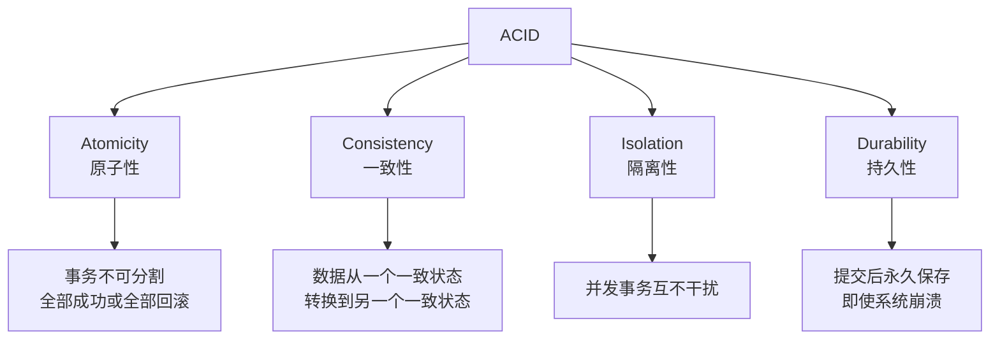

### ACID 实现机制

| 特性 | 实现机制 | InnoDB 实现 |
|------|----------|-------------|
| 原子性 | Undo Log | 回滚段记录数据旧版本 |
| 一致性 | 约束 + 上述三者 | 外键/唯一索引/触发器 |
| 隔离性 | 锁 + MVCC | Next-Key Lock + Read View |
| 持久性 | Redo Log | WAL（Write-Ahead Logging） |

### WAL 机制

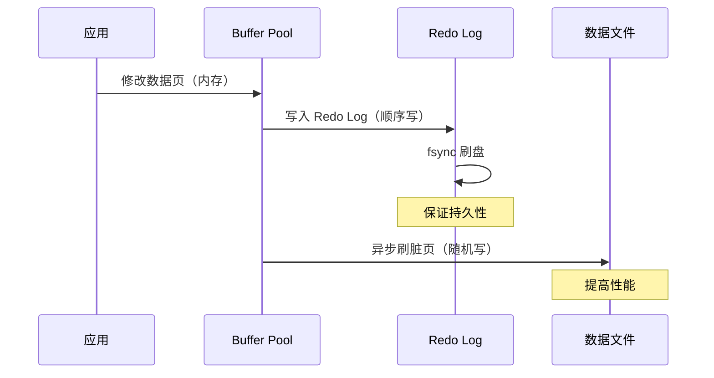

---

## 事务隔离级别

### 并发问题

| 问题 | 说明 | 示例 |
|------|------|------|
| 脏读 | 读到未提交的数据 | A 修改余额后回滚，B 读到了中间值 |
| 不可重复读 | 同事务内两次读结果不同 | A 读余额，B 修改并提交，A 再读变了 |
| 幻读 | 同事务内两次范围查询行数不同 | A 查 age>20，B 插入新行，A 再查多了行 |

### 四个隔离级别

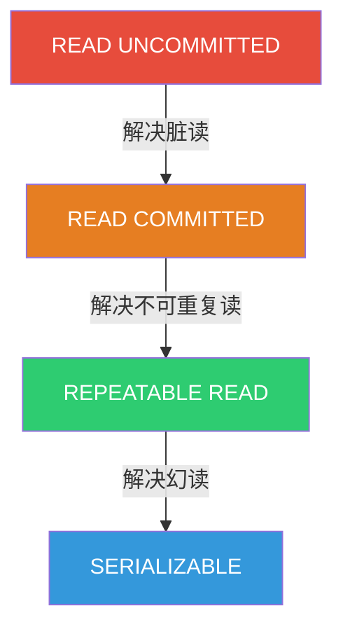

| 隔离级别 | 脏读 | 不可重复读 | 幻读 | 性能 |
|----------|------|-----------|------|------|
| READ UNCOMMITTED | ❌ | ❌ | ❌ | 最高 |
| READ COMMITTED | ✅ | ❌ | ❌ | 高 |
| REPEATABLE READ | ✅ | ✅ | ❌* | 中 |
| SERIALIZABLE | ✅ | ✅ | ✅ | 最低 |

> *InnoDB 的 REPEATABLE READ 通过 Next-Key Lock 在很大程度上解决了幻读。

### 各数据库默认隔离级别

| 数据库 | 默认隔离级别 |
|--------|-------------|
| MySQL (InnoDB) | REPEATABLE READ |
| PostgreSQL | READ COMMITTED |
| Oracle | READ COMMITTED |
| SQL Server | READ COMMITTED |
| SQLite | SERIALIZABLE |

---

## MVCC 原理

### 核心概念

MVCC（Multi-Version Concurrency Control）通过保存数据的多个版本，实现读不阻塞写、写不阻塞读。

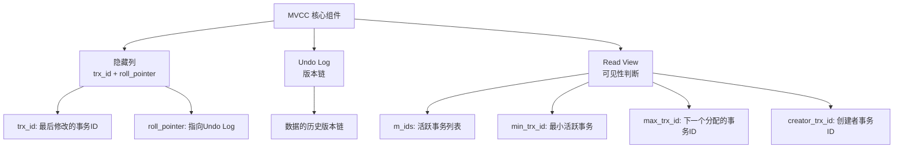

### 版本链

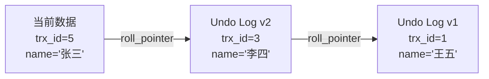

### Read View 可见性判断

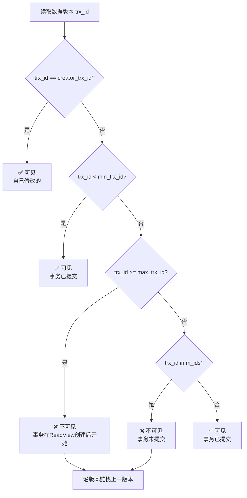

### RC vs RR 的 Read View 差异

| 隔离级别 | Read View 生成时机 | 效果 |
|----------|-------------------|------|
| READ COMMITTED | 每次 SELECT 生成新的 | 能看到其他已提交事务的修改 |
| REPEATABLE READ | 事务首次 SELECT 生成 | 整个事务期间看到的数据快照一致 |

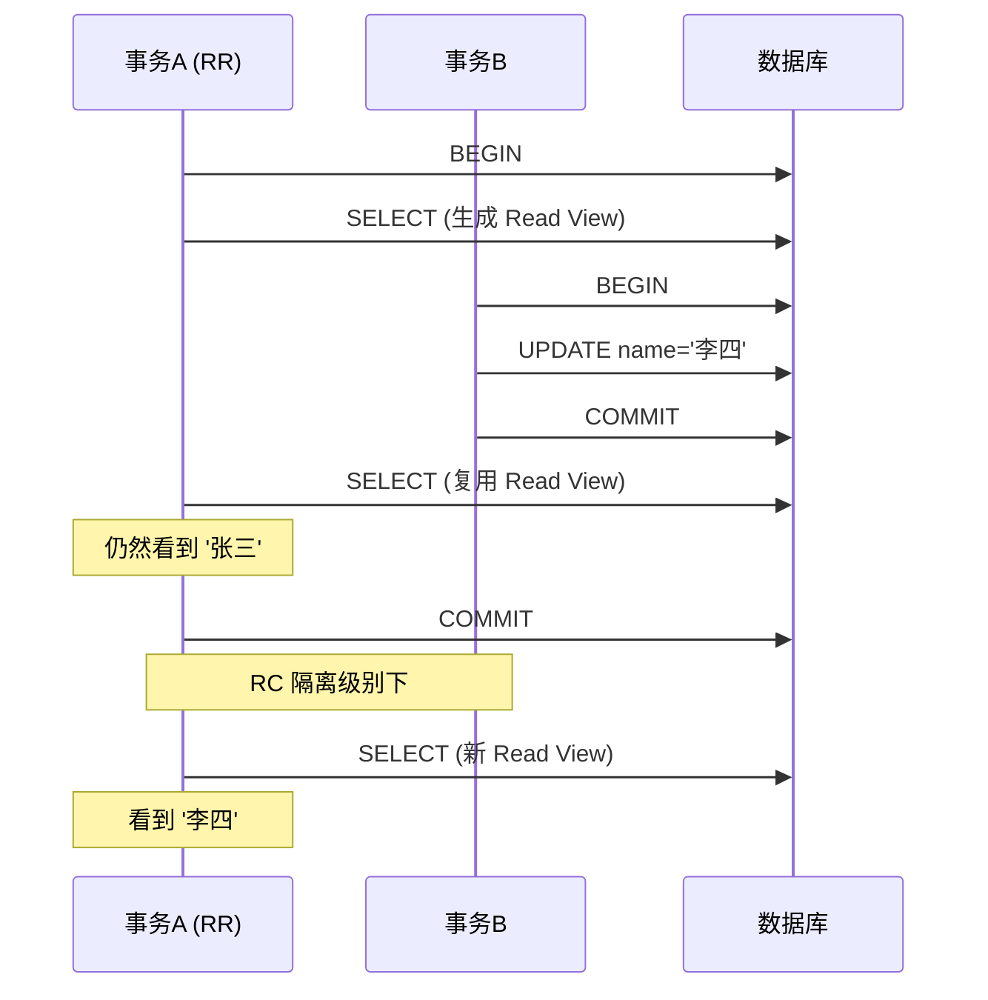

---

## 锁机制

### InnoDB 锁类型

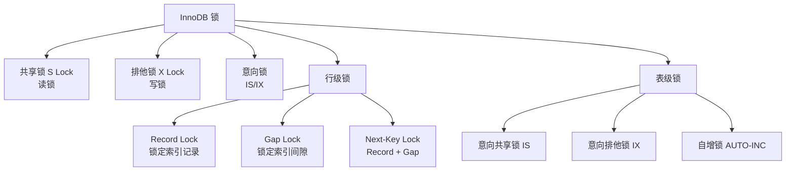

### 锁兼容性矩阵

|  | S 锁 | X 锁 | IS 锁 | IX 锁 |
|--|------|------|-------|-------|
| S 锁 | ✅ | ❌ | ✅ | ❌ |
| X 锁 | ❌ | ❌ | ❌ | ❌ |
| IS 锁 | ✅ | ❌ | ✅ | ✅ |
| IX 锁 | ❌ | ❌ | ✅ | ✅ |

### Next-Key Lock 详解

Next-Key Lock = Gap Lock + Record Lock，是 InnoDB 在 RR 级别下防止幻读的关键：

```sql
-- 表: users (id PRIMARY KEY, age INDEX)
-- 数据: id=1(age=20), id=5(age=25), id=10(age=30)

-- 事务A
SELECT * FROM users WHERE age = 25 FOR UPDATE;

-- 锁定范围：
-- Gap Lock: (20, 25)  -- 防止插入 age=21~24
-- Record Lock: age=25  -- 锁定该行
-- Gap Lock: (25, 30)  -- 防止插入 age=26~29
-- 即 Next-Key Lock: (20, 30)
```


### 锁查看

```sql
-- MySQL 8.0+
SELECT * FROM performance_schema.data_locks;
SELECT * FROM performance_schema.data_lock_waits;

-- 查看当前锁等待
SELECT * FROM sys.innodb_lock_waits;

-- 查看死锁
SHOW ENGINE INNODB STATUS;
```

---

## 死锁检测

### 死锁场景

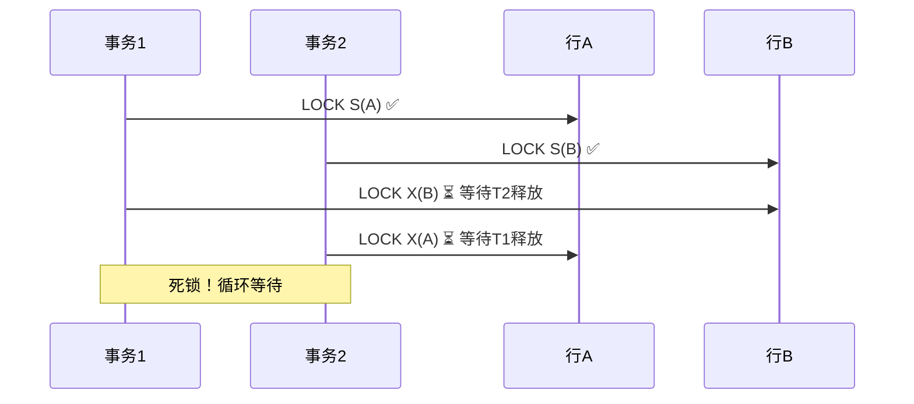

### InnoDB 死锁检测

InnoDB 自动检测死锁并回滚代价最小的事务：

```sql
-- 查看死锁日志
SHOW ENGINE INNODB STATUS;

-- 死锁日志示例
-- LATEST DETECTED DEADLOCK
-- Transaction 1: waiting for lock
-- Transaction 2: holds lock, also waiting
-- WE ROLL BACK TRANSACTION 2 (cost less)
```

### 死锁预防策略

| 策略 | 说明 |
|------|------|
| 固定加锁顺序 | 所有事务按相同顺序访问表和行 |
| 短事务 | 减少持锁时间 |
| 低隔离级别 | RC 级别不使用 Gap Lock |
| 添加索引 | 避免锁升级为表锁 |
| 超时机制 | `innodb_lock_wait_timeout` 自动放弃 |
| 乐观锁 | 使用版本号代替行锁 |

### 乐观锁 vs 悲观锁

```sql
-- 悲观锁：先加锁再操作
SELECT * FROM accounts WHERE id = 1 FOR UPDATE;
UPDATE accounts SET balance = balance - 100 WHERE id = 1;
COMMIT;

-- 乐观锁：检测冲突
UPDATE accounts
SET balance = balance - 100, version = version + 1
WHERE id = 1 AND version = 5;

-- 检查影响行数
-- 0 行受影响 → 冲突，重试
-- 1 行受影响 → 成功
```

| 维度 | 悲观锁 | 乐观锁 |
|------|--------|--------|
| 原理 | 先加锁再操作 | 先操作再检测冲突 |
| 实现方式 | SELECT FOR UPDATE | 版本号/CAS |
| 冲突处理 | 等待锁释放 | 重试或报错 |
| 适用场景 | 写多读少 | 读多写少 |
| 性能 | 高冲突时稳定 | 低冲突时高效 |

---

## 2PC / 3PC

### 2PC（Two-Phase Commit）

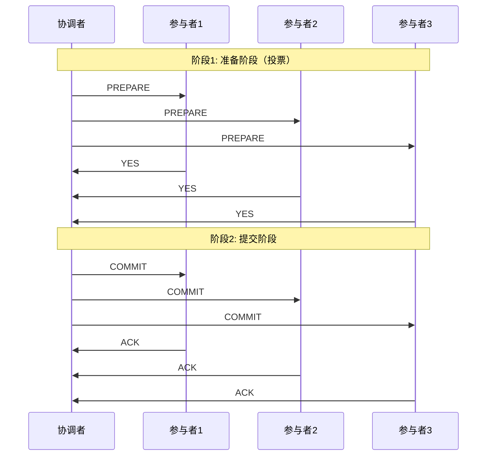

### 2PC 的问题

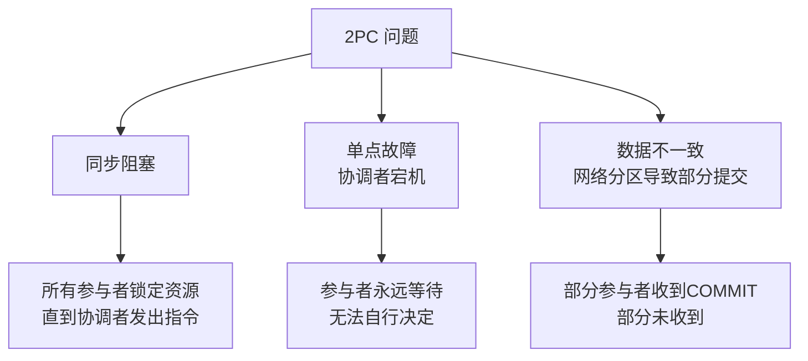

### 3PC（Three-Phase Commit）

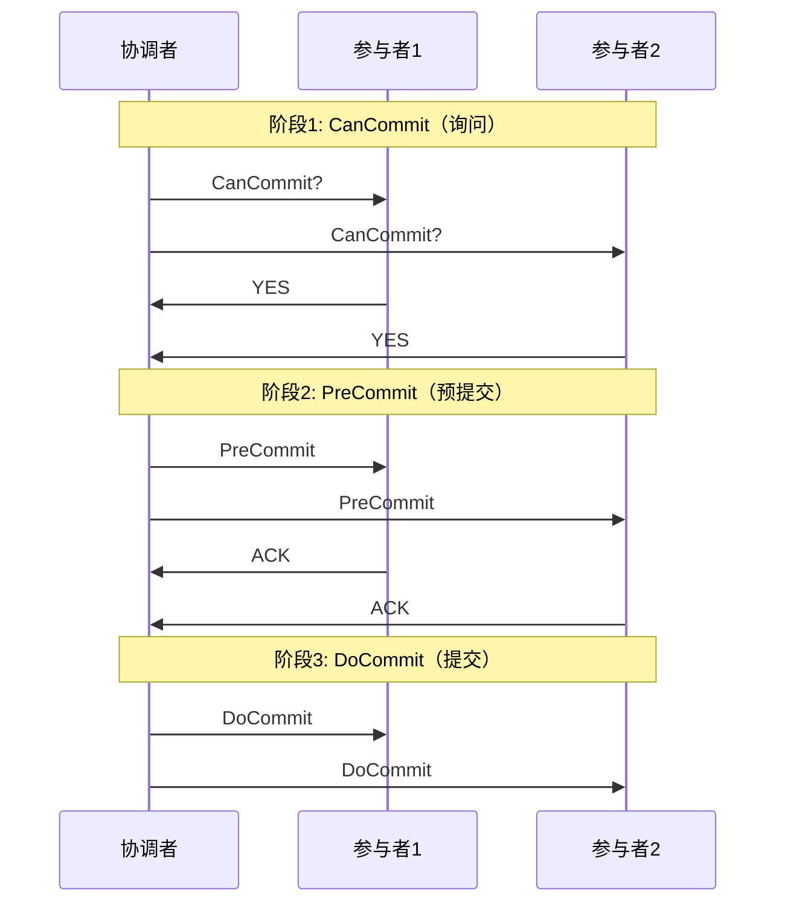

### 2PC vs 3PC 对比

| 维度 | 2PC | 3PC |
|------|-----|-----|
| 阶段数 | 2 | 3 |
| 阻塞问题 | 严重 | 缓解（超时机制） |
| 数据不一致 | 可能 | 仍可能 |
| 复杂度 | 低 | 高 |
| 实际使用 | XA 协议 | 极少使用 |

### 分布式事务实际方案

| 方案 | 原理 | 适用场景 |
|------|------|----------|
| XA 2PC | 强一致性 | 传统数据库 |
| TCC | Try-Confirm-Cancel | 金融场景 |
| Saga | 长事务拆分+补偿 | 业务流程 |
| 本地消息表 | 异步最终一致 | 微服务 |
| 事务消息 | RocketMQ 半消息 | 异步场景 |

---

## 工程实践

### 事务最佳实践

```sql
-- 1. 事务尽量短
-- ❌ 包含远程调用
BEGIN;
UPDATE accounts SET balance = balance - 100 WHERE id = 1;
-- 远程调用（不可控延迟）
CALL remote_service();
UPDATE accounts SET balance = balance + 100 WHERE id = 2;
COMMIT;

-- ✅ 先完成远程调用，再执行事务
CALL remote_service();
BEGIN;
UPDATE accounts SET balance = balance - 100 WHERE id = 1;
UPDATE accounts SET balance = balance + 100 WHERE id = 2;
COMMIT;

-- 2. 避免大事务
-- ❌ 批量更新100万行
BEGIN;
UPDATE orders SET status = 'expired' WHERE created_at < '2025-01-01';
COMMIT;

-- ✅ 分批提交
BEGIN;
UPDATE orders SET status = 'expired' WHERE created_at < '2025-01-01' LIMIT 1000;
COMMIT;
-- 循环执行直到影响行数为0

-- 3. 合理设置隔离级别
-- 大多数场景 RC 即可
SET SESSION TRANSACTION ISOLATION LEVEL READ COMMITTED;
```

### InnoDB 关键参数

```sql
-- 锁等待超时（秒）
SET innodb_lock_wait_timeout = 5;

-- 死锁检测
SET innodb_deadlock_detect = ON;

-- Redo Log 刷盘策略
-- 0: 每秒刷  1: 每次提交刷  2: 提交时写OS缓存
SET innodb_flush_log_at_trx_commit = 1;

-- Binlog 刷盘策略
-- 0: 依赖OS  1: 每次提交刷  N: 每N次提交刷
SET sync_binlog = 1;
```

---

## 面试 Q&A

**Q1: InnoDB 的 RR 级别是否完全解决了幻读？**

A: 并非完全解决。在快照读（普通 SELECT）下通过 MVCC 解决；在当前读（SELECT FOR UPDATE/LOCK IN SHARE MODE）下通过 Next-Key Lock 解决。但存在特例：事务先快照读再当前读时，当前读可能看到其他事务新插入的行，产生"幻读"现象。这是因为当前读总是读取最新已提交数据。

**Q2: MVCC 能否替代锁？**

A: 不能。MVCC 解决的是读-写冲突，让读不阻塞写、写不阻塞读。但写-写冲突（两个事务同时修改同一行）仍然需要锁来解决。MVCC 和锁是互补的：MVCC 处理读并发，锁处理写并发。

**Q3: 为什么 MySQL 默认使用 RR 而不是 RC？**

A: 历史原因和主从复制。MySQL 基于 Statement 格式的 Binlog 复制要求 RR 级别，否则主从数据可能不一致。但现代实践推荐使用 Row 格式 Binlog + RC 隔离级别，因为 RC 下 Gap Lock 更少，并发性能更好，死锁概率更低。

**Q4: Gap Lock 有什么风险？**

A: Gap Lock 锁定索引间隙但不锁定记录本身，阻止其他事务在间隙中插入。风险包括：(1) 增大死锁概率；(2) 在 RC 级别下不生效，降级可能导致并发问题；(3) 无索引时退化为表锁（锁住所有间隙）。建议：RC 级别 + 合理索引 + 避免无索引的 UPDATE/DELETE。

**Q5: 2PC 的协调者宕机怎么办？**

A: (1) 协调者日志持久化，重启后恢复状态；(2) 引入协调者集群（如 ZooKeeper 选主）；(3) 参与者超时后自动回滚（3PC 的改进）；(4) 实际工程中更多使用 Saga/TCC 等柔性事务方案，避免 2PC 的阻塞问题。

**Q6: 如何排查线上死锁？**

A: (1) `SHOW ENGINE INNODB STATUS` 查看最近死锁信息；(2) 开启死锁日志 `innodb_print_all_deadlocks = ON`；(3) 分析死锁日志中两个事务持有的锁和等待的锁；(4) 检查是否缺少索引导致锁升级；(5) 检查事务中 SQL 的加锁顺序是否一致；(6) 考虑降低隔离级别或使用乐观锁。
