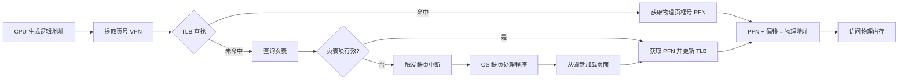
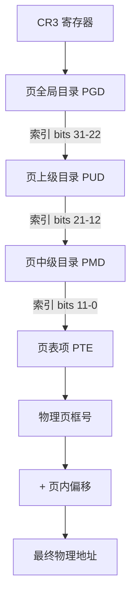
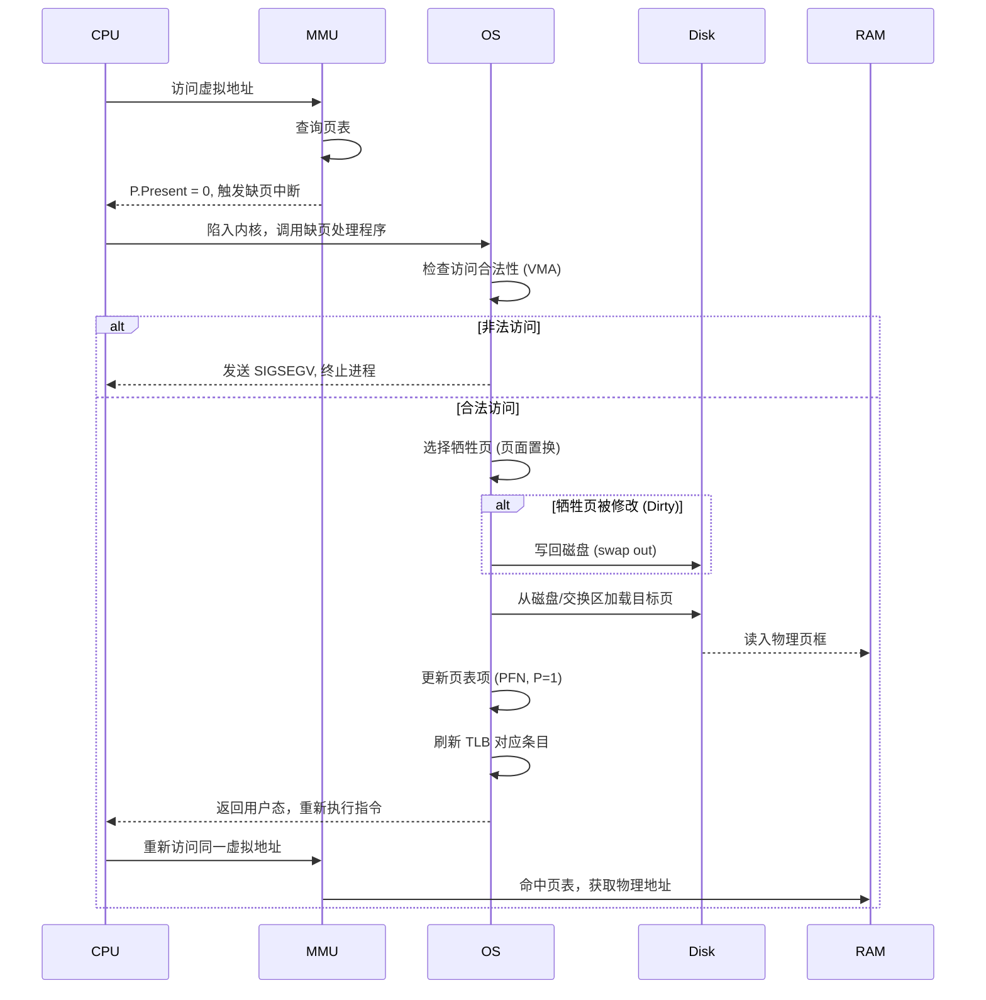
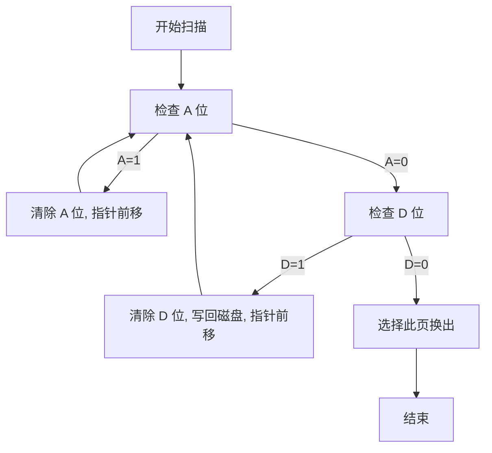

## 引言

虚拟内存是现代操作系统最核心的抽象之一。它让每个进程都认为自己独占了一整块连续的内存空间，而实际上物理内存被多个进程共享，部分数据甚至可能存储在磁盘上。本文将从工程视角深入剖析虚拟内存与分页机制的每一个细节。

---

## 为什么需要虚拟内存

虚拟内存解决了三个根本性问题：

### 1. 进程隔离

没有虚拟内存的情况下，进程直接访问物理地址，一个进程的 Bug 可能覆盖另一个进程的数据。虚拟内存通过地址空间隔离，确保每个进程只能访问自己的页表映射的区域。

### 2. 简化编程模型

程序员不需要关心物理内存的布局、碎片化、可用空间等复杂问题。编译器生成的代码使用连续的虚拟地址，操作系统负责将其映射到分散的物理页框。

### 3. 物理内存抽象

虚拟内存允许：
- **超卖内存**：所有进程的虚拟内存总和可以超过物理内存总量
- **按需加载**：只将实际使用的页面加载到物理内存
- **内存映射文件**：将文件内容映射到虚拟地址空间，实现高效的文件 IO

---

## 逻辑地址到物理地址的转换

### 地址结构

在分页系统中，一个逻辑地址被分为两部分：

```
|---- 页号 (VPN) ----|---- 页内偏移 ----|
       n 位               m 位
```

- **页号 (Virtual Page Number, VPN)**：用于索引页表
- **页内偏移 (Offset)**：直接传递到物理地址，不需要转换



### 转换公式

$$物理地址 = PFN \times 页大小 + 页内偏移$$

其中 $PFN$ 是物理页框号（Page Frame Number），从页表项（PTE）中获取。

---

## 分页机制详解

### 核心概念

| 概念 | 说明 |
|------|------|
| **页 (Page)** | 虚拟地址空间的固定大小块，通常为 4KB |
| **页框 (Page Frame)** | 物理内存的固定大小块，与页大小相同 |
| **页表 (Page Table)** | VPN → PFN 的映射表，每个进程一个 |
| **页表项 (PTE)** | 页表中的一条记录，包含 PFN 和标志位 |

### 页表项 (PTE) 的结构

典型的 4KB 页对应的 PTE 结构（32 位系统）：

```
|--- PFN (20 位) ---| D | A | R/W | U/S | P |
```

| 标志位 | 含义 |
|--------|------|
| **P (Present)** | 页面是否在物理内存中 |
| **U/S (User/Supervisor)** | 用户态/内核态访问权限 |
| **R/W (Read/Write)** | 读写权限 |
| **A (Accessed)** | 页面是否被访问过（用于置换算法） |
| **D (Dirty)** | 页面是否被修改过（写回磁盘时使用） |

---

## 多级页表

### 为什么需要多级页表

单级页表的问题：一个 32 位系统，4KB 页面，需要 $2^{20}$ 个页表项，每个 4 字节 = 4MB。而且每个进程都需要一个完整的页表，即使它只使用很少的内存。

**多级页表的解决方案**：只分配实际使用的页表，未使用的部分不需要分配内存。



### Linux 的四级/五级页表架构

**x86_64 四级页表**：

| 层级 | 名称 | 索引位 |
|------|------|--------|
| L4 | Page Global Directory (PGD) | bits 39-48 |
| L3 | Page Upper Directory (PUD) | bits 30-38 |
| L2 | Page Middle Directory (PMD) | bits 21-29 |
| L1 | Page Table (PT) | bits 12-20 |
| - | Offset | bits 0-11 |

**五级页表**（Intel 推出，支持 5 级页表，可寻址 128PB）：在 PGD 之上增加了 P4D 层，用于支持更大的地址空间。

### 代码示例：Linux 页表遍历

```c
#include <linux/mm.h>
#include <linux/sched.h>

void walk_page_table(struct mm_struct *mm, unsigned long addr) {
    pgd_t *pgd;
    p4d_t *p4d;
    pud_t *pud;
    pmd_t *pmd;
    pte_t *pte;

    pgd = pgd_offset(mm, addr);
    if (pgd_none(*pgd) || pgd_bad(*pgd)) goto out;

    p4d = p4d_offset(pgd, addr);
    if (p4d_none(*p4d) || p4d_bad(*p4d)) goto out;

    pud = pud_offset(p4d, addr);
    if (pud_none(*pud) || pud_bad(*pud)) goto out;

    pmd = pmd_offset(pud, addr);
    if (pmd_none(*pmd) || pmd_bad(*pmd)) goto out;

    pte = pte_offset_kernel(pmd, addr);
    if (pte_present(*pte)) {
        unsigned long pfn = pte_pfn(*pte);
        printk(KERN_INFO "Physical PFN: %lu\n", pfn);
    }

out:
    return;
}
```

---

## TLB（Translation Lookaside Buffer）

### TLB 的作用

TLB 是 MMU（内存管理单元）中的缓存，用于缓存最近使用的页表项。如果没有 TLB，每次内存访问都需要先访问页表（可能在内存中），导致**两次内存访问**才能获取数据。

### TLB 命中率与性能

典型 TLB 命中率在 98% ~ 99.5% 之间。

$$平均访问时间 = Hit\_Time + Miss\_Rate \times Miss\_Penalty$$

假设：
- TLB 访问时间 = 1 个周期
- 内存访问 = 100 个周期
- TLB 命中率 = 99%

$$EAT = 1 + 0.01 \times 100 = 2 个周期$$

如果没有 TLB：$EAT = 100 + 100 = 200$ 个周期（差 100 倍）

### TLB 的结构

| 字段 | 说明 |
|------|------|
| VPN (Virtual Page Number) | 标签，用于匹配 |
| PFN (Page Frame Number) | 翻译结果 |
| ASID (Address Space ID) | 区分不同进程，避免 TLB 刷新 |
| 权限位 | R/W, U/S 等 |

---

## 缺页中断（Page Fault）

### 处理流程



### 缺页中断的类型

| 类型 | 说明 |
|------|------|
| **Minor Fault** | 页面在物理内存中（如共享库、匿名页），只需更新页表 |
| **Major Fault** | 页面不在物理内存中，需要从磁盘加载 |
| **Invalid Fault** | 非法访问（如访问未映射区域），触发段错误 |

---

## 页面置换算法

当物理内存不足时，OS 需要选择一个页面换出到磁盘。

### 算法对比

| 算法 | 原理 | 优点 | 缺点 |
|------|------|------|------|
| **FIFO** | 替换最早进入内存的页面 | 实现简单 | 可能替换常用页，出现 Belady 异常 |
| **OPT** | 替换最久以后才会被访问的页面 | 理论最优 | 需要未来信息，无法实现（用作基准） |
| **LRU** | 替换最近最少使用的页面 | 接近 OPT | 需要硬件支持或开销较大 |
| **Clock** | 近似 LRU，使用 A/D 位环形扫描 | 实现简单，效果好 | 极端情况下扫描时间长 |

### Clock 算法（Linux 近似 LRU）



### 代码示例：LRU 页面置换模拟

```python
from collections import OrderedDict

class LRUCache:
    def __init__(self, capacity: int):
        self.cache = OrderedDict()
        self.capacity = capacity
        self.page_faults = 0

    def access_page(self, page: int):
        if page in self.cache:
            # 命中：移到末尾表示最近使用
            self.cache.move_to_end(page)
            return True
        else:
            # 缺页
            self.page_faults += 1
            if len(self.cache) >= self.capacity:
                # 移除最久未使用的页面
                evicted = self.cache.popitem(last=False)
                print(f"Evict page {evicted[0]}")
            self.cache[page] = True
            return False

# 测试: 引用串 7,0,1,2,0,3,0,4,2,3,0,3,2,1,2, 容量 3
pages = [7, 0, 1, 2, 0, 3, 0, 4, 2, 3, 0, 3, 2, 1, 2]
lru = LRUCache(capacity=3)
for p in pages:
    lru.access_page(p)
print(f"Total page faults: {lru.page_faults}")  # 输出: 10
```

---

## 写时复制（Copy-On-Write, COW）

### 原理

`fork()` 创建子进程时，传统做法是复制父进程的所有内存页。COW 技术让父子进程**共享**所有页面，并将页表项标记为**只读**。只有当某一进程尝试写入时，才触发缺页中断，为该进程分配新的物理页并复制数据。

### 优势

- `fork()` 后立即 `exec()` 的场景（如 shell），避免了大量无意义的复制
- 大幅降低 `fork()` 的时间复杂度和内存占用

### COW 流程


---

## Linux 内存管理

### 伙伴系统（Buddy System）

伙伴系统管理**物理页框**的分配，解决外部碎片问题。

**核心思想**：将空闲页框按 2 的幂次分组（order 0 = 1 页，order 1 = 2 页，...，order 10 = 1024 页）。分配时从最小的能满足需求的 order 中取；释放时检查相邻的"伙伴"是否空闲，若空闲则合并到更大的 order。

```c
// Linux 内核: include/linux/mmzone.h
#define MAX_ORDER 11  // 最大分配 2^(MAX_ORDER-1) = 1024 页

struct free_area {
    struct list_head    free_list[MIGRATE_TYPES];
    unsigned long       nr_free;
};
```

### Slab 分配器

对于小于 1 页的小对象（如 `task_struct`、`inode`），伙伴系统太粗粒度。Slab 分配器在伙伴系统之上提供**对象级别**的分配。

| 特性 | 伙伴系统 | Slab 分配器 |
|------|----------|-------------|
| 管理对象 | 物理页框（4KB+） | 内核对象（几字节 ~ 几 KB） |
| 碎片问题 | 通过伙伴合并解决 | 预分配固定大小缓存 |
| 典型用途 | 大内存分配、DMA | 频繁分配的小对象 |

```bash
# 查看内核 slab 缓存使用情况
cat /proc/slabinfo

# 输出示例:
# name            <active_objs> <num_objs> <objsize> <objperslab> <pagesperslab>
# task_struct          1234       1280       5632       7          32
# inode_cache          5678       5888        624      13          32
```

---

## 面试 Q&A

### Q1: 虚拟地址空间 4GB，页面大小 4KB，单级页表需要多大内存？

**A:** $4GB / 4KB = 2^{20} = 1,048,576$ 个页表项。每个 PTE 4 字节，总大小 = $1M \times 4B = 4MB$。每个进程都需要独立的页表，100 个进程 = 400MB，即使进程只使用很少内存。

### Q2: 什么是 Belady 异常？哪些算法会出现？

**A:** Belady 异常是指：增加物理页框数，缺页次数反而增加。FIFO 算法会出现此异常。LRU 和 OPT 不会。原因是 FIFO 没有利用局部性原理，增加页框可能保留更多"无用"的旧页面。

### Q3: TLB 未命中一定是缺页中断吗？

**A:** 不是。TLB 未命中有三种情况：
1. **软未命中**：页表项有效，只是不在 TLB 中。只需查页表并填充 TLB。
2. **缺页中断**：页表项 P=0，页面不在物理内存中，需要从磁盘加载。
3. **非法访问**：页面未映射或权限不足，触发段错误。

### Q4: 为什么 Linux 使用近似 LRU（Clock）而不是精确 LRU？

**A:** 精确 LRU 需要维护一个完整的访问顺序链表，每次访问都要更新链表位置（$O(N)$ 或使用哈希链表优化但仍有开销）。Clock 算法只需利用 PTE 中的 A（Accessed）位，硬件自动设置，软件只需扫描和清除，开销极小。

### Q5: 大页面（Huge Page）解决了什么问题？

**A:** 4KB 页面在 TLB 条目有限的情况下（如 64 条目），只能覆盖 $64 \times 4KB = 256KB$ 的地址空间。对于内存密集型应用（如数据库），TLB 命中率很低。使用 2MB 或 1GB 大页面，同样的 64 条目可以覆盖 $64 \times 2MB = 128MB$，大幅减少 TLB 未命中。

### Q6: swap 分区和 swap 文件有什么区别？

**A:** 功能相同，都是将不活跃的页面换出到磁盘。swap 分区是独立的磁盘分区，性能略好（连续空间，无文件系统开销）。swap 文件存在于文件系统中，更灵活（可以动态创建/删除）。现代 Linux 中两者性能差异已经很小。

---

## 总结

虚拟内存是操作系统最重要的抽象之一。分页机制、多级页表、TLB、缺页中断、页面置换和 COW 等技术协同工作，实现了高效的内存管理。理解这些机制不仅有助于通过面试，更能帮助工程师在实际工作中排查内存相关的问题（如 OOM、内存泄漏、性能瓶颈等）。
