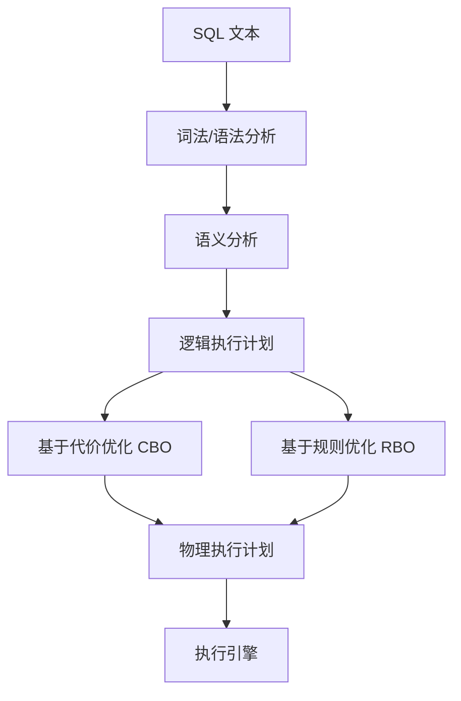
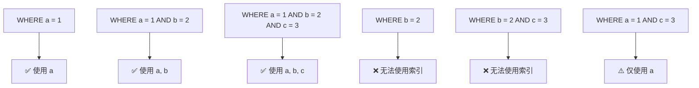
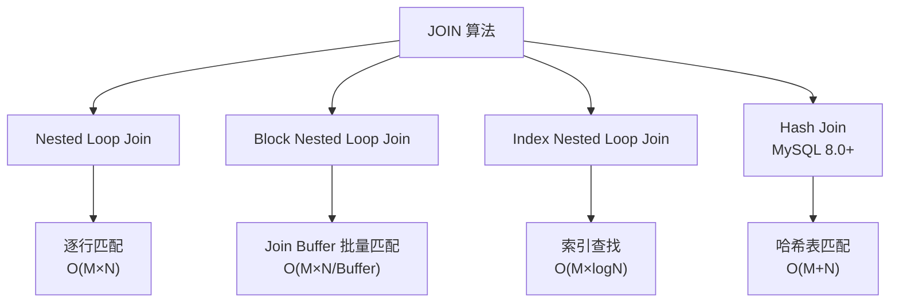
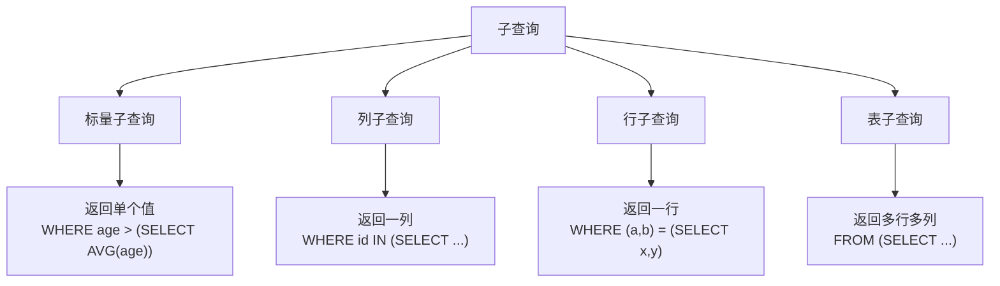
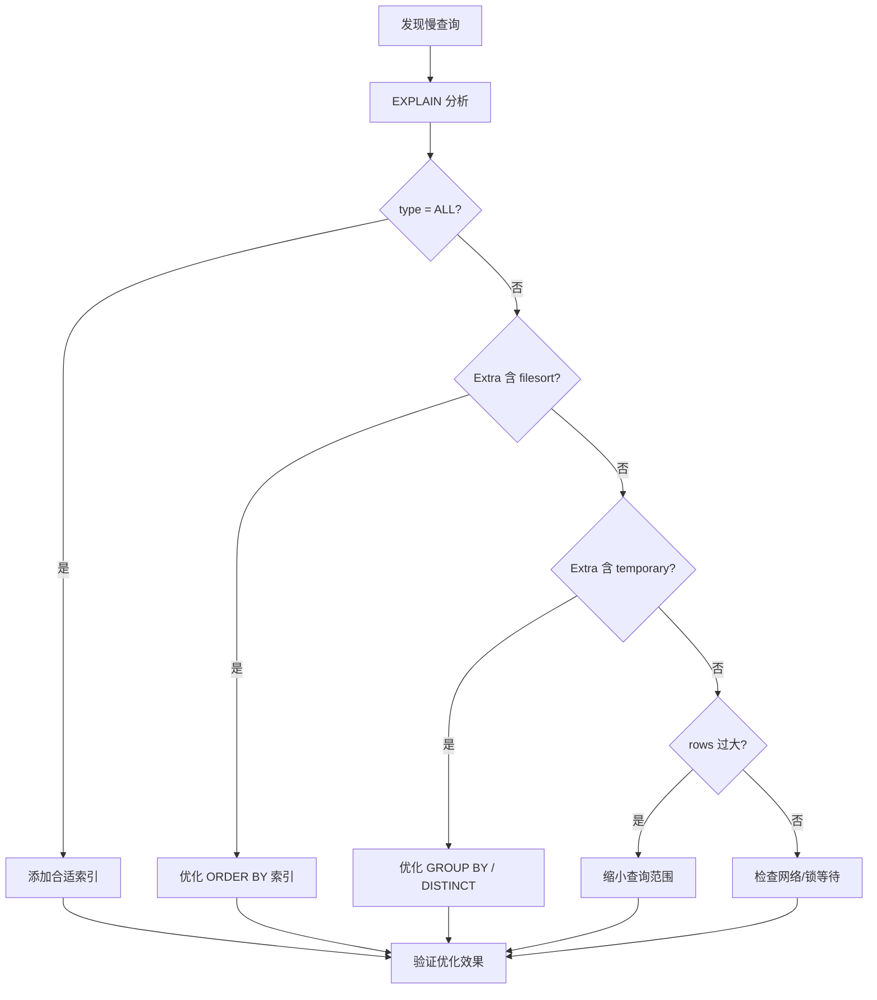

## 概述

SQL 查询优化是数据库性能调优的核心技能。理解查询优化器的工作原理、掌握 EXPLAIN 分析方法、熟悉索引优化策略，是从"写出能跑的 SQL"到"写出高效的 SQL"的关键跨越。

---

## 查询优化器原理

### 优化器工作流程



### CBO 代价模型

优化器通过估算不同执行计划的代价来选择最优方案：

$$
\text{Cost} = C_{IO} \times N_{page} + C_{CPU} \times N_{row} + C_{net} \times N_{transfer}
$$

其中：
- $C_{IO}$：磁盘 I/O 代价系数
- $N_{page}$：需要读取的数据页数
- $C_{CPU}$：CPU 处理代价系数
- $N_{row}$：需要处理的行数
- $C_{net}$：网络传输代价系数

### 优化器局限性

| 局限 | 原因 | 应对 |
|------|------|------|
| 统计信息不准确 | 采样估算，非精确值 | 手动 ANALYZE TABLE |
| 无法预知数据分布倾斜 | 假设均匀分布 | 使用直方图 |
| 搜索空间爆炸 | JOIN 排列组合 | 限制搜索深度 |
| 无法感知缓存 | 忽略 Buffer Pool | 调整优化器提示 |

---

## EXPLAIN 详解

### 基本用法

```sql
EXPLAIN SELECT * FROM users WHERE age > 25 AND city = 'Beijing';
```

### 输出字段解读

| 字段 | 含义 | 关注点 |
|------|------|--------|
| id | 查询序号 | 子查询/JOIN 的执行顺序 |
| select_type | 查询类型 | 是否出现 SUBQUERY/DERIVED |
| table | 访问的表 | 关联表名 |
| partitions | 匹配的分区 | 分区表优化 |
| **type** | **访问类型** | **最重要的指标** |
| possible_keys | 可能使用的索引 | 为空则无可用索引 |
| **key** | **实际使用的索引** | **NULL 表示未用索引** |
| key_len | 使用索引的字节长度 | 判断复合索引使用情况 |
| ref | 索引查找的引用 | const/列名 |
| **rows** | **预估扫描行数** | **越小越好** |
| filtered | 过滤比例 | 越高越好 |
| Extra | 额外信息 | 关注 Using filesort/temporary |

### type 字段（访问类型）

性能从好到差排列：


| type | 说明 | 示例 |
|------|------|------|
| system | 表中仅一行 | 系统表 |
| const | 主键/唯一索引等值查询 | `WHERE id = 1` |
| eq_ref | JOIN 时主键/唯一索引 | `JOIN ON a.id = b.id` |
| ref | 非唯一索引等值查询 | `WHERE idx_col = 'val'` |
| range | 索引范围扫描 | `WHERE age > 25` |
| index | 全索引扫描 | 索引覆盖查询 |
| ALL | 全表扫描 | 无索引/索引失效 |

### Extra 字段关键信息

| Extra 值 | 含义 | 优化建议 |
|-----------|------|----------|
| Using index | 索引覆盖，无需回表 | ✅ 最优 |
| Using where | Server 层过滤 | 检查索引是否充分 |
| Using index condition | ICP 下推 | ✅ 较优 |
| Using temporary | 使用临时表 | ⚠️ 需优化 |
| Using filesort | 额外排序 | ⚠️ 需优化 |
| Using join buffer | JOIN 无索引 | ⚠️ 加索引 |
| Select tables optimized away | 优化为常量 | ✅ 最优 |

### EXPLAIN ANALYZE（MySQL 8.0+）

```sql
EXPLAIN ANALYZE
SELECT u.name, o.total
FROM users u
JOIN orders o ON u.id = o.user_id
WHERE u.age > 25;
```

输出包含实际执行时间和行数，而非估算值。

---

## 索引优化实战

### 最左前缀原则

复合索引 `(a, b, c)` 的匹配规则：



### 索引失效场景

```sql
-- 1. 对索引列使用函数
SELECT * FROM users WHERE YEAR(created_at) = 2026;  -- ❌ 失效
SELECT * FROM users WHERE created_at >= '2026-01-01' AND created_at < '2027-01-01';  -- ✅

-- 2. 隐式类型转换
SELECT * FROM users WHERE phone = 13800138000;  -- ❌ phone 是 VARCHAR
SELECT * FROM users WHERE phone = '13800138000';  -- ✅

-- 3. LIKE 左模糊
SELECT * FROM users WHERE name LIKE '%张';  -- ❌ 失效
SELECT * FROM users WHERE name LIKE '张%';  -- ✅

-- 4. OR 条件
SELECT * FROM users WHERE name = '张三' OR age = 25;  -- ❌ age 无索引则全表
SELECT * FROM users WHERE name = '张三' UNION SELECT * FROM users WHERE age = 25;  -- ✅

-- 5. NOT IN / NOT EXISTS
SELECT * FROM users WHERE age NOT IN (20, 25, 30);  -- ❌ 通常失效
SELECT * FROM users WHERE age NOT IN (20, 25, 30) AND city = 'BJ';  -- ⚠️ 可走 city 索引

-- 6. 范围查询后的列
-- 索引 (a, b, c)
SELECT * FROM t WHERE a = 1 AND b > 2 AND c = 3;  -- ⚠️ 仅使用 a, b
```

### 索引设计原则

| 原则 | 说明 |
|------|------|
| 选择性高的列优先 | 区分度 $=\frac{\text{不同值数}}{\text{总行数}}$，越接近 1 越好 |
| 覆盖索引 | 将查询所需列都包含在索引中 |
| 避免冗余索引 | `(a, b)` 已包含 `(a)` 的功能 |
| 频繁查询优先 | 为高频查询创建专用索引 |
| 短字段优先 | 索引列越短，一个页存放更多索引项 |

### 索引选择性计算

```sql
-- 计算列的选择性
SELECT COUNT(DISTINCT city) / COUNT(*) AS city_selectivity FROM users;
SELECT COUNT(DISTINCT age) / COUNT(*) AS age_selectivity FROM users;

-- 选择性高的列放前面
-- 如果 city_selectivity > age_selectivity
-- 创建索引 (city, age) 而非 (age, city)
```

---

## JOIN 优化

### JOIN 算法



### JOIN 优化策略

```sql
-- 1. 确保 JOIN 列有索引
ALTER TABLE orders ADD INDEX idx_user_id (user_id);

-- 2. 小表驱动大表
-- ✅ 小结果集驱动大表
SELECT * FROM small_table s
JOIN large_table l ON s.id = l.small_id
WHERE s.status = 'active';

-- 3. 减少 JOIN 的列
-- ❌ 不必要的列
SELECT * FROM users u JOIN orders o ON u.id = o.user_id;
-- ✅ 只取需要的列
SELECT u.name, o.total FROM users u JOIN orders o ON u.id = o.user_id;

-- 4. 避免过多表 JOIN
-- 经验：不超过 5 张表 JOIN
-- 超过时考虑拆分或反范式化
```

### JOIN 类型对比

| JOIN 类型 | 说明 | 结果集 |
|-----------|------|--------|
| INNER JOIN | 取交集 | 两表匹配的行 |
| LEFT JOIN | 左表全保留 | 左表全部 + 右表匹配 |
| RIGHT JOIN | 右表全保留 | 右表全部 + 左表匹配 |
| CROSS JOIN | 笛卡尔积 | M × N 行 |

---

## 子查询优化

### 子查询类型



### 优化策略

```sql
-- 1. IN 子查询 → JOIN
-- ❌ 低效
SELECT * FROM orders
WHERE user_id IN (SELECT id FROM users WHERE city = 'Beijing');

-- ✅ 优化为 JOIN
SELECT o.* FROM orders o
JOIN users u ON o.user_id = u.id
WHERE u.city = 'Beijing';

-- 2. EXISTS 替代 IN（大数据集）
-- ✅ EXISTS 遇到匹配即停
SELECT * FROM orders o
WHERE EXISTS (SELECT 1 FROM users u WHERE u.id = o.user_id AND u.city = 'Beijing');

-- 3. 派生表 → CTE（MySQL 8.0+）
-- ❌ 派生表可能物化
SELECT * FROM (SELECT user_id, COUNT(*) cnt FROM orders GROUP BY user_id) t
WHERE cnt > 10;

-- ✅ CTE 可能被优化器内联
WITH order_counts AS (
  SELECT user_id, COUNT(*) cnt FROM orders GROUP BY user_id
)
SELECT * FROM order_counts WHERE cnt > 10;

-- 4. 相关子查询 → 窗口函数
-- ❌ 相关子查询每行执行一次
SELECT u.*, (SELECT COUNT(*) FROM orders o WHERE o.user_id = u.id) AS order_count
FROM users u;

-- ✅ 窗口函数一次扫描
SELECT u.*, COALESCE(oc.cnt, 0) AS order_count
FROM users u
LEFT JOIN (SELECT user_id, COUNT(*) cnt FROM orders GROUP BY user_id) oc
ON u.id = oc.user_id;
```

---

## 分页优化

### 传统分页的问题

```sql
-- 深分页性能差：需要扫描前 1000000 行再丢弃
SELECT * FROM orders ORDER BY id LIMIT 1000000, 10;
```

$$
\text{扫描行数} = \text{offset} + \text{limit} = 1000000 + 10
$$

### 优化方案

```sql
-- 方案1: 游标分页（推荐）
-- 前端记住上一页最后一条的 id
SELECT * FROM orders WHERE id > 1000000 ORDER BY id LIMIT 10;

-- 方案2: 延迟关联
-- 先通过索引查 id，再回表取数据
SELECT o.* FROM orders o
JOIN (SELECT id FROM orders ORDER BY id LIMIT 1000000, 10) t
ON o.id = t.id;

-- 方案3: BETWEEN（有序ID）
SELECT * FROM orders WHERE id BETWEEN 1000000 AND 1000010;

-- 方案4: 估算总数，避免 COUNT(*)
-- 使用 EXPLAIN 估算
EXPLAIN SELECT * FROM orders;
-- rows 字段即为估算值
```

### 分页方案对比

| 方案 | 性能 | 适用场景 | 缺点 |
|------|------|----------|------|
| LIMIT offset, n | 差 | 浅分页 | 深分页慢 |
| 游标分页 | 优 | 无限滚动 | 不能跳页 |
| 延迟关联 | 良 | 深分页跳页 | 写法复杂 |
| BETWEEN | 优 | 有序ID | 不适用非数值ID |

---

## 慢查询分析

### 开启慢查询日志

```sql
-- 查看慢查询配置
SHOW VARIABLES LIKE 'slow_query%';
SHOW VARIABLES LIKE 'long_query_time';

-- 开启慢查询日志
SET GLOBAL slow_query_log = ON;
SET GLOBAL long_query_time = 1;  -- 超过1秒记录
SET GLOBAL log_queries_not_using_indexes = ON;  -- 记录未用索引的查询
```

### mysqldumpslow 分析

```bash
# 按查询时间排序，显示前10条
mysqldumpslow -s t -t 10 /var/log/mysql/slow.log

# 按查询次数排序
mysqldumpslow -s c -t 10 /var/log/mysql/slow.log

# 按锁定时间排序
mysqldumpslow -s l -t 10 /var/log/mysql/slow.log
```

### Performance Schema（MySQL 8.0+）

```sql
-- 查看最耗时的SQL
SELECT DIGEST_TEXT, COUNT_STAR, AVG_TIMER_WAIT/1000000000 AS avg_ms
FROM performance_schema.events_statements_summary_by_digest
ORDER BY AVG_TIMER_WAIT DESC
LIMIT 10;

-- 查看全表扫描的SQL
SELECT DIGEST_TEXT, SUM_ROWS_EXAMINED
FROM performance_schema.events_statements_summary_by_digest
WHERE SUM_ROWS_EXAMINED > 10000
ORDER BY SUM_ROWS_EXAMINED DESC;
```

### 优化流程



---

## 面试 Q&A

**Q1: 为什么索引建立了但查询还是慢？**

A: 可能原因：(1) 索引失效（函数、隐式转换、左模糊等）；(2) 优化器选择错误（统计信息不准确，用 `FORCE INDEX` 引导）；(3) 深分页问题；(4) 回表代价大（考虑覆盖索引）；(5) 锁等待（其他事务持有锁）。用 EXPLAIN 确认实际执行计划。

**Q2: 覆盖索引是什么？为什么重要？**

A: 覆盖索引指查询所需的所有列都在索引中，无需回表查主键索引。InnoDB 中非主键索引叶子节点存储主键值，回表需要额外一次 B+ 树查找。覆盖索引避免了回表，减少大量随机 I/O。通过 EXPLAIN 的 Extra = Using index 判断。

**Q3: MySQL 为什么有时候不选择索引而走全表扫描？**

A: 优化器基于 CBO 估算代价。当索引选择性低（如性别列只有2个值），或需要回表的行数超过全表的 20-30% 时，全表扫描（顺序读）可能比索引+回表（随机读）更快。可通过 `ANALYZE TABLE` 更新统计信息或使用 `FORCE INDEX` 强制走索引。

**Q4: ORDER BY 如何利用索引避免 filesort？**

A: 当 ORDER BY 的列与索引列顺序一致且方向一致时，可以利用索引的有序性避免额外排序。注意：(1) 复合索引需满足最左前缀；(2) ASC/DESC 混用会失效（MySQL 8.0 支持降序索引）；(3) WHERE + ORDER BY 需要索引同时覆盖过滤和排序。

**Q5: 如何优化 COUNT(*) 查询？**

A: (1) 使用近似值：`EXPLAIN` 的 rows 估算或 `SHOW TABLE STATUS`；(2) 维护计数表：通过触发器或应用层维护；(3) 缓存结果：Redis 缓存计数；(4) 减少范围：`COUNT(id)` 不比 `COUNT(*)` 快，InnoDB 中 `COUNT(*)` 会选最小索引扫描；(5) 汇总表：定期预计算。

**Q6: 什么是 Index Condition Pushdown (ICP)？**

A: ICP 是 MySQL 5.6+ 的优化。在没有 ICP 时，存储引擎通过索引找到行后返回给 Server 层，Server 层再根据 WHERE 条件过滤。ICP 允许将部分 WHERE 条件下推到存储引擎层，在索引扫描时就过滤，减少回表次数。EXPLAIN 中 Extra = Using index condition 表示启用了 ICP。
