## 概述

HTTPS = HTTP + TLS，在传输层与应用层之间插入安全层，为数据提供加密、身份验证和完整性保护。理解 TLS 的工作原理是构建安全 Web 应用的基础。

---

## 加密基础

### 对称加密

加密和解密使用同一密钥：

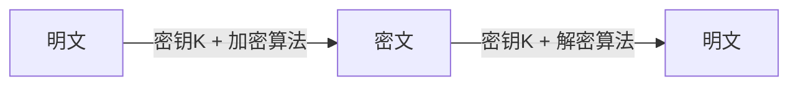

| 算法 | 密钥长度 | 模式 | 特点 |
|------|----------|------|------|
| AES-128 | 128 bit | GCM/CTR/CBC | 速度快，硬件加速 |
| AES-256 | 256 bit | GCM/CTR/CBC | 安全性高 |
| ChaCha20 | 256 bit | Poly1305 | 软件实现快，移动端友好 |

**核心问题**：如何安全地传输对称密钥？

### 非对称加密

公钥加密，私钥解密：

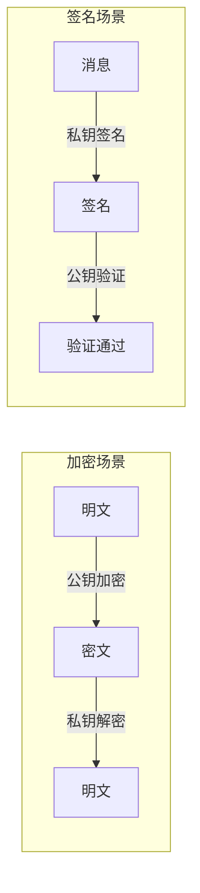

| 算法 | 密钥长度 | 用途 |
|------|----------|------|
| RSA | 2048/4096 bit | 加密/签名 |
| ECDSA | 256 bit (P-256) | 签名 |
| ECDH | 256 bit (X25519) | 密钥协商 |

### 混合加密方案

TLS 采用混合加密：非对称加密协商密钥，对称加密传输数据。

$$
\text{安全性} = \text{非对称加密（密钥协商）} + \text{对称加密（数据传输）}
$$

---

## 数字签名与证书

### 数字签名流程

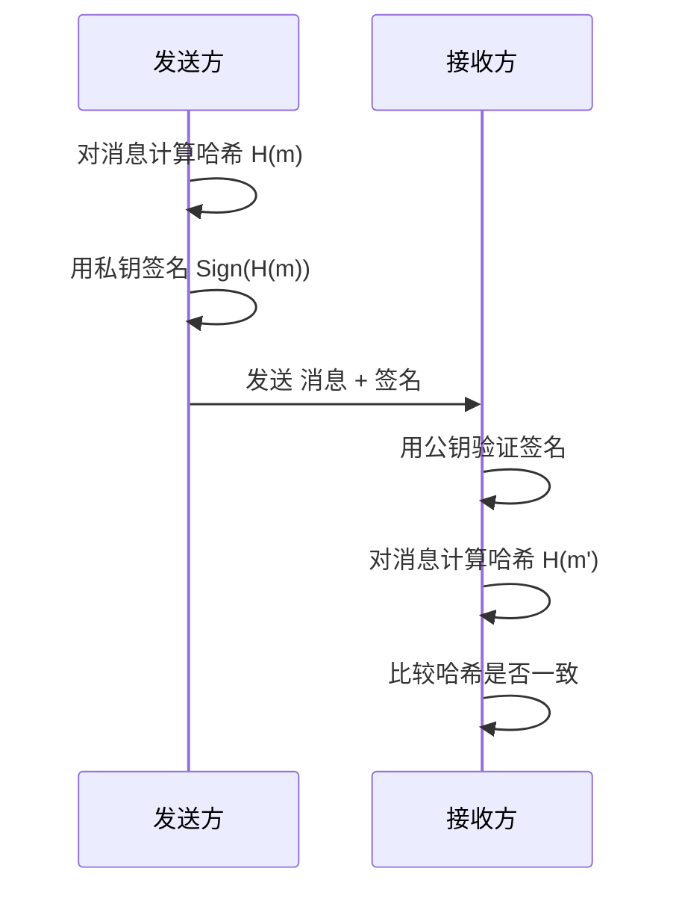

### 数字证书

数字证书将公钥与身份绑定，由 CA（Certificate Authority）签名保证：

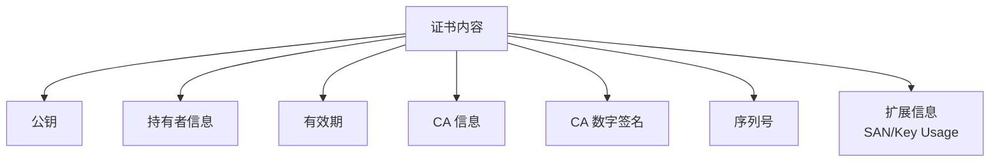

### 证书链验证

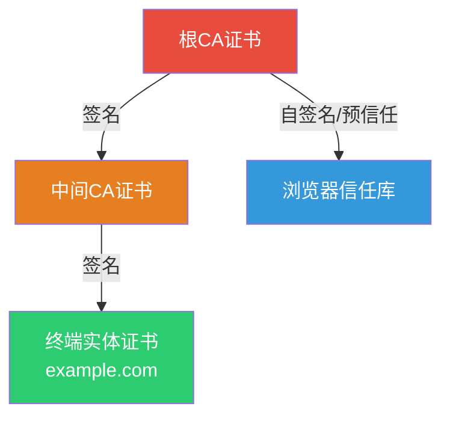

**验证过程**：
1. 浏览器检查终端证书的签名是否由中间CA签发
2. 检查中间CA证书的签名是否由根CA签发
3. 根CA证书是否在浏览器信任库中
4. 每一级证书是否在有效期内
5. 证书是否被吊销（CRL/OCSP）

### 证书类型对比

| 类型 | 验证级别 | 显示 | 价格 | 适用场景 |
|------|----------|------|------|----------|
| DV | 域名验证 | 🔒 | 免费/低价 | 个人网站 |
| OV | 组织验证 | 🔒 + 公司名 | 中等 | 企业网站 |
| EV | 扩展验证 | 🔒 + 公司名(旧浏览器) | 高 | 金融/支付 |

---

## TLS 握手

### TLS 1.2 握手（2-RTT）

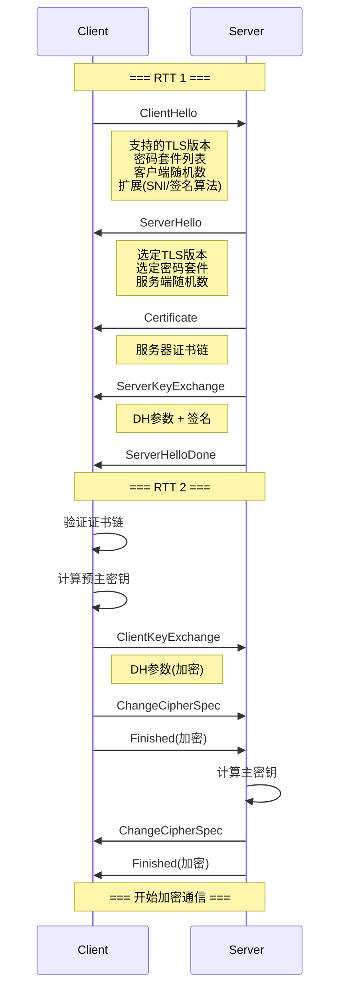

### TLS 1.3 握手（1-RTT）

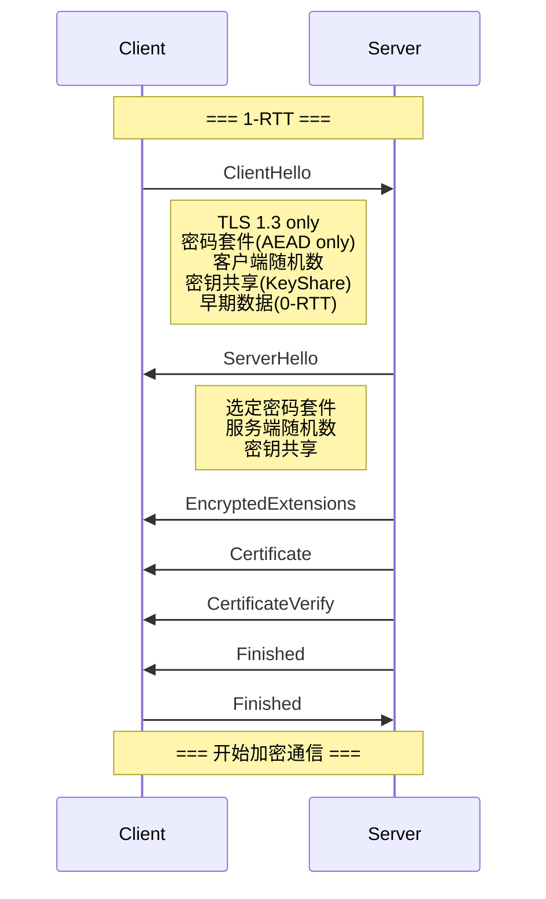

### TLS 1.2 vs 1.3 对比

| 维度 | TLS 1.2 | TLS 1.3 |
|------|---------|---------|
| 握手 RTT | 2-RTT | 1-RTT |
| 恢复连接 | Session ID/Ticket | PSK + 0-RTT |
| 密码套件 | 含不安全算法 | 仅 AEAD |
| 密钥协商 | RSA/DH/ECDH | 仅 (EC)DHE |
| 握手加密 | 部分明文 | 几乎全加密 |
| 证书验证 | 明文传输 | 加密传输 |
| 不安全算法 | RC4/DES/SHA1 | 全部移除 |

### TLS 1.3 0-RTT

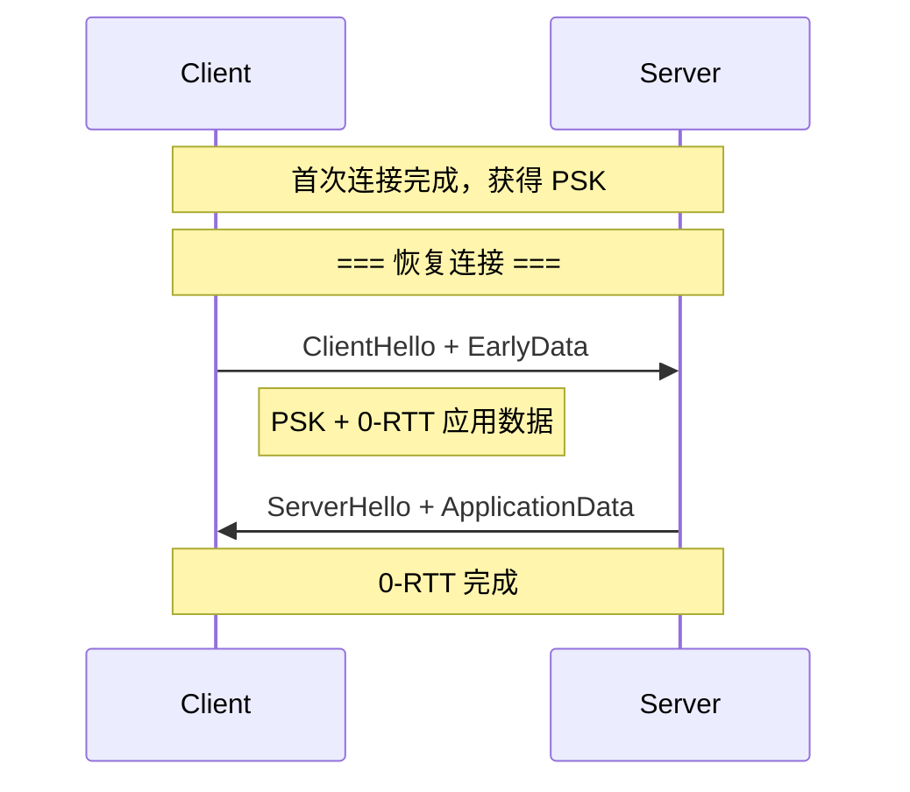

**0-RTT 安全限制**：
- 仅适用于幂等请求（防重放攻击）
- 不提供前向安全（Forward Secrecy）
- 不适用于敏感操作

### 密钥推导过程

TLS 1.2 密钥推导：

$$
\begin{aligned}
\text{MasterSecret} &= \text{PRF}(\text{PreMasterSecret}, \text{"master secret"}, \text{ClientRandom} + \text{ServerRandom}) \\
\text{KeyBlock} &= \text{PRF}(\text{MasterSecret}, \text{"key expansion"}, \text{ServerRandom} + \text{ClientRandom})
\end{aligned}
$$

TLS 1.3 使用 HKDF（HMAC-based Key Derivation Function）：

$$
\begin{aligned}
\text{EarlySecret} &= \text{HKDF-Extract}(0, \text{PSK}) \\
\text{HandshakeSecret} &= \text{HKDF-Extract}(\text{DerivedSecret}, \text{ECDHE\_shared}) \\
\text{MasterSecret} &= \text{HKDF-Extract}(\text{DerivedSecret}, 0)
\end{aligned}
$$

---

## HTTPS 性能开销

### 建立连接开销

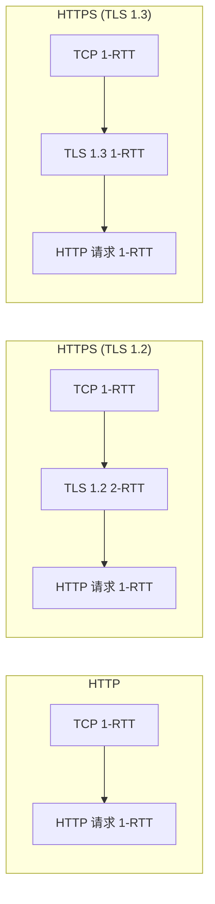

| 场景 | 首次连接 | 恢复连接 |
|------|----------|----------|
| HTTP | 2-RTT | 2-RTT |
| HTTPS (TLS 1.2) | 4-RTT | 3-RTT |
| HTTPS (TLS 1.3) | 3-RTT | 1-RTT |
| HTTPS + QUIC | 1-RTT | 0-RTT |

### 加解密开销

现代 CPU 的 AES-NI 指令集使对称加密开销极小：

```python
# AES-GCM 加密性能参考（硬件加速）
# AES-128-GCM: ~40 Gbps
# AES-256-GCM: ~30 Gbps
# ChaCha20-Poly1305: ~10 Gbps (无硬件加速时更快)
```

**优化建议**：
- 优先选择 AES-GCM（有 AES-NI 的服务器）
- 移动端优先选择 ChaCha20-Poly1305
- 启用 TLS 卸载（硬件加速卡/CDN）

---

## HSTS

### HTTP Strict Transport Security

HSTS 强制浏览器始终使用 HTTPS 访问：

```http
Strict-Transport-Security: max-age=31536000; includeSubDomains; preload
```

| 参数 | 说明 |
|------|------|
| max-age | HSTS 有效期（秒） |
| includeSubDomains | 包含所有子域名 |
| preload | 允许加入浏览器预加载列表 |

### 没有 HSTS 的风险

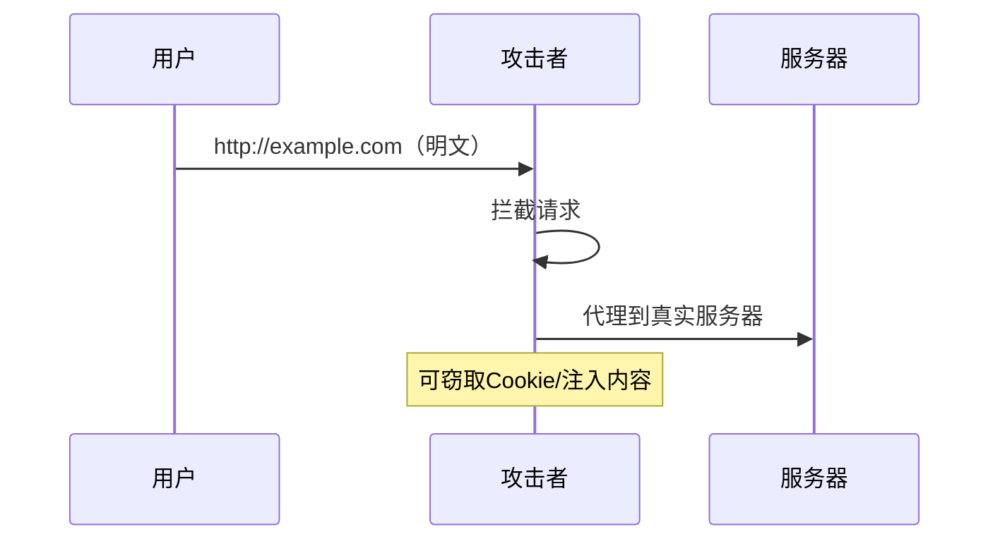

### HSTS Preload List

浏览器内置的强制 HTTPS 域名列表，即使首次访问也走 HTTPS：

1. 在 [hstspreload.org](https://hstspreload.org) 提交域名
2. 域名加入 Chrome/Firefox/Edge 等浏览器的预加载列表
3. 用户首次访问即走 HTTPS，消除 SSL Stripping 攻击

---

## 证书链验证详解

### 完整验证流程

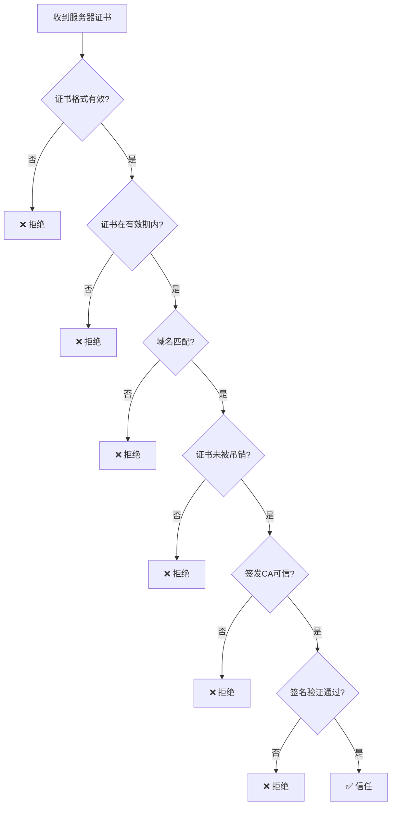

### 证书吊销检查

| 机制 | 原理 | 优缺点 |
|------|------|--------|
| CRL | 下载吊销列表 | 文件大、更新延迟 |
| OCSP | 实时查询CA | 额外延迟、隐私泄露 |
| OCSP Stapling | 服务器附带OCSP响应 | 无额外延迟、保护隐私 |

### Nginx 配置 OCSP Stapling

```nginx
server {
    ssl_certificate     /etc/ssl/cert.pem;
    ssl_certificate_key /etc/ssl/key.pem;

    # OCSP Stapling
    ssl_stapling on;
    ssl_stapling_verify on;
    ssl_trusted_certificate /etc/ssl/chain.pem;
    resolver 8.8.8.8 8.8.4.4 valid=300s;
    resolver_timeout 5s;
}
```

---

## 工程实践

### 完整 HTTPS 配置（Nginx）

```nginx
server {
    listen 443 ssl http2;
    server_name example.com;

    # 证书配置
    ssl_certificate     /etc/ssl/fullchain.pem;
    ssl_certificate_key /etc/ssl/privkey.pem;

    # 协议版本
    ssl_protocols TLSv1.2 TLSv1.3;

    # 密码套件（TLS 1.2）
    ssl_ciphers 'ECDHE-ECDSA-AES128-GCM-SHA256:ECDHE-RSA-AES128-GCM-SHA256:ECDHE-ECDSA-AES256-GCM-SHA384:ECDHE-RSA-AES256-GCM-SHA384';

    # 优先使用服务器端密码套件
    ssl_prefer_server_ciphers on;

    # 会话复用
    ssl_session_cache shared:SSL:10m;
    ssl_session_timeout 1d;
    ssl_session_tickets off;

    # OCSP Stapling
    ssl_stapling on;
    ssl_stapling_verify on;

    # HSTS
    add_header Strict-Transport-Security "max-age=31536000; includeSubDomains; preload" always;

    # 安全头
    add_header X-Frame-Options DENY;
    add_header X-Content-Type-Options nosniff;
}

# HTTP → HTTPS 重定向
server {
    listen 80;
    server_name example.com;
    return 301 https://$host$request_uri;
}
```

### 证书自动续期（Certbot）

```bash
# 安装
apt install certbot python3-certbot-nginx

# 获取证书
certbot --nginx -d example.com -d www.example.com

# 自动续期（cron）
echo "0 0,12 * * * root certbot renew --quiet" >> /etc/crontab

# 测试续期
certbot renew --dry-run
```

### TLS 调试

```bash
# 检查 TLS 版本和密码套件
openssl s_client -connect example.com:443 -tls1_3

# 检查证书信息
openssl x509 -in cert.pem -text -noout

# 检查证书链
openssl verify -CAfile chain.pem cert.pem

# 检查 OCSP
openssl ocsp -issuer chain.pem -cert cert.pem -url http://ocsp.example.com -resp_text

# 使用 testssl.sh 全面检测
./testssl.sh example.com
```

---

## 面试 Q&A

**Q1: TLS 1.3 为什么移除了 RSA 密钥交换？**

A: RSA 密钥交换不支持前向安全（Forward Secrecy）。如果服务器私钥泄露，所有历史通信都可以被解密。TLS 1.3 仅保留 (EC)DHE 密钥交换，每次连接生成临时密钥对，即使长期私钥泄露也不影响历史会话。

**Q2: 中间人攻击在 HTTPS 下是否可能？**

A: 在正常情况下不可能。但如果满足以下条件则可能：(1) 用户信任了恶意 CA 证书（企业代理/恶意软件）；(2) 证书签发失误（如 DigiNotar 事件）；(3) SSL Stripping（降级为 HTTP，HSTS 可防御）；(4) SNI 泄露（ESNI/ECH 可防御）。

**Q3: 为什么 HTTPS 证书需要付费？**

A: CA 的核心价值是身份验证和信任锚。OV/EV 证书需要人工验证组织身份。但 Let's Encrypt 提供免费 DV 证书，自动化签发，适合大多数场景。证书费用本质是"信任服务费"而非"加密费"。

**Q4: TLS 握手中的 ClientHello 和 ServerHello 为什么不能加密？**

A: 握手初期双方还没有协商出加密密钥，无法加密。但 TLS 1.3 做了改进：(1) ServerHello 之后的握手消息全部加密；(2) 引入 ESNI（Encrypted SNI）加密服务器名称指示；(3) ECH（Encrypted Client Hello）将整个 ClientHello 加密。

**Q5: 双向 TLS（mTLS）是什么？应用场景？**

A: mTLS 要求客户端也提供证书，服务器验证客户端身份。应用场景：(1) 微服务间零信任网络（Service Mesh）；(2) API 网关认证；(3) 企业 VPN；(4) IoT 设备认证。Kubernetes 中 Service Mesh（如 Istio）默认使用 mTLS 保护服务间通信。

**Q6: 证书过期导致服务不可用如何预防？**

A: (1) 自动化续期（Let's Encrypt + Certbot）；(2) 证书监控告警（Prometheus + ssl_exporter）；(3) 多级提醒（30天/14天/7天/1天）；(4) 使用证书透明度（CT）日志监控；(5) 预留手动续期窗口。
