## 概述

DNS（Domain Name System）是互联网的"电话簿"，将人类可读的域名转换为机器可识别的 IP 地址。作为互联网最核心的基础设施之一，DNS 的设计深刻影响了网络架构的可靠性与性能。

---

## DNS 层次结构

DNS 采用分层的树状结构，从根域到顶级域再到二级域：

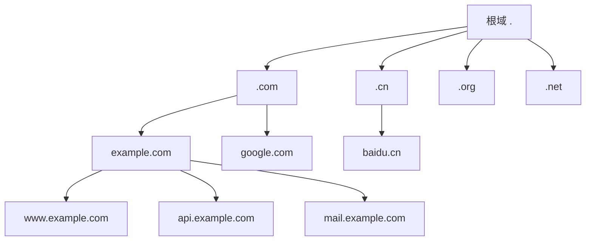

### 域名层级

| 层级 | 示例 | 管理方 |
|------|------|--------|
| 根域 | `.` | ICANN / IANA |
| 顶级域（TLD） | `.com`、`.cn`、`.org` | 注册局 |
| 二级域 | `example.com` | 注册人 |
| 子域 | `www.example.com` | 注册人/管理员 |

全球共有 13 组根域名服务器（A-M），通过 Anycast 技术扩展为数百个实例。

---

## DNS 查询流程

### 递归查询 vs 迭代查询

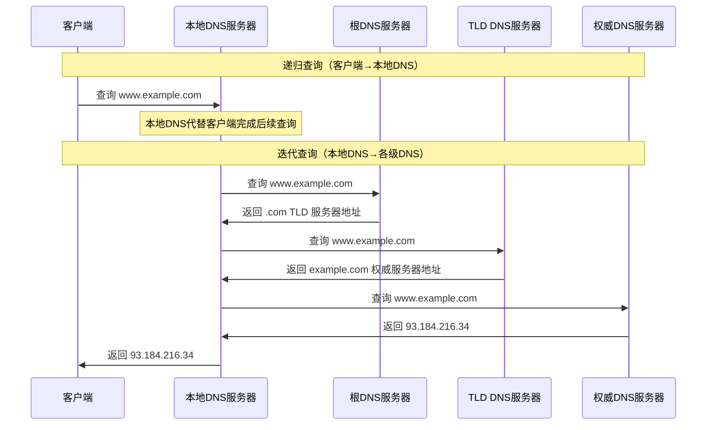

**关键区别**：
- **递归查询**：被查询方负责返回最终结果
- **迭代查询**：被查询方返回下一步应查询的服务器地址

### 完整解析流程

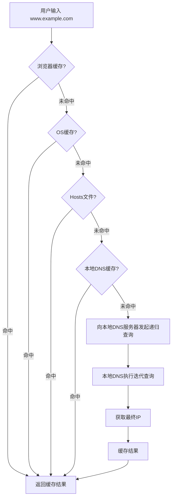

---

## DNS 记录类型

| 记录类型 | 全称 | 用途 | 示例 |
|----------|------|------|------|
| A | Address | 域名→IPv4 | `example.com → 93.184.216.34` |
| AAAA | IPv6 Address | 域名→IPv6 | `example.com → 2606:2800:220:1:...` |
| CNAME | Canonical Name | 域名别名 | `www.example.com → example.com` |
| MX | Mail Exchange | 邮件服务器 | `example.com → mail.example.com` |
| NS | Name Server | 委派DNS服务器 | `example.com → ns1.example.com` |
| TXT | Text | 任意文本/验证 | SPF、DKIM、域名验证 |
| SOA | Start of Authority | 区域管理信息 | 主DNS、管理员邮箱、序列号 |
| SRV | Service | 服务发现 | `_sip._tcp.example.com` |
| PTR | Pointer | IP→域名（反向解析） | `34.216.184.93 → example.com` |
| CAA | Certification Authority | 证书颁发授权 | 指定允许的CA |

### 查询示例

```bash
# 查询 A 记录
dig example.com A

# 查询所有记录
dig example.com ANY

# 查询 CNAME 链
dig www.example.com CNAME

# 追踪完整解析路径
dig +trace example.com

# 反向解析
dig -x 93.184.216.34
```

### dig 输出解读

```text
;; ANSWER SECTION:
example.com.    86400   IN  A     93.184.216.34
│              │       │   │     │
│              │       │   │     └─ 记录值
│              │       │   └─────── 记录类型
│              │       └─────────── INternet类
│              └─────────────────── TTL（秒）
└────────────────────────────────── 域名
```

---

## DNS 缓存

### 缓存层级

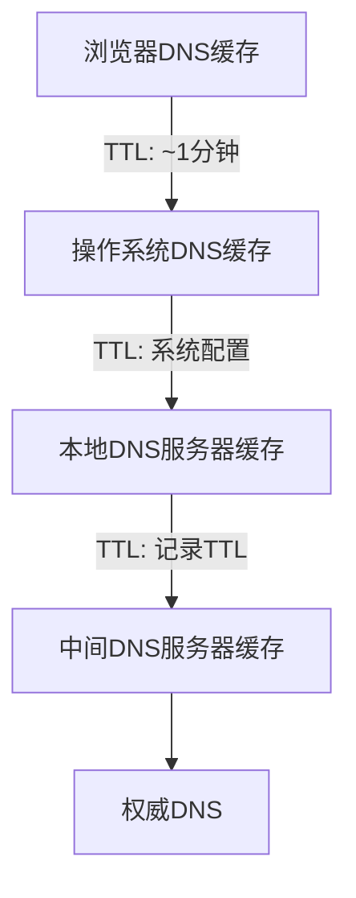

### TTL 策略

$$
\text{实际缓存时间} = \min(\text{TTL}, \text{本地策略上限})
$$

| 场景 | 建议 TTL | 原因 |
|------|----------|------|
| 稳定服务 | 3600s (1h) | 减少查询，降低延迟 |
| 即将变更 | 300s (5min) | 快速生效 |
| DNS切换期间 | 60s | 最小化切换时间 |
| CDN/负载均衡 | 30-60s | 快速故障转移 |

### 缓存一致性挑战

DNS 缓存遵循 TTL 机制，但存在**负面缓存**问题——查询失败的结果也会被缓存：

```text
NXDOMAIN 响应默认缓存时间 = min(SOA minimum TTL, SOA TTL)
```

这导致域名刚注册时可能因为之前缓存了 NXDOMAIN 而无法立即访问。

---

## DNS 负载均衡

### DNS 轮询（Round Robin）

最简单的负载均衡方式，同一域名返回多个 IP：

```bash
$ dig google.com A

;; ANSWER SECTION:
google.com.  300  IN  A  142.250.80.46
google.com.  300  IN  A  142.250.80.47
google.com.  300  IN  A  142.250.80.48
```

**问题**：
- 无法感知服务器实际负载
- 客户端缓存导致流量不均
- 无法自动摘除故障节点

### 智能 DNS（GeoDNS）

根据客户端 IP 地理位置返回最近的服务器 IP：

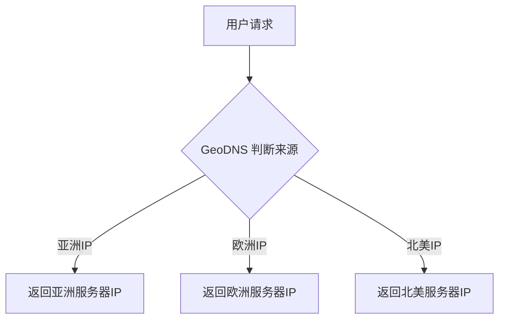

### 基于 DNS 的全局负载均衡（GSLB）

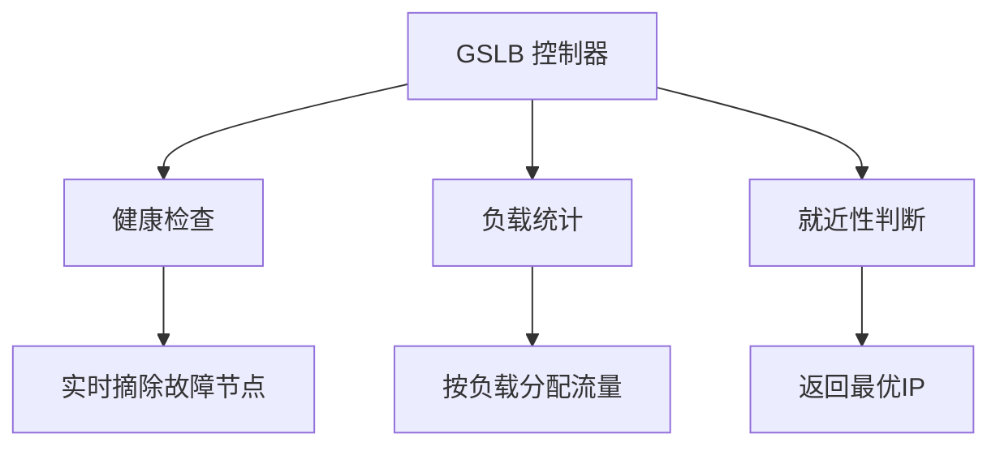

---

## DNS 劫持与 DNSSEC

### DNS 劫持类型

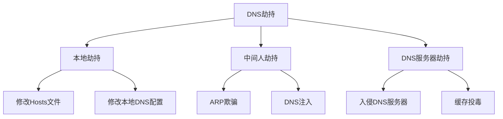

### DNS 缓存投毒（Kaminsky 攻击）

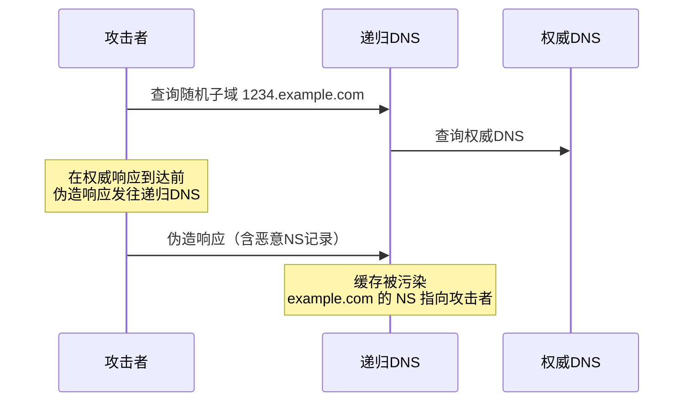

### DNSSEC 防御

DNSSEC 通过数字签名保证 DNS 响应的真实性和完整性：

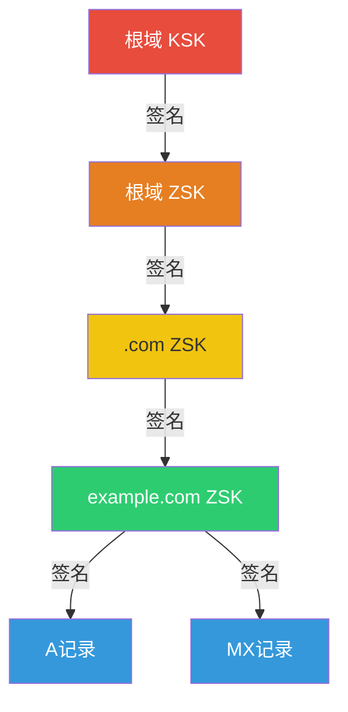

| 概念 | 说明 |
|------|------|
| KSK | Key Signing Key，签名 ZSK 的密钥 |
| ZSK | Zone Signing Key，签名区域记录的密钥 |
| DS | Delegation Signer，父域对子域 KSK 的摘要 |
| RRSIG | 资源记录的数字签名 |
| NSEC | 不存在记录的签名证明 |

**DNSSEC 的局限**：
- 仅保证**真实性**，不提供**加密**（查询仍是明文）
- 部署率低，许多域名未启用
- 密钥轮换操作复杂

### DoH / DoT 加密 DNS

| 协议 | 端口 | 传输层 | 特点 |
|------|------|--------|------|
| DoT | 853 | TCP/TLS | 专用端口，易被识别和封锁 |
| DoH | 443 | HTTPS | 混入 Web 流量，难以封锁 |

```text
传统 DNS:  明文 UDP/TCP 53端口
DoT:      TLS加密 TCP 853端口
DoH:      HTTPS加密 TCP 443端口 (/dns-query)
```

---

## CDN 与 DNS

### CDN 的 DNS 工作原理

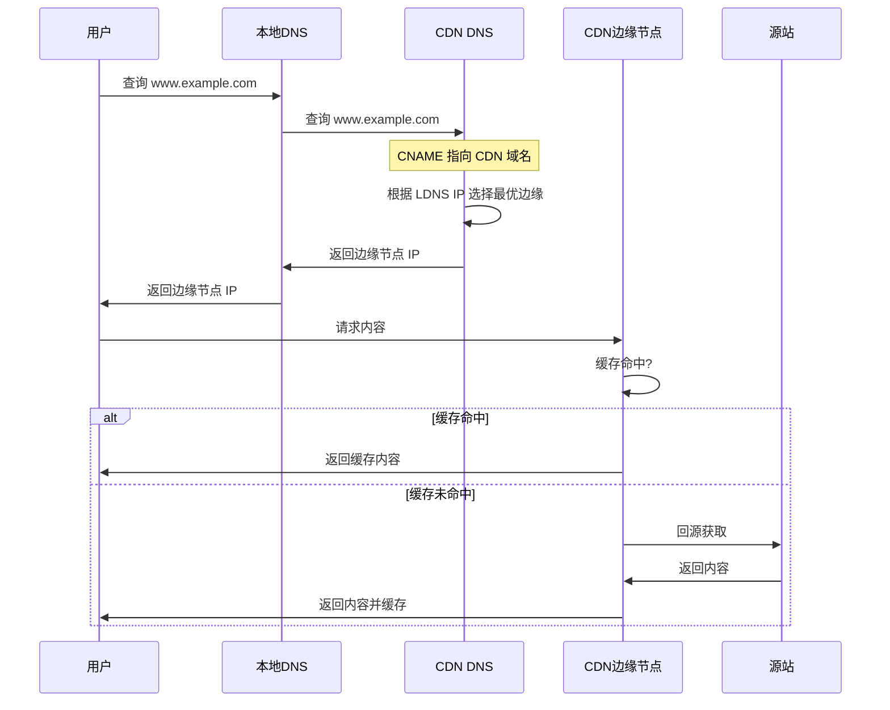

### CNAME 接入流程

```text
1. 用户配置: www.example.com CNAME → www.example.com.cdn.com
2. DNS 解析链:
   www.example.com
     → CNAME www.example.com.cdn.com
     → CNAME cdn-node-xxx.cdn.com
     → A 1.2.3.4 (最优边缘节点IP)
```

### CDN DNS 优化策略

| 策略 | 说明 |
|------|------|
| 就近性路由 | 根据 LDNS IP 选择地理最近的节点 |
| Anycast | 同一 IP 在多节点广播，路由自动选择最近 |
| 实时探测 | 持续监测节点延迟和丢包率 |
| 容量调度 | 根据节点负载动态分配 |

---

## 工程实践

### 自建 DNS 架构

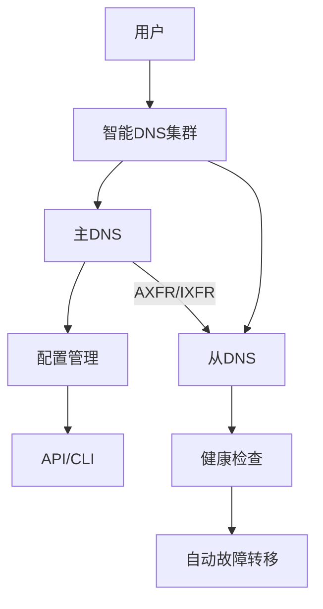

### CoreDNS 配置示例

```yaml
# Corefile
. {
    # 转发到上游 DNS
    forward . 8.8.8.8 8.8.4.4 {
        policy sequential
        health_check 10s
    }

    # 缓存配置
    cache 3600 {
        success 9984 3600
        denial 9984 60
        prefetch 10 10m 10%
    }

    # 重写规则
    rewrite name regex (.+)\.old\.com {1}.new.com

    # 日志
    log

    # 健康检查端点
    health :8080

    # Prometheus 指标
    prometheus :9153
}
```

### DNS 故障排查

```bash
# 1. 检查域名解析链
dig +trace example.com

# 2. 检查特定DNS服务器
dig @8.8.8.8 example.com

# 3. 检查CNAME链
dig example.com CNAME +short

# 4. 检查DNSSEC验证
dig +dnssec example.com

# 5. 检查缓存时间
dig example.com +noall +answer

# 6. Windows 排查
nslookup -debug example.com
ipconfig /displaydns
ipconfig /flushdns
```

---

## 面试 Q&A

**Q1: DNS 为什么使用 UDP 而不是 TCP？**

A: DNS 查询响应通常很小（<512字节），UDP 无需建立连接，延迟更低。当响应超过 512 字节时（如 AXFR 区域传输），DNS 会自动切换到 TCP。DNS 还使用 EDNS0 扩展允许 UDP 传输更大的报文（最多 4096 字节）。

**Q2: 为什么 DNS 根服务器只有 13 组？**

A: 早期 DNS 使用 UDP 传输，DNS 报文必须在一个 UDP 包内完成。考虑 512 字节限制和 IP 分片风险，13 组根服务器地址是当时 UDP 包能容纳的上限。实际上通过 Anycast 技术，13 组 IP 背后是数百个物理服务器实例。

**Q3: DNS 缓存投毒如何防御？**

A: (1) **DNSSEC**：数字签名验证响应真实性；(2) **源端口随机化**：增加伪造难度；(3) **0x20编码**：查询中随机大小写，响应必须匹配；(4) **DoH/DoT**：加密 DNS 查询防止中间人。

**Q4: CDN 场景下 DNS 解析的 LDNS IP 不准确怎么办？**

A: LDNS IP 可能不反映用户真实位置（如企业集中式DNS）。解决方案：(1) **EDNS Client Subnet (ECS)**：递归DNS将客户端子网信息传递给权威DNS；(2) **Anycast + 实时探测**：网络层自动路由到最近节点；(3) **客户端重定向**：边缘节点根据客户端 IP 再次重定向。

**Q5: 如何实现 DNS 的高可用？**

A: (1) 多 NS 记录指向不同服务商；(2) 使用 Anycast 部署；(3) 主从 DNS 同步（AXFR/IXFR）；(4) 多线路智能解析（BGP 多线）；(5) DNS 监控与自动故障转移；(6) 关键域名设置短 TTL 以快速切换。

**Q6: CNAME 为什么不能和其它记录共存？**

A: RFC 规定 CNAME 不能与同一名称的其它记录类型共存（包括 SOA、NS 除外）。因为 CNAME 表示"此名称是另一个名称的别名"，查询任何记录类型都应跟随 CNAME 解析。如果同时存在 A 记录和 CNAME，解析器行为不确定。根域（zone apex）不能使用 CNAME，这是 CDN 接入的常见痛点。
