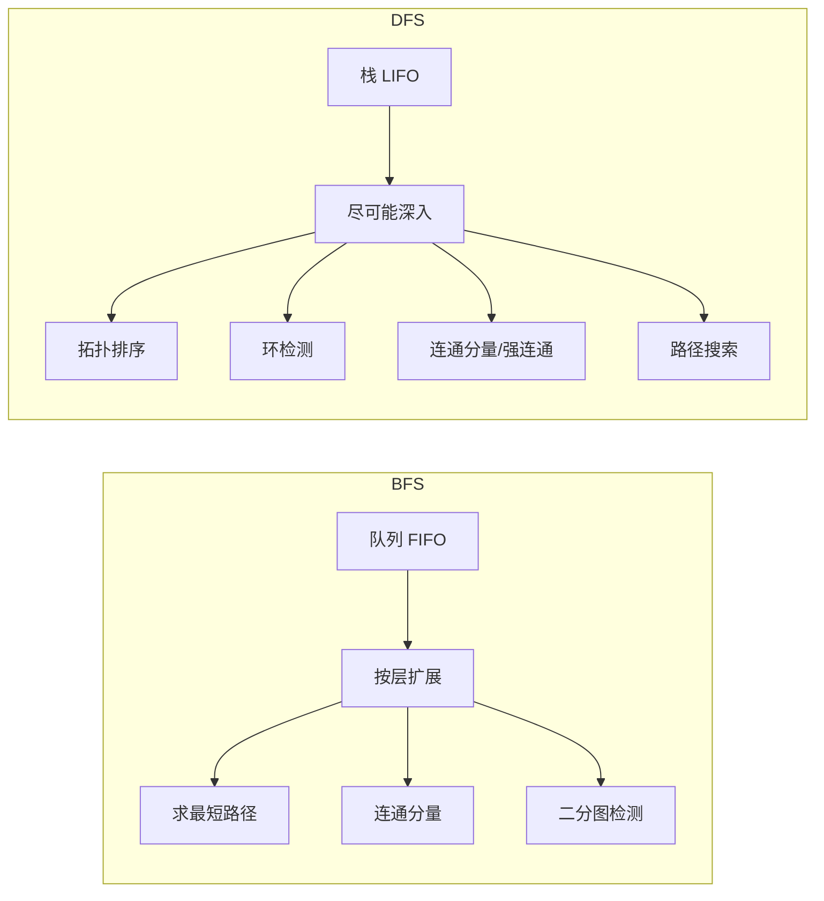
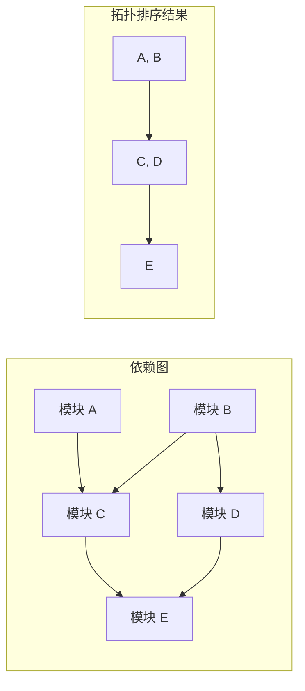
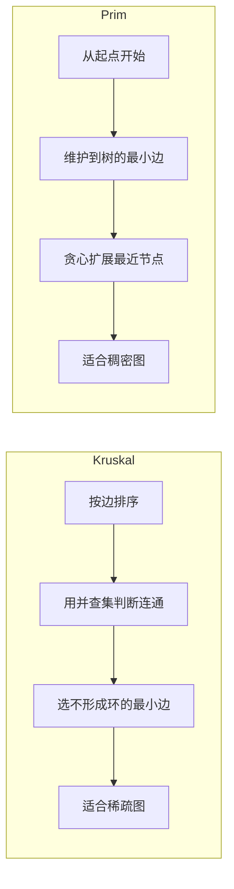
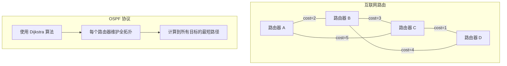

图是计算机科学中最灵活的数据结构之一——它可以建模社交网络、交通路线、依赖关系、状态转移……几乎所有"事物之间的关系"都可以用图来表示。本文将系统梳理图的核心算法：从基础的 BFS/DFS 到最短路径、拓扑排序、最小生成树和连通性分析，并探讨它们在工程实践中的应用。

---

## 一、图的表示方法

### 1.1 邻接矩阵 vs 邻接表

```mermaid
graph TD
    subgraph 邻接矩阵
        A[二维数组 adj[n][n]]
        A --> B[adj[i][j] = 1 表示有边]
        B --> C[空间: O(n²)]
        C --> D[查询 O(1)]
        D --> E[适合稠密图]
    end

    subgraph 邻接表
        F[数组 + 链表/动态数组]
        F --> G[adj[i] 存储 i 的所有邻居]
        G --> H[空间: O(n + m)]
        H --> I[遍历邻居高效]
        I --> J[适合稀疏图]
    end

    A -.对比.-> F
```

```python
# 邻接矩阵 — 稠密图
class GraphMatrix:
    def __init__(self, n):
        self.n = n
        self.adj = [[0] * n for _ in range(n)]

    def add_edge(self, u, v, weight=1):
        self.adj[u][v] = weight

    def has_edge(self, u, v):
        return self.adj[u][v] != 0


# 邻接表 — 稀疏图
from collections import defaultdict, deque

class GraphList:
    def __init__(self):
        self.adj = defaultdict(list)

    def add_edge(self, u, v, weight=1):
        self.adj[u].append((v, weight))

    def neighbors(self, u):
        return self.adj[u]
```

### 1.2 空间复杂度对比

| 维度 | 邻接矩阵 | 邻接表 |
|------|---------|--------|
| 空间复杂度 | O(n²) | O(n + m) |
| 查询是否有边 | O(1) | O(degree(v)) |
| 遍历所有邻居 | O(n) | O(degree(v)) |
| 添加边 | O(1) | O(1) |
| 删除边 | O(1) | O(degree(v)) |
| 适用场景 | 稠密图 (m ≈ n²) | 稀疏图 (m ≪ n²) |

> 其中 n 为顶点数，m 为边数

---

## 二、BFS 与 DFS

### 2.1 BFS（广度优先搜索）

```python
def bfs(graph, start):
    """BFS — 层序遍历，求无权图最短路径"""
    visited = set()
    queue = deque([start])
    visited.add(start)
    order = []

    while queue:
        node = queue.popleft()
        order.append(node)
        for neighbor, _ in graph.neighbors(node):
            if neighbor not in visited:
                visited.add(neighbor)
                queue.append(neighbor)

    return order

def bfs_shortest_path(graph, start, end):
    """BFS 求无权图最短路径"""
    visited = {start}
    queue = deque([(start, [start])])

    while queue:
        node, path = queue.popleft()
        if node == end:
            return path
        for neighbor, _ in graph.neighbors(node):
            if neighbor not in visited:
                visited.add(neighbor)
                queue.append((neighbor, path + [neighbor]))

    return None  # 不可达
```

### 2.2 DFS（深度优先搜索）

```python
def dfs_recursive(graph, node, visited=None):
    """DFS — 递归实现"""
    if visited is None:
        visited = set()
    visited.add(node)
    for neighbor, _ in graph.neighbors(node):
        if neighbor not in visited:
            dfs_recursive(graph, neighbor, visited)
    return visited

def dfs_iterative(graph, start):
    """DFS — 迭代实现（使用栈）"""
    visited = set()
    stack = [start]
    order = []

    while stack:
        node = stack.pop()
        if node in visited:
            continue
        visited.add(node)
        order.append(node)
        # 逆序入栈，保证左子树先访问
        for neighbor, _ in reversed(graph.neighbors(node)):
            if neighbor not in visited:
                stack.append(neighbor)

    return order
```

### 2.3 BFS vs DFS 对比



| 维度 | BFS | DFS |
|------|-----|-----|
| 数据结构 | 队列 | 栈（递归或显式） |
| 遍历策略 | 先访问所有邻居 | 深入一条路径到底 |
| 时间复杂度 | O(n + m) | O(n + m) |
| 空间复杂度 | O(n) 最坏（最后一层） | O(n) 最坏（路径长度） |
| 最短路径（无权） | ✅ 天然保证 | ❌ 需要回溯 |
| 内存消耗（宽树） | 可能很高 | 较低 |
| 典型应用 | 最短路径、层序遍历 | 拓扑排序、回溯、环检测 |

---

## 三、拓扑排序

拓扑排序适用于**有向无环图（DAG）**，输出一个线性序列，使得对于每条有向边 u → v，u 在序列中都出现在 v 之前。

### 3.1 Kahn 算法（基于入度）

```python
def topological_sort_kahn(graph, n):
    """Kahn 算法 — 基于入度的拓扑排序"""
    in_degree = [0] * n
    for u in graph:
        for v, _ in graph[u]:
            in_degree[v] += 1

    queue = deque([i for i in range(n) if in_degree[i] == 0])
    result = []

    while queue:
        node = queue.popleft()
        result.append(node)
        for neighbor, _ in graph.get(node, []):
            in_degree[neighbor] -= 1
            if in_degree[neighbor] == 0:
                queue.append(neighbor)

    if len(result) != n:
        return None  # 存在环，无法拓扑排序
    return result
```

### 3.2 基于 DFS 的拓扑排序

```python
def topological_sort_dfs(graph, n):
    """基于 DFS 的拓扑排序"""
    visited = set()
    stack = []
    has_cycle = False

    def dfs(node, rec_stack):
        nonlocal has_cycle
        visited.add(node)
        rec_stack.add(node)

        for neighbor, _ in graph.get(node, []):
            if neighbor in rec_stack:
                has_cycle = True
                return
            if neighbor not in visited:
                dfs(neighbor, rec_stack)

        rec_stack.remove(node)
        stack.append(node)

    for i in range(n):
        if i not in visited:
            dfs(i, set())

    if has_cycle:
        return None
    return stack[::-1]  # 反转得到拓扑序
```

### 3.3 工程应用：依赖解析



**实际场景**：
- **构建系统**：Makefile、Bazel 中模块的编译顺序
- **包管理器**：npm、pip 的安装依赖顺序
- **任务调度**：Airflow 中 DAG 的执行顺序
- **课程安排**：先修课程依赖关系

```python
# 课程安排问题（LeetCode 207）
def can_finish(num_courses, prerequisites):
    """判断是否可以完成所有课程"""
    graph = defaultdict(list)
    in_degree = [0] * num_courses

    for course, prereq in prerequisites:
        graph[prereq].append(course)
        in_degree[course] += 1

    queue = deque([i for i in range(num_courses) if in_degree[i] == 0])
    count = 0

    while queue:
        course = queue.popleft()
        count += 1
        for next_course in graph[course]:
            in_degree[next_course] -= 1
            if in_degree[next_course] == 0:
                queue.append(next_course)

    return count == num_courses
```

---

## 四、单源最短路径

### 4.1 Dijkstra 算法（贪心）

```python
import heapq

def dijkstra(graph, start, n):
    """Dijkstra 算法 — 不可有负权边"""
    dist = [float('inf')] * n
    dist[start] = 0
    pq = [(0, start)]  # (distance, node)
    prev = [-1] * n    # 用于回溯路径

    while pq:
        d, u = heapq.heappop(pq)

        if d > dist[u]:
            continue  # 已找到更短路径

        for v, weight in graph.get(u, []):
            new_dist = dist[u] + weight
            if new_dist < dist[v]:
                dist[v] = new_dist
                prev[v] = u
                heapq.heappush(pq, (new_dist, v))

    return dist, prev

def reconstruct_path(prev, start, end):
    path = []
    curr = end
    while curr != -1:
        path.append(curr)
        curr = prev[curr]
    return path[::-1] if path[0] == start else []
```

```mermaid
flowchart TD
    A[初始化: dist[start]=0, 其他=∞] --> B[优先队列 pq = (0, start)]
    B --> C{pq 为空?}
    C -->|是| D[算法结束]
    C -->|否| E[弹出最小距离节点 u]
    E --> F{dist[u] < 弹出距离?}
    F -->|是| C
    F -->|否| G[遍历 u 的所有邻居 v]
    G --> H{dist[u] + w < dist[v]?}
    H -->|是| I[更新 dist[v] = dist[u] + w]
    I --> J[prev[v] = u]
    J --> K[pq.push(dist[v], v)]
    K --> C
    H -->|否| C
```

### 4.2 Bellman-Ford 算法（支持负权）

```python
def bellman_ford(graph, start, n, edges):
    """Bellman-Ford 算法 — 可处理负权边，可检测负权环"""
    dist = [float('inf')] * n
    dist[start] = 0

    # 松弛 n-1 轮
    for i in range(n - 1):
        updated = False
        for u, v, w in edges:
            if dist[u] != float('inf') and dist[u] + w < dist[v]:
                dist[v] = dist[u] + w
                updated = True
        if not updated:
            break  # 提前终止

    # 检测负权环：第 n 轮还能更新说明有负权环
    for u, v, w in edges:
        if dist[u] != float('inf') and dist[u] + w < dist[v]:
            return None, True  # 存在负权环

    return dist, False
```

### 4.3 SPFA 算法（队列优化）

```python
def spfa(graph, start, n):
    """SPFA — 队列优化的 Bellman-Ford"""
    dist = [float('inf')] * n
    dist[start] = 0
    in_queue = [False] * n
    queue = deque([start])
    in_queue[start] = True
    count = [0] * n  # 记录入队次数，用于检测负权环
    count[start] = 1

    while queue:
        u = queue.popleft()
        in_queue[u] = False

        for v, w in graph.get(u, []):
            if dist[u] + w < dist[v]:
                dist[v] = dist[u] + w
                if not in_queue[v]:
                    queue.append(v)
                    in_queue[v] = True
                    count[v] += 1
                    if count[v] >= n:
                        return None  # 负权环

    return dist
```

### 4.4 单源最短路径算法对比

```mermaid
graph TD
    subgraph 算法选择决策树
        A[有负权边?] -->|是| B[Bellman-Ford 或 SPFA]
        A -->|否| C[Dijkstra]
        B --> D{需要检测负权环?}
        D -->|是| E[Bellman-Ford]
        D -->|否| F[SPFA]
        C --> G[标准优先队列 Dijkstra]
        G --> H[时间 O((n+m)log n)]
        E --> I[时间 O(nm)]
        F --> J[平均 O(m) 最坏 O(nm)]
    end
```

| 维度 | Dijkstra | Bellman-Ford | SPFA |
|------|---------|-------------|------|
| 负权边 | ❌ 不支持 | ✅ 支持 | ✅ 支持 |
| 负权环检测 | ❌ | ✅ | ✅ |
| 时间复杂度 | O((n+m) log n) | O(nm) | 平均 O(m)，最坏 O(nm) |
| 空间复杂度 | O(n + m) | O(n + m) | O(n + m) |
| 实现难度 | 中（需要优先队列） | 简单 | 中 |
| 实际性能 | 稳定高效 | 较慢 | 通常快但不稳定 |
| 适用场景 | 无负权的标准场景 | 有负权或需要环检测 | 稀疏图，无负权环 |

---

## 五、多源最短路径：Floyd-Warshall

```python
def floyd_warshall(n, edges):
    """Floyd-Warshall 算法 — 所有点对最短路径"""
    dist = [[float('inf')] * n for _ in range(n)]

    for i in range(n):
        dist[i][i] = 0
    for u, v, w in edges:
        dist[u][v] = w

    for k in range(n):
        for i in range(n):
            for j in range(n):
                dist[i][j] = min(dist[i][j], dist[i][k] + dist[k][j])

    return dist
```

```mermaid
graph TD
    A[Floyd-Warshall] --> B[三重循环 k, i, j]
    B --> C[k 代表中间节点]
    C --> D[dist[i][j] = min(dist[i][j], dist[i][k]+dist[k][j])]
    D --> E[经过 k 轮迭代后<br/>dist[i][j] 为 i 到 j 的最短路径]

    E --> F[优点: 代码简洁]
    E --> G[缺点: O(n³) 只适合小规模]
    E --> H[可检测负权环: dist[i][i] < 0]
```

**适用场景**：
- 节点数较少（n ≤ 500）
- 需要所有点对的最短路径
- 需要传递闭包（可达性矩阵）

---

## 六、最小生成树

### 6.1 Kruskal 算法（并查集）

```python
class UnionFind:
    def __init__(self, n):
        self.parent = list(range(n))
        self.rank = [0] * n

    def find(self, x):
        if self.parent[x] != x:
            self.parent[x] = self.find(self.parent[x])  # 路径压缩
        return self.parent[x]

    def union(self, x, y):
        px, py = self.find(x), self.find(y)
        if px == py:
            return False
        if self.rank[px] < self.rank[py]:
            px, py = py, px
        self.parent[py] = px
        if self.rank[px] == self.rank[py]:
            self.rank[px] += 1
        return True

def kruskal(n, edges):
    """Kruskal 算法 — 按边权重从小到大"""
    edges.sort(key=lambda x: x[2])  # 按权重排序
    uf = UnionFind(n)
    mst = []
    total_weight = 0

    for u, v, w in edges:
        if uf.union(u, v):
            mst.append((u, v, w))
            total_weight += w
            if len(mst) == n - 1:
                break

    return mst, total_weight
```

### 6.2 Prim 算法

```python
import heapq

def prim(n, graph):
    """Prim 算法 — 从起点逐步扩展"""
    visited = set()
    mst = []
    total_weight = 0
    # (weight, u, v) — 到 v 的边权，来自 u
    pq = [(0, -1, 0)]  # 从节点 0 开始

    while pq and len(visited) < n:
        w, u, v = heapq.heappop(pq)
        if v in visited:
            continue
        visited.add(v)
        if u != -1:
            mst.append((u, v, w))
            total_weight += w

        for neighbor, weight in graph.get(v, []):
            if neighbor not in visited:
                heapq.heappush(pq, (weight, v, neighbor))

    return mst, total_weight
```

### 6.3 Kruskal vs Prim 对比



| 维度 | Kruskal | Prim |
|------|---------|------|
| 核心思想 | 按边权重排序，选不形成环的边 | 从起点扩展，每次选最近节点 |
| 数据结构 | 并查集 | 优先队列 |
| 时间复杂度 | O(m log m) | O((n + m) log n) |
| 空间复杂度 | O(m + n) | O(n + m) |
| 适合场景 | 稀疏图（m 较小） | 稠密图（m ≈ n²） |
| 起始节点依赖 | 无 | 有（结果相同但过程不同） |

---

## 七、强连通分量：Tarjan 算法

```python
def tarjan_scc(graph, n):
    """Tarjan 算法求强连通分量"""
    dfn = [-1] * n    # DFS 序
    low = [-1] * n    # 能追溯到的最早节点
    stack = []
    on_stack = [False] * n
    sccs = []
    timer = [0]

    def dfs(u):
        dfn[u] = low[u] = timer[0]
        timer[0] += 1
        stack.append(u)
        on_stack[u] = True

        for v, _ in graph.get(u, []):
            if dfn[v] == -1:
                dfs(v)
                low[u] = min(low[u], low[v])
            elif on_stack[v]:
                low[u] = min(low[u], dfn[v])

        if low[u] == dfn[u]:
            scc = []
            while True:
                v = stack.pop()
                on_stack[v] = False
                scc.append(v)
                if u == v:
                    break
            sccs.append(scc)

    for i in range(n):
        if dfn[i] == -1:
            dfs(i)

    return sccs
```

```mermaid
graph TD
    A[Tarjan 算法] --> B[DFS 遍历]
    B --> C[记录 dfn 和 low]
    C --> D[dfn: DFS 访问顺序]
    C --> E[low: 通过回边能到达的最小 dfn]
    E --> F{low[u] == dfn[u]?}
    F -->|是| G[u 是一个 SCC 的根]
    G --> H[弹出栈中直到 u 的所有节点]
    F -->|否| I[继续遍历]
```

**强连通分量（SCC）**：有向图中，任意两个节点互相可达的极大子图。

**应用场景**：
- **社交网络分析**：找到紧密联系的群体
- **程序依赖分析**：检测循环依赖
- **2-SAT 问题**：判断布尔公式可满足性

---

## 八、工程实践应用

### 8.1 路由协议中的最短路径



**OSPF（开放最短路径优先）** 协议：
- 每个路由器维护整个网络的拓扑图
- 使用 Dijkstra 算法计算到每个目标的最短路径
- 链路变化时重新计算（收敛）

### 8.2 社交网络分析

```python
# 六度分隔理论验证 — BFS 找最短社交距离
def social_distance(graph, person_a, person_b):
    """计算两个人之间的最短社交距离"""
    if person_a == person_b:
        return 0

    visited = {person_a}
    queue = deque([(person_a, 0)])

    while queue:
        person, dist = queue.popleft()
        for friend in graph.get(person, []):
            if friend == person_b:
                return dist + 1
            if friend not in visited:
                visited.add(friend)
                queue.append((friend, dist + 1))

    return -1  # 无连接
```

### 8.3 任务调度与拓扑排序

```python
# 实际场景：构建系统的任务调度
class TaskScheduler:
    def __init__(self):
        self.graph = defaultdict(list)
        self.in_degree = defaultdict(int)
        self.tasks = set()

    def add_task(self, task, dependencies):
        self.tasks.add(task)
        for dep in dependencies:
            self.graph[dep].append(task)
            self.in_degree[task] += 1
            self.tasks.add(dep)

    def schedule(self):
        """返回任务的执行顺序"""
        queue = deque([t for t in self.tasks if self.in_degree[t] == 0])
        order = []

        while queue:
            task = queue.popleft()
            order.append(task)
            for next_task in self.graph[task]:
                self.in_degree[next_task] -= 1
                if self.in_degree[next_task] == 0:
                    queue.append(next_task)

        if len(order) != len(self.tasks):
            raise ValueError("存在循环依赖，无法调度")

        return order
```

---

## 九、面试 Q&A

### Q1: Dijkstra 算法为什么不能处理负权边？

**A**: Dijkstra 基于贪心思想：一旦一个节点被标记为"已访问"（从优先队列弹出），它的最短距离就确定了。但如果存在负权边，后续可能通过负权边找到更短的路径，而此时该节点已经被标记为已访问，不会再被更新。

```
示例:
A → B: 2    (Dijkstra 先选 A, dist[B]=2)
B → C: -5   (dist[C] = 2 + (-5) = -3)
A → C: 4    (但 Dijkstra 可能已确定 dist[C]=4)
```

**解决方案**：使用 Bellman-Ford 或 SPFA。

### Q2: 如何判断一个图是否有环？

**A**: 
- **无向图**：用 DFS 或并查集。DFS 中如果发现回边（连接到已访问的祖先节点）则有环。
- **有向图**：用 DFS + 递归栈。如果 DFS 过程中访问到当前递归栈中的节点，则有环。或者用 Kahn 算法：如果拓扑排序后节点数少于总数，则有环。

```python
def has_cycle_directed(graph, n):
    """有向图环检测"""
    visited = set()
    rec_stack = set()

    def dfs(node):
        visited.add(node)
        rec_stack.add(node)
        for neighbor in graph.get(node, []):
            if neighbor in rec_stack:
                return True
            if neighbor not in visited:
                if dfs(neighbor):
                    return True
        rec_stack.remove(node)
        return False

    for i in range(n):
        if i not in visited:
            if dfs(i):
                return True
    return False
```

### Q3: Floyd-Warshall 的时间复杂度是 O(n³)，有什么优化方法？

**A**: 
1. **并行化**：三重循环的内两层可以并行
2. **分块（Blocking）**：提高缓存命中率
3. **位运算优化**：对于传递闭包（只关心可达性），可以用 bitset 优化
4. **Johnson 算法**：对于稀疏图，对每个节点运行 Dijkstra，时间复杂度 O(nm log n)

```python
# 传递闭包的 bitset 优化（Python 用 int 模拟 bitset）
def transitive_closure(n, edges):
    reach = [0] * n
    for u, v in edges:
        reach[u] |= (1 << v)
    for i in range(n):
        reach[i] |= (1 << i)  # 自反性

    for k in range(n):
        for i in range(n):
            if reach[i] & (1 << k):
                reach[i] |= reach[k]

    return reach
```

### Q4: 最小生成树是否唯一？什么情况下不唯一？

**A**: 最小生成树**不一定唯一**。当存在权重相同的边时，可能有多个不同的 MST。

**判断唯一性的方法**：
- 对每条不在 MST 中的边 (u, v)，检查 MST 中 u 到 v 路径上的最大边权重是否等于该边的权重。如果相等，则 MST 不唯一。

### Q5: BFS 和 DFS 在空间复杂度上有什么本质区别？

**A**: 
- **BFS** 的空间复杂度取决于树的**宽度**，在最坏情况下（如星型图），需要 O(n) 空间存储队列。
- **DFS** 的空间复杂度取决于树的**深度**，在最坏情况下（如链状图），需要 O(n) 空间存储递归栈。

**实际选择**：
- 如果图比较"宽"（分支多），DFS 更省空间
- 如果图比较"深"（链长），BFS 更省空间
- 求最短路径必须用 BFS

### Q6: Tarjan 算法中的 dfn 和 low 有什么区别？

**A**: 
- **dfn[u]**：节点 u 的 DFS 访问时间戳（第几个被访问的）
- **low[u]**：从 u 出发，通过 DFS 树边和回边能到达的**最小 dfn 值**

关键公式：
```
low[u] = min(
    dfn[u],                           # 自身
    dfn[v]         for 回边 (u, v),   # 通过后向边
    low[v]         for 树边 (u, v)    # 通过子树
)
```

当 `low[u] == dfn[u]` 时，说明 u 无法到达任何比它更早访问的节点，u 就是一个强连通分量的"根"。

---

## 十、总结

图算法是面试和工程中都极其重要的知识点。核心算法的选择原则：

| 问题 | 推荐算法 |
|------|---------|
| 无权图最短路径 | BFS |
| 无负权最短路径 | Dijkstra |
| 有负权最短路径 | Bellman-Ford / SPFA |
| 所有点对最短路径 | Floyd-Warshall（小图）/ Johnson（大图） |
| 最小生成树 | Kruskal（稀疏）/ Prim（稠密） |
| 依赖排序 | 拓扑排序（Kahn 或 DFS） |
| 环检测 | DFS / 拓扑排序 |
| 强连通分量 | Tarjan |

掌握这些算法的原理和适用场景，是解决复杂工程问题的基础。
